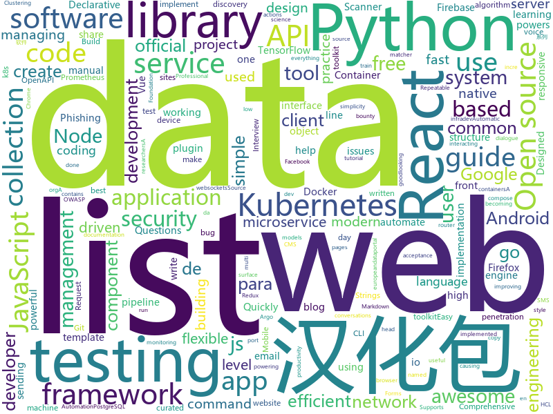

# 2020-01-24
See what the GitHub community is most excited about today.

## python
* [public-apis](https://github.com/public-apis/public-apis)(**61 stars today**): A collective list of free APIs for use in software and web development.
* [dash](https://github.com/plotly/dash)(**12 stars today**): Analytical Web Apps for Python & R. No JavaScript Required.
* [flax](https://github.com/google-research/flax)(**86 stars today**): 
* [Python](https://github.com/TheAlgorithms/Python)(**68 stars today**): All Algorithms implemented in Python
* [ignite](https://github.com/pytorch/ignite)(**4 stars today**): High-level library to help with training neural networks in PyTorch
* [aws-cli](https://github.com/aws/aws-cli)(**10 stars today**): Universal Command Line Interface for Amazon Web Services
* [metaflow](https://github.com/Netflix/metaflow)(**16 stars today**): Build and manage real-life data science projects with ease.
* [wagtail](https://github.com/wagtail/wagtail)(**8 stars today**): A Django content management system focused on flexibility and user experience
* [TBomb](https://github.com/TheSpeedX/TBomb)(**5 stars today**): This is a SMS And Call Bomber For Linux And Termux
* [protonvpn-cli-ng](https://github.com/ProtonVPN/protonvpn-cli-ng)(**24 stars today**): Linux command-line client for ProtonVPN. Written in Python.
* [readthedocs.org](https://github.com/readthedocs/readthedocs.org)(**5 stars today**): The source code that powers readthedocs.org
* [kedro](https://github.com/quantumblacklabs/kedro)(**4 stars today**): A Python library that implements software engineering best-practice for data and ML pipelines.
* [stylegan2](https://github.com/NVlabs/stylegan2)(**11 stars today**): StyleGAN2 - Official TensorFlow Implementation
* [rasa](https://github.com/RasaHQ/rasa)(**45 stars today**): 💬Open source machine learning framework to automate text- and voice-based conversations: NLU, dialogue management, connect to Slack, Facebook, and more - Create chatbots and voice assistants
* [ckan](https://github.com/ckan/ckan)(**1 stars today**): CKAN is an open-source DMS (data management system) for powering data hubs and data portals. CKAN makes it easy to publish, share and use data. It powers datahub.io, catalog.data.gov and europeandataportal.eu/data/en/dataset among many other sites.
* [ambassador](https://github.com/datawire/ambassador)(**4 stars today**): open source Kubernetes-native API gateway for microservices built on the Envoy Proxy
* [google-api-python-client](https://github.com/googleapis/google-api-python-client)(**7 stars today**): 🐍The official Python client library for Google's discovery based APIs.
* [big-list-of-naughty-strings](https://github.com/minimaxir/big-list-of-naughty-strings)(**27 stars today**): The Big List of Naughty Strings is a list of strings which have a high probability of causing issues when used as user-input data.
* [dnstwist](https://github.com/elceef/dnstwist)(**5 stars today**): Domain name permutation engine for detecting typo squatting, phishing and corporate espionage
* [black](https://github.com/psf/black)(**15 stars today**): The uncompromising Python code formatter
* [flair](https://github.com/flairNLP/flair)(**9 stars today**): A very simple framework for state-of-the-art Natural Language Processing (NLP)
* [TensorFlow-Lite-Object-Detection-on-Android-and-Raspberry-Pi](https://github.com/EdjeElectronics/TensorFlow-Lite-Object-Detection-on-Android-and-Raspberry-Pi)(**3 stars today**): A tutorial showing how to train, convert, and run TensorFlow Lite object detection models on Android devices, the Raspberry Pi, and more!
* [scrapy](https://github.com/scrapy/scrapy)(**17 stars today**): Scrapy, a fast high-level web crawling & scraping framework for Python.
* [pandas](https://github.com/pandas-dev/pandas)(**23 stars today**): Flexible and powerful data analysis / manipulation library for Python, providing labeled data structures similar to R data.frame objects, statistical functions, and much more
* [the-gan-zoo](https://github.com/hindupuravinash/the-gan-zoo)(**40 stars today**): A list of all named GANs!

## unknown
* [backendlore](https://github.com/fpereiro/backendlore)(**720 stars today**): How I write backends
* [the-book-of-secret-knowledge](https://github.com/trimstray/the-book-of-secret-knowledge)(**516 stars today**): A collection of inspiring lists, manuals, cheatsheets, blogs, hacks, one-liners, cli/web tools and more.
* [awesome-react](https://github.com/enaqx/awesome-react)(**98 stars today**): A collection of awesome things regarding React ecosystem
* [DevYouTubeList](https://github.com/ErikCH/DevYouTubeList)(**30 stars today**): List of Development YouTube Channels
* [howto-make-more-money](https://github.com/easychen/howto-make-more-money)(**223 stars today**): 程序员如何优雅的挣零花钱
* [Awesome-Hacking](https://github.com/Hack-with-Github/Awesome-Hacking)(**106 stars today**): A collection of various awesome lists for hackers, pentesters and security researchers
* [gitignore](https://github.com/github/gitignore)(**107 stars today**): A collection of useful .gitignore templates
* [vagas](https://github.com/frontendbr/vagas)(**6 stars today**): 🔬Espaço para divulgação de vagas para front-enders.
* [reactjs-interview-questions](https://github.com/sudheerj/reactjs-interview-questions)(**13 stars today**): List of top 500 ReactJS Interview Questions & Answers....Coding exercise questions are coming soon!!
* [Bug-bounty](https://github.com/sehno/Bug-bounty)(**51 stars today**): Ressources for bug bounty hunting
* [magisk_files](https://github.com/topjohnwu/magisk_files)(**3 stars today**): Magisk File Host
* [developer-roadmap](https://github.com/kamranahmedse/developer-roadmap)(**105 stars today**): Roadmap to becoming a web developer in 2020
* [eng-handbook](https://github.com/raylene/eng-handbook)(**23 stars today**): A developer's guide to management: an open-sourced handbook for leading software engineering teams.
* [kubernetes-network-policy-recipes](https://github.com/ahmetb/kubernetes-network-policy-recipes)(**4 stars today**): Example recipes for Kubernetes Network Policies that you can just copy paste
* [amundsen](https://github.com/lyft/amundsen)(**4 stars today**): Amundsen is a metadata driven application for improving the productivity of data analysts, data scientists and engineers when interacting with data.
* [prometheus](https://github.com/vegasbrianc/prometheus)(**7 stars today**): A docker-compose stack for Prometheus monitoring
* [HEAD](https://github.com/joshbuchea/HEAD)(**21 stars today**): 🗿A list of everything that *could* go in the head of your document
* [xamarin-forms-goodlooking-UI](https://github.com/jsuarezruiz/xamarin-forms-goodlooking-UI)(**4 stars today**): Xamarin.Forms goodlooking UI samples
* [awesome-actions](https://github.com/sdras/awesome-actions)(**19 stars today**): A curated list of awesome actions to use on GitHub
* [styleguides](https://github.com/SAP/styleguides)(**5 stars today**): This repository provides SAP style guides for coding.
* [javascript-interview-questions](https://github.com/sudheerj/javascript-interview-questions)(**5 stars today**): List of 1000 JavaScript Interview Questions
* [for-win](https://github.com/docker/for-win)(**4 stars today**): Bug reports for Docker Desktop for Windows
* [OpenAPI-Specification](https://github.com/OAI/OpenAPI-Specification)(**13 stars today**): The OpenAPI Specification Repository
* [postman-app-support](https://github.com/postmanlabs/postman-app-support)(**2 stars today**): Postman helps you be more efficient while working with APIs. Using Postman, you can construct complex HTTP requests quickly, organize them in collections and share them with your co-workers.
* [wstg](https://github.com/OWASP/wstg)(**6 stars today**): The OWASP Web Security Testing Guide includes a "best practice" penetration testing framework which users can implement in their own organizations and a "low level" penetration testing guide that describes techniques for testing most common web application and web service security issues.

## javascript
* [playwright](https://github.com/microsoft/playwright)(**2,864 stars today**): Node library to automate Chromium, Firefox and WebKit browsers
* [city-roads](https://github.com/anvaka/city-roads)(**519 stars today**): Visualization of all roads within any city
* [30DaysOfJavaScript](https://github.com/Asabeneh/30DaysOfJavaScript)(**49 stars today**): A 30 days of JavaScript programming challenge
* [awx](https://github.com/ansible/awx)(**8 stars today**): AWX Project
* [react-native-firebase](https://github.com/invertase/react-native-firebase)(**5 stars today**): 🔥A well-tested feature-rich modular Firebase implementation for React Native. Supports both iOS & Android platforms for all Firebase services.
* [theme-ui](https://github.com/system-ui/theme-ui)(**8 stars today**): Build consistent, themeable React apps based on constraint-based design principles
* [gatsby](https://github.com/gatsbyjs/gatsby)(**42 stars today**): Build blazing fast, modern apps and websites with React
* [Leaflet.markercluster](https://github.com/Leaflet/Leaflet.markercluster)(**2 stars today**): Marker Clustering plugin for Leaflet
* [mapbox-gl-js](https://github.com/mapbox/mapbox-gl-js)(**5 stars today**): Interactive, thoroughly customizable maps in the browser, powered by vector tiles and WebGL
* [semana-omnistack-10](https://github.com/Rocketseat/semana-omnistack-10)(**12 stars today**): Código da aplicação desenvolvida durante a Semana OmniStack 10.0🚀
* [awesome-selfhosted](https://github.com/awesome-selfhosted/awesome-selfhosted)(**70 stars today**): A list of Free Software network services and web applications which can be hosted locally. Selfhosting is the process of hosting and managing applications instead of renting from Software-as-a-Service providers
* [amphtml](https://github.com/ampproject/amphtml)(**2 stars today**): The AMP web component framework.
* [strapi](https://github.com/strapi/strapi)(**32 stars today**): 🚀Open source Node.js Headless CMS to easily build customisable APIs
* [react-router](https://github.com/ReactTraining/react-router)(**21 stars today**): Declarative routing for React
* [umbriel](https://github.com/Rocketseat/umbriel)(**33 stars today**): 📪Mail sending microservice with Node.js, TypeScript and MongoDB
* [enzyme](https://github.com/airbnb/enzyme)(**6 stars today**): JavaScript Testing utilities for React
* [react-leaflet](https://github.com/PaulLeCam/react-leaflet)(**3 stars today**): ⚛️React components for🍃Leaflet maps
* [awesome-uses](https://github.com/wesbos/awesome-uses)(**53 stars today**): A list of /uses pages detailing developer setups, gear, software and configs.
* [markdown-here](https://github.com/adam-p/markdown-here)(**39 stars today**): Google Chrome, Firefox, and Thunderbird extension that lets you write email in Markdown and render it before sending.
* [react-popper](https://github.com/popperjs/react-popper)(**10 stars today**): React wrapper around Popper.js (official)
* [react](https://github.com/facebook/react)(**55 stars today**): A declarative, efficient, and flexible JavaScript library for building user interfaces.
* [create-react-app](https://github.com/facebook/create-react-app)(**35 stars today**): Set up a modern web app by running one command.
* [realtime](https://github.com/supabase/realtime)(**35 stars today**): Listen to your to PostgreSQL database in realtime via websockets
* [pro-react-redux](https://github.com/Juriy/pro-react-redux)(**3 stars today**): Source code for Pro React Redux online course
* [vue-enterprise-boilerplate](https://github.com/chrisvfritz/vue-enterprise-boilerplate)(**20 stars today**): An ever-evolving, very opinionated architecture and dev environment for new Vue SPA projects using Vue CLI 3.

## html
* [machine-learning-systems-design](https://github.com/chiphuyen/machine-learning-systems-design)(**13 stars today**): A booklet on machine learning systems design with exercises
* [awesome-piracy](https://github.com/Igglybuff/awesome-piracy)(**112 stars today**): A curated list of awesome warez and piracy links
* [schemaorg](https://github.com/schemaorg/schemaorg)(**17 stars today**): Schema.org - schemas and (appengine) software
* [free-for-dev](https://github.com/ripienaar/free-for-dev)(**37 stars today**): A list of SaaS, PaaS and IaaS offerings that have free tiers of interest to devops and infradev
* [polyfill-service](https://github.com/Financial-Times/polyfill-service)(**3 stars today**): Automatic polyfill service.
* [training-kit](https://github.com/github/training-kit)(**4 stars today**): Open source cheat sheets for Git and GitHub
* [beginner-javascript](https://github.com/wesbos/beginner-javascript)(**9 stars today**): Slam Dunk JavaScript
* [web-moderno](https://github.com/cod3rcursos/web-moderno)(**7 stars today**): 
* [MSEdgeExplainers](https://github.com/MicrosoftEdge/MSEdgeExplainers)(**7 stars today**): Home for explainer documents originated by the Microsoft Edge team
* [csswg-drafts](https://github.com/w3c/csswg-drafts)(**3 stars today**): CSS Working Group Editor Drafts
* [responsive-html-email-template](https://github.com/leemunroe/responsive-html-email-template)(**4 stars today**): A free simple responsive HTML email template
* [foundation-sites](https://github.com/foundation/foundation-sites)(**5 stars today**): The most advanced responsive front-end framework in the world. Quickly create prototypes and production code for sites that work on any kind of device.
* [professional-services](https://github.com/GoogleCloudPlatform/professional-services)(**5 stars today**): Common solutions and tools developed by Google Cloud's Professional Services team
* [www-project-top-ten](https://github.com/OWASP/www-project-top-ten)(**2 stars today**): OWASP Foundation Web Respository
* [computer-science-flash-cards](https://github.com/jwasham/computer-science-flash-cards)(**0 stars today**): Mini website for testing both general CS knowledge and enforce coding practice and common algorithm/data structure memorization.
* [serenity-core](https://github.com/serenity-bdd/serenity-core)(**1 stars today**): Serenity BDD is a test automation library designed to make writing automated acceptance tests easier, and more fun.
* [sample-code](https://github.com/appium-boneyard/sample-code)(**0 stars today**): appium sample code (dotnet, java, node, perl, php, python, ruby, etc.)
* [owasp-mstg](https://github.com/OWASP/owasp-mstg)(**3 stars today**): The Mobile Security Testing Guide (MSTG) is a comprehensive manual for mobile app security development, testing and reverse engineering.
* [JavaScript30](https://github.com/wesbos/JavaScript30)(**7 stars today**): 30 Day Vanilla JS Challenge
* [hyperblog](https://github.com/freddier/hyperblog)(**6 stars today**): Un blog increíble para el curso de Git y Github de Platzi
* [ru.javascript.info](https://github.com/javascript-tutorial/ru.javascript.info)(**3 stars today**): Современный учебник JavaScript
* [swagger-codegen](https://github.com/swagger-api/swagger-codegen)(**6 stars today**): swagger-codegen contains a template-driven engine to generate documentation, API clients and server stubs in different languages by parsing your OpenAPI / Swagger definition.
* [en.javascript.info](https://github.com/javascript-tutorial/en.javascript.info)(**5 stars today**): Modern JavaScript Tutorial
* [TranslatorX](https://github.com/pingfangx/TranslatorX)(**11 stars today**): JetBrains 系列软件汉化包 关键字: Android Studio 3.5 汉化包 CLion 2019.3 汉化包 DataGrip 2019.3 汉化包 GoLand 2019.3 汉化包 IntelliJ IDEA 2019.3 汉化包 PhpStorm 2019.3 汉化包 PyCharm 2019.3 汉化包 Rider 2019.3 汉化包 RubyMine 2019.3 汉化包 WebStorm 2019.3 汉化包
* [MatBlazor](https://github.com/SamProf/MatBlazor)(**7 stars today**): Material Design components for Blazor and Razor Components

## go
* [sops](https://github.com/mozilla/sops)(**8 stars today**): Simple and flexible tool for managing secrets
* [telegraf](https://github.com/influxdata/telegraf)(**7 stars today**): The plugin-driven server agent for collecting & reporting metrics.
* [argo](https://github.com/argoproj/argo)(**11 stars today**): Argo Workflows: Get stuff done with Kubernetes.
* [atlantis](https://github.com/runatlantis/atlantis)(**5 stars today**): Terraform Pull Request Automation
* [pgx](https://github.com/jackc/pgx)(**7 stars today**): PostgreSQL driver and toolkit for Go
* [naabu](https://github.com/projectdiscovery/naabu)(**53 stars today**): A fast port scanner written in go with focus on reliability and simplicity. Designed to be used in combination with other tools for attack surface discovery in bug bounties and pentests
* [helm](https://github.com/helm/helm)(**16 stars today**): The Kubernetes Package Manager
* [kube-scan](https://github.com/octarinesec/kube-scan)(**81 stars today**): kube-scan: Octarine k8s cluster risk assessment tool
* [buildkit](https://github.com/moby/buildkit)(**4 stars today**): concurrent, cache-efficient, and Dockerfile-agnostic builder toolkit
* [skaffold](https://github.com/GoogleContainerTools/skaffold)(**13 stars today**): Easy and Repeatable Kubernetes Development
* [terraform-provider-aws](https://github.com/terraform-providers/terraform-provider-aws)(**5 stars today**): Terraform AWS provider
* [charts](https://github.com/helm/charts)(**16 stars today**): Curated applications for Kubernetes
* [trivy](https://github.com/aquasecurity/trivy)(**6 stars today**): A Simple and Comprehensive Vulnerability Scanner for Containers, Suitable for CI
* [cortex](https://github.com/cortexproject/cortex)(**8 stars today**): A horizontally scalable, highly available, multi-tenant, long term Prometheus.
* [mux](https://github.com/gorilla/mux)(**13 stars today**): A powerful HTTP router and URL matcher for building Go web servers with🦍
* [linuxkit](https://github.com/linuxkit/linuxkit)(**4 stars today**): A toolkit for building secure, portable and lean operating systems for containers
* [pipeline](https://github.com/tektoncd/pipeline)(**12 stars today**): A K8s-native Pipeline resource.
* [gophish](https://github.com/gophish/gophish)(**7 stars today**): Open-Source Phishing Toolkit
* [satellite](https://github.com/t94j0/satellite)(**18 stars today**): easy-to-use payload hosting
* [goa](https://github.com/goadesign/goa)(**4 stars today**): Design-based APIs and microservices in Go
* [origin](https://github.com/openshift/origin)(**7 stars today**): The self-managing, auto-upgrading, Kubernetes distribution for everyone
* [ingress-nginx](https://github.com/kubernetes/ingress-nginx)(**9 stars today**): NGINX Ingress Controller for Kubernetes
* [libpod](https://github.com/containers/libpod)(**10 stars today**): libpod is a library used to create container pods. Home of Podman.
* [hcl](https://github.com/hashicorp/hcl)(**3 stars today**): HCL is the HashiCorp configuration language.
* [argo-cd](https://github.com/argoproj/argo-cd)(**4 stars today**): Declarative continuous deployment for Kubernetes.

## WordCloud

