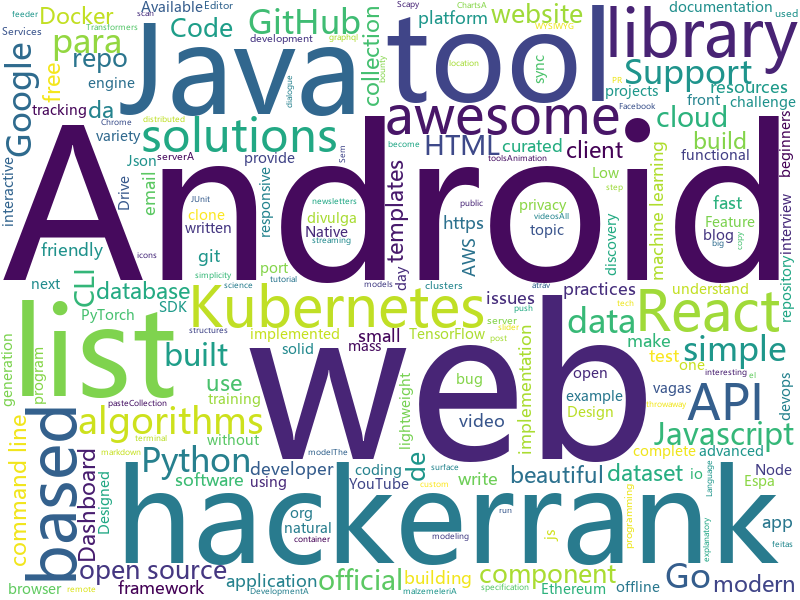

# 2020-01-25
See what the GitHub community is most excited about today.

## python
* [public-apis](https://github.com/public-apis/public-apis)(**114 stars today**): A collective list of free APIs for use in software and web development.
* [streamlit](https://github.com/streamlit/streamlit)(**24 stars today**): Streamlit — The fastest way to build custom ML tools
* [manim](https://github.com/3b1b/manim)(**16 stars today**): Animation engine for explanatory math videos
* [Python](https://github.com/TheAlgorithms/Python)(**58 stars today**): All Algorithms implemented in Python
* [fixmatch](https://github.com/google-research/fixmatch)(**19 stars today**): A simple method to perform semi-supervised learning with limited data.
* [scapy](https://github.com/secdev/scapy)(**10 stars today**): Scapy: the Python-based interactive packet manipulation program & library. Supports Python 2 & Python 3.
* [youtube-dl](https://github.com/ytdl-org/youtube-dl)(**46 stars today**): Command-line program to download videos from YouTube.com and other video sites
* [pupy](https://github.com/n1nj4sec/pupy)(**7 stars today**): Pupy is an opensource, cross-platform (Windows, Linux, OSX, Android) remote administration and post-exploitation tool mainly written in python
* [pytracking](https://github.com/visionml/pytracking)(**3 stars today**): Visual tracking library based on PyTorch.
* [Silver](https://github.com/s0md3v/Silver)(**3 stars today**): Mass scan IPs for vulnerable services
* [great_expectations](https://github.com/great-expectations/great_expectations)(**7 stars today**): Always know what to expect from your data.
* [transformers](https://github.com/huggingface/transformers)(**35 stars today**): 🤗Transformers: State-of-the-art Natural Language Processing for TensorFlow 2.0 and PyTorch.
* [ParlAI](https://github.com/facebookresearch/ParlAI)(**4 stars today**): A framework for training and evaluating AI models on a variety of openly available dialogue datasets.
* [YOLOv3_TensorFlow](https://github.com/wizyoung/YOLOv3_TensorFlow)(**2 stars today**): Complete YOLO v3 TensorFlow implementation. Support training on your own dataset.
* [google-api-python-client](https://github.com/googleapis/google-api-python-client)(**5 stars today**): 🐍The official Python client library for Google's discovery based APIs.
* [flax](https://github.com/google-research/flax)(**78 stars today**): 
* [EyeWitness](https://github.com/FortyNorthSecurity/EyeWitness)(**3 stars today**): EyeWitness is designed to take screenshots of websites, provide some server header info, and identify default credentials if possible.
* [pytest](https://github.com/pytest-dev/pytest)(**9 stars today**): The pytest framework makes it easy to write small tests, yet scales to support complex functional testing
* [inter](https://github.com/rsms/inter)(**13 stars today**): The Inter font family
* [causalml](https://github.com/uber/causalml)(**3 stars today**): Uplift modeling and causal inference with machine learning algorithms
* [localstack](https://github.com/localstack/localstack)(**17 stars today**): 💻A fully functional local AWS cloud stack. Develop and test your cloud & Serverless apps offline!
* [scikit-learn](https://github.com/scikit-learn/scikit-learn)(**14 stars today**): scikit-learn: machine learning in Python
* [twitterscraper](https://github.com/taspinar/twitterscraper)(**6 stars today**): Scrape Twitter for Tweets
* [instabot.py](https://github.com/instabot-py/instabot.py)(**3 stars today**): Instagram bot. It works without instagram api, need only login and password. Write on python.
* [django-rest-framework](https://github.com/encode/django-rest-framework)(**7 stars today**): Web APIs for Django.🎸

## java
* [quarkus](https://github.com/quarkusio/quarkus)(**10 stars today**): Quarkus: Supersonic Subatomic Java.
* [flurry](https://github.com/jonhoo/flurry)(**14 stars today**): A port of Java's ConcurrentHashMap to Rust
* [configuration-as-code-plugin](https://github.com/jenkinsci/configuration-as-code-plugin)(**4 stars today**): Jenkins Configuration as Code Plugin
* [AndroidTutorialForBeginners](https://github.com/hussien89aa/AndroidTutorialForBeginners)(**3 stars today**): Step by step to build Android apps using Android Studio
* [NewPipe](https://github.com/TeamNewPipe/NewPipe)(**32 stars today**): A libre lightweight streaming front-end for Android.
* [journaldev](https://github.com/journaldev/journaldev)(**3 stars today**): JournalDev Projects
* [jmeter](https://github.com/apache/jmeter)(**4 stars today**): Apache JMeter
* [aws-sdk-java-v2](https://github.com/aws/aws-sdk-java-v2)(**2 stars today**): The official AWS SDK for Java - Version 2
* [testcontainers-java](https://github.com/testcontainers/testcontainers-java)(**8 stars today**): Testcontainers is a Java library that supports JUnit tests, providing lightweight, throwaway instances of common databases, Selenium web browsers, or anything else that can run in a Docker container.
* [freelec-springboot2-webservice](https://github.com/jojoldu/freelec-springboot2-webservice)(**4 stars today**): 
* [besu](https://github.com/hyperledger/besu)(**2 stars today**): An enterprise-grade Java-based, Apache 2.0 licensed Ethereum client https://wiki.hyperledger.org/display/besu
* [jbang](https://github.com/maxandersen/jbang)(**4 stars today**): Use Java for shell scripting
* [micronaut-core](https://github.com/micronaut-projects/micronaut-core)(**9 stars today**): Micronaut Application Framework
* [Smoolider](https://github.com/astrit-veliu/Smoolider)(**2 stars today**): A beautiful smooth slider for Android.🐼🍀
* [XPrivacyLua](https://github.com/M66B/XPrivacyLua)(**1 stars today**): Really simple to use privacy manager for Android 6.0 Marshmallow and later
* [Hackerrank-Solutions](https://github.com/Java-aid/Hackerrank-Solutions)(**1 stars today**): hackerrank solutions github | hackerrank all solutions | hackerrank solutions for java | hackerrank video tutorial | hackerrank cracking the coding interview solutions | hackerrank data structures | hackerrank solutions algorithms | hackerrank challenge | hackerrank coding challenge | hackerrank algorithms solutions github| hackerrank problem so…
* [bc-java](https://github.com/bcgit/bc-java)(**2 stars today**): Bouncy Castle Java Distribution (Mirror)
* [okhttp](https://github.com/square/okhttp)(**7 stars today**): An HTTP client for Android, Kotlin, and Java.
* [debezium](https://github.com/debezium/debezium)(**6 stars today**): Change data capture for a variety of databases. https://debezium.io Please log issues in our JIRA at https://issues.jboss.org/projects/DBZ/issues
* [Algorithms](https://github.com/williamfiset/Algorithms)(**7 stars today**): A collection of algorithms and data structures
* [lucene-solr](https://github.com/apache/lucene-solr)(**2 stars today**): Apache Lucene and Solr open-source search software
* [volley](https://github.com/google/volley)(**2 stars today**): 
* [dropwizard](https://github.com/dropwizard/dropwizard)(**1 stars today**): A damn simple library for building production-ready RESTful web services.
* [presto](https://github.com/prestodb/presto)(**5 stars today**): The official home of the Presto distributed SQL query engine for big data
* [location-samples](https://github.com/android/location-samples)(**3 stars today**): Multiple samples showing the best practices in location APIs on Android.

## unknown
* [the-book-of-secret-knowledge](https://github.com/trimstray/the-book-of-secret-knowledge)(**1,004 stars today**): A collection of inspiring lists, manuals, cheatsheets, blogs, hacks, one-liners, cli/web tools and more.
* [backendlore](https://github.com/fpereiro/backendlore)(**643 stars today**): How I write backends
* [DevYouTubeList](https://github.com/ErikCH/DevYouTubeList)(**69 stars today**): List of Development YouTube Channels
* [awesome-nestjs](https://github.com/juliandavidmr/awesome-nestjs)(**5 stars today**): 😏Curated list of NestJS
* [awesome-for-beginners](https://github.com/MunGell/awesome-for-beginners)(**33 stars today**): A list of awesome beginners-friendly projects.
* [Bug-bounty](https://github.com/sehno/Bug-bounty)(**20 stars today**): Ressources for bug bounty hunting
* [awesome-public-datasets](https://github.com/awesomedata/awesome-public-datasets)(**38 stars today**): A topic-centric list of HQ open datasets. PR ☛☛☛
* [Index](https://github.com/HowProgrammingWorks/Index)(**21 stars today**): Repositories Index
* [awesome-react](https://github.com/enaqx/awesome-react)(**102 stars today**): A collection of awesome things regarding React ecosystem
* [awesome-gcp-certifications](https://github.com/sathishvj/awesome-gcp-certifications)(**9 stars today**): Google Cloud Platform Certification resources.
* [awesome-osint](https://github.com/jivoi/awesome-osint)(**6 stars today**): 😱A curated list of amazingly awesome OSINT
* [browser-2020](https://github.com/luruke/browser-2020)(**55 stars today**): Things you can do with a browser in 2020☕️
* [vagas](https://github.com/frontendbr/vagas)(**5 stars today**): 🔬Espaço para divulgação de vagas para front-enders.
* [eng-practices](https://github.com/google/eng-practices)(**7 stars today**): Google's Engineering Practices documentation
* [awesome](https://github.com/sindresorhus/awesome)(**84 stars today**): 😎Awesome lists about all kinds of interesting topics
* [IMO2020](https://github.com/sibirbil/IMO2020)(**23 stars today**): İstanbul'da Makine Öğrenmesi (27 Ocak- 2 Şubat, 2020) - Ders malzemeleri
* [coding-interview-university](https://github.com/jwasham/coding-interview-university)(**28 stars today**): A complete computer science study plan to become a software engineer.
* [forum](https://github.com/frontendbr/forum)(**5 stars today**): 🍺Portando discussões feitas em grupos (Facebook, Google Groups, Slack, Disqus) pra issues
* [vagas](https://github.com/backend-br/vagas)(**9 stars today**): ✌️Espaço para divulgação de vagas para backenders
* [Privilege-Escalation](https://github.com/Ignitetechnologies/Privilege-Escalation)(**8 stars today**): This cheasheet is aimed at the CTF Players and Beginners to help them understand the fundamentals of Privilege Escalation with examples.
* [kubernetes-network-policy-recipes](https://github.com/ahmetb/kubernetes-network-policy-recipes)(**7 stars today**): Example recipes for Kubernetes Network Policies that you can just copy paste
* [awesome-podcasts](https://github.com/rShetty/awesome-podcasts)(**13 stars today**): Collection of awesome podcasts
* [pnp-feeder](https://github.com/ploopyco/pnp-feeder)(**10 stars today**): An automated feeder for pick and place machines.
* [awesome-lowtech](https://github.com/Antharia/awesome-lowtech)(**17 stars today**): Low tech software and hardware. Low resources. Recyling.
* [community-group](https://github.com/design-tokens/community-group)(**6 stars today**): This is the official DTCG repository for the design tokens specification.

## javascript
* [playwright](https://github.com/microsoft/playwright)(**2,612 stars today**): Node library to automate Chromium, Firefox and WebKit with a single API
* [next.js](https://github.com/zeit/next.js)(**33 stars today**): The React Framework
* [city-roads](https://github.com/anvaka/city-roads)(**350 stars today**): Visualization of all roads within any city
* [Javascript](https://github.com/TheAlgorithms/Javascript)(**14 stars today**): A repository for All algorithms implemented in Javascript (for educational purposes only)
* [nativefier](https://github.com/jiahaog/nativefier)(**18 stars today**): Make any web page a desktop application
* [semana-omnistack-10](https://github.com/Rocketseat/semana-omnistack-10)(**15 stars today**): Código da aplicação desenvolvida durante a Semana OmniStack 10.0🚀
* [react-developer-roadmap](https://github.com/adam-golab/react-developer-roadmap)(**9 stars today**): Roadmap to becoming a React developer in 2019
* [Krunker_ZER0X](https://github.com/ZaresPlusX/Krunker_ZER0X)(**22 stars today**): ᴜɴʟɪᴍɪᴛᴇᴅ ℤ𝔼ℝ𝟘𝕏 ᴘᴏᴡᴇʀ
* [hello-webxr](https://github.com/MozillaReality/hello-webxr)(**23 stars today**): Hello WebXR
* [react-email-editor](https://github.com/unlayer/react-email-editor)(**24 stars today**): Drag-n-Drop Email Editor Component for React.js
* [30DaysOfJavaScript](https://github.com/Asabeneh/30DaysOfJavaScript)(**70 stars today**): A 30 days of JavaScript programming challenge
* [ifood-clone](https://github.com/leoobarbosa2/ifood-clone)(**18 stars today**): Um clone do famoso aplicativo do Ifood, feito inteiramente com Javascript, através da utilização do React Native! Testado no Android & IOS. API com Json Server
* [react-nice-dates](https://github.com/hernansartorio/react-nice-dates)(**85 stars today**): A responsive, touch-friendly, and modular date picker library for React.
* [puppeteer](https://github.com/puppeteer/puppeteer)(**33 stars today**): Headless Chrome Node.js API
* [aos](https://github.com/michalsnik/aos)(**13 stars today**): Animate on scroll library
* [poolifier](https://github.com/pioardi/poolifier)(**11 stars today**): Fast and small Nodejs thread pools implemented
* [nivo](https://github.com/plouc/nivo)(**5 stars today**): nivo provides a rich set of dataviz components, built on top of the awesome d3 and Reactjs libraries
* [gun](https://github.com/amark/gun)(**12 stars today**): A realtime, decentralized, offline-first, graph protocol to sync the web.
* [Leaflet](https://github.com/Leaflet/Leaflet)(**14 stars today**): 🍃JavaScript library for mobile-friendly interactive maps
* [grapesjs](https://github.com/artf/grapesjs)(**11 stars today**): Free and Open source Web Builder Framework. Next generation tool for building templates without coding
* [airframe-react](https://github.com/0wczar/airframe-react)(**11 stars today**): Free Open Source High Quality Dashboard based on Bootstrap 4 & React 16: http://dashboards.webkom.co/react/airframe
* [udacimak](https://github.com/udacimak/udacimak)(**2 stars today**): Udacity Nanodegree and Course Downloader
* [react-slack-clone](https://github.com/pusher/react-slack-clone)(**2 stars today**): Complete chat application, built with Chatkit | by @lukejacksonn
* [pino](https://github.com/pinojs/pino)(**6 stars today**): 🌲super fast, all natural json logger🌲
* [phonegap-app-developer](https://github.com/phonegap/phonegap-app-developer)(**3 stars today**): PhoneGap Developer App

## html
* [spot-sdk](https://github.com/boston-dynamics/spot-sdk)(**112 stars today**): Spot SDK repo
* [2020-ComputeFest](https://github.com/Harvard-IACS/2020-ComputeFest)(**3 stars today**): 
* [all-contributors](https://github.com/all-contributors/all-contributors)(**6 stars today**): ✨Recognize all contributors, not just the ones who push code✨
* [free-for-dev](https://github.com/ripienaar/free-for-dev)(**41 stars today**): A list of SaaS, PaaS and IaaS offerings that have free tiers of interest to devops and infradev
* [privacytools.io](https://github.com/privacytoolsIO/privacytools.io)(**3 stars today**): 🛡🛠You are being watched. Protect your privacy against global mass surveillance.
* [HiddenEye](https://github.com/DarkSecDevelopers/HiddenEye)(**6 stars today**): Modern Phishing Tool With Advanced Functionality And Multiple Tunnelling Services [ Android-Support-Available ]
* [Zero-DCE](https://github.com/Li-Chongyi/Zero-DCE)(**2 stars today**): Zero-DCE code and model
* [wysiwyg-editor](https://github.com/froala/wysiwyg-editor)(**3 stars today**): The next generation Javascript WYSIWYG HTML Editor.
* [applied-ml](https://github.com/rstudio-conf-2020/applied-ml)(**2 stars today**): Code and Resources for "Applied Machine Learning"
* [Cerberus](https://github.com/TedGoas/Cerberus)(**2 stars today**): A few simple, but solid patterns for responsive HTML email templates and newsletters. Even in Outlook and Gmail.
* [website](https://github.com/kubernetes/website)(**3 stars today**): Kubernetes website and documentation repo:
* [hyperblog](https://github.com/freddier/hyperblog)(**7 stars today**): Un blog increíble para el curso de Git y Github de Platzi
* [GDIndex](https://github.com/maple3142/GDIndex)(**2 stars today**): A Google Drive Index built with Vue Running on CloudFlare Workers
* [ecma262](https://github.com/tc39/ecma262)(**3 stars today**): Status, process, and documents for ECMA-262
* [postmark-templates](https://github.com/wildbit/postmark-templates)(**4 stars today**): Rock-solid email templates for applications.
* [awesome-angular](https://github.com/PatrickJS/awesome-angular)(**6 stars today**): 📄A curated list of awesome Angular resources
* [WebFundamentals](https://github.com/google/WebFundamentals)(**4 stars today**): Best practices for modern web development
* [tabler](https://github.com/tabler/tabler)(**7 stars today**): Tabler is free and open-source HTML Dashboard UI Kit built on Bootstrap
* [material-design-lite](https://github.com/google/material-design-lite)(**2 stars today**): Material Design Components in HTML/CSS/JS
* [1920-s2](https://github.com/nus-cs2030/1920-s2)(**0 stars today**): The website of CS2030, 19/20 Sem 2.
* [government.github.com](https://github.com/github/government.github.com)(**1 stars today**): Gather, curate, and feature stories of public servants and civic hackers using GitHub as part of their open government innovations
* [beautiful-jekyll](https://github.com/daattali/beautiful-jekyll)(**4 stars today**): ✨Build a beautiful and simple website in literally minutes. Demo at http://deanattali.com/beautiful-jekyll
* [SVG-Loaders](https://github.com/SamHerbert/SVG-Loaders)(**1 stars today**): Loading icons and small animations built with pure SVG.
* [DevOps-Guide](https://github.com/Tikam02/DevOps-Guide)(**6 stars today**): DevOps Guide from basic to advanced with Interview Questions and Notes🔥
* [JavaScript30](https://github.com/wesbos/JavaScript30)(**7 stars today**): 30 Day Vanilla JS Challenge

## go
* [terraform-provider-aws](https://github.com/terraform-providers/terraform-provider-aws)(**4 stars today**): Terraform AWS provider
* [gqlgen](https://github.com/99designs/gqlgen)(**9 stars today**): go generate based graphql server library
* [naabu](https://github.com/projectdiscovery/naabu)(**82 stars today**): A fast port scanner written in go with focus on reliability and simplicity. Designed to be used in combination with other tools for attack surface discovery in bug bounties and pentests
* [cli](https://github.com/docker/cli)(**6 stars today**): The Docker CLI
* [stripe-cli](https://github.com/stripe/stripe-cli)(**3 stars today**): A command-line tool for Stripe
* [AdGuardHome](https://github.com/AdguardTeam/AdGuardHome)(**11 stars today**): Network-wide ads & trackers blocking DNS server
* [hub](https://github.com/github/hub)(**3 stars today**): A command-line tool that makes git easier to use with GitHub.
* [helm](https://github.com/helm/helm)(**21 stars today**): The Kubernetes Package Manager
* [skaffold](https://github.com/GoogleContainerTools/skaffold)(**11 stars today**): Easy and Repeatable Kubernetes Development
* [octant](https://github.com/vmware-tanzu/octant)(**9 stars today**): A web-based, highly extensible platform for developers to better understand the complexity of Kubernetes clusters.
* [k9s](https://github.com/derailed/k9s)(**12 stars today**): 🐶Kubernetes CLI To Manage Your Clusters In Style!
* [go](https://github.com/golang/go)(**39 stars today**): The Go programming language
* [glow](https://github.com/charmbracelet/glow)(**30 stars today**): Render markdown on the CLI, with pizzazz! 💅🏻
* [traefik](https://github.com/containous/traefik)(**18 stars today**): The Cloud Native Edge Router
* [buildah](https://github.com/containers/buildah)(**5 stars today**): A tool that facilitates building OCI images
* [dive](https://github.com/wagoodman/dive)(**17 stars today**): A tool for exploring each layer in a docker image
* [autoscaler](https://github.com/kubernetes/autoscaler)(**4 stars today**): Autoscaling components for Kubernetes
* [go-ethereum](https://github.com/ethereum/go-ethereum)(**8 stars today**): Official Go implementation of the Ethereum protocol
* [helmfile](https://github.com/roboll/helmfile)(**2 stars today**): Deploy Kubernetes Helm Charts
* [git-sync](https://github.com/kubernetes/git-sync)(**2 stars today**): A sidecar app which clones a git repo and keeps it in sync with the upstream.
* [enhancements](https://github.com/kubernetes/enhancements)(**2 stars today**): Features tracking repo for Kubernetes releases
* [micro](https://github.com/zyedidia/micro)(**11 stars today**): A modern and intuitive terminal-based text editor
* [bolt](https://github.com/boltdb/bolt)(**3 stars today**): An embedded key/value database for Go.
* [gdrive](https://github.com/gdrive-org/gdrive)(**6 stars today**): Google Drive CLI Client
* [websocket](https://github.com/gorilla/websocket)(**8 stars today**): A fast, well-tested and widely used WebSocket implementation for Go.

## WordCloud

