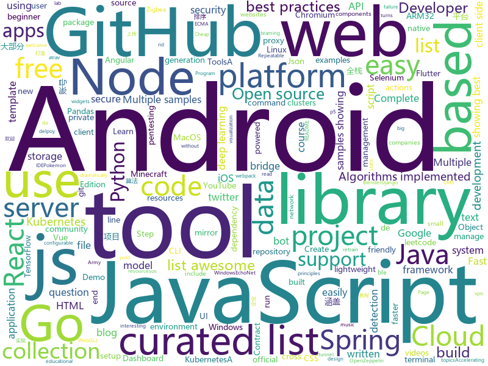

# 2020-01-26
See what the GitHub community is most excited about today.

## python
* [public-apis](https://github.com/public-apis/public-apis)(**128 stars today**): A collective list of free APIs for use in software and web development.
* [pupy](https://github.com/n1nj4sec/pupy)(**9 stars today**): Pupy is an opensource, cross-platform (Windows, Linux, OSX, Android) remote administration and post-exploitation tool mainly written in python
* [sigma](https://github.com/Neo23x0/sigma)(**7 stars today**): Generic Signature Format for SIEM Systems
* [pytorch3d](https://github.com/facebookresearch/pytorch3d)(**67 stars today**): PyTorch3d is FAIR's library of reusable components for deep learning with 3D data.
* [Python](https://github.com/TheAlgorithms/Python)(**63 stars today**): All Algorithms implemented in Python
* [PhoneInfoga](https://github.com/sundowndev/PhoneInfoga)(**2 stars today**): Advanced information gathering & OSINT tool for phone numbers
* [pandapy](https://github.com/firmai/pandapy)(**118 stars today**): PandaPy has the speed of NumPy and the usability of Pandas (10x to 50x faster)
* [gibMacOS](https://github.com/corpnewt/gibMacOS)(**16 stars today**): Py2/py3 script that can download macOS components direct from Apple
* [streamlit](https://github.com/streamlit/streamlit)(**34 stars today**): Streamlit — The fastest way to build custom ML tools
* [machine_learning_examples](https://github.com/lazyprogrammer/machine_learning_examples)(**5 stars today**): A collection of machine learning examples and tutorials.
* [deeplearning-az](https://github.com/joanby/deeplearning-az)(**2 stars today**): 
* [yfinance](https://github.com/ranaroussi/yfinance)(**7 stars today**): Yahoo! Finance market data downloader (+faster Pandas Datareader)
* [networkx](https://github.com/networkx/networkx)(**5 stars today**): Official NetworkX source code repository.
* [gpt-2-simple](https://github.com/minimaxir/gpt-2-simple)(**5 stars today**): Python package to easily retrain OpenAI's GPT-2 text-generating model on new texts
* [Flask-AppBuilder](https://github.com/dpgaspar/Flask-AppBuilder)(**3 stars today**): Simple and rapid application development framework, built on top of Flask. includes detailed security, auto CRUD generation for your models, google charts and much more. Demo (login with guest/welcome) - http://flaskappbuilder.pythonanywhere.com/
* [multi-v2ray](https://github.com/Jrohy/multi-v2ray)(**5 stars today**): v2ray easy delpoy & manage tool， support multiple user & protocol manage
* [retopoflow](https://github.com/CGCookie/retopoflow)(**4 stars today**): A suite of retopology tools for Blender
* [django-react-boilerplate](https://github.com/vintasoftware/django-react-boilerplate)(**3 stars today**): Django, React, Bootstrap 4 with Python 3 and webpack project boilerplate
* [AIDungeon](https://github.com/AIDungeon/AIDungeon)(**6 stars today**): Infinite adventures await!
* [odoo](https://github.com/odoo/odoo)(**6 stars today**): Odoo. Open Source Apps To Grow Your Business.
* [pytube](https://github.com/nficano/pytube)(**4 stars today**): A lightweight, dependency-free Python library (and command-line utility) for downloading YouTube Videos.
* [TensorFlow-Object-Detection-API-Tutorial-Train-Multiple-Objects-Windows-10](https://github.com/EdjeElectronics/TensorFlow-Object-Detection-API-Tutorial-Train-Multiple-Objects-Windows-10)(**3 stars today**): How to train a TensorFlow Object Detection Classifier for multiple object detection on Windows
* [dynamic](https://github.com/echonet/dynamic)(**7 stars today**): EchoNet-Dynamic is a deep learning model for assessing cardiac function in echocardiogram videos.
* [BiliDrive](https://github.com/Hsury/BiliDrive)(**25 stars today**): ☁️哔哩云，支持任意文件的全速上传与下载
* [twitterscraper](https://github.com/taspinar/twitterscraper)(**5 stars today**): Scrape Twitter for Tweets

## java
* [NewPipe](https://github.com/TeamNewPipe/NewPipe)(**33 stars today**): A libre lightweight streaming front-end for Android.
* [AndroidTutorialForBeginners](https://github.com/hussien89aa/AndroidTutorialForBeginners)(**4 stars today**): Step by step to build Android apps using Android Studio
* [unidbg](https://github.com/zhkl0228/unidbg)(**4 stars today**): Allows you to emulate an Android ARM32 and/or ARM64 native library, and an experimental iOS ARM32 emulation
* [JAViewer](https://github.com/SplashCodes/JAViewer)(**4 stars today**): 更优雅的驾车体验
* [quarkus](https://github.com/quarkusio/quarkus)(**13 stars today**): Quarkus: Supersonic Subatomic Java.
* [es4x](https://github.com/reactiverse/es4x)(**2 stars today**): 🚀fast JavaScript 4 Eclipse Vert.x
* [Java](https://github.com/TheAlgorithms/Java)(**16 stars today**): All Algorithms implemented in Java
* [springcloud-learning](https://github.com/macrozheng/springcloud-learning)(**1 stars today**): 一套涵盖大部分核心组件使用的Spring Cloud教程，包括Spring Cloud Alibaba及分布式事务Seata，基于Spring Cloud Greenwich及SpringBoot 2.1.7。20篇文章，篇篇精华，30个Demo，涵盖大部分应用场景。
* [Algorithms](https://github.com/williamfiset/Algorithms)(**6 stars today**): A collection of algorithms and data structures
* [Geyser](https://github.com/GeyserMC/Geyser)(**2 stars today**): A bridge/proxy allowing you to connect to Minecraft: Java Edition servers with Minecraft: Bedrock edition.
* [Fast-Android-Networking](https://github.com/amitshekhariitbhu/Fast-Android-Networking)(**3 stars today**): 🚀A Complete Fast Android Networking Library that also supports HTTP/2🚀
* [Lawnchair](https://github.com/LawnchairLauncher/Lawnchair)(**3 stars today**): No clever tagline needed
* [coderiver](https://github.com/cachecats/coderiver)(**1 stars today**): 致力于打造全平台全栈精品开源项目，计划做成包含 pc 端（Vue、React）、移动 H5（Vue、React）、ReactNative、Flutter、Android 原生、微信小程序、Angular、Node、java 后端的全平台型全栈项目，欢迎关注。
* [user-interface-samples](https://github.com/android/user-interface-samples)(**5 stars today**): Multiple samples showing the best practices in the user interface on Android.
* [igniter](https://github.com/trojan-gfw/igniter)(**5 stars today**): A trojan client for Android (UNDER CONSTRUCTION).
* [spring-framework](https://github.com/spring-projects/spring-framework)(**14 stars today**): Spring Framework
* [Signal-Android](https://github.com/signalapp/Signal-Android)(**3 stars today**): A private messenger for Android.
* [JS-Sorting-Algorithm](https://github.com/hustcc/JS-Sorting-Algorithm)(**2 stars today**): 一本关于排序算法的 GitBook 在线书籍 《十大经典排序算法》，多语言实现。
* [TelegramBots](https://github.com/rubenlagus/TelegramBots)(**1 stars today**): Java library to create bots using Telegram Bots API
* [traccar](https://github.com/traccar/traccar)(**0 stars today**): Traccar GPS Tracking System
* [spring-security-oauth](https://github.com/Baeldung/spring-security-oauth)(**1 stars today**): Just Announced - "Learn Spring Security OAuth":
* [Interview-Questions](https://github.com/rishabh115/Interview-Questions)(**2 stars today**): Most comprehensive list📋of tech interview questions📘of companies scraped from Geeksforgeeks, CareerCup and Glassdoor.
* [MusicBot](https://github.com/jagrosh/MusicBot)(**3 stars today**): 🎶A Discord music bot that's easy to set up and run yourself!
* [connectivity-samples](https://github.com/android/connectivity-samples)(**3 stars today**): Multiple samples showing the best practices in connectivity on Android.
* [location-samples](https://github.com/android/location-samples)(**2 stars today**): Multiple samples showing the best practices in location APIs on Android.

## unknown
* [the-book-of-secret-knowledge](https://github.com/trimstray/the-book-of-secret-knowledge)(**1,629 stars today**): A collection of inspiring lists, manuals, cheatsheets, blogs, hacks, one-liners, cli/web tools and more.
* [Apple](https://github.com/v2net/Apple)(**28 stars today**): 苹果美区账号 APPLE ID 免费账号共享
* [DevYouTubeList](https://github.com/ErikCH/DevYouTubeList)(**123 stars today**): List of Development YouTube Channels
* [awesome](https://github.com/sindresorhus/awesome)(**82 stars today**): 😎Awesome lists about all kinds of interesting topics
* [starter-workflows](https://github.com/actions/starter-workflows)(**6 stars today**): Accelerating new GitHub Actions workflows
* [archive-program](https://github.com/github/archive-program)(**21 stars today**): The GitHub Archive Program & Arctic Code Vault
* [backendlore](https://github.com/fpereiro/backendlore)(**352 stars today**): How I write backends
* [GM-Standards](https://github.com/guanzhi/GM-Standards)(**3 stars today**): 中华人民共和国密码行业标准(GM/T)文本
* [leetcode-patterns](https://github.com/SeanPrashad/leetcode-patterns)(**6 stars today**): A curated list of 160+ leetcode questions grouped by their common patterns
* [intro_automation](https://github.com/jomarnavarro/intro_automation)(**3 stars today**): Module 1 for Selenium Webdriver course focused on Selenium IDE
* [pokemon.json](https://github.com/fanzeyi/pokemon.json)(**2 stars today**): Pokemon dataset in JSON.
* [chromium](https://github.com/chromium/chromium)(**10 stars today**): The official GitHub mirror of the Chromium source
* [awesome-for-beginners](https://github.com/MunGell/awesome-for-beginners)(**42 stars today**): A list of awesome beginners-friendly projects.
* [flutter_vignettes](https://github.com/gskinnerTeam/flutter_vignettes)(**10 stars today**): A collection of fun Flutter experiments, created by gskinner, in partnership with Google.
* [awesome-forensics](https://github.com/cugu/awesome-forensics)(**6 stars today**): A curated list of awesome forensic analysis tools and resources
* [os_course_info](https://github.com/chyyuu/os_course_info)(**2 stars today**): os course info
* [Beginner-Network-Pentesting](https://github.com/hmaverickadams/Beginner-Network-Pentesting)(**6 stars today**): Notes for Beginner Network Pentesting Course
* [parser_book](https://github.com/asciidwango/parser_book)(**6 stars today**): アスキードワンゴで出版予定の構文解析本に関するリポジトリ
* [You-Dont-Know-JS](https://github.com/getify/You-Dont-Know-JS)(**42 stars today**): A book series on JavaScript. @YDKJS on twitter.
* [leetcode-by-company](https://github.com/rrevanth/leetcode-by-company)(**6 stars today**): leetcode question list by companies, include the premium questions
* [from_coder_to_expert](https://github.com/0voice/from_coder_to_expert)(**2 stars today**): 2019年最新总结，从程序员到CTO，从专业走向卓越，分享大牛企业内部pdf与PPT
* [react-typescript-cheatsheet](https://github.com/typescript-cheatsheets/react-typescript-cheatsheet)(**21 stars today**): Cheatsheets for experienced React developers getting started with TypeScript
* [awesome-actions](https://github.com/sdras/awesome-actions)(**22 stars today**): A curated list of awesome actions to use on GitHub
* [The-Documentation-Compendium](https://github.com/kylelobo/The-Documentation-Compendium)(**2 stars today**): 📢Various README templates & tips on writing high-quality documentation that people want to read.

## javascript
* [miragejs](https://github.com/miragejs/miragejs)(**284 stars today**): A client-side server to develop, test and prototype your JavaScript app
* [Javascript](https://github.com/TheAlgorithms/Javascript)(**20 stars today**): A repository for All algorithms implemented in Javascript (for educational purposes only)
* [p5.js](https://github.com/processing/p5.js)(**9 stars today**): p5.js is a client-side JS platform that empowers artists, designers, students, and anyone to learn to code and express themselves creatively on the web. It is based on the core principles of Processing. http://twitter.com/p5xjs —
* [playwright](https://github.com/microsoft/playwright)(**1,695 stars today**): Node library to automate Chromium, Firefox and WebKit with a single API
* [node](https://github.com/nodejs/node)(**26 stars today**): Node.js JavaScript runtime✨🐢🚀✨
* [userbase](https://github.com/encrypted-dev/userbase)(**215 stars today**): Create secure and private web apps using only static JavaScript, HTML, and CSS.
* [atom](https://github.com/atom/atom)(**12 stars today**): The hackable text editor
* [homebridge](https://github.com/nfarina/homebridge)(**13 stars today**): HomeKit support for the impatient
* [ifood-clone](https://github.com/leoobarbosa2/ifood-clone)(**16 stars today**): Um clone do famoso aplicativo do Ifood, feito inteiramente com Javascript, através da utilização do React Native! Testado no Android & IOS. API com Json Server
* [svgedit](https://github.com/SVG-Edit/svgedit)(**5 stars today**): Powerful SVG-Editor for your browser
* [nsfwjs](https://github.com/infinitered/nsfwjs)(**6 stars today**): NSFW detection on the client-side via TensorFlow.js
* [yarn](https://github.com/yarnpkg/yarn)(**22 stars today**): 📦🐈Fast, reliable, and secure dependency management.
* [strapi](https://github.com/strapi/strapi)(**22 stars today**): 🚀Open source Node.js Headless CMS to easily build customisable APIs
* [node-course-v3-code](https://github.com/andrewjmead/node-course-v3-code)(**2 stars today**): Code for version 3 of The Complete Node.js Developer Course
* [bootswatch](https://github.com/thomaspark/bootswatch)(**6 stars today**): Themes for Bootstrap
* [overreacted.io](https://github.com/gaearon/overreacted.io)(**8 stars today**): Personal blog by Dan Abramov.
* [openzeppelin-contracts](https://github.com/OpenZeppelin/openzeppelin-contracts)(**3 stars today**): OpenZeppelin Contracts is a library for secure smart contract development.
* [deck.gl](https://github.com/uber/deck.gl)(**6 stars today**): WebGL2 powered geospatial visualization layers
* [nedb](https://github.com/louischatriot/nedb)(**9 stars today**): The JavaScript Database, for Node.js, nw.js, electron and the browser
* [grapesjs](https://github.com/artf/grapesjs)(**10 stars today**): Free and Open source Web Builder Framework. Next generation tool for building templates without coding
* [lightbox2](https://github.com/lokesh/lightbox2)(**2 stars today**): THE original Lightbox script.
* [awesome-vscode](https://github.com/viatsko/awesome-vscode)(**11 stars today**): 🎨A curated list of delightful VS Code packages and resources.
* [etcher](https://github.com/balena-io/etcher)(**13 stars today**): Flash OS images to SD cards & USB drives, safely and easily.
* [zigbee2mqtt](https://github.com/Koenkk/zigbee2mqtt)(**6 stars today**): Zigbee🐝to MQTT bridge🌉, get rid of your proprietary Zigbee bridges🔨
* [P4wnP1_aloa](https://github.com/mame82/P4wnP1_aloa)(**7 stars today**): P4wnP1 A.L.O.A. by MaMe82 is a framework which turns a Rapsberry Pi Zero W into a flexible, low-cost platform for pentesting, red teaming and physical engagements ... or into "A Little Offensive Appliance".

## html
* [spot-sdk](https://github.com/boston-dynamics/spot-sdk)(**84 stars today**): Spot SDK repo
* [github-markdown-css](https://github.com/sindresorhus/github-markdown-css)(**3 stars today**): The minimal amount of CSS to replicate the GitHub Markdown style
* [tabler](https://github.com/tabler/tabler)(**7 stars today**): Tabler is free and open-source HTML Dashboard UI Kit built on Bootstrap
* [Adminator-admin-dashboard](https://github.com/puikinsh/Adminator-admin-dashboard)(**3 stars today**): Adminator is a easy to use and well design admin dashboard template for web apps, websites, services and more
* [free-for-dev](https://github.com/ripienaar/free-for-dev)(**38 stars today**): A list of SaaS, PaaS and IaaS offerings that have free tiers of interest to devops and infradev
* [privacytools.io](https://github.com/privacytoolsIO/privacytools.io)(**5 stars today**): 🛡🛠You are being watched. Protect your privacy against global mass surveillance.
* [kubernetes-failure-stories](https://github.com/hjacobs/kubernetes-failure-stories)(**1 stars today**): Compilation of public failure/horror stories related to Kubernetes
* [responsive-html-email-template](https://github.com/leemunroe/responsive-html-email-template)(**5 stars today**): A free simple responsive HTML email template
* [hyperblog](https://github.com/freddier/hyperblog)(**6 stars today**): Un blog increíble para el curso de Git y Github de Platzi
* [dl-keras-tf](https://github.com/rstudio-conf-2020/dl-keras-tf)(**1 stars today**): rstudio::conf(2020) deep learning workshop
* [webdevbootcamp](https://github.com/nax3t/webdevbootcamp)(**5 stars today**): All source code for back-end projects from the Web Developer Bootcamp
* [en.javascript.info](https://github.com/javascript-tutorial/en.javascript.info)(**16 stars today**): Modern JavaScript Tutorial
* [ecma262](https://github.com/tc39/ecma262)(**2 stars today**): Status, process, and documents for ECMA-262
* [speedtest](https://github.com/librespeed/speedtest)(**7 stars today**): Self-hosted Speedtest for HTML5 and more. Easy setup, examples, configurable, mobile friendly. Supports PHP, Node, Multiple servers, and more
* [DetectionLab](https://github.com/clong/DetectionLab)(**2 stars today**): Vagrant & Packer scripts to build a lab environment complete with security tooling and logging best practices
* [awesome-angular](https://github.com/PatrickJS/awesome-angular)(**3 stars today**): 📄A curated list of awesome Angular resources
* [boost](https://github.com/boostorg/boost)(**2 stars today**): Super-project for modularized Boost
* [community](https://github.com/sveltejs/community)(**2 stars today**): A repo for data relating to the svelte community and events
* [lab-react-training](https://github.com/ironhack-labs/lab-react-training)(**0 stars today**): 
* [H1ve](https://github.com/D0g3-Lab/H1ve)(**10 stars today**): An Easy / Quick / Cheap Integrated Platform
* [Face-Recognition-Attendance-System](https://github.com/shubamwalia/Face-Recognition-Attendance-System)(**0 stars today**): Face Recognition Attendance System with Python 3.6 and OpenCV 3.4
* [105-practice](https://github.com/skillcrush/105-practice)(**0 stars today**): Skillcrush 105 - "How to use GitHub with others"
* [lab-css-flexbox-slack](https://github.com/ironhack-labs/lab-css-flexbox-slack)(**0 stars today**): 
* [intro-to-npm-readme](https://github.com/learn-co-curriculum/intro-to-npm-readme)(****): 
* [react-async-gif-search-lab-online-web-pt-041519](https://github.com/learn-co-students/react-async-gif-search-lab-online-web-pt-041519)(****): 

## go
* [k8s-deployment-strategies](https://github.com/ContainerSolutions/k8s-deployment-strategies)(**2 stars today**): Kubernetes deployment strategies explained
* [bettercap](https://github.com/bettercap/bettercap)(**10 stars today**): The Swiss Army knife for 802.11, BLE and Ethernet networks reconnaissance and MITM attacks.
* [torrent-client](https://github.com/veggiedefender/torrent-client)(**13 stars today**): Tiny BitTorrent client written in Go
* [wzd](https://github.com/eltaline/wzd)(**1 stars today**): wZD is a powerful storage server, designed for big data storage systems with small and large files for mixed use and dramatically reduces count of small files for extend abilities any normal or clustered POSIX compatible file systems.
* [hub](https://github.com/github/hub)(**9 stars today**): A command-line tool that makes git easier to use with GitHub.
* [Go](https://github.com/TheAlgorithms/Go)(**3 stars today**): Algorithms Implemented in GoLang
* [photoprism](https://github.com/photoprism/photoprism)(**7 stars today**): Personal Photo Management powered by Go and Google TensorFlow
* [ink](https://github.com/buchanae/ink)(**19 stars today**): Creative coding in Go
* [tview](https://github.com/rivo/tview)(**5 stars today**): Rich interactive widgets for terminal-based UIs written in Go
* [cloud-on-k8s](https://github.com/elastic/cloud-on-k8s)(**6 stars today**): Elastic Cloud on Kubernetes
* [ko](https://github.com/google/ko)(**6 stars today**): Build and deploy Go applications on Kubernetes
* [clash](https://github.com/Dreamacro/clash)(**12 stars today**): A rule-based tunnel in Go.
* [statping](https://github.com/hunterlong/statping)(**9 stars today**): Status Page for monitoring your websites and applications with beautiful graphs, analytics, and plugins. Run on any type of environment.
* [micro](https://github.com/zyedidia/micro)(**11 stars today**): A modern and intuitive terminal-based text editor
* [badger](https://github.com/dgraph-io/badger)(**7 stars today**): Fast key-value DB in Go.
* [tools](https://github.com/golang/tools)(**2 stars today**): [mirror] Go Tools
* [cloud-nuke](https://github.com/gruntwork-io/cloud-nuke)(**4 stars today**): A tool for cleaning up your cloud accounts by nuking (deleting) all resources within it
* [community](https://github.com/kubernetes/community)(**1 stars today**): Kubernetes community content
* [octant](https://github.com/vmware-tanzu/octant)(**7 stars today**): A web-based, highly extensible platform for developers to better understand the complexity of Kubernetes clusters.
* [gqlgen](https://github.com/99designs/gqlgen)(**17 stars today**): go generate based graphql server library
* [k9s](https://github.com/derailed/k9s)(**17 stars today**): 🐶Kubernetes CLI To Manage Your Clusters In Style!
* [brook](https://github.com/txthinking/brook)(**6 stars today**): Brook is a cross-platform(Linux/MacOS/Windows/Android/iOS) proxy/vpn software
* [hey](https://github.com/rakyll/hey)(**7 stars today**): HTTP load generator, ApacheBench (ab) replacement, formerly known as rakyll/boom
* [skaffold](https://github.com/GoogleContainerTools/skaffold)(**7 stars today**): Easy and Repeatable Kubernetes Development
* [thanos](https://github.com/thanos-io/thanos)(**3 stars today**): Highly available Prometheus setup with long term storage capabilities. CNCF Sandbox project.

## WordCloud

