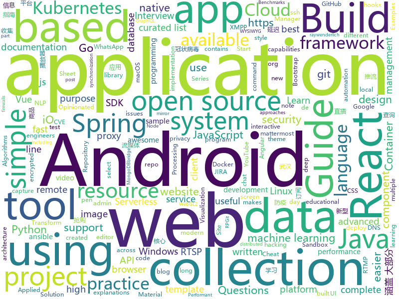

# 2020-01-28
See what the GitHub community is most excited about today.

## python
* [NLP-progress](https://github.com/sebastianruder/NLP-progress)(**35 stars today**): Repository to track the progress in Natural Language Processing (NLP), including the datasets and the current state-of-the-art for the most common NLP tasks.
* [api-server](https://github.com/wuhan2020/api-server)(**2 stars today**): 武汉新型冠状病毒防疫信息收集平台后端代理
* [home-assistant](https://github.com/home-assistant/home-assistant)(**26 stars today**): 🏡Open source home automation that puts local control and privacy first
* [youtube-dl](https://github.com/ytdl-org/youtube-dl)(**58 stars today**): Command-line program to download videos from YouTube.com and other video sites
* [localstack](https://github.com/localstack/localstack)(**21 stars today**): 💻A fully functional local AWS cloud stack. Develop and test your cloud & Serverless apps offline!
* [saleor](https://github.com/mirumee/saleor)(**11 stars today**): A modular, high performance, headless e-commerce storefront built with Python, GraphQL, Django, and ReactJS.
* [CheatSheetSeries](https://github.com/OWASP/CheatSheetSeries)(**18 stars today**): The OWASP Cheat Sheet Series was created to provide a concise collection of high value information on specific application security topics.
* [cpython](https://github.com/python/cpython)(**19 stars today**): The Python programming language
* [fortnitepy-bot](https://github.com/xMistt/fortnitepy-bot)(**6 stars today**): A fortnite XMPP bot coded in Python with party capabilites. (+ and styles!)
* [spiderfoot](https://github.com/smicallef/spiderfoot)(**48 stars today**): SpiderFoot, the most complete OSINT collection and reconnaissance tool.
* [GDA-android-reversing-Tool](https://github.com/charles2gan/GDA-android-reversing-Tool)(**41 stars today**): GDA is a new decompiler written entirely in c++, so it does not rely on the Java platform, which is succinct, portable and fast, and supports APK, DEX, ODEX, oat.
* [gesture-gaming-python](https://github.com/pateldigant/gesture-gaming-python)(**6 stars today**): 
* [Awesome-WAF](https://github.com/0xInfection/Awesome-WAF)(**11 stars today**): 🔥Everything awesome about web-application firewalls (WAF).
* [BlueGate](https://github.com/ioncodes/BlueGate)(**20 stars today**): PoC for the Remote Desktop Gateway vulnerability - CVE-2020-0609 & CVE-2020-0610
* [nlp-recipes](https://github.com/microsoft/nlp-recipes)(**14 stars today**): Natural Language Processing Best Practices & Examples
* [jd-assistant](https://github.com/tychxn/jd-assistant)(**5 stars today**): 京东抢购助手：包含登录，查询商品库存/价格，添加/清空购物车，抢购商品(下单)，查询订单等功能
* [dbt](https://github.com/fishtown-analytics/dbt)(**2 stars today**): dbt (data build tool) enables data analysts and engineers to transform their data using the same practices that software engineers use to build applications.
* [aws-cloudformation-templates](https://github.com/awslabs/aws-cloudformation-templates)(**4 stars today**): A collection of useful CloudFormation templates
* [learn_math_fast](https://github.com/llSourcell/learn_math_fast)(**2 stars today**): This is the Curriculum for "How to Learn Mathematics Fast" By Siraj Raval on Youtube
* [autokeras](https://github.com/keras-team/autokeras)(**7 stars today**): An AutoML system based on Keras
* [ShadowSocksShare](https://github.com/the0demiurge/ShadowSocksShare)(**4 stars today**): Python爬虫/Flask网站/免费ShadowSocks账号/ssr订阅/json 订阅
* [ansible](https://github.com/ansible/ansible)(**22 stars today**): Ansible is a radically simple IT automation platform that makes your applications and systems easier to deploy. Avoid writing scripts or custom code to deploy and update your applications — automate in a language that approaches plain English, using SSH, with no agents to install on remote systems. https://docs.ansible.com/ansible/
* [facenet](https://github.com/davidsandberg/facenet)(**11 stars today**): Face recognition using Tensorflow
* [spinningup](https://github.com/openai/spinningup)(**5 stars today**): An educational resource to help anyone learn deep reinforcement learning.
* [protonvpn-cli-ng](https://github.com/ProtonVPN/protonvpn-cli-ng)(**17 stars today**): Linux command-line client for ProtonVPN. Written in Python.

## java
* [springcloud-learning](https://github.com/macrozheng/springcloud-learning)(**15 stars today**): 一套涵盖大部分核心组件使用的Spring Cloud教程，包括Spring Cloud Alibaba及分布式事务Seata，基于Spring Cloud Greenwich及SpringBoot 2.1.7。20篇文章，篇篇精华，30个Demo，涵盖大部分应用场景。
* [flyway](https://github.com/flyway/flyway)(**24 stars today**): Flyway by Redgate • Database Migrations Made Easy.
* [micronaut-core](https://github.com/micronaut-projects/micronaut-core)(**4 stars today**): Micronaut Application Framework
* [pulsar](https://github.com/apache/pulsar)(**9 stars today**): Apache Pulsar - distributed pub-sub messaging system
* [debezium](https://github.com/debezium/debezium)(**7 stars today**): Change data capture for a variety of databases. https://debezium.io Please log issues in our JIRA at https://issues.jboss.org/projects/DBZ/issues
* [spring-petclinic](https://github.com/spring-projects/spring-petclinic)(**4 stars today**): A sample Spring-based application
* [runelite](https://github.com/runelite/runelite)(**3 stars today**): Open source Old School RuneScape client
* [quickstart-android](https://github.com/firebase/quickstart-android)(**3 stars today**): Firebase Quickstart Samples for Android
* [AndroidTutorialForBeginners](https://github.com/hussien89aa/AndroidTutorialForBeginners)(**5 stars today**): Step by step to build Android apps using Android Studio
* [RxJava](https://github.com/ReactiveX/RxJava)(**8 stars today**): RxJava – Reactive Extensions for the JVM – a library for composing asynchronous and event-based programs using observable sequences for the Java VM.
* [Android-SpinKit](https://github.com/ybq/Android-SpinKit)(**6 stars today**): Android loading animations
* [Telegram](https://github.com/DrKLO/Telegram)(**7 stars today**): Telegram for Android source
* [FrameworkBenchmarks](https://github.com/TechEmpower/FrameworkBenchmarks)(**6 stars today**): Source for the TechEmpower Framework Benchmarks project
* [druid](https://github.com/apache/druid)(**6 stars today**): Apache Druid: a high performance real-time analytics database.
* [Mindustry](https://github.com/Anuken/Mindustry)(**11 stars today**): A sandbox tower defense game
* [react-native-splash-screen](https://github.com/crazycodeboy/react-native-splash-screen)(**4 stars today**): A splash screen for react-native, hide when application loaded ,it works on iOS and Android.
* [react-native-navigation](https://github.com/wix/react-native-navigation)(**4 stars today**): A complete native navigation solution for React Native
* [XPrivacyLua](https://github.com/M66B/XPrivacyLua)(**3 stars today**): Really simple to use privacy manager for Android 6.0 Marshmallow and later
* [hibernate-orm](https://github.com/hibernate/hibernate-orm)(**1 stars today**): Hibernate's core Object/Relational Mapping functionality
* [sceneform-android-sdk](https://github.com/google-ar/sceneform-android-sdk)(**1 stars today**): Sceneform SDK for Android
* [animation-samples](https://github.com/android/animation-samples)(**4 stars today**): Multiple samples showing the best practices in animation on Android.
* [JavaGuide](https://github.com/Snailclimb/JavaGuide)(**23 stars today**): 【Java学习+面试指南】 一份涵盖大部分Java程序员所需要掌握的核心知识。
* [SmarterStreaming](https://github.com/daniulive/SmarterStreaming)(**3 stars today**): 国内外为数不多致力于极致体验的超强全自研跨平台(windows/android/iOS)流媒体内核，通过模块化自由组合，支持实时RTMP推流、RTSP推流、RTMP播放器、RTSP播放器、录像、多路流媒体转发、音视频导播、动态视频合成、音频混音、直播互动、内置轻量级RTSP服务等，比快更快，业界真正靠谱的超低延迟直播SDK(1秒内，低延迟模式下200~400ms)。
* [tutorials](https://github.com/eugenp/tutorials)(**6 stars today**): Just Announced - "Learn Spring Security OAuth":
* [grpc-java](https://github.com/grpc/grpc-java)(**3 stars today**): The Java gRPC implementation. HTTP/2 based RPC

## unknown
* [hacker-roadmap](https://github.com/sundowndev/hacker-roadmap)(**246 stars today**): 📌A guide for amateurs pen testers and a collection of hacking tools, resources and references to practice ethical hacking, pen testing and web security.
* [wuhan2020](https://github.com/wuhan2020/wuhan2020)(**456 stars today**): 武汉新型冠状病毒防疫信息收集平台
* [awesome-scalability](https://github.com/binhnguyennus/awesome-scalability)(**107 stars today**): The Patterns of Scalable, Reliable, and Performant Large-Scale Systems
* [awesome-ld-preload](https://github.com/gaul/awesome-ld-preload)(**75 stars today**): List of resources related to LD_PRELOAD, a mechanism for changing application behavior at run-time
* [eng-practices](https://github.com/google/eng-practices)(**11 stars today**): Google's Engineering Practices documentation
* [angular-interview-questions](https://github.com/sudheerj/angular-interview-questions)(**4 stars today**): List of 300 Angular Interview Questions and answers[WIP]
* [shareOI](https://github.com/hzwer/shareOI)(**48 stars today**): OI & ACM 课件分享
* [complete-guide-to-elasticsearch](https://github.com/codingexplained/complete-guide-to-elasticsearch)(**2 stars today**): Contains all of the queries used within the Complete Guide to Elasticsearch course.
* [You-Dont-Know-JS](https://github.com/getify/You-Dont-Know-JS)(**60 stars today**): A book series on JavaScript. @YDKJS on twitter.
* [Awesome-Embedded](https://github.com/nhivp/Awesome-Embedded)(**42 stars today**): A curated list of awesome embedded programming.
* [browser-2020](https://github.com/luruke/browser-2020)(**57 stars today**): Things you can do with a browser in 2020☕️
* [industry-machine-learning](https://github.com/firmai/industry-machine-learning)(**23 stars today**): A curated list of applied machine learning and data science notebooks and libraries across different industries.
* [Interview_Question_for_Beginner](https://github.com/JaeYeopHan/Interview_Question_for_Beginner)(**12 stars today**): 👦👧Technical-Interview guidelines written for those who started studying programming. I wish you all the best.👾
* [gitignore](https://github.com/github/gitignore)(**32 stars today**): A collection of useful .gitignore templates
* [webkit](https://github.com/WebKit/webkit)(**4 stars today**): Unofficial mirror of the WebKit SVN repository
* [debugging-stories](https://github.com/danluu/debugging-stories)(**96 stars today**): A collection of debugging stories. PRs welcome (sorry for the backlog) :-)
* [chromium](https://github.com/jjqqkk/chromium)(**4 stars today**): Chromium browser with SSL VPN. Use this browser to unblock websites.
* [AD-Attack-Defense](https://github.com/infosecn1nja/AD-Attack-Defense)(**4 stars today**): Attack and defend active directory using modern post exploitation adversary tradecraft activity
* [frontend-challenges](https://github.com/felipefialho/frontend-challenges)(**9 stars today**): 💥Listing some playful open-source's challenges of jobs to test your knowledge
* [Python-Books](https://github.com/manash-biswal/Python-Books)(**7 stars today**): 
* [swift-style-guide](https://github.com/raywenderlich/swift-style-guide)(**6 stars today**): The official Swift style guide for raywenderlich.com.
* [100-days-of-code](https://github.com/kallaway/100-days-of-code)(**5 stars today**): Fork this template for the 100 days journal - to keep yourself accountable (multiple languages available)
* [javascript-questions](https://github.com/lydiahallie/javascript-questions)(**55 stars today**): A long list of (advanced) JavaScript questions, and their explanations✨
* [AZ-103-MicrosoftAzureAdministrator](https://github.com/MicrosoftLearning/AZ-103-MicrosoftAzureAdministrator)(**5 stars today**): AZ-103: Microsoft Azure Administrator
* [awesome-wysiwyg](https://github.com/JefMari/awesome-wysiwyg)(**2 stars today**): A curated list of awesome WYSIWYG editors.

## javascript
* [jira_clone](https://github.com/oldboyxx/jira_clone)(**1,194 stars today**): A simplified Jira clone built with React/Babel (Client), and Node/TypeScript (API). Auto formatted with Prettier, tested with Cypress.
* [permission-manager](https://github.com/sighupio/permission-manager)(**73 stars today**): Permission Manager is a project that brings sanity to Kubernetes RBAC and Users management, Web UI FTW
* [react-native](https://github.com/facebook/react-native)(**37 stars today**): A framework for building native apps with React.
* [dribbble2react](https://github.com/react-ui-kit/dribbble2react)(**4 stars today**): Transform Dribbble designs to React-Native code & YouTube video tutorials
* [bootstrap](https://github.com/twbs/bootstrap)(**20 stars today**): The most popular HTML, CSS, and JavaScript framework for developing responsive, mobile first projects on the web.
* [deck.gl](https://github.com/uber/deck.gl)(**7 stars today**): WebGL2 powered geospatial visualization layers
* [svelte](https://github.com/sveltejs/svelte)(**42 stars today**): Cybernetically enhanced web apps
* [netlify-cms](https://github.com/netlify/netlify-cms)(**13 stars today**): A CMS for Static Site Generators
* [botium-speech-processing](https://github.com/codeforequity-at/botium-speech-processing)(**330 stars today**): Botium Speech Processing
* [CyberChef](https://github.com/gchq/CyberChef)(**65 stars today**): The Cyber Swiss Army Knife - a web app for encryption, encoding, compression and data analysis
* [awx](https://github.com/ansible/awx)(**9 stars today**): AWX Project
* [killedbygoogle](https://github.com/codyogden/killedbygoogle)(**5 stars today**): Part guillotine, part graveyard for Google's doomed apps, services, and hardware.
* [vue-enterprise-boilerplate](https://github.com/chrisvfritz/vue-enterprise-boilerplate)(**10 stars today**): An ever-evolving, very opinionated architecture and dev environment for new Vue SPA projects using Vue CLI 3.
* [nginx-proxy-manager](https://github.com/jc21/nginx-proxy-manager)(**4 stars today**): Docker container for managing Nginx proxy hosts with a simple, powerful interface
* [typeofnan-javascript-quizzes](https://github.com/nas5w/typeofnan-javascript-quizzes)(**16 stars today**): JavaScript quiz questions and explanations!
* [gridsome](https://github.com/gridsome/gridsome)(**13 stars today**): ⚡️Build modern JAMstack websites with Vue.js
* [todomvc](https://github.com/tastejs/todomvc)(**5 stars today**): Helping you select an MV* framework - Todo apps for React.js, Ember.js, Angular, and many more
* [material-ui](https://github.com/mui-org/material-ui)(**33 stars today**): React components for faster and easier web development. Build your own design system, or start with Material Design.
* [beautiful-react-hooks](https://github.com/beautifulinteractions/beautiful-react-hooks)(**54 stars today**): 🔥A collection of beautiful and (hopefully) useful React hooks to speed-up your components and hooks development🔥
* [vue-awesome-swiper](https://github.com/surmon-china/vue-awesome-swiper)(**10 stars today**): 🏆Swiper component for @vuejs
* [joplin](https://github.com/laurent22/joplin)(**50 stars today**): Joplin - an open source note taking and to-do application with synchronization capabilities for Windows, macOS, Linux, Android and iOS. Forum: https://discourse.joplinapp.org/
* [Javascript](https://github.com/TheAlgorithms/Javascript)(**116 stars today**): A repository for All algorithms implemented in Javascript (for educational purposes only)
* [marktext](https://github.com/marktext/marktext)(**12 stars today**): 📝A simple and elegant markdown editor, available for Linux, macOS and Windows.
* [select2](https://github.com/select2/select2)(**5 stars today**): Select2 is a jQuery based replacement for select boxes. It supports searching, remote data sets, and infinite scrolling of results.
* [fullPage.js](https://github.com/alvarotrigo/fullPage.js)(**10 stars today**): fullPage plugin by Alvaro Trigo. Create full screen pages fast and simple

## html
* [dl-keras-tf](https://github.com/rstudio-conf-2020/dl-keras-tf)(**15 stars today**): rstudio::conf(2020) deep learning workshop
* [applied-ml](https://github.com/rstudio-conf-2020/applied-ml)(**12 stars today**): Code and Resources for "Applied Machine Learning"
* [Coursera-ML-AndrewNg-Notes](https://github.com/fengdu78/Coursera-ML-AndrewNg-Notes)(**14 stars today**): 吴恩达老师的机器学习课程个人笔记
* [machine-learning-systems-design](https://github.com/chiphuyen/machine-learning-systems-design)(**34 stars today**): A booklet on machine learning systems design with exercises
* [intro-to-ml-tidy](https://github.com/rstudio-conf-2020/intro-to-ml-tidy)(**13 stars today**): Intro to Machine Learning with the Tidyverse
* [stisla](https://github.com/stisla/stisla)(**8 stars today**): Free Bootstrap Admin Template
* [CLRS](https://github.com/walkccc/CLRS)(**7 stars today**): 📚Solutions to Introduction to Algorithms Third Edition
* [d3-book](https://github.com/scotthmurray/d3-book)(**4 stars today**): Code examples for “Interactive Data Visualization for the Web”
* [PacketStorm-Exploits](https://github.com/BuddhaLabs/PacketStorm-Exploits)(**2 stars today**): Collection of publicly available exploits from Packetstorm
* [hyperblog](https://github.com/freddier/hyperblog)(**13 stars today**): Un blog increíble para el curso de Git y Github de Platzi
* [DevOps-Guide](https://github.com/Tikam02/DevOps-Guide)(**10 stars today**): DevOps Guide from basic to advanced with Interview Questions and Notes🔥
* [spot-sdk](https://github.com/boston-dynamics/spot-sdk)(**57 stars today**): Spot SDK repo
* [docs](https://github.com/knative/docs)(**2 stars today**): User documentation for Knative components
* [ru.javascript.info](https://github.com/javascript-tutorial/ru.javascript.info)(**6 stars today**): Современный учебник JavaScript
* [swagger-codegen](https://github.com/swagger-api/swagger-codegen)(**5 stars today**): swagger-codegen contains a template-driven engine to generate documentation, API clients and server stubs in different languages by parsing your OpenAPI / Swagger definition.
* [hugo-ink](https://github.com/knadh/hugo-ink)(**3 stars today**): Crisp, minimal personal website and blog theme Hugo
* [HiddenEye](https://github.com/DarkSecDevelopers/HiddenEye)(**4 stars today**): Modern Phishing Tool With Advanced Functionality And Multiple Tunnelling Services [ Android-Support-Available ]
* [Spoon-Knife](https://github.com/octocat/Spoon-Knife)(**2 stars today**): This repo is for demonstration purposes only.
* [website](https://github.com/kubernetes/website)(**2 stars today**): Kubernetes website and documentation repo:
* [flag-icon-css](https://github.com/lipis/flag-icon-css)(**7 stars today**): 🎏A collection of all country flags in SVG — plus the CSS for easier integration
* [serverless](https://github.com/phodal/serverless)(**2 stars today**): Serverless 架构应用开发指南 - Serverless Architecture Application Development Guide with Serverless Framework.
* [curso-react-redux](https://github.com/cod3rcursos/curso-react-redux)(**2 stars today**): 
* [training-kit](https://github.com/github/training-kit)(**0 stars today**): Open source cheat sheets for Git and GitHub
* [startbootstrap-sb-admin-2](https://github.com/BlackrockDigital/startbootstrap-sb-admin-2)(**1 stars today**): A free, open source, Bootstrap admin theme created by Start Bootstrap
* [JavaScript30](https://github.com/wesbos/JavaScript30)(**10 stars today**): 30 Day Vanilla JS Challenge

## go
* [whatsapp-media-decrypt](https://github.com/ddz/whatsapp-media-decrypt)(**107 stars today**): Decrypt WhatsApp encrypted media files
* [hub](https://github.com/github/hub)(**10 stars today**): A command-line tool that makes git easier to use with GitHub.
* [flamingo](https://github.com/atredispartners/flamingo)(**40 stars today**): Flamingo captures credentials sprayed across the network by various IT and security products.
* [thanos](https://github.com/thanos-io/thanos)(**12 stars today**): Highly available Prometheus setup with long term storage capabilities. CNCF Sandbox project.
* [popeye](https://github.com/derailed/popeye)(**13 stars today**): 🧭 A Kubernetes cluster resource sanitizer
* [k3sup](https://github.com/alexellis/k3sup)(**8 stars today**): from Zero to KUBECONFIG in < 1 min🚀
* [gravity](https://github.com/gravitational/gravity)(**77 stars today**): Opinionated image-based Kubernetes packaging and management tools.
* [kaniko](https://github.com/GoogleContainerTools/kaniko)(**16 stars today**): Build Container Images In Kubernetes
* [ARO-RP](https://github.com/Azure/ARO-RP)(**1 stars today**): Azure Red Hat OpenShift RP
* [gitea](https://github.com/go-gitea/gitea)(**14 stars today**): Git with a cup of tea, painless self-hosted git service
* [BaiduPCS-Go](https://github.com/iikira/BaiduPCS-Go)(**13 stars today**): 百度网盘客户端 - Go语言编写
* [gcr-cleaner](https://github.com/sethvargo/gcr-cleaner)(**11 stars today**): Delete untagged image refs in Google Container Registry, as a service
* [singularity](https://github.com/sylabs/singularity)(**2 stars today**): Singularity: Application containers for Linux
* [kit](https://github.com/go-kit/kit)(**9 stars today**): A standard library for microservices.
* [mongo-go-driver](https://github.com/mongodb/mongo-go-driver)(**4 stars today**): The Go driver for MongoDB
* [matterbridge](https://github.com/42wim/matterbridge)(**39 stars today**): bridge between mattermost, IRC, gitter, xmpp, slack, discord, telegram, rocket.chat, steam, twitch, ssh-chat, zulip, whatsapp, keybase, matrix and more with REST API (mattermost not required!)
* [dnscrypt-proxy](https://github.com/DNSCrypt/dnscrypt-proxy)(**12 stars today**): dnscrypt-proxy 2 - A flexible DNS proxy, with support for encrypted DNS protocols.
* [wal-g](https://github.com/wal-g/wal-g)(**4 stars today**): Archival and Restoration for Postgres
* [raft](https://github.com/hashicorp/raft)(**2 stars today**): Golang implementation of the Raft consensus protocol
* [dashboard](https://github.com/kubernetes/dashboard)(**8 stars today**): General-purpose web UI for Kubernetes clusters
* [orchestrator](https://github.com/github/orchestrator)(**1 stars today**): MySQL replication topology management and HA
* [gitops-engine](https://github.com/argoproj/gitops-engine)(**5 stars today**): 
* [fyne](https://github.com/fyne-io/fyne)(**12 stars today**): Cross platform GUI in Go based on Material Design
* [echo](https://github.com/labstack/echo)(**12 stars today**): High performance, minimalist Go web framework
* [docker-shell](https://github.com/Trendyol/docker-shell)(**38 stars today**): A simple interactive prompt for docker

## WordCloud

