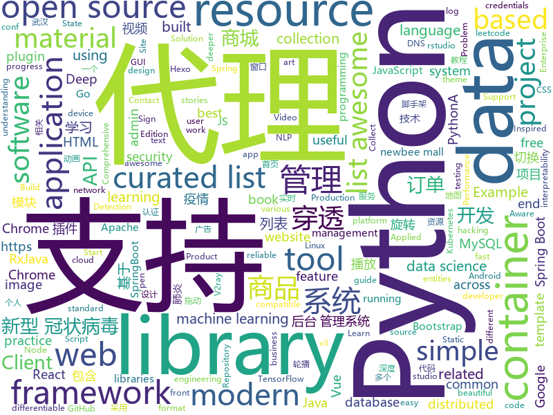

# 2020-01-30
See what the GitHub community is most excited about today.

## python
* [DXY-2019-nCoV-Crawler](https://github.com/BlankerL/DXY-2019-nCoV-Crawler)(**63 stars today**): 2019新型冠状病毒疫情实时爬虫
* [python-cheatsheet](https://github.com/gto76/python-cheatsheet)(**34 stars today**): Comprehensive Python Cheatsheet
* [spiderfoot](https://github.com/smicallef/spiderfoot)(**73 stars today**): SpiderFoot, the most complete OSINT collection and reconnaissance tool.
* [NLP-progress](https://github.com/sebastianruder/NLP-progress)(**66 stars today**): Repository to track the progress in Natural Language Processing (NLP), including the datasets and the current state-of-the-art for the most common NLP tasks.
* [sight](https://github.com/rish-16/sight)(**26 stars today**): 👁Sightseer: State-of-the-art Computer Vision and Object Detection for TensorFlow
* [Awesome-Linux-Software](https://github.com/luong-komorebi/Awesome-Linux-Software)(**42 stars today**): A list of awesome applications, software, tools and other materials for Linux distros.
* [awesome-python](https://github.com/vinta/awesome-python)(**58 stars today**): A curated list of awesome Python frameworks, libraries, software and resources
* [rex-gym](https://github.com/nicrusso7/rex-gym)(**35 stars today**): OpenAI Gym environments for an open-source quadruped robot (SpotMicro)
* [DAIN](https://github.com/baowenbo/DAIN)(**69 stars today**): Depth-Aware Video Frame Interpolation (CVPR 2019)
* [interpy-zh](https://github.com/eastlakeside/interpy-zh)(**26 stars today**): 📘《Python进阶》（Intermediate Python 中文版）
* [fastapi](https://github.com/tiangolo/fastapi)(**86 stars today**): FastAPI framework, high performance, easy to learn, fast to code, ready for production
* [thinc](https://github.com/explosion/thinc)(**295 stars today**): 🔮A refreshing functional take on deep learning, compatible with your favorite libraries
* [rich](https://github.com/willmcgugan/rich)(**82 stars today**): Rich is a Python library for rich text and beautiful formatting in the terminal.
* [Vieux](https://github.com/MatthewPierson/Vieux)(**11 stars today**): Vieux - A tool for 32/64 Bit iOS downgrades using OTA Blobs
* [vardbg](https://github.com/CCExtractor/vardbg)(**195 stars today**): A simple Python debugger and profiler that generates animated visualizations of program flow, useful for algorithm learning.
* [Deep-Learning-with-TensorFlow-book](https://github.com/dragen1860/Deep-Learning-with-TensorFlow-book)(**31 stars today**): 深度学习入门开源书，基于TensorFlow 2.0案例实战。Open source Deep Learning book, based on TensorFlow 2.0 framework.
* [bpf-perf-tools-book](https://github.com/brendangregg/bpf-perf-tools-book)(**11 stars today**): Official repository for the BPF Performance Tools book
* [google-cloud-python](https://github.com/googleapis/google-cloud-python)(**3 stars today**): Google Cloud Client Library for Python
* [anchore-engine](https://github.com/anchore/anchore-engine)(**4 stars today**): A service that analyzes docker images and applies user-defined acceptance policies to allow automated container image validation and certification
* [tinder-swipe-bot](https://github.com/aj-4/tinder-swipe-bot)(**21 stars today**): 
* [captum](https://github.com/pytorch/captum)(**7 stars today**): Model interpretability and understanding for PyTorch
* [Eel](https://github.com/samuelhwilliams/Eel)(**8 stars today**): A little Python library for making simple Electron-like HTML/JS GUI apps
* [policy_sentry](https://github.com/salesforce/policy_sentry)(**48 stars today**): IAM Least Privilege Policy Generator
* [anomaly-detection-resources](https://github.com/yzhao062/anomaly-detection-resources)(**6 stars today**): Anomaly detection related books, papers, videos, and toolboxes
* [daily-coding-problem](https://github.com/vineetjohn/daily-coding-problem)(**3 stars today**): Solutions to problems sent by dailycodingproblem.com

## java
* [tutorials](https://github.com/eugenp/tutorials)(**33 stars today**): Just Announced - "Learn Spring Security OAuth":
* [GSYVideoPlayer](https://github.com/CarGuo/GSYVideoPlayer)(**8 stars today**): 视频播放器（IJKplayer、ExoPlayer、MediaPlayer），HTTPS，支持弹幕，外挂字幕，支持滤镜、水印、gif截图，片头广告、中间广告，多个同时播放，支持基本的拖动，声音、亮度调节，支持边播边缓存，支持视频自带rotation的旋转（90,270之类），重力旋转与手动旋转的同步支持，支持列表播放 ，列表全屏动画，视频加载速度，列表小窗口支持拖动，动画效果，调整比例，多分辨率切换，支持切换播放器，进度条小窗口预览，列表切换详情页面无缝播放，rtsp、concat、mpeg。
* [zfile](https://github.com/zhaojun1998/zfile)(**134 stars today**): 在线云盘
* [CDM](https://github.com/microsoft/CDM)(**3 stars today**): The Common Data Model (CDM) is a standard and extensible collection of schemas (entities, attributes, relationships) that represents business concepts and activities with well-defined semantics, to facilitate data interoperability. Examples of entities include: Account, Contact, Lead, Opportunity, Product, etc.
* [kafka](https://github.com/apache/kafka)(**12 stars today**): Mirror of Apache Kafka
* [flink](https://github.com/apache/flink)(**8 stars today**): Apache Flink
* [cas](https://github.com/apereo/cas)(**4 stars today**): Apereo CAS - Enterprise Single Sign On for all earthlings and beyond.
* [vhr](https://github.com/lenve/vhr)(**11 stars today**): 微人事是一个前后端分离的人力资源管理系统，项目采用SpringBoot+Vue开发。
* [halo](https://github.com/halo-dev/halo)(**18 stars today**): ✍ Halo 一款现代化的个人独立博客系统
* [newbee-mall](https://github.com/newbee-ltd/newbee-mall)(**12 stars today**): newbee-mall 项目（新蜂商城）是一套电商系统，包括 newbee-mall 商城系统及 newbee-mall-admin 商城后台管理系统，基于 Spring Boot 2.X 及相关技术栈开发。 前台商城系统包含首页门户、商品分类、新品上线、首页轮播、商品推荐、商品搜索、商品展示、购物车、订单结算、订单流程、个人订单管理、会员中心、帮助中心等模块。 后台管理系统包含数据面板、轮播图管理、商品管理、订单管理、会员管理、分类管理、设置等模块。
* [JavaGuide](https://github.com/Snailclimb/JavaGuide)(**34 stars today**): 【Java学习+面试指南】 一份涵盖大部分Java程序员所需要掌握的核心知识。
* [java-docs-samples](https://github.com/GoogleCloudPlatform/java-docs-samples)(**3 stars today**): 
* [openhab-addons](https://github.com/openhab/openhab-addons)(**2 stars today**): Add-ons for openHAB
* [Arduino](https://github.com/arduino/Arduino)(**3 stars today**): open-source electronics prototyping platform
* [RxJava2-Android-Samples](https://github.com/amitshekhariitbhu/RxJava2-Android-Samples)(**2 stars today**): RxJava 2 Android Examples - Migration From RxJava 1 to RxJava 2 - How to use RxJava 2 in Android
* [spring-boot-examples](https://github.com/ityouknow/spring-boot-examples)(**7 stars today**): about learning Spring Boot via examples. Spring Boot 教程、技术栈示例代码，快速简单上手教程。
* [linuxdeploy](https://github.com/meefik/linuxdeploy)(**6 stars today**): Install and run GNU/Linux on Android
* [spring-boot](https://github.com/spring-projects/spring-boot)(**14 stars today**): Spring Boot
* [views-widgets-samples](https://github.com/android/views-widgets-samples)(**7 stars today**): Multiple samples showing the best practices in views-widgets on Android.
* [zuihou-admin-cloud](https://github.com/zuihou/zuihou-admin-cloud)(**5 stars today**): 基于SpringCloud(Hoxton.SR1) + SpringBoot(2.2.2.RELEASE) 的SaaS 微服务脚手架，具有统一授权、认证后台管理系统，其中包含具备用户管理、资源权限管理、网关API、分布式事务、大文件断点分片续传等多个模块，支持多业务系统并行开发，可以作为后端服务的开发脚手架。代码简洁，架构清晰，适合学习和直接项目中使用。核心技术采用Nacos、Fegin、Ribbon、Zuul、Hystrix、JWT Token、Mybatis、SpringBoot、Redis、RibbitMQ等主要框架和中间件。
* [strimzi-kafka-operator](https://github.com/strimzi/strimzi-kafka-operator)(**3 stars today**): Apache Kafka running on Kubernetes
* [springdoc-openapi](https://github.com/springdoc/springdoc-openapi)(**4 stars today**): Library for OpenAPI 3 with spring-boot
* [NetGuard](https://github.com/M66B/NetGuard)(**8 stars today**): A simple way to block access to the internet per app
* [useful-java-links](https://github.com/Vedenin/useful-java-links)(**3 stars today**): A list of useful Java frameworks, libraries, software and hello worlds examples
* [PhotoEditor](https://github.com/burhanrashid52/PhotoEditor)(**4 stars today**): A Photo Editor library with simple, easy support for image editing using paints,text,filters,emoji and Sticker like stories.

## unknown
* [shareOI](https://github.com/hzwer/shareOI)(**110 stars today**): OI & ACM 课件分享
* [difftaichi](https://github.com/yuanming-hu/difftaichi)(**95 stars today**): 10 differentiable physical simulators built with Taichi differentiable programming (DiffTaichi, ICLR 2020)
* [hacker-roadmap](https://github.com/sundowndev/hacker-roadmap)(**308 stars today**): 📌A guide for amateurs pen testers and a collection of hacking tools, resources and references to practice ethical hacking, pen testing and web security.
* [wuhan2020](https://github.com/wuhan2020/wuhan2020)(**878 stars today**): 武汉新型冠状病毒防疫信息收集平台
* [freelancing-in-finland](https://github.com/sam-hosseini/freelancing-in-finland)(**67 stars today**): The ultimate resource for transitioning to freelancing for software developers👩‍💻🇫🇮
* [architect-awesome](https://github.com/xingshaocheng/architect-awesome)(**16 stars today**): 后端架构师技术图谱
* [computer-science](https://github.com/ossu/computer-science)(**41 stars today**): 🎓Path to a free self-taught education in Computer Science!
* [Awesome](https://github.com/Awesome-Windows/Awesome)(**57 stars today**): 💻An awesome & curated list of best applications and tools for Windows.
* [awesome-scalability](https://github.com/binhnguyennus/awesome-scalability)(**188 stars today**): The Patterns of Scalable, Reliable, and Performant Large-Scale Systems
* [bootcamp-gostack-desafio-02](https://github.com/Rocketseat/bootcamp-gostack-desafio-02)(**5 stars today**): Desafio do segundo módulo do Bootcamp GoStack🚀👨🏻‍🚀
* [awesome-google-vrp-writeups](https://github.com/xdavidhu/awesome-google-vrp-writeups)(**43 stars today**): 🐛A list of writeups from the Google VRP Bug Bounty program
* [developer-roadmap](https://github.com/kamranahmedse/developer-roadmap)(**90 stars today**): Roadmap to becoming a web developer in 2020
* [Tips-of-Feature-engineering](https://github.com/Pysamlam/Tips-of-Feature-engineering)(**69 stars today**): A feature engineering kit for each issue, to give you a deeper and deeper understanding of the work of feature engineering!
* [awesome-machine-learning-interpretability](https://github.com/jphall663/awesome-machine-learning-interpretability)(**7 stars today**): A curated list of awesome machine learning interpretability resources.
* [awesome-remote-job](https://github.com/lukasz-madon/awesome-remote-job)(**19 stars today**): A curated list of awesome remote jobs and resources. Inspired by https://github.com/vinta/awesome-python
* [industry-machine-learning](https://github.com/firmai/industry-machine-learning)(**11 stars today**): A curated list of applied machine learning and data science notebooks and libraries across different industries.
* [modern-cpp-features](https://github.com/AnthonyCalandra/modern-cpp-features)(**8 stars today**): A cheatsheet of modern C++ language and library features.
* [Novel-Coronavirus-Updates](https://github.com/839Studio/Novel-Coronavirus-Updates)(**10 stars today**): 新增确诊新型冠状病毒肺炎统计数据（每日更新）
* [build-your-own-x](https://github.com/danistefanovic/build-your-own-x)(**31 stars today**): 🤓Build your own (insert technology here)
* [p1xt-guides](https://github.com/P1xt/p1xt-guides)(**23 stars today**): Programming curricula
* [py-sanity](https://github.com/rednafi/py-sanity)(**60 stars today**): Opinionated coding guidelines and best practices in Python
* [awesome-django](https://github.com/wsvincent/awesome-django)(**7 stars today**): A curated list of awesome things related to Django
* [gitignore](https://github.com/github/gitignore)(**51 stars today**): A collection of useful .gitignore templates
* [Tvlist-awesome-m3u-m3u8](https://github.com/billy21/Tvlist-awesome-m3u-m3u8)(**35 stars today**): 直播源相关资源汇总📺💯IPTV、M3U
* [ml-contests-conf](https://github.com/skrish13/ml-contests-conf)(**13 stars today**): ML and DL related contests, competitions and conference challenges.

## javascript
* [jira_clone](https://github.com/oldboyxx/jira_clone)(**790 stars today**): A simplified Jira clone built with React/Babel (Client), and Node/TypeScript (API). Auto formatted with Prettier, tested with Cypress.
* [map-viz](https://github.com/wuhan2020/map-viz)(**34 stars today**): 通用的地图可视化组件
* [ChromeAppHeroes](https://github.com/zhaoolee/ChromeAppHeroes)(**36 stars today**): 🌈谷粒-Chrome插件英雄榜, 为优秀的Chrome插件写一本中文说明书, 让Chrome插件英雄们造福人类~ ChromePluginHeroes, Write a Chinese manual for the excellent Chrome plugin, let the Chrome plugin heroes benefit the human~
* [Rules](https://github.com/lhie1/Rules)(**14 stars today**): Rules / 规则：Surge / Shadowrocket / QuantumultX / Clash(X|A)
* [gatsby](https://github.com/gatsbyjs/gatsby)(**38 stars today**): Build blazing fast, modern apps and websites with React
* [svelte](https://github.com/sveltejs/svelte)(**50 stars today**): Cybernetically enhanced web apps
* [v3](https://github.com/exercism/v3)(**14 stars today**): The work-in-progress project for developing v3 tracks
* [puppeteer](https://github.com/puppeteer/puppeteer)(**92 stars today**): Headless Chrome Node.js API
* [leetcode](https://github.com/azl397985856/leetcode)(**65 stars today**): LeetCode Solutions: A Record of My Problem Solving Journey.( leetcode题解，记录自己的leetcode解题之路。)
* [netlify-cms](https://github.com/netlify/netlify-cms)(**20 stars today**): A CMS for Static Site Generators
* [create-react-app](https://github.com/facebook/create-react-app)(**46 stars today**): Set up a modern web app by running one command.
* [vanillawebprojects](https://github.com/bradtraversy/vanillawebprojects)(**148 stars today**): Mini projects built with HTML5, CSS & JavaScript. No frameworks or libraries
* [label-studio](https://github.com/heartexlabs/label-studio)(**59 stars today**): Label Studio is a multi-type data labeling and annotation tool with standardized output format
* [2019-ncov](https://github.com/shfshanyue/2019-ncov)(**41 stars today**): 武汉肺炎疫情实时省市地图
* [material-table](https://github.com/mbrn/material-table)(**19 stars today**): Datatable for React based on material-ui's table with additional features
* [insomnia](https://github.com/Kong/insomnia)(**37 stars today**): Cross-platform HTTP and GraphQL Client
* [awesome-mac](https://github.com/jaywcjlove/awesome-mac)(**43 stars today**):  Now we have become very big, Different from the original idea. Collect premium software in various categories.
* [Sortable](https://github.com/SortableJS/Sortable)(**13 stars today**): Sortable — is a JavaScript library for reorderable drag-and-drop lists on modern browsers and touch devices. No jQuery required. Supports Meteor, AngularJS, React, Polymer, Vue, Ember, Knockout and any CSS library, e.g. Bootstrap.
* [Scripts](https://github.com/outflanknl/Scripts)(**27 stars today**): Small scripts that make life better
* [gridstudio](https://github.com/ricklamers/gridstudio)(**6 stars today**): Grid studio is a web-based application for data science with full integration of open source data science frameworks and languages.
* [pneumonia](https://github.com/lispczz/pneumonia)(**51 stars today**): 中国新型冠状病毒肺炎地级市疫情图
* [incubator-superset](https://github.com/apache/incubator-superset)(**12 stars today**): Apache Superset (incubating) is a modern, enterprise-ready business intelligence web application
* [Inputmask](https://github.com/RobinHerbots/Inputmask)(**3 stars today**): Input Mask plugin
* [sigma.js](https://github.com/jacomyal/sigma.js)(**5 stars today**): A JavaScript library dedicated to graph drawing
* [goforeat](https://github.com/syun0216/goforeat)(**19 stars today**): 🍔日日有得食

## html
* [Guide-RGPD-du-developpeur](https://github.com/LINCnil/Guide-RGPD-du-developpeur)(**138 stars today**): La CNIL publie un guide RGPD pour les développeurs
* [Python-Application-Gui](https://github.com/test123/Python-Application-Gui)(**18 stars today**): A template for desktop applications with an HTML front end and Python back end.
* [coreui-free-laravel-admin-template](https://github.com/coreui/coreui-free-laravel-admin-template)(**5 stars today**): CoreUI Free Laravel Bootstrap Admin Template
* [html](https://github.com/whatwg/html)(**8 stars today**): HTML Standard
* [text-mining](https://github.com/rstudio-conf-2020/text-mining)(**6 stars today**): Text Mining with Tidy Data Principles✨📖✨
* [design-ds-classroom](https://github.com/rstudio-conf-2020/design-ds-classroom)(**2 stars today**): Materials for the Designing the Data Science Classroom workshop at rstudio::conf 2020
* [nndl.github.io](https://github.com/nndl/nndl.github.io)(**4 stars today**): 《神经网络与深度学习》 邱锡鹏著 Neural Network and Deep Learning
* [rmarkdown-dashboard](https://github.com/rstudio-conf-2020/rmarkdown-dashboard)(**5 stars today**): The R Markdown and Interactive Dashboards Workshp at rstudio::conf 2020
* [applied-ml](https://github.com/rstudio-conf-2020/applied-ml)(**13 stars today**): Code and Resources for "Applied Machine Learning"
* [GDIndex](https://github.com/maple3142/GDIndex)(**1 stars today**): A Google Drive Index built with Vue Running on CloudFlare Workers
* [zfaka](https://github.com/zlkbdotnet/zfaka)(**4 stars today**): 免费、安全、稳定、高效的发卡系统，值得拥有!
* [ru.javascript.info](https://github.com/javascript-tutorial/ru.javascript.info)(**5 stars today**): Современный учебник JavaScript
* [pcc_2e](https://github.com/ehmatthes/pcc_2e)(**6 stars today**): Online resources for Python Crash Course (Second Edition), from No Starch Press
* [jekflix-template](https://github.com/thiagorossener/jekflix-template)(**2 stars today**): A Jekyll template inspired by Netflix.🎬
* [learn-to-send-email-via-google-script-html-no-server](https://github.com/dwyl/learn-to-send-email-via-google-script-html-no-server)(**2 stars today**): ✉️An Example of using an HTML form (e.g: "Contact Us" on a website) to send Email without a Backend Server (using a Google Script) perfect for static websites that need to collect data.
* [startbootstrap-sb-admin-2](https://github.com/BlackrockDigital/startbootstrap-sb-admin-2)(**3 stars today**): A free, open source, Bootstrap admin theme created by Start Bootstrap
* [kubernetes-failure-stories](https://github.com/hjacobs/kubernetes-failure-stories)(**9 stars today**): Compilation of public failure/horror stories related to Kubernetes
* [intro-to-ml-tidy](https://github.com/rstudio-conf-2020/intro-to-ml-tidy)(**7 stars today**): Intro to Machine Learning with the Tidyverse
* [front-end-handbook-2019](https://github.com/FrontendMasters/front-end-handbook-2019)(**4 stars today**): [Book] 2019 edition of our front-end development handbook
* [country-list](https://github.com/umpirsky/country-list)(**1 stars today**): 🌐List of all countries with names and ISO 3166-1 codes in all languages and data formats.
* [webgl-fundamentals](https://github.com/gfxfundamentals/webgl-fundamentals)(**2 stars today**): WebGL lessons that start with the basics
* [JavaScript30](https://github.com/wesbos/JavaScript30)(**13 stars today**): 30 Day Vanilla JS Challenge
* [py4e](https://github.com/csev/py4e)(**1 stars today**): Web site for www.py4e.com and source to the Python 3.0 textbook
* [hexo-theme-matery](https://github.com/blinkfox/hexo-theme-matery)(**3 stars today**): A beautiful hexo blog theme with material design and responsive design.一个基于材料设计和响应式设计而成的全面、美观的Hexo主题。
* [tools](https://github.com/googlecodelabs/tools)(**3 stars today**): Codelabs management & hosting tools

## go
* [trivy](https://github.com/aquasecurity/trivy)(**10 stars today**): A Simple and Comprehensive Vulnerability Scanner for Containers, Suitable for CI
* [go](https://github.com/golang/go)(**51 stars today**): The Go programming language
* [opentelemetry-go](https://github.com/open-telemetry/opentelemetry-go)(**5 stars today**): OpenTelemetry Go API and SDK
* [singularity](https://github.com/sylabs/singularity)(**5 stars today**): Singularity: Application containers for Linux
* [tidb](https://github.com/pingcap/tidb)(**15 stars today**): TiDB is an open source distributed HTAP database compatible with the MySQL protocol
* [go-github](https://github.com/google/go-github)(**6 stars today**): Go library for accessing the GitHub API
* [goproxy](https://github.com/snail007/goproxy)(**7 stars today**): Proxy是高性能全功能的http代理、https代理、socks5代理、内网穿透、内网穿透p2p、内网穿透代理、内网穿透反向代理、内网穿透服务器、Websocket代理、TCP代理、UDP代理、DNS代理、DNS加密代理，代理API认证，全能跨平台代理服务器。
* [metrics-server](https://github.com/kubernetes-sigs/metrics-server)(**3 stars today**): Cluster-wide aggregator of resource usage data.
* [v2ray-poseidon](https://github.com/ColetteContreras/v2ray-poseidon)(**2 stars today**): A buildin V2ray plugin for SSRPanel, V2board and SSPanel-v3-Uim to sync users from database to v2ray, to log traffics/system info
* [harbor](https://github.com/goharbor/harbor)(**9 stars today**): An open source trusted cloud native registry project that stores, signs, and scans content.
* [loki](https://github.com/grafana/loki)(**10 stars today**): Like Prometheus, but for logs.
* [kubernetes](https://github.com/kubernetes/kubernetes)(**40 stars today**): Production-Grade Container Scheduling and Management
* [filestash](https://github.com/mickael-kerjean/filestash)(**5 stars today**): 🦄A modern web client for SFTP, S3, FTP, WebDAV, Git, Minio, LDAP, CalDAV, CardDAV, Mysql, Backblaze, ...
* [flamingo](https://github.com/atredispartners/flamingo)(**37 stars today**): Flamingo captures credentials sprayed across the network by various IT and security products.
* [consul](https://github.com/hashicorp/consul)(**8 stars today**): Consul is a distributed, highly available, and data center aware solution to connect and configure applications across dynamic, distributed infrastructure.
* [testify](https://github.com/stretchr/testify)(**8 stars today**): A toolkit with common assertions and mocks that plays nicely with the standard library
* [vitess](https://github.com/vitessio/vitess)(**12 stars today**): Vitess is a database clustering system for horizontal scaling of MySQL.
* [deviceplane](https://github.com/deviceplane/deviceplane)(**25 stars today**): Open source device management for embedded systems and edge computing
* [fyne](https://github.com/fyne-io/fyne)(**7 stars today**): Cross platform GUI in Go based on Material Design
* [flagger](https://github.com/weaveworks/flagger)(**5 stars today**): Progressive delivery Kubernetes operator (Canary, A/B Testing and Blue/Green deployments)
* [containerd](https://github.com/containerd/containerd)(**7 stars today**): An open and reliable container runtime
* [moby](https://github.com/moby/moby)(**10 stars today**): Moby Project - a collaborative project for the container ecosystem to assemble container-based systems
* [terraform-provider-azurerm](https://github.com/terraform-providers/terraform-provider-azurerm)(**5 stars today**): Terraform provider for Azure Resource Manager
* [evilginx2](https://github.com/kgretzky/evilginx2)(**7 stars today**): Standalone man-in-the-middle attack framework used for phishing login credentials along with session cookies, allowing for the bypass of 2-factor authentication
* [minikube](https://github.com/kubernetes/minikube)(**14 stars today**): Run Kubernetes locally

## WordCloud

