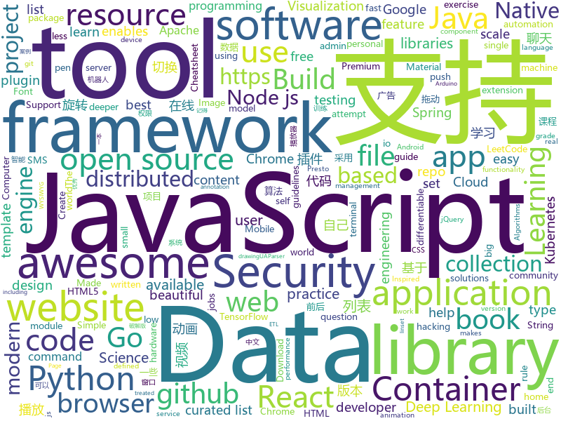

# 2020-01-31
See what the GitHub community is most excited about today.

## python
* [Chaos](https://github.com/jonnyhyman/Chaos)(**87 stars today**): Visualizations of the connections between chaos theory and fractals through the logistic map; made for Veritasium YouTube video
* [python-cheatsheet](https://github.com/gto76/python-cheatsheet)(**46 stars today**): Comprehensive Python Cheatsheet
* [tinder-swipe-bot](https://github.com/aj-4/tinder-swipe-bot)(**20 stars today**): 
* [interpy-zh](https://github.com/eastlakeside/interpy-zh)(**31 stars today**): 📘《Python进阶》（Intermediate Python 中文版）
* [CppCoreGuidelines](https://github.com/isocpp/CppCoreGuidelines)(**15 stars today**): The C++ Core Guidelines are a set of tried-and-true guidelines, rules, and best practices about coding in C++
* [chatbot](https://github.com/zhaoyingjun/chatbot)(**5 stars today**): 一个可以自己进行训练的中文聊天机器人， 根据自己的语料训练出自己想要的聊天机器人，可以用于智能客服、在线问答、智能聊天等场景。目前包含seq2seq、seqGAN版本和tf2.0版本。
* [donkeycar](https://github.com/autorope/donkeycar)(**14 stars today**): Open source hardware and software platform to build a small scale self driving car.
* [Deep-Learning-with-TensorFlow-book](https://github.com/dragen1860/Deep-Learning-with-TensorFlow-book)(**25 stars today**): 深度学习入门开源书，基于TensorFlow 2.0案例实战。Open source Deep Learning book, based on TensorFlow 2.0 framework.
* [catalyst](https://github.com/catalyst-team/catalyst)(**50 stars today**): Accelerated DL & RL
* [DialoGPT](https://github.com/microsoft/DialoGPT)(**9 stars today**): Large-scale pretraining for dialogue
* [DiCE](https://github.com/microsoft/DiCE)(**34 stars today**): Generate Diverse Counterfactual Explanations for any machine learning model.
* [sight](https://github.com/rish-16/sight)(**33 stars today**): 👁Sightseer: State-of-the-art Computer Vision and Object Detection for TensorFlow
* [spinningup](https://github.com/openai/spinningup)(**92 stars today**): An educational resource to help anyone learn deep reinforcement learning.
* [django-rest-auth](https://github.com/Tivix/django-rest-auth)(**4 stars today**): This app makes it extremely easy to build Django powered SPA's (Single Page App) or Mobile apps exposing all registration and authentication related functionality as CBV's (Class Base View) and REST (JSON)
* [fuzzywuzzy](https://github.com/seatgeek/fuzzywuzzy)(**18 stars today**): Fuzzy String Matching in Python
* [pytorch_geometric](https://github.com/rusty1s/pytorch_geometric)(**8 stars today**): Geometric Deep Learning Extension Library for PyTorch
* [causalnex](https://github.com/quantumblacklabs/causalnex)(**31 stars today**): A Python library that helps data scientists to infer causation rather than observing correlation.
* [Awesome-Linux-Software](https://github.com/luong-komorebi/Awesome-Linux-Software)(**109 stars today**): A list of awesome applications, software, tools and other materials for Linux distros.
* [persepolis](https://github.com/persepolisdm/persepolis)(**5 stars today**): Persepolis Download Manager is a GUI for aria2.
* [DeepLabCut](https://github.com/AlexEMG/DeepLabCut)(**4 stars today**): Markerless pose estimation of user-defined features with deep learning for all animals, including humans
* [pointnet](https://github.com/charlesq34/pointnet)(**4 stars today**): PointNet: Deep Learning on Point Sets for 3D Classification and Segmentation
* [pip-tools](https://github.com/jazzband/pip-tools)(**13 stars today**): A set of tools to keep your pinned Python dependencies fresh.
* [safaribooks](https://github.com/lorenzodifuccia/safaribooks)(**5 stars today**): Download and generate EPUB of your favorite books from Safari Books Online library.
* [awesome-python-login-model](https://github.com/Kr1s77/awesome-python-login-model)(**8 stars today**): 😮python模拟登陆一些大型网站，还有一些简单的爬虫，希望对你们有所帮助❤️，如果喜欢记得给个star哦🌟
* [cupp](https://github.com/Mebus/cupp)(**9 stars today**): Common User Passwords Profiler (CUPP)

## java
* [tutorials](https://github.com/eugenp/tutorials)(**38 stars today**): Just Announced - "Learn Spring Security OAuth":
* [JavaGuide](https://github.com/Snailclimb/JavaGuide)(**42 stars today**): 【Java学习+面试指南】 一份涵盖大部分Java程序员所需要掌握的核心知识。
* [pentaho-kettle](https://github.com/pentaho/pentaho-kettle)(**2 stars today**): Pentaho Data Integration ( ETL ) a.k.a Kettle
* [LeetCodeAnimation](https://github.com/MisterBooo/LeetCodeAnimation)(**50 stars today**): Demonstrate all the questions on LeetCode in the form of animation.（用动画的形式呈现解LeetCode题目的思路）
* [Play-with-Algorithms](https://github.com/liuyubobobo/Play-with-Algorithms)(**6 stars today**): Codes of my MOOC Course <Play with Algorithms>, Both in C++ and Java language. Updated contents and practices are also included. 我在慕课网上的课程《算法与数据结构》示例代码，包括C++和Java版本。课程的更多更新内容及辅助练习也将逐步添加进这个代码仓。
* [presto](https://github.com/prestosql/presto)(**6 stars today**): Official home of the community managed version of Presto, the distributed SQL query engine for big data, under the auspices of the Presto Software Foundation.
* [zfile](https://github.com/zhaojun1998/zfile)(**80 stars today**): 在线云盘
* [react-native-image-picker](https://github.com/react-native-community/react-native-image-picker)(**3 stars today**): 🌄A React Native module that allows you to use native UI to select media from the device library or directly from the camera.
* [graphhopper](https://github.com/graphhopper/graphhopper)(**4 stars today**): An open source routing engine. Use it as Java library or server. With OpenStreetMap.
* [dubbo](https://github.com/apache/dubbo)(**4 stars today**): Apache Dubbo is a high-performance, java based, open source RPC framework.
* [GSYVideoPlayer](https://github.com/CarGuo/GSYVideoPlayer)(**11 stars today**): 视频播放器（IJKplayer、ExoPlayer、MediaPlayer），HTTPS，支持弹幕，外挂字幕，支持滤镜、水印、gif截图，片头广告、中间广告，多个同时播放，支持基本的拖动，声音、亮度调节，支持边播边缓存，支持视频自带rotation的旋转（90,270之类），重力旋转与手动旋转的同步支持，支持列表播放 ，列表全屏动画，视频加载速度，列表小窗口支持拖动，动画效果，调整比例，多分辨率切换，支持切换播放器，进度条小窗口预览，列表切换详情页面无缝播放，rtsp、concat、mpeg。
* [halo](https://github.com/halo-dev/halo)(**27 stars today**): ✍ Halo 一款现代化的个人独立博客系统
* [java-docs-samples](https://github.com/GoogleCloudPlatform/java-docs-samples)(**5 stars today**): 
* [liquibase](https://github.com/liquibase/liquibase)(**2 stars today**): Main Liquibase Source
* [zookeeper](https://github.com/apache/zookeeper)(**4 stars today**): Mirror of Apache Hadoop ZooKeeper
* [JFoenix](https://github.com/jfoenixadmin/JFoenix)(**3 stars today**): JavaFX Material Design Library
* [karate](https://github.com/intuit/karate)(**5 stars today**): Test Automation Made Simple
* [xmind](https://github.com/xmindltd/xmind)(**4 stars today**): The most popular mind mapping software
* [eladmin](https://github.com/elunez/eladmin)(**10 stars today**): 项目基于 Spring Boot 2.1.0 、 Jpa、 Spring Security、redis、Vue的前后端分离的后台管理系统，项目采用分模块开发方式， 权限控制采用 RBAC，支持数据字典与数据权限管理，支持一键生成前后端代码，支持动态路由
* [react-native-datetimepicker](https://github.com/react-native-community/react-native-datetimepicker)(**5 stars today**): React Native date & time picker component for iOS and Android
* [kafka](https://github.com/apache/kafka)(**10 stars today**): Mirror of Apache Kafka
* [RxAndroidBle](https://github.com/Polidea/RxAndroidBle)(**4 stars today**): An Android Bluetooth Low Energy (BLE) Library with RxJava2 interface
* [tomcat](https://github.com/apache/tomcat)(**2 stars today**): Apache Tomcat
* [Algorithms](https://github.com/jimmysuncpt/Algorithms)(**2 stars today**): The codes and my solutions to exercises from the book "Algorithms" (4th edition) by Robert Sedgewick and Kevin Wayne.
* [qksms](https://github.com/moezbhatti/qksms)(**3 stars today**): The most beautiful SMS messenger for Android

## unknown
* [architect-awesome](https://github.com/xingshaocheng/architect-awesome)(**25 stars today**): 后端架构师技术图谱
* [Tips-of-Feature-engineering](https://github.com/Pysamlam/Tips-of-Feature-engineering)(**50 stars today**): A feature engineering kit for each issue, to give you a deeper and deeper understanding of the work of feature engineering!
* [hacker-roadmap](https://github.com/sundowndev/hacker-roadmap)(**272 stars today**): 📌A guide for amateurs pen testers and a collection of hacking tools, resources and references to practice ethical hacking, pen testing and web security.
* [difftaichi](https://github.com/yuanming-hu/difftaichi)(**93 stars today**): 10 differentiable physical simulators built with Taichi differentiable programming (DiffTaichi, ICLR 2020)
* [MicrosoftSecurity](https://github.com/MarkSimos/MicrosoftSecurity)(**7 stars today**): Microsoft Security Guidance
* [freelancing-in-finland](https://github.com/sam-hosseini/freelancing-in-finland)(**93 stars today**): The ultimate resource for transitioning to freelancing for software developers👩‍💻🇫🇮
* [shareOI](https://github.com/hzwer/shareOI)(**164 stars today**): 算法竞赛课件分享
* [computer-science](https://github.com/ossu/computer-science)(**64 stars today**): 🎓Path to a free self-taught education in Computer Science!
* [awesome-remote-job](https://github.com/lukasz-madon/awesome-remote-job)(**23 stars today**): A curated list of awesome remote jobs and resources. Inspired by https://github.com/vinta/awesome-python
* [gitignore](https://github.com/github/gitignore)(**51 stars today**): A collection of useful .gitignore templates
* [free-programming-books](https://github.com/EbookFoundation/free-programming-books)(**70 stars today**): 📚Freely available programming books
* [DIY-Air-Purifier](https://github.com/Kels316/DIY-Air-Purifier)(**18 stars today**): A small DIY air purifier using off-the-shelf components for under $100
* [Awesome](https://github.com/Awesome-Windows/Awesome)(**105 stars today**): 💻An awesome & curated list of best applications and tools for Windows.
* [ds-cheatsheets](https://github.com/FavioVazquez/ds-cheatsheets)(**10 stars today**): List of Data Science Cheatsheets to rule the world
* [arduino-pro-ide](https://github.com/arduino/arduino-pro-ide)(**6 stars today**): The Arduino IDE for advanced users and developers. Experimental alpha version.
* [awesome-ml-for-cybersecurity](https://github.com/jivoi/awesome-ml-for-cybersecurity)(**3 stars today**): Machine Learning for Cyber Security
* [leeml-notes](https://github.com/datawhalechina/leeml-notes)(**5 stars today**): 李宏毅《机器学习》笔记，在线阅读地址：https://datawhalechina.github.io/leeml-notes
* [terminal-mac-cheatsheet](https://github.com/0nn0/terminal-mac-cheatsheet)(**4 stars today**): List of my most used commands and shortcuts in the terminal for Mac
* [You-Dont-Know-JS](https://github.com/getify/You-Dont-Know-JS)(**62 stars today**): A book series on JavaScript. @YDKJS on twitter.
* [awesome-cpp](https://github.com/fffaraz/awesome-cpp)(**15 stars today**): A curated list of awesome C++ (or C) frameworks, libraries, resources, and shiny things. Inspired by awesome-... stuff.
* [what-happens-when](https://github.com/alex/what-happens-when)(**12 stars today**): An attempt to answer the age old interview question "What happens when you type google.com into your browser and press enter?"
* [awesome-datascience](https://github.com/academic/awesome-datascience)(**8 stars today**): 📝An awesome Data Science repository to learn and apply for real world problems.
* [community-meetups](https://github.com/innovationacademy-kr/community-meetups)(**14 stars today**): 한국에서 벌어지는 커뮤니티 행사들, by
* [awesome-ruby](https://github.com/markets/awesome-ruby)(**9 stars today**): 💎A collection of awesome Ruby libraries, tools, frameworks and software
* [p1xt-guides](https://github.com/P1xt/p1xt-guides)(**17 stars today**): Programming curricula

## javascript
* [vanillawebprojects](https://github.com/bradtraversy/vanillawebprojects)(**194 stars today**): Mini projects built with HTML5, CSS & JavaScript. No frameworks or libraries
* [awesome-mac](https://github.com/jaywcjlove/awesome-mac)(**40 stars today**):  Now we have become very big, Different from the original idea. Collect premium software in various categories.
* [jquery](https://github.com/jquery/jquery)(**11 stars today**): jQuery JavaScript Library
* [label-studio](https://github.com/heartexlabs/label-studio)(**41 stars today**): Label Studio is a multi-type data labeling and annotation tool with standardized output format
* [ChromeAppHeroes](https://github.com/zhaoolee/ChromeAppHeroes)(**53 stars today**): 🌈谷粒-Chrome插件英雄榜, 为优秀的Chrome插件写一本中文说明书, 让Chrome插件英雄们造福人类~ ChromePluginHeroes, Write a Chinese manual for the excellent Chrome plugin, let the Chrome plugin heroes benefit the human~
* [fastify](https://github.com/fastify/fastify)(**15 stars today**): Fast and low overhead web framework, for Node.js
* [node-elm](https://github.com/bailicangdu/node-elm)(**17 stars today**): 基于 node.js + Mongodb 构建的后台系统
* [react-redux-realworld-example-app](https://github.com/gothinkster/react-redux-realworld-example-app)(**6 stars today**): Exemplary real world application built with React + Redux
* [coreui-free-react-admin-template](https://github.com/coreui/coreui-free-react-admin-template)(**6 stars today**): CoreUI React is free React admin template based on Bootstrap 4
* [sigma.js](https://github.com/jacomyal/sigma.js)(**10 stars today**): A JavaScript library dedicated to graph drawing
* [ua-parser-js](https://github.com/faisalman/ua-parser-js)(**6 stars today**): UAParser.js - JavaScript library to detect browser, engine, OS, CPU, and device type/model from userAgent string. Supports browser & node.js environment. Also available as jQuery/Zepto plugin, Bower/Meteor package, RequireJS/AMD module, & CLI tool.
* [howler.js](https://github.com/goldfire/howler.js)(**16 stars today**): Javascript audio library for the modern web.
* [anime](https://github.com/juliangarnier/anime)(**21 stars today**): JavaScript animation engine
* [pixi.js](https://github.com/pixijs/pixi.js)(**23 stars today**): The HTML5 Creation Engine: Create beautiful digital content with the fastest, most flexible 2D WebGL renderer.
* [Font-Awesome](https://github.com/FortAwesome/Font-Awesome)(**15 stars today**): The iconic SVG, font, and CSS toolkit
* [taniarascia.com](https://github.com/taniarascia/taniarascia.com)(**5 stars today**): 💾Personal website running on Gatsby, React, and Node.js.
* [complete-javascript-course](https://github.com/jonasschmedtmann/complete-javascript-course)(**12 stars today**): Starter files, final projects and FAQ for my Complete JavaScript course
* [classsed-react-firebase-client](https://github.com/hidjou/classsed-react-firebase-client)(**3 stars today**): 
* [cypress](https://github.com/cypress-io/cypress)(**25 stars today**): Fast, easy and reliable testing for anything that runs in a browser.
* [bootcamp-gostack-desafio-01](https://github.com/Rocketseat/bootcamp-gostack-desafio-01)(**9 stars today**): Desafio do primeiro módulo do Bootcamp GoStack🚀👨🏻‍🚀
* [bull](https://github.com/OptimalBits/bull)(**14 stars today**): Premium Queue package for handling distributed jobs and messages in NodeJS.
* [metamask-extension](https://github.com/MetaMask/metamask-extension)(**3 stars today**): 🌐🔌The MetaMask browser extension enables browsing Ethereum blockchain enabled websites.
* [google-access-helper](https://github.com/haotian-wang/google-access-helper)(**7 stars today**): 谷歌访问助手破解版
* [gatsby](https://github.com/gatsbyjs/gatsby)(**32 stars today**): Build blazing fast, modern apps and websites with React
* [Detox](https://github.com/wix/Detox)(**11 stars today**): Gray box end-to-end testing and automation framework for mobile apps

## html
* [Guide-RGPD-du-developpeur](https://github.com/LINCnil/Guide-RGPD-du-developpeur)(**137 stars today**): La CNIL publie un guide RGPD pour les développeurs
* [training-kit](https://github.com/github/training-kit)(**5 stars today**): Open source cheat sheets for Git and GitHub
* [aws-inventory](https://github.com/devops-israel/aws-inventory)(**16 stars today**): AWS Inventory in a single HTML file using JS AWS-SDK & Bootstrap
* [ds4ph-bme](https://github.com/bcaffo/ds4ph-bme)(**3 stars today**): A github repo for the Data Science in Public Health and Biomedical Engineering Course
* [personal-website](https://github.com/github/personal-website)(**15 stars today**): Code that'll help you kickstart a personal website that showcases your work as a software developer.
* [fonts](https://github.com/google/fonts)(**3 stars today**): Font files available from Google Fonts
* [Adminator-admin-dashboard](https://github.com/puikinsh/Adminator-admin-dashboard)(**5 stars today**): Adminator is a easy to use and well design admin dashboard template for web apps, websites, services and more
* [tiny-slider](https://github.com/ganlanyuan/tiny-slider)(**7 stars today**): Vanilla javascript slider for all purposes.
* [home-assistant.io](https://github.com/home-assistant/home-assistant.io)(**3 stars today**): 📘Home Assistant User documentation
* [community](https://github.com/sveltejs/community)(**5 stars today**): A repo for data relating to the svelte community and events
* [fluxion](https://github.com/FluxionNetwork/fluxion)(**3 stars today**): Fluxion is a remake of linset by vk496 with less bugs and enhanced functionality.
* [d3-book](https://github.com/scotthmurray/d3-book)(**3 stars today**): Code examples for “Interactive Data Visualization for the Web”
* [ASVS](https://github.com/OWASP/ASVS)(**2 stars today**): Application Security Verification Standard
* [learning-area](https://github.com/mdn/learning-area)(**5 stars today**): Github repo for the MDN Learning Area.
* [expressjs.com](https://github.com/expressjs/expressjs.com)(**3 stars today**): 
* [awesome-modern-cpp](https://github.com/rigtorp/awesome-modern-cpp)(**9 stars today**): A collection of resources on modern C++
* [hugo-academic](https://github.com/gcushen/hugo-academic)(**7 stars today**): 📝The website builder for Hugo. Build and deploy a beautiful website in minutes!
* [twofactorauth](https://github.com/2factorauth/twofactorauth)(**3 stars today**): List of sites with two factor auth support which includes SMS, email, phone calls, hardware, and software.
* [TheHive](https://github.com/TheHive-Project/TheHive)(**4 stars today**): TheHive: a Scalable, Open Source and Free Security Incident Response Platform
* [stat-learning](https://github.com/asadoughi/stat-learning)(**2 stars today**): Notes and exercise attempts for "An Introduction to Statistical Learning"
* [en.javascript.info](https://github.com/javascript-tutorial/en.javascript.info)(**12 stars today**): Modern JavaScript Tutorial
* [text-mining](https://github.com/rstudio-conf-2020/text-mining)(**4 stars today**): Text Mining with Tidy Data Principles✨📖✨
* [all-contributors](https://github.com/all-contributors/all-contributors)(**5 stars today**): ✨Recognize all contributors, not just the ones who push code✨
* [wysiwyg-editor](https://github.com/froala/wysiwyg-editor)(**1 stars today**): The next generation Javascript WYSIWYG HTML Editor.
* [OneList](https://github.com/MoeClub/OneList)(**3 stars today**): Simple index for onedrive

## go
* [charts](https://github.com/helm/charts)(**21 stars today**): Curated applications for Kubernetes
* [dapr](https://github.com/dapr/dapr)(**19 stars today**): Dapr is a portable, event-driven, runtime for building distributed applications across cloud and edge.
* [kubernetes](https://github.com/kubernetes/kubernetes)(**31 stars today**): Production-Grade Container Scheduling and Management
* [go-micro](https://github.com/micro/go-micro)(**11 stars today**): A Go microservices development framework https://go-micro.dev
* [rancher](https://github.com/rancher/rancher)(**6 stars today**): Complete container management platform
* [kiali](https://github.com/kiali/kiali)(**6 stars today**): Kiali project, observability for the Istio service mesh
* [runtime](https://github.com/kata-containers/runtime)(**9 stars today**): Kata Containers runtime
* [hub](https://github.com/github/hub)(**24 stars today**): A command-line tool that makes git easier to use with GitHub.
* [thanos](https://github.com/thanos-io/thanos)(**7 stars today**): Highly available Prometheus setup with long term storage capabilities. CNCF Sandbox project.
* [caire](https://github.com/esimov/caire)(**4 stars today**): Content aware image resize library
* [machine](https://github.com/docker/machine)(**3 stars today**): Machine management for a container-centric world
* [cli](https://github.com/cli/cli)(**187 stars today**): the GitHub CLI
* [vim-man](https://github.com/ozankasikci/vim-man)(**33 stars today**): A terminal based game that teaches you how to use Vim.
* [k3s](https://github.com/rancher/k3s)(**28 stars today**): Lightweight Kubernetes. 5 less than k8s.
* [golang-samples](https://github.com/GoogleCloudPlatform/golang-samples)(**4 stars today**): Sample apps and code written for Google Cloud in the Go programming language.
* [kube-bench](https://github.com/aquasecurity/kube-bench)(**7 stars today**): Checks whether Kubernetes is deployed according to security best practices as defined in the CIS Kubernetes Benchmark
* [terraform](https://github.com/hashicorp/terraform)(**19 stars today**): Terraform enables you to safely and predictably create, change, and improve infrastructure. It is an open source tool that codifies APIs into declarative configuration files that can be shared amongst team members, treated as code, edited, reviewed, and versioned.
* [drone](https://github.com/drone/drone)(**11 stars today**): Drone is a Container-Native, Continuous Delivery Platform
* [k3sup](https://github.com/alexellis/k3sup)(**9 stars today**): from Zero to KUBECONFIG in < 1 min🚀
* [sampler](https://github.com/sqshq/sampler)(**19 stars today**): Tool for shell commands execution, visualization and alerting. Configured with a simple YAML file.
* [kaniko](https://github.com/GoogleContainerTools/kaniko)(**11 stars today**): Build Container Images In Kubernetes
* [google-cloud-go](https://github.com/googleapis/google-cloud-go)(**3 stars today**): Google Cloud Client Libraries for Go.
* [fabric](https://github.com/hyperledger/fabric)(**9 stars today**): Hyperledger Fabric is an enterprise-grade permissioned distributed ledger framework for developing solutions and applications. Its modular and versatile design satisfies a broad range of industry use cases. It offers a unique approach to consensus that enables performance at scale while preserving privacy.
* [gorush](https://github.com/appleboy/gorush)(**5 stars today**): A push notification server written in Go (Golang).
* [blackbox_exporter](https://github.com/prometheus/blackbox_exporter)(**3 stars today**): Blackbox prober exporter

## WordCloud

