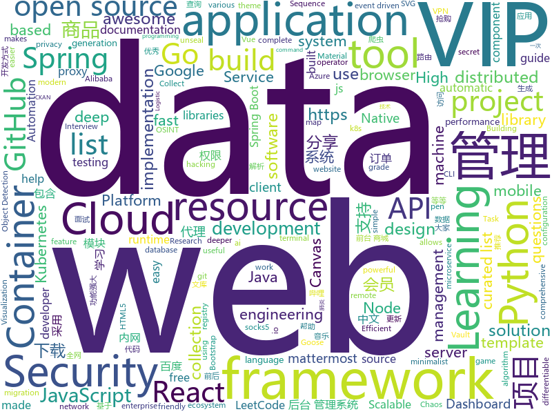

# 2020-02-01
See what the GitHub community is most excited about today.

## python
* [spiderfoot](https://github.com/smicallef/spiderfoot)(**570 stars today**): SpiderFoot, the most complete OSINT collection and reconnaissance tool.
* [sovereign](https://github.com/sovereign/sovereign)(**447 stars today**): A set of Ansible playbooks to build and maintain your own private cloud: email, calendar, contacts, file sync, IRC bouncer, VPN, and more.
* [Chaos](https://github.com/jonnyhyman/Chaos)(**98 stars today**): Visualizations of the connections between chaos theory and fractals through the logistic map; made for Veritasium YouTube video
* [spinningup](https://github.com/openai/spinningup)(**122 stars today**): An educational resource to help anyone learn deep reinforcement learning.
* [HelloGitHub](https://github.com/521xueweihan/HelloGitHub)(**96 stars today**): Find pearls on open-source seashore 分享 GitHub 上有趣、入门级的开源项目
* [EfficientDet.Pytorch](https://github.com/toandaominh1997/EfficientDet.Pytorch)(**13 stars today**): Implementation EfficientDet: Scalable and Efficient Object Detection in PyTorch
* [python-cheatsheet](https://github.com/gto76/python-cheatsheet)(**145 stars today**): Comprehensive Python Cheatsheet
* [face_recognition](https://github.com/ageitgey/face_recognition)(**53 stars today**): The world's simplest facial recognition api for Python and the command line
* [detectron2](https://github.com/facebookresearch/detectron2)(**15 stars today**): Detectron2 is FAIR's next-generation research platform for object detection and segmentation.
* [jd-assistant](https://github.com/tychxn/jd-assistant)(**20 stars today**): 京东抢购助手：包含登录，查询商品库存/价格，添加/清空购物车，抢购商品(下单)，查询订单等功能
* [poetry](https://github.com/python-poetry/poetry)(**22 stars today**): Python dependency management and packaging made easy.
* [black](https://github.com/psf/black)(**17 stars today**): The uncompromising Python code formatter
* [celery](https://github.com/celery/celery)(**8 stars today**): Distributed Task Queue (development branch)
* [GitHub-Chinese-Top-Charts](https://github.com/kon9chunkit/GitHub-Chinese-Top-Charts)(**37 stars today**): 🇨🇳GitHub中文排行榜，帮助你发现高分优秀中文项目、更高效地吸收国人的优秀经验成果；榜单每周更新一次，敬请关注！（提前祝贺大家春节快乐，春运一路畅通！）
* [MLOpsPython](https://github.com/microsoft/MLOpsPython)(**4 stars today**): MLOps using Azure ML Services and Azure DevOps
* [bokeh](https://github.com/bokeh/bokeh)(**10 stars today**): Interactive Data Visualization in the browser, from Python
* [Automagica](https://github.com/OakwoodAI/Automagica)(**15 stars today**): Open Source RPA🤖Robotic Process Automation
* [jieba](https://github.com/fxsjy/jieba)(**14 stars today**): 结巴中文分词
* [fairseq](https://github.com/pytorch/fairseq)(**9 stars today**): Facebook AI Research Sequence-to-Sequence Toolkit written in Python.
* [ckan](https://github.com/ckan/ckan)(**3 stars today**): CKAN is an open-source DMS (data management system) for powering data hubs and data portals. CKAN makes it easy to publish, share and use data. It powers datahub.io, catalog.data.gov and europeandataportal.eu/data/en/dataset among many other sites.
* [PayloadsAllTheThings](https://github.com/swisskyrepo/PayloadsAllTheThings)(**31 stars today**): A list of useful payloads and bypass for Web Application Security and Pentest/CTF
* [keras](https://github.com/keras-team/keras)(**23 stars today**): Deep Learning for humans
* [sentence-transformers](https://github.com/UKPLab/sentence-transformers)(**6 stars today**): Sentence Embeddings with BERT & XLNet
* [pytorch_geometric](https://github.com/rusty1s/pytorch_geometric)(**8 stars today**): Geometric Deep Learning Extension Library for PyTorch
* [proxy_pool](https://github.com/jhao104/proxy_pool)(**12 stars today**): Python爬虫代理IP池(proxy pool)

## java
* [snowflake](https://github.com/subhra74/snowflake)(**162 stars today**): Graphical SFTP client and terminal emulator with helpful utilities
* [LeetCodeAnimation](https://github.com/MisterBooo/LeetCodeAnimation)(**44 stars today**): Demonstrate all the questions on LeetCode in the form of animation.（用动画的形式呈现解LeetCode题目的思路）
* [spring-cloud-alibaba](https://github.com/alibaba/spring-cloud-alibaba)(**8 stars today**): Spring Cloud Alibaba provides a one-stop solution for application development for the distributed solutions of Alibaba middleware.
* [JavaGuide](https://github.com/Snailclimb/JavaGuide)(**46 stars today**): 【Java学习+面试指南】 一份涵盖大部分Java程序员所需要掌握的核心知识。
* [bazel](https://github.com/bazelbuild/bazel)(**12 stars today**): a fast, scalable, multi-language and extensible build system
* [eladmin](https://github.com/elunez/eladmin)(**9 stars today**): 项目基于 Spring Boot 2.1.0 、 Jpa、 Spring Security、redis、Vue的前后端分离的后台管理系统，项目采用分模块开发方式， 权限控制采用 RBAC，支持数据字典与数据权限管理，支持一键生成前后端代码，支持动态路由
* [guava](https://github.com/google/guava)(**14 stars today**): Google core libraries for Java
* [CS-Notes](https://github.com/CyC2018/CS-Notes)(**64 stars today**): 📚技术面试必备基础知识、Leetcode、计算机操作系统、计算机网络、系统设计、Java、Python、C++
* [elasticsearch](https://github.com/elastic/elasticsearch)(**18 stars today**): Open Source, Distributed, RESTful Search Engine
* [rocketmq](https://github.com/apache/rocketmq)(**8 stars today**): Mirror of Apache RocketMQ
* [zfile](https://github.com/zhaojun1998/zfile)(**66 stars today**): 在线云盘
* [eureka](https://github.com/Netflix/eureka)(**4 stars today**): AWS Service registry for resilient mid-tier load balancing and failover.
* [selenium](https://github.com/SeleniumHQ/selenium)(**14 stars today**): A browser automation framework and ecosystem.
* [pentaho-kettle](https://github.com/pentaho/pentaho-kettle)(**3 stars today**): Pentaho Data Integration ( ETL ) a.k.a Kettle
* [openapi-generator](https://github.com/OpenAPITools/openapi-generator)(**11 stars today**): OpenAPI Generator allows generation of API client libraries (SDK generation), server stubs, documentation and configuration automatically given an OpenAPI Spec (v2, v3)
* [Algorithms](https://github.com/williamfiset/Algorithms)(**27 stars today**): A collection of algorithms and data structures
* [h2o-3](https://github.com/h2oai/h2o-3)(**5 stars today**): Open Source Fast Scalable Machine Learning Platform For Smarter Applications: Deep Learning, Gradient Boosting & XGBoost, Random Forest, Generalized Linear Modeling (Logistic Regression, Elastic Net), K-Means, PCA, Stacked Ensembles, Automatic Machine Learning (AutoML), etc.
* [SpringAll](https://github.com/wuyouzhuguli/SpringAll)(**11 stars today**): 循序渐进，学习Spring Boot、Spring Boot & Shiro、Spring Cloud、Spring Security & Spring Security OAuth2，博客Spring系列源码
* [karate](https://github.com/intuit/karate)(**5 stars today**): Test Automation Made Simple
* [react-native-datetimepicker](https://github.com/react-native-community/react-native-datetimepicker)(**8 stars today**): React Native date & time picker component for iOS and Android
* [schema-registry](https://github.com/confluentinc/schema-registry)(**1 stars today**): Confluent Schema Registry for Kafka
* [mall](https://github.com/macrozheng/mall)(**21 stars today**): mall项目是一套电商系统，包括前台商城系统及后台管理系统，基于SpringBoot+MyBatis实现，采用Docker容器化部署。 前台商城系统包含首页门户、商品推荐、商品搜索、商品展示、购物车、订单流程、会员中心、客户服务、帮助中心等模块。 后台管理系统包含商品管理、订单管理、会员管理、促销管理、运营管理、内容管理、统计报表、财务管理、权限管理、设置等模块。
* [DataflowTemplates](https://github.com/GoogleCloudPlatform/DataflowTemplates)(**0 stars today**): Google-provided Cloud Dataflow template pipelines for solving simple in-Cloud data tasks
* [seata](https://github.com/seata/seata)(**9 stars today**): 🔥Seata is an easy-to-use, high-performance, open source distributed transaction solution.
* [netty](https://github.com/netty/netty)(**10 stars today**): Netty project - an event-driven asynchronous network application framework

## unknown
* [awesome-remote-job](https://github.com/lukasz-madon/awesome-remote-job)(**119 stars today**): A curated list of awesome remote jobs and resources. Inspired by https://github.com/vinta/awesome-python
* [architect-awesome](https://github.com/xingshaocheng/architect-awesome)(**122 stars today**): 后端架构师技术图谱
* [shareOI](https://github.com/hzwer/shareOI)(**158 stars today**): 算法竞赛课件分享
* [gitignore](https://github.com/github/gitignore)(**59 stars today**): A collection of useful .gitignore templates
* [computer-science](https://github.com/ossu/computer-science)(**124 stars today**): 🎓Path to a free self-taught education in Computer Science!
* [MicrosoftSecurity](https://github.com/MarkSimos/MicrosoftSecurity)(**14 stars today**): Microsoft Security Guidance
* [developer-roadmap](https://github.com/kamranahmedse/developer-roadmap)(**128 stars today**): Roadmap to becoming a web developer in 2020
* [go-gui-projects](https://github.com/go-graphics/go-gui-projects)(**138 stars today**): A list of Go GUI projects
* [hacker-roadmap](https://github.com/sundowndev/hacker-roadmap)(**322 stars today**): 📌A guide for amateurs pen testers and a collection of hacking tools, resources and references to practice ethical hacking, pen testing and web security.
* [weekly](https://github.com/ruanyf/weekly)(**13 stars today**): 科技爱好者周刊，每周五发布
* [Resources-for-Beginner-Bug-Bounty-Hunters](https://github.com/nahamsec/Resources-for-Beginner-Bug-Bounty-Hunters)(**34 stars today**): A list of resources for those interested in getting started in bug bounties
* [freelancing-in-finland](https://github.com/sam-hosseini/freelancing-in-finland)(**238 stars today**): The ultimate resource for transitioning to freelancing for software developers👩‍💻🇫🇮
* [wildcat-vip-account](https://github.com/wuxingsanren/wildcat-vip-account)(**7 stars today**): 野猫VIP - 每天分享最新的百度网盘SVIP、迅雷超级会员、爱奇艺VIP会员、优酷VIP会员、哔哩哔哩大会员、百度文库VIP、苹果ID、天眼查VIP等等各类VIP帐号，随取随用，完全免费，绝无套路，同时提供：百度文库VIP下载、图库素材VIP下载、学术论文VIP下载、全网视频VIP解析、全网音乐MP3免费听及下载 ，欢迎推荐分享给好友！
* [javascript-interview-questions](https://github.com/sudheerj/javascript-interview-questions)(**6 stars today**): List of 1000 JavaScript Interview Questions
* [Novel-Coronavirus-Updates](https://github.com/839Studio/Novel-Coronavirus-Updates)(**8 stars today**): 新增确诊新型冠状病毒肺炎统计数据（每日更新）
* [chinese-independent-developer](https://github.com/1c7/chinese-independent-developer)(**69 stars today**): 👩🏿‍💻👨🏾‍💻👩🏼‍💻👨🏽‍💻👩🏻‍💻中国独立开发者项目列表 -- 分享大家都在做什么
* [reactjs-interview-questions](https://github.com/sudheerj/reactjs-interview-questions)(**16 stars today**): List of top 500 ReactJS Interview Questions & Answers....Coding exercise questions are coming soon!!
* [3D-Machine-Learning](https://github.com/timzhang642/3D-Machine-Learning)(**3 stars today**): A resource repository for 3D machine learning
* [difftaichi](https://github.com/yuanming-hu/difftaichi)(**75 stars today**): 10 differentiable physical simulators built with Taichi differentiable programming (DiffTaichi, ICLR 2020)
* [awesome-osint](https://github.com/jivoi/awesome-osint)(**10 stars today**): 😱A curated list of amazingly awesome OSINT
* [Tips-of-Feature-engineering](https://github.com/Pysamlam/Tips-of-Feature-engineering)(**39 stars today**): A feature engineering kit for each issue, to give you a deeper and deeper understanding of the work of feature engineering!
* [laravel-best-practices](https://github.com/alexeymezenin/laravel-best-practices)(**5 stars today**): Laravel best practices
* [download](https://github.com/getlantern/download)(**19 stars today**): Lantern官方版本下载 蓝灯 翻墙 代理 科学上网 外网 加速器 梯子 路由 proxy vpn circumvention gfw
* [awesome-spider](https://github.com/facert/awesome-spider)(**12 stars today**): 爬虫集合
* [architecture_decision_record](https://github.com/joelparkerhenderson/architecture_decision_record)(**6 stars today**): Architecture decision record (ADR) examples for software planning, IT leadership, and template documenation

## javascript
* [vanillawebprojects](https://github.com/bradtraversy/vanillawebprojects)(**363 stars today**): Mini projects built with HTML5, CSS & JavaScript. No frameworks or libraries
* [chinese-poetry](https://github.com/chinese-poetry/chinese-poetry)(**51 stars today**): The most comprehensive database of Chinese poetry 🧶最全中华古诗词数据库, 唐宋两朝近一万四千古诗人, 接近5.5万首唐诗加26万宋诗. 两宋时期1564位词人，21050首词。
* [remote-jobs](https://github.com/remoteintech/remote-jobs)(**117 stars today**): A list of semi to fully remote-friendly companies in tech.
* [2019-ncov](https://github.com/shfshanyue/2019-ncov)(**35 stars today**): 武汉肺炎疫情实时省市地图
* [express](https://github.com/expressjs/express)(**25 stars today**): Fast, unopinionated, minimalist web framework for node.
* [awesome-mac](https://github.com/jaywcjlove/awesome-mac)(**51 stars today**):  Now we have become very big, Different from the original idea. Collect premium software in various categories.
* [popper-core](https://github.com/popperjs/popper-core)(**90 stars today**): 🍿Positioning tooltips and popovers is difficult. Popper is here to help!
* [jsdom](https://github.com/jsdom/jsdom)(**12 stars today**): A JavaScript implementation of various web standards, for use with Node.js
* [phaser](https://github.com/photonstorm/phaser)(**15 stars today**): Phaser is a fun, free and fast 2D game framework for making HTML5 games for desktop and mobile web browsers, supporting Canvas and WebGL rendering.
* [pwa-studio](https://github.com/magento/pwa-studio)(**3 stars today**): 🛠Development tools to build, optimize and deploy Progressive Web Applications for Magento 2.
* [fabric.js](https://github.com/fabricjs/fabric.js)(**4 stars today**): Javascript Canvas Library, SVG-to-Canvas (& canvas-to-SVG) Parser
* [airframe-react](https://github.com/0wczar/airframe-react)(**26 stars today**): Free Open Source High Quality Dashboard based on Bootstrap 4 & React 16: http://dashboards.webkom.co/react/airframe
* [mattermost-webapp](https://github.com/mattermost/mattermost-webapp)(**2 stars today**): Webapp of Mattermost server: https://github.com/mattermost/mattermost-server
* [taiko-web](https://github.com/bui/taiko-web)(**87 stars today**): Taiko no Tatsujin simulator
* [alpine](https://github.com/alpinejs/alpine)(**57 stars today**): A rugged, minimal framework for composing JavaScript behavior in your markup.
* [strapi](https://github.com/strapi/strapi)(**33 stars today**): 🚀Open source Node.js Headless CMS to easily build customisable APIs
* [fingerprintjs2](https://github.com/Valve/fingerprintjs2)(**24 stars today**): Modern & flexible browser fingerprinting library
* [taro](https://github.com/NervJS/taro)(**16 stars today**): 多端统一开发框架，支持用 React 的开发方式编写一次代码，生成能运行在微信/百度/支付宝/字节跳动/ QQ 小程序/快应用/H5/React Native 等的应用。 https://taro.jd.com/
* [evergreen](https://github.com/segmentio/evergreen)(**11 stars today**): 🌲Evergreen React UI Framework by Segment
* [material-ui](https://github.com/mui-org/material-ui)(**38 stars today**): React components for faster and easier web development. Build your own design system, or start with Material Design.
* [wp-calypso](https://github.com/Automattic/wp-calypso)(**4 stars today**): The JavaScript and API powered WordPress.com
* [react-map-gl](https://github.com/uber/react-map-gl)(**8 stars today**): React friendly API wrapper around MapboxGL JS
* [NeteaseCloudMusicApi](https://github.com/Binaryify/NeteaseCloudMusicApi)(**8 stars today**): 网易云音乐 Node.js API service
* [react-select](https://github.com/JedWatson/react-select)(**13 stars today**): The Select Component for React.js
* [incubator-superset](https://github.com/apache/incubator-superset)(**16 stars today**): Apache Superset (incubating) is a modern, enterprise-ready business intelligence web application

## html
* [awesome-competitive-programming](https://github.com/lnishan/awesome-competitive-programming)(**24 stars today**): 💎A curated list of awesome Competitive Programming, Algorithm and Data Structure resources
* [training-kit](https://github.com/github/training-kit)(**4 stars today**): Open source cheat sheets for Git and GitHub
* [personal-website](https://github.com/github/personal-website)(**16 stars today**): Code that'll help you kickstart a personal website that showcases your work as a software developer.
* [Guide-RGPD-du-developpeur](https://github.com/LINCnil/Guide-RGPD-du-developpeur)(**135 stars today**): La CNIL publie un guide RGPD pour les développeurs
* [electron-api-demos](https://github.com/electron/electron-api-demos)(**5 stars today**): Explore the Electron APIs
* [InstaLocTrack](https://github.com/bernsteining/InstaLocTrack)(**10 stars today**): A SOCMINT/OSINT program that allows you to collect all the location data available on an Instagram profile's posts in order to plot them on a map.
* [AR.js](https://github.com/jeromeetienne/AR.js)(**5 stars today**): Efficient Augmented Reality for the Web - 60fps on mobile!
* [dl-keras-tf](https://github.com/rstudio-conf-2020/dl-keras-tf)(**21 stars today**): rstudio::conf(2020) deep learning workshop
* [jsonplaceholder](https://github.com/typicode/jsonplaceholder)(**4 stars today**): A simple online fake REST API server
* [privacytools.io](https://github.com/privacytoolsIO/privacytools.io)(**5 stars today**): 🛡🛠You are being watched. Protect your privacy against global mass surveillance.
* [keep-a-changelog](https://github.com/olivierlacan/keep-a-changelog)(**2 stars today**): If you build software, keep a changelog.
* [deeplearning_ai_books](https://github.com/fengdu78/deeplearning_ai_books)(**7 stars today**): deeplearning.ai（吴恩达老师的深度学习课程笔记及资源）
* [awesome-modern-cpp](https://github.com/rigtorp/awesome-modern-cpp)(**9 stars today**): A collection of resources on modern C++
* [GDIndex](https://github.com/maple3142/GDIndex)(**3 stars today**): A Google Drive Index built with Vue Running on CloudFlare Workers
* [website](https://github.com/kubernetes/website)(**2 stars today**): Kubernetes website and documentation repo:
* [calico](https://github.com/projectcalico/calico)(**1 stars today**): Cloud native connectivity and network policy
* [samesite-examples](https://github.com/GoogleChromeLabs/samesite-examples)(**3 stars today**): Examples of using the SameSite cookie attribute in a variety of language, libraries, and frameworks.
* [professional-services](https://github.com/GoogleCloudPlatform/professional-services)(**3 stars today**): Common solutions and tools developed by Google Cloud's Professional Services team
* [machine-learning-systems-design](https://github.com/chiphuyen/machine-learning-systems-design)(**14 stars today**): A booklet on machine learning systems design with exercises
* [owasp-mstg](https://github.com/OWASP/owasp-mstg)(**9 stars today**): The Mobile Security Testing Guide (MSTG) is a comprehensive manual for mobile app security development, testing and reverse engineering.
* [mkdocs-material](https://github.com/squidfunk/mkdocs-material)(**5 stars today**): A Material Design theme for MkDocs
* [docs](https://github.com/knative/docs)(**1 stars today**): User documentation for Knative components
* [hugo-coder](https://github.com/luizdepra/hugo-coder)(**5 stars today**): A minimalist blog theme for hugo.
* [gentelella](https://github.com/ColorlibHQ/gentelella)(**5 stars today**): Free Bootstrap 4 Admin Dashboard Template
* [awesome-angular](https://github.com/PatrickJS/awesome-angular)(**9 stars today**): 📄A curated list of awesome Angular resources

## go
* [k3s](https://github.com/rancher/k3s)(**38 stars today**): Lightweight Kubernetes. 5 less than k8s.
* [fabric](https://github.com/hyperledger/fabric)(**11 stars today**): Hyperledger Fabric is an enterprise-grade permissioned distributed ledger framework for developing solutions and applications. Its modular and versatile design satisfies a broad range of industry use cases. It offers a unique approach to consensus that enables performance at scale while preserving privacy.
* [kubernetes](https://github.com/kubernetes/kubernetes)(**44 stars today**): Production-Grade Container Scheduling and Management
* [cri-o](https://github.com/cri-o/cri-o)(**4 stars today**): Open Container Initiative-based implementation of Kubernetes Container Runtime Interface
* [kiali](https://github.com/kiali/kiali)(**8 stars today**): Kiali project, observability for the Istio service mesh
* [cli](https://github.com/cli/cli)(**102 stars today**): the GitHub CLI
* [moby](https://github.com/moby/moby)(**18 stars today**): Moby Project - a collaborative project for the container ecosystem to assemble container-based systems
* [grpc-go](https://github.com/grpc/grpc-go)(**7 stars today**): The Go language implementation of gRPC. HTTP/2 based RPC
* [cosmos-sdk](https://github.com/cosmos/cosmos-sdk)(**1 stars today**): ⛓A Framework for Building High Value Public Blockchains✨
* [go-swagger](https://github.com/go-swagger/go-swagger)(**4 stars today**): Swagger 2.0 implementation for go
* [lazydocker](https://github.com/jesseduffield/lazydocker)(**43 stars today**): The lazier way to manage everything docker
* [charts](https://github.com/helm/charts)(**15 stars today**): Curated applications for Kubernetes
* [nps](https://github.com/ehang-io/nps)(**20 stars today**): 一款轻量级、高性能、功能强大的内网穿透代理服务器。支持tcp、udp、socks5、http等几乎所有流量转发，可用来访问内网网站、本地支付接口调试、ssh访问、远程桌面，内网dns解析、内网socks5代理等等……，并带有功能强大的web管理端。a lightweight, high-performance, powerful intranet penetration proxy server, with a powerful web management terminal.
* [dapr](https://github.com/dapr/dapr)(**21 stars today**): Dapr is a portable, event-driven, runtime for building distributed applications across cloud and edge.
* [chaos-mesh](https://github.com/pingcap/chaos-mesh)(**15 stars today**): A Chaos Engineering Platform for Kubernetes
* [go-micro](https://github.com/micro/go-micro)(**14 stars today**): A Go microservices development framework https://go-micro.dev
* [migrate](https://github.com/golang-migrate/migrate)(**9 stars today**): Database migrations. CLI and Golang library.
* [rancher](https://github.com/rancher/rancher)(**7 stars today**): Complete container management platform
* [tools](https://github.com/golang/tools)(**8 stars today**): [mirror] Go Tools
* [bank-vaults](https://github.com/banzaicloud/bank-vaults)(**1 stars today**): A Vault swiss-army knife: a K8s operator, Go client with automatic token renewal, automatic configuration, multiple unseal options and more. A CLI tool to init, unseal and configure Vault (auth methods, secret engines). Direct secret injection into Pods.
* [argo](https://github.com/argoproj/argo)(**11 stars today**): Argo Workflows: Get stuff done with Kubernetes.
* [helm-operator](https://github.com/fluxcd/helm-operator)(**3 stars today**): The Flux Helm Operator, for declarative Helming
* [micro](https://github.com/micro/micro)(**28 stars today**): A microservice runtime environment
* [hub](https://github.com/github/hub)(**24 stars today**): A command-line tool that makes git easier to use with GitHub.
* [goose](https://github.com/pressly/goose)(**3 stars today**): Goose database migration tool - fork of https://bitbucket.org/liamstask/goose

## WordCloud

