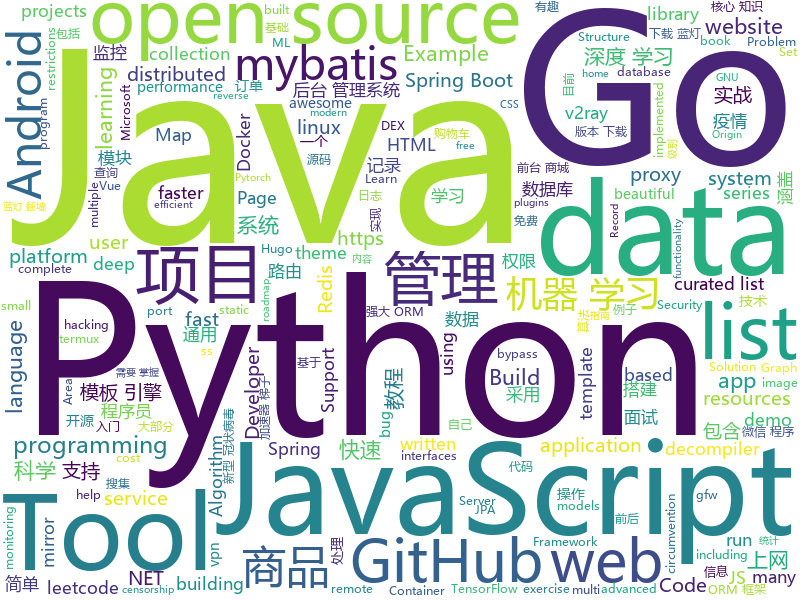

# 2020-02-03
See what the GitHub community is most excited about today.

## python
* [DXY-2019-nCoV-Data](https://github.com/BlankerL/DXY-2019-nCoV-Data)(**42 stars today**): 2019新型冠状病毒疫情时间序列数据仓库
* [stylegan2](https://github.com/NVlabs/stylegan2)(**141 stars today**): StyleGAN2 - Official TensorFlow Implementation
* [jd-assistant](https://github.com/tychxn/jd-assistant)(**41 stars today**): 京东抢购助手：包含登录，查询商品库存/价格，添加/清空购物车，抢购商品(下单)，查询订单等功能
* [python-small-examples](https://github.com/jackzhenguo/python-small-examples)(**91 stars today**): Python有趣的小例子一网打尽。Python基础、Python坑点、Python字符串和正则、Python绘图、Python日期和文件、Web开发、数据科学、机器学习、深度学习、TensorFlow、Pytorch，一切都是简单易懂的小例子。
* [Chaos](https://github.com/jonnyhyman/Chaos)(**86 stars today**): Visualizations of the connections between chaos theory and fractals through the logistic map; made for Veritasium YouTube video
* [HelloGitHub](https://github.com/521xueweihan/HelloGitHub)(**170 stars today**): Find pearls on open-source seashore 分享 GitHub 上有趣、入门级的开源项目
* [tinder-swipe-bot](https://github.com/aj-4/tinder-swipe-bot)(**19 stars today**): 
* [opensnitch](https://github.com/evilsocket/opensnitch)(**64 stars today**): OpenSnitch is a GNU/Linux port of the Little Snitch application firewall
* [yfinance](https://github.com/ranaroussi/yfinance)(**11 stars today**): Yahoo! Finance market data downloader (+faster Pandas Datareader)
* [lasertagger](https://github.com/google-research/lasertagger)(**36 stars today**): 
* [AiLearning](https://github.com/apachecn/AiLearning)(**31 stars today**): AiLearning: 机器学习 - MachineLearning - ML、深度学习 - DeepLearning - DL、自然语言处理 NLP
* [GDA-android-reversing-Tool](https://github.com/charles2gan/GDA-android-reversing-Tool)(**40 stars today**): GDA is a new decompiler written entirely in c++, so it does not rely on the Java platform, which is succinct, portable and fast, and supports APK, DEX, ODEX, oat.
* [sqlmap](https://github.com/sqlmapproject/sqlmap)(**14 stars today**): Automatic SQL injection and database takeover tool
* [wqxt_pdf](https://github.com/gumblex/wqxt_pdf)(**60 stars today**): WQXT PDF Downloader
* [autonomous-learning-library](https://github.com/cpnota/autonomous-learning-library)(**29 stars today**): A PyTorch library for building deep reinforcement learning agents.
* [riskquant](https://github.com/Netflix-Skunkworks/riskquant)(**13 stars today**): 
* [text_classification](https://github.com/brightmart/text_classification)(**4 stars today**): all kinds of text classification models and more with deep learning
* [spleeter](https://github.com/deezer/spleeter)(**26 stars today**): Deezer source separation library including pretrained models.
* [ICDAR-2019-SROIE](https://github.com/zzzDavid/ICDAR-2019-SROIE)(**19 stars today**): ICDAR 2019 Robust Reading Challenge on Scanned Receipts OCR and Information Extraction
* [distroless](https://github.com/GoogleContainerTools/distroless)(**14 stars today**): 🥑Language focused docker images, minus the operating system.
* [Statistical-Learning-Method_Code](https://github.com/Dod-o/Statistical-Learning-Method_Code)(**4 stars today**): 手写实现李航《统计学习方法》书中全部算法
* [AlgorithmsByPython](https://github.com/Jack-Lee-Hiter/AlgorithmsByPython)(**4 stars today**): 算法/数据结构/Python/剑指offer/机器学习/leetcode
* [pyrobot](https://github.com/facebookresearch/pyrobot)(**33 stars today**): PyRobot: An Open Source Robotics Research Platform
* [Tool-X](https://github.com/Rajkumrdusad/Tool-X)(**3 stars today**): Tool-X is a kali linux hacking Tool installer. Tool-X developed for termux and other android terminals. using Tool-X you can install almost 370+ hacking tools in termux app and other linux based distributions.
* [tutorials](https://github.com/MorvanZhou/tutorials)(**7 stars today**): 机器学习相关教程

## java
* [Algorithms](https://github.com/williamfiset/Algorithms)(**156 stars today**): A collection of algorithms and data structures
* [reliable](https://github.com/x-ream/reliable)(**15 stars today**): mq transaction, tcc, eventually consistency. tx life cycle: all listeners handled, if necessary, produce next message
* [mall](https://github.com/macrozheng/mall)(**70 stars today**): mall项目是一套电商系统，包括前台商城系统及后台管理系统，基于SpringBoot+MyBatis实现，采用Docker容器化部署。 前台商城系统包含首页门户、商品推荐、商品搜索、商品展示、购物车、订单流程、会员中心、客户服务、帮助中心等模块。 后台管理系统包含商品管理、订单管理、会员管理、促销管理、运营管理、内容管理、统计报表、财务管理、权限管理、设置等模块。
* [jadx](https://github.com/skylot/jadx)(**16 stars today**): Dex to Java decompiler
* [Java-Tutorial](https://github.com/h2pl/Java-Tutorial)(**13 stars today**): 【Java工程师面试复习指南】本仓库涵盖大部分Java程序员所需要掌握的核心知识，整合了互联网上的很多优质Java技术文章，力求打造为最完整最实用的Java开发者学习指南，如果对你有帮助，给个star告诉我吧，谢谢！
* [AnySoftKeyboard](https://github.com/AnySoftKeyboard/AnySoftKeyboard)(**4 stars today**): Android (f/w 2.1+) on screen keyboard for multiple languages (chat https://gitter.im/AnySoftKeyboard)
* [linuxdeploy](https://github.com/meefik/linuxdeploy)(**4 stars today**): Install and run GNU/Linux on Android
* [JavaGuide](https://github.com/Snailclimb/JavaGuide)(**71 stars today**): 【Java学习+面试指南】 一份涵盖大部分Java程序员所需要掌握的核心知识。
* [data-structures](https://github.com/williamfiset/data-structures)(**7 stars today**): A collection of powerful data structures
* [spring-boot-demo](https://github.com/xkcoding/spring-boot-demo)(**21 stars today**): spring boot demo 是一个用来深度学习并实战 spring boot 的项目，目前总共包含 65 个集成demo，已经完成 53 个。 该项目已成功集成 actuator(监控)、admin(可视化监控)、logback(日志)、aopLog(通过AOP记录web请求日志)、统一异常处理(json级别和页面级别)、freemarker(模板引擎)、thymeleaf(模板引擎)、Beetl(模板引擎)、Enjoy(模板引擎)、JdbcTemplate(通用JDBC操作数据库)、JPA(强大的ORM框架)、mybatis(强大的ORM框架)、通用Mapper(快速操作Mybatis)、PageHelper(通用的Mybatis分页插件)、mybatis-plus(快速操作M…
* [redisson](https://github.com/redisson/redisson)(**11 stars today**): Redisson - Redis Java client with features of In-Memory Data Grid. Over 50 Redis based Java objects and services: Set, Multimap, SortedSet, Map, List, Queue, Deque, Semaphore, Lock, AtomicLong, Map Reduce, Publish / Subscribe, Bloom filter, Spring Cache, Tomcat, Scheduler, JCache API, Hibernate, MyBatis, RPC ...
* [CS-Notes](https://github.com/CyC2018/CS-Notes)(**92 stars today**): 📚技术面试必备基础知识、Leetcode、计算机操作系统、计算机网络、系统设计、Java、Python、C++
* [SpringCloudLearning](https://github.com/forezp/SpringCloudLearning)(**7 stars today**): 《史上最简单的Spring Cloud教程源码》
* [spring-boot-examples](https://github.com/ityouknow/spring-boot-examples)(**11 stars today**): about learning Spring Boot via examples. Spring Boot 教程、技术栈示例代码，快速简单上手教程。
* [eladmin](https://github.com/elunez/eladmin)(**12 stars today**): 项目基于 Spring Boot 2.1.0 、 Jpa、 Spring Security、redis、Vue的前后端分离的后台管理系统，项目采用分模块开发方式， 权限控制采用 RBAC，支持数据字典与数据权限管理，支持一键生成前后端代码，支持动态路由
* [zipkin](https://github.com/openzipkin/zipkin)(**3 stars today**): Zipkin is a distributed tracing system
* [lombok](https://github.com/rzwitserloot/lombok)(**7 stars today**): Very spicy additions to the Java programming language.
* [jna](https://github.com/java-native-access/jna)(**3 stars today**): Java Native Access
* [jedis](https://github.com/xetorthio/jedis)(**5 stars today**): A blazingly small and sane redis java client
* [Luyten](https://github.com/deathmarine/Luyten)(**5 stars today**): An Open Source Java Decompiler Gui for Procyon
* [guava](https://github.com/google/guava)(**11 stars today**): Google core libraries for Java
* [druid](https://github.com/alibaba/druid)(**4 stars today**): 阿里巴巴数据库事业部出品，为监控而生的数据库连接池
* [jdk](https://github.com/openjdk/jdk)(**6 stars today**): Read-only mirror of https://hg.openjdk.java.net/jdk/jdk
* [spring-boot](https://github.com/spring-projects/spring-boot)(**16 stars today**): Spring Boot
* [android-developer-roadmap](https://github.com/MindorksOpenSource/android-developer-roadmap)(**5 stars today**): Android Developer Roadmap - A complete roadmap to learn Android App Development

## unknown
* [algodeck](https://github.com/teivah/algodeck)(**845 stars today**): Algo Deck is an Open-Source Collection of +200 Algorithmic Cards to Help you Preparing your Algorithm & Data Structure Interview
* [wuhan2020-timeline](https://github.com/Pratitya/wuhan2020-timeline)(**49 stars today**): 记录自2019年12月起武汉新冠肺炎疫情进展的时间线，尽可能搜集经敝人筛查后的信息，因为假若敏感内容，墙内容易炸号，故置于此。
* [Ai-learn](https://github.com/tangyudi/Ai-learn)(**49 stars today**): 人工智能学习路线图，整理近200个实战案例与项目，免费提供配套教材，零基础入门，就业实战！包括：Python，数学，机器学习，数据分析，深度学习，计算机视觉，自然语言处理等热门领域
* [Resources-for-Beginner-Bug-Bounty-Hunters](https://github.com/nahamsec/Resources-for-Beginner-Bug-Bounty-Hunters)(**166 stars today**): A list of resources for those interested in getting started in bug bounties
* [Ncov2020HistoryData](https://github.com/norratek/Ncov2020HistoryData)(**4 stars today**): 
* [awesome-remote-job](https://github.com/lukasz-madon/awesome-remote-job)(**214 stars today**): A curated list of awesome remote jobs and resources. Inspired by https://github.com/vinta/awesome-python
* [developer-roadmap](https://github.com/kamranahmedse/developer-roadmap)(**63 stars today**): Roadmap to becoming a web developer in 2020
* [new-pac](https://github.com/Alvin9999/new-pac)(**86 stars today**): 科学/自由上网，免费ss/ssr/v2ray/goflyway账号，搭建教程
* [ATTCK-PenTester-Book](https://github.com/Dm2333/ATTCK-PenTester-Book)(**141 stars today**): ATTCK-PenTester-Book
* [download](https://github.com/getlantern/download)(**13 stars today**): Lantern官方版本下载 蓝灯 翻墙 代理 科学上网 外网 加速器 梯子 路由 proxy vpn circumvention gfw
* [howto-make-more-money](https://github.com/easychen/howto-make-more-money)(**56 stars today**): 程序员如何优雅的挣零花钱
* [You-Dont-Know-JS](https://github.com/getify/You-Dont-Know-JS)(**90 stars today**): A book series on JavaScript. @YDKJS on twitter.
* [awesome-machine-learning-interpretability](https://github.com/jphall663/awesome-machine-learning-interpretability)(**4 stars today**): A curated list of awesome machine learning interpretability resources.
* [Awesome-Paper-List](https://github.com/Doragd/Awesome-Paper-List)(**12 stars today**): A curated list of repositories in which many NLP/CV/ML papers and related area resources are collected.
* [specials](https://github.com/RPiList/specials)(**7 stars today**): 
* [Digital-Privacy](https://github.com/No-Github/Digital-Privacy)(**53 stars today**): 一个关于数字隐私搜集、保护、清理集一体的方案,外加开源信息收集(OSINT)对抗
* [archive-program](https://github.com/github/archive-program)(**22 stars today**): The GitHub Archive Program & Arctic Code Vault
* [100-plus-Python-programming-exercises-extended](https://github.com/darkprinx/100-plus-Python-programming-exercises-extended)(**46 stars today**): 100+ python programming exercise problem discussed ,explained and solved in different ways
* [OI-wiki](https://github.com/OI-wiki/OI-wiki)(**22 stars today**): 🌟Wiki for OI / ICPC. （某大型游戏线上攻略，内含炫酷算术魔法）
* [telegram-list](https://github.com/goq/telegram-list)(**5 stars today**): List of telegram groups, channels & bots // Список интересных групп, каналов и ботов телеграма // Список чатов для программистов
* [vpn](https://github.com/wistbean/vpn)(**9 stars today**): 快速搭建一个自己的VPN科学上网,搭建ss并开启bbr快速上网
* [help-to-be-helped](https://github.com/xiaolai/help-to-be-helped)(**10 stars today**): 助人助己
* [trackerslist](https://github.com/ngosang/trackerslist)(**39 stars today**): Updated list of public BitTorrent trackers
* [you-dont-know-js-ru](https://github.com/azat-io/you-dont-know-js-ru)(**5 stars today**): 📚Russian translation of "You Don't Know JS" book series
* [arduino-pro-ide](https://github.com/arduino/arduino-pro-ide)(**10 stars today**): The Arduino IDE for advanced users and developers. Experimental alpha version.

## javascript
* [remote-jobs](https://github.com/remoteintech/remote-jobs)(**196 stars today**): A list of semi to fully remote-friendly companies in tech.
* [esercizi-di-programmazione-javascript](https://github.com/AlbertoOlla/esercizi-di-programmazione-javascript)(**3 stars today**): Esercizi di informatica! Impara a programmare, metti alla prova!
* [2019-ncov](https://github.com/shfshanyue/2019-ncov)(**59 stars today**): 全国新型冠状病毒，肺炎疫情实时省市地图
* [30DaysOfJavaScript](https://github.com/Asabeneh/30DaysOfJavaScript)(**27 stars today**): A 30 days of JavaScript programming challenge
* [material-ui](https://github.com/mui-org/material-ui)(**36 stars today**): React components for faster and easier web development. Build your own design system, or start with Material Design.
* [vanillawebprojects](https://github.com/bradtraversy/vanillawebprojects)(**159 stars today**): Mini projects built with HTML5, CSS & JavaScript. No frameworks or libraries
* [leetcode](https://github.com/azl397985856/leetcode)(**86 stars today**): LeetCode Solutions: A Record of My Problem Solving Journey.( leetcode题解，记录自己的leetcode解题之路。)
* [opencti](https://github.com/OpenCTI-Platform/opencti)(**11 stars today**): Open Cyber Threat Intelligence Platform
* [AlgoCasts-JS](https://github.com/yogain123/AlgoCasts-JS)(**9 stars today**): DSA in JavaScript✅
* [MagicMirror](https://github.com/MichMich/MagicMirror)(**12 stars today**): MagicMirror² is an open source modular smart mirror platform. With a growing list of installable modules, the MagicMirror² allows you to convert your hallway or bathroom mirror into your personal assistant.
* [react](https://github.com/facebook/react)(**45 stars today**): A declarative, efficient, and flexible JavaScript library for building user interfaces.
* [freeCodeCamp](https://github.com/freeCodeCamp/freeCodeCamp)(**35 stars today**): The https://www.freeCodeCamp.org open source codebase and curriculum. Learn to code for free together with millions of people.
* [jumpserver](https://github.com/jumpserver/jumpserver)(**13 stars today**): Jumpserver是全球首款完全开源的堡垒机，是符合 4A 的专业运维审计系统。
* [complete-javascript-course](https://github.com/jonasschmedtmann/complete-javascript-course)(**7 stars today**): Starter files, final projects and FAQ for my Complete JavaScript course
* [javascript-algorithms](https://github.com/trekhleb/javascript-algorithms)(**58 stars today**): 📝Algorithms and data structures implemented in JavaScript with explanations and links to further readings
* [vue2-happyfri](https://github.com/bailicangdu/vue2-happyfri)(**6 stars today**): vue2 + vue-router + vuex 入门项目
* [appium](https://github.com/appium/appium)(**7 stars today**): 📱Automation for iOS, Android, and Windows Apps.
* [academicpages.github.io](https://github.com/academicpages/academicpages.github.io)(**9 stars today**): Github Pages template for academic personal websites, forked from mmistakes/minimal-mistakes
* [quasar](https://github.com/quasarframework/quasar)(**12 stars today**): Quasar Framework - Build high-performance VueJS user interfaces in record time
* [size-limit](https://github.com/ai/size-limit)(**40 stars today**): Calculate the real cost to run your JS app or lib to keep good performance. Show error in pull request if the cost exceeds the limit.
* [WeApp_Demos](https://github.com/Data-Camp/WeApp_Demos)(**4 stars today**): 持续更新中的微信小程序和小游戏的源码案例库。目前涵盖了120多个微信小程序或小游戏。
* [nodebestpractices](https://github.com/goldbergyoni/nodebestpractices)(**33 stars today**): ✅The largest Node.js best practices list (January 2020)
* [BetterDiscordAddons](https://github.com/mwittrien/BetterDiscordAddons)(**3 stars today**): A series of plugins and themes for BetterDiscord.
* [uBlock](https://github.com/gorhill/uBlock)(**17 stars today**): uBlock Origin - An efficient blocker for Chromium and Firefox. Fast and lean.
* [fullstack-course4](https://github.com/jhu-ep-coursera/fullstack-course4)(**3 stars today**): Example code for HTML, CSS, and Javascript for Web Developers Coursera Course

## html
* [HiddenEye](https://github.com/DarkSecDevelopers/HiddenEye)(**6 stars today**): Modern Phishing Tool With Advanced Functionality And Multiple Tunnelling Services [ Android-Support-Available ]
* [tabler](https://github.com/tabler/tabler)(**9 stars today**): Tabler is free and open-source HTML Dashboard UI Kit built on Bootstrap
* [flutter-in-action](https://github.com/flutterchina/flutter-in-action)(**2 stars today**): 《Flutter实战》电子书
* [blog_os](https://github.com/phil-opp/blog_os)(**9 stars today**): Writing an OS in Rust
* [v2-ui](https://github.com/sprov065/v2-ui)(**12 stars today**): 支持多协议多用户的 v2ray 面板，Support multi-protocol multi-user v2ray panel
* [hugo-coder](https://github.com/luizdepra/hugo-coder)(**2 stars today**): A minimalist blog theme for hugo.
* [electron-api-demos](https://github.com/electron/electron-api-demos)(**4 stars today**): Explore the Electron APIs
* [docsy](https://github.com/google/docsy)(**4 stars today**): A set of Hugo doc templates for launching open source content.
* [re0-web](https://github.com/lyy289065406/re0-web)(**3 stars today**): RE0：从零开始的异世界生活 （WEB版）
* [d3-book](https://github.com/scotthmurray/d3-book)(**2 stars today**): Code examples for “Interactive Data Visualization for the Web”
* [simple-icons](https://github.com/simple-icons/simple-icons)(**5 stars today**): SVG icons for popular brands
* [GTFOBins.github.io](https://github.com/GTFOBins/GTFOBins.github.io)(**8 stars today**): Curated list of Unix binaries that can be exploited to bypass system security restrictions
* [nndl.github.io](https://github.com/nndl/nndl.github.io)(**6 stars today**): 《神经网络与深度学习》 邱锡鹏著 Neural Network and Deep Learning
* [beautiful-jekyll](https://github.com/daattali/beautiful-jekyll)(**3 stars today**): ✨Build a beautiful and simple website in literally minutes. Demo at http://deanattali.com/beautiful-jekyll
* [shellphish](https://github.com/thelinuxchoice/shellphish)(**2 stars today**): Phishing Tool for 18 social media: Instagram, Facebook, Snapchat, Github, Twitter, Yahoo, Protonmail, Spotify, Netflix, Linkedin, Wordpress, Origin, Steam, Microsoft, InstaFollowers, Gitlab, Pinterest
* [Coursera-ML-AndrewNg-Notes](https://github.com/fengdu78/Coursera-ML-AndrewNg-Notes)(**20 stars today**): 吴恩达老师的机器学习课程个人笔记
* [workers-docs](https://github.com/cloudflare/workers-docs)(**5 stars today**): 🌥👷‍♀️The documentation site for Cloudflare Workers
* [learning-area](https://github.com/mdn/learning-area)(**3 stars today**): Github repo for the MDN Learning Area.
* [fluxion](https://github.com/FluxionNetwork/fluxion)(**3 stars today**): Fluxion is a remake of linset by vk496 with less bugs and enhanced functionality.
* [hive](https://github.com/dcramer/hive)(**7 stars today**): My home infrastructure
* [tiny-slider](https://github.com/ganlanyuan/tiny-slider)(**6 stars today**): Vanilla javascript slider for all purposes.
* [dotnet](https://github.com/microsoft/dotnet)(**2 stars today**): This repo is the official home of .NET on GitHub. It's a great starting point to find many .NET OSS projects from Microsoft and the community, including many that are part of the .NET Foundation.
* [learn-to-send-email-via-google-script-html-no-server](https://github.com/dwyl/learn-to-send-email-via-google-script-html-no-server)(**6 stars today**): ✉️An Example of using an HTML form (e.g: "Contact Us" on a website) to send Email without a Backend Server (using a Google Script) perfect for static websites that need to collect data.
* [shan-shui-inf](https://github.com/LingDong-/shan-shui-inf)(**6 stars today**): Procedurally generated Chinese landscape painting.
* [modern-resume-theme](https://github.com/sproogen/modern-resume-theme)(**0 stars today**): A modern static resume template and theme. Powered by Jekyll and GitHub pages.

## go
* [tinygo](https://github.com/tinygo-org/tinygo)(**116 stars today**): Go compiler for small places. Microcontrollers, WebAssembly, and command-line tools. Based on LLVM.
* [cli](https://github.com/cli/cli)(**219 stars today**): the GitHub CLI
* [delve](https://github.com/go-delve/delve)(**12 stars today**): Delve is a debugger for the Go programming language.
* [v2ray-core](https://github.com/v2ray/v2ray-core)(**58 stars today**): A platform for building proxies to bypass network restrictions.
* [inlets](https://github.com/inlets/inlets)(**21 stars today**): Reverse proxy and service tunnel written in Go
* [go](https://github.com/golang/go)(**52 stars today**): The Go programming language
* [frp](https://github.com/fatedier/frp)(**59 stars today**): A fast reverse proxy to help you expose a local server behind a NAT or firewall to the internet.
* [libnetwork](https://github.com/docker/libnetwork)(**2 stars today**): networking for containers
* [watchtower](https://github.com/containrrr/watchtower)(**11 stars today**): A process for automating Docker container base image updates.
* [consul](https://github.com/hashicorp/consul)(**10 stars today**): Consul is a distributed, highly available, and data center aware solution to connect and configure applications across dynamic, distributed infrastructure.
* [vault](https://github.com/hashicorp/vault)(**12 stars today**): A tool for secrets management, encryption as a service, and privileged access management
* [kubesphere](https://github.com/kubesphere/kubesphere)(**6 stars today**): Easy-to-use Production Ready Container Platform
* [lantern](https://github.com/getlantern/lantern)(**43 stars today**): Lantern官方版本下载 蓝灯 翻墙 代理 科学上网 外网 加速器 梯子 路由 lantern proxy vpn censorship-circumvention censorship gfw accelerator
* [statping](https://github.com/hunterlong/statping)(**77 stars today**): Status Page for monitoring your websites and applications with beautiful graphs, analytics, and plugins. Run on any type of environment.
* [ko](https://github.com/google/ko)(**10 stars today**): Build and deploy Go applications on Kubernetes
* [gopl.io](https://github.com/adonovan/gopl.io)(**8 stars today**): Example programs from "The Go Programming Language"
* [prometheus](https://github.com/prometheus/prometheus)(**16 stars today**): The Prometheus monitoring system and time series database.
* [naabu](https://github.com/projectdiscovery/naabu)(**31 stars today**): A fast port scanner written in go with focus on reliability and simplicity. Designed to be used in combination with other tools for attack surface discovery in bug bounties and pentests
* [echo](https://github.com/labstack/echo)(**16 stars today**): High performance, minimalist Go web framework
* [dgraph](https://github.com/dgraph-io/dgraph)(**9 stars today**): Fast, Distributed Graph DB
* [go-micro](https://github.com/micro/go-micro)(**19 stars today**): A Go microservices development framework
* [learngo](https://github.com/inancgumus/learngo)(**12 stars today**): 1000+ Hand-Crafted Go Examples, Exercises, and Quizzes
* [chromedp](https://github.com/chromedp/chromedp)(**5 stars today**): A faster, simpler way to drive browsers supporting the Chrome DevTools Protocol.
* [lorca](https://github.com/zserge/lorca)(**5 stars today**): Build cross-platform modern desktop apps in Go + HTML5
* [Go](https://github.com/TheAlgorithms/Go)(**6 stars today**): Algorithms Implemented in GoLang

## WordCloud

