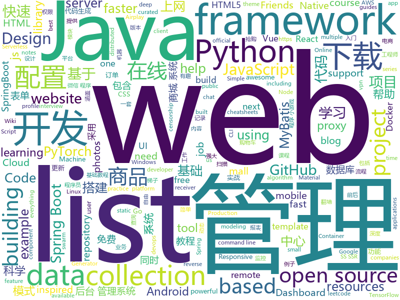

# 2020-02-04
See what the GitHub community is most excited about today.

## python
* [HelloGitHub](https://github.com/521xueweihan/HelloGitHub)(**167 stars today**): Find pearls on open-source seashore 分享 GitHub 上有趣、入门级的开源项目
* [jd-assistant](https://github.com/tychxn/jd-assistant)(**46 stars today**): 京东抢购助手：包含登录，查询商品库存/价格，添加/清空购物车，抢购商品(下单)，查询订单等功能
* [CMPEDUDownload](https://github.com/Echowxsy/CMPEDUDownload)(**45 stars today**): 机械工业出版社PDF下载器
* [autonomous-learning-library](https://github.com/cpnota/autonomous-learning-library)(**22 stars today**): A PyTorch library for building deep reinforcement learning agents.
* [stylegan2](https://github.com/NVlabs/stylegan2)(**90 stars today**): StyleGAN2 - Official TensorFlow Implementation
* [karkinos](https://github.com/0xb0bb/karkinos)(**48 stars today**): A thorough library database to assist with binary exploitation tasks.
* [wqxuetang_downloader](https://github.com/kajweb/wqxuetang_downloader)(**62 stars today**): 文泉学堂下载器 最后更新更新时间：2020-02-04 03:49
* [pytorch-image-models](https://github.com/rwightman/pytorch-image-models)(**137 stars today**): PyTorch image models, scripts, pretrained weights -- (SE)ResNet/ResNeXT, DPN, EfficientNet, MixNet, MobileNet-V3/V2/V1, MNASNet, Single-Path NAS, FBNet, and more
* [python-small-examples](https://github.com/jackzhenguo/python-small-examples)(**80 stars today**): Python有趣的小例子一网打尽。Python基础、Python坑点、Python字符串和正则、Python绘图、Python日期和文件、Web开发、数据科学、机器学习、深度学习、TensorFlow、Pytorch，一切都是简单易懂的小例子。
* [tfc](https://github.com/maqp/tfc)(**47 stars today**): Tinfoil Chat - Onion-routed, endpoint secure messaging system
* [Monk_Gui](https://github.com/Tessellate-Imaging/Monk_Gui)(**18 stars today**): A Graphical user Interface for deep learning and computer vision over Monk Libraries
* [DeepLearning.ai-Summary](https://github.com/mbadry1/DeepLearning.ai-Summary)(**8 stars today**): This repository contains my personal notes and summaries on DeepLearning.ai specialization courses. I've enjoyed every little bit of the course hope you enjoy my notes too.
* [flask](https://github.com/pallets/flask)(**19 stars today**): The Python micro framework for building web applications.
* [gensim](https://github.com/RaRe-Technologies/gensim)(**8 stars today**): Topic Modelling for Humans
* [lasertagger](https://github.com/google-research/lasertagger)(**33 stars today**): 
* [Ultimate-Facebook-Scraper](https://github.com/harismuneer/Ultimate-Facebook-Scraper)(**6 stars today**): 🤖A bot which scrapes almost everything about a Facebook user's profile including all public posts/statuses available on the user's timeline, uploaded photos, tagged photos, videos, friends list and their profile photos (including Followers, Following, Work Friends, College Friends etc).
* [tinder-swipe-bot](https://github.com/aj-4/tinder-swipe-bot)(**14 stars today**): 
* [django-realworld-example-app](https://github.com/gothinkster/django-realworld-example-app)(**8 stars today**): 
* [pytorch-examples](https://github.com/jcjohnson/pytorch-examples)(**5 stars today**): Simple examples to introduce PyTorch
* [Mooc_Downloader](https://github.com/PyJun/Mooc_Downloader)(**6 stars today**): 慕课下载器，Mooc下载，中国大学下载，爱课程下载；支持视频，课件同时下载
* [statsmodels](https://github.com/statsmodels/statsmodels)(**8 stars today**): Statsmodels: statistical modeling and econometrics in Python
* [AIX360](https://github.com/IBM/AIX360)(**4 stars today**): Interpretability and explainability of data and machine learning models
* [mlfinlab](https://github.com/hudson-and-thames/mlfinlab)(**29 stars today**): Package based on the work of Dr Marcos Lopez de Prado regarding his research with respect to Advances in Financial Machine Learning
* [faster-rcnn.pytorch](https://github.com/jwyang/faster-rcnn.pytorch)(**8 stars today**): A faster pytorch implementation of faster r-cnn
* [gluon-ts](https://github.com/awslabs/gluon-ts)(**5 stars today**): Probabilistic time series modeling in Python

## java
* [Algorithms](https://github.com/williamfiset/Algorithms)(**199 stars today**): A collection of algorithms and data structures
* [reliable](https://github.com/x-ream/reliable)(**9 stars today**): mq transaction, tcc, eventually consistency. tx life cycle: all listeners handled, if necessary, produce next message
* [elasticsearch](https://github.com/elastic/elasticsearch)(**23 stars today**): Open Source, Distributed, RESTful Search Engine
* [spring-security](https://github.com/spring-projects/spring-security)(**7 stars today**): Spring Security
* [ghidra](https://github.com/NationalSecurityAgency/ghidra)(**45 stars today**): Ghidra is a software reverse engineering (SRE) framework
* [Java-Tutorial](https://github.com/h2pl/Java-Tutorial)(**29 stars today**): 【Java工程师面试复习指南】本仓库涵盖大部分Java程序员所需要掌握的核心知识，整合了互联网上的很多优质Java技术文章，力求打造为最完整最实用的Java开发者学习指南，如果对你有帮助，给个star告诉我吧，谢谢！
* [easyexcel](https://github.com/alibaba/easyexcel)(**11 stars today**): 快速、简单避免OOM的java处理Excel工具
* [OpenHub](https://github.com/ThirtyDegreesRay/OpenHub)(**7 stars today**): An open source GitHub Android client app, faster and concise.
* [jeecg-boot](https://github.com/zhangdaiscott/jeecg-boot)(**14 stars today**): 一款基于代码生成器的JAVA快速开发平台，开源界“小普元”超越传统商业企业级开发平台！采用前后端分离架构：SpringBoot 2.x，Ant Design&Vue，Mybatis-plus，Shiro，JWT。强大的代码生成器让前后端代码一键生成，无需写任何代码! 引领新的开发模式(OnlineCoding模式-> 代码生成器模式-> 手工MERGE智能开发)，帮助Java项目解决70%的重复工作，让开发更多关注业务逻辑。既能快速提高开发效率，帮助公司节省成本，同时又不失灵活性。JeecgBoot还独创在线开发模式（No代码）：在线表单配置（表单设计器）、移动配置能力、在线工作流配置（流程设计器）、在线报表配置、在线图表配置、插件能力（可插拔）等等
* [AnySoftKeyboard](https://github.com/AnySoftKeyboard/AnySoftKeyboard)(**7 stars today**): Android (f/w 2.1+) on screen keyboard for multiple languages (chat https://gitter.im/AnySoftKeyboard)
* [mall](https://github.com/macrozheng/mall)(**71 stars today**): mall项目是一套电商系统，包括前台商城系统及后台管理系统，基于SpringBoot+MyBatis实现，采用Docker容器化部署。 前台商城系统包含首页门户、商品推荐、商品搜索、商品展示、购物车、订单流程、会员中心、客户服务、帮助中心等模块。 后台管理系统包含商品管理、订单管理、会员管理、促销管理、运营管理、内容管理、统计报表、财务管理、权限管理、设置等模块。
* [mall-swarm](https://github.com/macrozheng/mall-swarm)(**3 stars today**): mall-swarm是一套微服务商城系统，采用了 Spring Cloud Greenwich、Spring Boot 2、MyBatis、Docker、Elasticsearch等核心技术，同时提供了基于Vue的管理后台方便快速搭建系统。mall-swarm在电商业务的基础集成了注册中心、配置中心、监控中心、网关等系统功能。文档齐全，附带全套Spring Cloud教程。
* [springboot-socks](https://github.com/yizhiwazi/springboot-socks)(**3 stars today**): SpringBoot 基础教程 | 从入门到上瘾 | 基于2.0.0.M5制作
* [druid](https://github.com/alibaba/druid)(**11 stars today**): 阿里巴巴数据库事业部出品，为监控而生的数据库连接池
* [interviews](https://github.com/kdn251/interviews)(**19 stars today**): Everything you need to know to get the job.
* [SpringBoot-Learning](https://github.com/dyc87112/SpringBoot-Learning)(**10 stars today**): Spring Boot基础教程，Spring Boot 2.x版本连载中！！！
* [hbase](https://github.com/apache/hbase)(**2 stars today**): Mirror of Apache HBase
* [Telegram](https://github.com/DrKLO/Telegram)(**10 stars today**): Telegram for Android source
* [mybatis-plus](https://github.com/baomidou/mybatis-plus)(**5 stars today**): An powerful enhanced toolkit of MyBatis for simplify development
* [jedis](https://github.com/xetorthio/jedis)(**6 stars today**): A blazingly small and sane redis java client
* [hsweb-framework](https://github.com/hs-web/hsweb-framework)(**2 stars today**): hsweb (haʊs wɛb) 是一个用于快速搭建企业后台管理系统的基础项目,集成一揽子便捷功能如:便捷的通用增删改查,强大的权限管理,动态多数据源,动态表单,在线数据库维护等. 基于 spring-boot,mybaits.
* [zipkin](https://github.com/openzipkin/zipkin)(**4 stars today**): Zipkin is a distributed tracing system
* [spring-data-examples](https://github.com/spring-projects/spring-data-examples)(**3 stars today**): Spring Data Example Projects
* [TrackRay](https://github.com/iSafeBlue/TrackRay)(**4 stars today**): 溯光 (TrackRay) 3 beta⚡渗透测试框架（资产扫描|指纹识别|暴力破解|网页爬虫|端口扫描|漏洞扫描|代码审计|AWVS|NMAP|Metasploit|SQLMap）
* [jd-gui](https://github.com/java-decompiler/jd-gui)(**7 stars today**): A standalone Java Decompiler GUI

## unknown
* [algodeck](https://github.com/teivah/algodeck)(**578 stars today**): An Open-Source Collection of +200 Algorithmic Flash Cards to Help you Preparing your Algorithm & Data Structure Interview💯
* [Resources-for-Beginner-Bug-Bounty-Hunters](https://github.com/nahamsec/Resources-for-Beginner-Bug-Bounty-Hunters)(**215 stars today**): A list of resources for those interested in getting started in bug bounties
* [You-Dont-Know-JS](https://github.com/getify/You-Dont-Know-JS)(**204 stars today**): A book series on JavaScript. @YDKJS on twitter.
* [wuhan2020-timeline](https://github.com/Pratitya/wuhan2020-timeline)(**130 stars today**): 记录自2019年12月起武汉新冠肺炎疫情进展的时间线，尽可能搜集经敝人筛查后的信息，因为假若敏感内容，墙内容易炸号，故置于此。
* [Micro8](https://github.com/Micropoor/Micro8)(**8 stars today**): Gitbook
* [Ai-learn](https://github.com/tangyudi/Ai-learn)(**48 stars today**): 人工智能学习路线图，整理近200个实战案例与项目，免费提供配套教材，零基础入门，就业实战！包括：Python，数学，机器学习，数据分析，深度学习，计算机视觉，自然语言处理等热门领域
* [new-pac](https://github.com/Alvin9999/new-pac)(**116 stars today**): 科学/自由上网，免费ss/ssr/v2ray/goflyway账号，搭建教程
* [awesome-remote-job](https://github.com/lukasz-madon/awesome-remote-job)(**202 stars today**): A curated list of awesome remote jobs and resources. Inspired by https://github.com/vinta/awesome-python
* [Airplay-SDK](https://github.com/xfirefly/Airplay-SDK)(**54 stars today**): Airplay Receiver SDK supports Airplay Mirroring and AirPlay Casting to a receiver device.
* [gfwlist](https://github.com/gfwlist/gfwlist)(**23 stars today**): The one and only one gfwlist here
* [developer-roadmap](https://github.com/kamranahmedse/developer-roadmap)(**99 stars today**): Roadmap to becoming a web developer in 2020
* [javascript-questions](https://github.com/lydiahallie/javascript-questions)(**31 stars today**): A long list of (advanced) JavaScript questions, and their explanations✨
* [remotes](https://github.com/remote-es/remotes)(**22 stars today**): This is a repository listing companies which offer full-time remote jobs with Spanish contracts
* [OI-wiki](https://github.com/OI-wiki/OI-wiki)(**10 stars today**): 🌟Wiki for OI / ICPC. （某大型游戏线上攻略，内含炫酷算术魔法）
* [spring-boot-leaning](https://github.com/ityouknow/spring-boot-leaning)(**6 stars today**): Spring Boot 2.X 最全课程代码
* [awesome-osint](https://github.com/jivoi/awesome-osint)(**19 stars today**): 😱A curated list of amazingly awesome OSINT
* [awesome-aws-amplify](https://github.com/dabit3/awesome-aws-amplify)(**20 stars today**): Curated list of AWS Amplify Resources
* [nlp_newsletter](https://github.com/dair-ai/nlp_newsletter)(**13 stars today**): 📰Natural language processing (NLP) newsletter
* [awesome-avalonia](https://github.com/AvaloniaCommunity/awesome-avalonia)(**17 stars today**): A collection of interesting libraries and tools for Avalonia project.
* [stanford-cs-229-machine-learning](https://github.com/afshinea/stanford-cs-229-machine-learning)(**17 stars today**): VIP cheatsheets for Stanford's CS 229 Machine Learning
* [RStudioConf2020Slides](https://github.com/EmilHvitfeldt/RStudioConf2020Slides)(**15 stars today**): Links to slides for rstudio::conf 2020
* [jstraining](https://github.com/ruanyf/jstraining)(**6 stars today**): 全栈工程师培训材料
* [guides](https://github.com/sindresorhus/guides)(**3 stars today**): A collection of succinct guides - Public Domain
* [the-book-of-secret-knowledge](https://github.com/trimstray/the-book-of-secret-knowledge)(**97 stars today**): A collection of inspiring lists, manuals, cheatsheets, blogs, hacks, one-liners, cli/web tools and more.
* [howto-make-more-money](https://github.com/easychen/howto-make-more-money)(**70 stars today**): 程序员如何优雅的挣零花钱

## javascript
* [remote-jobs](https://github.com/remoteintech/remote-jobs)(**203 stars today**): A list of semi to fully remote-friendly companies in tech.
* [tasks](https://github.com/rolling-scopes-school/tasks)(**9 stars today**): 
* [vanillawebprojects](https://github.com/bradtraversy/vanillawebprojects)(**180 stars today**): Mini projects built with HTML5, CSS & JavaScript. No frameworks or libraries
* [gutenberg](https://github.com/WordPress/gutenberg)(**8 stars today**): The Block Editor project for WordPress and beyond. Plugin is available from the official repository.
* [clean-code-javascript](https://github.com/ryanmcdermott/clean-code-javascript)(**72 stars today**): 🛁Clean Code concepts adapted for JavaScript
* [leetcode](https://github.com/azl397985856/leetcode)(**108 stars today**): LeetCode Solutions: A Record of My Problem Solving Journey.( leetcode题解，记录自己的leetcode解题之路。)
* [material-ui](https://github.com/mui-org/material-ui)(**39 stars today**): React components for faster and easier web development. Build your own design system, or start with Material Design.
* [30-seconds-of-code](https://github.com/30-seconds/30-seconds-of-code)(**46 stars today**): Short JavaScript code snippets for all your development needs
* [hexo](https://github.com/hexojs/hexo)(**10 stars today**): A fast, simple & powerful blog framework, powered by Node.js.
* [caniuse](https://github.com/Fyrd/caniuse)(**5 stars today**): Raw browser/feature support data from caniuse.com
* [beep-beep](https://github.com/adzialocha/beep-beep)(**7 stars today**): Fictional p2p protocol
* [appwrite](https://github.com/appwrite/appwrite)(**6 stars today**): End-to-end backend server for frontend and mobile developers.🚀
* [comments-api](https://github.com/dev-mastery/comments-api)(**4 stars today**): 
* [mercury-parser](https://github.com/postlight/mercury-parser)(**5 stars today**): 📜Extract meaningful content from the chaos of a web page
* [theme-ui](https://github.com/system-ui/theme-ui)(**20 stars today**): Build consistent, themeable React apps based on constraint-based design principles
* [uppy](https://github.com/transloadit/uppy)(**25 stars today**): The next open source file uploader for web browsers🐶
* [vue](https://github.com/vuejs/vue)(**46 stars today**): 🖖Vue.js is a progressive, incrementally-adoptable JavaScript framework for building UI on the web.
* [gatsby-themes](https://github.com/LekoArts/gatsby-themes)(**4 stars today**): Get high-quality and customizable Gatsby themes to quickly bootstrap your website! Choose from many professionally created and impressive designs with a wide variety of features and customization options.
* [joi](https://github.com/hapijs/joi)(**10 stars today**): The most powerful data validation library for JS
* [pancake](https://github.com/Rich-Harris/pancake)(**39 stars today**): Experimental charting library for Svelte
* [Chart.js](https://github.com/chartjs/Chart.js)(**24 stars today**): Simple HTML5 Charts using the <canvas> tag
* [bootstrap](https://github.com/twbs/bootstrap)(**28 stars today**): The most popular HTML, CSS, and JavaScript framework for developing responsive, mobile first projects on the web.
* [tech-interview-handbook](https://github.com/yangshun/tech-interview-handbook)(**35 stars today**): 💯Materials to help you rock your next coding interview
* [WeApp_Demos](https://github.com/Data-Camp/WeApp_Demos)(**5 stars today**): 持续更新中的微信小程序和小游戏的源码案例库。目前涵盖了120多个微信小程序或小游戏。
* [react-native-swiper](https://github.com/leecade/react-native-swiper)(**6 stars today**): The best Swiper component for React Native.

## html
* [styleguide](https://github.com/google/styleguide)(**19 stars today**): Style guides for Google-originated open-source projects
* [tabler](https://github.com/tabler/tabler)(**10 stars today**): Tabler is free and open-source HTML Dashboard UI Kit built on Bootstrap
* [aws-well-architected-labs](https://github.com/awslabs/aws-well-architected-labs)(**4 stars today**): Hands on labs and code to help you learn, measure, and build using architectural best practices.
* [learning-area](https://github.com/mdn/learning-area)(**4 stars today**): Github repo for the MDN Learning Area.
* [Publii](https://github.com/GetPublii/Publii)(**8 stars today**): Publii is a desktop-based CMS for Windows, Mac and Linux that makes creating static websites fast and hassle-free, even for beginners.
* [dashboards](https://github.com/keen/dashboards)(**3 stars today**): Responsive dashboard templates📊✨
* [blog_os](https://github.com/phil-opp/blog_os)(**6 stars today**): Writing an OS in Rust
* [flutter-in-action](https://github.com/flutterchina/flutter-in-action)(**3 stars today**): 《Flutter实战》电子书
* [JavaScript30](https://github.com/wesbos/JavaScript30)(**9 stars today**): 30 Day Vanilla JS Challenge
* [www-project-top-ten](https://github.com/OWASP/www-project-top-ten)(**3 stars today**): OWASP Foundation Web Respository
* [aws-data-wrangler](https://github.com/awslabs/aws-data-wrangler)(**5 stars today**): DataFrames on AWS
* [blackeye](https://github.com/thelinuxchoice/blackeye)(**3 stars today**): The most complete Phishing Tool, with 32 templates +1 customizable
* [ctf-wiki](https://github.com/ctf-wiki/ctf-wiki)(**3 stars today**): CTF Wiki Online. Come and join us, we need you!
* [speedtest](https://github.com/librespeed/speedtest)(**7 stars today**): Self-hosted Speedtest for HTML5 and more. Easy setup, examples, configurable, mobile friendly. Supports PHP, Node, Multiple servers, and more
* [free-for-dev](https://github.com/ripienaar/free-for-dev)(**42 stars today**): A list of SaaS, PaaS and IaaS offerings that have free tiers of interest to devops and infradev
* [learn-to-send-email-via-google-script-html-no-server](https://github.com/dwyl/learn-to-send-email-via-google-script-html-no-server)(**10 stars today**): ✉️An Example of using an HTML form (e.g: "Contact Us" on a website) to send Email without a Backend Server (using a Google Script) perfect for static websites that need to collect data.
* [ru.javascript.info](https://github.com/javascript-tutorial/ru.javascript.info)(**4 stars today**): Современный учебник JavaScript
* [openapi.tools](https://github.com/apisyouwonthate/openapi.tools)(**4 stars today**): A collection of Editors, Linters, Parsers, Code Generators, Documentation, Testing
* [fem-layout](https://github.com/jen4web/fem-layout)(**3 stars today**): Frontend Masters: CSS Grids and Flexbox in Responsive Web Design workshop files
* [ASVS](https://github.com/OWASP/ASVS)(**5 stars today**): Application Security Verification Standard
* [gentelella](https://github.com/ColorlibHQ/gentelella)(**9 stars today**): Free Bootstrap 4 Admin Dashboard Template
* [zfaka](https://github.com/zlkbdotnet/zfaka)(**4 stars today**): 免费、安全、稳定、高效的发卡系统，值得拥有!
* [pcc_2e](https://github.com/ehmatthes/pcc_2e)(**4 stars today**): Online resources for Python Crash Course (Second Edition), from No Starch Press
* [hugo-coder](https://github.com/luizdepra/hugo-coder)(**5 stars today**): A minimalist blog theme for hugo.
* [www-community](https://github.com/OWASP/www-community)(**1 stars today**): 

## go
* [lantern](https://github.com/getlantern/lantern)(**52 stars today**): Lantern官方版本下载 蓝灯 翻墙 代理 科学上网 外网 加速器 梯子 路由 lantern proxy vpn censorship-circumvention censorship gfw accelerator
* [logrus](https://github.com/sirupsen/logrus)(**14 stars today**): Structured, pluggable logging for Go.
* [kubernetes](https://github.com/kubernetes/kubernetes)(**41 stars today**): Production-Grade Container Scheduling and Management
* [faas](https://github.com/openfaas/faas)(**9 stars today**): OpenFaaS - Serverless Functions Made Simple
* [v2ray-core](https://github.com/v2ray/v2ray-core)(**79 stars today**): A platform for building proxies to bypass network restrictions.
* [cli](https://github.com/cli/cli)(**421 stars today**): the GitHub CLI
* [wg-gen-web](https://github.com/vx3r/wg-gen-web)(**8 stars today**): Simple Web based configuration generator for WireGuard
* [inlets](https://github.com/inlets/inlets)(**38 stars today**): Reverse proxy and service tunnel written in Go
* [tinygo](https://github.com/tinygo-org/tinygo)(**127 stars today**): Go compiler for small places. Microcontrollers, WebAssembly, and command-line tools. Based on LLVM.
* [frp](https://github.com/fatedier/frp)(**45 stars today**): A fast reverse proxy to help you expose a local server behind a NAT or firewall to the internet.
* [cobra](https://github.com/spf13/cobra)(**20 stars today**): A Commander for modern Go CLI interactions
* [traefik](https://github.com/containous/traefik)(**26 stars today**): The Cloud Native Edge Router
* [fzf](https://github.com/junegunn/fzf)(**40 stars today**): 🌸A command-line fuzzy finder
* [docker_practice](https://github.com/yeasy/docker_practice)(**12 stars today**): Learn and understand Docker technologies, with real DevOps practice!
* [terraform-provider-aws](https://github.com/terraform-providers/terraform-provider-aws)(**7 stars today**): Terraform AWS provider
* [client-go](https://github.com/kubernetes/client-go)(**5 stars today**): Go client for Kubernetes.
* [termshark](https://github.com/gcla/termshark)(**56 stars today**): A terminal UI for tshark, inspired by Wireshark
* [fiber](https://github.com/gofiber/fiber)(**38 stars today**): 🔌Fiber is an Express.js inspired web framework build on🚀Fasthttp.
* [kubesphere](https://github.com/kubesphere/kubesphere)(**9 stars today**): Easy-to-use Production Ready Container Platform
* [kubeless](https://github.com/kubeless/kubeless)(**5 stars today**): Kubernetes Native Serverless Framework
* [FreePAC](https://github.com/xiaoming2028/FreePAC)(**11 stars today**): 科学上网/梯子/自由上网/翻墙 SS/SSR/V2Ray/Brook 搭建教程
* [sqlc](https://github.com/kyleconroy/sqlc)(**18 stars today**): Generate type safe Go from SQL
* [brook](https://github.com/txthinking/brook)(**13 stars today**): Brook is a cross-platform(Linux/MacOS/Windows/Android/iOS) proxy/vpn software
* [operator-sdk](https://github.com/operator-framework/operator-sdk)(**8 stars today**): SDK for building Kubernetes applications. Provides high level APIs, useful abstractions, and project scaffolding.
* [hugo](https://github.com/gohugoio/hugo)(**35 stars today**): The world’s fastest framework for building websites.

## WordCloud

