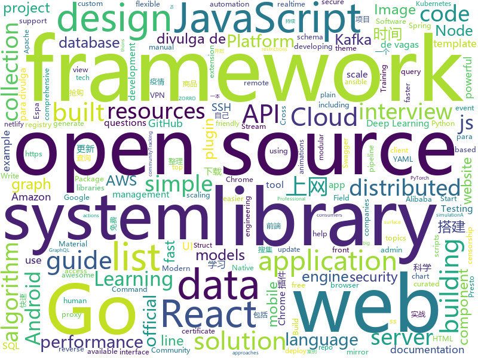

# 2020-02-05
See what the GitHub community is most excited about today.

## python
* [DXY-2019-nCoV-Data](https://github.com/BlankerL/DXY-2019-nCoV-Data)(**85 stars today**): 2019新型冠状病毒疫情时间序列数据仓库
* [CMPEDUDownload](https://github.com/Echowxsy/CMPEDUDownload)(**36 stars today**): 机械工业出版社PDF下载器
* [HelloGitHub](https://github.com/521xueweihan/HelloGitHub)(**131 stars today**): Find pearls on open-source seashore 分享 GitHub 上有趣、入门级的开源项目
* [Python](https://github.com/TheAlgorithms/Python)(**78 stars today**): All Algorithms implemented in Python
* [pytorch-lightning](https://github.com/PyTorchLightning/pytorch-lightning)(**38 stars today**): The lightweight PyTorch wrapper for ML researchers. Scale your models. Write less boilerplate
* [aws-cli](https://github.com/aws/aws-cli)(**7 stars today**): Universal Command Line Interface for Amazon Web Services
* [tfc](https://github.com/maqp/tfc)(**78 stars today**): Tinfoil Chat - Onion-routed, endpoint secure messaging system
* [mne-python](https://github.com/mne-tools/mne-python)(**3 stars today**): MNE : Magnetoencephalography (MEG) and Electroencephalography (EEG) in Python
* [DAIN](https://github.com/baowenbo/DAIN)(**101 stars today**): Depth-Aware Video Frame Interpolation (CVPR 2019)
* [dgl](https://github.com/dmlc/dgl)(**11 stars today**): Python package built to ease deep learning on graph, on top of existing DL frameworks.
* [jmesh-tools](https://github.com/jayanam/jmesh-tools)(**11 stars today**): Blender 2.8 mesh and hard surface utilities addon
* [models](https://github.com/tensorflow/models)(**41 stars today**): Models and examples built with TensorFlow
* [pytorch-image-models](https://github.com/rwightman/pytorch-image-models)(**81 stars today**): PyTorch image models, scripts, pretrained weights -- (SE)ResNet/ResNeXT, DPN, EfficientNet, MixNet, MobileNet-V3/V2/V1, MNASNet, Single-Path NAS, FBNet, and more
* [cloud-custodian](https://github.com/cloud-custodian/cloud-custodian)(**4 stars today**): Rules engine for cloud security, cost optimization, and governance, DSL in yaml for policies to query, filter, and take actions on resources
* [pipelines](https://github.com/kubeflow/pipelines)(**2 stars today**): Machine Learning Pipelines for Kubeflow
* [system-design-primer](https://github.com/donnemartin/system-design-primer)(**100 stars today**): Learn how to design large-scale systems. Prep for the system design interview. Includes Anki flashcards.
* [gym](https://github.com/openai/gym)(**10 stars today**): A toolkit for developing and comparing reinforcement learning algorithms.
* [pytorch-CycleGAN-and-pix2pix](https://github.com/junyanz/pytorch-CycleGAN-and-pix2pix)(**14 stars today**): Image-to-Image Translation in PyTorch
* [ansible](https://github.com/ansible/ansible)(**17 stars today**): Ansible is a radically simple IT automation platform that makes your applications and systems easier to deploy. Avoid writing scripts or custom code to deploy and update your applications — automate in a language that approaches plain English, using SSH, with no agents to install on remote systems. https://docs.ansible.com/ansible/
* [odoo](https://github.com/odoo/odoo)(**22 stars today**): Odoo. Open Source Apps To Grow Your Business.
* [ParlAI](https://github.com/facebookresearch/ParlAI)(**7 stars today**): A framework for training and evaluating AI models on a variety of openly available dialogue datasets.
* [cleverhans](https://github.com/tensorflow/cleverhans)(**5 stars today**): An adversarial example library for constructing attacks, building defenses, and benchmarking both
* [caldera](https://github.com/mitre/caldera)(**5 stars today**): Automated Adversary Emulation
* [jd-assistant](https://github.com/tychxn/jd-assistant)(**89 stars today**): 京东抢购助手：包含登录，查询商品库存/价格，添加/清空购物车，抢购商品(下单)，查询订单等功能
* [pytorch_geometric](https://github.com/rusty1s/pytorch_geometric)(**14 stars today**): Geometric Deep Learning Extension Library for PyTorch

## java
* [VirusBroadcast](https://github.com/KikiLetGo/VirusBroadcast)(**545 stars today**): A java virus broadcast simulation
* [Algorithms](https://github.com/williamfiset/Algorithms)(**186 stars today**): A collection of algorithms and data structures
* [Interview-Questions](https://github.com/rishabh115/Interview-Questions)(**8 stars today**): Most comprehensive list📋of tech interview questions📘of companies scraped from Geeksforgeeks, CareerCup and Glassdoor.
* [DataX](https://github.com/alibaba/DataX)(**4 stars today**): 
* [material-components-android](https://github.com/material-components/material-components-android)(**19 stars today**): Modular and customizable Material Design UI components for Android
* [ghidra](https://github.com/NationalSecurityAgency/ghidra)(**24 stars today**): Ghidra is a software reverse engineering (SRE) framework
* [kafka-streams-examples](https://github.com/confluentinc/kafka-streams-examples)(**2 stars today**): Demo applications and code examples for Apache Kafka's Streams API.
* [keycloak](https://github.com/keycloak/keycloak)(**8 stars today**): Open Source Identity and Access Management For Modern Applications and Services
* [reliable](https://github.com/x-ream/reliable)(**24 stars today**): mq transaction, tcc, eventually consistency. tx life cycle: all listeners handled, if necessary, produce next message
* [elasticsearch](https://github.com/elastic/elasticsearch)(**40 stars today**): Open Source, Distributed, RESTful Search Engine
* [facebook-android-sdk](https://github.com/facebook/facebook-android-sdk)(**5 stars today**): Used to integrate Android apps with Facebook Platform.
* [lottie-android](https://github.com/airbnb/lottie-android)(**5 stars today**): Render After Effects animations natively on Android and iOS, Web, and React Native
* [piggymetrics](https://github.com/sqshq/piggymetrics)(**10 stars today**): Microservice Architecture with Spring Boot, Spring Cloud and Docker
* [spring-cloud-alibaba](https://github.com/alibaba/spring-cloud-alibaba)(**11 stars today**): Spring Cloud Alibaba provides a one-stop solution for application development for the distributed solutions of Alibaba middleware.
* [MPAndroidChart](https://github.com/PhilJay/MPAndroidChart)(**6 stars today**): A powerful🚀Android chart view / graph view library, supporting line- bar- pie- radar- bubble- and candlestick charts as well as scaling, dragging and animations.
* [kafkahq](https://github.com/tchiotludo/kafkahq)(**3 stars today**): Kafka GUI for Apache Kafka to manage topics, topics data, consumers group, schema registry, connect and more...
* [hazelcast](https://github.com/hazelcast/hazelcast)(**2 stars today**): Open Source In-Memory Data Grid
* [ksql](https://github.com/confluentinc/ksql)(**5 stars today**): The event streaming database purpose-built for stream processing applications
* [react-native-svg](https://github.com/react-native-community/react-native-svg)(**8 stars today**): SVG library for React Native, React Native Web, and plain React web projects.
* [schema-registry](https://github.com/confluentinc/schema-registry)(**1 stars today**): Confluent Schema Registry for Kafka
* [presto](https://github.com/prestosql/presto)(**4 stars today**): Official home of the community managed version of Presto, the distributed SQL query engine for big data, under the auspices of the Presto Software Foundation.
* [bigbluebutton](https://github.com/bigbluebutton/bigbluebutton)(**2 stars today**): Complete open source web conferencing system.
* [BaseRecyclerViewAdapterHelper](https://github.com/CymChad/BaseRecyclerViewAdapterHelper)(**6 stars today**): BRVAH:Powerful and flexible RecyclerAdapter
* [tinker](https://github.com/Tencent/tinker)(**4 stars today**): Tinker is a hot-fix solution library for Android, it supports dex, library and resources update without reinstall apk.
* [selenium](https://github.com/SeleniumHQ/selenium)(**17 stars today**): A browser automation framework and ecosystem.

## unknown
* [algodeck](https://github.com/teivah/algodeck)(**785 stars today**): An Open-Source Collection of +200 Algorithmic Flash Cards to Help you Preparing your Algorithm & Data Structure Interview💯
* [howto-make-more-money](https://github.com/easychen/howto-make-more-money)(**137 stars today**): 程序员如何优雅的挣零花钱
* [You-Dont-Know-JS](https://github.com/getify/You-Dont-Know-JS)(**216 stars today**): A book series on JavaScript. @YDKJS on twitter.
* [new-pac](https://github.com/Alvin9999/new-pac)(**102 stars today**): 科学/自由上网，免费ss/ssr/v2ray/goflyway账号，搭建教程
* [Ai-learn](https://github.com/tangyudi/Ai-learn)(**101 stars today**): 人工智能学习路线图，整理近200个实战案例与项目，免费提供配套教材，零基础入门，就业实战！包括：Python，数学，机器学习，数据分析，深度学习，计算机视觉，自然语言处理等热门领域
* [Resources-for-Beginner-Bug-Bounty-Hunters](https://github.com/nahamsec/Resources-for-Beginner-Bug-Bounty-Hunters)(**192 stars today**): A list of resources for those interested in getting started in bug bounties
* [vagas](https://github.com/frontendbr/vagas)(**9 stars today**): 🔬Espaço para divulgação de vagas para front-enders.
* [chromium](https://github.com/chromium/chromium)(**9 stars today**): The official GitHub mirror of the Chromium source
* [awesome-gcp-certifications](https://github.com/sathishvj/awesome-gcp-certifications)(**24 stars today**): Google Cloud Platform Certification resources.
* [wqxuetang_downloader](https://github.com/kajweb/wqxuetang_downloader)(**45 stars today**): 文泉学堂下载器 最后更新更新时间：2020-02-04 03:49
* [copper-hammer](https://github.com/Bumblefuck/copper-hammer)(**10 stars today**): 2x2 copper hammer
* [vagas](https://github.com/react-brasil/vagas)(**10 stars today**): Espaço para divulgação de vagas relacionadas com React
* [vpn](https://github.com/wistbean/vpn)(**14 stars today**): 快速搭建一个自己的VPN科学上网,搭建ss并开启bbr快速上网
* [wuhan2020-timeline](https://github.com/Pratitya/wuhan2020-timeline)(**109 stars today**): 记录自2019年12月起武汉新冠肺炎疫情进展的时间线，尽可能搜集信息，因为假若敏感内容，墙内容易炸号，故置于此。
* [awesome-aws-amplify](https://github.com/dabit3/awesome-aws-amplify)(**23 stars today**): Curated list of AWS Amplify Resources
* [awesome-dotnet](https://github.com/quozd/awesome-dotnet)(**9 stars today**): A collection of awesome .NET libraries, tools, frameworks and software
* [shadowsocks](https://github.com/Shadowsocks-Wiki/shadowsocks)(**9 stars today**): shadowsocks.wiki
* [WSL](https://github.com/microsoft/WSL)(**11 stars today**): Issues found on WSL
* [vagas](https://github.com/backend-br/vagas)(**6 stars today**): ✌️Espaço para divulgação de vagas para backenders
* [frosty-february-hackathon](https://github.com/zero-to-mastery/frosty-february-hackathon)(**6 stars today**): Frosty February Hackathon for the ZTM community
* [proposals](https://github.com/tc39/proposals)(**12 stars today**): Tracking ECMAScript Proposals
* [awesome-java-cn](https://github.com/jobbole/awesome-java-cn)(**7 stars today**): Java资源大全中文版，包括开发库、开发工具、网站、博客、微信、微博等，由伯乐在线持续更新。
* [handbook](https://github.com/basecamp/handbook)(**5 stars today**): Basecamp Employee Handbook
* [SS-Rule-Snippet](https://github.com/Hackl0us/SS-Rule-Snippet)(**19 stars today**): 搜集、整理、维护 Surge / Quantumult / Shadowrocket / Surfboard / clash(X) 实用规则。
* [reactjs-interview-questions](https://github.com/sudheerj/reactjs-interview-questions)(**12 stars today**): List of top 500 ReactJS Interview Questions & Answers....Coding exercise questions are coming soon!!

## javascript
* [vanillawebprojects](https://github.com/bradtraversy/vanillawebprojects)(**901 stars today**): Mini projects built with HTML5, CSS & JavaScript. No frameworks or libraries
* [remote-jobs](https://github.com/remoteintech/remote-jobs)(**251 stars today**): A list of semi to fully remote-friendly companies in tech.
* [openlayers](https://github.com/openlayers/openlayers)(**24 stars today**): OpenLayers
* [material-ui](https://github.com/mui-org/material-ui)(**34 stars today**): React components for faster and easier web development. Build your own design system, or start with Material Design.
* [microsoft-authentication-library-for-js](https://github.com/AzureAD/microsoft-authentication-library-for-js)(**4 stars today**): Microsoft Authentication Library (MSAL) for JS
* [curso-javascript-ninja](https://github.com/da2k/curso-javascript-ninja)(**4 stars today**): Curso Javascript Ninja
* [buster](https://github.com/dessant/buster)(**40 stars today**): Captcha solver extension for humans🐶
* [gitalk](https://github.com/gitalk/gitalk)(**13 stars today**): Gitalk is a modern comment component based on Github Issue and Preact.
* [faker.js](https://github.com/Marak/faker.js)(**20 stars today**): generate massive amounts of realistic fake data in Node.js and the browser
* [Daily-Interview-Question](https://github.com/Advanced-Frontend/Daily-Interview-Question)(**14 stars today**): 我是木易杨，公众号「高级前端进阶」作者，每天搞定一道前端大厂面试题，祝大家天天进步，一年后会看到不一样的自己。
* [react](https://github.com/facebook/react)(**56 stars today**): A declarative, efficient, and flexible JavaScript library for building user interfaces.
* [vue](https://github.com/vuejs/vue)(**65 stars today**): 🖖Vue.js is a progressive, incrementally-adoptable JavaScript framework for building UI on the web.
* [gutenberg](https://github.com/WordPress/gutenberg)(**9 stars today**): The Block Editor project for WordPress and beyond. Plugin is available from the official repository.
* [Leaflet](https://github.com/Leaflet/Leaflet)(**20 stars today**): 🍃JavaScript library for mobile-friendly interactive maps
* [gun](https://github.com/amark/gun)(**20 stars today**): A realtime, decentralized, offline-first, graph protocol to sync the web.
* [yapi](https://github.com/YMFE/yapi)(**20 stars today**): YApi 是一个可本地部署的、打通前后端及QA的、可视化的接口管理平台
* [next.js](https://github.com/zeit/next.js)(**46 stars today**): The React Framework
* [ChromeAppHeroes](https://github.com/zhaoolee/ChromeAppHeroes)(**89 stars today**): 🌈谷粒-Chrome插件英雄榜, 为优秀的Chrome插件写一本中文说明书, 让Chrome插件英雄们造福人类~ ChromePluginHeroes, Write a Chinese manual for the excellent Chrome plugin, let the Chrome plugin heroes benefit the human~
* [perfect-scrollbar](https://github.com/mdbootstrap/perfect-scrollbar)(**5 stars today**): Minimalistic but perfect custom scrollbar plugin
* [graphql-engine](https://github.com/hasura/graphql-engine)(**30 stars today**): Blazing fast, instant realtime GraphQL APIs on Postgres with fine grained access control, also trigger webhooks on database events.
* [opensource.guide](https://github.com/github/opensource.guide)(**4 stars today**): 📚Community guides for open source creators
* [Inputmask](https://github.com/RobinHerbots/Inputmask)(**4 stars today**): Input Mask plugin
* [lime](https://github.com/marcotcr/lime)(**6 stars today**): Lime: Explaining the predictions of any machine learning classifier
* [hexo](https://github.com/hexojs/hexo)(**17 stars today**): A fast, simple & powerful blog framework, powered by Node.js.
* [sequelize](https://github.com/sequelize/sequelize)(**13 stars today**): An easy-to-use multi SQL dialect ORM for Node.js

## html
* [styleguide](https://github.com/google/styleguide)(**27 stars today**): Style guides for Google-originated open-source projects
* [professional-services](https://github.com/GoogleCloudPlatform/professional-services)(**6 stars today**): Common solutions and tools developed by Google Cloud's Professional Services team
* [tabler](https://github.com/tabler/tabler)(**17 stars today**): Tabler is free and open-source HTML Dashboard UI Kit built on Bootstrap
* [learning-area](https://github.com/mdn/learning-area)(**3 stars today**): Github repo for the MDN Learning Area.
* [Cerberus](https://github.com/TedGoas/Cerberus)(**2 stars today**): A few simple, but solid patterns for responsive HTML email templates and newsletters. Even in Outlook and Gmail.
* [DIGITS](https://github.com/NVIDIA/DIGITS)(**2 stars today**): Deep Learning GPU Training System
* [startbootstrap-sb-admin](https://github.com/BlackrockDigital/startbootstrap-sb-admin)(**4 stars today**): A free, open source, Bootstrap admin theme created by Start Bootstrap
* [awesome-webpack](https://github.com/webpack-contrib/awesome-webpack)(**5 stars today**): A curated list of awesome Webpack resources, libraries and tools
* [website](https://github.com/kubernetes/website)(**0 stars today**): Kubernetes website and documentation repo:
* [fastText](https://github.com/facebookresearch/fastText)(**10 stars today**): Library for fast text representation and classification.
* [keycloak-documentation](https://github.com/keycloak/keycloak-documentation)(**0 stars today**): 
* [re0-web](https://github.com/lyy289065406/re0-web)(**5 stars today**): RE0：从零开始的异世界生活 （WEB版）
* [WhatTheHack](https://github.com/microsoft/WhatTheHack)(**27 stars today**): A collection of challenge based hack-a-thons including student guide, proctor guide, lecture presentations, sample/instructional code and templates.
* [swagger-codegen](https://github.com/swagger-api/swagger-codegen)(**8 stars today**): swagger-codegen contains a template-driven engine to generate documentation, API clients and server stubs in different languages by parsing your OpenAPI / Swagger definition.
* [proposal-pipeline-operator](https://github.com/tc39/proposal-pipeline-operator)(**5 stars today**): A proposal for adding the simple-but-useful pipeline operator to JavaScript.
* [docuapi](https://github.com/bep/docuapi)(**2 stars today**): Beautiful multilingual API documentation theme for Hugo
* [JavaScript30](https://github.com/wesbos/JavaScript30)(**6 stars today**): 30 Day Vanilla JS Challenge
* [bootcamp-launchbase-desafios-02](https://github.com/Rocketseat/bootcamp-launchbase-desafios-02)(**0 stars today**): Desafios do segundo módulo do Bootcamp Launchbase🚀👨🏻‍🚀
* [glTF](https://github.com/KhronosGroup/glTF)(**4 stars today**): glTF – Runtime 3D Asset Delivery
* [blog_os](https://github.com/phil-opp/blog_os)(**26 stars today**): Writing an OS in Rust
* [cs231n.github.io](https://github.com/cs231n/cs231n.github.io)(**6 stars today**): Public facing notes page
* [aws-well-architected-labs](https://github.com/awslabs/aws-well-architected-labs)(**2 stars today**): Hands on labs and code to help you learn, measure, and build using architectural best practices.
* [owasp-mstg](https://github.com/OWASP/owasp-mstg)(**9 stars today**): The Mobile Security Testing Guide (MSTG) is a comprehensive manual for mobile app security development, testing and reverse engineering.
* [seleniumhq.github.io](https://github.com/SeleniumHQ/seleniumhq.github.io)(**0 stars today**): Official Selenium website and documentation
* [ng-alain](https://github.com/ng-alain/ng-alain)(**4 stars today**): NG-ZORRO admin panel front-end framework (netlify mirror https://netlify.ng-alain.com/)

## go
* [terraform-provider-aws](https://github.com/terraform-providers/terraform-provider-aws)(**7 stars today**): Terraform AWS provider
* [minio](https://github.com/minio/minio)(**18 stars today**): MinIO is a high performance object storage server compatible with Amazon S3 APIs
* [lantern](https://github.com/getlantern/lantern)(**37 stars today**): Lantern官方版本下载 蓝灯 翻墙 代理 科学上网 外网 加速器 梯子 路由 lantern proxy vpn censorship-circumvention censorship gfw accelerator
* [dep](https://github.com/golang/dep)(**7 stars today**): Go dependency management tool
* [helm](https://github.com/helm/helm)(**13 stars today**): The Kubernetes Package Manager
* [eksctl](https://github.com/weaveworks/eksctl)(**7 stars today**): The official CLI for Amazon EKS
* [datadog-agent](https://github.com/DataDog/datadog-agent)(**2 stars today**): Datadog Agent
* [goproxy.cn](https://github.com/goproxy/goproxy.cn)(**7 stars today**): The most trusted Go module proxy in China.
* [logrus](https://github.com/sirupsen/logrus)(**14 stars today**): Structured, pluggable logging for Go.
* [fabric](https://github.com/hyperledger/fabric)(**6 stars today**): Hyperledger Fabric is an enterprise-grade permissioned distributed ledger framework for developing solutions and applications. Its modular and versatile design satisfies a broad range of industry use cases. It offers a unique approach to consensus that enables performance at scale while preserving privacy.
* [yaml](https://github.com/go-yaml/yaml)(**3 stars today**): YAML support for the Go language.
* [certificates](https://github.com/smallstep/certificates)(**30 stars today**): 🛡️A private certificate authority (X.509 & SSH) & ACME server for secure automated certificate management, so you can use TLS everywhere & SSO for SSH.
* [faas](https://github.com/openfaas/faas)(**15 stars today**): OpenFaaS - Serverless Functions Made Simple
* [sqlc](https://github.com/kyleconroy/sqlc)(**19 stars today**): Generate type safe Go from SQL
* [validator](https://github.com/go-playground/validator)(**12 stars today**): 💯Go Struct and Field validation, including Cross Field, Cross Struct, Map, Slice and Array diving
* [coredns](https://github.com/coredns/coredns)(**7 stars today**): CoreDNS is a DNS server that chains plugins
* [gin](https://github.com/gin-gonic/gin)(**32 stars today**): Gin is a HTTP web framework written in Go (Golang). It features a Martini-like API with much better performance -- up to 40 times faster. If you need smashing performance, get yourself some Gin.
* [vitess](https://github.com/vitessio/vitess)(**3 stars today**): Vitess is a database clustering system for horizontal scaling of MySQL.
* [ginkgo](https://github.com/onsi/ginkgo)(**9 stars today**): BDD Testing Framework for Go
* [pprof](https://github.com/google/pprof)(**5 stars today**): pprof is a tool for visualization and analysis of profiling data
* [fzf](https://github.com/junegunn/fzf)(**28 stars today**): 🌸A command-line fuzzy finder
* [v2ray-core](https://github.com/v2ray/v2ray-core)(**61 stars today**): A platform for building proxies to bypass network restrictions.
* [aws-sdk-go](https://github.com/aws/aws-sdk-go)(**2 stars today**): AWS SDK for the Go programming language.
* [client-go](https://github.com/kubernetes/client-go)(**8 stars today**): Go client for Kubernetes.
* [hugo](https://github.com/gohugoio/hugo)(**31 stars today**): The world’s fastest framework for building websites.

## WordCloud

