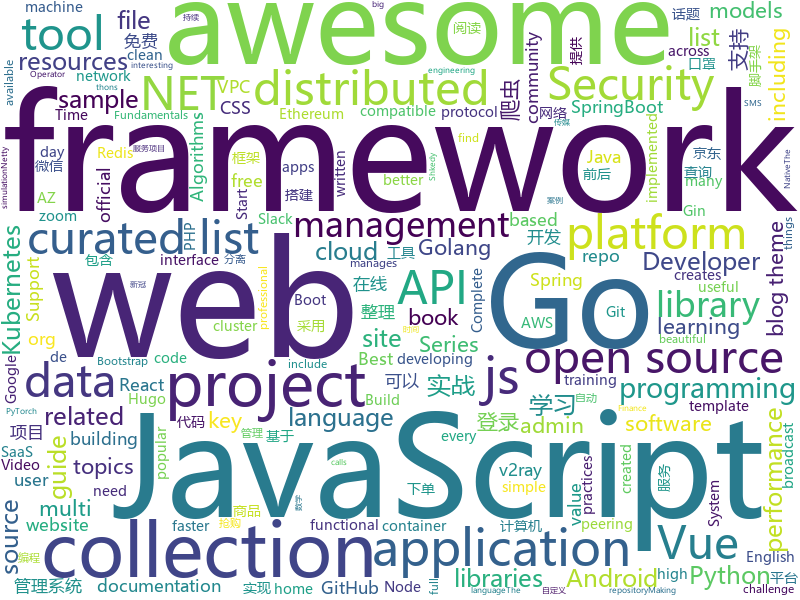

# 2020-02-06
See what the GitHub community is most excited about today.

## python
* [Python](https://github.com/TheAlgorithms/Python)(**97 stars today**): All Algorithms implemented in Python
* [spleeter](https://github.com/deezer/spleeter)(**78 stars today**): Deezer source separation library including pretrained models.
* [CheatSheetSeries](https://github.com/OWASP/CheatSheetSeries)(**20 stars today**): The OWASP Cheat Sheet Series was created to provide a concise collection of high value information on specific application security topics.
* [jd-assistant](https://github.com/tychxn/jd-assistant)(**109 stars today**): 京东抢购助手：包含登录，查询商品库存/价格，添加/清空购物车，抢购商品(下单)，查询订单等功能
* [PayloadsAllTheThings](https://github.com/swisskyrepo/PayloadsAllTheThings)(**27 stars today**): A list of useful payloads and bypass for Web Application Security and Pentest/CTF
* [DAIN](https://github.com/baowenbo/DAIN)(**98 stars today**): Depth-Aware Video Frame Interpolation (CVPR 2019)
* [django](https://github.com/django/django)(**30 stars today**): The Web framework for perfectionists with deadlines.
* [zhao](https://github.com/programthink/zhao)(**9 stars today**): 【编程随想】整理的《太子党关系网络》，专门揭露赵国的权贵
* [cpython](https://github.com/python/cpython)(**26 stars today**): The Python programming language
* [jdBuyMask](https://github.com/cycz/jdBuyMask)(**74 stars today**): 京东监控口罩有货爬虫，自动下单爬虫，口罩爬虫
* [atspy](https://github.com/firmai/atspy)(**27 stars today**): Python's Best Automated Time Series Models (AtsPy)
* [dongbei](https://github.com/zhanyong-wan/dongbei)(**189 stars today**): 东北方言编程语言
* [codinginterviewbook](https://github.com/tamim/codinginterviewbook)(**22 stars today**): কোডিং ইন্টারভিউ বইতে আলোচিত সমস্যাগুলোর সমাধান।
* [CMPEDUDownload](https://github.com/Echowxsy/CMPEDUDownload)(**64 stars today**): 机械工业出版社PDF下载器
* [AerialDetection](https://github.com/dingjiansw101/AerialDetection)(**30 stars today**): 
* [horovod](https://github.com/horovod/horovod)(**14 stars today**): Distributed training framework for TensorFlow, Keras, PyTorch, and Apache MXNet.
* [erpnext](https://github.com/frappe/erpnext)(**14 stars today**): Open Source Alternative to SAP
* [mlflow](https://github.com/mlflow/mlflow)(**14 stars today**): Open source platform for the machine learning lifecycle
* [ZeroNet](https://github.com/HelloZeroNet/ZeroNet)(**10 stars today**): ZeroNet - Decentralized websites using Bitcoin crypto and BitTorrent network
* [peerd](https://github.com/atlassian-labs/peerd)(**45 stars today**): peerd is an AWS VPC Peering Connection management tool. It creates full-meshes of VPCs from a yaml file, and manages the full lifecycle of creation, deletion and route table updates needed to make VPC peerings useful across accounts and regions. Contributions welcome.
* [container.training](https://github.com/jpetazzo/container.training)(**7 stars today**): Slides and code samples for training, tutorials, and workshops about containers.
* [hosts](https://github.com/StevenBlack/hosts)(**45 stars today**): Extending and consolidating hosts files from several well-curated sources like adaway.org, mvps.org, malwaredomainlist.com, someonewhocares.org, and potentially others. You can optionally invoke extensions to block additional sites by category.
* [paramiko](https://github.com/paramiko/paramiko)(**5 stars today**): The leading native Python SSHv2 protocol library.
* [tinder-swipe-ai](https://github.com/pierre-andre-long/tinder-swipe-ai)(**7 stars today**): 
* [localstack](https://github.com/localstack/localstack)(**27 stars today**): 💻A fully functional local AWS cloud stack. Develop and test your cloud & Serverless apps offline!

## java
* [VirusBroadcast](https://github.com/KikiLetGo/VirusBroadcast)(**247 stars today**): A java virus broadcast simulation
* [netty](https://github.com/netty/netty)(**12 stars today**): Netty project - an event-driven asynchronous network application framework
* [Algorithms](https://github.com/williamfiset/Algorithms)(**123 stars today**): A collection of algorithms and data structures
* [hadoop](https://github.com/apache/hadoop)(**8 stars today**): Apache Hadoop
* [java-design-patterns](https://github.com/iluwatar/java-design-patterns)(**22 stars today**): Design patterns implemented in Java
* [Interview-Questions](https://github.com/rishabh115/Interview-Questions)(**8 stars today**): Most comprehensive list📋of tech interview questions📘of companies scraped from Geeksforgeeks, CareerCup and Glassdoor.
* [spring-boot](https://github.com/spring-projects/spring-boot)(**27 stars today**): Spring Boot
* [zuihou-admin-cloud](https://github.com/zuihou/zuihou-admin-cloud)(**12 stars today**): 基于SpringCloud(Hoxton.SR1) + SpringBoot(2.2.2.RELEASE) 的SaaS 微服务脚手架，具有统一授权、认证后台管理系统，其中包含具备用户管理、资源权限管理、网关API、分布式事务、大文件断点分片续传等多个模块，支持多业务系统并行开发，可以作为后端服务的开发脚手架。代码简洁，架构清晰，适合学习和直接项目中使用。核心技术采用Nacos、Fegin、Ribbon、Zuul、Hystrix、JWT Token、Mybatis、SpringBoot、Redis、RibbitMQ等主要框架和中间件。
* [vhr](https://github.com/lenve/vhr)(**19 stars today**): 微人事是一个前后端分离的人力资源管理系统，项目采用SpringBoot+Vue开发。
* [lottie-android](https://github.com/airbnb/lottie-android)(**12 stars today**): Render After Effects animations natively on Android and iOS, Web, and React Native
* [presto](https://github.com/prestodb/presto)(**29 stars today**): The official home of the Presto distributed SQL query engine for big data
* [building-modular-monoliths-using-spring](https://github.com/arawn/building-modular-monoliths-using-spring)(**8 stars today**): 스프링을 기반으로 모듈형 모노리스를 만들기 위한 방안을 공유합니다.
* [Auto.js](https://github.com/hyb1996/Auto.js)(**9 stars today**): A UiAutomator on android, does not need root access(安卓平台上的JavaScript自动化工具)
* [user-interface-samples](https://github.com/android/user-interface-samples)(**5 stars today**): Multiple samples showing the best practices in the user interface on Android.
* [MyBookshelf](https://github.com/gedoor/MyBookshelf)(**13 stars today**): 阅读是一款可以自定义来源阅读网络内容的工具，为广大网络文学爱好者提供一种方便、快捷舒适的试读体验。
* [ballerina-lang](https://github.com/ballerina-platform/ballerina-lang)(**4 stars today**): The Ballerina Programming Language
* [netbeans](https://github.com/apache/netbeans)(**4 stars today**): Apache NetBeans
* [quickstart-android](https://github.com/firebase/quickstart-android)(**5 stars today**): Firebase Quickstart Samples for Android
* [grpc-java](https://github.com/grpc/grpc-java)(**7 stars today**): The Java gRPC implementation. HTTP/2 based RPC
* [pulsar](https://github.com/apache/pulsar)(**11 stars today**): Apache Pulsar - distributed pub-sub messaging system
* [eclipse-collections](https://github.com/eclipse/eclipse-collections)(**7 stars today**): Eclipse Collections is a collections framework for Java with optimized data structures and a rich, functional and fluent API.
* [paascloud-master](https://github.com/paascloud/paascloud-master)(**8 stars today**): spring cloud + vue + oAuth2.0全家桶实战，前后端分离模拟商城，完整的购物流程、后端运营平台，可以实现快速搭建企业级微服务项目。支持微信登录等三方登录。
* [skywalking](https://github.com/apache/skywalking)(**10 stars today**): APM, Application Performance Monitoring System
* [leave-sample](https://github.com/ouchuangxin/leave-sample)(**2 stars today**): 本代码来源于极客时间《DDD实战》专栏。
* [graylog2-server](https://github.com/Graylog2/graylog2-server)(**3 stars today**): Free and open source log management

## unknown
* [nCovMemory](https://github.com/2019ncovmemory/nCovMemory)(**304 stars today**): 2020新冠肺炎记忆：传媒报道与非虚构写作（持续更新）
* [31-days-of-API-Security-Tips](https://github.com/smodnix/31-days-of-API-Security-Tips)(**58 stars today**): This challenge is Inon Shkedy's 31 days API Security Tips.
* [howto-make-more-money](https://github.com/easychen/howto-make-more-money)(**116 stars today**): 程序员如何优雅的挣零花钱。Most of this not work outside China , so no English translate, sorry
* [awesome-dotnet](https://github.com/quozd/awesome-dotnet)(**12 stars today**): A collection of awesome .NET libraries, tools, frameworks and software
* [Ai-learn](https://github.com/tangyudi/Ai-learn)(**85 stars today**): 人工智能学习路线图，整理近200个实战案例与项目，免费提供配套教材，零基础入门，就业实战！包括：Python，数学，机器学习，数据分析，深度学习，计算机视觉，自然语言处理等热门领域
* [free-programming-books-zh_CN](https://github.com/justjavac/free-programming-books-zh_CN)(**28 stars today**): 📚免费的计算机编程类中文书籍，欢迎投稿
* [awesome-gcp-certifications](https://github.com/sathishvj/awesome-gcp-certifications)(**17 stars today**): Google Cloud Platform Certification resources.
* [awesome-php](https://github.com/ziadoz/awesome-php)(**12 stars today**): A curated list of amazingly awesome PHP libraries, resources and shiny things.
* [You-Dont-Know-JS](https://github.com/getify/You-Dont-Know-JS)(**181 stars today**): A book series on JavaScript. @YDKJS on twitter.
* [new-pac](https://github.com/Alvin9999/new-pac)(**104 stars today**): 科学/自由上网，免费ss/ssr/v2ray/goflyway账号，搭建教程
* [ethereum-developer-tools-list](https://github.com/ConsenSys/ethereum-developer-tools-list)(**3 stars today**): A guide to available tools and platforms for developing on Ethereum.
* [awesome-vue](https://github.com/vuejs/awesome-vue)(**39 stars today**): 🎉A curated list of awesome things related to Vue.js
* [awesome](https://github.com/sindresorhus/awesome)(**85 stars today**): 😎Awesome lists about all kinds of interesting topics
* [portuguese-bert](https://github.com/neuralmind-ai/portuguese-bert)(**12 stars today**): Portuguese pre-trained BERT models
* [game-hacking](https://github.com/dsasmblr/game-hacking)(**5 stars today**): Tutorials, tools, and more as related to reverse engineering video games.
* [awesome-cli-apps](https://github.com/agarrharr/awesome-cli-apps)(**47 stars today**): 🖥📊🕹🛠A curated list of command line apps
* [MIT-Linear-Algebra-Notes](https://github.com/yizhen20133868/MIT-Linear-Algebra-Notes)(**16 stars today**): Notes for MIT-Linear-Algebra
* [AZ-900T0x-MicrosoftAzureFundamentals](https://github.com/MicrosoftLearning/AZ-900T0x-MicrosoftAzureFundamentals)(**5 stars today**): Microsoft Azure Fundamentals - AZ-900T00 and AZ-900T01
* [study-resource](https://github.com/PythonShell/study-resource)(**26 stars today**): Keep track of E-learning resources
* [awesome-quant](https://github.com/wilsonfreitas/awesome-quant)(**10 stars today**): A curated list of insanely awesome libraries, packages and resources for Quants (Quantitative Finance)
* [SS-Rule-Snippet](https://github.com/Hackl0us/SS-Rule-Snippet)(**20 stars today**): 搜集、整理、维护 Surge / Quantumult / Shadowrocket / Surfboard / clash(X) 实用规则。
* [OpenWrt-CI](https://github.com/KFERMercer/OpenWrt-CI)(**9 stars today**): OpenWrt CI 在线集成自动编译环境
* [android_guides](https://github.com/codepath/android_guides)(**10 stars today**): Extensive Open-Source Guides for Android Developers
* [awesome-nestjs](https://github.com/juliandavidmr/awesome-nestjs)(**10 stars today**): 😏Curated list of NestJS
* [AspNetCore-Developer-Roadmap](https://github.com/MoienTajik/AspNetCore-Developer-Roadmap)(**12 stars today**): Roadmap to becoming an ASP.NET Core developer in 2019

## javascript
* [vanillawebprojects](https://github.com/bradtraversy/vanillawebprojects)(**514 stars today**): Mini projects built with HTML5, CSS & JavaScript. No frameworks or libraries
* [vue](https://github.com/vuejs/vue)(**64 stars today**): 🖖Vue.js is a progressive, incrementally-adoptable JavaScript framework for building UI on the web.
* [bootstrap](https://github.com/twbs/bootstrap)(**36 stars today**): The most popular HTML, CSS, and JavaScript framework for developing responsive, mobile first projects on the web.
* [react](https://github.com/facebook/react)(**65 stars today**): A declarative, efficient, and flexible JavaScript library for building user interfaces.
* [javascript](https://github.com/airbnb/javascript)(**48 stars today**): JavaScript Style Guide
* [curso-javascript-ninja](https://github.com/da2k/curso-javascript-ninja)(**2 stars today**): Curso Javascript Ninja
* [atom](https://github.com/atom/atom)(**22 stars today**): The hackable text editor
* [html5-boilerplate](https://github.com/h5bp/html5-boilerplate)(**8 stars today**): A professional front-end template for building fast, robust, and adaptable web apps or sites.
* [js.org](https://github.com/js-org/js.org)(**15 stars today**): Dedicated to JavaScript and its awesome community since 2015
* [openlayers](https://github.com/openlayers/openlayers)(**28 stars today**): OpenLayers
* [materialize](https://github.com/Dogfalo/materialize)(**11 stars today**): Materialize, a CSS Framework based on Material Design
* [react-datepicker](https://github.com/Hacker0x01/react-datepicker)(**23 stars today**): A simple and reusable datepicker component for React
* [MQTT.js](https://github.com/mqttjs/MQTT.js)(**4 stars today**): The MQTT client for Node.js and the browser
* [micro-frontends](https://github.com/neuland/micro-frontends)(**5 stars today**): extending the microservice paradigms to web development
* [stackedit](https://github.com/benweet/stackedit)(**9 stars today**): In-browser Markdown editor
* [vuejs.org](https://github.com/vuejs/vuejs.org)(**3 stars today**): 📄The official documentation site for Vue.js.
* [design-reviews](https://github.com/w3ctag/design-reviews)(**15 stars today**): W3C specs and API reviews
* [Inputmask](https://github.com/RobinHerbots/Inputmask)(**7 stars today**): Input Mask plugin
* [grokking_algorithms](https://github.com/egonSchiele/grokking_algorithms)(**7 stars today**): Code for the book Grokking Algorithms (https://amzn.to/29rVyHf)
* [next.js](https://github.com/zeit/next.js)(**49 stars today**): The React Framework
* [awesome-cheatsheets](https://github.com/LeCoupa/awesome-cheatsheets)(**13 stars today**): 👩‍💻👨‍💻Awesome cheatsheets for popular programming languages, frameworks and development tools. They include everything you should know in one single file.
* [discord.js](https://github.com/discordjs/discord.js)(**7 stars today**): A powerful JavaScript library for interacting with the Discord API
* [generator-jhipster](https://github.com/jhipster/generator-jhipster)(**13 stars today**): Open Source application platform for creating Spring Boot + Angular/React projects in seconds!
* [Ghost](https://github.com/TryGhost/Ghost)(**19 stars today**): 👻The #1 headless Node.js CMS for professional publishing
* [AnotherRedisDesktopManager](https://github.com/qishibo/AnotherRedisDesktopManager)(**11 stars today**): 🚀🚀🚀A faster, better and more stable redis desktop manager, compatible with Linux, windows, mac. What's more, it won't crash when loading a large number of keys.

## html
* [hyperblog](https://github.com/freddier/hyperblog)(**9 stars today**): Un blog increíble para el curso de Git y Github de Platzi
* [WhatTheHack](https://github.com/microsoft/WhatTheHack)(**8 stars today**): A collection of challenge based hack-a-thons including student guide, proctor guide, lecture presentations, sample/instructional code and templates.
* [keep-a-changelog](https://github.com/olivierlacan/keep-a-changelog)(**5 stars today**): If you build software, keep a changelog.
* [LoveIt](https://github.com/dillonzq/LoveIt)(**7 stars today**): 🚀A clean, elegant but advanced blog theme for Hugo
* [v2-ui](https://github.com/sprov065/v2-ui)(**9 stars today**): 支持多协议多用户的 v2ray 面板，Support multi-protocol multi-user v2ray panel
* [EIPs](https://github.com/ethereum/EIPs)(**2 stars today**): The Ethereum Improvement Proposal repository
* [portainer](https://github.com/portainer/portainer)(**13 stars today**): Making Docker management easy.
* [kubernetes-failure-stories](https://github.com/hjacobs/kubernetes-failure-stories)(**8 stars today**): Compilation of public failure/horror stories related to Kubernetes
* [complete-web-developer-manual](https://github.com/zero-to-mastery/complete-web-developer-manual)(**3 stars today**): All resources and notes from the Complete Web Developer in 2018: Zero to Mastery course
* [concept](https://github.com/puikinsh/concept)(**3 stars today**): Free Bootstrap 4 admin dashboard template
* [fonts](https://github.com/google/fonts)(**5 stars today**): Font files available from Google Fonts
* [beautiful-jekyll](https://github.com/daattali/beautiful-jekyll)(**4 stars today**): ✨Build a beautiful and simple website in literally minutes. Demo at http://deanattali.com/beautiful-jekyll
* [startbootstrap-clean-blog-jekyll](https://github.com/BlackrockDigital/startbootstrap-clean-blog-jekyll)(**2 stars today**): A Jekyll version of the Clean Blog theme by Start Bootstrap
* [website](https://github.com/kubernetes/website)(**1 stars today**): Kubernetes website and documentation repo:
* [hugo-coder](https://github.com/luizdepra/hugo-coder)(**3 stars today**): A minimalist blog theme for hugo.
* [Web-Security-Learning](https://github.com/CHYbeta/Web-Security-Learning)(**2 stars today**): Web-Security-Learning
* [dataviz](https://github.com/clauswilke/dataviz)(**3 stars today**): A book covering the fundamentals of data visualization
* [doc-en](https://github.com/php/doc-en)(**9 stars today**): Experimental Git mirror of the English PHP documentation repository. Accepts pull requests. May be force-pushed in the future.
* [WebFundamentals](https://github.com/google/WebFundamentals)(**2 stars today**): Best practices for modern web development
* [curso-docker](https://github.com/cod3rcursos/curso-docker)(**0 stars today**): 
* [dotnet](https://github.com/microsoft/dotnet)(**3 stars today**): This repo is the official home of .NET on GitHub. It's a great starting point to find many .NET OSS projects from Microsoft and the community, including many that are part of the .NET Foundation.
* [free-for-dev](https://github.com/ripienaar/free-for-dev)(**30 stars today**): A list of SaaS, PaaS and IaaS offerings that have free tiers of interest to devops and infradev
* [twofactorauth](https://github.com/2factorauth/twofactorauth)(**2 stars today**): List of sites with two factor auth support which includes SMS, email, phone calls, hardware, and software.
* [startbootstrap-sb-admin](https://github.com/BlackrockDigital/startbootstrap-sb-admin)(**5 stars today**): A free, open source, Bootstrap admin theme created by Start Bootstrap
* [Dism-Multi-language](https://github.com/Chuyu-Team/Dism-Multi-language)(**5 stars today**): Dism++ Multi-language Support & BUG Report

## go
* [fiber](https://github.com/gofiber/fiber)(**60 stars today**): 🚀Fiber is an Express.js inspired web framework written in Go🐿️
* [shhgit](https://github.com/eth0izzle/shhgit)(**20 stars today**): Ah shhgit! Find GitHub secrets in real time
* [charts](https://github.com/helm/charts)(**24 stars today**): Curated applications for Kubernetes
* [dgraph](https://github.com/dgraph-io/dgraph)(**14 stars today**): Fast, Distributed Graph DB
* [prometheus-operator](https://github.com/coreos/prometheus-operator)(**7 stars today**): Prometheus Operator creates/configures/manages Prometheus clusters atop Kubernetes
* [minio](https://github.com/minio/minio)(**20 stars today**): MinIO is a high performance object storage server compatible with Amazon S3 APIs
* [rook](https://github.com/rook/rook)(**12 stars today**): Storage Orchestration for Kubernetes
* [origin](https://github.com/openshift/origin)(**10 stars today**): The self-managing, auto-upgrading, Kubernetes distribution for everyone
* [etcd](https://github.com/etcd-io/etcd)(**24 stars today**): Distributed reliable key-value store for the most critical data of a distributed system
* [night-reading-go](https://github.com/developer-learning/night-reading-go)(**16 stars today**): Night-Reading-Go《Go 夜读》 > Share the related technical topics of Go every week through zoom online live broadcast, every day on the WeChat/Slack to communicate programming technology topics. 每周通过 zoom 在线直播的方式分享 Go 相关的技术话题，每天大家在微信/Slack 上及时沟通交流编程技术话题。
* [deviceplane](https://github.com/deviceplane/deviceplane)(**12 stars today**): Open source device management for embedded systems and edge computing
* [badger](https://github.com/dgraph-io/badger)(**6 stars today**): Fast key-value DB in Go.
* [gin](https://github.com/gin-gonic/gin)(**32 stars today**): Gin is a HTTP web framework written in Go (Golang). It features a Martini-like API with much better performance -- up to 40 times faster. If you need smashing performance, get yourself some Gin.
* [flamingo](https://github.com/atredispartners/flamingo)(**18 stars today**): Flamingo captures credentials sprayed across the network by various IT and security products.
* [rancher](https://github.com/rancher/rancher)(**10 stars today**): Complete container management platform
* [go](https://github.com/golang/go)(**55 stars today**): The Go programming language
* [gorm](https://github.com/jinzhu/gorm)(**27 stars today**): The fantastic ORM library for Golang, aims to be developer friendly
* [enhancements](https://github.com/kubernetes/enhancements)(**2 stars today**): Features tracking repo for Kubernetes releases
* [crawlab](https://github.com/crawlab-team/crawlab)(**25 stars today**): Distributed web crawler admin platform for spiders management regardless of languages and frameworks.
* [mindoc](https://github.com/lifei6671/mindoc)(**3 stars today**): Golang实现的基于beego框架的接口在线文档管理系统
* [cortex](https://github.com/cortexlabs/cortex)(**33 stars today**): Deploy machine learning models in production
* [sloop](https://github.com/salesforce/sloop)(**6 stars today**): Kubernetes History Visualization
* [community](https://github.com/kubernetes/community)(**7 stars today**): Kubernetes community content
* [test-infra](https://github.com/kubernetes/test-infra)(**3 stars today**): Test infrastructure for the Kubernetes project.
* [kubefed](https://github.com/kubernetes-sigs/kubefed)(**4 stars today**): Kubernetes Cluster Federation

## WordCloud

