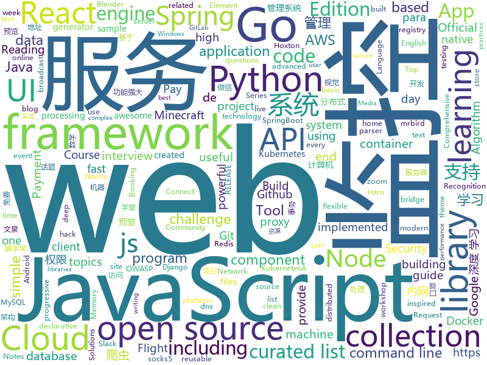

# 2020-02-07
See what the GitHub community is most excited about today.

## python
* [pytorch3d](https://github.com/facebookresearch/pytorch3d)(**329 stars today**): PyTorch3D is FAIR's library of reusable components for deep learning with 3D data
* [dongbei](https://github.com/zhanyong-wan/dongbei)(**222 stars today**): 东北方言编程语言
* [Python](https://github.com/TheAlgorithms/Python)(**105 stars today**): All Algorithms implemented in Python
* [DAIN](https://github.com/baowenbo/DAIN)(**96 stars today**): Depth-Aware Video Frame Interpolation (CVPR 2019)
* [PayloadsAllTheThings](https://github.com/swisskyrepo/PayloadsAllTheThings)(**79 stars today**): A list of useful payloads and bypass for Web Application Security and Pentest/CTF
* [wqxuetang_downloader](https://github.com/kajweb/wqxuetang_downloader)(**36 stars today**): 文泉学堂、悦读 下载器 2020-02-07 01:01 测试正常
* [odoo](https://github.com/odoo/odoo)(**9 stars today**): Odoo. Open Source Apps To Grow Your Business.
* [jdBuyMask](https://github.com/cycz/jdBuyMask)(**79 stars today**): 京东监控口罩有货爬虫，自动下单爬虫，口罩爬虫
* [BlenderGIS](https://github.com/domlysz/BlenderGIS)(**34 stars today**): Blender addons to make the bridge between Blender and geographic data
* [meshrcnn](https://github.com/facebookresearch/meshrcnn)(**20 stars today**): code for Mesh R-CNN, an academic publication, presented at ICCV 2019
* [binwalk](https://github.com/ReFirmLabs/binwalk)(**174 stars today**): Firmware Analysis Tool
* [aws-serverless-airline-booking](https://github.com/aws-samples/aws-serverless-airline-booking)(**5 stars today**): Airline Booking is a complete web application that provides Flight Search, Flight Payment, Flight Booking and Loyalty points including end-to-end testing, GraphQL and CI/CD. This web application is the theme of Build on Serverless Season 2 on AWS Twitch running from April 24th until end of July.
* [spleeter](https://github.com/deezer/spleeter)(**37 stars today**): Deezer source separation library including pretrained models.
* [CheatSheetSeries](https://github.com/OWASP/CheatSheetSeries)(**66 stars today**): The OWASP Cheat Sheet Series was created to provide a concise collection of high value information on specific application security topics.
* [hydra](https://github.com/facebookresearch/hydra)(**46 stars today**): Hydra is a framework for elegantly configuring complex applications
* [LASER](https://github.com/facebookresearch/LASER)(**19 stars today**): Language-Agnostic SEntence Representations
* [data-science-from-scratch](https://github.com/joelgrus/data-science-from-scratch)(**4 stars today**): code for Data Science From Scratch book
* [awesome-python](https://github.com/vinta/awesome-python)(**49 stars today**): A curated list of awesome Python frameworks, libraries, software and resources
* [Minecraft](https://github.com/fogleman/Minecraft)(**4 stars today**): Simple Minecraft-inspired program using Python and Pyglet
* [vardbg](https://github.com/CCExtractor/vardbg)(**26 stars today**): A simple Python debugger and profiler that generates animated visualizations of program flow, useful for algorithm learning.
* [codinginterviewbook](https://github.com/tamim/codinginterviewbook)(**14 stars today**): কোডিং ইন্টারভিউ বইতে আলোচিত সমস্যাগুলোর সমাধান।
* [container.training](https://github.com/jpetazzo/container.training)(**7 stars today**): Slides and code samples for training, tutorials, and workshops about containers.
* [django](https://github.com/django/django)(**32 stars today**): The Web framework for perfectionists with deadlines.
* [mlflow](https://github.com/mlflow/mlflow)(**11 stars today**): Open source platform for the machine learning lifecycle
* [devops-exercises](https://github.com/bregman-arie/devops-exercises)(**26 stars today**): Linux, Jenkins, AWS, SRE, Prometheus, Docker, Python, Ansible, Git, Kubernetes, Terraform, OpenStack, SQL, NoSQL, Azure, GCP, DNS, Elastic, Network, Virtualization

## java
* [VirusBroadcast](https://github.com/KikiLetGo/VirusBroadcast)(**241 stars today**): A java virus broadcast simulation
* [Java](https://github.com/TheAlgorithms/Java)(**14 stars today**): All Algorithms implemented in Java
* [zalenium](https://github.com/zalando/zalenium)(**5 stars today**): A flexible and scalable container based Selenium Grid with video recording, live preview, basic auth & dashboard.
* [zuihou-admin-cloud](https://github.com/zuihou/zuihou-admin-cloud)(**14 stars today**): 基于SpringCloud(Hoxton.SR1) + SpringBoot(2.2.2.RELEASE) 的SaaS 微服务脚手架，具有统一授权、认证后台管理系统，其中包含具备用户管理、资源权限管理、网关API、分布式事务、大文件断点分片续传等多个模块，支持多业务系统并行开发，可以作为后端服务的开发脚手架。代码简洁，架构清晰，适合学习和直接项目中使用。核心技术采用Nacos、Fegin、Ribbon、Zuul、Hystrix、JWT Token、Mybatis、SpringBoot、Redis、RibbitMQ等主要框架和中间件。
* [drools](https://github.com/kiegroup/drools)(**5 stars today**): Drools is a rule engine, DMN engine and complex event processing (CEP) engine for Java.
* [Interview-Questions](https://github.com/rishabh115/Interview-Questions)(**26 stars today**): Most comprehensive list📋of tech interview questions📘of companies scraped from Geeksforgeeks, CareerCup and Glassdoor.
* [react-native-image-picker](https://github.com/react-native-community/react-native-image-picker)(**9 stars today**): 🌄A React Native module that allows you to use native UI to select media from the device library or directly from the camera.
* [antlr4](https://github.com/antlr/antlr4)(**6 stars today**): ANTLR (ANother Tool for Language Recognition) is a powerful parser generator for reading, processing, executing, or translating structured text or binary files.
* [spring-petclinic](https://github.com/spring-projects/spring-petclinic)(**6 stars today**): A sample Spring-based application
* [jenkins](https://github.com/jenkinsci/jenkins)(**9 stars today**): Jenkins automation server
* [Geyser](https://github.com/GeyserMC/Geyser)(**5 stars today**): A bridge/proxy allowing you to connect to Minecraft: Java Edition servers with Minecraft: Bedrock edition.
* [wgcloud](https://github.com/tianshiyeben/wgcloud)(**4 stars today**): linux开源服务器监控解决方案，微服务分布式架构，支持内存，cpu，磁盘，系统负载，进程等系统指标监控，心跳检测
* [interviews](https://github.com/kdn251/interviews)(**56 stars today**): Everything you need to know to get the job.
* [wqxuetang-pdf-downloader](https://github.com/SweetInk/wqxuetang-pdf-downloader)(**7 stars today**): 文泉学堂PDF下载器
* [Android-SpinKit](https://github.com/ybq/Android-SpinKit)(**4 stars today**): Android loading animations
* [presto](https://github.com/prestodb/presto)(**16 stars today**): The official home of the Presto distributed SQL query engine for big data
* [Orient-Ui](https://github.com/mCyp/Orient-Ui)(**7 stars today**): 🍉Orient-Ui is a Android Ui Library~
* [fastjson](https://github.com/alibaba/fastjson)(**4 stars today**): A fast JSON parser/generator for Java.
* [FEBS-Shiro](https://github.com/wuyouzhuguli/FEBS-Shiro)(**4 stars today**): Spring Boot 2.2.1，Shiro1.4.2 & Layui 2.5.5 权限管理系统。预览地址：https://shiro.mrbird.cn:8080
* [schema-registry](https://github.com/confluentinc/schema-registry)(**2 stars today**): Confluent Schema Registry for Kafka
* [EdXposed](https://github.com/ElderDrivers/EdXposed)(**6 stars today**): Elder driver Xposed Framework.
* [FEBS-Cloud](https://github.com/wuyouzhuguli/FEBS-Cloud)(**4 stars today**): 基于Spring Cloud Hoxton.RELEASE、Spring Cloud OAuth2 & Spring Cloud Alibaba & Element 构建的微服务权限管理系统。系统特点：前后端分离、认证/资源服务器分离、RBAC模型、第三方账号登录、多维度监控（Prometheus APM：Docker容器监控，MySQL监控、微服务JVM监控、Redis监控）、服务预警（邮件预警，企业微信预警）、Skywalking服务追踪、ELK日志系统、Nacos集中管理配置和服务、Sentinel流控、动态Client管理、支持多种格式令牌、K8S部署、分布式事务、注解驱动、代码生成、Excel导入导出等。预览地址：https://cloud.mrbird.cn
* [incubator-shardingsphere](https://github.com/apache/incubator-shardingsphere)(**6 stars today**): Distributed database middleware
* [hibernate-orm](https://github.com/hibernate/hibernate-orm)(**3 stars today**): Hibernate's core Object/Relational Mapping functionality
* [java-design-patterns](https://github.com/iluwatar/java-design-patterns)(**34 stars today**): Design patterns implemented in Java

## unknown
* [nCovMemory](https://github.com/2019ncovmemory/nCovMemory)(**2,078 stars today**): 2020新冠肺炎记忆：传媒报道与非虚构写作（持续更新）Memory of 2020 nCov: Media reports and Non-fiction Writings (Continuously updating)
* [build-your-own-x](https://github.com/danistefanovic/build-your-own-x)(**61 stars today**): 🤓Build your own (insert technology here)
* [31-days-of-API-Security-Tips](https://github.com/smodnix/31-days-of-API-Security-Tips)(**66 stars today**): This challenge is Inon Shkedy's 31 days API Security Tips.
* [SoftwareArchitect](https://github.com/justinamiller/SoftwareArchitect)(**96 stars today**): Path to a Software Architect
* [frontend-challenges](https://github.com/felipefialho/frontend-challenges)(**33 stars today**): 💥Listing some playful open-source's challenges of jobs to test your knowledge
* [awesome-cli-apps](https://github.com/agarrharr/awesome-cli-apps)(**23 stars today**): 🖥📊🕹🛠A curated list of command line apps
* [portuguese-bert](https://github.com/neuralmind-ai/portuguese-bert)(**18 stars today**): Portuguese pre-trained BERT models
* [laravel-best-practices](https://github.com/alexeymezenin/laravel-best-practices)(**15 stars today**): Laravel best practices
* [Ai-learn](https://github.com/tangyudi/Ai-learn)(**69 stars today**): 人工智能学习路线图，整理近200个实战案例与项目，免费提供配套教材，零基础入门，就业实战！包括：Python，数学，机器学习，数据分析，深度学习，计算机视觉，自然语言处理等热门领域
* [Profiles](https://github.com/ConnersHua/Profiles)(**22 stars today**): 
* [howto-make-more-money](https://github.com/easychen/howto-make-more-money)(**153 stars today**): 程序员如何优雅的挣零花钱。Most of this not work outside China , so no English translate, sorry
* [ReadMeTemplate](https://github.com/roshanlam/ReadMeTemplate)(**31 stars today**): Done with your project but having a hard time writing a ReadMe? Check This Repo I created. If you like it then use it
* [flutter_vignettes](https://github.com/gskinnerTeam/flutter_vignettes)(**13 stars today**): A collection of fun Flutter experiments, created by gskinner, in partnership with Google.
* [Beginner-Network-Pentesting](https://github.com/hmaverickadams/Beginner-Network-Pentesting)(**7 stars today**): Notes for Beginner Network Pentesting Course
* [vagas](https://github.com/backend-br/vagas)(**10 stars today**): ✌️Espaço para divulgação de vagas para backenders
* [awesome-production-machine-learning](https://github.com/EthicalML/awesome-production-machine-learning)(**12 stars today**): A curated list of awesome open source libraries to deploy, monitor, version and scale your machine learning
* [Java-Interview](https://github.com/gzc426/Java-Interview)(**7 stars today**): Java 面试必会 直通BAT
* [javascript-testing-best-practices](https://github.com/goldbergyoni/javascript-testing-best-practices)(**15 stars today**): 📗🌐🚢Comprehensive and exhaustive JavaScript & Node.js testing best practices (January 2020)
* [free-programming-books-zh_CN](https://github.com/justjavac/free-programming-books-zh_CN)(**38 stars today**): 📚免费的计算机编程类中文书籍，欢迎投稿
* [intellij-community](https://github.com/JetBrains/intellij-community)(**11 stars today**): IntelliJ IDEA Community Edition
* [Deep-Learning-Interview-Book](https://github.com/amusi/Deep-Learning-Interview-Book)(**11 stars today**): 深度学习面试宝典（含数学、机器学习、深度学习、计算机视觉、自然语言处理和SLAM等方向）
* [db-readings](https://github.com/rxin/db-readings)(**5 stars today**): Readings in Databases
* [dl_in_nlp_deeppavlov_cs224n_spring2020](https://github.com/Yorko/dl_in_nlp_deeppavlov_cs224n_spring2020)(**7 stars today**): "Deep Learning in Natural Language Processing" - a course by DeepPavlov built on top of Stanford's cs224n
* [awesome-action-recognition](https://github.com/jinwchoi/awesome-action-recognition)(**6 stars today**): A curated list of action recognition and related area resources
* [the-art-of-command-line](https://github.com/jlevy/the-art-of-command-line)(**38 stars today**): Master the command line, in one page

## javascript
* [ai-lab](https://github.com/NVAITC/ai-lab)(**41 stars today**): All-in-one AI container for rapid prototyping
* [javascript](https://github.com/airbnb/javascript)(**51 stars today**): JavaScript Style Guide
* [create-react-app](https://github.com/facebook/create-react-app)(**38 stars today**): Set up a modern web app by running one command.
* [esercizi-di-programmazione-javascript](https://github.com/AlbertoOlla/esercizi-di-programmazione-javascript)(**2 stars today**): Esercizi di informatica! Impara a programmare, metti alla prova!
* [js.org](https://github.com/js-org/js.org)(**10 stars today**): Dedicated to JavaScript and its awesome community since 2015
* [next.js](https://github.com/zeit/next.js)(**40 stars today**): The React Framework
* [auto-py-to-exe](https://github.com/brentvollebregt/auto-py-to-exe)(**2 stars today**): Converts .py to .exe using a simple graphical interface
* [workshop-material](https://github.com/peterj/workshop-material)(**26 stars today**): Material for Kubernetes and Istio workshop https://learnistio.com
* [LogonTracer](https://github.com/JPCERTCC/LogonTracer)(**14 stars today**): Investigate malicious Windows logon by visualizing and analyzing Windows event log
* [react](https://github.com/facebook/react)(**72 stars today**): A declarative, efficient, and flexible JavaScript library for building user interfaces.
* [x-spreadsheet](https://github.com/myliang/x-spreadsheet)(**10 stars today**): A web-based JavaScript（canvas） spreadsheet
* [phonegap-app-developer](https://github.com/phonegap/phonegap-app-developer)(**6 stars today**): PhoneGap Developer App
* [vue](https://github.com/vuejs/vue)(**66 stars today**): 🖖Vue.js is a progressive, incrementally-adoptable JavaScript framework for building UI on the web.
* [gulp](https://github.com/gulpjs/gulp)(**5 stars today**): The streaming build system
* [MikuTools](https://github.com/Ice-Hazymoon/MikuTools)(**5 stars today**): 一个轻量的工具集合
* [react-static](https://github.com/react-static/react-static)(**7 stars today**): ⚛️🚀A progressive static site generator for React.
* [react-redux](https://github.com/reduxjs/react-redux)(**9 stars today**): Official React bindings for Redux
* [clean-code-javascript](https://github.com/ryanmcdermott/clean-code-javascript)(**70 stars today**): 🛁Clean Code concepts adapted for JavaScript
* [realworld](https://github.com/gothinkster/realworld)(**64 stars today**): "The mother of all demo apps" — Exemplary fullstack Medium.com clone powered by React, Angular, Node, Django, and many more🏅
* [react-datepicker](https://github.com/Hacker0x01/react-datepicker)(**34 stars today**): A simple and reusable datepicker component for React
* [stripe-payments-demo](https://github.com/stripe/stripe-payments-demo)(**4 stars today**): Sample store accepting universal payments on the web with Stripe Elements, Payment Request, Apple Pay, Google Pay, Microsoft Pay, and the PaymentIntents API.💳🌍✨
* [fastify](https://github.com/fastify/fastify)(**16 stars today**): Fast and low overhead web framework, for Node.js
* [web3.js](https://github.com/ethereum/web3.js)(**5 stars today**): Ethereum JavaScript API
* [vant](https://github.com/youzan/vant)(**16 stars today**): Lightweight Mobile UI Components built on Vue
* [WebGoat](https://github.com/WebGoat/WebGoat)(**3 stars today**): WebGoat 8.0

## html
* [WhatTheHack](https://github.com/microsoft/WhatTheHack)(**38 stars today**): A collection of challenge based hack-a-thons including student guide, proctor guide, lecture presentations, sample/instructional code and templates.
* [JavaScript30](https://github.com/wesbos/JavaScript30)(**9 stars today**): 30 Day Vanilla JS Challenge
* [LoveIt](https://github.com/dillonzq/LoveIt)(**9 stars today**): 🚀A clean, elegant but advanced blog theme for Hugo
* [home-assistant.io](https://github.com/home-assistant/home-assistant.io)(**4 stars today**): 📘Home Assistant User documentation
* [web-moderno](https://github.com/cod3rcursos/web-moderno)(**2 stars today**): 
* [wpt](https://github.com/web-platform-tests/wpt)(**1 stars today**): Test suites for Web platform specs — including WHATWG, W3C, and others
* [hyperblog](https://github.com/freddier/hyperblog)(**6 stars today**): Un blog increíble para el curso de Git y Github de Platzi
* [djangox](https://github.com/wsvincent/djangox)(**3 stars today**): A framework for launching new Django projects quickly.
* [css-grid](https://github.com/wesbos/css-grid)(**2 stars today**): Starter Files + Solutions to my CSSGrid.io Course
* [doc-en](https://github.com/php/doc-en)(**5 stars today**): Experimental Git mirror of the English PHP documentation repository. Accepts pull requests. May be force-pushed in the future.
* [py4e](https://github.com/csev/py4e)(**0 stars today**): Web site for www.py4e.com and source to the Python 3.0 textbook
* [zenbot](https://github.com/DeviaVir/zenbot)(**4 stars today**): Zenbot is a command-line cryptocurrency trading bot using Node.js and MongoDB.
* [MatBlazor](https://github.com/SamProf/MatBlazor)(**7 stars today**): Material Design components for Blazor and Razor Components
* [www-project-top-ten](https://github.com/OWASP/www-project-top-ten)(**4 stars today**): OWASP Foundation Web Respository
* [Markdown-Resume](https://github.com/CyC2018/Markdown-Resume)(**3 stars today**): ⭐️Markdown 简历模版
* [DevOps-Guide](https://github.com/Tikam02/DevOps-Guide)(**7 stars today**): DevOps Guide from basic to advanced with Interview Questions and Notes🔥
* [fastText](https://github.com/facebookresearch/fastText)(**8 stars today**): Library for fast text representation and classification.
* [intro-to-ml-tidy](https://github.com/rstudio-conf-2020/intro-to-ml-tidy)(**8 stars today**): Intro to Machine Learning with the Tidyverse
* [pcc_2e](https://github.com/ehmatthes/pcc_2e)(**3 stars today**): Online resources for Python Crash Course (Second Edition), from No Starch Press
* [tiny-helpers](https://github.com/stefanjudis/tiny-helpers)(**7 stars today**): A collection of useful online web development tools
* [ru.javascript.info](https://github.com/javascript-tutorial/ru.javascript.info)(**4 stars today**): Современный учебник JavaScript
* [mxgraph](https://github.com/jgraph/mxgraph)(**4 stars today**): mxGraph is a fully client side JavaScript diagramming library
* [awesome-modern-cpp](https://github.com/rigtorp/awesome-modern-cpp)(**7 stars today**): A collection of resources on modern C++
* [Top10](https://github.com/OWASP/Top10)(**2 stars today**): Official OWASP Top 10 Document Repository
* [esm244-w2020-lab5](https://github.com/allisonhorst/esm244-w2020-lab5)(****): Lab week 5: exploring time series data, intro to forecasting

## go
* [fiber](https://github.com/gofiber/fiber)(**107 stars today**): 🚀Fiber is an Express.js inspired web framework written in Go🐿️
* [nps](https://github.com/ehang-io/nps)(**21 stars today**): 一款轻量级、高性能、功能强大的内网穿透代理服务器。支持tcp、udp、socks5、http等几乎所有流量转发，可用来访问内网网站、本地支付接口调试、ssh访问、远程桌面，内网dns解析、内网socks5代理等等……，并带有功能强大的web管理端。a lightweight, high-performance, powerful intranet penetration proxy server, with a powerful web management terminal.
* [istio](https://github.com/istio/istio)(**15 stars today**): Connect, secure, control, and observe services.
* [shhgit](https://github.com/eth0izzle/shhgit)(**34 stars today**): Ah shhgit! Find GitHub secrets in real time
* [night-reading-go](https://github.com/developer-learning/night-reading-go)(**20 stars today**): Night-Reading-Go《Go 夜读》 > Share the related technical topics of Go every week through zoom online live broadcast, every day on the WeChat/Slack to communicate programming technology topics. 每周通过 zoom 在线直播的方式分享 Go 相关的技术话题，每天大家在微信/Slack 上及时沟通交流编程技术话题。
* [algo](https://github.com/hoanhan101/algo)(**11 stars today**): 101+ coding interview problems with detailed solutions, test cases, and program analysis
* [fasthttp](https://github.com/valyala/fasthttp)(**16 stars today**): Fast HTTP package for Go. Tuned for high performance. Zero memory allocations in hot paths. Up to 10x faster than net/http
* [fzf](https://github.com/junegunn/fzf)(**38 stars today**): 🌸A command-line fuzzy finder
* [harbor](https://github.com/goharbor/harbor)(**11 stars today**): An open source trusted cloud native registry project that stores, signs, and scans content.
* [aws-alb-ingress-controller](https://github.com/kubernetes-sigs/aws-alb-ingress-controller)(**3 stars today**): AWS ALB Ingress Controller for Kubernetes
* [linuxkit](https://github.com/linuxkit/linuxkit)(**4 stars today**): A toolkit for building secure, portable and lean operating systems for containers
* [cloud-on-k8s](https://github.com/elastic/cloud-on-k8s)(**6 stars today**): Elastic Cloud on Kubernetes
* [oauth2_proxy](https://github.com/pusher/oauth2_proxy)(**7 stars today**): A reverse proxy that provides authentication with Google, Github or other providers.
* [flux](https://github.com/fluxcd/flux)(**12 stars today**): The GitOps Kubernetes operator
* [vitess](https://github.com/vitessio/vitess)(**10 stars today**): Vitess is a database clustering system for horizontal scaling of MySQL.
* [AutoSpotting](https://github.com/AutoSpotting/AutoSpotting)(**2 stars today**): Tool that easily and reliably converts (all) your existing AutoScaling groups to cheaper spot instances
* [sarama](https://github.com/Shopify/sarama)(**8 stars today**): Sarama is a Go library for Apache Kafka 0.8, and up.
* [cameradar](https://github.com/Ullaakut/cameradar)(**6 stars today**): Cameradar hacks its way into RTSP videosurveillance cameras
* [go-gitlab](https://github.com/xanzy/go-gitlab)(**2 stars today**): A GitLab API client enabling Go programs to interact with GitLab in a simple and uniform way
* [aws-vault](https://github.com/99designs/aws-vault)(**12 stars today**): A vault for securely storing and accessing AWS credentials in development environments
* [godog](https://github.com/cucumber/godog)(**3 stars today**): Cucumber for golang
* [cli](https://github.com/docker/cli)(**4 stars today**): The Docker CLI
* [keel](https://github.com/keel-hq/keel)(**2 stars today**): Kubernetes Operator to automate Helm, DaemonSet, StatefulSet & Deployment updates
* [jaeger](https://github.com/jaegertracing/jaeger)(**12 stars today**): CNCF Jaeger, a Distributed Tracing Platform
* [terraform](https://github.com/hashicorp/terraform)(**18 stars today**): Terraform enables you to safely and predictably create, change, and improve infrastructure. It is an open source tool that codifies APIs into declarative configuration files that can be shared amongst team members, treated as code, edited, reviewed, and versioned.

## WordCloud

