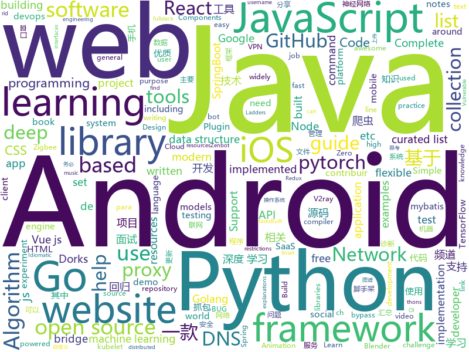

# 2020-02-09
See what the GitHub community is most excited about today.

## python
* [BlenderGIS](https://github.com/domlysz/BlenderGIS)(**107 stars today**): Blender addons to make the bridge between Blender and geographic data
* [pytorch3d](https://github.com/facebookresearch/pytorch3d)(**331 stars today**): PyTorch3D is FAIR's library of reusable components for deep learning with 3D data
* [meshrcnn](https://github.com/facebookresearch/meshrcnn)(**106 stars today**): code for Mesh R-CNN, an academic publication, presented at ICCV 2019
* [public-apis](https://github.com/public-apis/public-apis)(**72 stars today**): A collective list of free APIs for use in software and web development.
* [binwalk](https://github.com/ReFirmLabs/binwalk)(**142 stars today**): Firmware Analysis Tool
* [Python](https://github.com/TheAlgorithms/Python)(**177 stars today**): All Algorithms implemented in Python
* [face_recognition](https://github.com/ageitgey/face_recognition)(**107 stars today**): The world's simplest facial recognition api for Python and the command line
* [models](https://github.com/tensorflow/models)(**37 stars today**): Models and examples built with TensorFlow
* [fsociety](https://github.com/Manisso/fsociety)(**7 stars today**): fsociety Hacking Tools Pack – A Penetration Testing Framework
* [thefuck](https://github.com/nvbn/thefuck)(**30 stars today**): Magnificent app which corrects your previous console command.
* [jdBuyMask](https://github.com/cycz/jdBuyMask)(**101 stars today**): 京东监控口罩有货爬虫，自动下单爬虫，口罩爬虫
* [cloudflare-vpn-for-desktop](https://github.com/cyberman219/cloudflare-vpn-for-desktop)(**11 stars today**): This repository is to help you to get Cloudflare VPN WARP+ 1.1.1.1 on your Desktop
* [cpython](https://github.com/python/cpython)(**36 stars today**): The Python programming language
* [youtube-dl](https://github.com/ytdl-org/youtube-dl)(**92 stars today**): Command-line program to download videos from YouTube.com and other video sites
* [pytorch-metric-learning](https://github.com/KevinMusgrave/pytorch-metric-learning)(**52 stars today**): The easiest way to use deep metric learning in your application. Modular, flexible, and extensible. Written in PyTorch.
* [sherlock](https://github.com/sherlock-project/sherlock)(**13 stars today**): 🔎Hunt down social media accounts by username across social networks
* [d2l-vn](https://github.com/aivivn/d2l-vn)(**13 stars today**): Bản dịch cuốn sách "Dive into Deep Learning"
* [faceswap](https://github.com/deepfakes/faceswap)(**30 stars today**): Deepfakes Software For All
* [zincbase](https://github.com/complexdb/zincbase)(**26 stars today**): A state of the art knowledge base
* [Deep-Learning-21-Examples](https://github.com/hzy46/Deep-Learning-21-Examples)(**7 stars today**): 《21个项目玩转深度学习———基于TensorFlow的实践详解》配套代码
* [iptv-m3u-maker](https://github.com/EvilCult/iptv-m3u-maker)(**8 stars today**): IPTV 国内+国外 电视台直播源m3u文件, 收集&汇总脚本,目前状况: 收录频道总数:4523, 优质频道数:已放出优质频道总是: 687
* [zhao](https://github.com/programthink/zhao)(**19 stars today**): 【编程随想】整理的《太子党关系网络》，专门揭露赵国的权贵
* [manim](https://github.com/3b1b/manim)(**42 stars today**): Animation engine for explanatory math videos
* [comida](https://github.com/airbus-cert/comida)(**31 stars today**): An IDA Plugin that help analyzing module that use COM
* [examples](https://github.com/pytorch/examples)(**23 stars today**): A set of examples around pytorch in Vision, Text, Reinforcement Learning, etc.

## java
* [Java](https://github.com/TheAlgorithms/Java)(**28 stars today**): All Algorithms implemented in Java
* [CS-Notes](https://github.com/CyC2018/CS-Notes)(**89 stars today**): 📚技术面试必备基础知识、Leetcode、计算机操作系统、计算机网络、系统设计、Java、Python、C++
* [SpringBoot](https://github.com/lxy-go/SpringBoot)(**7 stars today**): 这是一个SpringBoot的从入门程序集锦
* [SpringBoot-Labs](https://github.com/YunaiV/SpringBoot-Labs)(**14 stars today**): Spring Boot 2.X 专栏更新中，未来更新 Spring Cloud Alibaba 。欢迎胖友 Star 一波
* [zuihou-admin-cloud](https://github.com/zuihou/zuihou-admin-cloud)(**21 stars today**): 基于SpringCloud(Hoxton.SR1) + SpringBoot(2.2.2.RELEASE) 的SaaS 微服务脚手架，具有统一授权、认证后台管理系统，其中包含具备用户管理、资源权限管理、网关API、分布式事务、大文件断点分片续传等多个模块，支持多业务系统并行开发，可以作为后端服务的开发脚手架。代码简洁，架构清晰，适合学习和直接项目中使用。核心技术采用Nacos、Fegin、Ribbon、Zuul、Hystrix、JWT Token、Mybatis、SpringBoot、Redis、RibbitMQ等主要框架和中间件。
* [igniter](https://github.com/trojan-gfw/igniter)(**19 stars today**): A trojan client for Android (UNDER CONSTRUCTION).
* [proxyee-down](https://github.com/proxyee-down-org/proxyee-down)(**7 stars today**): http下载工具，基于http代理，支持多连接分块下载
* [interviews](https://github.com/kdn251/interviews)(**24 stars today**): Everything you need to know to get the job.
* [MusicBot](https://github.com/jagrosh/MusicBot)(**3 stars today**): 🎶A Discord music bot that's easy to set up and run yourself!
* [java8-tutorial](https://github.com/winterbe/java8-tutorial)(**5 stars today**): Modern Java - A Guide to Java 8
* [lottie-android](https://github.com/airbnb/lottie-android)(**12 stars today**): Render After Effects animations natively on Android and iOS, Web, and React Native
* [learnings](https://github.com/FraserYu/learnings)(**14 stars today**): Java技术栈Demo与精彩文章汇总
* [libgdx](https://github.com/libgdx/libgdx)(**7 stars today**): Desktop/Android/HTML5/iOS Java game development framework
* [DoraemonKit](https://github.com/didi/DoraemonKit)(**7 stars today**): 简称 "DoKit" 。一款功能齐全的客户端（ iOS 、Android、微信小程序 ）研发助手，你值得拥有。
* [hutool](https://github.com/looly/hutool)(**17 stars today**): A set of tools that keep Java sweet.
* [QR-Code-generator](https://github.com/nayuki/QR-Code-generator)(**4 stars today**): High-quality QR Code generator library in Java, TypeScript/JavaScript, Python, C++, C, Rust.
* [LintCode](https://github.com/awangdev/LintCode)(**4 stars today**): Java Solutions to problems on LintCode/LeetCode
* [AndroidHttpCapture](https://github.com/JZ-Darkal/AndroidHttpCapture)(**3 stars today**): AndroidHttpCapture网络诊断工具 是一款Android手机抓包软件 主要功能包括：手机端抓包、PING/DNS/TraceRoute诊断、抓包HAR数据上传分享。你也可以看成是Android版的"Fiddler" \(^o^)/~
* [dremio-oss](https://github.com/dremio/dremio-oss)(**2 stars today**): Dremio - the missing link in modern data
* [FastHub](https://github.com/k0shk0sh/FastHub)(**8 stars today**): FastHub the ultimate GitHub client for Android.
* [mybatis](https://github.com/tuguangquan/mybatis)(**5 stars today**): mybatis源码中文注释
* [armeria](https://github.com/line/armeria)(**3 stars today**): Asynchronous RPC/REST library built on top of Java 8, Netty, HTTP/2, Thrift and gRPC
* [wxOrder](https://github.com/923310233/wxOrder)(**5 stars today**): 
* [IOT-Technical-Guide](https://github.com/IoT-Technology/IOT-Technical-Guide)(**2 stars today**): 最好的物联网技术指南 - 抽丝拨茧Thingsboard和思考阿里云物联网平台

## unknown
* [build-your-own-x](https://github.com/danistefanovic/build-your-own-x)(**172 stars today**): 🤓Build your own (insert technology here)
* [free-programming-books](https://github.com/EbookFoundation/free-programming-books)(**94 stars today**): 📚Freely available programming books
* [frontend-challenges](https://github.com/felipefialho/frontend-challenges)(**75 stars today**): 💥Listing some playful open-source's challenges of jobs to test your knowledge
* [financial-machine-learning](https://github.com/firmai/financial-machine-learning)(**9 stars today**): A curated list of practical financial machine learning (FinML) tools and applications in Python.
* [coding-interview-university](https://github.com/jwasham/coding-interview-university)(**85 stars today**): A complete computer science study plan to become a software engineer.
* [bootcamp-gostack-desafio-02](https://github.com/Rocketseat/bootcamp-gostack-desafio-02)(**7 stars today**): Desafio do segundo módulo do Bootcamp GoStack🚀👨🏻‍🚀
* [every-programmer-should-know](https://github.com/mtdvio/every-programmer-should-know)(**14 stars today**): A collection of (mostly) technical things every software developer should know
* [google_dork_list](https://github.com/BullsEye0/google_dork_list)(**14 stars today**): Google Dorks | Google helps you to find Vulnerable Websites that Indexed in Google Search Results. Here is the latest collection of Google Dorks. A collection of around 10,000 Dorks. Author: Jolanda de Koff
* [pentest-guide](https://github.com/Voorivex/pentest-guide)(**13 stars today**): Penetration tests guide based on OWASP including test cases, resources and examples.
* [CodeForces-Ladders](https://github.com/karansinghgit/CodeForces-Ladders)(**10 stars today**): Updated CodeForces Ladders for solving
* [2019-nCoV](https://github.com/lalambdada/2019-nCoV)(**11 stars today**): DONT PANIC.
* [oi_slides](https://github.com/Trinkle23897/oi_slides)(**50 stars today**): 我的 OI 课件
* [idiomatic.js](https://github.com/rwaldron/idiomatic.js)(**7 stars today**): Principles of Writing Consistent, Idiomatic JavaScript
* [Lab-Assignments](https://github.com/CSO-102-Data-Structures-Spring-2020/Lab-Assignments)(****): This repository contains CSO-102 lab tasks
* [proposal-decimal](https://github.com/littledan/proposal-decimal)(**19 stars today**): Built-in decimal datatype in JavaScript
* [Awesome-pytorch-list](https://github.com/bharathgs/Awesome-pytorch-list)(**21 stars today**): A comprehensive list of pytorch related content on github,such as different models,implementations,helper libraries,tutorials etc.
* [wuhan2020-timeline](https://github.com/Pratitya/wuhan2020-timeline)(**44 stars today**): 记录自2019年12月起武汉新冠肺炎疫情进展的时间线。
* [Beginner-Network-Pentesting](https://github.com/hmaverickadams/Beginner-Network-Pentesting)(**6 stars today**): Notes for Beginner Network Pentesting Course
* [yixun](https://github.com/dgz01/yixun)(**9 stars today**): 亿寻
* [AlphaTree-graphic-deep-neural-network](https://github.com/weslynn/AlphaTree-graphic-deep-neural-network)(**4 stars today**): 机器学习(Machine Learning)、深度学习(Deep Learning)、对抗神经网络(GAN），图神经网络（GNN），NLP，大数据相关的发展路书(roadmap), 并附海量源码（python，pytorch）带大家消化基本知识点，突破面试，完成从新手到合格工程师的跨越，其中深度学习相关论文附有tensorflow caffe官方源码，应用部分含推荐算法和知识图谱
* [electron-ssr-backup](https://github.com/qingshuisiyuan/electron-ssr-backup)(**16 stars today**): electron-ssr原作者删除了这个伟大的项目，故备份了下来，不继续开发,且用且珍惜
* [awesome-xamarin-forms](https://github.com/jsuarezruiz/awesome-xamarin-forms)(**2 stars today**): A curated list of awesome Xamarin.Forms libraries and resources
* [SJTU-Courses](https://github.com/CoolPhilChen/SJTU-Courses)(**6 stars today**): 上海交通大学课程资料分享
* [Python-programming-exercises](https://github.com/zhiwehu/Python-programming-exercises)(**27 stars today**): 100+ Python challenging programming exercises
* [Java-Interview](https://github.com/gzc426/Java-Interview)(**9 stars today**): Java 面试必会 直通BAT

## javascript
* [javascript-algorithms](https://github.com/trekhleb/javascript-algorithms)(**39 stars today**): 📝Algorithms and data structures implemented in JavaScript with explanations and links to further readings
* [realworld](https://github.com/gothinkster/realworld)(**81 stars today**): "The mother of all demo apps" — Exemplary fullstack Medium.com clone powered by React, Angular, Node, Django, and many more🏅
* [zigbee2mqtt](https://github.com/Koenkk/zigbee2mqtt)(**16 stars today**): Zigbee🐝to MQTT bridge🌉, get rid of your proprietary Zigbee bridges🔨
* [freeCodeCamp](https://github.com/freeCodeCamp/freeCodeCamp)(**52 stars today**): The https://www.freeCodeCamp.org open source codebase and curriculum. Learn to code for free together with millions of people.
* [complete-javascript-course](https://github.com/jonasschmedtmann/complete-javascript-course)(**13 stars today**): Starter files, final projects and FAQ for my Complete JavaScript course
* [bootstrap](https://github.com/twbs/bootstrap)(**57 stars today**): The most popular HTML, CSS, and JavaScript framework for developing responsive, mobile first projects on the web.
* [js-docs](https://github.com/LeonardoCesca/js-docs)(**46 stars today**): Este projeto foi desenvolvido para contribuir com o open-source. Se você quiser contribuir basta seguir o README
* [Font-Awesome](https://github.com/FortAwesome/Font-Awesome)(**22 stars today**): The iconic SVG, font, and CSS toolkit
* [javascript](https://github.com/airbnb/javascript)(**75 stars today**): JavaScript Style Guide
* [nuxt.js](https://github.com/nuxt/nuxt.js)(**39 stars today**): The Vue.js Framework
* [react](https://github.com/facebook/react)(**104 stars today**): A declarative, efficient, and flexible JavaScript library for building user interfaces.
* [babel](https://github.com/babel/babel)(**16 stars today**): 🐠Babel is a compiler for writing next generation JavaScript.
* [Script](https://github.com/NobyDa/Script)(**16 stars today**): This project is based on the scripting capabilities of two excellent iOS proxy tools, Quantumult X or Surge.
* [react-shopping-cart](https://github.com/jeffersonRibeiro/react-shopping-cart)(**6 stars today**): 🛍️Simple ecommerce cart application built with React Redux
* [the-super-tiny-compiler](https://github.com/jamiebuilds/the-super-tiny-compiler)(**11 stars today**): ⛄️Possibly the smallest compiler ever
* [swiper](https://github.com/nolimits4web/swiper)(**17 stars today**): Most modern mobile touch slider with hardware accelerated transitions
* [live2d-widget](https://github.com/stevenjoezhang/live2d-widget)(**10 stars today**): 把萌萌哒的看板娘抱回家 (ノ≧∇≦)ノ | Live2D widget for web platform
* [mapbox-gl-js](https://github.com/mapbox/mapbox-gl-js)(**6 stars today**): Interactive, thoroughly customizable maps in the browser, powered by vector tiles and WebGL
* [octotree](https://github.com/ovity/octotree)(**16 stars today**): GitHub on steroids
* [You-Dont-Need-Momentjs](https://github.com/you-dont-need/You-Dont-Need-Momentjs)(**263 stars today**): List of functions which you can use to replace moment.js + ESLint Plugin
* [atom](https://github.com/atom/atom)(**24 stars today**): The hackable text editor
* [haste-server](https://github.com/seejohnrun/haste-server)(**5 stars today**): open source pastebin written in node.js
* [vue-cli](https://github.com/vuejs/vue-cli)(**16 stars today**): 🛠️Standard Tooling for Vue.js Development
* [particles.js](https://github.com/VincentGarreau/particles.js)(**15 stars today**): A lightweight JavaScript library for creating particles
* [bootstrap-table](https://github.com/wenzhixin/bootstrap-table)(**7 stars today**): An extended table to integration with some of the most widely used CSS frameworks. (Supports Bootstrap, Semantic UI, Bulma, Material Design, Foundation, Vue.js)

## html
* [hyperblog](https://github.com/freddier/hyperblog)(**11 stars today**): Un blog increíble para el curso de Git y Github de Platzi
* [lnbook](https://github.com/lnbook/lnbook)(**10 stars today**): Mastering the Lightning Network (LN)
* [LibreLingo](https://github.com/kantord/LibreLingo)(**170 stars today**): an experiment to create a community driven language-learning platform
* [WhatTheHack](https://github.com/microsoft/WhatTheHack)(**149 stars today**): A collection of challenge based hack-a-thons including student guide, proctor guide, lecture presentations, sample/instructional code and templates.
* [indigo](https://github.com/sergiokopplin/indigo)(**3 stars today**): 🍜Minimalist Jekyll Template
* [free-for-dev](https://github.com/ripienaar/free-for-dev)(**50 stars today**): A list of SaaS, PaaS and IaaS offerings that have free tiers of interest to devops and infradev
* [Machine-Learning](https://github.com/Jack-Cherish/Machine-Learning)(**7 stars today**): ⚡️机器学习实战（Python3）：kNN、决策树、贝叶斯、逻辑回归、SVM、线性回归、树回归
* [personal-website](https://github.com/github/personal-website)(**11 stars today**): Code that'll help you kickstart a personal website that showcases your work as a software developer.
* [rhasspy](https://github.com/synesthesiam/rhasspy)(**2 stars today**): Rhasspy voice assistant for offline home automation
* [heroku-aria2c](https://github.com/maple3142/heroku-aria2c)(**17 stars today**): 
* [material-design-lite](https://github.com/google/material-design-lite)(**6 stars today**): Material Design Components in HTML/CSS/JS
* [fluxion](https://github.com/FluxionNetwork/fluxion)(**3 stars today**): Fluxion is a remake of linset by vk496 with less bugs and enhanced functionality.
* [Spoon-Knife](https://github.com/octocat/Spoon-Knife)(**4 stars today**): This repo is for demonstration purposes only.
* [ctf-wiki](https://github.com/ctf-wiki/ctf-wiki)(**6 stars today**): CTF Wiki Online. Come and join us, we need you!
* [complete-web-developer-manual](https://github.com/zero-to-mastery/complete-web-developer-manual)(**3 stars today**): All resources and notes from the Complete Web Developer in 2018: Zero to Mastery course
* [computer-science-flash-cards](https://github.com/jwasham/computer-science-flash-cards)(**6 stars today**): Mini website for testing both general CS knowledge and enforce coding practice and common algorithm/data structure memorization.
* [EIPs](https://github.com/ethereum/EIPs)(**1 stars today**): The Ethereum Improvement Proposal repository
* [hugo-book](https://github.com/alex-shpak/hugo-book)(**2 stars today**): Hugo documentation theme as simple as plain book
* [GTFOBins.github.io](https://github.com/GTFOBins/GTFOBins.github.io)(**9 stars today**): Curated list of Unix binaries that can be exploited to bypass system security restrictions
* [Dism-Multi-language](https://github.com/Chuyu-Team/Dism-Multi-language)(**5 stars today**): Dism++ Multi-language Support & BUG Report
* [hugo-academic](https://github.com/gcushen/hugo-academic)(**3 stars today**): 📝The website builder for Hugo. Build and deploy a beautiful website in minutes!
* [awesome-competitive-programming](https://github.com/lnishan/awesome-competitive-programming)(**13 stars today**): 💎A curated list of awesome Competitive Programming, Algorithm and Data Structure resources
* [zenbot](https://github.com/DeviaVir/zenbot)(**3 stars today**): Zenbot is a command-line cryptocurrency trading bot using Node.js and MongoDB.
* [dataviz](https://github.com/clauswilke/dataviz)(**1 stars today**): A book covering the fundamentals of data visualization
* [flexboxgrid](https://github.com/kristoferjoseph/flexboxgrid)(**2 stars today**): Grid based on CSS3 flexbox

## go
* [cortex](https://github.com/cortexlabs/cortex)(**27 stars today**): Deploy machine learning models in production
* [fiber](https://github.com/gofiber/fiber)(**300 stars today**): 🚀Fiber is an Express.js inspired web framework written in Go with💖
* [websocket](https://github.com/gorilla/websocket)(**17 stars today**): A fast, well-tested and widely used WebSocket implementation for Go.
* [hugo](https://github.com/gohugoio/hugo)(**46 stars today**): The world’s fastest framework for building websites.
* [kubernetes-ingress-controller](https://github.com/Kong/kubernetes-ingress-controller)(**8 stars today**): Kong for Kubernetes
* [v2ray-core](https://github.com/v2ray/v2ray-core)(**111 stars today**): A platform for building proxies to bypass network restrictions.
* [brook](https://github.com/txthinking/brook)(**17 stars today**): Brook is a cross-platform(Linux/MacOS/Windows/Android/iOS) proxy/vpn software
* [7days-golang](https://github.com/geektutu/7days-golang)(**57 stars today**): 7 days golang apps from scratch (web framework Gee, distributed cache GeeCache, etc) 7天用Go动手写系列[从零实现]
* [clash](https://github.com/Dreamacro/clash)(**40 stars today**): A rule-based tunnel in Go.
* [v2ray-poseidon](https://github.com/ColetteContreras/v2ray-poseidon)(**4 stars today**): A buildin V2ray plugin for SSRPanel, V2board and SSPanel-v3-Uim to sync users from database to v2ray, to log traffics/system info
* [go-github](https://github.com/google/go-github)(**15 stars today**): Go library for accessing the GitHub API
* [Amass](https://github.com/OWASP/Amass)(**13 stars today**): In-depth Attack Surface Mapping and Asset Discovery
* [dnscrypt-proxy](https://github.com/DNSCrypt/dnscrypt-proxy)(**18 stars today**): dnscrypt-proxy 2 - A flexible DNS proxy, with support for encrypted DNS protocols.
* [Go-Questions](https://github.com/qcrao/Go-Questions)(**2 stars today**): 从问题切入，串连 Go 语言相关的所有知识，融会贯通。
* [docker_practice](https://github.com/yeasy/docker_practice)(**14 stars today**): Learn and understand Docker technologies, with real DevOps practice!
* [traefik](https://github.com/containous/traefik)(**35 stars today**): The Cloud Native Edge Router
* [opa](https://github.com/open-policy-agent/opa)(**3 stars today**): An open source, general-purpose policy engine.
* [AdGuardHome](https://github.com/AdguardTeam/AdGuardHome)(**12 stars today**): Network-wide ads & trackers blocking DNS server
* [xray](https://github.com/chaitin/xray)(**8 stars today**): 一款完善的安全评估工具，支持常见 web 安全问题扫描和自定义 poc | 使用之前务必先阅读文档
* [fasthttp](https://github.com/valyala/fasthttp)(**45 stars today**): Fast HTTP package for Go. Tuned for high performance. Zero memory allocations in hot paths. Up to 10x faster than net/http
* [virtual-kubelet](https://github.com/virtual-kubelet/virtual-kubelet)(**6 stars today**): Virtual Kubelet is an open source Kubernetes kubelet implementation.
* [zinx](https://github.com/aceld/zinx)(**4 stars today**): 基于Golang轻量级TCP并发服务器框架
* [chaosblade](https://github.com/chaosblade-io/chaosblade)(**6 stars today**): An easy to use and powerful chaos engineering experiment toolkit.（阿里巴巴开源的一款简单易用、功能强大的混沌实验注入工具）
* [viper](https://github.com/spf13/viper)(**19 stars today**): Go configuration with fangs
* [mattermost-server](https://github.com/mattermost/mattermost-server)(**11 stars today**): Open source Slack-alternative in Golang and React - Mattermost

## WordCloud

