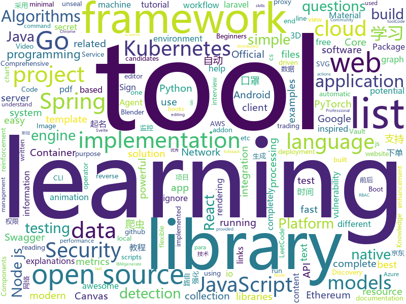

# 2020-02-11
See what the GitHub community is most excited about today.

## python
* [contextualise](https://github.com/brettkromkamp/contextualise)(**88 stars today**): Contextualise is a simple and flexible tool particularly suited for organising information-heavy projects and activities consisting of unstructured and widely diverse data and information resources
* [ML-From-Scratch](https://github.com/eriklindernoren/ML-From-Scratch)(**49 stars today**): Machine Learning From Scratch. Bare bones NumPy implementations of machine learning models and algorithms with a focus on accessibility. Aims to cover everything from linear regression to deep learning.
* [BlenderGIS](https://github.com/domlysz/BlenderGIS)(**479 stars today**): Blender addons to make the bridge between Blender and geographic data
* [jdBuyMask](https://github.com/cycz/jdBuyMask)(**149 stars today**): 京东监控口罩有货爬虫，自动下单爬虫，口罩爬虫
* [CenterNet](https://github.com/xingyizhou/CenterNet)(**6 stars today**): Object detection, 3D detection, and pose estimation using center point detection:
* [tlroadmap](https://github.com/tlbootcamp/tlroadmap)(**17 stars today**): 👩🏼‍💻👨🏻‍💻Карта навыков и модель развития тимлидов
* [albumentations](https://github.com/albumentations-team/albumentations)(**34 stars today**): fast image augmentation library and easy to use wrapper around other libraries
* [diagrams](https://github.com/mingrammer/diagrams)(**233 stars today**): 🎨Diagram as Code for prototyping cloud system architectures
* [virtualenv](https://github.com/pypa/virtualenv)(**12 stars today**): Virtual Python Environment builder
* [jd-automask](https://github.com/Rlacat/jd-automask)(**54 stars today**): 防护-京东口罩自动抢购并下单
* [nca](https://github.com/kevinzakka/nca)(**48 stars today**): A PyTorch implementation of Neighbourhood Components Analysis.
* [robotframework](https://github.com/robotframework/robotframework)(**6 stars today**): Generic automation framework for acceptance testing and RPA
* [mypy](https://github.com/python/mypy)(**10 stars today**): Optional static typing for Python 3 and 2 (PEP 484)
* [gym](https://github.com/openai/gym)(**14 stars today**): A toolkit for developing and comparing reinforcement learning algorithms.
* [spaCy](https://github.com/explosion/spaCy)(**20 stars today**): 💫Industrial-strength Natural Language Processing (NLP) with Python and Cython
* [tensortrade](https://github.com/tensortrade-org/tensortrade)(**7 stars today**): An open source reinforcement learning framework for training, evaluating, and deploying robust trading agents.
* [PyTorchDocs](https://github.com/fendouai/PyTorchDocs)(**7 stars today**): PyTorch 官方中文教程包含 60 分钟快速入门教程，强化教程，计算机视觉，自然语言处理，生成对抗网络，强化学习。欢迎 Star，Fork！
* [prefect](https://github.com/PrefectHQ/prefect)(**5 stars today**): The Prefect Core workflow engine
* [node-gyp](https://github.com/nodejs/node-gyp)(**13 stars today**): Node.js native addon build tool
* [siggraphasia2019_remastering](https://github.com/satoshiiizuka/siggraphasia2019_remastering)(**11 stars today**): Code for the paper "DeepRemaster: Temporal Source-Reference Attention Networks for Comprehensive Video Enhancement". http://iizuka.cs.tsukuba.ac.jp/projects/remastering/
* [CRAFT-pytorch](https://github.com/clovaai/CRAFT-pytorch)(**2 stars today**): Official implementation of Character Region Awareness for Text Detection (CRAFT)
* [zhao](https://github.com/programthink/zhao)(**20 stars today**): 【编程随想】整理的《太子党关系网络》，专门揭露赵国的权贵
* [models](https://github.com/tensorflow/models)(**31 stars today**): Models and examples built with TensorFlow
* [keras](https://github.com/keras-team/keras)(**22 stars today**): Deep Learning for humans
* [cloud-custodian](https://github.com/cloud-custodian/cloud-custodian)(**5 stars today**): Rules engine for cloud security, cost optimization, and governance, DSL in yaml for policies to query, filter, and take actions on resources

## java
* [Java](https://github.com/TheAlgorithms/Java)(**115 stars today**): All Algorithms implemented in Java
* [micrometer](https://github.com/micrometer-metrics/micrometer)(**1 stars today**): An application metrics facade for the most popular monitoring tools. Think SLF4J, but for metrics.
* [tutorials](https://github.com/eugenp/tutorials)(**16 stars today**): Just Announced - "Learn Spring Security OAuth":
* [thingsboard](https://github.com/thingsboard/thingsboard)(**6 stars today**): Open-source IoT Platform - Device management, data collection, processing and visualization.
* [quarkus](https://github.com/quarkusio/quarkus)(**7 stars today**): Quarkus: Supersonic Subatomic Java.
* [eladmin](https://github.com/elunez/eladmin)(**26 stars today**): 项目基于 Spring Boot 2.1.0 、 Jpa、 Spring Security、redis、Vue的前后端分离的后台管理系统，项目采用分模块开发方式， 权限控制采用 RBAC，支持数据字典与数据权限管理，支持一键生成前后端代码，支持动态路由
* [wqxuetang-pdf-downloader](https://github.com/SweetInk/wqxuetang-pdf-downloader)(**17 stars today**): 文泉学堂PDF下载器 最后测试可用时间:2020年2月10日 01点46分
* [swagger-core](https://github.com/swagger-api/swagger-core)(**1 stars today**): Examples and server integrations for generating the Swagger API Specification, which enables easy access to your REST API
* [cas](https://github.com/apereo/cas)(**4 stars today**): Apereo CAS - Enterprise Single Sign On for all earthlings and beyond.
* [MPAndroidChart](https://github.com/PhilJay/MPAndroidChart)(**14 stars today**): A powerful🚀Android chart view / graph view library, supporting line- bar- pie- radar- bubble- and candlestick charts as well as scaling, dragging and animations.
* [liferay-portal](https://github.com/liferay/liferay-portal)(**2 stars today**): 
* [netty](https://github.com/netty/netty)(**10 stars today**): Netty project - an event-driven asynchronous network application framework
* [JavaGuide](https://github.com/Snailclimb/JavaGuide)(**55 stars today**): 【Java学习+面试指南】 一份涵盖大部分Java程序员所需要掌握的核心知识。
* [grakn](https://github.com/graknlabs/grakn)(**5 stars today**): Grakn Core: The Knowledge Graph
* [resilience4j](https://github.com/resilience4j/resilience4j)(**6 stars today**): Resilience4j is a fault tolerance library designed for Java8 and functional programming
* [springboot-guide](https://github.com/Snailclimb/springboot-guide)(**18 stars today**): Not only Spring Boot but also important knowledge of Spring（不只是SpringBoot还有Spring重要知识点）
* [janusgraph](https://github.com/JanusGraph/janusgraph)(**3 stars today**): JanusGraph: an open-source, distributed graph database
* [antlr4](https://github.com/antlr/antlr4)(**5 stars today**): ANTLR (ANother Tool for Language Recognition) is a powerful parser generator for reading, processing, executing, or translating structured text or binary files.
* [web3j](https://github.com/web3j/web3j)(**3 stars today**): Lightweight Java and Android library for integration with Ethereum clients
* [react-native-navigation](https://github.com/wix/react-native-navigation)(**6 stars today**): A complete native navigation solution for React Native
* [jackson-databind](https://github.com/FasterXML/jackson-databind)(**2 stars today**): General data-binding package for Jackson (2.x): works on streaming API (core) implementation(s)
* [Discovery](https://github.com/Nepxion/Discovery)(**5 stars today**): 🐳Nepxion Discovery is an enhancement for Spring Cloud Discovery with gray release, router, weight, limitation, circuit breaker, degrade, isolation, monitor, tracing 灰度发布、路由、权重、限流、熔断、降级、隔离、监控、追踪
* [ghidra](https://github.com/NationalSecurityAgency/ghidra)(**55 stars today**): Ghidra is a software reverse engineering (SRE) framework
* [LeetCodeAnimation](https://github.com/MisterBooo/LeetCodeAnimation)(**57 stars today**): Demonstrate all the questions on LeetCode in the form of animation.（用动画的形式呈现解LeetCode题目的思路）
* [epoxy](https://github.com/airbnb/epoxy)(**8 stars today**): Epoxy is an Android library for building complex screens in a RecyclerView

## unknown
* [2019-nCoV](https://github.com/CSSEGISandData/2019-nCoV)(**82 stars today**): Novel Coronavirus (2019-nCoV) Cases, provided by JHU CSSE
* [app-ideas](https://github.com/florinpop17/app-ideas)(**262 stars today**): A Collection of application ideas which can be used to improve your coding skills.
* [acwa_book_ru](https://github.com/adelf/acwa_book_ru)(**62 stars today**): Книга "Архитектура сложных веб-приложений. С примерами на Laravel"
* [free-programming-books](https://github.com/EbookFoundation/free-programming-books)(**104 stars today**): 📚Freely available programming books
* [build-your-own-x](https://github.com/danistefanovic/build-your-own-x)(**151 stars today**): 🤓Build your own (insert technology here)
* [Red-Teaming-Toolkit](https://github.com/infosecn1nja/Red-Teaming-Toolkit)(**5 stars today**): A collection of open source and commercial tools that aid in red team operations.
* [portuguese-bert](https://github.com/neuralmind-ai/portuguese-bert)(**26 stars today**): Portuguese pre-trained BERT models
* [architect-awesome](https://github.com/xingshaocheng/architect-awesome)(**27 stars today**): 后端架构师技术图谱
* [awesome-courses](https://github.com/prakhar1989/awesome-courses)(**36 stars today**): 📚List of awesome university courses for learning Computer Science!
* [awesome-database-learning](https://github.com/pingcap/awesome-database-learning)(**166 stars today**): A list of learning materials to understand databases internals
* [Test-Assignments](https://github.com/Devit951/Test-Assignments)(**18 stars today**): List of test assignments. ⚡
* [Back-End-Developer-Interview-Questions](https://github.com/arialdomartini/Back-End-Developer-Interview-Questions)(**14 stars today**): A list of back-end related questions you can be inspired from to interview potential candidates, test yourself or completely ignore
* [wuhan2020-timeline](https://github.com/Pratitya/wuhan2020-timeline)(**82 stars today**): 记录自2019年12月起武汉新冠肺炎疫情进展的时间线。
* [laravel-log-reader](https://github.com/haruncpi/laravel-log-reader)(**29 stars today**): A simple and beautiful laravel log reader
* [Privilege-Escalation](https://github.com/Ignitetechnologies/Privilege-Escalation)(**12 stars today**): This cheasheet is aimed at the CTF Players and Beginners to help them understand the fundamentals of Privilege Escalation with examples.
* [SoftwareArchitect](https://github.com/justinamiller/SoftwareArchitect)(**134 stars today**): Path to a Software Architect
* [vagas](https://github.com/backend-br/vagas)(**8 stars today**): ✌️Espaço para divulgação de vagas para backenders
* [kubernetes-the-hard-way](https://github.com/kelseyhightower/kubernetes-the-hard-way)(**20 stars today**): Bootstrap Kubernetes the hard way on Google Cloud Platform. No scripts.
* [Fuck-XueXiQiangGuo](https://github.com/fuck-xuexiqiangguo/Fuck-XueXiQiangGuo)(**8 stars today**): 学习强国 懒人刷分工具 自动学习
* [ATTCK-PenTester-Book](https://github.com/Dm2333/ATTCK-PenTester-Book)(**34 stars today**): ATTCK-PenTester-Book
* [bootcamp-gostack-desafio-03](https://github.com/Rocketseat/bootcamp-gostack-desafio-03)(**4 stars today**): Desafio do terceiro módulo do Bootcamp GoStack🚀👨🏻‍🚀
* [leeml-notes](https://github.com/datawhalechina/leeml-notes)(**7 stars today**): 李宏毅《机器学习》笔记，在线阅读地址：https://datawhalechina.github.io/leeml-notes
* [Awesome-pytorch-list](https://github.com/bharathgs/Awesome-pytorch-list)(**10 stars today**): A comprehensive list of pytorch related content on github,such as different models,implementations,helper libraries,tutorials etc.
* [javascript-questions](https://github.com/lydiahallie/javascript-questions)(**27 stars today**): A long list of (advanced) JavaScript questions, and their explanations✨
* [react-redux-links](https://github.com/markerikson/react-redux-links)(**9 stars today**): Curated tutorial and resource links I've collected on React, Redux, ES6, and more

## javascript
* [alpine](https://github.com/alpinejs/alpine)(**321 stars today**): A rugged, minimal framework for composing JavaScript behavior in your markup.
* [react-virtualized](https://github.com/bvaughn/react-virtualized)(**15 stars today**): React components for efficiently rendering large lists and tabular data
* [realworld](https://github.com/gothinkster/realworld)(**155 stars today**): "The mother of all demo apps" — Exemplary fullstack Medium.com clone powered by React, Angular, Node, Django, and many more🏅
* [lighthouse](https://github.com/GoogleChrome/lighthouse)(**12 stars today**): Automated auditing, performance metrics, and best practices for the web.
* [dino3d](https://github.com/Priler/dino3d)(**40 stars today**): Google Chrome T-Rex Run! in 3D (WebGL experiment)
* [v4](https://github.com/bchiang7/v4)(**17 stars today**): Fourth iteration of my personal website
* [jitsi-meet](https://github.com/jitsi/jitsi-meet)(**6 stars today**): Jitsi Meet - Secure, Simple and Scalable Video Conferences that you use as a standalone app or embed in your web application.
* [create-react-app](https://github.com/facebook/create-react-app)(**39 stars today**): Set up a modern web app by running one command.
* [blessed](https://github.com/chjj/blessed)(**17 stars today**): A high-level terminal interface library for node.js.
* [Script](https://github.com/NobyDa/Script)(**28 stars today**): This project is based on the scripting capabilities of two excellent iOS proxy tools, Quantumult X or Surge.
* [SwitchHosts](https://github.com/oldj/SwitchHosts)(**12 stars today**): Switch hosts quickly!
* [cypress](https://github.com/cypress-io/cypress)(**33 stars today**): Fast, easy and reliable testing for anything that runs in a browser.
* [fatura](https://github.com/f/fatura)(**38 stars today**): eArşiv / eFatura Fatura Oluşturucu
* [wappalyzer](https://github.com/AliasIO/wappalyzer)(**5 stars today**): Cross-platform utility that uncovers the technologies used on websites.
* [carbon](https://github.com/carbon-design-system/carbon)(**5 stars today**): A design system built by IBM
* [faker.js](https://github.com/Marak/faker.js)(**15 stars today**): generate massive amounts of realistic fake data in Node.js and the browser
* [complete-javascript-course](https://github.com/jonasschmedtmann/complete-javascript-course)(**10 stars today**): Starter files, final projects and FAQ for my Complete JavaScript course
* [fabric.js](https://github.com/fabricjs/fabric.js)(**9 stars today**): Javascript Canvas Library, SVG-to-Canvas (& canvas-to-SVG) Parser
* [cypress-example-recipes](https://github.com/cypress-io/cypress-example-recipes)(**4 stars today**): Various recipes for testing common scenarios with Cypress
* [G2](https://github.com/antvis/G2)(**3 stars today**): 📊The Grammar of Graphics in JavaScript
* [fastify](https://github.com/fastify/fastify)(**57 stars today**): Fast and low overhead web framework, for Node.js
* [opensource.guide](https://github.com/github/opensource.guide)(**9 stars today**): 📚Community guides for open source creators
* [slick](https://github.com/kenwheeler/slick)(**8 stars today**): the last carousel you'll ever need
* [javascript-algorithms](https://github.com/trekhleb/javascript-algorithms)(**77 stars today**): 📝Algorithms and data structures implemented in JavaScript with explanations and links to further readings
* [renovate](https://github.com/renovatebot/renovate)(**6 stars today**): Universal dependency update tool that fits into your workflows.

## html
* [free-for-dev](https://github.com/ripienaar/free-for-dev)(**50 stars today**): A list of SaaS, PaaS and IaaS offerings that have free tiers of interest to devops and infradev
* [DetectionLab](https://github.com/clong/DetectionLab)(**10 stars today**): Vagrant & Packer scripts to build a lab environment complete with security tooling and logging best practices
* [website](https://github.com/kubernetes/website)(**4 stars today**): Kubernetes website and documentation repo:
* [CLRS](https://github.com/walkccc/CLRS)(**5 stars today**): 📚Solutions to Introduction to Algorithms Third Edition
* [professional-services](https://github.com/GoogleCloudPlatform/professional-services)(**2 stars today**): Common solutions and tools developed by Google Cloud's Professional Services team
* [ASVS](https://github.com/OWASP/ASVS)(**4 stars today**): Application Security Verification Standard
* [AR.js](https://github.com/jeromeetienne/AR.js)(**9 stars today**): Efficient Augmented Reality for the Web - 60fps on mobile!
* [ckeditor5](https://github.com/ckeditor/ckeditor5)(**5 stars today**): Powerful rich text editor framework with a modular architecture, modern integrations and features like collaborative editing.
* [EIPs](https://github.com/ethereum/EIPs)(**2 stars today**): The Ethereum Improvement Proposal repository
* [keep-a-changelog](https://github.com/olivierlacan/keep-a-changelog)(**3 stars today**): If you build software, keep a changelog.
* [tiny-slider](https://github.com/ganlanyuan/tiny-slider)(**9 stars today**): Vanilla javascript slider for all purposes.
* [website](https://github.com/kubeflow/website)(**0 stars today**): Kubeflow's public website
* [responsive-html-email-template](https://github.com/leemunroe/responsive-html-email-template)(**6 stars today**): A free simple responsive HTML email template
* [Awesome-CS-Books](https://github.com/wx-chevalier/Awesome-CS-Books)(**5 stars today**): 📚Awesome CS Books/Series(.pdf by git lfs) Warehouse for Geeks, ProgrammingLanguage, SoftwareEngineering, Web, AI, ServerSideApplication, Infrastructure, FE etc.💫优秀计算机科学与技术领域相关的书籍归档。
* [zenbot](https://github.com/DeviaVir/zenbot)(**3 stars today**): Zenbot is a command-line cryptocurrency trading bot using Node.js and MongoDB.
* [swagger-codegen](https://github.com/swagger-api/swagger-codegen)(**7 stars today**): swagger-codegen contains a template-driven engine to generate documentation, API clients and server stubs in different languages by parsing your OpenAPI / Swagger definition.
* [all-contributors](https://github.com/all-contributors/all-contributors)(**6 stars today**): ✨Recognize all contributors, not just the ones who push code✨
* [django-DefectDojo](https://github.com/DefectDojo/django-DefectDojo)(**3 stars today**): DefectDojo is an open-source application vulnerability correlation and security orchestration tool.
* [realworld](https://github.com/sveltejs/realworld)(**3 stars today**): Svelte/Sapper implementation of the RealWorld app
* [markdown-preview-enhanced](https://github.com/shd101wyy/markdown-preview-enhanced)(**3 stars today**): One of the 'BEST' markdown preview extensions for Atom editor!
* [en.javascript.info](https://github.com/javascript-tutorial/en.javascript.info)(**14 stars today**): Modern JavaScript Tutorial
* [www-project-top-ten](https://github.com/OWASP/www-project-top-ten)(**3 stars today**): OWASP Foundation Web Respository
* [kubelabs](https://github.com/collabnix/kubelabs)(**9 stars today**): Kubernetes - Beginners | Intermediate | Advanced
* [boost](https://github.com/boostorg/boost)(**2 stars today**): Super-project for modularized Boost
* [Front-end-Developer-Interview-Questions](https://github.com/h5bp/Front-end-Developer-Interview-Questions)(**12 stars today**): A list of helpful front-end related questions you can use to interview potential candidates, test yourself or completely ignore.

## go
* [fyne](https://github.com/fyne-io/fyne)(**142 stars today**): Cross platform GUI in Go based on Material Design
* [excelize](https://github.com/360EntSecGroup-Skylar/excelize)(**81 stars today**): Golang library for reading and writing Microsoft Excel™ (XLSX) files.
* [fiber](https://github.com/gofiber/fiber)(**314 stars today**): 🚀Fiber is an Express.js inspired web framework written in Go with💖
* [cortex](https://github.com/cortexlabs/cortex)(**90 stars today**): Deploy machine learning models in production
* [bank-vaults](https://github.com/banzaicloud/bank-vaults)(**7 stars today**): A Vault swiss-army knife: a K8s operator, Go client with automatic token renewal, automatic configuration, multiple unseal options and more. A CLI tool to init, unseal and configure Vault (auth methods, secret engines). Direct secret injection into Pods.
* [helm](https://github.com/helm/helm)(**18 stars today**): The Kubernetes Package Manager
* [cadvisor](https://github.com/google/cadvisor)(**6 stars today**): Analyzes resource usage and performance characteristics of running containers.
* [frp](https://github.com/fatedier/frp)(**49 stars today**): A fast reverse proxy to help you expose a local server behind a NAT or firewall to the internet.
* [Amass](https://github.com/OWASP/Amass)(**16 stars today**): In-depth Attack Surface Mapping and Asset Discovery
* [fate](https://github.com/godcong/fate)(**32 stars today**): fate 命运 起名 算命 宝宝起名
* [vuls](https://github.com/future-architect/vuls)(**17 stars today**): Agent-less vulnerability scanner for Linux, FreeBSD, Container Image, Running Container, WordPress, Programming language libraries, Network devices
* [terraform-provider-azurerm](https://github.com/terraform-providers/terraform-provider-azurerm)(**3 stars today**): Terraform provider for Azure Resource Manager
* [argo-cd](https://github.com/argoproj/argo-cd)(**4 stars today**): Declarative continuous deployment for Kubernetes.
* [eksctl](https://github.com/weaveworks/eksctl)(**7 stars today**): The official CLI for Amazon EKS
* [opa](https://github.com/open-policy-agent/opa)(**6 stars today**): An open source, general-purpose policy engine.
* [go-ethereum](https://github.com/ethereum/go-ethereum)(**7 stars today**): Official Go implementation of the Ethereum protocol
* [harbor](https://github.com/goharbor/harbor)(**10 stars today**): An open source trusted cloud native registry project that stores, signs, and scans content.
* [orchestrator](https://github.com/github/orchestrator)(**3 stars today**): MySQL replication topology management and HA
* [cert-manager](https://github.com/jetstack/cert-manager)(**8 stars today**): Automatically provision and manage TLS certificates in Kubernetes
* [gomplate](https://github.com/hairyhenderson/gomplate)(**4 stars today**): A flexible commandline tool for template rendering. Supports lots of local and remote datasources.
* [gardener](https://github.com/gardener/gardener)(**4 stars today**): Kubernetes-native system managing the full lifecycle of conformant Kubernetes clusters as a service on Alicloud, AWS, Azure, GCP, OpenStack, Packet, and vSphere with minimal TCO.
* [aws-sdk-go](https://github.com/aws/aws-sdk-go)(**1 stars today**): AWS SDK for the Go programming language.
* [mock](https://github.com/golang/mock)(**4 stars today**): GoMock is a mocking framework for the Go programming language.
* [flagger](https://github.com/weaveworks/flagger)(**4 stars today**): Progressive delivery Kubernetes operator (Canary, A/B Testing and Blue/Green deployments)
* [lego](https://github.com/go-acme/lego)(**8 stars today**): Let's Encrypt client and ACME library written in Go

## WordCloud

