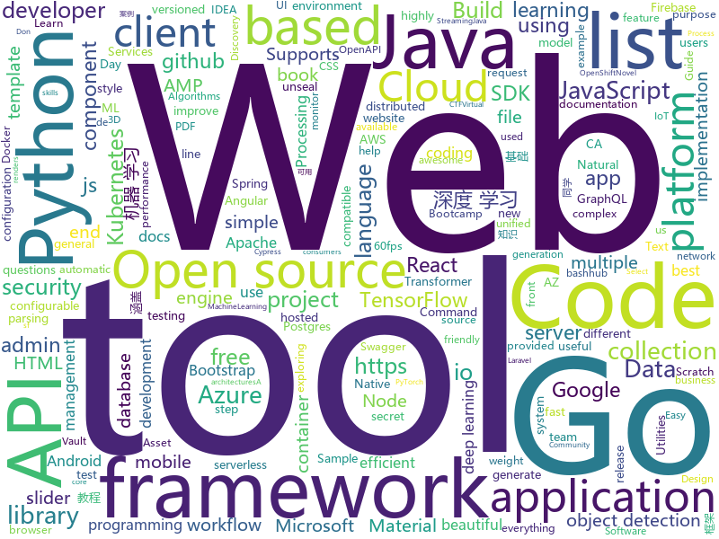

# 2020-02-12
See what the GitHub community is most excited about today.

## python
* [spaCy](https://github.com/explosion/spaCy)(**16 stars today**): 💫Industrial-strength Natural Language Processing (NLP) with Python and Cython
* [DeepSpeed](https://github.com/microsoft/DeepSpeed)(**472 stars today**): DeepSpeed is a deep learning optimization library that makes distributed training easy, efficient, and effective.
* [diagrams](https://github.com/mingrammer/diagrams)(**344 stars today**): 🎨Diagram as Code for prototyping cloud system architectures
* [PayloadsAllTheThings](https://github.com/swisskyrepo/PayloadsAllTheThings)(**42 stars today**): A list of useful payloads and bypass for Web Application Security and Pentest/CTF
* [virtualenv](https://github.com/pypa/virtualenv)(**11 stars today**): Virtual Python Environment builder
* [ML-From-Scratch](https://github.com/eriklindernoren/ML-From-Scratch)(**57 stars today**): Machine Learning From Scratch. Bare bones NumPy implementations of machine learning models and algorithms with a focus on accessibility. Aims to cover everything from linear regression to deep learning.
* [aws-cli](https://github.com/aws/aws-cli)(**17 stars today**): Universal Command Line Interface for Amazon Web Services
* [d2l-zh](https://github.com/d2l-ai/d2l-zh)(**21 stars today**): 《动手学深度学习》：面向中文读者、能运行、可讨论。英文版即伯克利“深度学习导论”教材。
* [django-rest-framework](https://github.com/encode/django-rest-framework)(**11 stars today**): Web APIs for Django.🎸
* [100-Days-Of-ML-Code](https://github.com/Avik-Jain/100-Days-Of-ML-Code)(**10 stars today**): 100 Days of ML Coding
* [jd-automask](https://github.com/Rlacat/jd-automask)(**58 stars today**): 防护-京东口罩自动抢购并下单
* [text-to-text-transfer-transformer](https://github.com/google-research/text-to-text-transfer-transformer)(**43 stars today**): Code for the paper "Exploring the Limits of Transfer Learning with a Unified Text-to-Text Transformer"
* [AiLearning](https://github.com/apachecn/AiLearning)(**20 stars today**): AiLearning: 机器学习 - MachineLearning - ML、深度学习 - DeepLearning - DL、自然语言处理 NLP
* [hydra](https://github.com/facebookresearch/hydra)(**36 stars today**): Hydra is a framework for elegantly configuring complex applications
* [pipenv](https://github.com/pypa/pipenv)(**12 stars today**): Python Development Workflow for Humans.
* [skorch](https://github.com/skorch-dev/skorch)(**42 stars today**): A scikit-learn compatible neural network library that wraps pytorch
* [data-science-from-scratch](https://github.com/joelgrus/data-science-from-scratch)(**7 stars today**): code for Data Science From Scratch book
* [azure-sdk-for-python](https://github.com/Azure/azure-sdk-for-python)(**3 stars today**): This repository is for active development of the Azure SDK for Python. For consumers of the SDK we recommend visiting our public developer docs at https://docs.microsoft.com/en-us/python/azure/ or our versioned developer docs at https://azure.github.io/azure-sdk-for-python.
* [airflow](https://github.com/apache/airflow)(**12 stars today**): Apache Airflow - A platform to programmatically author, schedule, and monitor workflows
* [detectron2](https://github.com/facebookresearch/detectron2)(**25 stars today**): Detectron2 is FAIR's next-generation research platform for object detection and segmentation.
* [pydantic](https://github.com/samuelcolvin/pydantic)(**12 stars today**): Data parsing and validation using Python type hints
* [TensorFlow-Object-Detection-API-Tutorial-Train-Multiple-Objects-Windows-10](https://github.com/EdjeElectronics/TensorFlow-Object-Detection-API-Tutorial-Train-Multiple-Objects-Windows-10)(**2 stars today**): How to train a TensorFlow Object Detection Classifier for multiple object detection on Windows
* [black](https://github.com/psf/black)(**29 stars today**): The uncompromising Python code formatter
* [Deep-Learning-with-TensorFlow-book](https://github.com/dragen1860/Deep-Learning-with-TensorFlow-book)(**44 stars today**): 深度学习入门开源书，基于TensorFlow 2.0案例实战。Open source Deep Learning book, based on TensorFlow 2.0 framework.
* [transformers](https://github.com/huggingface/transformers)(**62 stars today**): 🤗Transformers: State-of-the-art Natural Language Processing for TensorFlow 2.0 and PyTorch.

## java
* [Head-First-Design-Patterns](https://github.com/bethrobson/Head-First-Design-Patterns)(**8 stars today**): Code for Head First Design Patterns book (2014)
* [Java](https://github.com/TheAlgorithms/Java)(**111 stars today**): All Algorithms implemented in Java
* [DataflowTemplates](https://github.com/GoogleCloudPlatform/DataflowTemplates)(**3 stars today**): Google-provided Cloud Dataflow template pipelines for solving simple in-Cloud data tasks
* [quarkus](https://github.com/quarkusio/quarkus)(**7 stars today**): Quarkus: Supersonic Subatomic Java.
* [thingsboard](https://github.com/thingsboard/thingsboard)(**7 stars today**): Open-source IoT Platform - Device management, data collection, processing and visualization.
* [cas](https://github.com/apereo/cas)(**3 stars today**): Apereo CAS - Enterprise Single Sign On for all earthlings and beyond.
* [ghidra](https://github.com/NationalSecurityAgency/ghidra)(**58 stars today**): Ghidra is a software reverse engineering (SRE) framework
* [flowable-engine](https://github.com/flowable/flowable-engine)(**8 stars today**): A compact and highly efficient workflow and Business Process Management (BPM) platform for developers, system admins and business users.
* [checkstyle](https://github.com/checkstyle/checkstyle)(**2 stars today**): Checkstyle is a development tool to help programmers write Java code that adheres to a coding standard. By default it supports the Google Java Style Guide and Sun Code Conventions, but is highly configurable. It can be invoked with an ANT task and a command line program.
* [selenium](https://github.com/SeleniumHQ/selenium)(**4 stars today**): A browser automation framework and ecosystem.
* [guava](https://github.com/google/guava)(**6 stars today**): Google core libraries for Java
* [jib](https://github.com/GoogleContainerTools/jib)(**13 stars today**): 🏗Build container images for your Java applications.
* [dddsample-core](https://github.com/citerus/dddsample-core)(**4 stars today**): This is the new home of the original DDD Sample app (previously hosted at sf.net)..
* [hive](https://github.com/apache/hive)(**3 stars today**): Apache Hive
* [tutorials](https://github.com/eugenp/tutorials)(**18 stars today**): Just Announced - "Learn Spring Security OAuth":
* [mockito](https://github.com/mockito/mockito)(**9 stars today**): Most popular Mocking framework for unit tests written in Java
* [NewPipe](https://github.com/TeamNewPipe/NewPipe)(**10 stars today**): A libre lightweight streaming front-end for Android.
* [resilience4j](https://github.com/resilience4j/resilience4j)(**7 stars today**): Resilience4j is a fault tolerance library designed for Java8 and functional programming
* [springBoot](https://github.com/527515025/springBoot)(**4 stars today**): springboot 框架与其它组件结合如 jpa、mybatis、websocket、security、shiro、cache等
* [testing-samples](https://github.com/android/testing-samples)(**4 stars today**): A collection of samples demonstrating different frameworks and techniques for automated testing
* [spring-framework](https://github.com/spring-projects/spring-framework)(**23 stars today**): Spring Framework
* [apollo-android](https://github.com/apollographql/apollo-android)(**3 stars today**): 📟A strongly-typed, caching GraphQL client for Android and the JVM
* [Discovery](https://github.com/Nepxion/Discovery)(**5 stars today**): 🐳Nepxion Discovery is an enhancement for Spring Cloud Discovery with gray release, router, weight, limitation, circuit breaker, degrade, isolation, monitor, tracing 灰度发布、路由、权重、限流、熔断、降级、隔离、监控、追踪
* [beam](https://github.com/apache/beam)(**3 stars today**): Apache Beam is a unified programming model for Batch and Streaming
* [kubernetes-client](https://github.com/fabric8io/kubernetes-client)(**1 stars today**): Java client for Kubernetes & OpenShift

## unknown
* [COVID-19](https://github.com/CSSEGISandData/COVID-19)(**109 stars today**): Novel Coronavirus (COVID-19) Cases, provided by JHU CSSE
* [app-ideas](https://github.com/florinpop17/app-ideas)(**632 stars today**): A Collection of application ideas which can be used to improve your coding skills.
* [build-your-own-x](https://github.com/danistefanovic/build-your-own-x)(**269 stars today**): 🤓Build your own (insert technology here)
* [awesome-database-learning](https://github.com/pingcap/awesome-database-learning)(**97 stars today**): A list of learning materials to understand databases internals
* [acwa_book_ru](https://github.com/adelf/acwa_book_ru)(**46 stars today**): Книга "Архитектура сложных веб-приложений. С примерами на Laravel"
* [wuhan2020](https://github.com/wuhan2020/wuhan2020)(**78 stars today**): 新型冠状病毒防疫信息收集平台
* [SysmonTools](https://github.com/nshalabi/SysmonTools)(**25 stars today**): Utilities for Sysmon
* [JavaFamily](https://github.com/AobingJava/JavaFamily)(**24 stars today**): 【互联网一线大厂面试+学习指南】进阶知识完全扫盲：涵盖高并发、分布式、高可用、微服务等领域知识，作者风格幽默，看起来津津有味，把学习当做一种乐趣，何乐而不为，后端同学必看，前端同学我保证你也看得懂，看不懂你加我微信骂我渣男就好了。
* [pumpkin-book](https://github.com/datawhalechina/pumpkin-book)(**17 stars today**): 《机器学习》（西瓜书）公式推导解析，在线阅读地址：https://datawhalechina.github.io/pumpkin-book
* [postman-app-support](https://github.com/postmanlabs/postman-app-support)(**4 stars today**): Postman helps you be more efficient while working with APIs. Using Postman, you can construct complex HTTP requests quickly, organize them in collections and share them with your co-workers.
* [gitignore](https://github.com/github/gitignore)(**49 stars today**): A collection of useful .gitignore templates
* [OpenAPI-Specification](https://github.com/OAI/OpenAPI-Specification)(**8 stars today**): The OpenAPI Specification Repository
* [Project-Based-Tutorials-in-C](https://github.com/rby90/Project-Based-Tutorials-in-C)(**21 stars today**): A curated list of project-based tutorials in C
* [javascript-questions](https://github.com/lydiahallie/javascript-questions)(**30 stars today**): A long list of (advanced) JavaScript questions, and their explanations✨
* [AZ-900T0x-MicrosoftAzureFundamentals](https://github.com/MicrosoftLearning/AZ-900T0x-MicrosoftAzureFundamentals)(**3 stars today**): Microsoft Azure Fundamentals - AZ-900T00 and AZ-900T01
* [awesome-for-beginners](https://github.com/MunGell/awesome-for-beginners)(**35 stars today**): A list of awesome beginners-friendly projects.
* [dockprom](https://github.com/stefanprodan/dockprom)(**6 stars today**): Docker hosts and containers monitoring with Prometheus, Grafana, cAdvisor, NodeExporter and AlertManager
* [IntelliJ-IDEA-Tutorial](https://github.com/judasn/IntelliJ-IDEA-Tutorial)(**13 stars today**): IntelliJ IDEA 简体中文专题教程
* [you-dont-know-js-ru](https://github.com/azat-io/you-dont-know-js-ru)(**6 stars today**): 📚Russian translation of "You Don't Know JS" book series
* [bootcamp-gostack-desafio-03](https://github.com/Rocketseat/bootcamp-gostack-desafio-03)(**6 stars today**): Desafio do terceiro módulo do Bootcamp GoStack🚀👨🏻‍🚀
* [3y](https://github.com/ZhongFuCheng3y/3y)(**13 stars today**): 📓从Java基础、JavaWeb基础到常用的框架再到面试题都有完整的教程，几乎涵盖了Java后端必备的知识点
* [yixun](https://github.com/dgz01/yixun)(**12 stars today**): 亿寻
* [react-typescript-cheatsheet](https://github.com/typescript-cheatsheets/react-typescript-cheatsheet)(**39 stars today**): Cheatsheets for experienced React developers getting started with TypeScript
* [free-programming-books](https://github.com/EbookFoundation/free-programming-books)(**133 stars today**): 📚Freely available programming books
* [docker-compose-elasticsearch-kibana](https://github.com/maxyermayank/docker-compose-elasticsearch-kibana)(**2 stars today**): Docker Compose for Elasticsearch and Kibana

## javascript
* [request](https://github.com/request/request)(**11 stars today**): 🏊🏾 Simplified HTTP request client.
* [BrasilAPI](https://github.com/filipedeschamps/BrasilAPI)(**90 stars today**): Vamos transformar o Brasil em uma API?
* [react-select](https://github.com/JedWatson/react-select)(**15 stars today**): The Select Component for React.js
* [sheetjs](https://github.com/SheetJS/sheetjs)(**21 stars today**): 📗SheetJS Community Edition -- Spreadsheet Data Toolkit
* [renovate](https://github.com/renovatebot/renovate)(**8 stars today**): Universal dependency update tool that fits into your workflows.
* [serverless](https://github.com/serverless/serverless)(**22 stars today**): Serverless Framework – Build web, mobile and IoT applications with serverless architectures using AWS Lambda, Azure Functions, Google CloudFunctions & more! –
* [styled-components](https://github.com/styled-components/styled-components)(**19 stars today**): Visual primitives for the component age. Use the best bits of ES6 and CSS to style your apps without stress💅
* [axios](https://github.com/axios/axios)(**50 stars today**): Promise based HTTP client for the browser and node.js
* [Script](https://github.com/NobyDa/Script)(**18 stars today**): This project is based on the scripting capabilities of two excellent iOS proxy tools, Quantumult X or Surge.
* [amphtml](https://github.com/ampproject/amphtml)(**7 stars today**): The AMP web component framework. Please give us your feedback on AMP @ https://go.amp.dev/devx-survey
* [react-awesome-slider](https://github.com/rcaferati/react-awesome-slider)(**10 stars today**): React content transition slider. Awesome Slider is a 60fps, light weight, performant component that renders an animated set of production ready UI general purpose sliders.🖥️📱
* [pdf.js](https://github.com/mozilla/pdf.js)(**15 stars today**): PDF Reader in JavaScript
* [Awesome-Design-Tools](https://github.com/LisaDziuba/Awesome-Design-Tools)(**10 stars today**): The best design tools and plugins for everything👉
* [Rocket.Chat](https://github.com/RocketChat/Rocket.Chat)(**6 stars today**): The ultimate Free Open Source Solution for team communications.
* [enzyme](https://github.com/airbnb/enzyme)(**6 stars today**): JavaScript Testing utilities for React
* [jsPDF](https://github.com/MrRio/jsPDF)(**8 stars today**): Client-side JavaScript PDF generation for everyone.
* [react-table](https://github.com/tannerlinsley/react-table)(**12 stars today**): ⚛️Hooks for building fast and extendable tables and datagrids for React
* [react-native-firebase](https://github.com/invertase/react-native-firebase)(**7 stars today**): 🔥A well-tested feature-rich modular Firebase implementation for React Native. Supports both iOS & Android platforms for all Firebase services.
* [puppeteer](https://github.com/puppeteer/puppeteer)(**51 stars today**): Headless Chrome Node.js API
* [sass-loader](https://github.com/webpack-contrib/sass-loader)(**3 stars today**): Compiles Sass to CSS
* [QuantumultX](https://github.com/nzw9314/QuantumultX)(**15 stars today**): QuantumultX
* [swagger-ui](https://github.com/swagger-api/swagger-ui)(**13 stars today**): Swagger UI is a collection of HTML, Javascript, and CSS assets that dynamically generate beautiful documentation from a Swagger-compliant API.
* [three.js](https://github.com/mrdoob/three.js)(**24 stars today**): JavaScript 3D library.
* [graphql-engine](https://github.com/hasura/graphql-engine)(**18 stars today**): Blazing fast, instant realtime GraphQL APIs on Postgres with fine grained access control, also trigger webhooks on database events.
* [jitsi-meet](https://github.com/jitsi/jitsi-meet)(**10 stars today**): Jitsi Meet - Secure, Simple and Scalable Video Conferences that you use as a standalone app or embed in your web application.

## html
* [free-for-dev](https://github.com/ripienaar/free-for-dev)(**86 stars today**): A list of SaaS, PaaS and IaaS offerings that have free tiers of interest to devops and infradev
* [ResourceHub](https://github.com/DesktopGooseUnofficial/ResourceHub)(**3 stars today**): Website is now available in an early stage! / 250 commits! 🥳
* [django-DefectDojo](https://github.com/DefectDojo/django-DefectDojo)(**5 stars today**): DefectDojo is an open-source application vulnerability correlation and security orchestration tool.
* [cypress-example-kitchensink](https://github.com/cypress-io/cypress-example-kitchensink)(**2 stars today**): This is an example app used to showcase Cypress.io testing.
* [hyperblog](https://github.com/freddier/hyperblog)(**9 stars today**): Un blog increíble para el curso de Git y Github de Platzi
* [swagger-codegen](https://github.com/swagger-api/swagger-codegen)(**9 stars today**): swagger-codegen contains a template-driven engine to generate documentation, API clients and server stubs in different languages by parsing your OpenAPI / Swagger definition.
* [tools](https://github.com/googlecodelabs/tools)(**4 stars today**): Codelabs management & hosting tools
* [cv](https://github.com/nstrayer/cv)(**22 stars today**): My CV built using RMarkdown and the pagedown package.
* [rstudio-conf](https://github.com/rstudio/rstudio-conf)(**8 stars today**): Materials for rstudio::conf
* [DetectionLab](https://github.com/clong/DetectionLab)(**6 stars today**): Vagrant & Packer scripts to build a lab environment complete with security tooling and logging best practices
* [AR.js](https://github.com/jeromeetienne/AR.js)(**14 stars today**): Efficient Augmented Reality for the Web - 60fps on mobile!
* [stisla](https://github.com/stisla/stisla)(**4 stars today**): Free Bootstrap Admin Template
* [JavaScript30](https://github.com/wesbos/JavaScript30)(**14 stars today**): 30 Day Vanilla JS Challenge
* [embeddedsw](https://github.com/Xilinx/embeddedsw)(**1 stars today**): Xilinx Embedded Software (embeddedsw) Development
* [Front-end-Developer-Interview-Questions](https://github.com/h5bp/Front-end-Developer-Interview-Questions)(**12 stars today**): A list of helpful front-end related questions you can use to interview potential candidates, test yourself or completely ignore.
* [glTF](https://github.com/KhronosGroup/glTF)(**2 stars today**): glTF – Runtime 3D Asset Delivery
* [intro.js](https://github.com/usablica/intro.js)(**10 stars today**): A better way for new feature introduction and step-by-step users guide for your website and project.
* [beautiful-jekyll](https://github.com/daattali/beautiful-jekyll)(**5 stars today**): ✨Build a beautiful and simple website in literally minutes. Demo at http://deanattali.com/beautiful-jekyll
* [webdevbootcamp](https://github.com/nax3t/webdevbootcamp)(**4 stars today**): All source code for back-end projects from the Web Developer Bootcamp
* [Coursera-ML-AndrewNg-Notes](https://github.com/fengdu78/Coursera-ML-AndrewNg-Notes)(**20 stars today**): 吴恩达老师的机器学习课程个人笔记
* [html](https://github.com/whatwg/html)(**4 stars today**): HTML Standard
* [coreui-free-bootstrap-admin-template](https://github.com/coreui/coreui-free-bootstrap-admin-template)(**6 stars today**): CoreUI is free bootstrap admin template
* [coreui-free-angular-admin-template](https://github.com/coreui/coreui-free-angular-admin-template)(**3 stars today**): CoreUI Angular is free Angular 2+ admin template based on Bootstrap 4
* [speedtest](https://github.com/librespeed/speedtest)(**10 stars today**): Self-hosted Speedtest for HTML5 and more. Easy setup, examples, configurable, mobile friendly. Supports PHP, Node, Multiple servers, and more
* [Javascript-Lightning-Effect](https://github.com/diwsi/Javascript-Lightning-Effect)(**4 stars today**): A lightning effect experiment with HTML canvas and javascript.

## go
* [tailscale](https://github.com/tailscale/tailscale)(**241 stars today**): Private WireGuard networks made easy
* [fyne](https://github.com/fyne-io/fyne)(**231 stars today**): Cross platform GUI in Go based on Material Design
* [etcd](https://github.com/etcd-io/etcd)(**17 stars today**): Distributed reliable key-value store for the most critical data of a distributed system
* [terraform-provider-kubernetes](https://github.com/terraform-providers/terraform-provider-kubernetes)(**2 stars today**): Terraform Kubernetes provider
* [terraform](https://github.com/hashicorp/terraform)(**20 stars today**): Terraform enables you to safely and predictably create, change, and improve infrastructure. It is an open source tool that codifies APIs into declarative configuration files that can be shared amongst team members, treated as code, edited, reviewed, and versioned.
* [dive](https://github.com/wagoodman/dive)(**80 stars today**): A tool for exploring each layer in a docker image
* [grpc-go](https://github.com/grpc/grpc-go)(**11 stars today**): The Go language implementation of gRPC. HTTP/2 based RPC
* [bank-vaults](https://github.com/banzaicloud/bank-vaults)(**23 stars today**): A Vault swiss-army knife: a K8s operator, Go client with automatic token renewal, automatic configuration, multiple unseal options and more. A CLI tool to init, unseal and configure Vault (auth methods, secret engines). Direct secret injection into Pods.
* [excelize](https://github.com/360EntSecGroup-Skylar/excelize)(**88 stars today**): Golang library for reading and writing Microsoft Excel™ (XLSX) files.
* [traefik](https://github.com/containous/traefik)(**30 stars today**): The Cloud Native Edge Router
* [echo](https://github.com/labstack/echo)(**13 stars today**): High performance, minimalist Go web framework
* [kubernetes](https://github.com/kubernetes/kubernetes)(**31 stars today**): Production-Grade Container Scheduling and Management
* [pq](https://github.com/lib/pq)(**4 stars today**): Pure Go Postgres driver for database/sql
* [external-dns](https://github.com/kubernetes-sigs/external-dns)(**5 stars today**): Configure external DNS servers (AWS Route53, Google CloudDNS and others) for Kubernetes Ingresses and Services
* [bashhub-server](https://github.com/nicksherron/bashhub-server)(**20 stars today**): Private cloud shell history. Open source server for bashhub https://github.com/rcaloras/bashhub-client
* [aquatone](https://github.com/michenriksen/aquatone)(**15 stars today**): A Tool for Domain Flyovers
* [aws-sdk-go](https://github.com/aws/aws-sdk-go)(**5 stars today**): AWS SDK for the Go programming language.
* [go](https://github.com/json-iterator/go)(**13 stars today**): A high-performance 100% compatible drop-in replacement of "encoding/json"
* [the-evolution-of-a-go-programmer](https://github.com/SuperPaintman/the-evolution-of-a-go-programmer)(**42 stars today**): 
* [velero](https://github.com/vmware-tanzu/velero)(**3 stars today**): Backup and migrate Kubernetes applications and their persistent volumes
* [opa](https://github.com/open-policy-agent/opa)(**12 stars today**): An open source, general-purpose policy engine.
* [godog](https://github.com/cucumber/godog)(**2 stars today**): Cucumber for golang
* [client_golang](https://github.com/prometheus/client_golang)(**4 stars today**): Prometheus instrumentation library for Go applications
* [syncthing](https://github.com/syncthing/syncthing)(**18 stars today**): Open Source Continuous File Synchronization
* [enhancements](https://github.com/kubernetes/enhancements)(**1 stars today**): Features tracking repo for Kubernetes releases

## WordCloud

