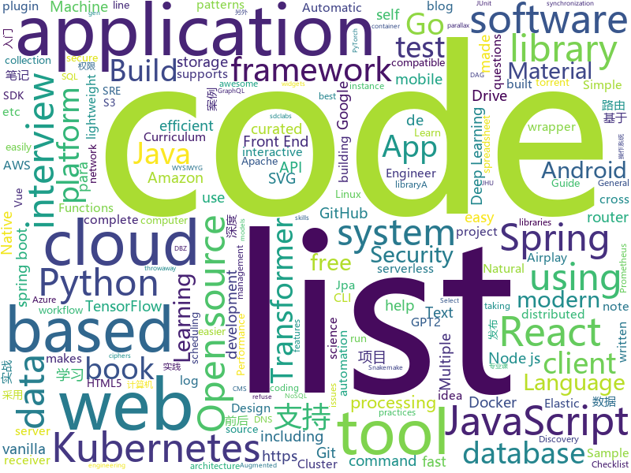

# 2020-02-13
See what the GitHub community is most excited about today.

## python
* [pymatting](https://github.com/pymatting/pymatting)(**94 stars today**): A Python library for alpha matting
* [DeepSpeed](https://github.com/microsoft/DeepSpeed)(**354 stars today**): DeepSpeed is a deep learning optimization library that makes distributed training easy, efficient, and effective.
* [text-to-text-transfer-transformer](https://github.com/google-research/text-to-text-transfer-transformer)(**42 stars today**): Code for the paper "Exploring the Limits of Transfer Learning with a Unified Text-to-Text Transformer"
* [c9-python-getting-started](https://github.com/microsoft/c9-python-getting-started)(**20 stars today**): Sample code for Channel 9 Python for Beginners course
* [devops-exercises](https://github.com/bregman-arie/devops-exercises)(**49 stars today**): Linux, Jenkins, AWS, SRE, Prometheus, Docker, Python, Ansible, Git, Kubernetes, Terraform, OpenStack, SQL, NoSQL, Azure, GCP, DNS, Elastic, Network, Virtualization
* [jd-automask](https://github.com/Rlacat/jd-automask)(**62 stars today**): 防护-京东口罩自动抢购并下单
* [transformers](https://github.com/huggingface/transformers)(**58 stars today**): 🤗Transformers: State-of-the-art Natural Language Processing for TensorFlow 2.0 and PyTorch.
* [diagrams](https://github.com/mingrammer/diagrams)(**323 stars today**): 🎨Diagram as Code for prototyping cloud system architectures
* [sentry](https://github.com/getsentry/sentry)(**30 stars today**): Sentry is cross-platform application monitoring, with a focus on error reporting.
* [riskquant](https://github.com/Netflix-Skunkworks/riskquant)(**7 stars today**): 
* [public-apis](https://github.com/public-apis/public-apis)(**50 stars today**): A collective list of free APIs for use in software and web development.
* [shadowsocks](https://github.com/edwardz246003/shadowsocks)(**116 stars today**): Redirect attack on Shadowsocks stream ciphers
* [python-keylogger-advanced](https://github.com/collinsmc23/python-keylogger-advanced)(**5 stars today**): "Advanced Keylogger" written in Python with features including taking screenshots, recording microphone, gather clipboard contents, and getting system information
* [camphr](https://github.com/PKSHATechnology-Research/camphr)(**43 stars today**): spaCy plugin for Transformers , Udify, ELmo, etc.
* [sqlmap](https://github.com/sqlmapproject/sqlmap)(**11 stars today**): Automatic SQL injection and database takeover tool
* [Deep-Learning-with-TensorFlow-book](https://github.com/dragen1860/Deep-Learning-with-TensorFlow-book)(**31 stars today**): 深度学习入门开源书，基于TensorFlow 2.0案例实战。Open source Deep Learning book, based on TensorFlow 2.0 framework.
* [reformer-pytorch](https://github.com/lucidrains/reformer-pytorch)(**5 stars today**): Reformer, the efficient Transformer, in Pytorch
* [mackup](https://github.com/lra/mackup)(**7 stars today**): Keep your application settings in sync (OS X/Linux)
* [python-telegram-bot](https://github.com/python-telegram-bot/python-telegram-bot)(**18 stars today**): We have made you a wrapper you can't refuse
* [spaCy](https://github.com/explosion/spaCy)(**35 stars today**): 💫Industrial-strength Natural Language Processing (NLP) with Python and Cython
* [sacred](https://github.com/IDSIA/sacred)(**8 stars today**): Sacred is a tool to help you configure, organize, log and reproduce experiments developed at IDSIA.
* [uvloop](https://github.com/MagicStack/uvloop)(**4 stars today**): Ultra fast asyncio event loop.
* [gpt2-ml](https://github.com/imcaspar/gpt2-ml)(**5 stars today**): GPT2 for Multiple Languages, including pretrained models. GPT2 多语言支持, 15亿参数中文预训练模型
* [PySyft](https://github.com/OpenMined/PySyft)(**22 stars today**): A library for encrypted, privacy preserving machine learning
* [TecoGAN](https://github.com/thunil/TecoGAN)(**11 stars today**): This repo will contain source code and materials for the TecoGAN project, i.e. code for a TEmporally COherent GAN

## java
* [ghidra](https://github.com/NationalSecurityAgency/ghidra)(**51 stars today**): Ghidra is a software reverse engineering (SRE) framework
* [Head-First-Design-Patterns](https://github.com/bethrobson/Head-First-Design-Patterns)(**23 stars today**): Code for Head First Design Patterns book (2014)
* [Signal-Android](https://github.com/signalapp/Signal-Android)(**6 stars today**): A private messenger for Android.
* [lottie-react-native](https://github.com/react-native-community/lottie-react-native)(**11 stars today**): Lottie wrapper for React Native.
* [library](https://github.com/ddd-by-examples/library)(**4 stars today**): A comprehensive Domain-Driven Design example with problem space strategic analysis and various tactical patterns.
* [flink](https://github.com/apache/flink)(**11 stars today**): Apache Flink
* [vaquarkhan](https://github.com/vaquarkhan/vaquarkhan)(**4 stars today**): 
* [h2o-3](https://github.com/h2oai/h2o-3)(**8 stars today**): Open Source Fast Scalable Machine Learning Platform For Smarter Applications: Deep Learning, Gradient Boosting & XGBoost, Random Forest, Generalized Linear Modeling (Logistic Regression, Elastic Net), K-Means, PCA, Stacked Ensembles, Automatic Machine Learning (AutoML), etc.
* [views-widgets-samples](https://github.com/android/views-widgets-samples)(**10 stars today**): Multiple samples showing the best practices in views-widgets on Android.
* [springBoot](https://github.com/527515025/springBoot)(**4 stars today**): springboot 框架与其它组件结合如 jpa、mybatis、websocket、security、shiro、cache等
* [jna](https://github.com/java-native-access/jna)(**3 stars today**): Java Native Access
* [tutorials](https://github.com/eugenp/tutorials)(**24 stars today**): Just Announced - "Learn Spring Security OAuth":
* [BetterBackdoor](https://github.com/ThatcherDev/BetterBackdoor)(**3 stars today**): A backdoor with a multitude of features.
* [testcontainers-java](https://github.com/testcontainers/testcontainers-java)(**4 stars today**): Testcontainers is a Java library that supports JUnit tests, providing lightweight, throwaway instances of common databases, Selenium web browsers, or anything else that can run in a Docker container.
* [retrofit](https://github.com/square/retrofit)(**15 stars today**): Type-safe HTTP client for Android and Java by Square, Inc.
* [spring-boot](https://github.com/spring-projects/spring-boot)(**29 stars today**): Spring Boot
* [debezium](https://github.com/debezium/debezium)(**8 stars today**): Change data capture for a variety of databases. Please log issues at https://issues.redhat.com/browse/DBZ.
* [eladmin](https://github.com/elunez/eladmin)(**10 stars today**): 项目基于 Spring Boot 2.1.0 、 Jpa、 Spring Security、redis、Vue的前后端分离的后台管理系统，项目采用分模块开发方式， 权限控制采用 RBAC，支持数据字典与数据权限管理，支持一键生成前后端代码，支持动态路由
* [InfectStatistic-main](https://github.com/kofyou/InfectStatistic-main)(**6 stars today**): 疫情统计-主仓库
* [lucene-solr](https://github.com/apache/lucene-solr)(**3 stars today**): Apache Lucene and Solr open-source search software
* [springdoc-openapi](https://github.com/springdoc/springdoc-openapi)(**5 stars today**): Library for OpenAPI 3 with spring-boot
* [incubator-dolphinscheduler](https://github.com/apache/incubator-dolphinscheduler)(**5 stars today**): Dolphin Scheduler is a distributed and easy-to-expand visual DAG workflow scheduling system, dedicated to solving the complex dependencies in data processing, making the scheduling system out of the box for data processing.(分布式易扩展的可视化工作流任务调度)
* [Discovery](https://github.com/Nepxion/Discovery)(**12 stars today**): 🐳Nepxion Discovery is an enhancement for Spring Cloud Discovery with gray release, router, weight, limitation, circuit breaker, degrade, isolation, monitor, tracing 灰度发布、路由、权重、限流、熔断、降级、隔离、监控、追踪
* [springboot-learning-example](https://github.com/JeffLi1993/springboot-learning-example)(**5 stars today**): spring boot 实践学习案例，是 spring boot 初学者及核心技术巩固的最佳实践。另外写博客，用 OpenWrite。
* [jacoco](https://github.com/jacoco/jacoco)(**5 stars today**): 🔬JaCoCo - Java Code Coverage Library

## unknown
* [app-ideas](https://github.com/florinpop17/app-ideas)(**786 stars today**): A Collection of application ideas which can be used to improve your coding skills.
* [Front-End-Performance-Checklist](https://github.com/thedaviddias/Front-End-Performance-Checklist)(**80 stars today**): 🎮The only Front-End Performance Checklist that runs faster than the others
* [COVID-19](https://github.com/CSSEGISandData/COVID-19)(**143 stars today**): Novel Coronavirus (COVID-19) Cases, provided by JHU CSSE
* [build-your-own-x](https://github.com/danistefanovic/build-your-own-x)(**281 stars today**): 🤓Build your own (insert technology here)
* [coding-interview-university](https://github.com/jwasham/coding-interview-university)(**58 stars today**): A complete computer science study plan to become a software engineer.
* [awesome-interview-questions](https://github.com/MaximAbramchuck/awesome-interview-questions)(**26 stars today**): A curated awesome list of lists of interview questions. Feel free to contribute!🎓
* [open-source-cs](https://github.com/ForrestKnight/open-source-cs)(**8 stars today**): Video discussing this curriculum:
* [MobileHackingCheatSheet](https://github.com/randorisec/MobileHackingCheatSheet)(**37 stars today**): Basics on commands/tools/info on how to assess the security of mobile applications
* [vagas](https://github.com/frontendbr/vagas)(**9 stars today**): 🔬Espaço para divulgação de vagas para front-enders.
* [awesome-database-learning](https://github.com/pingcap/awesome-database-learning)(**150 stars today**): A list of learning materials to understand databases internals
* [curriculum](https://github.com/cncf/curriculum)(**3 stars today**): 📚Open Source Curriculum for CNCF Certification Courses
* [Airplay-SDK](https://github.com/xfirefly/Airplay-SDK)(**85 stars today**): Airplay Receiver SDK supports Airplay Mirroring and AirPlay Casting to a receiver device.
* [project-based-learning](https://github.com/tuvtran/project-based-learning)(**55 stars today**): Curated list of project-based tutorials
* [computer-science](https://github.com/ossu/computer-science)(**35 stars today**): 🎓Path to a free self-taught education in Computer Science!
* [leetcode-curation-topical](https://github.com/fterh/leetcode-curation-topical)(**5 stars today**): Tech interview prep list
* [weekly](https://github.com/ruanyf/weekly)(**11 stars today**): 科技爱好者周刊，每周五发布
* [awesome-test-automation](https://github.com/atinfo/awesome-test-automation)(**5 stars today**): A curated list of awesome test automation frameworks, tools, libraries, and software for different programming languages. Sponsored by http://sdclabs.com
* [p1xt-guides](https://github.com/P1xt/p1xt-guides)(**9 stars today**): Programming curricula
* [jetbrain-activation-code](https://github.com/lubosson/jetbrain-activation-code)(**7 stars today**): jetbrain software全家桶激活码activation code, including intellij idea，pycharm，datagrip, webstorm...
* [prometheus](https://github.com/vegasbrianc/prometheus)(**6 stars today**): A docker-compose stack for Prometheus monitoring
* [You-Dont-Know-JS](https://github.com/getify/You-Dont-Know-JS)(**98 stars today**): A book series on JavaScript. @YDKJS on twitter.
* [CS-Xmind-Note](https://github.com/SSHeRun/CS-Xmind-Note)(**6 stars today**): 计算机专业课（408）思维导图和笔记：计算机组成原理（第五版 王爱英），数据结构（王道），计算机网络（第七版 谢希仁），操作系统（第四版 汤小丹）
* [sre-interview-prep-guide](https://github.com/mxssl/sre-interview-prep-guide)(**3 stars today**): Site Reliability Engineer Interview Preparation Guide
* [fancyss_history_package](https://github.com/hq450/fancyss_history_package)(**25 stars today**): 科学上网插件的离线安装包储存在这里
* [microfrontends](https://github.com/phodal/microfrontends)(**3 stars today**): Micro-frontend Architecture in Action-微前端的那些事儿

## javascript
* [Front-End-Checklist](https://github.com/thedaviddias/Front-End-Checklist)(**20 stars today**): 🗂The perfect Front-End Checklist for modern websites and meticulous developers
* [serverless](https://github.com/serverless/serverless)(**27 stars today**): Serverless Framework – Build web, mobile and IoT applications with serverless architectures using AWS Lambda, Azure Functions, Google CloudFunctions & more! –
* [BrasilAPI](https://github.com/filipedeschamps/BrasilAPI)(**88 stars today**): Vamos transformar o Brasil em uma API?
* [joplin](https://github.com/laurent22/joplin)(**62 stars today**): Joplin - an open source note taking and to-do application with synchronization capabilities for Windows, macOS, Linux, Android and iOS. Forum: https://discourse.joplinapp.org/
* [react-native](https://github.com/facebook/react-native)(**40 stars today**): A framework for building native apps with React.
* [tech-interview-handbook](https://github.com/yangshun/tech-interview-handbook)(**41 stars today**): 💯Materials to help you rock your next coding interview
* [jexcel](https://github.com/paulhodel/jexcel)(**5 stars today**): jExcel is a lightweight vanilla javascript plugin to create amazing web-based interactive tables and spreadsheets compatible with Excel or any other spreadsheet software.
* [front-end-interview-handbook](https://github.com/yangshun/front-end-interview-handbook)(**21 stars today**): 🕸Almost complete answers to "Front-end Job Interview Questions" which you can use to interview potential candidates, test yourself or completely ignore
* [react-tiger-transition](https://github.com/PedroBern/react-tiger-transition)(**38 stars today**): Full page transitions with react-router.
* [request](https://github.com/request/request)(**44 stars today**): 🏊🏾 Simplified HTTP request client.
* [CF-Worker-Dir](https://github.com/sleepwood/CF-Worker-Dir)(**32 stars today**): A web directories base on Cloudflare worker.
* [grokking_algorithms](https://github.com/egonSchiele/grokking_algorithms)(**8 stars today**): Code for the book Grokking Algorithms (https://amzn.to/29rVyHf)
* [vue2-happyfri](https://github.com/bailicangdu/vue2-happyfri)(**7 stars today**): vue2 + vue-router + vuex 入门项目
* [archerysec](https://github.com/archerysec/archerysec)(**5 stars today**): Centralize Vulnerability Assessment and Management for DevSecOps Team
* [meteor](https://github.com/meteor/meteor)(**10 stars today**): Meteor, the JavaScript App Platform
* [webdriverio](https://github.com/webdriverio/webdriverio)(**5 stars today**): Next-gen WebDriver test automation framework for Node.js
* [strapi](https://github.com/strapi/strapi)(**40 stars today**): 🚀Open source Node.js Headless CMS to easily build customisable APIs
* [potree](https://github.com/potree/potree)(**4 stars today**): WebGL point cloud viewer for large datasets
* [quill](https://github.com/quilljs/quill)(**21 stars today**): Quill is a modern WYSIWYG editor built for compatibility and extensibility.
* [react-vis](https://github.com/uber/react-vis)(**8 stars today**): Data Visualization Components
* [react-select](https://github.com/JedWatson/react-select)(**23 stars today**): The Select Component for React.js
* [stage.js](https://github.com/shakiba/stage.js)(**137 stars today**): 2D HTML5 rendering and layout engine for game development
* [create-react-library](https://github.com/transitive-bullshit/create-react-library)(**6 stars today**): ⚡CLI for easily creating reusable react libraries.
* [d3](https://github.com/d3/d3)(**24 stars today**): Bring data to life with SVG, Canvas and HTML.📊📈🎉
* [ethereumbook](https://github.com/ethereumbook/ethereumbook)(**5 stars today**): Mastering Ethereum, by Andreas M. Antonopoulos, Gavin Wood

## html
* [html](https://github.com/whatwg/html)(**67 stars today**): HTML Standard
* [hyperblog](https://github.com/freddier/hyperblog)(**6 stars today**): Un blog increíble para el curso de Git y Github de Platzi
* [rstudio-conf](https://github.com/rstudio/rstudio-conf)(**7 stars today**): Materials for rstudio::conf
* [attnvis](https://github.com/SIDN-IAP/attnvis)(**2 stars today**): Minimal Interactive Attention Visualization
* [cv](https://github.com/nstrayer/cv)(**13 stars today**): My CV built using RMarkdown and the pagedown package.
* [www-community](https://github.com/OWASP/www-community)(**3 stars today**): 
* [mxgraph](https://github.com/jgraph/mxgraph)(**7 stars today**): mxGraph is a fully client side JavaScript diagramming library
* [OpenClash](https://github.com/vernesong/OpenClash)(**10 stars today**): A Clash Client For OpenWrt
* [free-for-dev](https://github.com/ripienaar/free-for-dev)(**95 stars today**): A list of SaaS, PaaS and IaaS offerings that have free tiers of interest to devops and infradev
* [zenbot](https://github.com/DeviaVir/zenbot)(**5 stars today**): Zenbot is a command-line cryptocurrency trading bot using Node.js and MongoDB.
* [JavaScript30](https://github.com/wesbos/JavaScript30)(**12 stars today**): 30 Day Vanilla JS Challenge
* [flag-icon-css](https://github.com/lipis/flag-icon-css)(**6 stars today**): 🎏A collection of all country flags in SVG — plus the CSS for easier integration
* [deeplearning_ai_books](https://github.com/fengdu78/deeplearning_ai_books)(**8 stars today**): deeplearning.ai（吴恩达老师的深度学习课程笔记及资源）
* [ecma262](https://github.com/tc39/ecma262)(**8 stars today**): Status, process, and documents for ECMA-262
* [snakemake](https://github.com/snakemake/snakemake)(**2 stars today**): This is the development home of the workflow management system Snakemake. For general information, see
* [hugo-coder](https://github.com/luizdepra/hugo-coder)(**2 stars today**): A minimalist blog theme for hugo.
* [cs231n.github.io](https://github.com/cs231n/cs231n.github.io)(**3 stars today**): Public facing notes page
* [Guide-RGPD-du-developpeur](https://github.com/LINCnil/Guide-RGPD-du-developpeur)(**10 stars today**): La CNIL publie un guide RGPD pour les développeurs
* [AR.js](https://github.com/jeromeetienne/AR.js)(**13 stars today**): Efficient Augmented Reality for the Web - 60fps on mobile!
* [ec2instances.info](https://github.com/powdahound/ec2instances.info)(**3 stars today**): Amazon EC2 instance comparison site
* [rellax](https://github.com/dixonandmoe/rellax)(**6 stars today**): Lightweight, vanilla javascript parallax library
* [aws-well-architected-labs](https://github.com/awslabs/aws-well-architected-labs)(**1 stars today**): Hands on labs and code to help you learn, measure, and build using architectural best practices.
* [flutter-in-action](https://github.com/flutterchina/flutter-in-action)(**9 stars today**): 《Flutter实战》电子书
* [proposal-optional-chaining](https://github.com/tc39/proposal-optional-chaining)(**6 stars today**): 
* [simple-icons](https://github.com/simple-icons/simple-icons)(**9 stars today**): SVG icons for popular brands

## go
* [cli](https://github.com/cli/cli)(**945 stars today**): The GitHub CLI
* [fyne](https://github.com/fyne-io/fyne)(**179 stars today**): Cross platform GUI in Go based on Material Design
* [tailscale](https://github.com/tailscale/tailscale)(**210 stars today**): Private WireGuard networks made easy
* [k9s](https://github.com/derailed/k9s)(**18 stars today**): 🐶Kubernetes CLI To Manage Your Clusters In Style!
* [dashboard](https://github.com/kubernetes/dashboard)(**10 stars today**): General-purpose web UI for Kubernetes clusters
* [skmz](https://github.com/Shpota/skmz)(**20 stars today**): A GraphQL-based Web App written with Go, React and MongoDB
* [kiosk](https://github.com/kiosk-sh/kiosk)(**21 stars today**): kiosk🏢Multi-Tenancy Extension For Kubernetes - Secure Cluster Sharing & Self-Service Namespace Provisioning
* [cloud-torrent](https://github.com/jpillora/cloud-torrent)(**7 stars today**): ☁️Cloud Torrent: a self-hosted remote torrent client
* [restic](https://github.com/restic/restic)(**12 stars today**): Fast, secure, efficient backup program
* [kubebuilder](https://github.com/kubernetes-sigs/kubebuilder)(**8 stars today**): Kubebuilder - SDK for building Kubernetes APIs using CRDs
* [esbuild](https://github.com/evanw/esbuild)(**136 stars today**): An extremely fast JavaScript bundler and minifier
* [micro](https://github.com/zyedidia/micro)(**11 stars today**): A modern and intuitive terminal-based text editor
* [community](https://github.com/kubernetes/community)(**9 stars today**): Kubernetes community content
* [ssh](https://github.com/gliderlabs/ssh)(**99 stars today**): Easy SSH servers in Golang
* [simdjson-go](https://github.com/minio/simdjson-go)(**120 stars today**): Golang port of simdjson: parsing gigabytes of JSON per second
* [hub](https://github.com/github/hub)(**43 stars today**): A command-line tool that makes git easier to use with GitHub.
* [installer](https://github.com/openshift/installer)(**1 stars today**): Install an OpenShift cluster
* [protobuf](https://github.com/gogo/protobuf)(**7 stars today**): Protocol Buffers for Go with Gadgets
* [dnscontrol](https://github.com/StackExchange/dnscontrol)(**8 stars today**): Synchronize your DNS to multiple providers from a simple DSL
* [velero](https://github.com/vmware-tanzu/velero)(**6 stars today**): Backup and migrate Kubernetes applications and their persistent volumes
* [minio](https://github.com/minio/minio)(**19 stars today**): MinIO is a high performance object storage server compatible with Amazon S3 APIs
* [vegeta](https://github.com/tsenart/vegeta)(**15 stars today**): HTTP load testing tool and library. It's over 9000!
* [faas](https://github.com/openfaas/faas)(**18 stars today**): OpenFaaS - Serverless Functions Made Simple
* [rclone](https://github.com/rclone/rclone)(**26 stars today**): "rsync for cloud storage" - Google Drive, Amazon Drive, S3, Dropbox, Backblaze B2, One Drive, Swift, Hubic, Cloudfiles, Google Cloud Storage, Yandex Files
* [lorca](https://github.com/zserge/lorca)(**5 stars today**): Build cross-platform modern desktop apps in Go + HTML5

## WordCloud

