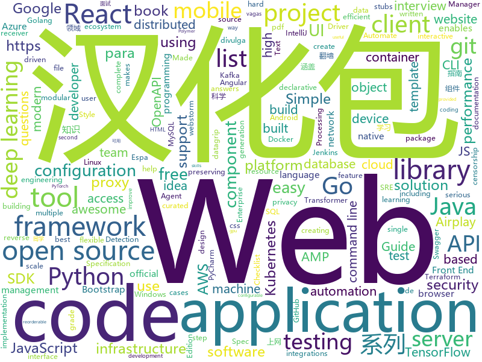

# 2020-02-14
See what the GitHub community is most excited about today.

## python
* [DeepSpeed](https://github.com/microsoft/DeepSpeed)(**262 stars today**): DeepSpeed is a deep learning optimization library that makes distributed training easy, efficient, and effective.
* [PySyft](https://github.com/OpenMined/PySyft)(**25 stars today**): A library for encrypted, privacy preserving machine learning
* [pymatting](https://github.com/pymatting/pymatting)(**120 stars today**): A Python library for alpha matting
* [text-to-text-transfer-transformer](https://github.com/google-research/text-to-text-transfer-transformer)(**49 stars today**): Code for the paper "Exploring the Limits of Transfer Learning with a Unified Text-to-Text Transformer"
* [confluent-kafka-python](https://github.com/confluentinc/confluent-kafka-python)(**4 stars today**): Confluent's Kafka Python Client
* [salt](https://github.com/saltstack/salt)(**8 stars today**): Software to automate the management and configuration of any infrastructure or application at scale. Get access to the Salt software package repository here:
* [mypy](https://github.com/python/mypy)(**11 stars today**): Optional static typing for Python 3 and 2 (PEP 484)
* [devops-exercises](https://github.com/bregman-arie/devops-exercises)(**96 stars today**): Linux, Jenkins, AWS, SRE, Prometheus, Docker, Python, Ansible, Git, Kubernetes, Terraform, OpenStack, SQL, NoSQL, Azure, GCP, DNS, Elastic, Network, Virtualization
* [sonnet](https://github.com/deepmind/sonnet)(**16 stars today**): TensorFlow-based neural network library
* [shadowsocks](https://github.com/edwardz246003/shadowsocks)(**81 stars today**): Redirect attack on Shadowsocks stream ciphers
* [c9-python-getting-started](https://github.com/microsoft/c9-python-getting-started)(**24 stars today**): Sample code for Channel 9 Python for Beginners course
* [SeleniumBase](https://github.com/seleniumbase/SeleniumBase)(**56 stars today**): ✅Easy Web UI Testing with Selenium & pytest🚀
* [keras](https://github.com/keras-team/keras)(**24 stars today**): Deep Learning for humans
* [transformers](https://github.com/huggingface/transformers)(**78 stars today**): 🤗Transformers: State-of-the-art Natural Language Processing for TensorFlow 2.0 and PyTorch.
* [netbox](https://github.com/netbox-community/netbox)(**8 stars today**): IP address management (IPAM) and data center infrastructure management (DCIM) tool.
* [PythonPlantsVsZombies](https://github.com/marblexu/PythonPlantsVsZombies)(**27 stars today**): a simple PlantsVsZombies game
* [django](https://github.com/django/django)(**39 stars today**): The Web framework for perfectionists with deadlines.
* [Pytorch_Retinaface](https://github.com/biubug6/Pytorch_Retinaface)(**4 stars today**): Retinaface get 80.99% in widerface hard val using mobilenet0.25.
* [TensorFlow-Object-Detection-API-Tutorial-Train-Multiple-Objects-Windows-10](https://github.com/EdjeElectronics/TensorFlow-Object-Detection-API-Tutorial-Train-Multiple-Objects-Windows-10)(**6 stars today**): How to train a TensorFlow Object Detection Classifier for multiple object detection on Windows
* [justpy](https://github.com/elimintz/justpy)(**74 stars today**): An object oriented high-level Python Web Framework that requires no frontend programming
* [robotframework](https://github.com/robotframework/robotframework)(**6 stars today**): Generic automation framework for acceptance testing and RPA
* [integrations-core](https://github.com/DataDog/integrations-core)(**2 stars today**): Core integrations of the Datadog Agent
* [diagrams](https://github.com/mingrammer/diagrams)(**174 stars today**): 🎨Diagram as Code for prototyping cloud system architectures
* [d2l-en](https://github.com/d2l-ai/d2l-en)(**20 stars today**): Dive into Deep Learning: an interactive deep learning book with code, math, and discussions, based on the NumPy interface.
* [incubator-tvm](https://github.com/apache/incubator-tvm)(**7 stars today**): Open deep learning compiler stack for cpu, gpu and specialized accelerators

## java
* [BigData-Notes](https://github.com/heibaiying/BigData-Notes)(**58 stars today**): 大数据入门指南⭐️
* [swagger-core](https://github.com/swagger-api/swagger-core)(**5 stars today**): Examples and server integrations for generating the Swagger API Specification, which enables easy access to your REST API
* [spring-boot](https://github.com/spring-projects/spring-boot)(**34 stars today**): Spring Boot
* [incubator-hudi](https://github.com/apache/incubator-hudi)(**4 stars today**): Upserts And Incremental Processing on Big Data
* [ghidra](https://github.com/NationalSecurityAgency/ghidra)(**58 stars today**): Ghidra is a software reverse engineering (SRE) framework
* [spring-framework](https://github.com/spring-projects/spring-framework)(**20 stars today**): Spring Framework
* [aws-sdk-java](https://github.com/aws/aws-sdk-java)(**0 stars today**): The official AWS SDK for Java.
* [quarkus](https://github.com/quarkusio/quarkus)(**14 stars today**): Quarkus: Supersonic Subatomic Java.
* [configuration-as-code-plugin](https://github.com/jenkinsci/configuration-as-code-plugin)(**4 stars today**): Jenkins Configuration as Code Plugin
* [openapi-generator](https://github.com/OpenAPITools/openapi-generator)(**14 stars today**): OpenAPI Generator allows generation of API client libraries (SDK generation), server stubs, documentation and configuration automatically given an OpenAPI Spec (v2, v3)
* [aws-cf-templates](https://github.com/widdix/aws-cf-templates)(**3 stars today**): Free Templates for AWS CloudFormation
* [springBoot](https://github.com/527515025/springBoot)(**15 stars today**): springboot 框架与其它组件结合如 jpa、mybatis、websocket、security、shiro、cache等
* [aem-core-wcm-components](https://github.com/adobe/aem-core-wcm-components)(**0 stars today**): Adobe Experience Manager (AEM) Sites Core Components - flexible, extensible, and feature-rich components to build sites
* [schema-registry](https://github.com/confluentinc/schema-registry)(**4 stars today**): Confluent Schema Registry for Kafka
* [JavaGuide](https://github.com/Snailclimb/JavaGuide)(**64 stars today**): 【Java学习+面试指南】 一份涵盖大部分Java程序员所需要掌握的核心知识。
* [mockito](https://github.com/mockito/mockito)(**9 stars today**): Most popular Mocking framework for unit tests written in Java
* [flink](https://github.com/apache/flink)(**12 stars today**): Apache Flink
* [FizzBuzzEnterpriseEdition](https://github.com/EnterpriseQualityCoding/FizzBuzzEnterpriseEdition)(**11 stars today**): FizzBuzz Enterprise Edition is a no-nonsense implementation of FizzBuzz made by serious businessmen for serious business purposes.
* [DataX](https://github.com/alibaba/DataX)(**9 stars today**): 
* [druid](https://github.com/apache/druid)(**10 stars today**): Apache Druid: a high performance real-time analytics database.
* [karate](https://github.com/intuit/karate)(**42 stars today**): Test Automation Made Simple
* [seata](https://github.com/seata/seata)(**13 stars today**): 🔥Seata is an easy-to-use, high-performance, open source distributed transaction solution.
* [selenium](https://github.com/SeleniumHQ/selenium)(**13 stars today**): A browser automation framework and ecosystem.
* [checkstyle](https://github.com/checkstyle/checkstyle)(**5 stars today**): Checkstyle is a development tool to help programmers write Java code that adheres to a coding standard. By default it supports the Google Java Style Guide and Sun Code Conventions, but is highly configurable. It can be invoked with an ANT task and a command line program.
* [react-native-navigation](https://github.com/wix/react-native-navigation)(**8 stars today**): A complete native navigation solution for React Native

## unknown
* [b1fipl](https://github.com/marcpaq/b1fipl)(**246 stars today**): A Bestiary of Single-File Implementations of Programming Languages
* [app-ideas](https://github.com/florinpop17/app-ideas)(**395 stars today**): A Collection of application ideas which can be used to improve your coding skills.
* [Airplay-SDK](https://github.com/xfirefly/Airplay-SDK)(**81 stars today**): Airplay Receiver SDK supports Airplay Mirroring and AirPlay Casting to a receiver device.
* [Front-End-Performance-Checklist](https://github.com/thedaviddias/Front-End-Performance-Checklist)(**135 stars today**): 🎮The only Front-End Performance Checklist that runs faster than the others
* [COVID-19](https://github.com/CSSEGISandData/COVID-19)(**140 stars today**): Novel Coronavirus (COVID-19) Cases, provided by JHU CSSE
* [coding-interview-university](https://github.com/jwasham/coding-interview-university)(**97 stars today**): A complete computer science study plan to become a software engineer.
* [you-dont-know-js-ru](https://github.com/azat-io/you-dont-know-js-ru)(**6 stars today**): 📚Russian translation of "You Don't Know JS" book series
* [laravel-best-practices](https://github.com/alexeymezenin/laravel-best-practices)(**60 stars today**): Laravel best practices
* [awesome-tflite](https://github.com/margaretmz/awesome-tflite)(**25 stars today**): A curated list of awesome TensorFlow Lite models, samples, tutorials, tools and learning resources.
* [awesome-interview-questions](https://github.com/MaximAbramchuck/awesome-interview-questions)(**80 stars today**): A curated awesome list of lists of interview questions. Feel free to contribute!🎓
* [OpenAPI-Specification](https://github.com/OAI/OpenAPI-Specification)(**14 stars today**): The OpenAPI Specification Repository
* [Xiaomi_Kernel_OpenSource](https://github.com/MiCode/Xiaomi_Kernel_OpenSource)(**32 stars today**): Xiaomi Mobile Phone Kernel OpenSource
* [angular-interview-questions](https://github.com/sudheerj/angular-interview-questions)(**4 stars today**): List of 300 Angular Interview Questions and answers[WIP]
* [Blog](https://github.com/mqyqingfeng/Blog)(**10 stars today**): 冴羽写博客的地方，预计写四个系列：JavaScript深入系列、JavaScript专题系列、ES6系列、React系列。
* [jetbrain-activation-code](https://github.com/lubosson/jetbrain-activation-code)(**5 stars today**): jetbrain software全家桶激活码activation code, including intellij idea，pycharm，datagrip, webstorm...
* [react-typescript-cheatsheet](https://github.com/typescript-cheatsheets/react-typescript-cheatsheet)(**34 stars today**): Cheatsheets for experienced React developers getting started with TypeScript
* [vagas](https://github.com/backend-br/vagas)(**4 stars today**): ✌️Espaço para divulgação de vagas para backenders
* [YubiKey-Guide](https://github.com/drduh/YubiKey-Guide)(**8 stars today**): Guide to using YubiKey for GPG and SSH
* [the-art-of-command-line](https://github.com/jlevy/the-art-of-command-line)(**59 stars today**): Master the command line, in one page
* [vagas](https://github.com/frontendbr/vagas)(**8 stars today**): 🔬Espaço para divulgação de vagas para front-enders.
* [devmap](https://github.com/zualex/devmap)(**4 stars today**): Карта развития веб-разработчика
* [for-win](https://github.com/docker/for-win)(**3 stars today**): Bug reports for Docker Desktop for Windows
* [JavaFamily](https://github.com/AobingJava/JavaFamily)(**54 stars today**): 【互联网一线大厂面试+学习指南】进阶知识完全扫盲：涵盖高并发、分布式、高可用、微服务等领域知识，作者风格幽默，看起来津津有味，把学习当做一种乐趣，何乐而不为，后端同学必看，前端同学我保证你也看得懂，看不懂你加我微信骂我渣男就好了。
* [kubernetes-the-hard-way](https://github.com/kelseyhightower/kubernetes-the-hard-way)(**14 stars today**): Bootstrap Kubernetes the hard way on Google Cloud Platform. No scripts.
* [hackthebox-writeups](https://github.com/Hackplayers/hackthebox-writeups)(**5 stars today**): Writeups for HacktheBox 'boot2root' machines

## javascript
* [chakra-ui](https://github.com/chakra-ui/chakra-ui)(**134 stars today**): ⚡️Simple, Modular & Accessible UI Components for your React Applications
* [jamstack-ecommerce](https://github.com/jamstack-cms/jamstack-ecommerce)(**98 stars today**): A starter project for building performant ECommerce applications with Gatsby and React
* [Front-End-Checklist](https://github.com/thedaviddias/Front-End-Checklist)(**104 stars today**): 🗂The perfect Front-End Checklist for modern websites and meticulous developers
* [serverless](https://github.com/serverless/serverless)(**95 stars today**): Serverless Framework – Build web, mobile and IoT applications with serverless architectures using AWS Lambda, Azure Functions, Google CloudFunctions & more! –
* [react](https://github.com/facebook/react)(**72 stars today**): A declarative, efficient, and flexible JavaScript library for building user interfaces.
* [cypress-example-recipes](https://github.com/cypress-io/cypress-example-recipes)(**6 stars today**): Various recipes for testing common scenarios with Cypress
* [baucua](https://github.com/conanak99/baucua)(**17 stars today**): 
* [release-it](https://github.com/release-it/release-it)(**27 stars today**): 🚀Automate versioning and package publishing
* [joplin](https://github.com/laurent22/joplin)(**56 stars today**): Joplin - an open source note taking and to-do application with synchronization capabilities for Windows, macOS, Linux, Android and iOS. Forum: https://discourse.joplinapp.org/
* [generator-jhipster](https://github.com/jhipster/generator-jhipster)(**11 stars today**): Open Source application platform for creating Spring Boot + Angular/React projects in seconds!
* [Rocket.Chat](https://github.com/RocketChat/Rocket.Chat)(**15 stars today**): The ultimate Free Open Source Solution for team communications.
* [mapbox-gl-js](https://github.com/mapbox/mapbox-gl-js)(**9 stars today**): Interactive, thoroughly customizable maps in the browser, powered by vector tiles and WebGL
* [noVNC](https://github.com/novnc/noVNC)(**7 stars today**): VNC client web application
* [graphql-engine](https://github.com/hasura/graphql-engine)(**26 stars today**): Blazing fast, instant realtime GraphQL APIs on Postgres with fine grained access control, also trigger webhooks on database events.
* [Sortable](https://github.com/SortableJS/Sortable)(**7 stars today**): Sortable — is a JavaScript library for reorderable drag-and-drop lists on modern browsers and touch devices. No jQuery required. Supports Meteor, AngularJS, React, Polymer, Vue, Ember, Knockout and any CSS library, e.g. Bootstrap.
* [pdf.js](https://github.com/mozilla/pdf.js)(**21 stars today**): PDF Reader in JavaScript
* [react-virtualized](https://github.com/bvaughn/react-virtualized)(**16 stars today**): React components for efficiently rendering large lists and tabular data
* [amphtml](https://github.com/ampproject/amphtml)(**4 stars today**): The AMP web component framework. Please give us your feedback on AMP @ https://go.amp.dev/devx-survey
* [vant-weapp](https://github.com/youzan/vant-weapp)(**16 stars today**): 轻量、可靠的小程序 UI 组件库
* [Rocket.Chat.ReactNative](https://github.com/RocketChat/Rocket.Chat.ReactNative)(**2 stars today**): Rocket.Chat mobile clients
* [fanqiang](https://github.com/bannedbook/fanqiang)(**35 stars today**): 翻墙-科学上网
* [weui-wxss](https://github.com/Tencent/weui-wxss)(**11 stars today**): A UI library by WeChat official design team, includes the most useful widgets/modules.
* [node-postgres](https://github.com/brianc/node-postgres)(**7 stars today**): PostgreSQL client for node.js.
* [openlayers](https://github.com/openlayers/openlayers)(**6 stars today**): OpenLayers
* [next.js](https://github.com/zeit/next.js)(**45 stars today**): The React Framework

## html
* [csswg-drafts](https://github.com/w3c/csswg-drafts)(**5 stars today**): CSS Working Group Editor Drafts
* [html](https://github.com/whatwg/html)(**82 stars today**): HTML Standard
* [wpt](https://github.com/web-platform-tests/wpt)(**1 stars today**): Test suites for Web platform specs — including WHATWG, W3C, and others
* [calico](https://github.com/projectcalico/calico)(**3 stars today**): Cloud native connectivity and network policy
* [SVG-Loaders](https://github.com/SamHerbert/SVG-Loaders)(**21 stars today**): Loading icons and small animations built with pure SVG.
* [Home-Assistant-Dashboard](https://github.com/tuanha2000vn/Home-Assistant-Dashboard)(**1 stars today**): 
* [webdevbootcamp](https://github.com/nax3t/webdevbootcamp)(**3 stars today**): All source code for back-end projects from the Web Developer Bootcamp
* [foundation-emails](https://github.com/foundation/foundation-emails)(**2 stars today**): Quickly create responsive HTML emails that work on any device and client. Even Outlook.
* [owasp-mstg](https://github.com/OWASP/owasp-mstg)(**8 stars today**): The Mobile Security Testing Guide (MSTG) is a comprehensive manual for mobile app security development, testing and reverse engineering.
* [Front-end-Developer-Interview-Questions](https://github.com/h5bp/Front-end-Developer-Interview-Questions)(**17 stars today**): A list of helpful front-end related questions you can use to interview potential candidates, test yourself or completely ignore.
* [ecma262](https://github.com/tc39/ecma262)(**7 stars today**): Status, process, and documents for ECMA-262
* [django-DefectDojo](https://github.com/DefectDojo/django-DefectDojo)(**3 stars today**): DefectDojo is an open-source application vulnerability correlation and security orchestration tool.
* [tabler](https://github.com/tabler/tabler)(**8 stars today**): Tabler is free and open-source HTML Dashboard UI Kit built on Bootstrap
* [bulma-templates](https://github.com/BulmaTemplates/bulma-templates)(**3 stars today**): free flexbox templates built with the bulma css framework
* [dragon-book-exercise-answers](https://github.com/fool2fish/dragon-book-exercise-answers)(**3 stars today**): Compilers Principles, Techniques, & Tools (purple dragon book) second edition exercise answers. 编译原理（紫龙书）第2版习题答案。
* [JavaScript30](https://github.com/wesbos/JavaScript30)(**14 stars today**): 30 Day Vanilla JS Challenge
* [Awesome-CS-Books](https://github.com/wx-chevalier/Awesome-CS-Books)(**4 stars today**): 📚Awesome CS Books/Series(.pdf by git lfs) Warehouse for Geeks, ProgrammingLanguage, SoftwareEngineering, Web, AI, ServerSideApplication, Infrastructure, FE etc.💫优秀计算机科学与技术领域相关的书籍归档。
* [web-advertising](https://github.com/w3c/web-advertising)(**2 stars today**): Web Advertising BG
* [swagger-codegen](https://github.com/swagger-api/swagger-codegen)(**8 stars today**): swagger-codegen contains a template-driven engine to generate documentation, API clients and server stubs in different languages by parsing your OpenAPI / Swagger definition.
* [startbootstrap-sb-admin](https://github.com/BlackrockDigital/startbootstrap-sb-admin)(**2 stars today**): A free, open source, Bootstrap admin theme created by Start Bootstrap
* [aws-well-architected-labs](https://github.com/awslabs/aws-well-architected-labs)(**1 stars today**): Hands on labs and code to help you learn, measure, and build using architectural best practices.
* [devopsdays-web](https://github.com/devopsdays/devopsdays-web)(**0 stars today**): This is the website for devopsdays
* [intro.js](https://github.com/usablica/intro.js)(**7 stars today**): A better way for new feature introduction and step-by-step users guide for your website and project.
* [OneList](https://github.com/MoeClub/OneList)(**5 stars today**): Simple index for onedrive
* [TranslatorX](https://github.com/pingfangx/TranslatorX)(**16 stars today**): JetBrains 系列软件汉化包 关键字: Android Studio 3.5 汉化包 CLion 2019.3 汉化包 DataGrip 2019.3 汉化包 GoLand 2019.3 汉化包 IntelliJ IDEA 2019.3 汉化包 PhpStorm 2019.3 汉化包 PyCharm 2019.3 汉化包 Rider 2019.3 汉化包 RubyMine 2019.3 汉化包 WebStorm 2019.3 汉化包

## go
* [cli](https://github.com/cli/cli)(**1,257 stars today**): The GitHub CLI
* [broxy](https://github.com/rhaidiz/broxy)(**181 stars today**): An HTTP/HTTPS intercept proxy written in Go.
* [kubernetes](https://github.com/kubernetes/kubernetes)(**55 stars today**): Production-Grade Container Scheduling and Management
* [charts](https://github.com/helm/charts)(**20 stars today**): Curated applications for Kubernetes
* [lantern](https://github.com/getlantern/lantern)(**65 stars today**): Lantern官方版本下载 蓝灯 翻墙 代理 科学上网 外网 加速器 梯子 路由 lantern proxy vpn censorship-circumvention censorship gfw accelerator
* [hub](https://github.com/github/hub)(**50 stars today**): A command-line tool that makes git easier to use with GitHub.
* [ssh](https://github.com/gliderlabs/ssh)(**42 stars today**): Easy SSH servers in Golang
* [aws-sdk-go](https://github.com/aws/aws-sdk-go)(**2 stars today**): AWS SDK for the Go programming language.
* [k9s](https://github.com/derailed/k9s)(**21 stars today**): 🐶Kubernetes CLI To Manage Your Clusters In Style!
* [packer](https://github.com/hashicorp/packer)(**12 stars today**): Packer is a tool for creating identical machine images for multiple platforms from a single source configuration.
* [argo](https://github.com/argoproj/argo)(**12 stars today**): Argo Workflows: Get stuff done with Kubernetes.
* [go](https://github.com/golang/go)(**52 stars today**): The Go programming language
* [mysql](https://github.com/go-sql-driver/mysql)(**6 stars today**): Go MySQL Driver is a MySQL driver for Go's (golang) database/sql package
* [mosn](https://github.com/mosn/mosn)(**2 stars today**): MOSN is a powerful cloud-native proxy acts as a edge proxy or service mesh's data plane. https://mosn.io
* [terraform](https://github.com/hashicorp/terraform)(**28 stars today**): Terraform enables you to safely and predictably create, change, and improve infrastructure. It is an open source tool that codifies APIs into declarative configuration files that can be shared amongst team members, treated as code, edited, reviewed, and versioned.
* [telegraf](https://github.com/influxdata/telegraf)(**3 stars today**): The plugin-driven server agent for collecting & reporting metrics.
* [gorm](https://github.com/jinzhu/gorm)(**17 stars today**): The fantastic ORM library for Golang, aims to be developer friendly
* [protobuf](https://github.com/golang/protobuf)(**8 stars today**): Go support for Google's protocol buffers
* [eksctl](https://github.com/weaveworks/eksctl)(**6 stars today**): The official CLI for Amazon EKS
* [fabric](https://github.com/hyperledger/fabric)(**10 stars today**): Hyperledger Fabric is an enterprise-grade permissioned distributed ledger framework for developing solutions and applications. Its modular and versatile design satisfies a broad range of industry use cases. It offers a unique approach to consensus that enables performance at scale while preserving privacy.
* [gitea](https://github.com/go-gitea/gitea)(**44 stars today**): Git with a cup of tea, painless self-hosted git service
* [moby](https://github.com/moby/moby)(**16 stars today**): Moby Project - a collaborative project for the container ecosystem to assemble container-based systems
* [cobra](https://github.com/spf13/cobra)(**20 stars today**): A Commander for modern Go CLI interactions
* [go-grpc-middleware](https://github.com/grpc-ecosystem/go-grpc-middleware)(**4 stars today**): Golang gRPC Middlewares: interceptor chaining, auth, logging, retries and more.
* [terraform-provider-azurerm](https://github.com/terraform-providers/terraform-provider-azurerm)(**5 stars today**): Terraform provider for Azure Resource Manager

## WordCloud

