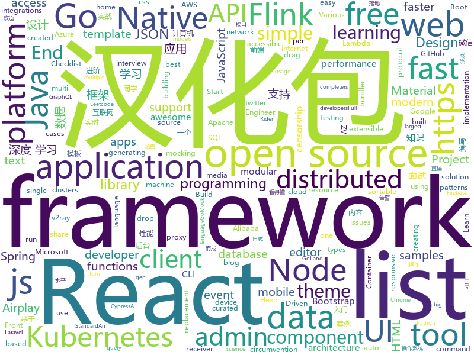

# 2020-02-15
See what the GitHub community is most excited about today.

## java
* [spring-boot](https://github.com/spring-projects/spring-boot)(**33 stars today**): Spring Boot
* [RIBs](https://github.com/uber/RIBs)(**7 stars today**): Uber's cross-platform mobile architecture framework.
* [BigData-Notes](https://github.com/heibaiying/BigData-Notes)(**87 stars today**): 大数据入门指南⭐️
* [fastjson](https://github.com/alibaba/fastjson)(**14 stars today**): A fast JSON parser/generator for Java.
* [DataX](https://github.com/alibaba/DataX)(**8 stars today**): 
* [react-native-share](https://github.com/react-native-community/react-native-share)(**2 stars today**): Social share, sending simple data to other apps.
* [dubbo-spring-boot-project](https://github.com/apache/dubbo-spring-boot-project)(**2 stars today**): Spring Boot Project for Apache Dubbo
* [feign](https://github.com/OpenFeign/feign)(**10 stars today**): Feign makes writing java http clients easier
* [spring-cloud-alibaba](https://github.com/alibaba/spring-cloud-alibaba)(**13 stars today**): Spring Cloud Alibaba provides a one-stop solution for application development for the distributed solutions of Alibaba middleware.
* [flink-learning](https://github.com/zhisheng17/flink-learning)(**15 stars today**): flink learning blog. http://www.54tianzhisheng.cn 含 Flink 入门、概念、原理、实战、性能调优、源码解析等内容。涉及 Flink Connector、Metrics、Library、DataStream API、Table API & SQL 等内容的学习案例，还有 Flink 落地应用的大型项目案例（PVUV、日志存储、百亿数据实时去重、监控告警）分享。欢迎大家支持我的专栏《大数据实时计算引擎 Flink 实战与性能优化》
* [react-native-push-notification](https://github.com/zo0r/react-native-push-notification)(**4 stars today**): React Native Local and Remote Notifications
* [debezium](https://github.com/debezium/debezium)(**8 stars today**): Change data capture for a variety of databases. Please log issues at https://issues.redhat.com/browse/DBZ.
* [elasticsearch](https://github.com/elastic/elasticsearch)(**26 stars today**): Open Source, Distributed, RESTful Search Engine
* [hazelcast](https://github.com/hazelcast/hazelcast)(**9 stars today**): Open Source In-Memory Data Grid
* [swagger-core](https://github.com/swagger-api/swagger-core)(**14 stars today**): Examples and server integrations for generating the Swagger API Specification, which enables easy access to your REST API
* [jsonschema2pojo](https://github.com/joelittlejohn/jsonschema2pojo)(**2 stars today**): Generate Java types from JSON or JSON Schema and annotates those types for data-binding with Jackson, Gson, etc
* [ExoPlayer](https://github.com/google/ExoPlayer)(**10 stars today**): An extensible media player for Android
* [library](https://github.com/ddd-by-examples/library)(**7 stars today**): A comprehensive Domain-Driven Design example with problem space strategic analysis and various tactical patterns.
* [presto](https://github.com/prestodb/presto)(**6 stars today**): The official home of the Presto distributed SQL query engine for big data
* [graal](https://github.com/oracle/graal)(**11 stars today**): GraalVM: Run Programs Faster Anywhere🚀
* [druid](https://github.com/apache/druid)(**8 stars today**): Apache Druid: a high performance real-time analytics database.
* [CS-Notes](https://github.com/CyC2018/CS-Notes)(**101 stars today**): 📚技术面试必备基础知识、Leetcode、计算机操作系统、计算机网络、系统设计、Java、Python、C++
* [react-native-image-picker](https://github.com/react-native-community/react-native-image-picker)(**5 stars today**): 🌄A React Native module that allows you to use native UI to select media from the device library or directly from the camera.
* [NetGuard](https://github.com/M66B/NetGuard)(**5 stars today**): A simple way to block access to the internet per app
* [wiremock](https://github.com/tomakehurst/wiremock)(**4 stars today**): A tool for mocking HTTP services

## unknown
* [nodejs-cli-apps-best-practices](https://github.com/lirantal/nodejs-cli-apps-best-practices)(**163 stars today**): The largest Node.js CLI Apps best practices list✨
* [the-art-of-command-line](https://github.com/jlevy/the-art-of-command-line)(**74 stars today**): Master the command line, in one page
* [coding-interview-university](https://github.com/jwasham/coding-interview-university)(**111 stars today**): A complete computer science study plan to become a software engineer.
* [p1xt-guides](https://github.com/P1xt/p1xt-guides)(**27 stars today**): Programming curricula
* [awesome-opensource-data-engineering](https://github.com/gunnarmorling/awesome-opensource-data-engineering)(**20 stars today**): An Awesome List of Open-Source Data Engineering Projects
* [DeepLearning-500-questions](https://github.com/scutan90/DeepLearning-500-questions)(**37 stars today**): 深度学习500问，以问答形式对常用的概率知识、线性代数、机器学习、深度学习、计算机视觉等热点问题进行阐述，以帮助自己及有需要的读者。 全书分为18个章节，50余万字。由于水平有限，书中不妥之处恳请广大读者批评指正。 未完待续............ 如有意合作，联系scutjy2015@163.com 版权所有，违权必究 Tan 2018.06
* [yixun](https://github.com/dgz01/yixun)(**17 stars today**): 亿寻
* [JavaFamily](https://github.com/AobingJava/JavaFamily)(**42 stars today**): 【互联网一线大厂面试+学习指南】进阶知识完全扫盲：涵盖高并发、分布式、高可用、微服务等领域知识，作者风格幽默，看起来津津有味，把学习当做一种乐趣，何乐而不为，后端同学必看，前端同学我保证你也看得懂，看不懂你加我微信骂我渣男就好了。
* [Airplay-SDK](https://github.com/xfirefly/Airplay-SDK)(**44 stars today**): Airplay Receiver SDK supports Airplay Mirroring and AirPlay Casting to a receiver device.
* [Licensing](https://github.com/AaronDinnage/Licensing)(**6 stars today**): Microsoft 365 licensing diagrams
* [Xiaomi_Kernel_OpenSource](https://github.com/MiCode/Xiaomi_Kernel_OpenSource)(**41 stars today**): Xiaomi Mobile Phone Kernel OpenSource
* [awesome-interview-questions](https://github.com/MaximAbramchuck/awesome-interview-questions)(**57 stars today**): A curated awesome list of lists of interview questions. Feel free to contribute!🎓
* [laravel-best-practices](https://github.com/alexeymezenin/laravel-best-practices)(**17 stars today**): Laravel best practices
* [COVID-19](https://github.com/CSSEGISandData/COVID-19)(**90 stars today**): Novel Coronavirus (COVID-19) Cases, provided by JHU CSSE
* [awesome-tflite](https://github.com/margaretmz/awesome-tflite)(**18 stars today**): A curated list of awesome TensorFlow Lite models, samples, tutorials, tools and learning resources.
* [trackerslist](https://github.com/ngosang/trackerslist)(**57 stars today**): Updated list of public BitTorrent trackers
* [Front-End-Performance-Checklist](https://github.com/thedaviddias/Front-End-Performance-Checklist)(**99 stars today**): 🎮The only Front-End Performance Checklist that runs faster than the others
* [You-Dont-Know-JS](https://github.com/getify/You-Dont-Know-JS)(**83 stars today**): A book series on JavaScript. @YDKJS on twitter.
* [docs](https://github.com/laravel/docs)(**1 stars today**): 
* [AZ-900T0x-MicrosoftAzureFundamentals](https://github.com/MicrosoftLearning/AZ-900T0x-MicrosoftAzureFundamentals)(**2 stars today**): Microsoft Azure Fundamentals - AZ-900T00 and AZ-900T01
* [b1fipl](https://github.com/marcpaq/b1fipl)(**97 stars today**): A Bestiary of Single-File Implementations of Programming Languages
* [sre-interview-prep-guide](https://github.com/mxssl/sre-interview-prep-guide)(**3 stars today**): Site Reliability Engineer Interview Preparation Guide
* [arXivTimes](https://github.com/arXivTimes/arXivTimes)(**4 stars today**): repository to research & share the machine learning articles
* [SS-Rule-Snippet](https://github.com/Hackl0us/SS-Rule-Snippet)(**19 stars today**): 搜集、整理、维护 Surge / Quantumult / Shadowrocket / Surfboard / clash(X) 实用规则。
* [learn-regex](https://github.com/ziishaned/learn-regex)(**14 stars today**): Learn regex the easy way

## javascript
* [lion](https://github.com/ing-bank/lion)(**127 stars today**): Lion Web Components
* [chakra-ui](https://github.com/chakra-ui/chakra-ui)(**117 stars today**): ⚡️Simple, Modular & Accessible UI Components for your React Applications
* [ARC](https://github.com/fchollet/ARC)(**43 stars today**): The Abstraction and Reasoning Corpus
* [surge](https://github.com/yichahucha/surge)(**15 stars today**): script
* [Front-End-Checklist](https://github.com/thedaviddias/Front-End-Checklist)(**121 stars today**): 🗂The perfect Front-End Checklist for modern websites and meticulous developers
* [fullcalendar](https://github.com/fullcalendar/fullcalendar)(**79 stars today**): Full-sized drag & drop event calendar
* [You-Dont-Need-Momentjs](https://github.com/you-dont-need/You-Dont-Need-Momentjs)(**117 stars today**): List of functions which you can use to replace moment.js + ESLint Plugin
* [freeCodeCamp](https://github.com/freeCodeCamp/freeCodeCamp)(**48 stars today**): The https://www.freecodecamp.org open source codebase and curriculum. Learn to code for free together with millions of people.
* [Vue.Draggable](https://github.com/SortableJS/Vue.Draggable)(**19 stars today**): Vue drag-and-drop component based on Sortable.js
* [layuimini](https://github.com/zhongshaofa/layuimini)(**12 stars today**): 后台admin前端模板，基于 layui 编写的最简洁、易用的后台框架模板。只需提供一个接口就直接初始化整个框架，无需复杂操作。
* [bent](https://github.com/mikeal/bent)(**26 stars today**): Functional JS HTTP client (Node.js & Fetch) w/ async await
* [react-sortable-hoc](https://github.com/clauderic/react-sortable-hoc)(**9 stars today**): A set of higher-order components to turn any list into an animated, accessible and touch-friendly sortable list✌️
* [puppeteer](https://github.com/puppeteer/puppeteer)(**44 stars today**): Headless Chrome Node.js API
* [serverless](https://github.com/serverless/serverless)(**92 stars today**): Serverless Framework – Build web, mobile and IoT applications with serverless architectures using AWS Lambda, Azure Functions, Google CloudFunctions & more! –
* [generator-jhipster](https://github.com/jhipster/generator-jhipster)(**7 stars today**): Open Source application platform for creating Spring Boot + Angular/React projects in seconds!
* [33-js-concepts](https://github.com/leonardomso/33-js-concepts)(**21 stars today**): 📜33 concepts every JavaScript developer should know.
* [webdriverio](https://github.com/webdriverio/webdriverio)(**6 stars today**): Next-gen WebDriver test automation framework for Node.js
* [dtale](https://github.com/man-group/dtale)(**18 stars today**): Flask/React client for visualizing pandas data structures
* [taro](https://github.com/NervJS/taro)(**11 stars today**): 多端统一开发框架，支持用 React 的开发方式编写一次代码，生成能运行在微信/百度/支付宝/字节跳动/ QQ 小程序/快应用/H5/React Native 等的应用。 https://taro.jd.com/
* [express](https://github.com/expressjs/express)(**25 stars today**): Fast, unopinionated, minimalist web framework for node.
* [CodeceptJS](https://github.com/Codeception/CodeceptJS)(**5 stars today**): Supercharged End 2 End Testing Framework for NodeJS
* [graphql-engine](https://github.com/hasura/graphql-engine)(**25 stars today**): Blazing fast, instant realtime GraphQL APIs on Postgres with fine grained access control, also trigger webhooks on database events.
* [cypress-example-recipes](https://github.com/cypress-io/cypress-example-recipes)(**5 stars today**): Various recipes for testing common scenarios with Cypress
* [draft-js](https://github.com/facebook/draft-js)(**9 stars today**): A React framework for building text editors.
* [snowpack](https://github.com/pikapkg/snowpack)(**27 stars today**): 📦✨Build web applications with less tooling and 10x faster iteration. No bundler required.

## html
* [ckeditor5](https://github.com/ckeditor/ckeditor5)(**7 stars today**): Powerful rich text editor framework with a modular architecture, modern integrations and features like collaborative editing.
* [mkdocs-material](https://github.com/squidfunk/mkdocs-material)(**7 stars today**): A Material Design theme for MkDocs
* [calico](https://github.com/projectcalico/calico)(**2 stars today**): Cloud native connectivity and network policy
* [nndl.github.io](https://github.com/nndl/nndl.github.io)(**25 stars today**): 《神经网络与深度学习》 邱锡鹏著 Neural Network and Deep Learning
* [html](https://github.com/whatwg/html)(**53 stars today**): HTML Standard
* [lovelace-dwains-theme](https://github.com/dwainscheeren/lovelace-dwains-theme)(**4 stars today**): An auto generating Home Assistant Lovelace UI theme by Dwains for desktop, tablet, mobile
* [django-DefectDojo](https://github.com/DefectDojo/django-DefectDojo)(**3 stars today**): DefectDojo is an open-source application vulnerability correlation and security orchestration tool.
* [fastText](https://github.com/facebookresearch/fastText)(**5 stars today**): Library for fast text representation and classification.
* [csswg-drafts](https://github.com/w3c/csswg-drafts)(**11 stars today**): CSS Working Group Editor Drafts
* [TranslatorX](https://github.com/pingfangx/TranslatorX)(**15 stars today**): JetBrains 系列软件汉化包 关键字: Android Studio 3.5 汉化包 CLion 2019.3 汉化包 DataGrip 2019.3 汉化包 GoLand 2019.3 汉化包 IntelliJ IDEA 2019.3 汉化包 PhpStorm 2019.3 汉化包 PyCharm 2019.3 汉化包 Rider 2019.3 汉化包 RubyMine 2019.3 汉化包 WebStorm 2019.3 汉化包
* [v2-ui](https://github.com/sprov065/v2-ui)(**20 stars today**): 支持多协议多用户的 v2ray 面板，Support multi-protocol multi-user v2ray panel
* [bulma-templates](https://github.com/BulmaTemplates/bulma-templates)(**3 stars today**): free flexbox templates built with the bulma css framework
* [startbootstrap-sb-admin-2](https://github.com/BlackrockDigital/startbootstrap-sb-admin-2)(**10 stars today**): A free, open source, Bootstrap admin theme created by Start Bootstrap
* [tabler](https://github.com/tabler/tabler)(**6 stars today**): Tabler is free and open-source HTML Dashboard UI Kit built on Bootstrap
* [hexo-theme-matery](https://github.com/blinkfox/hexo-theme-matery)(**4 stars today**): A beautiful hexo blog theme with material design and responsive design.一个基于材料设计和响应式设计而成的全面、美观的Hexo主题。
* [Cerberus](https://github.com/TedGoas/Cerberus)(**3 stars today**): A few simple, but solid patterns for responsive HTML email templates and newsletters. Even in Outlook and Gmail.
* [Warez](https://github.com/CHEF-KOCH/Warez)(**4 stars today**): All your base are belong to us!
* [Java-Interview-Advanced](https://github.com/shishan100/Java-Interview-Advanced)(**14 stars today**): 中华石杉--互联网Java进阶面试训练营
* [learning-area](https://github.com/mdn/learning-area)(**5 stars today**): Github repo for the MDN Learning Area.
* [quickstart-js](https://github.com/firebase/quickstart-js)(**7 stars today**): Firebase Quickstart Samples for Web
* [coreui-free-bootstrap-admin-template](https://github.com/coreui/coreui-free-bootstrap-admin-template)(**7 stars today**): CoreUI is free bootstrap admin template
* [startbootstrap-simple-sidebar](https://github.com/BlackrockDigital/startbootstrap-simple-sidebar)(**3 stars today**): An off canvas sidebar navigation Bootstrap HTML template created by Start Bootstrap
* [svelte-material-ui](https://github.com/hperrin/svelte-material-ui)(**4 stars today**): Svelte Material UI Components
* [twemoji](https://github.com/twitter/twemoji)(**5 stars today**): Emoji for everyone. https://twemoji.twitter.com/
* [patchwork](https://github.com/jlord/patchwork)(**0 stars today**): All the Git-it Workshop completers!

## go
* [cli](https://github.com/cli/cli)(**1,028 stars today**): The GitHub CLI
* [crawlab](https://github.com/crawlab-team/crawlab)(**47 stars today**): Distributed web crawler admin platform for spiders management regardless of languages and frameworks.
* [broxy](https://github.com/rhaidiz/broxy)(**133 stars today**): An HTTP/HTTPS intercept proxy written in Go.
* [helm](https://github.com/helm/helm)(**21 stars today**): The Kubernetes Package Manager
* [dapr](https://github.com/dapr/dapr)(**32 stars today**): Dapr is a portable, event-driven, runtime for building distributed applications across cloud and edge.
* [geph2](https://github.com/geph-official/geph2)(**15 stars today**): Geph (迷霧通) is a modular Internet censorship circumvention system designed specifically to deal with national filtering.
* [octant](https://github.com/vmware-tanzu/octant)(**33 stars today**): A web-based, highly extensible platform for developers to better understand the complexity of Kubernetes clusters.
* [esbuild](https://github.com/evanw/esbuild)(**115 stars today**): An extremely fast JavaScript bundler and minifier
* [go-ipfs](https://github.com/ipfs/go-ipfs)(**21 stars today**): IPFS implementation in Go
* [argo](https://github.com/argoproj/argo)(**14 stars today**): Argo Workflows: Get stuff done with Kubernetes.
* [protobuf](https://github.com/golang/protobuf)(**10 stars today**): Go support for Google's protocol buffers
* [aws-lambda-go](https://github.com/aws/aws-lambda-go)(**4 stars today**): Libraries, samples and tools to help Go developers develop AWS Lambda functions.
* [k9s](https://github.com/derailed/k9s)(**25 stars today**): 🐶Kubernetes CLI To Manage Your Clusters In Style!
* [kubernetes](https://github.com/kubernetes/kubernetes)(**49 stars today**): Production-Grade Container Scheduling and Management
* [examples](https://github.com/fyne-io/examples)(**3 stars today**): Examples apps using the Fyne toolkit
* [packer](https://github.com/hashicorp/packer)(**8 stars today**): Packer is a tool for creating identical machine images for multiple platforms from a single source configuration.
* [cobra](https://github.com/spf13/cobra)(**17 stars today**): A Commander for modern Go CLI interactions
* [lantern](https://github.com/getlantern/lantern)(**54 stars today**): Lantern官方版本下载 蓝灯 翻墙 代理 科学上网 外网 加速器 梯子 路由 lantern proxy vpn censorship-circumvention censorship gfw accelerator
* [simdjson-go](https://github.com/minio/simdjson-go)(**84 stars today**): Golang port of simdjson: parsing gigabytes of JSON per second
* [cadvisor](https://github.com/google/cadvisor)(**10 stars today**): Analyzes resource usage and performance characteristics of running containers.
* [go](https://github.com/golang/go)(**44 stars today**): The Go programming language
* [mock](https://github.com/golang/mock)(**17 stars today**): GoMock is a mocking framework for the Go programming language.
* [origin](https://github.com/openshift/origin)(**4 stars today**): The self-managing, auto-upgrading, Kubernetes distribution for everyone
* [mc](https://github.com/minio/mc)(**13 stars today**): MinIO Client is a replacement for ls, cp, mkdir, diff and rsync commands for filesystems and object storage.
* [groupcache](https://github.com/golang/groupcache)(**9 stars today**): groupcache is a caching and cache-filling library, intended as a replacement for memcached in many cases.

## WordCloud

