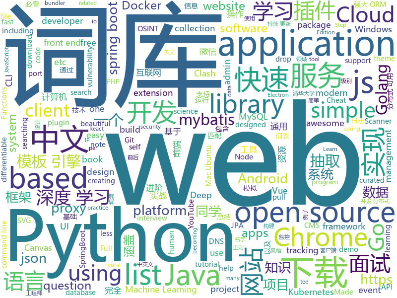

# 2020-02-16
See what the GitHub community is most excited about today.

## python
* [python-small-examples](https://github.com/jackzhenguo/python-small-examples)(**44 stars today**): Python有趣的小例子一网打尽。Python基础、Python坑点、Python字符串和正则、Python绘图、Python日期和文件、Web开发、数据科学、机器学习、深度学习、TensorFlow、Pytorch，一切都是简单易懂的小例子。
* [snoop](https://github.com/snooppr/snoop)(**104 stars today**): Snoop — инструмент разведки на основе открытых данных
* [system-design-primer](https://github.com/donnemartin/system-design-primer)(**121 stars today**): Learn how to design large-scale systems. Prep for the system design interview. Includes Anki flashcards.
* [you-get](https://github.com/soimort/you-get)(**48 stars today**): ⏬Dumb downloader that scrapes the web
* [Mooc_Downloader](https://github.com/PyJun/Mooc_Downloader)(**49 stars today**): 学无止下载器，慕课下载器，Mooc下载，中国大学下载，爱课程下载，网易云课堂下载，学堂在线下载；支持视频，课件同时下载
* [httpie](https://github.com/jakubroztocil/httpie)(**20 stars today**): As easy as HTTPie /aitch-tee-tee-pie/ 🥧 Modern command line HTTP client – user-friendly curl alternative with intuitive UI, JSON support, syntax highlighting, wget-like downloads, extensions, etc. https://twitter.com/clihttp
* [spiderfoot](https://github.com/smicallef/spiderfoot)(**29 stars today**): SpiderFoot, the most complete OSINT collection and reconnaissance tool.
* [nni](https://github.com/microsoft/nni)(**12 stars today**): An open source AutoML toolkit for automate machine learning lifecycle, including feature engineering, neural architecture search, model compression and hyper-parameter tuning.
* [freespeech](https://github.com/Merkie/freespeech)(**21 stars today**): A free program designed to help the non-verbal.
* [full-stack-fastapi-postgresql](https://github.com/tiangolo/full-stack-fastapi-postgresql)(**10 stars today**): Full stack, modern web application generator. Using FastAPI, PostgreSQL as database, Docker, automatic HTTPS and more.
* [basic-epidemic-simulation](https://github.com/najibelmokhtari/basic-epidemic-simulation)(**18 stars today**): A very basic epidemic simulation for educational purposes. This code was made as a part of a YouTube episode on a pop science channel hosted by Najib El Mokhtari. Any enhancements are welcome and unrestricted.
* [funNLP](https://github.com/fighting41love/funNLP)(**43 stars today**): 中英文敏感词、语言检测、中外手机/电话归属地/运营商查询、名字推断性别、手机号抽取、身份证抽取、邮箱抽取、中日文人名库、中文缩写库、拆字词典、词汇情感值、停用词、反动词表、暴恐词表、繁简体转换、英文模拟中文发音、汪峰歌词生成器、职业名称词库、同义词库、反义词库、否定词库、汽车品牌词库、汽车零件词库、连续英文切割、各种中文词向量、公司名字大全、古诗词库、IT词库、财经词库、成语词库、地名词库、历史名人词库、诗词词库、医学词库、饮食词库、法律词库、汽车词库、动物词库、中文聊天语料、中文谣言数据、百度中文问答数据集、句子相似度匹配算法集合、bert资源、文本生成&摘要相关工具、cocoNLP信息抽取工具、国内电话号码正则匹配、清华大学XLORE:中英文跨语言百科知识图谱、清华大学人工智能技术…
* [django](https://github.com/django/django)(**27 stars today**): The Web framework for perfectionists with deadlines.
* [vaex](https://github.com/vaexio/vaex)(**23 stars today**): Out-of-Core DataFrames for Python, ML, visualize and explore big tabular data at a billion rows per second.
* [BlackWidow](https://github.com/1N3/BlackWidow)(**7 stars today**): A Python based web application scanner to gather OSINT and fuzz for OWASP vulnerabilities on a target website.
* [WebCrack](https://github.com/yzddmr6/WebCrack)(**9 stars today**): 网站后台弱口令/万能密码批量检测工具
* [stanfordnlp](https://github.com/stanfordnlp/stanfordnlp)(**5 stars today**): Official Stanford NLP Python Library for Many Human Languages
* [wtfpython-cn](https://github.com/leisurelicht/wtfpython-cn)(**8 stars today**): wtfpython的中文翻译/施工结束/ 能力有限，欢迎帮我改进翻译
* [ZeroNet](https://github.com/HelloZeroNet/ZeroNet)(**14 stars today**): ZeroNet - Decentralized websites using Bitcoin crypto and BitTorrent network
* [Harry-potter-Invisible-Cloak](https://github.com/Gaurav-chatterjee/Harry-potter-Invisible-Cloak)(**13 stars today**): 
* [deep_sort](https://github.com/nwojke/deep_sort)(**7 stars today**): Simple Online Realtime Tracking with a Deep Association Metric
* [ml-agents](https://github.com/Unity-Technologies/ml-agents)(**12 stars today**): Unity Machine Learning Agents Toolkit
* [DeepFaceLab](https://github.com/iperov/DeepFaceLab)(**22 stars today**): DeepFaceLab is the leading software for creating deepfakes.
* [coding_interviews](https://github.com/shenweichen/coding_interviews)(**25 stars today**): 《剑指Offer》题目汇总&常考题总结(Python实现)
* [jd-automask](https://github.com/Rlacat/jd-automask)(**68 stars today**): 防护-京东口罩自动抢购并下单

## java
* [CS-Notes](https://github.com/CyC2018/CS-Notes)(**81 stars today**): 📚技术面试必备基础知识、Leetcode、计算机操作系统、计算机网络、系统设计、Java、Python、C++
* [RxJava](https://github.com/ReactiveX/RxJava)(**23 stars today**): RxJava – Reactive Extensions for the JVM – a library for composing asynchronous and event-based programs using observable sequences for the Java VM.
* [BigData-Notes](https://github.com/heibaiying/BigData-Notes)(**79 stars today**): 大数据入门指南⭐️
* [getlink_fshare](https://github.com/tungtv202/getlink_fshare)(**7 stars today**): 
* [advanced-java](https://github.com/doocs/advanced-java)(**26 stars today**): 😮互联网 Java 工程师进阶知识完全扫盲：涵盖高并发、分布式、高可用、微服务、海量数据处理等领域知识，后端同学必看，前端同学也可学习
* [onemall](https://github.com/YunaiV/onemall)(**6 stars today**): mall 商城，基于微服务的思想，构建在 B2C 电商场景下的项目实战。核心技术栈，是 Spring Boot + Dubbo 。未来，会重构成 Spring Cloud Alibaba 。
* [SpringCloud](https://github.com/zhoutaoo/SpringCloud)(**9 stars today**): 基于SpringCloud2.1的微服务开发脚手架，整合了spring-security-oauth2、nacos、feign、sentinel、springcloud-gateway等。服务治理方面引入elasticsearch、skywalking、springboot-admin、zipkin等，让项目开发快速进入业务开发，而不需过多时间花费在架构搭建上。持续更新中
* [AndroidTutorialForBeginners](https://github.com/hussien89aa/AndroidTutorialForBeginners)(**3 stars today**): Step by step to build Android apps using Android Studio
* [NewPipe](https://github.com/TeamNewPipe/NewPipe)(**13 stars today**): A libre lightweight streaming front-end for Android.
* [runelite](https://github.com/runelite/runelite)(**6 stars today**): Open source Old School RuneScape client
* [data-structures](https://github.com/williamfiset/data-structures)(**10 stars today**): A collection of powerful data structures
* [Nukkit](https://github.com/NukkitX/Nukkit)(**3 stars today**): Nuclear-Powered Server Software for Minecraft: Bedrock Edition.
* [miaosha](https://github.com/qiurunze123/miaosha)(**12 stars today**): ⭐⭐⭐⭐秒杀系统设计与实现.互联网工程师进阶与分析🙋🐓
* [spring-boot-demo](https://github.com/xkcoding/spring-boot-demo)(**19 stars today**): spring boot demo 是一个用来深度学习并实战 spring boot 的项目，目前总共包含 65 个集成demo，已经完成 53 个。 该项目已成功集成 actuator(监控)、admin(可视化监控)、logback(日志)、aopLog(通过AOP记录web请求日志)、统一异常处理(json级别和页面级别)、freemarker(模板引擎)、thymeleaf(模板引擎)、Beetl(模板引擎)、Enjoy(模板引擎)、JdbcTemplate(通用JDBC操作数据库)、JPA(强大的ORM框架)、mybatis(强大的ORM框架)、通用Mapper(快速操作Mybatis)、PageHelper(通用的Mybatis分页插件)、mybatis-plus(快速操作M…
* [tink](https://github.com/google/tink)(**11 stars today**): Tink is a multi-language, cross-platform, open source library that provides cryptographic APIs that are secure, easy to use correctly, and hard(er) to misuse.
* [springboot-project](https://github.com/sqmax/springboot-project)(**3 stars today**): 这是一个用SpringBoot+JPA打造的基于微信服务号平台的点餐系统的后端，前端是一个使用Vue.js构建的运行于微信公众号的WebApp。前后端完全分离，前后端之间通过RESTful风格的接口相连。
* [kafka](https://github.com/apache/kafka)(**9 stars today**): Mirror of Apache Kafka
* [SpringBootLearning](https://github.com/gf-huanchupk/SpringBootLearning)(**2 stars today**): Spring Boot learning process
* [JFoenix](https://github.com/jfoenixadmin/JFoenix)(**5 stars today**): JavaFX Material Design Library
* [dubbo-spring-boot-project](https://github.com/apache/dubbo-spring-boot-project)(**4 stars today**): Spring Boot Project for Apache Dubbo
* [ip2region](https://github.com/lionsoul2014/ip2region)(**6 stars today**): Ip2region is a offline IP location library with accuracy rate of 99.9% and 0.0x millseconds searching performance. DB file is less then 5Mb with all ip address stored. binding for Java,PHP,C,Python,Nodejs,Golang,C#,lua. Binary,B-tree,Memory searching algorithm
* [openhab-addons](https://github.com/openhab/openhab-addons)(**2 stars today**): Add-ons for openHAB
* [spring-framework](https://github.com/spring-projects/spring-framework)(**29 stars today**): Spring Framework
* [deeplearning4j](https://github.com/eclipse/deeplearning4j)(**6 stars today**): Eclipse Deeplearning4j, ND4J, DataVec and more - deep learning & linear algebra for Java/Scala with GPUs + Spark
* [easyexcel](https://github.com/alibaba/easyexcel)(**7 stars today**): 快速、简单避免OOM的java处理Excel工具

## unknown
* [the-art-of-command-line](https://github.com/jlevy/the-art-of-command-line)(**87 stars today**): Master the command line, in one page
* [nodejs-cli-apps-best-practices](https://github.com/lirantal/nodejs-cli-apps-best-practices)(**187 stars today**): The largest Node.js CLI Apps best practices list✨
* [optifine](https://github.com/sp614x/optifine)(**7 stars today**): 
* [Waking-Up](https://github.com/wolverinn/Waking-Up)(**45 stars today**): 计算机基础面试问题全面总结，包含详细的follow-up question以及答案；模拟面试，知识点复习，快速备战面试...
* [developer-roadmap](https://github.com/kamranahmedse/developer-roadmap)(**88 stars today**): Roadmap to becoming a web developer in 2020
* [fe-news](https://github.com/naver/fe-news)(**122 stars today**): FE 기술 소식 큐레이션 뉴스레터
* [workshop-materials](https://github.com/C00kie-/workshop-materials)(**15 stars today**): Presented workshops since 2019
* [difftaichi](https://github.com/yuanming-hu/difftaichi)(**9 stars today**): 10 differentiable physical simulators built with Taichi differentiable programming (DiffTaichi, ICLR 2020)
* [2020-Junior-Devs-Project](https://github.com/Junior-Devs/2020-Junior-Devs-Project)(**3 stars today**): 2020 collaboration project for members of the Junior Devs group
* [JavaFamily](https://github.com/AobingJava/JavaFamily)(**49 stars today**): 【互联网一线大厂面试+学习指南】进阶知识完全扫盲：涵盖高并发、分布式、高可用、微服务等领域知识，作者风格幽默，看起来津津有味，把学习当做一种乐趣，何乐而不为，后端同学必看，前端同学我保证你也看得懂，看不懂你加我微信骂我渣男就好了。
* [google-cloud-4-words](https://github.com/gregsramblings/google-cloud-4-words)(**5 stars today**): The Google Cloud Developer's Cheat Sheet
* [computer-science](https://github.com/ossu/computer-science)(**50 stars today**): 🎓Path to a free self-taught education in Computer Science!
* [awesome-vue](https://github.com/vuejs/awesome-vue)(**26 stars today**): 🎉A curated list of awesome things related to Vue.js
* [docker-cheat-sheet](https://github.com/wsargent/docker-cheat-sheet)(**11 stars today**): Docker Cheat Sheet
* [AutoBuild-Nanopi-R2S](https://github.com/tiantianxiaoxiaoxyz/AutoBuild-Nanopi-R2S)(**4 stars today**): 
* [gfwlist](https://github.com/gfwlist/gfwlist)(**30 stars today**): The one and only one gfwlist here
* [recommended-books](https://github.com/woai3c/recommended-books)(**5 stars today**): 计算机经典书籍推荐 部分书籍提供PDF下载
* [winter](https://github.com/404name/winter)(**11 stars today**): 
* [awesome-ggplot2](https://github.com/erikgahner/awesome-ggplot2)(**43 stars today**): A curated list of awesome ggplot2 tutorials, packages etc.
* [awesome](https://github.com/sindresorhus/awesome)(**83 stars today**): 😎Awesome lists about all kinds of interesting topics
* [algorithms](https://github.com/jeffgerickson/algorithms)(**15 stars today**): Bug-tracking for Jeff's algorithms book, notes, etc.
* [Resources-for-Beginner-Bug-Bounty-Hunters](https://github.com/nahamsec/Resources-for-Beginner-Bug-Bounty-Hunters)(**23 stars today**): A list of resources for those interested in getting started in bug bounties
* [NGC.SS.JJ](https://github.com/NGC-HenryLee/NGC.SS.JJ)(**6 stars today**): NGC.SS.JJ
* [blog](https://github.com/huggingface/blog)(**17 stars today**): Public repo for HF blog posts
* [ui-ux-designer-roadmap](https://github.com/togiberlin/ui-ux-designer-roadmap)(**4 stars today**): Roadmap on becoming a UI/UX designer in 2017

## javascript
* [surge](https://github.com/yichahucha/surge)(**12 stars today**): script
* [UnblockNeteaseMusic](https://github.com/nondanee/UnblockNeteaseMusic)(**34 stars today**): Revive unavailable songs for Netease Cloud Music
* [lion](https://github.com/ing-bank/lion)(**79 stars today**): Lion Web Components
* [scripts](https://github.com/chavyleung/scripts)(**20 stars today**): 
* [google-access-helper](https://github.com/haotian-wang/google-access-helper)(**20 stars today**): 谷歌访问助手破解版
* [Motrix](https://github.com/agalwood/Motrix)(**42 stars today**): A full-featured download manager.
* [netlify-cms](https://github.com/netlify/netlify-cms)(**9 stars today**): A CMS for Static Site Generators
* [Workers-Proxy](https://github.com/Siujoeng-Lau/Workers-Proxy)(**9 stars today**): Lightweight reverse proxy implemented with Cloudflare Workers.
* [ARC](https://github.com/fchollet/ARC)(**36 stars today**): The Abstraction and Reasoning Corpus
* [fullcalendar](https://github.com/fullcalendar/fullcalendar)(**89 stars today**): Full-sized drag & drop event calendar
* [gatsby-starter-netlify-cms](https://github.com/netlify-templates/gatsby-starter-netlify-cms)(**6 stars today**): Example gatsby + netlify cms project
* [joplin](https://github.com/laurent22/joplin)(**99 stars today**): Joplin - an open source note taking and to-do application with synchronization capabilities for Windows, macOS, Linux, Android and iOS. Forum: https://discourse.joplinapp.org/
* [functions-samples](https://github.com/firebase/functions-samples)(**10 stars today**): Collection of sample apps showcasing popular use cases using Cloud Functions for Firebase
* [esercizi-di-programmazione-javascript](https://github.com/AlbertoOlla/esercizi-di-programmazione-javascript)(**3 stars today**): Esercizi di informatica! Impara a programmare, metti alla prova!
* [generator-jhipster](https://github.com/jhipster/generator-jhipster)(**8 stars today**): Open Source application platform for creating Spring Boot + Angular/React projects in seconds!
* [readme-md-generator](https://github.com/kefranabg/readme-md-generator)(**6 stars today**): 📄CLI that generates beautiful README.md files
* [snowpack](https://github.com/pikapkg/snowpack)(**36 stars today**): 📦✨Build web applications with less tooling and 10x faster iteration. No bundler required.
* [carbon](https://github.com/carbon-app/carbon)(**15 stars today**): 🎨Create and share beautiful images of your source code
* [fabric.js](https://github.com/fabricjs/fabric.js)(**11 stars today**): Javascript Canvas Library, SVG-to-Canvas (& canvas-to-SVG) Parser
* [Clashy](https://github.com/SpongeNobody/Clashy)(**7 stars today**): A GUI proxy client for Windows / Mac / Ubuntu Desktop based on Clash and Electron.🛫Windows / Mac / Ubuntu 适用的Clash客户端
* [php](https://github.com/threadshare/php)(**6 stars today**): 为刚刚学习php语言以及web网站开发整理的一套资源，有视频，实战代码，学习路径等。会持续更新。。。
* [electron-quick-start](https://github.com/electron/electron-quick-start)(**9 stars today**): Clone to try a simple Electron app
* [medium-unlimited](https://github.com/manojVivek/medium-unlimited)(**6 stars today**): A browser extension to read medium.com articles for free without membership.
* [ChromeAppHeroes](https://github.com/zhaoolee/ChromeAppHeroes)(**15 stars today**): 🌈谷粒-Chrome插件英雄榜, 为优秀的Chrome插件写一本中文说明书, 让Chrome插件英雄们造福人类~ ChromePluginHeroes, Write a Chinese manual for the excellent Chrome plugin, let the Chrome plugin heroes benefit the human~
* [project_chat_application](https://github.com/adrianhajdin/project_chat_application)(**6 stars today**): This is a code repository for the corresponding YouTube video. In this tutorial we are going to build and deploy a real time chat application. Covered topics: React.js, Node.js, Express.js, and Socket.io.

## html
* [nndl.github.io](https://github.com/nndl/nndl.github.io)(**33 stars today**): 《神经网络与深度学习》 邱锡鹏著 Neural Network and Deep Learning
* [wpt](https://github.com/web-platform-tests/wpt)(**5 stars today**): Test suites for Web platform specs — including WHATWG, W3C, and others
* [heroku-aria2c](https://github.com/maple3142/heroku-aria2c)(**10 stars today**): 
* [intro-to-ml-tidy](https://github.com/rstudio-conf-2020/intro-to-ml-tidy)(**12 stars today**): Intro to Machine Learning with the Tidyverse
* [django-DefectDojo](https://github.com/DefectDojo/django-DefectDojo)(**3 stars today**): DefectDojo is an open-source application vulnerability correlation and security orchestration tool.
* [front-end-handbook-2019](https://github.com/FrontendMasters/front-end-handbook-2019)(**3 stars today**): [Book] 2019 edition of our front-end development handbook
* [tools](https://github.com/googlecodelabs/tools)(**3 stars today**): Codelabs management & hosting tools
* [personal-website](https://github.com/github/personal-website)(**5 stars today**): Code that'll help you kickstart a personal website that showcases your work as a software developer.
* [deeplearning_ai_books](https://github.com/fengdu78/deeplearning_ai_books)(**11 stars today**): deeplearning.ai（吴恩达老师的深度学习课程笔记及资源）
* [AR.js](https://github.com/jeromeetienne/AR.js)(**10 stars today**): Efficient Augmented Reality for the Web - 60fps on mobile!
* [privacytools.io](https://github.com/privacytoolsIO/privacytools.io)(**3 stars today**): 🛡🛠You are being watched. Protect your privacy against global mass surveillance.
* [home-assistant.io](https://github.com/home-assistant/home-assistant.io)(**2 stars today**): 📘Home Assistant User documentation
* [reasonml-q-a](https://github.com/zth/reasonml-q-a)(**9 stars today**): ReasonML Q & A - Questions and answers for everything ReasonML.
* [hugo-theme-jane](https://github.com/xianmin/hugo-theme-jane)(**2 stars today**): A readable & concise theme for Hugo
* [Warez](https://github.com/CHEF-KOCH/Warez)(**5 stars today**): All your base are belong to us!
* [web-moderno](https://github.com/cod3rcursos/web-moderno)(**4 stars today**): 
* [python_ebook](https://github.com/shihyu/python_ebook)(**1 stars today**): 
* [mescroll](https://github.com/mescroll/mescroll)(**4 stars today**): 精致的下拉刷新和上拉加载 js框架.支持vue,完美运行于移动端和主流PC浏览器 (JS framework for pull-refresh and pull-up-loading)
* [hugo-book](https://github.com/alex-shpak/hugo-book)(**4 stars today**): Hugo documentation theme as simple as plain book
* [bigdata](https://github.com/zhouwei713/bigdata)(**5 stars today**): 示例网站
* [Front-end-Developer-Interview-Questions](https://github.com/h5bp/Front-end-Developer-Interview-Questions)(**15 stars today**): A list of helpful front-end related questions you can use to interview potential candidates, test yourself or completely ignore.
* [zfaka](https://github.com/zlkbdotnet/zfaka)(**5 stars today**): 免费、安全、稳定、高效的发卡系统，值得拥有!
* [portainer](https://github.com/portainer/portainer)(**11 stars today**): Making Docker management easy.
* [se-scraper](https://github.com/NikolaiT/se-scraper)(**2 stars today**): Javascript scraping module based on puppeteer for many different search engines...
* [OpenClash](https://github.com/vernesong/OpenClash)(**7 stars today**): A Clash Client For OpenWrt

## go
* [esbuild](https://github.com/evanw/esbuild)(**812 stars today**): An extremely fast JavaScript bundler and minifier
* [crawlab](https://github.com/crawlab-team/crawlab)(**45 stars today**): Distributed web crawler admin platform for spiders management regardless of languages and frameworks.
* [dapr](https://github.com/dapr/dapr)(**25 stars today**): Dapr is a portable, event-driven, runtime for building distributed applications across cloud and edge.
* [advanced-go-programming-book](https://github.com/chai2010/advanced-go-programming-book)(**14 stars today**): 📚《Go语言高级编程》开源图书，涵盖CGO、Go汇编语言、RPC实现、Protobuf插件实现、Web框架实现、分布式系统等高阶主题(完稿)
* [auxpi](https://github.com/aimerforreimu/auxpi)(**20 stars today**): 🍭集合多家 API 的新一代图床
* [helm](https://github.com/helm/helm)(**22 stars today**): The Kubernetes Package Manager
* [geph2](https://github.com/geph-official/geph2)(**16 stars today**): Geph (迷霧通) is a modular Internet censorship circumvention system designed specifically to deal with national filtering.
* [docker_practice](https://github.com/yeasy/docker_practice)(**10 stars today**): Learn and understand Docker technologies, with real DevOps practice!
* [dnscrypt-proxy](https://github.com/DNSCrypt/dnscrypt-proxy)(**11 stars today**): dnscrypt-proxy 2 - A flexible DNS proxy, with support for encrypted DNS protocols.
* [clash](https://github.com/Dreamacro/clash)(**39 stars today**): A rule-based tunnel in Go.
* [faas](https://github.com/openfaas/faas)(**13 stars today**): OpenFaaS - Serverless Functions Made Simple
* [TopList](https://github.com/tophubs/TopList)(**2 stars today**): 今日热榜，一个获取各大热门网站热门头条的聚合网站，使用Go语言编写，多协程异步快速抓取信息，预览:https://mo.fish
* [ingress-nginx](https://github.com/kubernetes/ingress-nginx)(**10 stars today**): NGINX Ingress Controller for Kubernetes
* [k9s](https://github.com/derailed/k9s)(**23 stars today**): 🐶Kubernetes CLI To Manage Your Clusters In Style!
* [trivy](https://github.com/aquasecurity/trivy)(**9 stars today**): A Simple and Comprehensive Vulnerability Scanner for Containers, Suitable for CI
* [shadowsocks-go](https://github.com/shadowsocks/shadowsocks-go)(**5 stars today**): go port of shadowsocks (Deprecated)
* [pathbrute](https://github.com/milo2012/pathbrute)(**3 stars today**): Pathbrute
* [annie](https://github.com/iawia002/annie)(**16 stars today**): 👾Fast, simple and clean video downloader
* [mysql](https://github.com/go-sql-driver/mysql)(**6 stars today**): Go MySQL Driver is a MySQL driver for Go's (golang) database/sql package
* [pan-light](https://github.com/peterq/pan-light)(**18 stars today**): 百度网盘不限速客户端, golang + qt5, 跨平台图形界面
* [cointop](https://github.com/miguelmota/cointop)(**5 stars today**): The fastest and most interactive terminal based UI application for tracking cryptocurrencies
* [gogs](https://github.com/gogs/gogs)(**13 stars today**): Gogs is a painless self-hosted Git service
* [filestash](https://github.com/mickael-kerjean/filestash)(**6 stars today**): 🦄A modern web client for SFTP, S3, FTP, WebDAV, Git, Minio, LDAP, CalDAV, CardDAV, Mysql, Backblaze, ...
* [simdjson-go](https://github.com/minio/simdjson-go)(**52 stars today**): Golang port of simdjson: parsing gigabytes of JSON per second
* [go](https://github.com/json-iterator/go)(**9 stars today**): A high-performance 100% compatible drop-in replacement of "encoding/json"

## WordCloud

