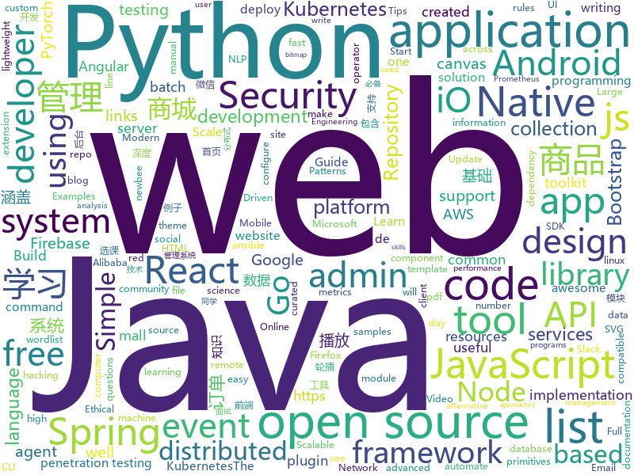

# 2020-02-18
See what the GitHub community is most excited about today.

## python
* [snoop](https://github.com/snooppr/snoop)(**117 stars today**): Snoop — инструмент разведки на основе открытых данных
* [trax](https://github.com/google/trax)(**935 stars today**): Trax — your path to advanced deep learning
* [python-small-examples](https://github.com/jackzhenguo/python-small-examples)(**225 stars today**): Python有趣的小例子一网打尽。Python基础、Python坑点、Python字符串和正则、Python绘图、Python日期和文件、Web开发、数据科学、机器学习、深度学习、TensorFlow、Pytorch，一切都是简单易懂的小例子。
* [system-design-primer](https://github.com/donnemartin/system-design-primer)(**158 stars today**): Learn how to design large-scale systems. Prep for the system design interview. Includes Anki flashcards.
* [sherlock](https://github.com/sherlock-project/sherlock)(**80 stars today**): 🔎Hunt down social media accounts by username across social networks
* [LaZagne](https://github.com/AlessandroZ/LaZagne)(**31 stars today**): Credentials recovery project
* [pytorch-lightning](https://github.com/PyTorchLightning/pytorch-lightning)(**18 stars today**): The lightweight PyTorch wrapper for ML researchers. Scale your models. Write less boilerplate
* [ansible](https://github.com/ansible/ansible)(**25 stars today**): Ansible is a radically simple IT automation platform that makes your applications and systems easier to deploy. Avoid writing scripts or custom code to deploy and update your applications — automate in a language that approaches plain English, using SSH, with no agents to install on remote systems. https://docs.ansible.com/ansible/
* [QUANTAXIS](https://github.com/QUANTAXIS/QUANTAXIS)(**10 stars today**): QUANTAXIS 支持任务调度 分布式部署的 股票/期货/自定义市场 数据/回测/模拟/交易/可视化 纯本地PAAS量化解决方案
* [PayloadsAllTheThings](https://github.com/swisskyrepo/PayloadsAllTheThings)(**39 stars today**): A list of useful payloads and bypass for Web Application Security and Pentest/CTF
* [Cozette](https://github.com/slavfox/Cozette)(**118 stars today**): A bitmap programming font optimized for coziness💜
* [ml-agents](https://github.com/Unity-Technologies/ml-agents)(**17 stars today**): Unity Machine Learning Agents Toolkit
* [PKUAutoElective](https://github.com/zhongxinghong/PKUAutoElective)(**42 stars today**): 北大选课网补退选阶段自动选课小工具
* [mentalist](https://github.com/sc0tfree/mentalist)(**11 stars today**): Mentalist is a graphical tool for custom wordlist generation. It utilizes common human paradigms for constructing passwords and can output the full wordlist as well as rules compatible with Hashcat and John the Ripper.
* [DeepFaceLab](https://github.com/iperov/DeepFaceLab)(**36 stars today**): DeepFaceLab is the leading software for creating deepfakes.
* [NLP-progress](https://github.com/sebastianruder/NLP-progress)(**43 stars today**): Repository to track the progress in Natural Language Processing (NLP), including the datasets and the current state-of-the-art for the most common NLP tasks.
* [locust](https://github.com/locustio/locust)(**16 stars today**): Scalable user load testing tool written in Python
* [black](https://github.com/psf/black)(**31 stars today**): The uncompromising Python code formatter
* [cfn-python-lint](https://github.com/aws-cloudformation/cfn-python-lint)(**16 stars today**): CloudFormation Linter
* [creme](https://github.com/creme-ml/creme)(**19 stars today**): 🍮Online machine learning in Python
* [jax](https://github.com/google/jax)(**43 stars today**): Composable transformations of Python+NumPy programs: differentiate, vectorize, JIT to GPU/TPU, and more
* [python-socketio](https://github.com/miguelgrinberg/python-socketio)(**5 stars today**): Python Socket.IO server and client
* [Mask_RCNN](https://github.com/matterport/Mask_RCNN)(**24 stars today**): Mask R-CNN for object detection and instance segmentation on Keras and TensorFlow
* [fast-autoaugment](https://github.com/kakaobrain/fast-autoaugment)(**4 stars today**): Official Implementation of 'Fast AutoAugment' in PyTorch.
* [luigi](https://github.com/spotify/luigi)(**12 stars today**): Luigi is a Python module that helps you build complex pipelines of batch jobs. It handles dependency resolution, workflow management, visualization etc. It also comes with Hadoop support built in.

## java
* [JavaGuide](https://github.com/Snailclimb/JavaGuide)(**82 stars today**): 【Java学习+面试指南】 一份涵盖大部分Java程序员所需要掌握的核心知识。
* [aws-doc-sdk-examples](https://github.com/awsdocs/aws-doc-sdk-examples)(**9 stars today**): Welcome to the AWS Code Examples Repository. This repo contains code examples used in the AWS documentation, AWS SDK Developer Guides, and more. For more information, see the Readme.rst file below.
* [quickstart-android](https://github.com/firebase/quickstart-android)(**8 stars today**): Firebase Quickstart Samples for Android
* [k-9](https://github.com/k9mail/k-9)(**17 stars today**): K-9 Mail – Open Source Email App for Android
* [newbee-mall](https://github.com/newbee-ltd/newbee-mall)(**23 stars today**): newbee-mall 项目（新蜂商城）是一套电商系统，包括 newbee-mall 商城系统及 newbee-mall-admin 商城后台管理系统，基于 Spring Boot 2.X 及相关技术栈开发。 前台商城系统包含首页门户、商品分类、新品上线、首页轮播、商品推荐、商品搜索、商品展示、购物车、订单结算、订单流程、个人订单管理、会员中心、帮助中心等模块。 后台管理系统包含数据面板、轮播图管理、商品管理、订单管理、会员管理、分类管理、设置等模块。
* [dubbo](https://github.com/apache/dubbo)(**18 stars today**): Apache Dubbo is a high-performance, java based, open source RPC framework.
* [quarkus](https://github.com/quarkusio/quarkus)(**12 stars today**): Quarkus: Supersonic Subatomic Java.
* [keycloak](https://github.com/keycloak/keycloak)(**10 stars today**): Open Source Identity and Access Management For Modern Applications and Services
* [spotbugs](https://github.com/spotbugs/spotbugs)(**6 stars today**): SpotBugs is FindBugs' successor. A tool for static analysis to look for bugs in Java code.
* [sonarqube-community-branch-plugin](https://github.com/mc1arke/sonarqube-community-branch-plugin)(**3 stars today**): A plugin for SonarQube to allow branch analysis in the community version
* [react-native-push-notification](https://github.com/zo0r/react-native-push-notification)(**4 stars today**): React Native Local and Remote Notifications
* [aws-sdk-android](https://github.com/aws-amplify/aws-sdk-android)(**0 stars today**): AWS SDK for Android. For more information, see our web site:
* [spring-batch](https://github.com/spring-projects/spring-batch)(**2 stars today**): Spring Batch is a framework for writing offline and batch applications using Spring and Java
* [flink](https://github.com/apache/flink)(**5 stars today**): Apache Flink
* [RxJava](https://github.com/ReactiveX/RxJava)(**12 stars today**): RxJava – Reactive Extensions for the JVM – a library for composing asynchronous and event-based programs using observable sequences for the Java VM.
* [dbeaver](https://github.com/dbeaver/dbeaver)(**17 stars today**): Free universal database tool and SQL client
* [tutorials](https://github.com/eugenp/tutorials)(**25 stars today**): Just Announced - "Learn Spring Security OAuth":
* [react-native-screens](https://github.com/software-mansion/react-native-screens)(**5 stars today**): Native navigation primitives for your React Native app.
* [advanced-java](https://github.com/doocs/advanced-java)(**31 stars today**): 😮互联网 Java 工程师进阶知识完全扫盲：涵盖高并发、分布式、高可用、微服务、海量数据处理等领域知识，后端同学必看，前端同学也可学习
* [DKVideoPlayer](https://github.com/dueeeke/DKVideoPlayer)(**3 stars today**): Android Video Player. 安卓视频播放器，封装MediaPlayer、ExoPlayer、IjkPlayer。模仿抖音并实现预加载，列表播放，悬浮播放，广告播放，弹幕
* [CS-Notes](https://github.com/CyC2018/CS-Notes)(**94 stars today**): 📚技术面试必备基础知识、Leetcode、计算机操作系统、计算机网络、系统设计、Java、Python、C++
* [spring-cloud-alibaba](https://github.com/alibaba/spring-cloud-alibaba)(**12 stars today**): Spring Cloud Alibaba provides a one-stop solution for application development for the distributed solutions of Alibaba middleware.
* [java](https://github.com/kubernetes-client/java)(**4 stars today**): Official Java client library for kubernetes
* [sagan](https://github.com/spring-io/sagan)(**8 stars today**): The spring.io site and reference application
* [material-components-android](https://github.com/material-components/material-components-android)(**9 stars today**): Modular and customizable Material Design UI components for Android

## unknown
* [app-ideas](https://github.com/florinpop17/app-ideas)(**978 stars today**): A Collection of application ideas which can be used to improve your coding skills.
* [the-art-of-command-line](https://github.com/jlevy/the-art-of-command-line)(**406 stars today**): Master the command line, in one page
* [awesome-scalability](https://github.com/binhnguyennus/awesome-scalability)(**73 stars today**): The Patterns of Scalable, Reliable, and Performant Large-Scale Systems
* [degoogle](https://github.com/tycrek/degoogle)(**120 stars today**): A huge list of alternatives to Google products. Privacy tips, tricks, and links.
* [awesome-pentest](https://github.com/enaqx/awesome-pentest)(**78 stars today**): A collection of awesome penetration testing resources, tools and other shiny things
* [3y](https://github.com/ZhongFuCheng3y/3y)(**36 stars today**): 📓从Java基础、JavaWeb基础到常用的框架再到面试题都有完整的教程，几乎涵盖了Java后端必备的知识点
* [nodejs-cli-apps-best-practices](https://github.com/lirantal/nodejs-cli-apps-best-practices)(**124 stars today**): The largest Node.js CLI Apps best practices list✨
* [Awesome-Red-Teaming](https://github.com/yeyintminthuhtut/Awesome-Red-Teaming)(**10 stars today**): List of Awesome Red Teaming Resources
* [developer-roadmap](https://github.com/kamranahmedse/developer-roadmap)(**86 stars today**): Roadmap to becoming a web developer in 2020
* [dockprom](https://github.com/stefanprodan/dockprom)(**14 stars today**): Docker hosts and containers monitoring with Prometheus, Grafana, cAdvisor, NodeExporter and AlertManager
* [the-book-of-secret-knowledge](https://github.com/trimstray/the-book-of-secret-knowledge)(**48 stars today**): A collection of inspiring lists, manuals, cheatsheets, blogs, hacks, one-liners, cli/web tools and more.
* [Licensing](https://github.com/AaronDinnage/Licensing)(**8 stars today**): Microsoft 365 licensing diagrams
* [MTJAN](https://github.com/CharlesCCC/MTJAN)(**16 stars today**): More Than Just A Number - 不仅仅只是一个数字
* [PENTESTING-BIBLE](https://github.com/blaCCkHatHacEEkr/PENTESTING-BIBLE)(**11 stars today**): This repository was created and developed by Ammar Amer @cry__pto Only. Updates to this repository will continue to arrive until the number of links reaches 10000 links & 10000 pdf files .Learn Ethical Hacking and penetration testing .hundreds of ethical hacking & penetration testing & red team & cyber security & computer science resources.
* [You-Dont-Know-JS](https://github.com/getify/You-Dont-Know-JS)(**62 stars today**): A book series on JavaScript. @YDKJS on twitter.
* [31-days-of-API-Security-Tips](https://github.com/smodnix/31-days-of-API-Security-Tips)(**16 stars today**): This challenge is Inon Shkedy's 31 days API Security Tips.
* [git-flight-rules](https://github.com/k88hudson/git-flight-rules)(**14 stars today**): Flight rules for git
* [Beginner-Network-Pentesting](https://github.com/hmaverickadams/Beginner-Network-Pentesting)(**8 stars today**): Notes for Beginner Network Pentesting Course
* [AZ-103-MicrosoftAzureAdministrator](https://github.com/MicrosoftLearning/AZ-103-MicrosoftAzureAdministrator)(**4 stars today**): AZ-103: Microsoft Azure Administrator
* [awesome-ddd](https://github.com/heynickc/awesome-ddd)(**7 stars today**): A curated list of Domain-Driven Design (DDD), Command Query Responsibility Segregation (CQRS), Event Sourcing, and Event Storming resources
* [javascript-questions](https://github.com/lydiahallie/javascript-questions)(**26 stars today**): A long list of (advanced) JavaScript questions, and their explanations✨
* [hacker-laws-zh](https://github.com/nusr/hacker-laws-zh)(**140 stars today**): 💻📖对开发人员有用的定律、理论、原则和模式。(Laws, Theories, Principles and Patterns that developers will find useful.)
* [weekly](https://github.com/dt-fe/weekly)(**11 stars today**): 前端精读周刊
* [blog](https://github.com/fouber/blog)(**1 stars today**): 没事写写文章，喜欢的话请点star，想订阅点watch，千万别fork！
* [IT-Books](https://github.com/petyakostova/IT-Books)(**3 stars today**): IT, Programming & Computer science books

## javascript
* [1on1-questions](https://github.com/VGraupera/1on1-questions)(**2,239 stars today**): Mega list of 1 on 1 meeting questions compiled from a variety to sources
* [gdb-frontend](https://github.com/rohanrhu/gdb-frontend)(**508 stars today**): ☕ GDBFrontend is an easy, flexible and extensionable gui debugger.
* [leon](https://github.com/leon-ai/leon)(**67 stars today**): 🧠 Leon is your open-source personal assistant.
* [playwright](https://github.com/microsoft/playwright)(**381 stars today**): Node library to automate Chromium, Firefox and WebKit with a single API
* [joplin](https://github.com/laurent22/joplin)(**107 stars today**): Joplin - an open source note taking and to-do application with synchronization capabilities for Windows, macOS, Linux, Android and iOS. Forum: https://discourse.joplinapp.org/
* [markdown-here](https://github.com/adam-p/markdown-here)(**44 stars today**): Google Chrome, Firefox, and Thunderbird extension that lets you write email in Markdown and render it before sending.
* [hs-airdrop](https://github.com/handshake-org/hs-airdrop)(**23 stars today**): Decentralized airdrop to open source developers
* [react-native-firebase](https://github.com/invertase/react-native-firebase)(**14 stars today**): 🔥A well-tested feature-rich modular Firebase implementation for React Native. Supports both iOS & Android platforms for all Firebase services.
* [juice-shop](https://github.com/bkimminich/juice-shop)(**7 stars today**): OWASP Juice Shop: Probably the most modern and sophisticated insecure web application
* [react-native-reanimated](https://github.com/software-mansion/react-native-reanimated)(**11 stars today**): React Native's Animated library reimplemented
* [moment](https://github.com/moment/moment)(**15 stars today**): Parse, validate, manipulate, and display dates in javascript.
* [fullcalendar](https://github.com/fullcalendar/fullcalendar)(**62 stars today**): Full-sized drag & drop event calendar
* [nw.js](https://github.com/nwjs/nw.js)(**41 stars today**): Call all Node.js modules directly from DOM/WebWorker and enable a new way of writing applications with all Web technologies.
* [hiring-without-whiteboards](https://github.com/poteto/hiring-without-whiteboards)(**24 stars today**): ⭐️Companies that don't have a broken hiring process
* [todomvc](https://github.com/tastejs/todomvc)(**33 stars today**): Helping you select an MV* framework - Todo apps for React.js, Ember.js, Angular, and many more
* [x-spreadsheet](https://github.com/myliang/x-spreadsheet)(**51 stars today**): A web-based JavaScript（canvas） spreadsheet
* [next.js](https://github.com/zeit/next.js)(**38 stars today**): The React Framework
* [clean-code-javascript](https://github.com/ryanmcdermott/clean-code-javascript)(**59 stars today**): 🛁Clean Code concepts adapted for JavaScript
* [jquery](https://github.com/jquery/jquery)(**9 stars today**): jQuery JavaScript Library
* [google-access-helper](https://github.com/haotian-wang/google-access-helper)(**33 stars today**): 谷歌访问助手破解版
* [d3](https://github.com/d3/d3)(**29 stars today**): Bring data to life with SVG, Canvas and HTML.📊📈🎉
* [react-native-gesture-handler](https://github.com/software-mansion/react-native-gesture-handler)(**7 stars today**): Declarative API exposing platform native touch and gesture system to React Native.
* [Chart.js](https://github.com/chartjs/Chart.js)(**26 stars today**): Simple HTML5 Charts using the <canvas> tag
* [quasar](https://github.com/quasarframework/quasar)(**19 stars today**): Quasar Framework - Build high-performance VueJS user interfaces in record time
* [aos](https://github.com/michalsnik/aos)(**20 stars today**): Animate on scroll library

## html
* [coreui-free-bootstrap-admin-template](https://github.com/coreui/coreui-free-bootstrap-admin-template)(**12 stars today**): CoreUI is free bootstrap admin template
* [coreui-free-angular-admin-template](https://github.com/coreui/coreui-free-angular-admin-template)(**2 stars today**): CoreUI Angular is free Angular 2+ admin template based on Bootstrap 4
* [hyperblog](https://github.com/freddier/hyperblog)(**11 stars today**): Un blog increíble para el curso de Git y Github de Platzi
* [he4rtlabs-challenges-01](https://github.com/he4rtlabs/he4rtlabs-challenges-01)(**3 stars today**): Calculadora de freelance
* [node-ytdl-core](https://github.com/fent/node-ytdl-core)(**4 stars today**): YouTube video downloader in javascript.
* [simple-icons](https://github.com/simple-icons/simple-icons)(**6 stars today**): SVG icons for popular brands
* [deeplearning_ai_books](https://github.com/fengdu78/deeplearning_ai_books)(**12 stars today**): deeplearning.ai（吴恩达老师的深度学习课程笔记及资源）
* [webdevbootcamp](https://github.com/nax3t/webdevbootcamp)(**3 stars today**): All source code for back-end projects from the Web Developer Bootcamp
* [hugo-academic](https://github.com/gcushen/hugo-academic)(**2 stars today**): 📝The website builder for Hugo. Build and deploy a beautiful website in minutes!
* [startbootstrap-sb-admin-2](https://github.com/BlackrockDigital/startbootstrap-sb-admin-2)(**4 stars today**): A free, open source, Bootstrap admin theme created by Start Bootstrap
* [owasp-mstg](https://github.com/OWASP/owasp-mstg)(**6 stars today**): The Mobile Security Testing Guide (MSTG) is a comprehensive manual for mobile app security development, testing and reverse engineering.
* [3d-force-graph](https://github.com/vasturiano/3d-force-graph)(**6 stars today**): 3D force-directed graph component using ThreeJS/WebGL
* [styleguide](https://github.com/google/styleguide)(**36 stars today**): Style guides for Google-originated open-source projects
* [awesome-piracy](https://github.com/Igglybuff/awesome-piracy)(**13 stars today**): A curated list of awesome warez and piracy links
* [tiny-helpers](https://github.com/stefanjudis/tiny-helpers)(**9 stars today**): A collection of useful online web development tools
* [pcc_2e](https://github.com/ehmatthes/pcc_2e)(**2 stars today**): Online resources for Python Crash Course (Second Edition), from No Starch Press
* [wechat_web_devtools](https://github.com/cytle/wechat_web_devtools)(**2 stars today**): 微信开发者工具(微信小程序)linux完美支持
* [pdf2htmlEX](https://github.com/coolwanglu/pdf2htmlEX)(**3 stars today**): Convert PDF to HTML without losing text or format.
* [JavaScript30](https://github.com/wesbos/JavaScript30)(**8 stars today**): 30 Day Vanilla JS Challenge
* [v-calendar](https://github.com/nathanreyes/v-calendar)(**3 stars today**): A lightweight, dependency-free plugin for building attributed calendars in Vue.js
* [manual](https://github.com/v2ray/manual)(**2 stars today**): Source code for https://www.v2ray.com/
* [lnbook](https://github.com/lnbook/lnbook)(**4 stars today**): Mastering the Lightning Network (LN)
* [startbootstrap-resume](https://github.com/BlackrockDigital/startbootstrap-resume)(**0 stars today**): A Bootstrap 4 resume/CV theme created by Start Bootstrap
* [Adminator-admin-dashboard](https://github.com/puikinsh/Adminator-admin-dashboard)(**3 stars today**): Adminator is a easy to use and well design admin dashboard template for web apps, websites, services and more
* [cognitive-services-REST-api-samples](https://github.com/Azure-Samples/cognitive-services-REST-api-samples)(**0 stars today**): This is a repo for cognitive services REST API samples in 4 languages: C#, Java, Node.js, and Python.

## go
* [esbuild](https://github.com/evanw/esbuild)(**559 stars today**): An extremely fast JavaScript bundler and minifier
* [go-ethereum](https://github.com/ethereum/go-ethereum)(**8 stars today**): Official Go implementation of the Ethereum protocol
* [prometheus-operator](https://github.com/coreos/prometheus-operator)(**6 stars today**): Prometheus Operator creates/configures/manages Prometheus clusters atop Kubernetes
* [helm](https://github.com/helm/helm)(**23 stars today**): The Kubernetes Package Manager
* [o365-attack-toolkit](https://github.com/mdsecactivebreach/o365-attack-toolkit)(**17 stars today**): A toolkit to attack Office365
* [mkcert](https://github.com/FiloSottile/mkcert)(**37 stars today**): A simple zero-config tool to make locally trusted development certificates with any names you'd like.
* [slack](https://github.com/nlopes/slack)(**6 stars today**): Slack API in Go
* [kafka-operator](https://github.com/banzaicloud/kafka-operator)(**1 stars today**): Oh no! Yet another Kafka operator for Kubernetes
* [go](https://github.com/golang/go)(**54 stars today**): The Go programming language
* [chaos-mesh](https://github.com/pingcap/chaos-mesh)(**2 stars today**): A Chaos Engineering Platform for Kubernetes
* [chat](https://github.com/tinode/chat)(**6 stars today**): Instant messaging server; backend in Go; iOS, Android, web, command line clients; chatbots
* [origin](https://github.com/openshift/origin)(**9 stars today**): The self-managing, auto-upgrading, Kubernetes distribution for everyone
* [ingress-nginx](https://github.com/kubernetes/ingress-nginx)(**13 stars today**): NGINX Ingress Controller for Kubernetes
* [yaml](https://github.com/go-yaml/yaml)(**7 stars today**): YAML support for the Go language.
* [tidb](https://github.com/pingcap/tidb)(**15 stars today**): TiDB is an open source distributed HTAP database compatible with the MySQL protocol
* [telegraf](https://github.com/influxdata/telegraf)(**5 stars today**): The plugin-driven server agent for collecting & reporting metrics.
* [testify](https://github.com/stretchr/testify)(**15 stars today**): A toolkit with common assertions and mocks that plays nicely with the standard library
* [consul](https://github.com/hashicorp/consul)(**10 stars today**): Consul is a distributed, highly available, and data center aware solution to connect and configure applications across dynamic, distributed infrastructure.
* [mattermost-server](https://github.com/mattermost/mattermost-server)(**28 stars today**): Open source Slack-alternative in Golang and React - Mattermost
* [istio](https://github.com/istio/istio)(**31 stars today**): Connect, secure, control, and observe services.
* [community](https://github.com/kubernetes/community)(**13 stars today**): Kubernetes community content
* [influxdb](https://github.com/influxdata/influxdb)(**25 stars today**): Scalable datastore for metrics, events, and real-time analytics
* [dashboard](https://github.com/kubernetes/dashboard)(**18 stars today**): General-purpose web UI for Kubernetes clusters
* [swag](https://github.com/swaggo/swag)(**7 stars today**): Automatically generate RESTful API documentation with Swagger 2.0 for Go.
* [errors](https://github.com/pkg/errors)(**4 stars today**): Simple error handling primitives

## WordCloud

