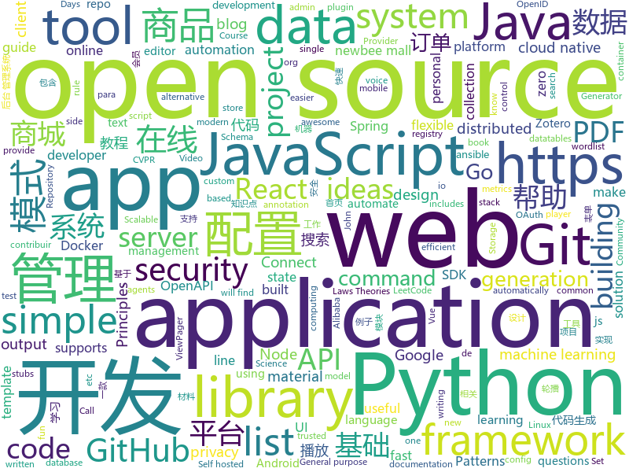

# 2020-02-19
See what the GitHub community is most excited about today.

## python
* [DAIN](https://github.com/baowenbo/DAIN)(**83 stars today**): Depth-Aware Video Frame Interpolation (CVPR 2019)
* [Python-100-Days](https://github.com/ZiniuLu/Python-100-Days)(**16 stars today**): 出处：https://github.com/jackfrued/Python-100-Days.git
* [LaZagne](https://github.com/AlessandroZ/LaZagne)(**15 stars today**): Credentials recovery project
* [odoo](https://github.com/odoo/odoo)(**15 stars today**): Odoo. Open Source Apps To Grow Your Business.
* [airflow](https://github.com/apache/airflow)(**20 stars today**): Apache Airflow - A platform to programmatically author, schedule, and monitor workflows
* [full-stack-fastapi-postgresql](https://github.com/tiangolo/full-stack-fastapi-postgresql)(**16 stars today**): Full stack, modern web application generator. Using FastAPI, PostgreSQL as database, Docker, automatic HTTPS and more.
* [python-small-examples](https://github.com/jackzhenguo/python-small-examples)(**152 stars today**): Python有趣的小例子一网打尽。Python基础、Python坑点、Python字符串和正则、Python绘图、Python日期和文件、Web开发、数据科学、机器学习、深度学习、TensorFlow、Pytorch，一切都是简单易懂的小例子。
* [ansible](https://github.com/ansible/ansible)(**24 stars today**): Ansible is a radically simple IT automation platform that makes your applications and systems easier to deploy. Avoid writing scripts or custom code to deploy and update your applications — automate in a language that approaches plain English, using SSH, with no agents to install on remote systems. https://docs.ansible.com/ansible/
* [home-assistant](https://github.com/home-assistant/home-assistant)(**23 stars today**): 🏡Open source home automation that puts local control and privacy first
* [CheatSheetSeries](https://github.com/OWASP/CheatSheetSeries)(**9 stars today**): The OWASP Cheat Sheet Series was created to provide a concise collection of high value information on specific application security topics.
* [great_expectations](https://github.com/great-expectations/great_expectations)(**24 stars today**): Always know what to expect from your data.
* [VTSCAN](https://github.com/TheSecondSun/VTSCAN)(**13 stars today**): VirusTotal API script
* [ChineseNLPCorpus](https://github.com/InsaneLife/ChineseNLPCorpus)(**8 stars today**): 中文自然语言处理数据集，平时做做实验的材料。欢迎补充提交合并。
* [mentalist](https://github.com/sc0tfree/mentalist)(**13 stars today**): Mentalist is a graphical tool for custom wordlist generation. It utilizes common human paradigms for constructing passwords and can output the full wordlist as well as rules compatible with Hashcat and John the Ripper.
* [tensortrade](https://github.com/tensortrade-org/tensortrade)(**3 stars today**): An open source reinforcement learning framework for training, evaluating, and deploying robust trading agents.
* [karateclub](https://github.com/benedekrozemberczki/karateclub)(**8 stars today**): A general purpose community detection and network embedding library for research built on NetworkX.
* [generative_inpainting](https://github.com/JiahuiYu/generative_inpainting)(**7 stars today**): DeepFill v1/v2 with Contextual Attention and Gated Convolution, CVPR 2018, and ICCV 2019 Oral
* [dask](https://github.com/dask/dask)(**7 stars today**): Parallel computing with task scheduling
* [plotly.py](https://github.com/plotly/plotly.py)(**10 stars today**): An open-source, interactive graphing library for Python (includes Plotly Express)✨
* [modin](https://github.com/modin-project/modin)(**11 stars today**): Modin: Speed up your Pandas workflows by changing a single line of code
* [system-design-primer](https://github.com/donnemartin/system-design-primer)(**294 stars today**): Learn how to design large-scale systems. Prep for the system design interview. Includes Anki flashcards.
* [noisystudent](https://github.com/google-research/noisystudent)(**43 stars today**): Code for NoisyStudent on SVHN. https://arxiv.org/abs/1911.04252
* [tutorials](https://github.com/MorvanZhou/tutorials)(**8 stars today**): 机器学习相关教程
* [programmingbitcoin](https://github.com/jimmysong/programmingbitcoin)(**3 stars today**): Repository for the book
* [rasa](https://github.com/RasaHQ/rasa)(**12 stars today**): 💬Open source machine learning framework to automate text- and voice-based conversations: NLU, dialogue management, connect to Slack, Facebook, and more - Create chatbots and voice assistants

## java
* [ExoPlayer](https://github.com/google/ExoPlayer)(**11 stars today**): An extensible media player for Android
* [tutorials](https://github.com/eugenp/tutorials)(**25 stars today**): Just Announced - "Learn Spring Security OAuth":
* [spring-cloud-alibaba](https://github.com/alibaba/spring-cloud-alibaba)(**18 stars today**): Spring Cloud Alibaba provides a one-stop solution for application development for the distributed solutions of Alibaba middleware.
* [selenium](https://github.com/SeleniumHQ/selenium)(**21 stars today**): A browser automation framework and ecosystem.
* [testcontainers-java](https://github.com/testcontainers/testcontainers-java)(**10 stars today**): Testcontainers is a Java library that supports JUnit tests, providing lightweight, throwaway instances of common databases, Selenium web browsers, or anything else that can run in a Docker container.
* [DKVideoPlayer](https://github.com/dueeeke/DKVideoPlayer)(**3 stars today**): Android Video Player. 安卓视频播放器，封装MediaPlayer、ExoPlayer、IjkPlayer。模仿抖音并实现预加载，列表播放，悬浮播放，广告播放，弹幕
* [react-native-navigation](https://github.com/wix/react-native-navigation)(**37 stars today**): A complete native navigation solution for React Native
* [micrometer](https://github.com/micrometer-metrics/micrometer)(**5 stars today**): An application metrics facade for the most popular monitoring tools. Think SLF4J, but for metrics.
* [quickstart-android](https://github.com/firebase/quickstart-android)(**6 stars today**): Firebase Quickstart Samples for Android
* [FlowHelper](https://github.com/LillteZheng/FlowHelper)(**3 stars today**): TabFlowHelper 可以帮助您迅速构建Tab，比如热搜、搜索记录、与ViewPager搭配的工具类;FlowHelper helps you quickly build tabs, such as hot searches, search logs, and utility classes that go with the ViewPager;
* [cim](https://github.com/crossoverJie/cim)(**6 stars today**): 📲cim(cross IM) 适用于开发者的分布式即时通讯系统
* [newbee-mall](https://github.com/newbee-ltd/newbee-mall)(**17 stars today**): newbee-mall 项目（新蜂商城）是一套电商系统，包括 newbee-mall 商城系统及 newbee-mall-admin 商城后台管理系统，基于 Spring Boot 2.X 及相关技术栈开发。 前台商城系统包含首页门户、商品分类、新品上线、首页轮播、商品推荐、商品搜索、商品展示、购物车、订单结算、订单流程、个人订单管理、会员中心、帮助中心等模块。 后台管理系统包含数据面板、轮播图管理、商品管理、订单管理、会员管理、分类管理、设置等模块。
* [vaquarkhan](https://github.com/vaquarkhan/vaquarkhan)(**4 stars today**): 
* [redis-manager](https://github.com/ngbdf/redis-manager)(**5 stars today**): Redis 一站式管理平台，支持集群的监控、安装、管理、告警以及基本的数据操作
* [elasticsearch](https://github.com/elastic/elasticsearch)(**33 stars today**): Open Source, Distributed, RESTful Search Engine
* [schema-registry](https://github.com/confluentinc/schema-registry)(**2 stars today**): Confluent Schema Registry for Kafka
* [Lawnchair](https://github.com/LawnchairLauncher/Lawnchair)(**4 stars today**): No clever tagline needed
* [LeetCodeAnimation](https://github.com/MisterBooo/LeetCodeAnimation)(**66 stars today**): Demonstrate all the questions on LeetCode in the form of animation.（用动画的形式呈现解LeetCode题目的思路）
* [graphql-java](https://github.com/graphql-java/graphql-java)(**10 stars today**): GraphQL Java implementation
* [Arduino](https://github.com/arduino/Arduino)(**30 stars today**): open-source electronics prototyping platform
* [jeecg-boot](https://github.com/zhangdaiscott/jeecg-boot)(**26 stars today**): 一款基于代码生成器的JAVA快速开发平台，开源界“小普元”超越传统商业企业级开发平台！采用前后端分离架构：SpringBoot 2.x，Ant Design&Vue，Mybatis-plus，Shiro，JWT。强大的代码生成器让前后端代码一键生成，无需写任何代码! 引领新的开发模式(OnlineCoding模式-> 代码生成器模式-> 手工MERGE智能开发)，帮助Java项目解决70%的重复工作，让开发更多关注业务逻辑。既能快速提高开发效率，帮助公司节省成本，同时又不失灵活性。JeecgBoot还独创在线开发模式（No代码）：在线表单配置（表单设计器）、移动配置能力、在线工作流配置（流程设计器）、在线报表配置、在线图表配置、插件能力（可插拔）等等
* [zotfile](https://github.com/jlegewie/zotfile)(**4 stars today**): Zotero plugin to manage your attachments: automatically rename, move, and attach PDFs (or other files) to Zotero items, sync PDFs from your Zotero library to your (mobile) PDF reader (e.g. an iPad, Android tablet, etc.), and extract PDF annotations.
* [Pixiv-Illustration-Collection-Backend](https://github.com/OysterQAQ/Pixiv-Illustration-Collection-Backend)(**5 stars today**): 提供有限的pixiv排行查看与免费高级会员(热门排序)搜索的站点
* [SpringBoot](https://github.com/lxy-go/SpringBoot)(**7 stars today**): 这是一个SpringBoot的从入门程序集锦
* [openapi-generator](https://github.com/OpenAPITools/openapi-generator)(**16 stars today**): OpenAPI Generator allows generation of API client libraries (SDK generation), server stubs, documentation and configuration automatically given an OpenAPI Spec (v2, v3)

## unknown
* [app-ideas](https://github.com/florinpop17/app-ideas)(**703 stars today**): A Collection of application ideas which can be used to improve your coding skills.
* [hacker-laws](https://github.com/dwmkerr/hacker-laws)(**493 stars today**): 💻📖Laws, Theories, Principles and Patterns that developers will find useful. #hackerlaws
* [degoogle](https://github.com/tycrek/degoogle)(**252 stars today**): A huge list of alternatives to Google products. Privacy tips, tricks, and links.
* [awesome-scalability](https://github.com/binhnguyennus/awesome-scalability)(**144 stars today**): The Patterns of Scalable, Reliable, and Performant Large-Scale Systems
* [ganhacks](https://github.com/soumith/ganhacks)(**7 stars today**): starter from "How to Train a GAN?" at NIPS2016
* [Awesome-Red-Teaming](https://github.com/yeyintminthuhtut/Awesome-Red-Teaming)(**11 stars today**): List of Awesome Red Teaming Resources
* [interview-question-data-science-](https://github.com/iNeuronai/interview-question-data-science-)(**13 stars today**): 
* [3y](https://github.com/ZhongFuCheng3y/3y)(**64 stars today**): 📓从Java基础、JavaWeb基础到常用的框架再到面试题都有完整的教程，几乎涵盖了Java后端必备的知识点
* [ds-cheatsheets](https://github.com/FavioVazquez/ds-cheatsheets)(**3 stars today**): List of Data Science Cheatsheets to rule the world
* [interactive-courses](https://github.com/Hexlet/interactive-courses)(**6 stars today**): 
* [templates](https://github.com/kbariotis/templates)(**6 stars today**): A set of standard document templates.
* [backendlore](https://github.com/fpereiro/backendlore)(**67 stars today**): How I write backends
* [hacker-laws-zh](https://github.com/nusr/hacker-laws-zh)(**45 stars today**): 💻📖对开发人员有用的定律、理论、原则和模式。(Laws, Theories, Principles and Patterns that developers will find useful.)
* [awesome-for-beginners](https://github.com/MunGell/awesome-for-beginners)(**28 stars today**): A list of awesome beginners-friendly projects.
* [blitz](https://github.com/flybayer/blitz)(**77 stars today**): ⚡️Framework for building monolithic, full-stack, serverless React apps with zero data-fetching and zero client-side state management
* [ConPresentations](https://github.com/maddiestone/ConPresentations)(**1 stars today**): Slide decks from my conference presentations
* [Licensing](https://github.com/AaronDinnage/Licensing)(**8 stars today**): Microsoft 365 licensing diagrams
* [TheCodeGang-Resource-Integration](https://github.com/realnumber666/TheCodeGang-Resource-Integration)(**19 stars today**): 📚TheCodeGang | 校招面试必备材料资源整合 | 计算机基础知识点解析、算法、经验、面经📚
* [ideas](https://github.com/samsquire/ideas)(**11 stars today**): a hundred ideas for computing - a record of ideas - https://samsquire.github.io/ideas/
* [dataviz](https://github.com/rstudio-conf-2020/dataviz)(**9 stars today**): Course materials for Kieran Healy's rstudio::conf 2020 data visualization workshop
* [reverseengineering-reading-list](https://github.com/onethawt/reverseengineering-reading-list)(**9 stars today**): A list of Reverse Engineering articles, books, and papers
* [3D-Machine-Learning](https://github.com/timzhang642/3D-Machine-Learning)(**9 stars today**): A resource repository for 3D machine learning
* [Python](https://github.com/TwoWater/Python)(**14 stars today**): 最良心的 Python 教程：
* [Production-Level-Deep-Learning](https://github.com/alirezadir/Production-Level-Deep-Learning)(**13 stars today**): A guideline for building practical production-level deep learning systems to be deployed in real world applications.
* [state-of-the-art-shitcode](https://github.com/trekhleb/state-of-the-art-shitcode)(**59 stars today**): 💩State-of-the-art shitcode principles your project should follow to call it a proper shitcode

## javascript
* [1on1-questions](https://github.com/VGraupera/1on1-questions)(**1,327 stars today**): Mega list of 1 on 1 meeting questions compiled from a variety to sources
* [react](https://github.com/facebook/react)(**80 stars today**): A declarative, efficient, and flexible JavaScript library for building user interfaces.
* [leon](https://github.com/leon-ai/leon)(**90 stars today**): 🧠 Leon is your open-source personal assistant.
* [opensource.guide](https://github.com/github/opensource.guide)(**23 stars today**): 📚Community guides for open source creators
* [playwright](https://github.com/microsoft/playwright)(**230 stars today**): Node library to automate Chromium, Firefox and WebKit with a single API
* [atom](https://github.com/atom/atom)(**23 stars today**): The hackable text editor
* [gdb-frontend](https://github.com/rohanrhu/gdb-frontend)(**227 stars today**): ☕ GDBFrontend is an easy, flexible and extensionable gui debugger.
* [x-spreadsheet](https://github.com/myliang/x-spreadsheet)(**54 stars today**): A web-based JavaScript（canvas） spreadsheet
* [react-native-website](https://github.com/facebook/react-native-website)(**4 stars today**): The site and docs for React Native
* [gitexplorer](https://github.com/summitech/gitexplorer)(**55 stars today**): Find the right git commands without digging through the web.
* [js-docs](https://github.com/LeonardoCesca/js-docs)(**13 stars today**): Este projeto foi desenvolvido para contribuir com o open-source. Se você quiser contribuir basta seguir o README
* [v4](https://github.com/bchiang7/v4)(**19 stars today**): Fourth iteration of my personal website
* [node](https://github.com/nodejs/node)(**31 stars today**): Node.js JavaScript runtime✨🐢🚀✨
* [nw.js](https://github.com/nwjs/nw.js)(**33 stars today**): Call all Node.js modules directly from DOM/WebWorker and enable a new way of writing applications with all Web technologies.
* [label-studio](https://github.com/heartexlabs/label-studio)(**15 stars today**): Label Studio is a multi-type data labeling and annotation tool with standardized output format
* [brackets](https://github.com/adobe/brackets)(**16 stars today**): An open source code editor for the web, written in JavaScript, HTML and CSS.
* [mui-datatables](https://github.com/gregnb/mui-datatables)(**4 stars today**): Datatables for React using Material-UI - https://www.material-ui-datatables.com
* [osu](https://github.com/111116/osu)(**13 stars today**): web rhythm game http://osugame.online/
* [create-react-app](https://github.com/facebook/create-react-app)(**49 stars today**): Set up a modern web app by running one command.
* [query-string](https://github.com/sindresorhus/query-string)(**5 stars today**): Parse and stringify URL query strings
* [mocha](https://github.com/mochajs/mocha)(**9 stars today**): ☕️simple, flexible, fun javascript test framework for node.js & the browser
* [redux-saga](https://github.com/redux-saga/redux-saga)(**10 stars today**): An alternative side effect model for Redux apps
* [joplin](https://github.com/laurent22/joplin)(**108 stars today**): Joplin - an open source note taking and to-do application with synchronization capabilities for Windows, macOS, Linux, Android and iOS. Forum: https://discourse.joplinapp.org/
* [overreacted.io](https://github.com/gaearon/overreacted.io)(**8 stars today**): Personal blog by Dan Abramov.
* [mobx](https://github.com/mobxjs/mobx)(**13 stars today**): Simple, scalable state management.

## html
* [kubernetes-failure-stories](https://github.com/hjacobs/kubernetes-failure-stories)(**12 stars today**): Compilation of public failure/horror stories related to Kubernetes
* [styleguide](https://github.com/google/styleguide)(**65 stars today**): Style guides for Google-originated open-source projects
* [fastText](https://github.com/facebookresearch/fastText)(**8 stars today**): Library for fast text representation and classification.
* [speedtest](https://github.com/librespeed/speedtest)(**11 stars today**): Self-hosted Speedtest for HTML5 and more. Easy setup, examples, configurable, mobile friendly. Supports PHP, Node, Multiple servers, and more
* [fluxion](https://github.com/FluxionNetwork/fluxion)(**2 stars today**): Fluxion is a remake of linset by vk496 with less bugs and enhanced functionality.
* [git-it-electron](https://github.com/jlord/git-it-electron)(**2 stars today**): 💻🎓Git-it is a (Mac, Win, Linux) Desktop App for Learning Git and GitHub
* [realworld](https://github.com/sveltejs/realworld)(**5 stars today**): Svelte/Sapper implementation of the RealWorld app
* [privacytools.io](https://github.com/privacytoolsIO/privacytools.io)(**5 stars today**): 🛡🛠You are being watched. Protect your privacy against global mass surveillance.
* [GDIndex](https://github.com/maple3142/GDIndex)(**6 stars today**): A Google Drive Index built with Vue Running on CloudFlare Workers
* [en.javascript.info](https://github.com/javascript-tutorial/en.javascript.info)(**15 stars today**): Modern JavaScript Tutorial
* [ASVS](https://github.com/OWASP/ASVS)(**4 stars today**): Application Security Verification Standard
* [hyperblog](https://github.com/freddier/hyperblog)(**9 stars today**): Un blog increíble para el curso de Git y Github de Platzi
* [beginner-javascript](https://github.com/wesbos/beginner-javascript)(**14 stars today**): Slam Dunk JavaScript
* [wysiwyg-editor](https://github.com/froala/wysiwyg-editor)(**5 stars today**): The next generation Javascript WYSIWYG HTML Editor.
* [datasciencecoursera](https://github.com/mGalarnyk/datasciencecoursera)(**2 stars today**): Data Science Repo and blog for John Hopkins Coursera Courses. Please let me know if you have any questions.
* [spot-sdk](https://github.com/boston-dynamics/spot-sdk)(**4 stars today**): Spot SDK repo
* [Markdown-Resume](https://github.com/CyC2018/Markdown-Resume)(**4 stars today**): ⭐️Markdown 简历模版
* [ru.javascript.info](https://github.com/javascript-tutorial/ru.javascript.info)(**3 stars today**): Современный учебник JavaScript
* [tiny-helpers](https://github.com/stefanjudis/tiny-helpers)(**12 stars today**): A collection of useful online web development tools
* [StarAdmin-Free-Bootstrap-Admin-Template](https://github.com/BootstrapDash/StarAdmin-Free-Bootstrap-Admin-Template)(**2 stars today**): A Free Responsive Admin Dashboard Template Built With Bootstrap 4. Elegant UI Theme for Your Web App!
* [intro-to-ml-tidy](https://github.com/rstudio-conf-2020/intro-to-ml-tidy)(**3 stars today**): Intro to Machine Learning with the Tidyverse
* [Guide-RGPD-du-developpeur](https://github.com/LINCnil/Guide-RGPD-du-developpeur)(**10 stars today**): La CNIL publie un guide RGPD pour les développeurs
* [Hackathon2020](https://github.com/EpiCoronaHack/Hackathon2020)(**1 stars today**): 
* [swagger-codegen](https://github.com/swagger-api/swagger-codegen)(**10 stars today**): swagger-codegen contains a template-driven engine to generate documentation, API clients and server stubs in different languages by parsing your OpenAPI / Swagger definition.
* [webdevbootcamp](https://github.com/nax3t/webdevbootcamp)(**3 stars today**): All source code for back-end projects from the Web Developer Bootcamp

## go
* [7days-golang](https://github.com/geektutu/7days-golang)(**95 stars today**): 7 days golang apps from scratch (web framework Gee, distributed cache GeeCache, etc) 7天用Go动手写系列[从零实现]
* [gogs](https://github.com/gogs/gogs)(**25 stars today**): Gogs is a painless self-hosted Git service
* [opentelemetry-specification](https://github.com/open-telemetry/opentelemetry-specification)(**3 stars today**): Specifications for OpenTelemetry
* [traefik](https://github.com/containous/traefik)(**24 stars today**): The Cloud Native Edge Router
* [golangci-lint](https://github.com/golangci/golangci-lint)(**11 stars today**): Linters Runner for Go. 5x faster than gometalinter. Nice colored output. Can report only new issues. Fewer false-positives. Yaml/toml config.
* [rook](https://github.com/rook/rook)(**9 stars today**): Storage Orchestration for Kubernetes
* [harbor](https://github.com/goharbor/harbor)(**17 stars today**): An open source trusted cloud native registry project that stores, signs, and scans content.
* [gitleaks](https://github.com/zricethezav/gitleaks)(**6 stars today**): Audit git repos for secrets🔑
* [esbuild](https://github.com/evanw/esbuild)(**509 stars today**): An extremely fast JavaScript bundler and minifier
* [gh-ost](https://github.com/github/gh-ost)(**10 stars today**): GitHub's Online Schema Migrations for MySQL
* [dex](https://github.com/dexidp/dex)(**8 stars today**): OpenID Connect Identity (OIDC) and OAuth 2.0 Provider with Pluggable Connectors
* [distribution](https://github.com/docker/distribution)(**4 stars today**): The Docker toolset to pack, ship, store, and deliver content
* [restic](https://github.com/restic/restic)(**16 stars today**): Fast, secure, efficient backup program
* [algorithmswithgo.com](https://github.com/joncalhoun/algorithmswithgo.com)(**2 stars today**): 
* [xray](https://github.com/chaitin/xray)(**19 stars today**): 一款完善的安全评估工具，支持常见 web 安全问题扫描和自定义 poc | 使用之前务必先阅读文档
* [cli](https://github.com/urfave/cli)(**10 stars today**): A simple, fast, and fun package for building command line apps in Go
* [rancher](https://github.com/rancher/rancher)(**12 stars today**): Complete container management platform
* [hydra](https://github.com/ory/hydra)(**12 stars today**): OAuth2 Server and OpenID Certified™ OpenID Connect Provider written in Go - cloud native, security-first, open source API security for your infrastructure. SDKs for any language.
* [hub](https://github.com/github/hub)(**31 stars today**): A command-line tool that makes git easier to use with GitHub.
* [casbin](https://github.com/casbin/casbin)(**11 stars today**): An authorization library that supports access control models like ACL, RBAC, ABAC in Golang
* [mkcert](https://github.com/FiloSottile/mkcert)(**36 stars today**): A simple zero-config tool to make locally trusted development certificates with any names you'd like.
* [gh-mysql-tools](https://github.com/github/gh-mysql-tools)(**4 stars today**): General purpose MySQL tools by GitHub Engineering
* [apm-server](https://github.com/elastic/apm-server)(**1 stars today**): APM Server
* [external-storage](https://github.com/kubernetes-incubator/external-storage)(**6 stars today**): External storage plugins, provisioners, and helper libraries
* [bk-cmdb](https://github.com/Tencent/bk-cmdb)(**4 stars today**): 蓝鲸智云配置平台(BlueKing CMDB)

## WordCloud

