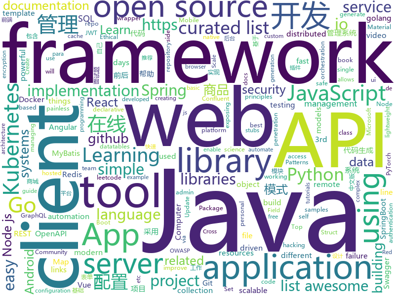

# 2020-02-20
See what the GitHub community is most excited about today.

## python
* [updog](https://github.com/sc0tfree/updog)(**175 stars today**): Updog is a replacement for Python's SimpleHTTPServer. It allows uploading and downloading via HTTP/S, can set ad hoc SSL certificates and use http basic auth.
* [DAIN](https://github.com/baowenbo/DAIN)(**83 stars today**): Depth-Aware Video Frame Interpolation (CVPR 2019)
* [pytorch-lightning](https://github.com/PyTorchLightning/pytorch-lightning)(**23 stars today**): The lightweight PyTorch wrapper for ML researchers. Scale your models. Write less boilerplate
* [vid2vid](https://github.com/NVIDIA/vid2vid)(**7 stars today**): Pytorch implementation of our method for high-resolution (e.g. 2048x1024) photorealistic video-to-video translation.
* [DeepFaceLab](https://github.com/iperov/DeepFaceLab)(**39 stars today**): DeepFaceLab is the leading software for creating deepfakes.
* [LaZagne](https://github.com/AlessandroZ/LaZagne)(**60 stars today**): Credentials recovery project
* [ray](https://github.com/ray-project/ray)(**21 stars today**): A fast and simple framework for building and running distributed applications. Ray is packaged with RLlib, a scalable reinforcement learning library, and Tune, a scalable hyperparameter tuning library.
* [models](https://github.com/tensorflow/models)(**35 stars today**): Models and examples built with TensorFlow
* [nlp-recipes](https://github.com/microsoft/nlp-recipes)(**14 stars today**): Natural Language Processing Best Practices & Examples
* [mindsdb](https://github.com/mindsdb/mindsdb)(**13 stars today**): Machine Learning in one line of code
* [odoo](https://github.com/odoo/odoo)(**36 stars today**): Odoo. Open Source Apps To Grow Your Business.
* [jupyter](https://github.com/jupyter/jupyter)(**18 stars today**): Jupyter metapackage for installation, docs and chat
* [noisystudent](https://github.com/google-research/noisystudent)(**22 stars today**): Code for NoisyStudent on SVHN. https://arxiv.org/abs/1911.04252
* [confluent-kafka-python](https://github.com/confluentinc/confluent-kafka-python)(**5 stars today**): Confluent's Kafka Python Client
* [Mask_RCNN](https://github.com/matterport/Mask_RCNN)(**15 stars today**): Mask R-CNN for object detection and instance segmentation on Keras and TensorFlow
* [NekoBotV1](https://github.com/tegal1337/NekoBotV1)(**15 stars today**): NekoBot | Auto Exploiter With 500+ Exploit 2000+ Shell
* [poetry](https://github.com/python-poetry/poetry)(**21 stars today**): Python dependency management and packaging made easy.
* [mlflow](https://github.com/mlflow/mlflow)(**15 stars today**): Open source platform for the machine learning lifecycle
* [flask-restx](https://github.com/python-restx/flask-restx)(**10 stars today**): Fork of Flask-RESTPlus: Fully featured framework for fast, easy and documented API development with Flask
* [dask](https://github.com/dask/dask)(**7 stars today**): Parallel computing with task scheduling
* [ansible](https://github.com/ansible/ansible)(**28 stars today**): Ansible is a radically simple IT automation platform that makes your applications and systems easier to deploy. Avoid writing scripts or custom code to deploy and update your applications — automate in a language that approaches plain English, using SSH, with no agents to install on remote systems. https://docs.ansible.com/ansible/
* [Python-100-Days](https://github.com/ZiniuLu/Python-100-Days)(**43 stars today**): 出处：https://github.com/jackfrued/Python-100-Days.git
* [caldera](https://github.com/mitre/caldera)(**3 stars today**): Automated Adversary Emulation
* [dash](https://github.com/plotly/dash)(**9 stars today**): Analytical Web Apps for Python & R. No JavaScript Required.
* [django-rest-auth](https://github.com/Tivix/django-rest-auth)(**3 stars today**): This app makes it extremely easy to build Django powered SPA's (Single Page App) or Mobile apps exposing all registration and authentication related functionality as CBV's (Class Base View) and REST (JSON)

## java
* [maps](https://github.com/react-native-mapbox-gl/maps)(**8 stars today**): A Mapbox GL react native module for creating custom maps
* [tutorials](https://github.com/eugenp/tutorials)(**26 stars today**): Just Announced - "Learn Spring Security OAuth":
* [TaoBaoTool](https://github.com/makeloveandroid/TaoBaoTool)(**32 stars today**): Xposed插件之淘宝秒杀助手
* [spring-boot](https://github.com/spring-projects/spring-boot)(**29 stars today**): Spring Boot
* [zfile](https://github.com/zhaojun1998/zfile)(**52 stars today**): 在线云盘
* [mall](https://github.com/macrozheng/mall)(**55 stars today**): mall项目是一套电商系统，包括前台商城系统及后台管理系统，基于SpringBoot+MyBatis实现，采用Docker容器化部署。 前台商城系统包含首页门户、商品推荐、商品搜索、商品展示、购物车、订单流程、会员中心、客户服务、帮助中心等模块。 后台管理系统包含商品管理、订单管理、会员管理、促销管理、运营管理、内容管理、统计报表、财务管理、权限管理、设置等模块。
* [jmx_exporter](https://github.com/prometheus/jmx_exporter)(**6 stars today**): A process for exposing JMX Beans via HTTP for Prometheus consumption
* [mockito](https://github.com/mockito/mockito)(**9 stars today**): Most popular Mocking framework for unit tests written in Java
* [dbeaver](https://github.com/dbeaver/dbeaver)(**19 stars today**): Free universal database tool and SQL client
* [redisson](https://github.com/redisson/redisson)(**21 stars today**): Redisson - Redis Java client with features of In-Memory Data Grid. Over 50 Redis based Java objects and services: Set, Multimap, SortedSet, Map, List, Queue, Deque, Semaphore, Lock, AtomicLong, Map Reduce, Publish / Subscribe, Bloom filter, Spring Cache, Tomcat, Scheduler, JCache API, Hibernate, MyBatis, RPC ...
* [schema-registry](https://github.com/confluentinc/schema-registry)(**3 stars today**): Confluent Schema Registry for Kafka
* [cucumber-jvm](https://github.com/cucumber/cucumber-jvm)(**1 stars today**): Cucumber for the JVM
* [piggymetrics](https://github.com/sqshq/piggymetrics)(**10 stars today**): Microservice Architecture with Spring Boot, Spring Cloud and Docker
* [igniter](https://github.com/trojan-gfw/igniter)(**25 stars today**): A trojan client for Android (UNDER CONSTRUCTION).
* [selenium](https://github.com/SeleniumHQ/selenium)(**12 stars today**): A browser automation framework and ecosystem.
* [vhr](https://github.com/lenve/vhr)(**26 stars today**): 微人事是一个前后端分离的人力资源管理系统，项目采用SpringBoot+Vue开发。
* [jeecg-boot](https://github.com/zhangdaiscott/jeecg-boot)(**19 stars today**): 一款基于代码生成器的JAVA快速开发平台，开源界“小普元”超越传统商业企业级开发平台！采用前后端分离架构：SpringBoot 2.x，Ant Design&Vue，Mybatis-plus，Shiro，JWT。强大的代码生成器让前后端代码一键生成，无需写任何代码! 引领新的开发模式(OnlineCoding模式-> 代码生成器模式-> 手工MERGE智能开发)，帮助Java项目解决70%的重复工作，让开发更多关注业务逻辑。既能快速提高开发效率，帮助公司节省成本，同时又不失灵活性。JeecgBoot还独创在线开发模式（No代码）：在线表单配置（表单设计器）、移动配置能力、在线工作流配置（流程设计器）、在线报表配置、在线图表配置、插件能力（可插拔）等等
* [Hystrix](https://github.com/Netflix/Hystrix)(**7 stars today**): Hystrix is a latency and fault tolerance library designed to isolate points of access to remote systems, services and 3rd party libraries, stop cascading failure and enable resilience in complex distributed systems where failure is inevitable.
* [testing-samples](https://github.com/android/testing-samples)(**5 stars today**): A collection of samples demonstrating different frameworks and techniques for automated testing
* [hive](https://github.com/apache/hive)(**3 stars today**): Apache Hive
* [OpenRefine](https://github.com/OpenRefine/OpenRefine)(**5 stars today**): OpenRefine is a free, open source power tool for working with messy data and improving it
* [GadgetProbe](https://github.com/BishopFox/GadgetProbe)(**47 stars today**): Probe endpoints consuming Java serialized objects to identify classes, libraries, and library versions on remote Java classpaths.
* [lottie-react-native](https://github.com/react-native-community/lottie-react-native)(**12 stars today**): Lottie wrapper for React Native.
* [retrofit](https://github.com/square/retrofit)(**15 stars today**): Type-safe HTTP client for Android and Java by Square, Inc.
* [openapi-generator](https://github.com/OpenAPITools/openapi-generator)(**11 stars today**): OpenAPI Generator allows generation of API client libraries (SDK generation), server stubs, documentation and configuration automatically given an OpenAPI Spec (v2, v3)

## unknown
* [computer-vision-basics-in-microsoft-excel](https://github.com/amzn/computer-vision-basics-in-microsoft-excel)(**695 stars today**): Computer Vision Basics in Microsoft Excel (using just formulas)
* [app-ideas](https://github.com/florinpop17/app-ideas)(**728 stars today**): A Collection of application ideas which can be used to improve your coding skills.
* [degoogle](https://github.com/tycrek/degoogle)(**274 stars today**): A huge list of alternatives to Google products. Privacy tips, tricks, and links.
* [RedTeamer](https://github.com/klionsec/RedTeamer)(**77 stars today**): 红方人员作战执行手册
* [Awesome](https://github.com/Awesome-Windows/Awesome)(**45 stars today**): 💻An awesome & curated list of best applications and tools for Windows.
* [awesome-scalability](https://github.com/binhnguyennus/awesome-scalability)(**170 stars today**): The Patterns of Scalable, Reliable, and Performant Large-Scale Systems
* [awesome-php](https://github.com/ziadoz/awesome-php)(**15 stars today**): A curated list of amazingly awesome PHP libraries, resources and shiny things.
* [awesome-deep-learning](https://github.com/ChristosChristofidis/awesome-deep-learning)(**14 stars today**): A curated list of awesome Deep Learning tutorials, projects and communities.
* [3y](https://github.com/ZhongFuCheng3y/3y)(**62 stars today**): 📓从Java基础、JavaWeb基础到常用的框架再到面试题都有完整的教程，几乎涵盖了Java后端必备的知识点
* [hacker-laws](https://github.com/dwmkerr/hacker-laws)(**475 stars today**): 💻📖Laws, Theories, Principles and Patterns that developers will find useful. #hackerlaws
* [PENTESTING-BIBLE](https://github.com/blaCCkHatHacEEkr/PENTESTING-BIBLE)(**19 stars today**): This repository was created and developed by Ammar Amer @cry__pto Only. Updates to this repository will continue to arrive until the number of links reaches 10000 links & 10000 pdf files .Learn Ethical Hacking and penetration testing .hundreds of ethical hacking & penetration testing & red team & cyber security & computer science resources.
* [CVE-2020-0618](https://github.com/euphrat1ca/CVE-2020-0618)(**30 stars today**): SQL Server Reporting Services(CVE-2020-0618)中的RCE
* [AKS](https://github.com/Azure/AKS)(**2 stars today**): Azure Kubernetes Service
* [You-Dont-Know-JS](https://github.com/getify/You-Dont-Know-JS)(**220 stars today**): A book series on JavaScript. @YDKJS on twitter.
* [OnJava8](https://github.com/LingCoder/OnJava8)(**43 stars today**): 《On Java 8》中文版，又名《Java编程思想》 第5版
* [awesome-courses](https://github.com/prakhar1989/awesome-courses)(**22 stars today**): 📚List of awesome university courses for learning Computer Science!
* [Awesome-pytorch-list](https://github.com/bharathgs/Awesome-pytorch-list)(**35 stars today**): A comprehensive list of pytorch related content on github,such as different models,implementations,helper libraries,tutorials etc.
* [awesome-vue](https://github.com/vuejs/awesome-vue)(**21 stars today**): 🎉A curated list of awesome things related to Vue.js
* [effective-java-3rd-chinese](https://github.com/sjsdfg/effective-java-3rd-chinese)(**19 stars today**): effective-java-3rd 中文版 https://sjsdfg.github.io/effective-java-3rd-chinese
* [state-of-the-art-shitcode](https://github.com/trekhleb/state-of-the-art-shitcode)(**36 stars today**): 💩State-of-the-art shitcode principles your project should follow to call it a proper shitcode
* [backendlore](https://github.com/fpereiro/backendlore)(**23 stars today**): How I write backends
* [free-programming-books-zh_CN](https://github.com/justjavac/free-programming-books-zh_CN)(**47 stars today**): 📚免费的计算机编程类中文书籍，欢迎投稿
* [AZ-103-MicrosoftAzureAdministrator](https://github.com/MicrosoftLearning/AZ-103-MicrosoftAzureAdministrator)(**2 stars today**): AZ-103: Microsoft Azure Administrator
* [vagas](https://github.com/frontendbr/vagas)(**6 stars today**): 🔬Espaço para divulgação de vagas para front-enders.
* [Awesome-Red-Teaming](https://github.com/yeyintminthuhtut/Awesome-Red-Teaming)(**11 stars today**): List of Awesome Red Teaming Resources

## javascript
* [Real-Time-Person-Removal](https://github.com/jasonmayes/Real-Time-Person-Removal)(**334 stars today**): Removing people from complex backgrounds in real time using TensorFlow.js in the web browser
* [hs-airdrop](https://github.com/handshake-org/hs-airdrop)(**133 stars today**): Decentralized airdrop to open source developers
* [kbone](https://github.com/wechat-miniprogram/kbone)(**59 stars today**): Web 与小程序同构解决方案
* [cra-template-redux](https://github.com/reduxjs/cra-template-redux)(**100 stars today**): The official Redux+JS template for Create React App
* [leetcode](https://github.com/azl397985856/leetcode)(**72 stars today**): LeetCode Solutions: A Record of My Problem Solving Journey.( leetcode题解，记录自己的leetcode解题之路。)
* [opensource.guide](https://github.com/github/opensource.guide)(**49 stars today**): 📚Community guides for open source creators
* [Daily-Interview-Question](https://github.com/Advanced-Frontend/Daily-Interview-Question)(**18 stars today**): 我是木易杨，公众号「高级前端进阶」作者，每天搞定一道前端大厂面试题，祝大家天天进步，一年后会看到不一样的自己。
* [api-platform](https://github.com/api-platform/api-platform)(**6 stars today**): REST and GraphQL framework to build modern API-driven projects (server-side and client-side)
* [aos](https://github.com/michalsnik/aos)(**19 stars today**): Animate on scroll library
* [leon](https://github.com/leon-ai/leon)(**119 stars today**): 🧠 Leon is your open-source personal assistant.
* [playwright](https://github.com/microsoft/playwright)(**117 stars today**): Node library to automate Chromium, Firefox and WebKit with a single API
* [30DaysOfJavaScript](https://github.com/Asabeneh/30DaysOfJavaScript)(**25 stars today**): 30 days of JavaScript programming challenge is a sep by step guide to learn JavaScript programming language in 30 days
* [microsoft-authentication-library-for-js](https://github.com/AzureAD/microsoft-authentication-library-for-js)(**4 stars today**): Microsoft Authentication Library (MSAL) for JS
* [snapdrop](https://github.com/RobinLinus/snapdrop)(**13 stars today**): A Progressive Web App for local file sharing
* [d3](https://github.com/d3/d3)(**24 stars today**): Bring data to life with SVG, Canvas and HTML.📊📈🎉
* [riot-web](https://github.com/vector-im/riot-web)(**16 stars today**): A glossy Matrix collaboration client for the web.
* [lerna](https://github.com/lerna/lerna)(**20 stars today**): 🐉A tool for managing JavaScript projects with multiple packages.
* [nginx-proxy-manager](https://github.com/jc21/nginx-proxy-manager)(**4 stars today**): Docker container for managing Nginx proxy hosts with a simple, powerful interface
* [socket.io](https://github.com/socketio/socket.io)(**24 stars today**): Realtime application framework (Node.JS server)
* [v4](https://github.com/bchiang7/v4)(**13 stars today**): Fourth iteration of my personal website
* [react](https://github.com/facebook/react)(**91 stars today**): A declarative, efficient, and flexible JavaScript library for building user interfaces.
* [mui-datatables](https://github.com/gregnb/mui-datatables)(**7 stars today**): Datatables for React using Material-UI - https://www.material-ui-datatables.com
* [react-router](https://github.com/ReactTraining/react-router)(**23 stars today**): Declarative routing for React
* [graphql-js](https://github.com/graphql/graphql-js)(**14 stars today**): A reference implementation of GraphQL for JavaScript
* [sequelize](https://github.com/sequelize/sequelize)(**12 stars today**): An easy-to-use multi SQL dialect ORM for Node.js

## html
* [he4rtlabs-challenges-01](https://github.com/he4rtlabs/he4rtlabs-challenges-01)(**6 stars today**): Calculadora de freelance
* [Coursera-ML-AndrewNg-Notes](https://github.com/fengdu78/Coursera-ML-AndrewNg-Notes)(**26 stars today**): 吴恩达老师的机器学习课程个人笔记
* [aave-protocol](https://github.com/aave/aave-protocol)(**2 stars today**): Aave Protocol Version 1.0 - Decentralized Lending Pools
* [lottie](https://github.com/airbnb/lottie)(**4 stars today**): Lottie documentation for http://airbnb.io/lottie
* [django-DefectDojo](https://github.com/DefectDojo/django-DefectDojo)(**2 stars today**): DefectDojo is an open-source application vulnerability correlation and security orchestration tool.
* [ckeditor5](https://github.com/ckeditor/ckeditor5)(**5 stars today**): Powerful rich text editor framework with a modular architecture, modern integrations and features like collaborative editing.
* [BlazorWebFormsComponents](https://github.com/FritzAndFriends/BlazorWebFormsComponents)(**15 stars today**): A collection of Blazor components that emulate the web forms components of the same name
* [csswg-drafts](https://github.com/w3c/csswg-drafts)(**8 stars today**): CSS Working Group Editor Drafts
* [cypress-example-kitchensink](https://github.com/cypress-io/cypress-example-kitchensink)(**2 stars today**): This is an example app used to showcase Cypress.io testing.
* [portainer](https://github.com/portainer/portainer)(**13 stars today**): Making Docker management easy.
* [awesome-angular](https://github.com/PatrickJS/awesome-angular)(**7 stars today**): 📄A curated list of awesome Angular resources
* [cognitive-services-REST-api-samples](https://github.com/Azure-Samples/cognitive-services-REST-api-samples)(**1 stars today**): This is a repo for cognitive services REST API samples in 4 languages: C#, Java, Node.js, and Python.
* [kubernetes-failure-stories](https://github.com/hjacobs/kubernetes-failure-stories)(**16 stars today**): Compilation of public failure/horror stories related to Kubernetes
* [craftinginterpreters](https://github.com/munificent/craftinginterpreters)(**4 stars today**): Repository for the book "Crafting Interpreters"
* [sql-formatter](https://github.com/jdorn/sql-formatter)(**1 stars today**): A lightweight php class for formatting sql statements. Handles automatic indentation and syntax highlighting.
* [coreui-free-angular-admin-template](https://github.com/coreui/coreui-free-angular-admin-template)(**3 stars today**): CoreUI Angular is free Angular 2+ admin template based on Bootstrap 4
* [remark](https://github.com/gnab/remark)(**7 stars today**): A simple, in-browser, markdown-driven slideshow tool.
* [vpncn.github.io](https://github.com/vpncn/vpncn.github.io)(**5 stars today**): 2020中国翻墙软件VPN推荐指南，以及对比SSR、蓝灯、WireGuard、V2ray等科学上网与翻墙方法的优缺点。
* [NodeGoat](https://github.com/OWASP/NodeGoat)(**3 stars today**): The OWASP NodeGoat project provides an environment to learn how OWASP Top 10 security risks apply to web applications developed using Node.js and how to effectively address them.
* [tools](https://github.com/googlecodelabs/tools)(**6 stars today**): Codelabs management & hosting tools
* [skrollr](https://github.com/Prinzhorn/skrollr)(**4 stars today**): Stand-alone parallax scrolling library for mobile (Android + iOS) and desktop. No jQuery. Just plain JavaScript (and some love).
* [awesome-ipfs](https://github.com/ipfs/awesome-ipfs)(**3 stars today**): Useful resources for using IPFS and building things on top of it
* [learning-area](https://github.com/mdn/learning-area)(**3 stars today**): Github repo for the MDN Learning Area.
* [swagger-codegen](https://github.com/swagger-api/swagger-codegen)(**9 stars today**): swagger-codegen contains a template-driven engine to generate documentation, API clients and server stubs in different languages by parsing your OpenAPI / Swagger definition.
* [zenbot](https://github.com/DeviaVir/zenbot)(**3 stars today**): Zenbot is a command-line cryptocurrency trading bot using Node.js and MongoDB.

## go
* [7days-golang](https://github.com/geektutu/7days-golang)(**108 stars today**): 7 days golang apps from scratch (web framework Gee, distributed cache GeeCache, etc) 7天用Go动手写系列[从零实现]
* [charts](https://github.com/helm/charts)(**24 stars today**): Curated applications for Kubernetes
* [validator](https://github.com/go-playground/validator)(**7 stars today**): 💯Go Struct and Field validation, including Cross Field, Cross Struct, Map, Slice and Array diving
* [gogs](https://github.com/gogs/gogs)(**49 stars today**): Gogs is a painless self-hosted Git service
* [helm](https://github.com/helm/helm)(**24 stars today**): The Kubernetes Package Manager
* [vault](https://github.com/hashicorp/vault)(**12 stars today**): A tool for secrets management, encryption as a service, and privileged access management
* [websocket](https://github.com/gorilla/websocket)(**12 stars today**): A fast, well-tested and widely used WebSocket implementation for Go.
* [jwt-go](https://github.com/dgrijalva/jwt-go)(**6 stars today**): Golang implementation of JSON Web Tokens (JWT)
* [terraform](https://github.com/hashicorp/terraform)(**23 stars today**): Terraform enables you to safely and predictably create, change, and improve infrastructure. It is an open source tool that codifies APIs into declarative configuration files that can be shared amongst team members, treated as code, edited, reviewed, and versioned.
* [community](https://github.com/kubernetes/community)(**17 stars today**): Kubernetes community content
* [act](https://github.com/nektos/act)(**13 stars today**): Run your GitHub Actions locally
* [rook](https://github.com/rook/rook)(**7 stars today**): Storage Orchestration for Kubernetes
* [mux](https://github.com/gorilla/mux)(**10 stars today**): A powerful HTTP router and URL matcher for building Go web servers with🦍
* [argo](https://github.com/argoproj/argo)(**12 stars today**): Argo Workflows: Get stuff done with Kubernetes.
* [age](https://github.com/FiloSottile/age)(**56 stars today**): A simple, modern and secure encryption tool with small explicit keys, no config options, and UNIX-style composability.
* [gitea](https://github.com/go-gitea/gitea)(**32 stars today**): Git with a cup of tea, painless self-hosted git service
* [opentelemetry-go](https://github.com/open-telemetry/opentelemetry-go)(**4 stars today**): OpenTelemetry Go API and SDK
* [swag](https://github.com/swaggo/swag)(**8 stars today**): Automatically generate RESTful API documentation with Swagger 2.0 for Go.
* [go-admin](https://github.com/GoAdminGroup/go-admin)(**8 stars today**): A golang framework helps gopher to build a data visualization and admin panel in ten minutes
* [pgx](https://github.com/jackc/pgx)(**7 stars today**): PostgreSQL driver and toolkit for Go
* [flux](https://github.com/fluxcd/flux)(**8 stars today**): The GitOps Kubernetes operator
* [redis](https://github.com/go-redis/redis)(**9 stars today**): Type-safe Redis client for Golang
* [argo-cd](https://github.com/argoproj/argo-cd)(**7 stars today**): Declarative continuous deployment for Kubernetes.
* [chat](https://github.com/tinode/chat)(**6 stars today**): Instant messaging server; backend in Go; iOS, Android, web, command line clients; chatbots
* [atlantis](https://github.com/runatlantis/atlantis)(**3 stars today**): Terraform Pull Request Automation

## WordCloud

