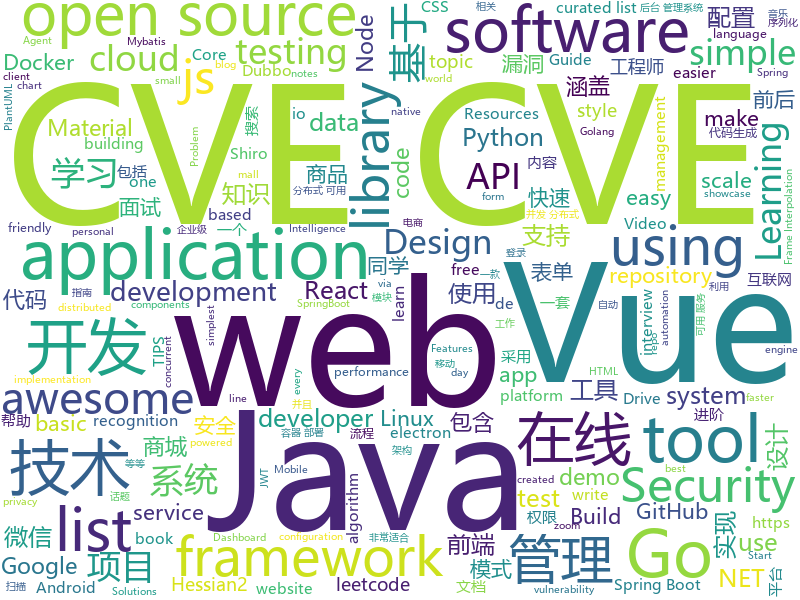

# 2020-02-21
See what the GitHub community is most excited about today.

## python
* [DAIN](https://github.com/baowenbo/DAIN)(**91 stars today**): Depth-Aware Video Frame Interpolation (CVPR 2019)
* [AutoDeleteFileOnPCWechat](https://github.com/blackboxo/AutoDeleteFileOnPCWechat)(**31 stars today**): 自动删除 PC 端微信缓存数据，包括从所有聊天中自动下载的大量文件、视频、图片等数据内容，解放你的空间。
* [HelloGitHub](https://github.com/521xueweihan/HelloGitHub)(**91 stars today**): Find pearls on open-source seashore 分享 GitHub 上有趣、入门级的开源项目
* [face_recognition](https://github.com/ageitgey/face_recognition)(**46 stars today**): The world's simplest facial recognition api for Python and the command line
* [public-apis](https://github.com/public-apis/public-apis)(**70 stars today**): A collective list of free APIs for use in software and web development.
* [weblogicScanner](https://github.com/0xn0ne/weblogicScanner)(**55 stars today**): weblogic 漏洞扫描工具。目前包含 CVE-2014-4210、CVE-2016-0638、CVE-2016-3510、CVE-2017-3248、CVE-2017-3506、CVE-2017-10271、CVE-2018-2628、CVE-2018-2893、CVE-2018-2894、CVE-2018-3191、CVE-2018-3245、CVE-2018-3252、CVE-2019-2618、CVE-2019-2725、CVE-2019-2729、CVE-2019-2890
* [ansible](https://github.com/ansible/ansible)(**28 stars today**): Ansible is a radically simple IT automation platform that makes your applications and systems easier to deploy. Avoid writing scripts or custom code to deploy and update your applications — automate in a language that approaches plain English, using SSH, with no agents to install on remote systems. https://docs.ansible.com/ansible/
* [ALBERT](https://github.com/google-research/ALBERT)(**44 stars today**): ALBERT: A Lite BERT for Self-supervised Learning of Language Representations
* [Awesome-Linux-Software](https://github.com/luong-komorebi/Awesome-Linux-Software)(**54 stars today**): A list of awesome applications, software, tools and other materials for Linux distros.
* [baselines](https://github.com/openai/baselines)(**9 stars today**): OpenAI Baselines: high-quality implementations of reinforcement learning algorithms
* [posthog](https://github.com/PostHog/posthog)(**310 stars today**): 🚀PostHog is developer-friendly, open-source product analytics.
* [updog](https://github.com/sc0tfree/updog)(**162 stars today**): Updog is a replacement for Python's SimpleHTTPServer. It allows uploading and downloading via HTTP/S, can set ad hoc SSL certificates and use http basic auth.
* [Osmedeus](https://github.com/j3ssie/Osmedeus)(**10 stars today**): Fully automated offensive security framework for reconnaissance and vulnerability scanning
* [faceswap](https://github.com/deepfakes/faceswap)(**19 stars today**): Deepfakes Software For All
* [DialoGPT](https://github.com/microsoft/DialoGPT)(**5 stars today**): Large-scale pretraining for dialogue
* [Telethon](https://github.com/LonamiWebs/Telethon)(**9 stars today**): Pure Python 3 MTProto API Telegram client library, for bots too!
* [fast-bert](https://github.com/kaushaltrivedi/fast-bert)(**6 stars today**): Super easy library for BERT based NLP models
* [sepconv-slomo](https://github.com/sniklaus/sepconv-slomo)(**20 stars today**): an implementation of Video Frame Interpolation via Adaptive Separable Convolution using PyTorch
* [ASRT_SpeechRecognition](https://github.com/nl8590687/ASRT_SpeechRecognition)(**9 stars today**): A Deep-Learning-Based Chinese Speech Recognition System 基于深度学习的中文语音识别系统
* [mindsdb](https://github.com/mindsdb/mindsdb)(**29 stars today**): Machine Learning in one line of code
* [AlphaPose](https://github.com/MVIG-SJTU/AlphaPose)(**7 stars today**): Real-Time and Accurate Multi-Person Pose Estimation&Tracking System
* [ursina](https://github.com/pokepetter/ursina)(**22 stars today**): A game engine powered by python and panda3d.
* [streamlit](https://github.com/streamlit/streamlit)(**20 stars today**): Streamlit — The fastest way to build custom ML tools
* [mAP](https://github.com/Cartucho/mAP)(**4 stars today**): mean Average Precision - This code evaluates the performance of your neural net for object recognition.
* [pytest](https://github.com/pytest-dev/pytest)(**9 stars today**): The pytest framework makes it easy to write small tests, yet scales to support complex functional testing

## java
* [toBeTopJavaer](https://github.com/hollischuang/toBeTopJavaer)(**50 stars today**): To Be Top Javaer - Java工程师成神之路
* [litemall](https://github.com/linlinjava/litemall)(**20 stars today**): 又一个小商城。litemall = Spring Boot后端 + Vue管理员前端 + 微信小程序用户前端 + Vue用户移动端
* [JavaGuide](https://github.com/Snailclimb/JavaGuide)(**121 stars today**): 【Java学习+面试指南】 一份涵盖大部分Java程序员所需要掌握的核心知识。
* [jeecg-boot](https://github.com/zhangdaiscott/jeecg-boot)(**17 stars today**): 一款基于代码生成器的JAVA快速开发平台，开源界“小普元”超越传统商业企业级开发平台！采用前后端分离架构：SpringBoot 2.x，Ant Design&Vue，Mybatis-plus，Shiro，JWT。强大的代码生成器让前后端代码一键生成，无需写任何代码! 引领新的开发模式(OnlineCoding模式-> 代码生成器模式-> 手工MERGE智能开发)，帮助Java项目解决70%的重复工作，让开发更多关注业务逻辑。既能快速提高开发效率，帮助公司节省成本，同时又不失灵活性。JeecgBoot还独创在线开发模式（No代码）：在线表单配置（表单设计器）、移动配置能力、在线工作流配置（流程设计器）、在线报表配置、在线图表配置、插件能力（可插拔）等等
* [advanced-java](https://github.com/doocs/advanced-java)(**61 stars today**): 😮互联网 Java 工程师进阶知识完全扫盲：涵盖高并发、分布式、高可用、微服务、海量数据处理等领域知识，后端同学必看，前端同学也可学习
* [mall](https://github.com/macrozheng/mall)(**57 stars today**): mall项目是一套电商系统，包括前台商城系统及后台管理系统，基于SpringBoot+MyBatis实现，采用Docker容器化部署。 前台商城系统包含首页门户、商品推荐、商品搜索、商品展示、购物车、订单流程、会员中心、客户服务、帮助中心等模块。 后台管理系统包含商品管理、订单管理、会员管理、促销管理、运营管理、内容管理、统计报表、财务管理、权限管理、设置等模块。
* [material-components-android](https://github.com/material-components/material-components-android)(**32 stars today**): Modular and customizable Material Design UI components for Android
* [CS-Notes](https://github.com/CyC2018/CS-Notes)(**117 stars today**): 📚技术面试必备基础知识、Leetcode、计算机操作系统、计算机网络、系统设计、Java、Python、C++
* [spock](https://github.com/spockframework/spock)(**4 stars today**): The Enterprise-ready testing and specification framework.
* [learnjavabug](https://github.com/threedr3am/learnjavabug)(**153 stars today**): Java安全相关的漏洞和技术demo，其中包括原生Java、Fastjson、Jackson、Hessian2以及XML反序列化漏洞利用和Dubbo（Hessian2反序列化）、Shiro（PaddingOracleCBC）等框架的exploits，并且还有Java Security Manager绕过、Dubbo-Hessian2安全加固、RMI、tomcat漏洞利用等等实践代码。
* [JCSprout](https://github.com/crossoverJie/JCSprout)(**34 stars today**): 👨‍🎓Java Core Sprout : basic, concurrent, algorithm
* [Pix-EzViewer](https://github.com/Notsfsssf/Pix-EzViewer)(**36 stars today**): 一个支持免代理直连及查看动图的第三方Pixiv android客户端
* [jwt-spring-security-demo](https://github.com/szerhusenBC/jwt-spring-security-demo)(**4 stars today**): A demo for using JWT (Json Web Token) with Spring Security and Spring Boot 2
* [micrometer](https://github.com/micrometer-metrics/micrometer)(**5 stars today**): An application metrics facade for the most popular monitoring tools. Think SLF4J, but for metrics.
* [mit-deep-learning-book-pdf](https://github.com/janishar/mit-deep-learning-book-pdf)(**11 stars today**): MIT Deep Learning Book in PDF format (complete and parts) by Ian Goodfellow, Yoshua Bengio and Aaron Courville
* [hadoop](https://github.com/apache/hadoop)(**6 stars today**): Apache Hadoop
* [SpringBoot-Shiro-Vue](https://github.com/Heeexy/SpringBoot-Shiro-Vue)(**2 stars today**): 提供一套基于Spring Boot-Shiro-Vue的权限管理思路.前后端都加以控制,做到按钮/接口级别的权限
* [sonarqube](https://github.com/SonarSource/sonarqube)(**7 stars today**): Continuous Inspection
* [miaosha](https://github.com/qiurunze123/miaosha)(**49 stars today**): ⭐⭐⭐⭐秒杀系统设计与实现.互联网工程师进阶与分析🙋🐓
* [nacos](https://github.com/alibaba/nacos)(**13 stars today**): an easy-to-use dynamic service discovery, configuration and service management platform for building cloud native applications.
* [paascloud-master](https://github.com/paascloud/paascloud-master)(**11 stars today**): spring cloud + vue + oAuth2.0全家桶实战，前后端分离模拟商城，完整的购物流程、后端运营平台，可以实现快速搭建企业级微服务项目。支持微信登录等三方登录。
* [grafika](https://github.com/google/grafika)(**5 stars today**): Grafika test app
* [MPAndroidChart](https://github.com/PhilJay/MPAndroidChart)(**10 stars today**): A powerful🚀Android chart view / graph view library, supporting line- bar- pie- radar- bubble- and candlestick charts as well as scaling, dragging and animations.
* [flink](https://github.com/apache/flink)(**7 stars today**): Apache Flink
* [mall-learning](https://github.com/macrozheng/mall-learning)(**12 stars today**): mall学习教程，架构、业务、技术要点全方位解析。mall项目（25k+star）是一套电商系统，使用现阶段主流技术实现。 涵盖了SpringBoot2.1.3、MyBatis3.4.6、Elasticsearch6.2.2、RabbitMQ3.7.15、Redis3.2、Mongodb3.2、Mysql5.7等技术，采用Docker容器化部署。

## unknown
* [computer-vision-basics-in-microsoft-excel](https://github.com/amzn/computer-vision-basics-in-microsoft-excel)(**361 stars today**): Computer Vision Basics in Microsoft Excel (using just formulas)
* [developer-roadmap](https://github.com/kamranahmedse/developer-roadmap)(**88 stars today**): Roadmap to becoming a web developer in 2020
* [the-book-of-secret-knowledge](https://github.com/trimstray/the-book-of-secret-knowledge)(**71 stars today**): A collection of inspiring lists, manuals, cheatsheets, blogs, hacks, one-liners, cli/web tools and more.
* [awesome-blazor](https://github.com/AdrienTorris/awesome-blazor)(**12 stars today**): Resources for Blazor, a .NET web framework using C#/Razor and HTML that runs in the browser with WebAssembly.
* [Awesome](https://github.com/Awesome-Windows/Awesome)(**71 stars today**): 💻🎉An awesome & curated list of best applications and tools for Windows.
* [awesome-public-datasets](https://github.com/awesomedata/awesome-public-datasets)(**22 stars today**): A topic-centric list of HQ open datasets. PR ☛☛☛
* [awesome-docker](https://github.com/veggiemonk/awesome-docker)(**10 stars today**): 🐳A curated list of Docker resources and projects
* [JavaFamily](https://github.com/AobingJava/JavaFamily)(**64 stars today**): 【互联网一线大厂面试+学习指南】进阶知识完全扫盲：涵盖高并发、分布式、高可用、微服务等领域知识，作者风格幽默，看起来津津有味，把学习当做一种乐趣，何乐而不为，后端同学必看，前端同学我保证你也看得懂，看不懂你加我微信骂我渣男就好了。
* [acwa_book_ru](https://github.com/adelf/acwa_book_ru)(**9 stars today**): Книга "Архитектура сложных веб-приложений. С примерами на Laravel"
* [degoogle](https://github.com/tycrek/degoogle)(**169 stars today**): A huge list of alternatives to Google products. Privacy tips, tricks, and links.
* [awesome-algorithms](https://github.com/tayllan/awesome-algorithms)(**9 stars today**): A curated list of awesome places to learn and/or practice algorithms.
* [awesome-datascience](https://github.com/academic/awesome-datascience)(**11 stars today**): 📝An awesome Data Science repository to learn and apply for real world problems.
* [awesome-dotnet](https://github.com/quozd/awesome-dotnet)(**19 stars today**): A collection of awesome .NET libraries, tools, frameworks and software
* [architect-awesome](https://github.com/xingshaocheng/architect-awesome)(**55 stars today**): 后端架构师技术图谱
* [You-Dont-Know-JS](https://github.com/getify/You-Dont-Know-JS)(**108 stars today**): A book series on JavaScript. @YDKJS on twitter.
* [fucking-algorithm](https://github.com/labuladong/fucking-algorithm)(**51 stars today**): labuladong 的算法小抄，总结各种常考算法的套路，助力刷题面试
* [awesome-burp-suite](https://github.com/alphaSeclab/awesome-burp-suite)(**7 stars today**): Awesome Burp Suite Resources. 400+ open source Burp plugins, 400+ posts and videos.
* [pix-dict-api](https://github.com/bacen/pix-dict-api)(**12 stars today**): API do DICT - Diretório de Identificadores de Contas Transacionais
* [C4-PlantUML](https://github.com/RicardoNiepel/C4-PlantUML)(**8 stars today**): C4-PlantUML combines the benefits of PlantUML and the C4 model for providing a simple way of describing and communicate software architectures
* [NanoPi-R2S](https://github.com/soffchen/NanoPi-R2S)(**9 stars today**): 使用 Github Actions 在线编译 NanoPi-R2S 固件
* [datasharing](https://github.com/jtleek/datasharing)(**1 stars today**): The Leek group guide to data sharing
* [system-design-interview](https://github.com/checkcheckzz/system-design-interview)(**12 stars today**): System design interview for IT companies
* [NanoPi-R1S-Build-By-Actions](https://github.com/skytotwo/NanoPi-R1S-Build-By-Actions)(**3 stars today**): NanoPi R1S H5 Build By Actions
* [OSINT_TIPS](https://github.com/blaCCkHatHacEEkr/OSINT_TIPS)(**6 stars today**): This repository was created and developed by Ammar Amer @cry__pto Only. Updates to this repository will continue to arrive until the number of TIPS reach 1000 TIPS .Learn Ethical Hacking and penetration testing.and of course OSINT
* [awesome-data-augmentation](https://github.com/CrazyVertigo/awesome-data-augmentation)(**12 stars today**): This is a list of awesome methods about data augmentation.

## javascript
* [nodebestpractices](https://github.com/goldbergyoni/nodebestpractices)(**53 stars today**): ✅The largest Node.js best practices list (January 2020)
* [cra-template-redux](https://github.com/reduxjs/cra-template-redux)(**94 stars today**): The official Redux+JS template for Create React App
* [Real-Time-Person-Removal](https://github.com/jasonmayes/Real-Time-Person-Removal)(**509 stars today**): Removing people from complex backgrounds in real time using TensorFlow.js in the web browser
* [audio-twitter](https://github.com/nemanjam/audio-twitter)(**7 stars today**): Twitter clone with audio messages made with React, Apollo and MongoDB.
* [react-table](https://github.com/tannerlinsley/react-table)(**27 stars today**): ⚛️Hooks for building fast and extendable tables and datagrids for React
* [opencti](https://github.com/OpenCTI-Platform/opencti)(**13 stars today**): Open Cyber Threat Intelligence Platform
* [javascript](https://github.com/airbnb/javascript)(**56 stars today**): JavaScript Style Guide
* [leetcode](https://github.com/azl397985856/leetcode)(**65 stars today**): LeetCode Solutions: A Record of My Problem Solving Journey.( leetcode题解，记录自己的leetcode解题之路。)
* [UnblockNeteaseMusic](https://github.com/nondanee/UnblockNeteaseMusic)(**26 stars today**): Revive unavailable songs for Netease Cloud Music
* [kbone](https://github.com/wechat-miniprogram/kbone)(**58 stars today**): Web 与小程序同构解决方案
* [dtale](https://github.com/man-group/dtale)(**146 stars today**): Flask/React client for visualizing pandas data structures
* [hs-airdrop](https://github.com/handshake-org/hs-airdrop)(**105 stars today**): Decentralized airdrop to open source developers
* [electron-vue-music](https://github.com/SmallRuralDog/electron-vue-music)(**24 stars today**): 基于 electron-vue 开发的音乐播放器，界面模仿QQ音乐，技术栈electron-vue+vue+vuex+vue-router+element- UI。欢迎star
* [HttpReports](https://github.com/SpringLeee/HttpReports)(**21 stars today**): 使用HttpReports可以快速搭建.Net Core环境下统计,分析,图表,监控一体化的站点，并且支持多种数据库存储，适应.Net Core WebAPI,MVC，Web项目, 通过引用Nuget构建Dashboard面板，非常适合中小项目使用。
* [taiko](https://github.com/getgauge/taiko)(**148 stars today**): A node.js library for testing modern web applications
* [docusaurus](https://github.com/facebook/docusaurus)(**22 stars today**): Easy to maintain open source documentation websites.
* [vue-form-making](https://github.com/GavinZhuLei/vue-form-making)(**27 stars today**): A designer and generator of form base on Vue.js, make form development simple and efficient.（基于Vue的表单设计器，让表单开发简单而高效。）
* [realworld](https://github.com/gothinkster/realworld)(**78 stars today**): "The mother of all demo apps" — Exemplary fullstack Medium.com clone powered by React, Angular, Node, Django, and many more🏅
* [awesome-selfhosted](https://github.com/awesome-selfhosted/awesome-selfhosted)(**39 stars today**): A list of Free Software network services and web applications which can be hosted locally. Selfhosting is the process of hosting and managing applications instead of renting from Software-as-a-Service providers
* [react-blog-github](https://github.com/saadpasta/react-blog-github)(**94 stars today**): React + Github Issues👉Your Personal Blog🔥
* [awesome-mac](https://github.com/jaywcjlove/awesome-mac)(**54 stars today**):  Now we have become very big, Different from the original idea. Collect premium software in various categories.
* [emotion](https://github.com/emotion-js/emotion)(**12 stars today**): 👩‍🎤CSS-in-JS library designed for high performance style composition
* [ice](https://github.com/alibaba/ice)(**18 stars today**): 🚀Simple and friendly front-end development system（飞冰，简单而友好的前端研发体系 ）https://ice.work/
* [material-ui](https://github.com/mui-org/material-ui)(**51 stars today**): React components for faster and easier web development. Build your own design system, or start with Material Design.
* [showdoc](https://github.com/star7th/showdoc)(**47 stars today**): ShowDoc is a tool greatly applicable for an IT team to share documents online一个非常适合IT团队的在线API文档、技术文档工具

## html
* [Malware-Analysis-Training](https://github.com/OpenRCE/Malware-Analysis-Training)(**104 stars today**): Retired beginner/intermediate malware analysis training materials from @pedramamini and @erocarrera.
* [startbootstrap-sb-admin](https://github.com/BlackrockDigital/startbootstrap-sb-admin)(**6 stars today**): A free, open source, Bootstrap admin theme created by Start Bootstrap
* [fonts](https://github.com/google/fonts)(**7 stars today**): Font files available from Google Fonts
* [beautiful-jekyll](https://github.com/daattali/beautiful-jekyll)(**3 stars today**): ✨Build a beautiful and simple website in literally minutes. Demo at http://deanattali.com/beautiful-jekyll
* [Web-Security-Learning](https://github.com/CHYbeta/Web-Security-Learning)(**4 stars today**): Web-Security-Learning
* [github-markdown-css](https://github.com/sindresorhus/github-markdown-css)(**6 stars today**): The minimal amount of CSS to replicate the GitHub Markdown style
* [vpncn.github.io](https://github.com/vpncn/vpncn.github.io)(**6 stars today**): 2020中国翻墙软件VPN推荐指南，以及对比SSR、蓝灯、WireGuard、V2ray等科学上网与翻墙方法的优缺点。
* [cypress-example-kitchensink](https://github.com/cypress-io/cypress-example-kitchensink)(**2 stars today**): This is an example app used to showcase Cypress.io testing.
* [simpl](https://github.com/samdutton/simpl)(**4 stars today**): Simplest possible examples of HTML, CSS and Javascript:
* [owasp-mstg](https://github.com/OWASP/owasp-mstg)(**8 stars today**): The Mobile Security Testing Guide (MSTG) is a comprehensive manual for mobile app security development, testing and reverse engineering.
* [craftinginterpreters](https://github.com/munificent/craftinginterpreters)(**6 stars today**): Repository for the book "Crafting Interpreters"
* [personal-website](https://github.com/github/personal-website)(**6 stars today**): Code that'll help you kickstart a personal website that showcases your work as a software developer.
* [portainer](https://github.com/portainer/portainer)(**10 stars today**): Making Docker management easy.
* [indigo](https://github.com/sergiokopplin/indigo)(**2 stars today**): 🍜Minimalist Jekyll Template
* [he4rtlabs-challenges-01](https://github.com/he4rtlabs/he4rtlabs-challenges-01)(**4 stars today**): Calculadora de freelance
* [electron-api-demos](https://github.com/electron/electron-api-demos)(**4 stars today**): Explore the Electron APIs
* [tools](https://github.com/googlecodelabs/tools)(**6 stars today**): Codelabs management & hosting tools
* [learning-area](https://github.com/mdn/learning-area)(**4 stars today**): Github repo for the MDN Learning Area.
* [DevOps-Guide](https://github.com/Tikam02/DevOps-Guide)(**5 stars today**): DevOps Guide from basic to advanced with Interview Questions and Notes🔥
* [cs231n.github.io](https://github.com/cs231n/cs231n.github.io)(**7 stars today**): Public facing notes page
* [lottie](https://github.com/airbnb/lottie)(**3 stars today**): Lottie documentation for http://airbnb.io/lottie
* [node-interview](https://github.com/ElemeFE/node-interview)(**4 stars today**): How to pass the Node.js interview of ElemeFE.
* [simple-icons](https://github.com/simple-icons/simple-icons)(**3 stars today**): SVG icons for popular brands
* [django-DefectDojo](https://github.com/DefectDojo/django-DefectDojo)(**2 stars today**): DefectDojo is an open-source application vulnerability correlation and security orchestration tool.
* [linux-command](https://github.com/jaywcjlove/linux-command)(**8 stars today**): Linux命令大全搜索工具，内容包含Linux命令手册、详解、学习、搜集。https://git.io/linux

## go
* [BaiduPCS-Go](https://github.com/iikira/BaiduPCS-Go)(**112 stars today**): 百度网盘客户端 - Go语言编写
* [7days-golang](https://github.com/geektutu/7days-golang)(**189 stars today**): 7 days golang apps from scratch (web framework Gee, distributed cache GeeCache, etc) 7天用Go动手写系列[从零实现]
* [night-reading-go](https://github.com/developer-learning/night-reading-go)(**10 stars today**): Night-Reading-Go《Go 夜读》 > Share the related technical topics of Go every week through zoom online live broadcast, every day on the WeChat/Slack to communicate programming technology topics. 由 Go 夜读 SIG 成员维护，并通过 zoom 在线直播的方式分享 Go 相关的技术话题，每天大家在微信/Slack 上及时沟通交流编程技术话题。
* [terraform-provider-aws](https://github.com/terraform-providers/terraform-provider-aws)(**8 stars today**): Terraform AWS provider
* [fabric](https://github.com/hyperledger/fabric)(**7 stars today**): Hyperledger Fabric is an enterprise-grade permissioned distributed ledger framework for developing solutions and applications. Its modular and versatile design satisfies a broad range of industry use cases. It offers a unique approach to consensus that enables performance at scale while preserving privacy.
* [xray](https://github.com/chaitin/xray)(**54 stars today**): 一款完善的安全评估工具，支持常见 web 安全问题扫描和自定义 poc | 使用之前务必先阅读文档
* [metabigor](https://github.com/j3ssie/metabigor)(**9 stars today**): Intelligence tool but without API key
* [pingtunnel](https://github.com/esrrhs/pingtunnel)(**23 stars today**): a tool that advertises tcp/udp/socks5 traffic as icmp traffic for forwarding.流量转发工具.
* [conftest](https://github.com/instrumenta/conftest)(**28 stars today**): Write tests against structured configuration data using the Open Policy Agent Rego query language
* [charts](https://github.com/helm/charts)(**32 stars today**): Curated applications for Kubernetes
* [traefik](https://github.com/containous/traefik)(**26 stars today**): The Cloud Native Edge Router
* [v2ray-core](https://github.com/v2ray/v2ray-core)(**72 stars today**): A platform for building proxies to bypass network restrictions.
* [age](https://github.com/FiloSottile/age)(**120 stars today**): A simple, modern and secure encryption tool with small explicit keys, no config options, and UNIX-style composability.
* [enhancements](https://github.com/kubernetes/enhancements)(**6 stars today**): Features tracking repo for Kubernetes releases
* [opa](https://github.com/open-policy-agent/opa)(**10 stars today**): An open source, general-purpose policy engine.
* [rpcx](https://github.com/smallnest/rpcx)(**8 stars today**): A zero cost, faster multi-language bidirectional microservices framework in Go, like alibaba Dubbo, but with more features, Scale easily. Try it. Test it. If you feel it's better, use it! 𝐉𝐚𝐯𝐚有𝐝𝐮𝐛𝐛𝐨, 𝐆𝐨𝐥𝐚𝐧𝐠有𝐫𝐩𝐜𝐱!
* [buildkit](https://github.com/moby/buildkit)(**6 stars today**): concurrent, cache-efficient, and Dockerfile-agnostic builder toolkit
* [gocv](https://github.com/hybridgroup/gocv)(**6 stars today**): Go package for computer vision using OpenCV 4 and beyond.
* [atlantis](https://github.com/runatlantis/atlantis)(**6 stars today**): Terraform Pull Request Automation
* [rclone](https://github.com/rclone/rclone)(**31 stars today**): "rsync for cloud storage" - Google Drive, Amazon Drive, S3, Dropbox, Backblaze B2, One Drive, Swift, Hubic, Cloudfiles, Google Cloud Storage, Yandex Files
* [ElasticHD](https://github.com/360EntSecGroup-Skylar/ElasticHD)(**4 stars today**): Elasticsearch 可视化DashBoard, 支持Es监控、实时搜索，Index template快捷替换修改，索引列表信息查看， SQL converts to DSL等
* [gorm](https://github.com/jinzhu/gorm)(**20 stars today**): The fantastic ORM library for Golang, aims to be developer friendly (v2 is under development, PR based on master branch won't be accepted)
* [terratest](https://github.com/gruntwork-io/terratest)(**8 stars today**): Terratest is a Go library that makes it easier to write automated tests for your infrastructure code.
* [gobyexample](https://github.com/mmcgrana/gobyexample)(**5 stars today**): Go by Example
* [kaniko](https://github.com/GoogleContainerTools/kaniko)(**11 stars today**): Build Container Images In Kubernetes

## WordCloud

