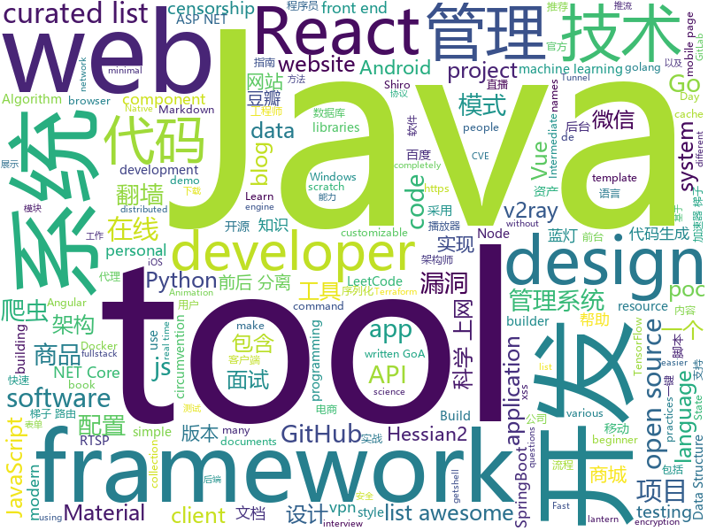

# 2020-02-22
See what the GitHub community is most excited about today.

## python
* [posthog](https://github.com/PostHog/posthog)(**251 stars today**): 🦔 PostHog is developer-friendly, open-source product analytics.
* [Awesome-Linux-Software](https://github.com/luong-komorebi/Awesome-Linux-Software)(**62 stars today**): A list of awesome applications, software, tools and other materials for Linux distros.
* [HelloGitHub](https://github.com/521xueweihan/HelloGitHub)(**89 stars today**): Find pearls on open-source seashore 分享 GitHub 上有趣、入门级的开源项目
* [dm-haiku](https://github.com/deepmind/dm-haiku)(**86 stars today**): JAX-based neural network library
* [Python](https://github.com/injetlee/Python)(**11 stars today**): Python脚本。模拟登录知乎， 爬虫，操作excel，微信公众号，远程开机
* [rlax](https://github.com/deepmind/rlax)(**75 stars today**): 
* [ECommerceCrawlers](https://github.com/DropsDevopsOrg/ECommerceCrawlers)(**10 stars today**): 实战🐍多种网站、电商数据爬虫🕷。包含🕸：淘宝商品、微信公众号、大众点评、招聘网站、闲鱼、阿里任务、博客园、微博、百度贴吧、豆瓣电影、包图网、全景网、豆瓣音乐、某省药监局、搜狐新闻、机器学习文本采集、fofa资产采集、汽车之家、国家统计局、百度关键词收录数、蜘蛛泛目录、今日头条、豆瓣影评、携程、小米应用商店❤️❤️❤️。微信爬虫展示项目:
* [system-design-primer](https://github.com/donnemartin/system-design-primer)(**203 stars today**): Learn how to design large-scale systems. Prep for the system design interview. Includes Anki flashcards.
* [transformers](https://github.com/huggingface/transformers)(**72 stars today**): 🤗Transformers: State-of-the-art Natural Language Processing for TensorFlow 2.0 and PyTorch.
* [Python](https://github.com/TheAlgorithms/Python)(**68 stars today**): All Algorithms implemented in Python
* [django-cms](https://github.com/divio/django-cms)(**9 stars today**): The easy-to-use and developer-friendly CMS
* [AJPy](https://github.com/hypn0s/AJPy)(**33 stars today**): 
* [bayonet](https://github.com/CTF-MissFeng/bayonet)(**42 stars today**): bayonet是一款src资产管理系统，从子域名、端口服务、漏洞、爬虫等一体化的资产管理系统
* [openvino_training_extensions](https://github.com/opencv/openvino_training_extensions)(**40 stars today**): Trainable models and NN optimization tools
* [CNVD-2020-10487-Tomcat-Ajp-lfi](https://github.com/YDHCUI/CNVD-2020-10487-Tomcat-Ajp-lfi)(**67 stars today**): Tomcat-Ajp协议文件读取漏洞
* [face_recognition](https://github.com/ageitgey/face_recognition)(**78 stars today**): The world's simplest facial recognition api for Python and the command line
* [synapse](https://github.com/matrix-org/synapse)(**13 stars today**): Synapse: Matrix reference homeserver
* [YouCompleteMe](https://github.com/ycm-core/YouCompleteMe)(**17 stars today**): A code-completion engine for Vim
* [awesome-python](https://github.com/vinta/awesome-python)(**52 stars today**): A curated list of awesome Python frameworks, libraries, software and resources
* [CNVD-2020-10487-Tomcat-Ajp-lfi-Scanner](https://github.com/Kit4y/CNVD-2020-10487-Tomcat-Ajp-lfi-Scanner)(**74 stars today**): CNVD-2020-10487/CVE-2020-1938,批量扫描工具
* [lanzou-gui](https://github.com/rachpt/lanzou-gui)(**29 stars today**): 蓝奏云 | 蓝奏云客户端 | 蓝奏网盘 GUI版本
* [manim](https://github.com/3b1b/manim)(**42 stars today**): Animation engine for explanatory math videos
* [data-science-from-scratch](https://github.com/joelgrus/data-science-from-scratch)(**8 stars today**): code for Data Science From Scratch book
* [coursera-ml-py](https://github.com/nsoojin/coursera-ml-py)(**8 stars today**): Python programming assignments for Machine Learning by Prof. Andrew Ng in Coursera
* [Medusa](https://github.com/Ascotbe/Medusa)(**3 stars today**): 🐈美杜莎扫描器https://www.ascotbe.com/Medusa

## java
* [learnjavabug](https://github.com/threedr3am/learnjavabug)(**157 stars today**): Java安全相关的漏洞和技术demo，其中包括原生Java、Fastjson、Jackson、Hessian2以及XML反序列化漏洞利用和Dubbo（Hessian2反序列化）、Shiro（PaddingOracleCBC）等框架的exploits，并且还有Java Security Manager绕过、Dubbo-Hessian2安全加固、RMI、tomcat漏洞利用等等实践代码。
* [material-components-android](https://github.com/material-components/material-components-android)(**60 stars today**): Modular and customizable Material Design UI components for Android
* [mall](https://github.com/macrozheng/mall)(**62 stars today**): mall项目是一套电商系统，包括前台商城系统及后台管理系统，基于SpringBoot+MyBatis实现，采用Docker容器化部署。 前台商城系统包含首页门户、商品推荐、商品搜索、商品展示、购物车、订单流程、会员中心、客户服务、帮助中心等模块。 后台管理系统包含商品管理、订单管理、会员管理、促销管理、运营管理、内容管理、统计报表、财务管理、权限管理、设置等模块。
* [JavaGuide](https://github.com/Snailclimb/JavaGuide)(**118 stars today**): 【Java学习+面试指南】 一份涵盖大部分Java程序员所需要掌握的核心知识。
* [netty](https://github.com/netty/netty)(**12 stars today**): Netty project - an event-driven asynchronous network application framework
* [litemall](https://github.com/linlinjava/litemall)(**25 stars today**): 又一个小商城。litemall = Spring Boot后端 + Vue管理员前端 + 微信小程序用户前端 + Vue用户移动端
* [retrofit](https://github.com/square/retrofit)(**14 stars today**): Type-safe HTTP client for Android and Java by Square, Inc.
* [toBeTopJavaer](https://github.com/hollischuang/toBeTopJavaer)(**69 stars today**): To Be Top Javaer - Java工程师成神之路
* [CS-Notes](https://github.com/CyC2018/CS-Notes)(**120 stars today**): 📚技术面试必备基础知识、Leetcode、计算机操作系统、计算机网络、系统设计、Java、Python、C++
* [hello-blog](https://github.com/byteblogs168/hello-blog)(**59 stars today**): hello-blog 一个简单通用的前后分离的博客系统 后端代码 文档地址
* [Penetration_Testing_POC](https://github.com/Mr-xn/Penetration_Testing_POC)(**8 stars today**): 渗透测试有关的POC、EXP、脚本、提权、小工具等，欢迎补充、完善---About penetration-testing python-script poc html-poc getshell csrf xss cms php-getshell domainmod-xss penetration-testing-poc csrf-webshell cobub-razor cve rce sql
* [ftgo-application](https://github.com/microservices-patterns/ftgo-application)(**6 stars today**): Example code for the book Microservice patterns
* [libgdx](https://github.com/libgdx/libgdx)(**8 stars today**): Desktop/Android/HTML5/iOS Java game development framework
* [miaosha](https://github.com/qiurunze123/miaosha)(**48 stars today**): ⭐⭐⭐⭐秒杀系统设计与实现.互联网工程师进阶与分析🙋🐓
* [JGrowing](https://github.com/javagrowing/JGrowing)(**17 stars today**): Java is Growing up but not only Java。Java成长路线，但学到不仅仅是Java。
* [fullstack-tutorial](https://github.com/frank-lam/fullstack-tutorial)(**37 stars today**): 🚀fullstack tutorial 2019，后台技术栈/架构师之路/全栈开发社区，春招/秋招/校招/面试
* [pix-dict-quickstart](https://github.com/bacen/pix-dict-quickstart)(**23 stars today**): Quickstart da API do DICT
* [jeecg-boot](https://github.com/zhangdaiscott/jeecg-boot)(**22 stars today**): 一款基于代码生成器的JAVA快速开发平台，开源界“小普元”超越传统商业企业级开发平台！采用前后端分离架构：SpringBoot 2.x，Ant Design&Vue，Mybatis-plus，Shiro，JWT。强大的代码生成器让前后端代码一键生成，无需写任何代码! 引领新的开发模式(OnlineCoding模式-> 代码生成器模式-> 手工MERGE智能开发)，帮助Java项目解决70%的重复工作，让开发更多关注业务逻辑。既能快速提高开发效率，帮助公司节省成本，同时又不失灵活性。JeecgBoot还独创在线开发模式（No代码）：在线表单配置（表单设计器）、移动配置能力、在线工作流配置（流程设计器）、在线报表配置、在线图表配置、插件能力（可插拔）等等
* [SmarterStreaming](https://github.com/daniulive/SmarterStreaming)(**6 stars today**): 国内外为数不多致力于极致体验的超强全自研跨平台(windows/android/iOS)流媒体内核，通过模块化自由组合，支持实时RTMP推流、RTSP推流、RTMP播放器、RTSP播放器、录像、多路流媒体转发、音视频导播、动态视频合成、音频混音、直播互动、内置轻量级RTSP服务等，比快更快，业界真正靠谱的超低延迟直播SDK(1秒内，低延迟模式下200~400ms)。
* [react-native-video](https://github.com/react-native-community/react-native-video)(**3 stars today**): A <Video /> component for react-native
* [hutool](https://github.com/looly/hutool)(**18 stars today**): A set of tools that keep Java sweet.
* [LeetCodeAnimation](https://github.com/MisterBooo/LeetCodeAnimation)(**64 stars today**): Demonstrate all the questions on LeetCode in the form of animation.（用动画的形式呈现解LeetCode题目的思路）
* [Play-with-Data-Structures](https://github.com/liuyubobobo/Play-with-Data-Structures)(**5 stars today**): Codes of my MOOC Course <Play Data Structures in Java>. Updated contents and practices are also included. 我在慕课网上的课程《Java语言玩转数据结构》示例代码。课程的更多更新内容及辅助练习也将逐步添加进这个代码仓。
* [quarkus](https://github.com/quarkusio/quarkus)(**11 stars today**): Quarkus: Supersonic Subatomic Java.
* [vhr](https://github.com/lenve/vhr)(**40 stars today**): 微人事是一个前后端分离的人力资源管理系统，项目采用SpringBoot+Vue开发。

## unknown
* [Awesome](https://github.com/Awesome-Windows/Awesome)(**137 stars today**): 💻🎉An awesome & curated list of best applications and tools for Windows.
* [You-Dont-Know-JS](https://github.com/getify/You-Dont-Know-JS)(**107 stars today**): A book series on JavaScript. @YDKJS on twitter.
* [OpenAPI-Specification](https://github.com/OAI/OpenAPI-Specification)(**61 stars today**): The OpenAPI Specification Repository
* [MET-CS2-Assembly-Dr.M-Abdelfatah](https://github.com/AhmedEldemoksy/MET-CS2-Assembly-Dr.M-Abdelfatah)(**5 stars today**): 
* [project-based-learning](https://github.com/tuvtran/project-based-learning)(**37 stars today**): Curated list of project-based tutorials
* [developer-roadmap](https://github.com/kamranahmedse/developer-roadmap)(**104 stars today**): Roadmap to becoming a web developer in 2020
* [industry-machine-learning](https://github.com/firmai/industry-machine-learning)(**88 stars today**): A curated list of applied machine learning and data science notebooks and libraries across different industries.
* [COVID-19](https://github.com/CSSEGISandData/COVID-19)(**76 stars today**): Novel Coronavirus (COVID-19) Cases, provided by JHU CSSE
* [every-programmer-should-know](https://github.com/mtdvio/every-programmer-should-know)(**19 stars today**): A collection of (mostly) technical things every software developer should know
* [reproducible-image-denoising-state-of-the-art](https://github.com/wenbihan/reproducible-image-denoising-state-of-the-art)(**6 stars today**): Collection of popular and reproducible image denoising works.
* [new-pac](https://github.com/Alvin9999/new-pac)(**87 stars today**): 科学上网/自由上网/翻墙/软件/方法，免费shadowsocks/ss/ssr/v2ray/goflyway账号，vps一键搭建脚本/教程
* [technology-talk](https://github.com/aalansehaiyang/technology-talk)(**53 stars today**): 汇总java生态圈常用技术框架、开源中间件，系统架构、数据库、大公司架构案例、常用三方类库、项目管理、线上问题排查、个人成长、思考等知识
* [the-book-of-secret-knowledge](https://github.com/trimstray/the-book-of-secret-knowledge)(**113 stars today**): A collection of inspiring lists, manuals, cheatsheets, blogs, hacks, one-liners, cli/web tools and more.
* [awesome-docker](https://github.com/veggiemonk/awesome-docker)(**15 stars today**): 🐳A curated list of Docker resources and projects
* [CVE-2020-1938](https://github.com/0nise/CVE-2020-1938)(**26 stars today**): CVE-2020-1938
* [ATTCK-PenTester-Book](https://github.com/Dm2333/ATTCK-PenTester-Book)(**48 stars today**): ATTCK-PenTester-Book
* [AspNetCore-Developer-Roadmap](https://github.com/MoienTajik/AspNetCore-Developer-Roadmap)(**31 stars today**): Roadmap to becoming an ASP.NET Core developer in 2019
* [awesome-java](https://github.com/akullpp/awesome-java)(**14 stars today**): A curated list of awesome frameworks, libraries and software for the Java programming language.
* [download](https://github.com/getlantern/download)(**24 stars today**): Lantern官方版本下载 蓝灯 翻墙 代理 科学上网 外网 加速器 梯子 路由 proxy vpn circumvention gfw
* [MAST](https://github.com/zlai0/MAST)(**10 stars today**): MAST: A Memory-Augmented Self-supervised Tracker
* [architect-awesome](https://github.com/xingshaocheng/architect-awesome)(**55 stars today**): 后端架构师技术图谱
* [awesome-programming-books](https://github.com/jobbole/awesome-programming-books)(**18 stars today**): 经典编程书籍大全，涵盖：计算机系统与网络、系统架构、算法与数据结构、前端开发、后端开发、移动开发、数据库、测试、项目与团队、程序员职业修炼、求职面试等
* [awesome-semantic-web](https://github.com/semantalytics/awesome-semantic-web)(**2 stars today**): A curated list of various semantic web and linked data resources.
* [GSOC2020](https://github.com/mozilla/GSOC2020)(**4 stars today**): Mozilla and GSOC 2020
* [jvm](https://github.com/doocs/jvm)(**5 stars today**): 🤗JVM 底层原理知识总结

## javascript
* [nodebestpractices](https://github.com/goldbergyoni/nodebestpractices)(**159 stars today**): ✅The largest Node.js best practices list (January 2020)
* [Real-Time-Person-Removal](https://github.com/jasonmayes/Real-Time-Person-Removal)(**475 stars today**): Removing people from complex backgrounds in real time using TensorFlow.js in the web browser
* [Front-End-Checklist](https://github.com/thedaviddias/Front-End-Checklist)(**67 stars today**): 🗂The perfect Front-End Checklist for modern websites and meticulous developers
* [html5-boilerplate](https://github.com/h5bp/html5-boilerplate)(**42 stars today**): A professional front-end template for building fast, robust, and adaptable web apps or sites.
* [realworld](https://github.com/gothinkster/realworld)(**95 stars today**): "The mother of all demo apps" — Exemplary fullstack Medium.com clone powered by React, Angular, Node, Django, and many more🏅
* [react-blog-github](https://github.com/saadpasta/react-blog-github)(**185 stars today**): React + Github Issues👉Your Personal Blog🔥
* [dtale](https://github.com/man-group/dtale)(**183 stars today**): Flask/React client for visualizing pandas data structures
* [google-access-helper](https://github.com/haotian-wang/google-access-helper)(**55 stars today**): 谷歌访问助手破解版
* [javascript](https://github.com/airbnb/javascript)(**62 stars today**): JavaScript Style Guide
* [slate](https://github.com/ianstormtaylor/slate)(**12 stars today**): A completely customizable framework for building rich text editors. (Currently in beta.)
* [kasaya](https://github.com/syscolabs/kasaya)(**393 stars today**): A "WYSIWYG" scripting language and runtime for browser automation
* [alpine](https://github.com/alpinejs/alpine)(**129 stars today**): A rugged, minimal framework for composing JavaScript behavior in your markup.
* [showdoc](https://github.com/star7th/showdoc)(**58 stars today**): ShowDoc is a tool greatly applicable for an IT team to share documents online一个非常适合IT团队的在线API文档、技术文档工具
* [material-ui](https://github.com/mui-org/material-ui)(**48 stars today**): React components for faster and easier web development. Build your own design system, or start with Material Design.
* [freeCodeCamp](https://github.com/freeCodeCamp/freeCodeCamp)(**56 stars today**): The https://www.freecodecamp.org open source codebase and curriculum. Learn to code for free together with millions of people.
* [netlify-cms](https://github.com/netlify/netlify-cms)(**18 stars today**): A CMS for Static Site Generators
* [hs-airdrop](https://github.com/handshake-org/hs-airdrop)(**84 stars today**): Decentralized airdrop to open source developers
* [awesome-mac](https://github.com/jaywcjlove/awesome-mac)(**51 stars today**):  Now we have become very big, Different from the original idea. Collect premium software in various categories.
* [next.js](https://github.com/zeit/next.js)(**55 stars today**): The React Framework
* [luban-h5](https://github.com/ly525/luban-h5)(**19 stars today**): [WIP]en: web design tool || mobile page builder/editor || mini webflow for mobile page. zh: 类似易企秀的H5制作、建站工具、可视化搭建系统.
* [trilium](https://github.com/zadam/trilium)(**31 stars today**): Build your personal knowledge base with Trilium Notes
* [sanity](https://github.com/sanity-io/sanity)(**7 stars today**): The Sanity Studio – Collaborate in real-time on structured content
* [grapesjs](https://github.com/artf/grapesjs)(**11 stars today**): Free and Open source Web Builder Framework. Next generation tool for building templates without coding
* [react-starter-kit](https://github.com/kriasoft/react-starter-kit)(**26 stars today**): React Starter Kit — isomorphic web app boilerplate (Node.js, Express, GraphQL, React.js, Babel, PostCSS, Webpack, Browsersync)
* [BaiduyunSpider](https://github.com/k1995/BaiduyunSpider)(**3 stars today**): 百度云网盘搜索引擎，包含爬虫 & 网站

## html
* [Malware-Analysis-Training](https://github.com/OpenRCE/Malware-Analysis-Training)(**192 stars today**): Retired beginner/intermediate malware analysis training materials from @pedramamini and @erocarrera.
* [Front-end-Developer-Interview-Questions](https://github.com/h5bp/Front-end-Developer-Interview-Questions)(**14 stars today**): A list of helpful front-end related questions you can use to interview potential candidates, test yourself or completely ignore.
* [ecma262](https://github.com/tc39/ecma262)(**6 stars today**): Status, process, and documents for ECMA-262
* [hyperblog](https://github.com/freddier/hyperblog)(**8 stars today**): Un blog increíble para el curso de Git y Github de Platzi
* [kubelabs](https://github.com/collabnix/kubelabs)(**9 stars today**): Kubernetes - Beginners | Intermediate | Advanced
* [flutter-in-action](https://github.com/flutterchina/flutter-in-action)(**6 stars today**): 《Flutter实战》电子书
* [boost](https://github.com/boostorg/boost)(**3 stars today**): Super-project for modularized Boost
* [vpncn.github.io](https://github.com/vpncn/vpncn.github.io)(**4 stars today**): 2020中国翻墙软件VPN推荐指南，以及对比SSR、蓝灯、WireGuard、V2ray等科学上网与翻墙方法的优缺点。
* [CLRS](https://github.com/walkccc/CLRS)(**8 stars today**): 📚Solutions to Introduction to Algorithms Third Edition
* [v2-ui](https://github.com/sprov065/v2-ui)(**23 stars today**): 支持多协议多用户的 v2ray 面板，Support multi-protocol multi-user v2ray panel
* [tiny-slider](https://github.com/ganlanyuan/tiny-slider)(**9 stars today**): Vanilla javascript slider for all purposes.
* [geektime-ELK](https://github.com/onebirdrocks/geektime-ELK)(**1 stars today**): ELK Training
* [subweb](https://github.com/lzdnico/subweb)(**10 stars today**): 
* [JavaScript30](https://github.com/wesbos/JavaScript30)(**9 stars today**): 30 Day Vanilla JS Challenge
* [personal-website](https://github.com/github/personal-website)(**4 stars today**): Code that'll help you kickstart a personal website that showcases your work as a software developer.
* [books](https://github.com/Thinkgamer/books)(**2 stars today**): 技术资料分享
* [JPProject.IdentityServer4.AdminUI](https://github.com/brunohbrito/JPProject.IdentityServer4.AdminUI)(**4 stars today**): 🔧ASP.NET Core 3 & Angular 8 Administration Panel for💞IdentityServer4 and ASP.NET Core Identity
* [blaze](https://github.com/blenderskool/blaze)(**3 stars today**): ⚡ File sharing progressive web app built using WebRTC and WebSockets
* [hugo-academic](https://github.com/gcushen/hugo-academic)(**8 stars today**): 📝The website builder for Hugo. Build and deploy a beautiful website in minutes!
* [machine-learning-systems-design](https://github.com/chiphuyen/machine-learning-systems-design)(**7 stars today**): A booklet on machine learning systems design with exercises
* [startbootstrap-sb-admin](https://github.com/BlackrockDigital/startbootstrap-sb-admin)(**2 stars today**): A free, open source, Bootstrap admin theme created by Start Bootstrap
* [github-markdown-css](https://github.com/sindresorhus/github-markdown-css)(**9 stars today**): The minimal amount of CSS to replicate the GitHub Markdown style
* [Markdown-Resume](https://github.com/CyC2018/Markdown-Resume)(**3 stars today**): ⭐️Markdown 简历模版
* [country-list](https://github.com/umpirsky/country-list)(**5 stars today**): 🌐List of all countries with names and ISO 3166-1 codes in all languages and data formats.
* [awesome-competitive-programming](https://github.com/lnishan/awesome-competitive-programming)(**5 stars today**): 💎A curated list of awesome Competitive Programming, Algorithm and Data Structure resources

## go
* [goxygen](https://github.com/Shpota/goxygen)(**81 stars today**): Generate a modern web project with Go, React and MongoDB in seconds.
* [BaiduPCS-Go](https://github.com/iikira/BaiduPCS-Go)(**106 stars today**): 百度网盘客户端 - Go语言编写
* [7days-golang](https://github.com/geektutu/7days-golang)(**128 stars today**): 7 days golang apps from scratch (web framework Gee, distributed cache GeeCache, etc) 7天用Go动手写系列[从零实现]
* [age](https://github.com/FiloSottile/age)(**35 stars today**): A simple, modern and secure encryption tool with small explicit keys, no config options, and UNIX-style composability.
* [charts](https://github.com/helm/charts)(**23 stars today**): Curated applications for Kubernetes
* [terraform-provider-aws](https://github.com/terraform-providers/terraform-provider-aws)(**6 stars today**): Terraform AWS provider
* [inlets](https://github.com/inlets/inlets)(**107 stars today**): Cloud Native Tunnel written in Go
* [hub](https://github.com/github/hub)(**86 stars today**): A command-line tool that makes git easier to use with GitHub.
* [cloud-on-k8s](https://github.com/elastic/cloud-on-k8s)(**5 stars today**): Elastic Cloud on Kubernetes
* [Cloak](https://github.com/cbeuw/Cloak)(**6 stars today**): A censorship circumvention tool to evade detection against state adversaries
* [groupcache](https://github.com/golang/groupcache)(**16 stars today**): groupcache is a caching and cache-filling library, intended as a replacement for memcached in many cases.
* [rqlite](https://github.com/rqlite/rqlite)(**40 stars today**): The lightweight, distributed relational database built on SQLite.
* [metabigor](https://github.com/j3ssie/metabigor)(**10 stars today**): Intelligence tool but without API key
* [terraform-provider-azurerm](https://github.com/terraform-providers/terraform-provider-azurerm)(**3 stars today**): Terraform provider for Azure Resource Manager
* [torrent-client](https://github.com/veggiedefender/torrent-client)(**20 stars today**): Tiny BitTorrent client written in Go
* [go-gitlab](https://github.com/xanzy/go-gitlab)(**3 stars today**): A GitLab API client enabling Go programs to interact with GitLab in a simple and uniform way
* [drone](https://github.com/drone/drone)(**20 stars today**): Drone is a Container-Native, Continuous Delivery Platform
* [mkcert](https://github.com/FiloSottile/mkcert)(**26 stars today**): A simple zero-config tool to make locally trusted development certificates with any names you'd like.
* [go-http-tunnel](https://github.com/mmatczuk/go-http-tunnel)(**4 stars today**): Fast and secure tunnels over HTTP/2
* [flagger](https://github.com/weaveworks/flagger)(**6 stars today**): Progressive delivery Kubernetes operator (Canary, A/B Testing and Blue/Green deployments)
* [vault](https://github.com/hashicorp/vault)(**11 stars today**): A tool for secrets management, encryption as a service, and privileged access management
* [lantern](https://github.com/getlantern/lantern)(**51 stars today**): Lantern官方版本下载 蓝灯 翻墙 代理 科学上网 外网 加速器 梯子 路由 lantern proxy vpn censorship-circumvention censorship gfw accelerator
* [terragrunt](https://github.com/gruntwork-io/terragrunt)(**7 stars today**): Terragrunt is a thin wrapper for Terraform that provides extra tools for working with multiple Terraform modules.
* [go-grpc-middleware](https://github.com/grpc-ecosystem/go-grpc-middleware)(**5 stars today**): Golang gRPC Middlewares: interceptor chaining, auth, logging, retries and more.
* [cron](https://github.com/robfig/cron)(**8 stars today**): a cron library for go

## WordCloud

