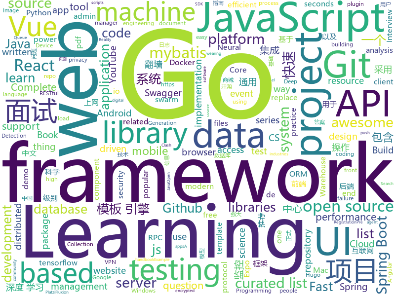

# 2020-02-25
See what the GitHub community is most excited about.

## python
+ [h4cker](https://github.com/The-Art-of-Hacking/h4cker)(**785 stars today**): This repository is primarily maintained by Omar Santos and includes thousands of resources related to ethical hacking / penetration testing, digital forensics and incident response (DFIR), vulnerability research, exploit development, reverse engineering, and more.
+ [FaceMaskDetection](https://github.com/AIZOOTech/FaceMaskDetection)(**62 stars today**): 开源人脸口罩检测模型和数据 Detect faces and determine whether people are wearing mask.
+ [diagrams](https://github.com/mingrammer/diagrams)(**142 stars today**): 🎨Diagram as Code for prototyping cloud system architectures
+ [HelloGitHub](https://github.com/521xueweihan/HelloGitHub)(**234 stars today**): Find pearls on open-source seashore 分享 GitHub 上有趣、入门级的开源项目
+ [Mobile-Security-Framework-MobSF](https://github.com/MobSF/Mobile-Security-Framework-MobSF)(**8 stars today**): Mobile Security Framework (MobSF) is an automated, all-in-one mobile application (Android/iOS/Windows) pen-testing, malware analysis and security assessment framework capable of performing static and dynamic analysis.
+ [jax](https://github.com/google/jax)(**58 stars today**): Composable transformations of Python+NumPy programs: differentiate, vectorize, JIT to GPU/TPU, and more
+ [trfl](https://github.com/deepmind/trfl)(**25 stars today**): TensorFlow Reinforcement Learning
+ [labelImg](https://github.com/tzutalin/labelImg)(**14 stars today**): 🖍️LabelImg is a graphical image annotation tool and label object bounding boxes in images
+ [PySyft](https://github.com/OpenMined/PySyft)(**15 stars today**): A library for encrypted, privacy preserving machine learning
+ [streamlit](https://github.com/streamlit/streamlit)(**15 stars today**): Streamlit — The fastest way to build custom ML tools
+ [scikit-learn](https://github.com/scikit-learn/scikit-learn)(**28 stars today**): scikit-learn: machine learning in Python
+ [plugin.video.youtube](https://github.com/jdf76/plugin.video.youtube)(**4 stars today**): Kodi's Youtube Plugin -- Please Check the forums before submitting an issue
+ [hue](https://github.com/cloudera/hue)(**3 stars today**): Open source SQL Query Assistant for Databases/Warehouses
+ [tensorflow-yolov3](https://github.com/YunYang1994/tensorflow-yolov3)(**16 stars today**): 🔥pure tensorflow Implement of YOLOv3 with support to train your own dataset
+ [OpenNMT-py](https://github.com/OpenNMT/OpenNMT-py)(**6 stars today**): Open Source Neural Machine Translation in PyTorch
+ [pipelines](https://github.com/kubeflow/pipelines)(**4 stars today**): Machine Learning Pipelines for Kubeflow
+ [rally](https://github.com/elastic/rally)(**9 stars today**): Macrobenchmarking framework for Elasticsearch
+ [readthedocs.org](https://github.com/readthedocs/readthedocs.org)(**5 stars today**): The source code that powers readthedocs.org
+ [pyod](https://github.com/yzhao062/pyod)(**8 stars today**): A Python Toolbox for Scalable Outlier Detection (Anomaly Detection)
+ [voxelmorph](https://github.com/voxelmorph/voxelmorph)(**5 stars today**): Unsupervised Learning for Image Registration
+ [models](https://github.com/PaddlePaddle/models)(**8 stars today**): Pre-trained and Reproduced Deep Learning Models （『飞桨』官方模型库，包含多种学术前沿和工业场景验证的深度学习模型）
+ [nba_api](https://github.com/swar/nba_api)(**3 stars today**): An API Client package to access the APIs for NBA.com
+ [mne-python](https://github.com/mne-tools/mne-python)(**1 stars today**): MNE : Magnetoencephalography (MEG) and Electroencephalography (EEG) in Python
+ [celery](https://github.com/celery/celery)(**8 stars today**): Distributed Task Queue (development branch)
+ [youtube_tutorials](https://github.com/vprusso/youtube_tutorials)(**4 stars today**): Collection of scripts corresponding to LucidProgramming YouTube tutorials

## java
+ [haven](https://github.com/guardianproject/haven)(**254 stars today**): Haven is for people who need a way to protect their personal spaces and possessions without compromising their own privacy, through an Android app and on-device sensors
+ [mall-swarm](https://github.com/macrozheng/mall-swarm)(**34 stars today**): mall-swarm是一套微服务商城系统，采用了 Spring Cloud Greenwich、Spring Boot 2、MyBatis、Docker、Elasticsearch等核心技术，同时提供了基于Vue的管理后台方便快速搭建系统。mall-swarm在电商业务的基础集成了注册中心、配置中心、监控中心、网关等系统功能。文档齐全，附带全套Spring Cloud教程。
+ [spring-security](https://github.com/spring-projects/spring-security)(**6 stars today**): Spring Security
+ [jenkins](https://github.com/jenkinsci/jenkins)(**14 stars today**): Jenkins automation server
+ [incubator-shardingsphere](https://github.com/apache/incubator-shardingsphere)(**12 stars today**): Distributed database middleware
+ [spring-boot-api-project-seed](https://github.com/lihengming/spring-boot-api-project-seed)(**18 stars today**): 🌱🚀一个基于Spring Boot & MyBatis的种子项目，用于快速构建中小型API、RESTful API项目~
+ [elasticsearch](https://github.com/elastic/elasticsearch)(**24 stars today**): Open Source, Distributed, RESTful Search Engine
+ [camel](https://github.com/apache/camel)(**1 stars today**): Apache Camel
+ [vhr](https://github.com/lenve/vhr)(**42 stars today**): 微人事是一个前后端分离的人力资源管理系统，项目采用SpringBoot+Vue开发。
+ [guava](https://github.com/google/guava)(**20 stars today**): Google core libraries for Java
+ [thingsboard](https://github.com/thingsboard/thingsboard)(**7 stars today**): Open-source IoT Platform - Device management, data collection, processing and visualization.
+ [mockito](https://github.com/mockito/mockito)(**7 stars today**): Most popular Mocking framework for unit tests written in Java
+ [spring-boot-demo](https://github.com/xkcoding/spring-boot-demo)(**32 stars today**): spring boot demo 是一个用来深度学习并实战 spring boot 的项目，目前总共包含 65 个集成demo，已经完成 53 个。 该项目已成功集成 actuator(监控)、admin(可视化监控)、logback(日志)、aopLog(通过AOP记录web请求日志)、统一异常处理(json级别和页面级别)、freemarker(模板引擎)、thymeleaf(模板引擎)、Beetl(模板引擎)、Enjoy(模板引擎)、JdbcTemplate(通用JDBC操作数据库)、JPA(强大的ORM框架)、mybatis(强大的ORM框架)、通用Mapper(快速操作Mybatis)、PageHelper(通用的Mybatis分页插件)、mybatis-plus(快速操作M…
+ [Hystrix](https://github.com/Netflix/Hystrix)(**12 stars today**): Hystrix is a latency and fault tolerance library designed to isolate points of access to remote systems, services and 3rd party libraries, stop cascading failure and enable resilience in complex distributed systems where failure is inevitable.
+ [miaosha](https://github.com/qiurunze123/miaosha)(**121 stars today**): ⭐⭐⭐⭐秒杀系统设计与实现.互联网工程师进阶与分析🙋🐓
+ [AndroidUtilCode](https://github.com/Blankj/AndroidUtilCode)(**18 stars today**): 🔥Android developers should collect the following utils(updating).
+ [ballerina-lang](https://github.com/ballerina-platform/ballerina-lang)(**40 stars today**): The Ballerina Programming Language
+ [aws-sdk-java-v2](https://github.com/aws/aws-sdk-java-v2)(**2 stars today**): The official AWS SDK for Java - Version 2
+ [netbeans](https://github.com/apache/netbeans)(**5 stars today**): Apache NetBeans
+ [OpenRefine](https://github.com/OpenRefine/OpenRefine)(**5 stars today**): OpenRefine is a free, open source power tool for working with messy data and improving it
+ [spring-boot](https://github.com/spring-projects/spring-boot)(**35 stars today**): Spring Boot
+ [graphhopper](https://github.com/graphhopper/graphhopper)(**7 stars today**): An open source routing engine. Use it as Java library or server. With OpenStreetMap.
+ [litemall](https://github.com/linlinjava/litemall)(**42 stars today**): 又一个小商城。litemall = Spring Boot后端 + Vue管理员前端 + 微信小程序用户前端 + Vue用户移动端
+ [caffeine](https://github.com/ben-manes/caffeine)(**6 stars today**): A high performance caching library for Java 8
+ [dubbo](https://github.com/apache/dubbo)(**16 stars today**): Apache Dubbo is a high-performance, java based, open source RPC framework.

## unknown
+ [coding-interview-university](https://github.com/jwasham/coding-interview-university)(**84 stars today**): A complete computer science study plan to become a software engineer.
+ [COVID-19](https://github.com/CSSEGISandData/COVID-19)(**154 stars today**): Novel Coronavirus (COVID-19) Cases, provided by JHU CSSE
+ [Waking-Up](https://github.com/wolverinn/Waking-Up)(**237 stars today**): 计算机基础（计算机网络/操作系统/数据库/Git...）面试问题全面总结，包含详细的follow-up question以及答案；全部采用【问题+追问+答案】的形式，即拿即用，直击互联网大厂面试；可用于模拟面试、面试前复习、短期内快速备战面试...
+ [awesome-datascience](https://github.com/academic/awesome-datascience)(**18 stars today**): 📝An awesome Data Science repository to learn and apply for real world problems.
+ [learn-regex](https://github.com/ziishaned/learn-regex)(**49 stars today**): Learn regex the easy way
+ [industry-machine-learning](https://github.com/firmai/industry-machine-learning)(**56 stars today**): A curated list of applied machine learning and data science notebooks and libraries across different industries.
+ [GSOC2020](https://github.com/mozilla/GSOC2020)(**3 stars today**): Mozilla and GSOC 2020
+ [AttackVectors](https://github.com/MassMove/AttackVectors)(**16 stars today**): A repository to monitor attack vectors
+ [design-patterns-for-humans](https://github.com/kamranahmedse/design-patterns-for-humans)(**14 stars today**): An ultra-simplified explanation to design patterns
+ [architect-awesome](https://github.com/xingshaocheng/architect-awesome)(**64 stars today**): 后端架构师技术图谱
+ [awesome-c](https://github.com/kozross/awesome-c)(**24 stars today**): A curated list of awesome C frameworks, libraries, resources and other shiny things. Inspired by all the other awesome-... projects out there.
+ [wuhan2020](https://github.com/wuhan2020/wuhan2020)(**35 stars today**): 新型冠状病毒防疫信息收集平台
+ [2019-nCoV](https://github.com/Academic-nCoV/2019-nCoV)(**4 stars today**): 关心2019-nCoV疫情，同步国外（学术、正式组织、有影响力的媒体）信息。
+ [tips_for_interview](https://github.com/conanhujinming/tips_for_interview)(**115 stars today**): Some of my thoughts about interview. 我的一些面试心得
+ [AZ-300-MicrosoftAzureArchitectTechnologies](https://github.com/MicrosoftLearning/AZ-300-MicrosoftAzureArchitectTechnologies)(**3 stars today**): 
+ [cvpr2020](https://github.com/extreme-assistant/cvpr2020)(**28 stars today**): cvpr2020/cvpr2019／cvpr2018/cvpr2017 papers，极市团队整理
+ [Cookbook](https://github.com/andkret/Cookbook)(**16 stars today**): The Data Engineering Cookbook
+ [You-Dont-Know-JS](https://github.com/getify/You-Dont-Know-JS)(**93 stars today**): A book series on JavaScript. @YDKJS on twitter.
+ [reactjs-interview-questions](https://github.com/sudheerj/reactjs-interview-questions)(**12 stars today**): List of top 500 ReactJS Interview Questions & Answers....Coding exercise questions are coming soon!!
+ [react-redux-complete-playlist](https://github.com/iamshaunjp/react-redux-complete-playlist)(**2 stars today**): The course files for the React & Redux Complete tutorial playlist on The Net Ninja YouTube channel.
+ [project-based-learning](https://github.com/tuvtran/project-based-learning)(**44 stars today**): Curated list of project-based tutorials
+ [stanford-cs-229-machine-learning](https://github.com/afshinea/stanford-cs-229-machine-learning)(**5 stars today**): VIP cheatsheets for Stanford's CS 229 Machine Learning
+ [awesome-vue](https://github.com/vuejs/awesome-vue)(**25 stars today**): 🎉A curated list of awesome things related to Vue.js
+ [NanoPi-R2S](https://github.com/soffchen/NanoPi-R2S)(**8 stars today**): 使用 Github Actions 在线编译内置 Clash 的 NanoPi-R2S 固件
+ [awesome-distributed-systems](https://github.com/theanalyst/awesome-distributed-systems)(**6 stars today**): A curated list to learn about distributed systems

## javascript
+ [oidc-client-js](https://github.com/IdentityModel/oidc-client-js)(**5 stars today**): OpenID Connect (OIDC) and OAuth2 protocol support for browser-based JavaScript applications
+ [expense-tracker-react](https://github.com/bradtraversy/expense-tracker-react)(**18 stars today**): Simple expense tracker using React hooks & context
+ [graphql-engine](https://github.com/hasura/graphql-engine)(**25 stars today**): Blazing fast, instant realtime GraphQL APIs on Postgres with fine grained access control, also trigger webhooks on database events.
+ [cypress](https://github.com/cypress-io/cypress)(**33 stars today**): Fast, easy and reliable testing for anything that runs in a browser.
+ [react-select](https://github.com/JedWatson/react-select)(**11 stars today**): The Select Component for React.js
+ [mapbox-gl-js](https://github.com/mapbox/mapbox-gl-js)(**6 stars today**): Interactive, thoroughly customizable maps in the browser, powered by vector tiles and WebGL
+ [alpine](https://github.com/alpinejs/alpine)(**139 stars today**): A rugged, minimal framework for composing JavaScript behavior in your markup.
+ [Sparkle-Proof-Of-Loyalty](https://github.com/Sparklemobile/Sparkle-Proof-Of-Loyalty)(**126 stars today**): Sparkle Proof of Loyalty Contract
+ [generator-jhipster](https://github.com/jhipster/generator-jhipster)(**10 stars today**): Open Source application platform for creating Spring Boot + Angular/React projects in seconds!
+ [jsencrypt](https://github.com/travist/jsencrypt)(**4 stars today**): A Javascript library to perform OpenSSL RSA Encryption, Decryption, and Key Generation.
+ [nodebestpractices](https://github.com/goldbergyoni/nodebestpractices)(**161 stars today**): ✅The largest Node.js best practices list (January 2020)
+ [eui](https://github.com/elastic/eui)(**9 stars today**): Elastic UI Framework🙌
+ [vue](https://github.com/vuejs/vue)(**131 stars today**): 🖖Vue.js is a progressive, incrementally-adoptable JavaScript framework for building UI on the web.
+ [node-red](https://github.com/node-red/node-red)(**12 stars today**): Low-code programming for event-driven applications
+ [complete-javascript-course](https://github.com/jonasschmedtmann/complete-javascript-course)(**32 stars today**): Starter files, final projects and FAQ for my Complete JavaScript course
+ [material-ui](https://github.com/mui-org/material-ui)(**22 stars today**): React components for faster and easier web development. Build your own design system, or start with Material Design.
+ [You-Dont-Need-Momentjs](https://github.com/you-dont-need/You-Dont-Need-Momentjs)(**115 stars today**): List of functions which you can use to replace moment.js + ESLint Plugin
+ [react-native-boilerplate](https://github.com/thecodingmachine/react-native-boilerplate)(**16 stars today**): A React Native project template for building solid applications through separation of concerns between the UI, state management and business logic.
+ [pdf.js](https://github.com/mozilla/pdf.js)(**14 stars today**): PDF Reader in JavaScript
+ [swagger-bootstrap-ui](https://github.com/xiaoymin/swagger-bootstrap-ui)(**23 stars today**): Swagger-bootstrap-ui is the Swagger front-end UI implementation, the purpose is to replace the Swagger default UI implementation Swagger-UI, make the document more friendly....
+ [Signal-Desktop](https://github.com/signalapp/Signal-Desktop)(**8 stars today**): Signal — Private Messenger for Windows, Mac, and Linux
+ [uBlock](https://github.com/gorhill/uBlock)(**44 stars today**): uBlock Origin - An efficient blocker for Chromium and Firefox. Fast and lean.
+ [cli](https://github.com/npm/cli)(**5 stars today**): the package manager for JavaScript
+ [tfjs-examples](https://github.com/tensorflow/tfjs-examples)(**5 stars today**): Examples built with TensorFlow.js
+ [protractor](https://github.com/angular/protractor)(**4 stars today**): E2E test framework for Angular apps

## html
+ [free-for-dev](https://github.com/ripienaar/free-for-dev)(**100 stars today**): A list of SaaS, PaaS and IaaS offerings that have free tiers of interest to devops and infradev
+ [nndl.github.io](https://github.com/nndl/nndl.github.io)(**62 stars today**): 《神经网络与深度学习》 邱锡鹏著 Neural Network and Deep Learning
+ [ecma262](https://github.com/tc39/ecma262)(**11 stars today**): Status, process, and documents for ECMA-262
+ [html](https://github.com/whatwg/html)(**10 stars today**): HTML Standard
+ [wysiwyg-editor](https://github.com/froala/wysiwyg-editor)(**3 stars today**): The next generation Javascript WYSIWYG HTML Editor.
+ [hyperblog](https://github.com/freddier/hyperblog)(**10 stars today**): Un blog increíble para el curso de Git y Github de Platzi
+ [fluxion](https://github.com/FluxionNetwork/fluxion)(**3 stars today**): Fluxion is a remake of linset by vk496 with less bugs and enhanced functionality.
+ [training-kit](https://github.com/github/training-kit)(**0 stars today**): Open source cheat sheets for Git and GitHub
+ [solid](https://github.com/solid/solid)(**10 stars today**): Solid - Re-decentralizing the web (project directory)
+ [vpncn.github.io](https://github.com/vpncn/vpncn.github.io)(**3 stars today**): 2020中国翻墙软件VPN推荐指南，以及对比SSR、蓝灯、WireGuard、V2ray等科学上网与翻墙方法的优缺点。中国科学上网翻墙VPN最新地址推荐。
+ [community](https://github.com/sveltejs/community)(**2 stars today**): A repo for data relating to the svelte community and events
+ [front-end-handbook-2019](https://github.com/FrontendMasters/front-end-handbook-2019)(**4 stars today**): [Book] 2019 edition of our front-end development handbook
+ [examples](https://github.com/expo/examples)(**2 stars today**): Example projects that demonstrate how to use Expo APIs and integrate Expo with other popular tools
+ [cypress-example-kitchensink](https://github.com/cypress-io/cypress-example-kitchensink)(**1 stars today**): This is an example app used to showcase Cypress.io testing.
+ [all-contributors](https://github.com/all-contributors/all-contributors)(**5 stars today**): ✨Recognize all contributors, not just the ones who push code✨
+ [computer-science-flash-cards](https://github.com/jwasham/computer-science-flash-cards)(**10 stars today**): Mini website for testing both general CS knowledge and enforce coding practice and common algorithm/data structure memorization.
+ [mxgraph](https://github.com/jgraph/mxgraph)(**3 stars today**): mxGraph is a fully client side JavaScript diagramming library
+ [learning-area](https://github.com/mdn/learning-area)(**8 stars today**): Github repo for the MDN Learning Area.
+ [Coursera-ML-AndrewNg-Notes](https://github.com/fengdu78/Coursera-ML-AndrewNg-Notes)(**29 stars today**): 吴恩达老师的机器学习课程个人笔记
+ [meghna-hugo](https://github.com/themefisher/meghna-hugo)(**1 stars today**): Meghna Hugo Template
+ [keycloak-documentation](https://github.com/keycloak/keycloak-documentation)(**0 stars today**): 
+ [hugo-academic](https://github.com/gcushen/hugo-academic)(**8 stars today**): 📝The website builder for Hugo. Build and deploy a beautiful website in minutes!
+ [AR.js](https://github.com/jeromeetienne/AR.js)(**13 stars today**): Efficient Augmented Reality for the Web - 60fps on mobile!
+ [Awesome-CS-Books](https://github.com/wx-chevalier/Awesome-CS-Books)(**2 stars today**): 📚Awesome CS Books/Series(.pdf by git lfs) Warehouse for Geeks, ProgrammingLanguage, SoftwareEngineering, Web, AI, ServerSideApplication, Infrastructure, FE etc.💫优秀计算机科学与技术领域相关的书籍归档。
+ [git-it-electron](https://github.com/jlord/git-it-electron)(**6 stars today**): 💻🎓Git-it is a (Mac, Win, Linux) Desktop App for Learning Git and GitHub

## go
+ [lazygit](https://github.com/jesseduffield/lazygit)(**44 stars today**): simple terminal UI for git commands
+ [terraform-provider-azurerm](https://github.com/terraform-providers/terraform-provider-azurerm)(**2 stars today**): Terraform provider for Azure Resource Manager
+ [k6](https://github.com/loadimpact/k6)(**14 stars today**): A modern load testing tool, using Go and JavaScript - https://k6.io
+ [goxygen](https://github.com/Shpota/goxygen)(**109 stars today**): Generate a modern web project with Go, React and MongoDB in seconds 👩🏻‍💻🚀
+ [kubevirt](https://github.com/kubevirt/kubevirt)(**3 stars today**): Kubernetes Virtualization API and runtime in order to define and manage virtual machines.
+ [logrus](https://github.com/sirupsen/logrus)(**21 stars today**): Structured, pluggable logging for Go.
+ [protobuf](https://github.com/golang/protobuf)(**9 stars today**): Go support for Google's protocol buffers
+ [crawlab](https://github.com/crawlab-team/crawlab)(**46 stars today**): Distributed web crawler admin platform for spiders management regardless of languages and frameworks.
+ [mongo-go-driver](https://github.com/mongodb/mongo-go-driver)(**9 stars today**): The Go driver for MongoDB
+ [kind](https://github.com/kubernetes-sigs/kind)(**15 stars today**): Kubernetes IN Docker - local clusters for testing Kubernetes
+ [learn-go-with-tests](https://github.com/quii/learn-go-with-tests)(**16 stars today**): Learn Go with test-driven development
+ [monibuca](https://github.com/langhuihui/monibuca)(**22 stars today**): media stream server develop platform
+ [the-way-to-go_ZH_CN](https://github.com/unknwon/the-way-to-go_ZH_CN)(**19 stars today**): 《The Way to Go》中文译本，中文正式名《Go 入门指南》
+ [prometheus](https://github.com/prometheus/prometheus)(**23 stars today**): The Prometheus monitoring system and time series database.
+ [go-github](https://github.com/google/go-github)(**6 stars today**): Go library for accessing the GitHub API
+ [roadrunner](https://github.com/spiral/roadrunner)(**15 stars today**): High-performance PHP application server, load-balancer and process manager written in Golang
+ [clash](https://github.com/Dreamacro/clash)(**45 stars today**): A rule-based tunnel in Go.
+ [caddy](https://github.com/caddyserver/caddy)(**30 stars today**): Fast, cross-platform HTTP/2 web server with automatic HTTPS
+ [BaiduPCS-Go](https://github.com/iikira/BaiduPCS-Go)(**112 stars today**): 百度网盘客户端 - Go语言编写
+ [grpc-go](https://github.com/grpc/grpc-go)(**11 stars today**): The Go language implementation of gRPC. HTTP/2 based RPC
+ [tendermint](https://github.com/tendermint/tendermint)(**4 stars today**): ⟁ Tendermint Core (BFT Consensus) in Go
+ [telegraf](https://github.com/influxdata/telegraf)(**3 stars today**): The plugin-driven server agent for collecting & reporting metrics.
+ [concourse](https://github.com/concourse/concourse)(**7 stars today**): Concourse is a container-based continuous thing-doer written in Go and Elm.
+ [sarama](https://github.com/Shopify/sarama)(**3 stars today**): Sarama is a Go library for Apache Kafka 0.8, and up.
+ [govalidator](https://github.com/asaskevich/govalidator)(**5 stars today**): [Go] Package of validators and sanitizers for strings, numerics, slices and structs

## WordCloud

