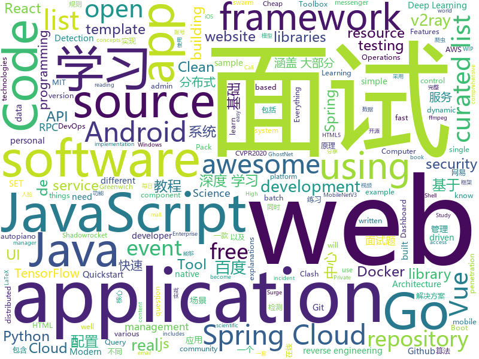

# 2020-02-26
See what the GitHub community is most excited about.

## python
+ [dispatch](https://github.com/Netflix/dispatch)(**232 stars today**): All of the ad-hoc things you're doing to manage incidents today, done for you, and much more!
+ [h4cker](https://github.com/The-Art-of-Hacking/h4cker)(**325 stars today**): This repository is primarily maintained by Omar Santos and includes thousands of resources related to ethical hacking / penetration testing, digital forensics and incident response (DFIR), vulnerability research, exploit development, reverse engineering, and more.
+ [adet](https://github.com/aim-uofa/adet)(**9 stars today**): AdelaiDet is an open source toolbox for multiple instance-level detection applications.
+ [fsociety](https://github.com/Manisso/fsociety)(**12 stars today**): fsociety Hacking Tools Pack – A Penetration Testing Framework
+ [uniflash](https://github.com/uniflash/uniflash)(**13 stars today**): A simple and decentralized protocol for flash loan. https://t.me/Uniflash
+ [FaceMaskDetection](https://github.com/AIZOOTech/FaceMaskDetection)(**78 stars today**): 开源人脸口罩检测模型和数据 Detect faces and determine whether people are wearing mask.
+ [ghostnet](https://github.com/iamhankai/ghostnet)(**44 stars today**): [CVPR2020] Surpassing MobileNetV3: "GhostNet: More Features from Cheap Operations"
+ [Real-Time-Voice-Cloning](https://github.com/CorentinJ/Real-Time-Voice-Cloning)(**21 stars today**): Clone a voice in 5 seconds to generate arbitrary speech in real-time
+ [awesome-machine-learning](https://github.com/josephmisiti/awesome-machine-learning)(**17 stars today**): A curated list of awesome Machine Learning frameworks, libraries and software.
+ [Reptile](https://github.com/librauee/Reptile)(**43 stars today**): 🏀Python3 网络爬虫 猫眼 腾讯视频 豆瓣 研招网 微博 笔趣阁小说 百度热点 B站 CSDN 网易云阅读 阿里文学 百度股票 今日头条 微信公众号 网易云音乐 拉勾 有道 unsplash 实习僧 汽车之家 英雄联盟盒子 大众点评 链家 LPL赛程 台风 梦幻西游、阴阳师藏宝阁 天气 牛客网 百度文库 睡前故事 知乎 Wish
+ [faceai](https://github.com/vipstone/faceai)(**35 stars today**): 一款入门级的人脸、视频、文字检测以及识别的项目.
+ [diagrams](https://github.com/mingrammer/diagrams)(**125 stars today**): 🎨Diagram as Code for prototyping cloud system architectures
+ [Deep-Learning-with-TensorFlow-book](https://github.com/dragen1860/Deep-Learning-with-TensorFlow-book)(**19 stars today**): 深度学习入门开源书，基于TensorFlow 2.0案例实战。Open source Deep Learning book, based on TensorFlow 2.0 framework.
+ [arxiv-latex-cleaner](https://github.com/google-research/arxiv-latex-cleaner)(**9 stars today**): arXiv LaTeX Cleaner: Easily clean the LaTeX code of your paper to submit to arXiv
+ [pyod](https://github.com/yzhao062/pyod)(**6 stars today**): A Python Toolbox for Scalable Outlier Detection (Anomaly Detection)
+ [jupytext](https://github.com/mwouts/jupytext)(**6 stars today**): Jupyter Notebooks as Markdown Documents, Julia, Python or R scripts
+ [spyder](https://github.com/spyder-ide/spyder)(**5 stars today**): Official repository for Spyder - The Scientific Python Development Environment
+ [werkzeug](https://github.com/pallets/werkzeug)(**6 stars today**): The comprehensive WSGI web application library.
+ [ghostnet.pytorch](https://github.com/iamhankai/ghostnet.pytorch)(**20 stars today**): [CVPR2020] Surpassing MobileNetV3: "GhostNet: More Features from Cheap Operations"
+ [liffy](https://github.com/mzfr/liffy)(**7 stars today**): Local file inclusion exploitation tool
+ [faceswap](https://github.com/deepfakes/faceswap)(**25 stars today**): Deepfakes Software For All
+ [models](https://github.com/PaddlePaddle/models)(**17 stars today**): Pre-trained and Reproduced Deep Learning Models （『飞桨』官方模型库，包含多种学术前沿和工业场景验证的深度学习模型）
+ [Learn_Dive-into-DL-PyTorch](https://github.com/monkeyDemon/Learn_Dive-into-DL-PyTorch)(**7 stars today**): Datawhale第10期组队学习活动：《动手学深度学习》Pytorch版的练习代码
+ [social-engineer-toolkit](https://github.com/trustedsec/social-engineer-toolkit)(**6 stars today**): The Social-Engineer Toolkit (SET) repository from TrustedSec - All new versions of SET will be deployed here.
+ [tensorflow_practice](https://github.com/princewen/tensorflow_practice)(**7 stars today**): tensorflow实战练习，包括强化学习、推荐系统、nlp等

## java
+ [Signal-Android](https://github.com/signalapp/Signal-Android)(**14 stars today**): A private messenger for Android.
+ [mall-swarm](https://github.com/macrozheng/mall-swarm)(**59 stars today**): mall-swarm是一套微服务商城系统，采用了 Spring Cloud Greenwich、Spring Boot 2、MyBatis、Docker、Elasticsearch等核心技术，同时提供了基于Vue的管理后台方便快速搭建系统。mall-swarm在电商业务的基础集成了注册中心、配置中心、监控中心、网关等系统功能。文档齐全，附带全套Spring Cloud教程。
+ [pix-dict-quickstart](https://github.com/bacen/pix-dict-quickstart)(**21 stars today**): Quickstart da API do DICT
+ [apollo](https://github.com/ctripcorp/apollo)(**19 stars today**): Apollo（阿波罗）是携程框架部门研发的分布式配置中心，能够集中化管理应用不同环境、不同集群的配置，配置修改后能够实时推送到应用端，并且具备规范的权限、流程治理等特性，适用于微服务配置管理场景。
+ [graal](https://github.com/oracle/graal)(**11 stars today**): GraalVM: Run Programs Faster Anywhere🚀
+ [EasyRPC](https://github.com/yeecode/EasyRPC)(**13 stars today**): EasyRPC是一个远程过程调用（Remote Procedure Call，简称RPC）的最小实现。它使用极少的类、方法演示了RPC的实现原理，是一个学习RPC工作原理的良好示例。
+ [haven](https://github.com/guardianproject/haven)(**84 stars today**): Haven is for people who need a way to protect their personal spaces and possessions without compromising their own privacy, through an Android app and on-device sensors
+ [spring-security](https://github.com/spring-projects/spring-security)(**16 stars today**): Spring Security
+ [FizzBuzzEnterpriseEdition](https://github.com/EnterpriseQualityCoding/FizzBuzzEnterpriseEdition)(**8 stars today**): FizzBuzz Enterprise Edition is a no-nonsense implementation of FizzBuzz made by serious businessmen for serious business purposes.
+ [cas](https://github.com/apereo/cas)(**6 stars today**): Apereo CAS - Enterprise Single Sign On for all earthlings and beyond.
+ [girlscript_app](https://github.com/smaranjitghose/girlscript_app)(**2 stars today**): This is an app built using Flutter for different GirlScript Chapters that is to be used by the community associated with it and to later serve as a template for other tech communities as well. From having the option to portray the member's achievements to announcements regarding various opportunities, we want it to be knit into a single platform…
+ [epic](https://github.com/tiann/epic)(**5 stars today**): Dynamic java method AOP hook for Android(continution of Dexposed on ART), Supporting 4.0~10.0
+ [springcloud-learning](https://github.com/macrozheng/springcloud-learning)(**5 stars today**): 一套涵盖大部分核心组件使用的Spring Cloud教程，包括Spring Cloud Alibaba及分布式事务Seata，基于Spring Cloud Greenwich及SpringBoot 2.1.7。20篇文章，篇篇精华，30个Demo，涵盖大部分应用场景。
+ [interviews](https://github.com/kdn251/interviews)(**38 stars today**): Everything you need to know to get the job.
+ [quarkus-quickstarts](https://github.com/quarkusio/quarkus-quickstarts)(**4 stars today**): Quarkus quickstart code
+ [lottie-android](https://github.com/airbnb/lottie-android)(**11 stars today**): Render After Effects animations natively on Android and iOS, Web, and React Native
+ [maven](https://github.com/apache/maven)(**2 stars today**): Apache Maven core
+ [libgdx](https://github.com/libgdx/libgdx)(**10 stars today**): Desktop/Android/HTML5/iOS Java game development framework
+ [presto](https://github.com/prestodb/presto)(**6 stars today**): The official home of the Presto distributed SQL query engine for big data
+ [spring-batch](https://github.com/spring-projects/spring-batch)(**5 stars today**): Spring Batch is a framework for writing offline and batch applications using Spring and Java
+ [keycloak](https://github.com/keycloak/keycloak)(**9 stars today**): Open Source Identity and Access Management For Modern Applications and Services
+ [piggymetrics](https://github.com/sqshq/piggymetrics)(**10 stars today**): Microservice Architecture with Spring Boot, Spring Cloud and Docker
+ [JavaGuide](https://github.com/Snailclimb/JavaGuide)(**100 stars today**): 【Java学习+面试指南】 一份涵盖大部分Java程序员所需要掌握的核心知识。
+ [tutorials](https://github.com/eugenp/tutorials)(**14 stars today**): Just Announced - "Learn Spring Security OAuth":
+ [nacos](https://github.com/alibaba/nacos)(**13 stars today**): an easy-to-use dynamic service discovery, configuration and service management platform for building cloud native applications.

## unknown
+ [coding-interview-university](https://github.com/jwasham/coding-interview-university)(**799 stars today**): A complete computer science study plan to become a software engineer.
+ [heroicons](https://github.com/refactoringui/heroicons)(**640 stars today**): A set of free MIT-licensed high-quality SVG icons for UI development.
+ [computer-science](https://github.com/ossu/computer-science)(**179 stars today**): 🎓Path to a free self-taught education in Computer Science!
+ [awesome-datascience](https://github.com/academic/awesome-datascience)(**77 stars today**): 📝An awesome Data Science repository to learn and apply for real world problems.
+ [91Porn-crawler](https://github.com/colikno/91Porn-crawler)(**87 stars today**): 🌭💦91porn爬虫在线API接口（永久有效） 及 在线web预览
+ [COVID-19](https://github.com/CSSEGISandData/COVID-19)(**142 stars today**): Novel Coronavirus (COVID-19) Cases, provided by JHU CSSE
+ [tips_for_interview](https://github.com/conanhujinming/tips_for_interview)(**112 stars today**): Some of my thoughts about interview. 我的一些面试心得
+ [gitignore](https://github.com/github/gitignore)(**59 stars today**): A collection of useful .gitignore templates
+ [Waking-Up](https://github.com/wolverinn/Waking-Up)(**401 stars today**): 计算机基础（计算机网络/操作系统/数据库/Git...）面试问题全面总结，包含详细的follow-up question以及答案；全部采用【问题+追问+答案】的形式，即拿即用，直击互联网大厂面试🚀；可用于模拟面试、面试前复习、短期内快速备战面试...
+ [javascript-questions](https://github.com/lydiahallie/javascript-questions)(**111 stars today**): A long list of (advanced) JavaScript questions, and their explanations✨
+ [awesome-react-components](https://github.com/brillout/awesome-react-components)(**18 stars today**): Curated List of React Components & Libraries.
+ [SS-Rule-Snippet](https://github.com/Hackl0us/SS-Rule-Snippet)(**21 stars today**): 搜集、整理、维护 Surge / Quantumult / Shadowrocket / Surfboard / clash(X) 实用规则。
+ [BaiduYunVIP](https://github.com/lpg-it/BaiduYunVIP)(**13 stars today**): 百度云超级会员账号分享, 另分享多款百度云不限速下载工具.
+ [pix-dict-api](https://github.com/bacen/pix-dict-api)(**19 stars today**): API do DICT - Diretório de Identificadores de Contas Transacionais
+ [awesome-c](https://github.com/kozross/awesome-c)(**5 stars today**): A curated list of awesome C frameworks, libraries, resources and other shiny things. Inspired by all the other awesome-... projects out there.
+ [awesome](https://github.com/sindresorhus/awesome)(**166 stars today**): 😎Awesome lists about all kinds of interesting topics
+ [fucking-algorithm](https://github.com/labuladong/fucking-algorithm)(**440 stars today**): labuladong 的算法小抄，总结各种常考算法的套路，助力刷题面试
+ [AI_Curriculum](https://github.com/Machine-Learning-Tokyo/AI_Curriculum)(**256 stars today**): Open Deep Learning and Reinforcement Learning lectures from top Universities like Stanford, MIT, UC Berkeley.
+ [reblog](https://github.com/skysafe/reblog)(**248 stars today**): SkySafe Miscellaneous Reverse Engineering Blog
+ [awesome-ddd](https://github.com/heynickc/awesome-ddd)(**11 stars today**): A curated list of Domain-Driven Design (DDD), Command Query Responsibility Segregation (CQRS), Event Sourcing, and Event Storming resources
+ [Profiles](https://github.com/ConnersHua/Profiles)(**36 stars today**): 
+ [JavbuslibraryRealse](https://github.com/gentlemansolo/JavbuslibraryRealse)(**88 stars today**): JavBus and JabLibrary android app
+ [Front-End-Web-Development-Resources](https://github.com/RitikPatni/Front-End-Web-Development-Resources)(**103 stars today**): This repository contains content which will be helpful in your journey as a front-end Web Developer
+ [scientific-visualization-book](https://github.com/rougier/scientific-visualization-book)(**8 stars today**): ❗️WIP❗️An open access book on scientific visualization using python and matplotlib
+ [six-finger](https://github.com/bin392328206/six-finger)(**9 stars today**): 📓从Java基础、JavaWeb基础到常用的框架再到面试题、微服务、分布式、大数据都有完整的教程，几乎涵盖了Java必备的知识点

## javascript
+ [vue](https://github.com/vuejs/vue)(**208 stars today**): 🖖Vue.js is a progressive, incrementally-adoptable JavaScript framework for building UI on the web.
+ [clean-code-javascript](https://github.com/ryanmcdermott/clean-code-javascript)(**81 stars today**): 🛁Clean Code concepts adapted for JavaScript
+ [node-red](https://github.com/node-red/node-red)(**24 stars today**): Low-code programming for event-driven applications
+ [expense-tracker-react](https://github.com/bradtraversy/expense-tracker-react)(**27 stars today**): Simple expense tracker using React hooks & context
+ [Yike](https://github.com/LyonWong/Yike)(**32 stars today**): 
+ [react-router](https://github.com/ReactTraining/react-router)(**23 stars today**): Declarative routing for React
+ [Rules](https://github.com/lhie1/Rules)(**49 stars today**): Rules / 规则：Surge / Shadowrocket / QuantumultX / Clash(X|A)
+ [vxe-table](https://github.com/xuliangzhan/vxe-table)(**65 stars today**): 🐬vxe-table vue 表格解决方案
+ [academicpages.github.io](https://github.com/academicpages/academicpages.github.io)(**9 stars today**): Github Pages template for academic personal websites, forked from mmistakes/minimal-mistakes
+ [gatsby](https://github.com/gatsbyjs/gatsby)(**40 stars today**): Build blazing fast, modern apps and websites with React
+ [awesome-mac](https://github.com/jaywcjlove/awesome-mac)(**54 stars today**):  Now we have become very big, Different from the original idea. Collect premium software in various categories.
+ [javascript-algorithms](https://github.com/trekhleb/javascript-algorithms)(**91 stars today**): 📝Algorithms and data structures implemented in JavaScript with explanations and links to further readings
+ [33-js-concepts](https://github.com/leonardomso/33-js-concepts)(**19 stars today**): 📜33 concepts every JavaScript developer should know.
+ [Signal-Desktop](https://github.com/signalapp/Signal-Desktop)(**10 stars today**): Signal — Private Messenger for Windows, Mac, and Linux
+ [shadowsocks-manager](https://github.com/shadowsocks/shadowsocks-manager)(**4 stars today**): A shadowsocks manager tool for multi user and traffic control.
+ [fe-interview](https://github.com/haizlin/fe-interview)(**11 stars today**): 前端面试每日 3+1，以面试题来驱动学习，提倡每日学习与思考，每天进步一点！每天早上5点纯手工发布面试题（死磕自己，愉悦大家）
+ [react](https://github.com/facebook/react)(**69 stars today**): A declarative, efficient, and flexible JavaScript library for building user interfaces.
+ [AutoPiano](https://github.com/WarpPrism/AutoPiano)(**8 stars today**): 自由钢琴🎹AutoPiano ( https://www.autopiano.cn ) Simple & Elegant Piano Online
+ [bypass-paywalls-chrome](https://github.com/iamadamdev/bypass-paywalls-chrome)(**19 stars today**): Bypass Paywalls for Chrome
+ [plotly.js](https://github.com/plotly/plotly.js)(**11 stars today**): Open-source JavaScript charting library behind Plotly and Dash
+ [Chart.js](https://github.com/chartjs/Chart.js)(**23 stars today**): Simple HTML5 Charts using the <canvas> tag
+ [react-sortable-tree](https://github.com/frontend-collective/react-sortable-tree)(**4 stars today**): Drag-and-drop sortable component for nested data and hierarchies
+ [strapi-examples](https://github.com/strapi/strapi-examples)(**2 stars today**): 🎓List of examples using Strapi
+ [vue-realworld-example-app](https://github.com/gothinkster/vue-realworld-example-app)(**8 stars today**): An exemplary real-world application built with Vue.js, Vuex, axios and different other technologies. This is a good example to discover Vue for beginners.
+ [winston](https://github.com/winstonjs/winston)(**12 stars today**): A logger for just about everything.

## html
+ [nndl.github.io](https://github.com/nndl/nndl.github.io)(**76 stars today**): 《神经网络与深度学习》 邱锡鹏著 Neural Network and Deep Learning
+ [free-for-dev](https://github.com/ripienaar/free-for-dev)(**219 stars today**): A list of SaaS, PaaS and IaaS offerings that have free tiers of interest to devops and infradev
+ [hyperblog](https://github.com/freddier/hyperblog)(**9 stars today**): Un blog increíble para el curso de Git y Github de Platzi
+ [mxgraph](https://github.com/jgraph/mxgraph)(**8 stars today**): mxGraph is a fully client side JavaScript diagramming library
+ [fastText](https://github.com/facebookresearch/fastText)(**8 stars today**): Library for fast text representation and classification.
+ [owasp-mstg](https://github.com/OWASP/owasp-mstg)(**8 stars today**): The Mobile Security Testing Guide (MSTG) is a comprehensive manual for mobile app security development, testing and reverse engineering.
+ [Coursera-ML-AndrewNg-Notes](https://github.com/fengdu78/Coursera-ML-AndrewNg-Notes)(**32 stars today**): 吴恩达老师的机器学习课程个人笔记
+ [quickstart-js](https://github.com/firebase/quickstart-js)(**6 stars today**): Firebase Quickstart Samples for Web
+ [GTFOBins.github.io](https://github.com/GTFOBins/GTFOBins.github.io)(**5 stars today**): Curated list of Unix binaries that can be exploited to bypass system security restrictions
+ [MIXBOX](https://github.com/monlor/MIXBOX)(**4 stars today**): 一款基于Shell的小米路由器工具箱，原为Monlor-Tools，A tool box for XiaoMi Router base on Shell.
+ [JavaScript30](https://github.com/wesbos/JavaScript30)(**10 stars today**): 30 Day Vanilla JS Challenge
+ [csswg-drafts](https://github.com/w3c/csswg-drafts)(**1 stars today**): CSS Working Group Editor Drafts
+ [node-fluent-ffmpeg](https://github.com/fluent-ffmpeg/node-fluent-ffmpeg)(**6 stars today**): A fluent API to FFMPEG (http://www.ffmpeg.org)
+ [linuxtools_rst](https://github.com/me115/linuxtools_rst)(**2 stars today**): Linux工具快速教程
+ [keep-a-changelog](https://github.com/olivierlacan/keep-a-changelog)(**3 stars today**): If you build software, keep a changelog.
+ [en.javascript.info](https://github.com/javascript-tutorial/en.javascript.info)(**18 stars today**): Modern JavaScript Tutorial
+ [realworld](https://github.com/sveltejs/realworld)(**4 stars today**): Svelte/Sapper implementation of the RealWorld app
+ [my_blog](https://github.com/sanyuan0704/my_blog)(**5 stars today**): 神三元的博客，一起构建完整知识体系
+ [personal-website](https://github.com/github/personal-website)(**8 stars today**): Code that'll help you kickstart a personal website that showcases your work as a software developer.
+ [Adminator-admin-dashboard](https://github.com/puikinsh/Adminator-admin-dashboard)(**1 stars today**): Adminator is a easy to use and well design admin dashboard template for web apps, websites, services and more
+ [responsive-html-email-template](https://github.com/leemunroe/responsive-html-email-template)(**25 stars today**): A free simple responsive HTML email template
+ [ctf-wiki](https://github.com/ctf-wiki/ctf-wiki)(**3 stars today**): CTF Wiki Online. Come and join us, we need you!
+ [twofactorauth](https://github.com/2factorauth/twofactorauth)(**3 stars today**): List of sites with two factor auth support which includes SMS, email, phone calls, hardware, and software.
+ [tabler](https://github.com/tabler/tabler)(**10 stars today**): Tabler is free and open-source HTML Dashboard UI Kit built on Bootstrap
+ [EIPs](https://github.com/ethereum/EIPs)(**3 stars today**): The Ethereum Improvement Proposal repository

## go
+ [ebpf](https://github.com/cilium/ebpf)(**35 stars today**): eBPF Library for Go
+ [influxdb](https://github.com/influxdata/influxdb)(**8 stars today**): Scalable datastore for metrics, events, and real-time analytics
+ [terraform-provider-aws](https://github.com/terraform-providers/terraform-provider-aws)(**8 stars today**): Terraform AWS provider
+ [terraform-provider-azurerm](https://github.com/terraform-providers/terraform-provider-azurerm)(**7 stars today**): Terraform provider for Azure Resource Manager
+ [lazygit](https://github.com/jesseduffield/lazygit)(**158 stars today**): simple terminal UI for git commands
+ [go](https://github.com/golang/go)(**45 stars today**): The Go programming language
+ [pipeline](https://github.com/tektoncd/pipeline)(**11 stars today**): A K8s-native Pipeline resource.
+ [act](https://github.com/nektos/act)(**31 stars today**): Run your GitHub Actions locally
+ [enhancements](https://github.com/kubernetes/enhancements)(**4 stars today**): Features tracking repo for Kubernetes releases
+ [awesome-go](https://github.com/avelino/awesome-go)(**33 stars today**): A curated list of awesome Go frameworks, libraries and software
+ [ffuf](https://github.com/ffuf/ffuf)(**8 stars today**): Fast web fuzzer written in Go
+ [sample-controller](https://github.com/kubernetes/sample-controller)(**4 stars today**): Repository for sample controller. Complements sample-apiserver
+ [go-under-the-hood](https://github.com/changkun/go-under-the-hood)(**30 stars today**): 📚Go Under The Hood: A Source Code Study of Go (1.14, WIP)
+ [domain-list-community](https://github.com/v2ray/domain-list-community)(**2 stars today**): Community managed domain list
+ [docker_practice](https://github.com/yeasy/docker_practice)(**13 stars today**): Learn and understand Docker technologies, with real DevOps practice!
+ [charts](https://github.com/helm/charts)(**20 stars today**): Curated applications for Kubernetes
+ [stolon](https://github.com/sorintlab/stolon)(**17 stars today**): PostgreSQL cloud native High Availability and more.
+ [kubernetes](https://github.com/kubernetes/kubernetes)(**41 stars today**): Production-Grade Container Scheduling and Management
+ [istio](https://github.com/istio/istio)(**14 stars today**): Connect, secure, control, and observe services.
+ [dapr](https://github.com/dapr/dapr)(**7 stars today**): Dapr is a portable, event-driven, runtime for building distributed applications across cloud and edge.
+ [aws-sdk-go](https://github.com/aws/aws-sdk-go)(**5 stars today**): AWS SDK for the Go programming language.
+ [v2ray-web-manager](https://github.com/master-coder-ll/v2ray-web-manager)(**3 stars today**): v2ray-web-manager 是一个tls+ws+v2ray 一端口多用户解决方案同时增加了流量控制/账号管理/限速等功能。key word: v2ray admin , v2ray pannel ,v2ray web
+ [nvm-windows](https://github.com/coreybutler/nvm-windows)(**15 stars today**): A node.js version management utility for Windows. Ironically written in Go.
+ [go-clean-arch](https://github.com/bxcodec/go-clean-arch)(**8 stars today**): Go (Golang) Clean Architecture based on Reading Uncle Bob's Clean Architecture
+ [distribution](https://github.com/docker/distribution)(**3 stars today**): The Docker toolset to pack, ship, store, and deliver content

## WordCloud

