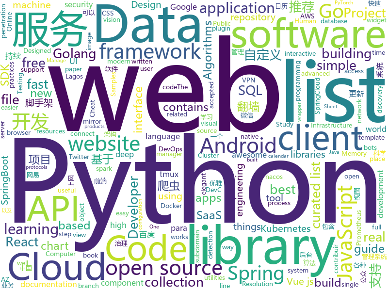

# 2020-02-28
See what the GitHub community is most excited about.

## python
+ [akshare](https://github.com/jindaxiang/akshare)(**23 stars today**): AkShare is an elegant and simple financial data interface library for Python, built for human beings!
+ [trax](https://github.com/google/trax)(**144 stars today**): Trax — your path to advanced deep learning
+ [PIFu](https://github.com/shunsukesaito/PIFu)(**93 stars today**): This repository contains the code for the paper "PIFu: Pixel-Aligned Implicit Function for High-Resolution Clothed Human Digitization"
+ [helium](https://github.com/mherrmann/helium)(**143 stars today**): Selenium-python, 50% easier. Helium is the best Python library for web automation.
+ [Udacity-Data-Engineering-Projects](https://github.com/san089/Udacity-Data-Engineering-Projects)(**51 stars today**): Few projects related to Data Engineering including Data Modeling, Infrastructure setup on cloud, Data Warehousing and Data Lake development.
+ [public-apis](https://github.com/public-apis/public-apis)(**70 stars today**): A collective list of free APIs for use in software and web development.
+ [newscatcher](https://github.com/kotartemiy/newscatcher)(**173 stars today**): Programmatically collect normalized news from (almost) any website.
+ [cortex-license-plate-reader-client](https://github.com/RobertLucian/cortex-license-plate-reader-client)(**28 stars today**): A client to connect to cortex-provisioned infrastructure on AWS to do license plate identification in real time.
+ [sbd_mask](https://github.com/sbdcv/sbd_mask)(**14 stars today**): sbd_mask
+ [Reptile](https://github.com/librauee/Reptile)(**32 stars today**): 🏀Python3 网络爬虫 猫眼 腾讯视频 豆瓣 研招网 微博 笔趣阁小说 百度热点 B站 CSDN 网易云阅读 阿里文学 百度股票 今日头条 微信公众号 网易云音乐 拉勾 有道 unsplash 实习僧 汽车之家 英雄联盟盒子 大众点评 链家 LPL赛程 台风 梦幻西游、阴阳师藏宝阁 天气 牛客网 百度文库 睡前故事 知乎 Wish
+ [dispatch](https://github.com/Netflix/dispatch)(**256 stars today**): All of the ad-hoc things you're doing to manage incidents today, done for you, and much more!
+ [mitmproxy](https://github.com/mitmproxy/mitmproxy)(**26 stars today**): An interactive TLS-capable intercepting HTTP proxy for penetration testers and software developers.
+ [cve-2020-0688](https://github.com/Ridter/cve-2020-0688)(**70 stars today**): cve-2020-0688
+ [PyNET](https://github.com/aiff22/PyNET)(**32 stars today**): Generating RGB photos from RAW image files with PyNET
+ [google-api-python-client](https://github.com/googleapis/google-api-python-client)(**11 stars today**): 🐍The official Python client library for Google's discovery based APIs.
+ [rq](https://github.com/rq/rq)(**6 stars today**): Simple job queues for Python
+ [pytorch-yolo-v3](https://github.com/ayooshkathuria/pytorch-yolo-v3)(**5 stars today**): A PyTorch implementation of the YOLO v3 object detection algorithm
+ [modin](https://github.com/modin-project/modin)(**12 stars today**): Modin: Speed up your Pandas workflows by changing a single line of code
+ [black](https://github.com/psf/black)(**25 stars today**): The uncompromising Python code formatter
+ [impacket](https://github.com/SecureAuthCorp/impacket)(**11 stars today**): Impacket is a collection of Python classes for working with network protocols.
+ [scrapy](https://github.com/scrapy/scrapy)(**18 stars today**): Scrapy, a fast high-level web crawling & scraping framework for Python.
+ [image-quality-assessment](https://github.com/idealo/image-quality-assessment)(**10 stars today**): Convolutional Neural Networks to predict the aesthetic and technical quality of images.
+ [py_cui](https://github.com/jwlodek/py_cui)(**41 stars today**): A python library for creating all-ascii CUI/TUI interfaces with widgets, inspired by gocui.
+ [boto3](https://github.com/boto/boto3)(**8 stars today**): AWS SDK for Python
+ [pytorch-lightning](https://github.com/PyTorchLightning/pytorch-lightning)(**104 stars today**): The lightweight PyTorch wrapper for ML researchers. Scale your models. Write less boilerplate

## java
+ [ElysiumMall](https://github.com/JackZhu426/ElysiumMall)(**50 stars today**): My Own Online Mall Project Using SpringBoot
+ [Signal-Android](https://github.com/signalapp/Signal-Android)(**52 stars today**): A private messenger for Android.
+ [cassandra](https://github.com/apache/cassandra)(**5 stars today**): Mirror of Apache Cassandra
+ [SpringCloud](https://github.com/zhoutaoo/SpringCloud)(**11 stars today**): 基于SpringCloud2.1的微服务开发脚手架，整合了spring-security-oauth2、nacos、feign、sentinel、springcloud-gateway等。服务治理方面引入elasticsearch、skywalking、springboot-admin、zipkin等，让项目开发快速进入业务开发，而不需过多时间花费在架构搭建上。持续更新中
+ [sonarqube-community-branch-plugin](https://github.com/mc1arke/sonarqube-community-branch-plugin)(**6 stars today**): A plugin for SonarQube to allow branch analysis in the community version
+ [jmx_exporter](https://github.com/prometheus/jmx_exporter)(**4 stars today**): A process for exposing JMX Beans via HTTP for Prometheus consumption
+ [tutorials](https://github.com/eugenp/tutorials)(**21 stars today**): Just Announced - "Learn Spring Security OAuth":
+ [MPAndroidChart](https://github.com/PhilJay/MPAndroidChart)(**21 stars today**): A powerful🚀Android chart view / graph view library, supporting line- bar- pie- radar- bubble- and candlestick charts as well as scaling, dragging and animations.
+ [spring-cloud-examples](https://github.com/ityouknow/spring-cloud-examples)(**10 stars today**): Spring Cloud 学习案例，服务发现、服务治理、链路追踪、服务监控等
+ [user-interface-samples](https://github.com/android/user-interface-samples)(**10 stars today**): Multiple samples showing the best practices in the user interface on Android.
+ [best-pay-sdk](https://github.com/Pay-Group/best-pay-sdk)(**38 stars today**): 可能是最好的支付SDK
+ [SpringCloud-Learning](https://github.com/dyc87112/SpringCloud-Learning)(**4 stars today**): Spring Cloud基础教程，持续连载更新中
+ [TelegramBots](https://github.com/rubenlagus/TelegramBots)(**5 stars today**): Java library to create bots using Telegram Bots API
+ [Terasology](https://github.com/MovingBlocks/Terasology)(**3 stars today**): Terasology - open source voxel world
+ [easyexcel](https://github.com/alibaba/easyexcel)(**30 stars today**): 快速、简单避免OOM的java处理Excel工具
+ [react-native-camera](https://github.com/react-native-community/react-native-camera)(**4 stars today**): A Camera component for React Native. Also supports barcode scanning!
+ [zuihou-admin-cloud](https://github.com/zuihou/zuihou-admin-cloud)(**14 stars today**): 基于SpringCloud(Hoxton.SR1) + SpringBoot(2.2.4.RELEASE) 的SaaS 微服务脚手架，具有统一授权、认证后台管理系统，其中包含具备用户管理、资源权限管理、网关API、分布式事务、大文件断点分片续传等多个模块，支持多业务系统并行开发，可以作为后端服务的开发脚手架。代码简洁，架构清晰，适合学习和直接项目中使用。核心技术采用Nacos、Fegin、Ribbon、Zuul、Hystrix、JWT Token、Mybatis、SpringBoot、Redis、RibbitMQ等主要框架和中间件。
+ [YCSB](https://github.com/brianfrankcooper/YCSB)(**7 stars today**): Yahoo! Cloud Serving Benchmark
+ [Movie_Recommend](https://github.com/LuckyZXL2016/Movie_Recommend)(**3 stars today**): 基于Spark的电影推荐系统，包含爬虫项目、web网站、后台管理系统以及spark推荐系统
+ [CalendarView](https://github.com/huanghaibin-dev/CalendarView)(**7 stars today**): Android上一个优雅、万能自定义UI、支持周视图、自定义周起始、性能高效的日历控件，支持热插拔实现的UI定制！支持标记、自定义颜色、农历、自定义月视图各种显示模式等。Canvas绘制，速度快、占用内存低，你真的想不到日历居然还可以如此优雅！An elegant, highly customized and high-performance Calendar Widget on Android.
+ [quickstart-android](https://github.com/firebase/quickstart-android)(**7 stars today**): Firebase Quickstart Samples for Android
+ [sonarqube](https://github.com/SonarSource/sonarqube)(**5 stars today**): Continuous Inspection
+ [ghidra](https://github.com/NationalSecurityAgency/ghidra)(**25 stars today**): Ghidra is a software reverse engineering (SRE) framework
+ [Algorithms](https://github.com/williamfiset/Algorithms)(**25 stars today**): A collection of algorithms and data structures
+ [piggymetrics](https://github.com/sqshq/piggymetrics)(**16 stars today**): Microservice Architecture with Spring Boot, Spring Cloud and Docker

## unknown
+ [fucking-algorithm](https://github.com/labuladong/fucking-algorithm)(**367 stars today**): labuladong的算法小抄，手把手撕LeetCode题目，扒各种算法套路的裤子，不仅how，还有why。
+ [COVID-19](https://github.com/CSSEGISandData/COVID-19)(**200 stars today**): Novel Coronavirus (COVID-19) Cases, provided by JHU CSSE
+ [coding-interview-university](https://github.com/jwasham/coding-interview-university)(**496 stars today**): A complete computer science study plan to become a software engineer.
+ [javascript-questions](https://github.com/lydiahallie/javascript-questions)(**231 stars today**): A long list of (advanced) JavaScript questions, and their explanations✨
+ [gitignore](https://github.com/github/gitignore)(**95 stars today**): A collection of useful .gitignore templates
+ [awesome](https://github.com/sindresorhus/awesome)(**240 stars today**): 😎Awesome lists about all kinds of interesting topics
+ [awesome-spider](https://github.com/facert/awesome-spider)(**13 stars today**): 爬虫集合
+ [.tmux](https://github.com/gpakosz/.tmux)(**27 stars today**): 🇫🇷Oh My Tmux! Pretty & versatile tmux configuration made with❤️(imho the best tmux configuration that just works)
+ [awesome-seml](https://github.com/SE-ML/awesome-seml)(**35 stars today**): A curated list of articles that cover the software engineering best practices for building machine learning applications.
+ [awesome-php](https://github.com/ziadoz/awesome-php)(**5 stars today**): A curated list of amazingly awesome PHP libraries, resources and shiny things.
+ [Front-End-Web-Development-Resources](https://github.com/RitikPatni/Front-End-Web-Development-Resources)(**102 stars today**): This repository contains content which will be helpful in your journey as a front-end Web Developer
+ [You-Dont-Know-JS](https://github.com/getify/You-Dont-Know-JS)(**111 stars today**): A book series on JavaScript. @YDKJS on twitter.
+ [SQL-Cheat-Sheet](https://github.com/BorntoDev/SQL-Cheat-Sheet)(**4 stars today**): ด้วยความตั้งใจถึงที่สุดของแอดมินและทีมงานเพื่อสร้างสรรค์นวัตกรรมใหม่ ๆ (ไม่ถึงขนาดนั้นนน) จึงออกมาเป็น SQL Cheat Sheet ที่เป็นเหมือนเครื่องมือช่วยนำทางเหล่า Developer ไม่ว่าจะทั้ง Junior หรือ Student ได้ใช้งานกันแบบฟรี ๆ !! ใน SQL Cheat Sheet นี้เราได้รวมทุกเรื่อง ฟังก์ชัน และ Keyword สำคัญ ๆ ของภาษา SQL ไว้ในหน้าเดียว เรียกได้ว่า "ถ้าเอากระดาษเ…
+ [AI_Curriculum](https://github.com/Machine-Learning-Tokyo/AI_Curriculum)(**107 stars today**): Open Deep Learning and Reinforcement Learning lectures from top Universities like Stanford, MIT, UC Berkeley.
+ [deep_learning_object_detection](https://github.com/hoya012/deep_learning_object_detection)(**42 stars today**): A paper list of object detection using deep learning.
+ [vagas](https://github.com/backend-br/vagas)(**7 stars today**): ✌️Espaço para divulgação de vagas para backenders
+ [The-Internship-v1](https://github.com/FBDevCLagos/The-Internship-v1)(**141 stars today**): That is the vision of the DevC Lagos: “The Internship v1”. The program is a DevC Lagos initiative where Project Managers, Developers, and DevOps specialists are taken through a 13 week period where they build 10 real-world software products distributed into 10 teams. These products could be Enterprise Apps, SaaS, Libraries or Utilities for “real…
+ [weekly](https://github.com/ruanyf/weekly)(**71 stars today**): 科技爱好者周刊，每周五发布
+ [Zooming-Slow-Mo-CVPR-2020](https://github.com/Mukosame/Zooming-Slow-Mo-CVPR-2020)(**29 stars today**): Fast and Accurate One-Stage Space-Time Video Super-Resolution (accepted in CVPR 2020)
+ [AZ-900T0x-MicrosoftAzureFundamentals](https://github.com/MicrosoftLearning/AZ-900T0x-MicrosoftAzureFundamentals)(**9 stars today**): Microsoft Azure Fundamentals - AZ-900T00 and AZ-900T01
+ [OpenAccess](https://github.com/Smithsonian/OpenAccess)(**28 stars today**): Smithsonian Open Access Data Repository
+ [awesome-vue](https://github.com/vuejs/awesome-vue)(**46 stars today**): 🎉A curated list of awesome things related to Vue.js
+ [awesome-docker](https://github.com/veggiemonk/awesome-docker)(**9 stars today**): 🐳A curated list of Docker resources and projects
+ [trackerslist](https://github.com/ngosang/trackerslist)(**70 stars today**): Updated list of public BitTorrent trackers

## javascript
+ [kbone](https://github.com/Tencent/kbone)(**144 stars today**): 一个致力于微信小程序和 Web 端同构的解决方案
+ [algorithm-visualizer](https://github.com/algorithm-visualizer/algorithm-visualizer)(**41 stars today**): 🎆Interactive Online Platform that Visualizes Algorithms from Code
+ [graphql-engine](https://github.com/hasura/graphql-engine)(**118 stars today**): Blazing fast, instant realtime GraphQL APIs on Postgres with fine grained access control, also trigger webhooks on database events.
+ [nuxt.js](https://github.com/nuxt/nuxt.js)(**42 stars today**): The Vue.js Framework
+ [Daily-Interview-Question](https://github.com/Advanced-Frontend/Daily-Interview-Question)(**94 stars today**): 我是木易杨，公众号「高级前端进阶」作者，每天搞定一道前端大厂面试题，祝大家天天进步，一年后会看到不一样的自己。
+ [wtfjs](https://github.com/denysdovhan/wtfjs)(**233 stars today**): A list of funny and tricky JavaScript examples
+ [react-query](https://github.com/tannerlinsley/react-query)(**514 stars today**): ⚛️Hooks for fetching, caching and updating asynchronous data in React
+ [vue](https://github.com/vuejs/vue)(**184 stars today**): 🖖Vue.js is a progressive, incrementally-adoptable JavaScript framework for building UI on the web.
+ [fraidycat](https://github.com/kickscondor/fraidycat)(**23 stars today**): Follow blogs, wikis, YouTube channels, as well as accounts on Twitter, Instagram, etc. from a single page.
+ [clean-code-javascript](https://github.com/ryanmcdermott/clean-code-javascript)(**204 stars today**): 🛁Clean Code concepts adapted for JavaScript
+ [whatsapp-web.js](https://github.com/pedroslopez/whatsapp-web.js)(**2 stars today**): A WhatsApp API client that connects through the WhatsApp Web browser app
+ [awx](https://github.com/ansible/awx)(**8 stars today**): AWX Project
+ [Motrix](https://github.com/agalwood/Motrix)(**86 stars today**): A full-featured download manager.
+ [nCovMemory](https://github.com/2019ncovmemory/nCovMemory)(**67 stars today**): 2020新冠肺炎记忆：报道、非虚构与个人叙述（持续更新） Memory of 2020 nCoV: Media Coverage, Non-fiction Writings, and Individual Narratives (Continuously updating)
+ [reactjs.org](https://github.com/reactjs/reactjs.org)(**4 stars today**): The React documentation website
+ [node-postgres](https://github.com/brianc/node-postgres)(**13 stars today**): PostgreSQL client for node.js.
+ [enzyme](https://github.com/enzymejs/enzyme)(**11 stars today**): JavaScript Testing utilities for React
+ [amphtml](https://github.com/ampproject/amphtml)(**5 stars today**): The AMP web component framework.
+ [WebGL-Fluid-Simulation](https://github.com/PavelDoGreat/WebGL-Fluid-Simulation)(**14 stars today**): Play with fluids in your browser (works even on mobile)
+ [js-docs](https://github.com/LeonardoCesca/js-docs)(**5 stars today**): Este projeto foi desenvolvido para contribuir com o open-source. Se você quiser contribuir basta seguir o README
+ [FRIDA-DEXDump](https://github.com/hluwa/FRIDA-DEXDump)(**58 stars today**): A simple script to search & dump dex file on memory.
+ [react-chartjs-2](https://github.com/jerairrest/react-chartjs-2)(**6 stars today**): React wrapper for Chart.js
+ [travel-log](https://github.com/CodingGarden/travel-log)(**2 stars today**): A full stack application to store / list places you have traveled.
+ [tracking.js](https://github.com/eduardolundgren/tracking.js)(**9 stars today**): A modern approach for Computer Vision on the web
+ [nuclear](https://github.com/nukeop/nuclear)(**9 stars today**): User freedom-oriented streaming music player - welcoming to new contributors

## html
+ [swagger-codegen](https://github.com/swagger-api/swagger-codegen)(**16 stars today**): swagger-codegen contains a template-driven engine to generate documentation, API clients and server stubs in different languages by parsing your OpenAPI / Swagger definition.
+ [free-for-dev](https://github.com/ripienaar/free-for-dev)(**213 stars today**): A list of SaaS, PaaS and IaaS offerings that have free tiers of interest to devops and infradev
+ [css-reference](https://github.com/jgthms/css-reference)(**4 stars today**): CSS Reference: a free visual guide to the most popular CSS properties
+ [MatBlazor](https://github.com/SamProf/MatBlazor)(**11 stars today**): Material Design components for Blazor and Razor Components
+ [keep-a-changelog](https://github.com/olivierlacan/keep-a-changelog)(**14 stars today**): If you build software, keep a changelog.
+ [web-moderno](https://github.com/cod3rcursos/web-moderno)(**3 stars today**): 
+ [mkdocs-material](https://github.com/squidfunk/mkdocs-material)(**6 stars today**): A Material Design theme for MkDocs
+ [craftinginterpreters](https://github.com/munificent/craftinginterpreters)(**4 stars today**): Repository for the book "Crafting Interpreters"
+ [website](https://github.com/kubernetes/website)(**2 stars today**): Kubernetes website and documentation repo:
+ [ML-notes](https://github.com/Sakura-gh/ML-notes)(**5 stars today**): notes about machine learning
+ [v-calendar](https://github.com/nathanreyes/v-calendar)(**4 stars today**): A lightweight, dependency-free plugin for building attributed calendars in Vue.js
+ [laravel-option-framework](https://github.com/haruncpi/laravel-option-framework)(**24 stars today**): Manage your laravel application's dynamic settings in one place with various supported input types.
+ [portainer](https://github.com/portainer/portainer)(**21 stars today**): Making Docker management easy.
+ [biblepay](https://github.com/biblepay/biblepay)(**2 stars today**): BiblePay
+ [core](https://github.com/stackblitz/core)(**5 stars today**): Online IDE powered by Visual Studio Code⚡️
+ [flag-icon-css](https://github.com/lipis/flag-icon-css)(**4 stars today**): 🎏A collection of all country flags in SVG — plus the CSS for easier integration
+ [hugo-academic](https://github.com/gcushen/hugo-academic)(**19 stars today**): 📝The website builder for Hugo. Build and deploy a beautiful website in minutes!
+ [vpncn.github.io](https://github.com/vpncn/vpncn.github.io)(**11 stars today**): 2020中国翻墙软件VPN推荐指南，以及对比SSR、蓝灯、WireGuard、V2ray等科学上网软件与翻墙方法的优缺点。中国科学上网翻墙VPN梯子最新地址推荐，稳定好用。
+ [machine-learning-systems-design](https://github.com/chiphuyen/machine-learning-systems-design)(**14 stars today**): A booklet on machine learning systems design with exercises
+ [intro.js](https://github.com/usablica/intro.js)(**7 stars today**): A better way for new feature introduction and step-by-step users guide for your website and project.
+ [ecma262](https://github.com/tc39/ecma262)(**5 stars today**): Status, process, and documents for ECMA-262
+ [styleguide](https://github.com/google/styleguide)(**18 stars today**): Style guides for Google-originated open-source projects
+ [tiny-slider](https://github.com/ganlanyuan/tiny-slider)(**8 stars today**): Vanilla javascript slider for all purposes.
+ [cs231n.github.io](https://github.com/cs231n/cs231n.github.io)(**5 stars today**): Public facing notes page
+ [django-DefectDojo](https://github.com/DefectDojo/django-DefectDojo)(**2 stars today**): DefectDojo is an open-source application vulnerability correlation and security orchestration tool.

## go
+ [go-under-the-hood](https://github.com/changkun/go-under-the-hood)(**33 stars today**): 📚Go Under The Hood: A Source Code Study of Go (1.14, WIP)
+ [Amass](https://github.com/OWASP/Amass)(**11 stars today**): In-depth Attack Surface Mapping and Asset Discovery
+ [kubernetes](https://github.com/kubernetes/kubernetes)(**52 stars today**): Production-Grade Container Scheduling and Management
+ [sampler](https://github.com/sqshq/sampler)(**22 stars today**): Tool for shell commands execution, visualization and alerting. Configured with a simple YAML file.
+ [geph2](https://github.com/geph-official/geph2)(**18 stars today**): Geph (迷霧通) is a modular Internet censorship circumvention system designed specifically to deal with national filtering.
+ [datadog-agent](https://github.com/DataDog/datadog-agent)(**3 stars today**): Datadog Agent
+ [arkade](https://github.com/alexellis/arkade)(**128 stars today**): Kubernetes apps, the easy way😎
+ [cockroach](https://github.com/cockroachdb/cockroach)(**11 stars today**): CockroachDB - the open source, cloud-native SQL database.
+ [micro](https://github.com/zyedidia/micro)(**21 stars today**): A modern and intuitive terminal-based text editor
+ [golang-gin-realworld-example-app](https://github.com/gothinkster/golang-gin-realworld-example-app)(**4 stars today**): Exemplary real world application built with Golang + Gin
+ [kubefed](https://github.com/kubernetes-sigs/kubefed)(**6 stars today**): Kubernetes Cluster Federation
+ [subfinder](https://github.com/projectdiscovery/subfinder)(**5 stars today**): Subfinder is a subdomain discovery tool that discovers valid subdomains for websites. Designed as a passive framework to be useful for bug bounties and safe for penetration testing.
+ [pitaya](https://github.com/topfreegames/pitaya)(**3 stars today**): Scalable game server framework with clustering support and client libraries for iOS, Android, Unity and others through the C SDK.
+ [go-grpc-middleware](https://github.com/grpc-ecosystem/go-grpc-middleware)(**10 stars today**): Golang gRPC Middlewares: interceptor chaining, auth, logging, retries and more.
+ [Go](https://github.com/TheAlgorithms/Go)(**5 stars today**): Algorithms Implemented in GoLang
+ [k9s](https://github.com/derailed/k9s)(**25 stars today**): 🐶Kubernetes CLI To Manage Your Clusters In Style!
+ [keel](https://github.com/keel-hq/keel)(**10 stars today**): Kubernetes Operator to automate Helm, DaemonSet, StatefulSet & Deployment updates
+ [golang-samples](https://github.com/GoogleCloudPlatform/golang-samples)(**3 stars today**): Sample apps and code written for Google Cloud in the Go programming language.
+ [loki](https://github.com/grafana/loki)(**15 stars today**): Like Prometheus, but for logs.
+ [kubectl](https://github.com/kubernetes/kubectl)(**2 stars today**): Issue tracker and mirror of kubectl code
+ [gorm](https://github.com/jinzhu/gorm)(**21 stars today**): The fantastic ORM library for Golang, aims to be developer friendly (v2 is under development, PR based on master branch won't be accepted)
+ [buildah](https://github.com/containers/buildah)(**7 stars today**): A tool that facilitates building OCI images
+ [syncthing](https://github.com/syncthing/syncthing)(**9 stars today**): Open Source Continuous File Synchronization
+ [aws-sdk-go](https://github.com/aws/aws-sdk-go)(**6 stars today**): AWS SDK for the Go programming language.
+ [gnark](https://github.com/ConsenSys/gnark)(**25 stars today**): gnark is a fast, open-source library for zero-knowledge proof protocols written in Go

## WordCloud

