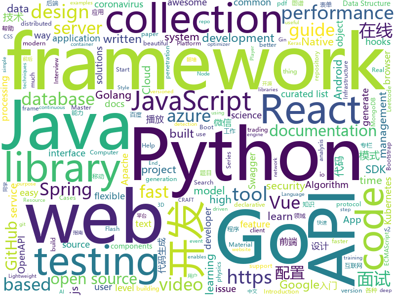

# 2020-03-05
See what the GitHub community is most excited about.

## python
+ [fastapi](https://github.com/tiangolo/fastapi)(**74 stars today**): FastAPI framework, high performance, easy to learn, fast to code, ready for production
+ [interview_internal_reference](https://github.com/0voice/interview_internal_reference)(**44 stars today**): 2019年最新总结，阿里，腾讯，百度，美团，头条等技术面试题目，以及答案，专家出题人分析汇总。
+ [gpt-2](https://github.com/openai/gpt-2)(**16 stars today**): Code for the paper "Language Models are Unsupervised Multitask Learners"
+ [ParlAI](https://github.com/facebookresearch/ParlAI)(**5 stars today**): A framework for training and evaluating AI models on a variety of openly available dialogue datasets.
+ [dgl](https://github.com/dmlc/dgl)(**22 stars today**): Python package built to ease deep learning on graph, on top of existing DL frameworks.
+ [mkdocs](https://github.com/mkdocs/mkdocs)(**20 stars today**): Project documentation with Markdown.
+ [fuzzbench](https://github.com/google/fuzzbench)(**68 stars today**): FuzzBench - Fuzzer benchmarking as a service.
+ [PyTorch-VAE](https://github.com/AntixK/PyTorch-VAE)(**90 stars today**): A Collection of Variational Autoencoders (VAE) in PyTorch.
+ [pandas](https://github.com/pandas-dev/pandas)(**24 stars today**): Flexible and powerful data analysis / manipulation library for Python, providing labeled data structures similar to R data.frame objects, statistical functions, and much more
+ [game-programmer](https://github.com/miloyip/game-programmer)(**7 stars today**): A Study Path for Game Programmer
+ [public-apis](https://github.com/public-apis/public-apis)(**61 stars today**): A collective list of free APIs for use in software and web development.
+ [scikit-learn](https://github.com/scikit-learn/scikit-learn)(**29 stars today**): scikit-learn: machine learning in Python
+ [coronavirus-tracker-api](https://github.com/ExpDev07/coronavirus-tracker-api)(**9 stars today**): 🦠 A simple and fast (< 200ms) API for tracking the global coronavirus (2019-nCoV) outbreak. It's written in python using the🍼Flask framework.
+ [keras-ocr](https://github.com/faustomorales/keras-ocr)(**12 stars today**): A packaged and flexible version of the CRAFT text detector and Keras CRNN recognition model.
+ [models](https://github.com/tensorflow/models)(**34 stars today**): Models and examples built with TensorFlow
+ [pytorch-optimizer](https://github.com/jettify/pytorch-optimizer)(**92 stars today**): torch-optimizer -- collection of optimizers for Pytorch
+ [paramiko](https://github.com/paramiko/paramiko)(**6 stars today**): The leading native Python SSHv2 protocol library.
+ [CRAFT-pytorch](https://github.com/clovaai/CRAFT-pytorch)(**11 stars today**): Official implementation of Character Region Awareness for Text Detection (CRAFT)
+ [matplotlib](https://github.com/matplotlib/matplotlib)(**7 stars today**): matplotlib: plotting with Python
+ [elasticsearch-dsl-py](https://github.com/elastic/elasticsearch-dsl-py)(**4 stars today**): High level Python client for Elasticsearch
+ [Mask_RCNN](https://github.com/matterport/Mask_RCNN)(**23 stars today**): Mask R-CNN for object detection and instance segmentation on Keras and TensorFlow
+ [black](https://github.com/psf/black)(**28 stars today**): The uncompromising Python code formatter
+ [netmiko](https://github.com/ktbyers/netmiko)(**5 stars today**): Multi-vendor library to simplify Paramiko SSH connections to network devices
+ [OctoPrint](https://github.com/foosel/OctoPrint)(**4 stars today**): OctoPrint is the snappy web interface for your 3D printer!
+ [integrations-core](https://github.com/DataDog/integrations-core)(**1 stars today**): Core integrations of the Datadog Agent

## java
+ [DataX](https://github.com/alibaba/DataX)(**15 stars today**): 
+ [netty](https://github.com/netty/netty)(**27 stars today**): Netty project - an event-driven asynchronous network application framework
+ [druid](https://github.com/apache/druid)(**18 stars today**): Apache Druid: a high performance real-time analytics database.
+ [azure-sdk-for-java](https://github.com/Azure/azure-sdk-for-java)(**0 stars today**): This repository is for active development of the Azure SDK for Java. For consumers of the SDK we recommend visiting our public developer docs at https://docs.microsoft.com/en-us/java/azure/ or our versioned developer docs at https://azure.github.io/azure-sdk-for-java.
+ [SpringBoot-Labs](https://github.com/YunaiV/SpringBoot-Labs)(**75 stars today**): Spring Boot 2.X 专栏更新完毕，Spring Cloud & Spring Cloud Alibaba 2.X 专栏更新中 。欢迎胖友 Star 一波
+ [tutorials](https://github.com/eugenp/tutorials)(**20 stars today**): Just Announced - "Learn Spring Security OAuth":
+ [nifi](https://github.com/apache/nifi)(**3 stars today**): Mirror of Apache NiFi
+ [dbeaver](https://github.com/dbeaver/dbeaver)(**37 stars today**): Free universal database tool and SQL client
+ [ksql](https://github.com/confluentinc/ksql)(**5 stars today**): The event streaming database purpose-built for stream processing applications
+ [thingsboard](https://github.com/thingsboard/thingsboard)(**14 stars today**): Open-source IoT Platform - Device management, data collection, processing and visualization.
+ [jeecg-boot](https://github.com/zhangdaiscott/jeecg-boot)(**35 stars today**): 一款基于代码生成器的JAVA快速开发平台，开源界“小普元”超越传统商业企业级开发平台！采用前后端分离架构：SpringBoot 2.x，Ant Design&Vue，Mybatis-plus，Shiro，JWT。强大的代码生成器让前后端代码一键生成，无需写任何代码! 引领新的开发模式(OnlineCoding模式-> 代码生成器模式-> 手工MERGE智能开发)，帮助Java项目解决70%的重复工作，让开发更多关注业务逻辑。既能快速提高开发效率，帮助公司节省成本，同时又不失灵活性。JeecgBoot还独创在线开发模式（No代码）：在线表单配置（表单设计器）、移动配置能力、在线工作流配置（流程设计器）、在线报表配置、在线图表配置、插件能力（可插拔）等等
+ [litemall](https://github.com/linlinjava/litemall)(**30 stars today**): 又一个小商城。litemall = Spring Boot后端 + Vue管理员前端 + 微信小程序用户前端 + Vue用户移动端
+ [openapi-generator](https://github.com/OpenAPITools/openapi-generator)(**15 stars today**): OpenAPI Generator allows generation of API client libraries (SDK generation), server stubs, documentation and configuration automatically given an OpenAPI Spec (v2, v3)
+ [react-native-push-notification](https://github.com/zo0r/react-native-push-notification)(**6 stars today**): React Native Local and Remote Notifications
+ [testing-samples](https://github.com/android/testing-samples)(**8 stars today**): A collection of samples demonstrating different frameworks and techniques for automated testing
+ [canal](https://github.com/alibaba/canal)(**16 stars today**): 阿里巴巴 MySQL binlog 增量订阅&消费组件
+ [DKVideoPlayer](https://github.com/dueeeke/DKVideoPlayer)(**8 stars today**): Android Video Player. 安卓视频播放器，封装MediaPlayer、ExoPlayer、IjkPlayer。模仿抖音并实现预加载，列表播放，悬浮播放，广告播放，弹幕
+ [BigData-Notes](https://github.com/heibaiying/BigData-Notes)(**21 stars today**): 大数据入门指南⭐️
+ [ExoPlayer](https://github.com/google/ExoPlayer)(**16 stars today**): An extensible media player for Android
+ [CameraView](https://github.com/natario1/CameraView)(**9 stars today**): 📸A well documented, high-level Android interface that makes capturing pictures and videos easy, addressing all of the common issues and needs. Real-time filters, gestures, watermarks, frame processing, RAW, output of any size.
+ [opengrok](https://github.com/oracle/opengrok)(**3 stars today**): OpenGrok is a fast and usable source code search and cross reference engine, written in Java
+ [elasticsearch](https://github.com/elastic/elasticsearch)(**24 stars today**): Open Source, Distributed, RESTful Search Engine
+ [cassandra](https://github.com/apache/cassandra)(**0 stars today**): Mirror of Apache Cassandra
+ [deeplearning4j](https://github.com/eclipse/deeplearning4j)(**3 stars today**): Eclipse Deeplearning4j, ND4J, DataVec and more - deep learning & linear algebra for Java/Scala with GPUs + Spark
+ [CS-Notes](https://github.com/CyC2018/CS-Notes)(**139 stars today**): 📚技术面试必备基础知识、Leetcode、计算机操作系统、计算机网络、系统设计、Java、Python、C++

## unknown
+ [data-science-interviews](https://github.com/alexeygrigorev/data-science-interviews)(**156 stars today**): Data science interview questions and answers
+ [COVID-19](https://github.com/CSSEGISandData/COVID-19)(**397 stars today**): Novel Coronavirus (COVID-19) Cases, provided by JHU CSSE
+ [fucking-algorithm](https://github.com/labuladong/fucking-algorithm)(**1,047 stars today**): 手把手撕LeetCode题目，扒各种算法套路的裤子，not only how，but also why. English version supported!
+ [Contents](https://github.com/Newslab2020/Contents)(**43 stars today**): 
+ [awesome_Threat-Hunting](https://github.com/threat-hunting/awesome_Threat-Hunting)(**10 stars today**): 
+ [COVID-19](https://github.com/midas-network/COVID-19)(**20 stars today**): 2019 novel coronavirus repository
+ [PoC-in-GitHub](https://github.com/nomi-sec/PoC-in-GitHub)(**15 stars today**): PoC auto collect from GitHub.
+ [OpenAPI-Specification](https://github.com/OAI/OpenAPI-Specification)(**23 stars today**): The OpenAPI Specification Repository
+ [modern-typescript-with-examples-cheat-sheet](https://github.com/David-Else/modern-typescript-with-examples-cheat-sheet)(**125 stars today**): Fully printable summary of modern TypeScript language features with extensive examples to help you learn
+ [SS-Rule-Snippet](https://github.com/Hackl0us/SS-Rule-Snippet)(**60 stars today**): 搜集、整理、维护 Surge / Quantumult / Shadowrocket / Surfboard / clash(X) 实用规则。
+ [JavaFamily](https://github.com/AobingJava/JavaFamily)(**155 stars today**): 【互联网一线大厂面试+学习指南】进阶知识完全扫盲：涵盖高并发、分布式、高可用、微服务等领域知识，作者风格幽默，看起来津津有味，把学习当做一种乐趣，何乐而不为，后端同学必看，前端同学我保证你也看得懂，看不懂你加我微信骂我渣男就好了。
+ [papers-we-love](https://github.com/papers-we-love/papers-we-love)(**20 stars today**): Papers from the computer science community to read and discuss.
+ [Java-Interview](https://github.com/gzc426/Java-Interview)(**11 stars today**): Java 面试必会 直通BAT
+ [cs-video-courses](https://github.com/Developer-Y/cs-video-courses)(**21 stars today**): List of Computer Science courses with video lectures.
+ [design-patterns-for-humans](https://github.com/kamranahmedse/design-patterns-for-humans)(**41 stars today**): An ultra-simplified explanation to design patterns
+ [Profiles](https://github.com/ConnersHua/Profiles)(**37 stars today**): 
+ [algodeck](https://github.com/teivah/algodeck)(**14 stars today**): An Open-Source Collection of +200 Algorithmic Flash Cards to Help you Preparing your Algorithm & Data Structure Interview💯
+ [styleguides](https://github.com/SAP/styleguides)(**4 stars today**): This repository provides SAP style guides for coding.
+ [Specs](https://github.com/CocoaPods/Specs)(**3 stars today**): The CocoaPods Master Repo
+ [wstg](https://github.com/OWASP/wstg)(**6 stars today**): The OWASP Web Security Testing Guide includes a "best practice" penetration testing framework which users can implement in their own organizations and a "low level" penetration testing guide that describes techniques for testing most common web application and web service security issues.
+ [github-issue-templates](https://github.com/stevemao/github-issue-templates)(**4 stars today**): 🔣A collection of GitHub issue and pull request templates
+ [architect-awesome](https://github.com/xingshaocheng/architect-awesome)(**43 stars today**): 后端架构师技术图谱
+ [kubernetes-the-hard-way](https://github.com/kelseyhightower/kubernetes-the-hard-way)(**47 stars today**): Bootstrap Kubernetes the hard way on Google Cloud Platform. No scripts.
+ [awesome-php](https://github.com/ziadoz/awesome-php)(**25 stars today**): A curated list of amazingly awesome PHP libraries, resources and shiny things.
+ [Over-The-Wall](https://github.com/yuchuanqicy/Over-The-Wall)(**12 stars today**): 跨过长城 看世界 收集各种免费翻墙工具 SS SSR 手机端翻墙App 蓝灯等工具 推荐:老王VPN https://apkgk.com/com.findtheway

## javascript
+ [use-cannon](https://github.com/react-spring/use-cannon)(**138 stars today**): 👋💣physics based hooks for react-three-fiber
+ [strapi](https://github.com/strapi/strapi)(**45 stars today**): 🚀Open source Node.js Headless CMS to easily build customisable APIs
+ [vant](https://github.com/youzan/vant)(**22 stars today**): Lightweight Mobile UI Components built on Vue
+ [es6tutorial](https://github.com/ruanyf/es6tutorial)(**14 stars today**): 《ECMAScript 6入门》是一本开源的 JavaScript 语言教程，全面介绍 ECMAScript 6 新增的语法特性。
+ [taro](https://github.com/NervJS/taro)(**32 stars today**): 多端统一开发框架，支持用 React 的开发方式编写一次代码，生成能运行在微信/百度/支付宝/字节跳动/ QQ 小程序/快应用/H5/React Native 等的应用。 https://taro.jd.com/
+ [material-ui](https://github.com/mui-org/material-ui)(**39 stars today**): React components for faster and easier web development. Build your own design system, or start with Material Design.
+ [cypress](https://github.com/cypress-io/cypress)(**28 stars today**): Fast, easy and reliable testing for anything that runs in a browser.
+ [beautiful-react-hooks](https://github.com/beautifulinteractions/beautiful-react-hooks)(**60 stars today**): 🔥A collection of beautiful and (hopefully) useful React hooks to speed-up your components and hooks development🔥
+ [cannon.js](https://github.com/schteppe/cannon.js)(**45 stars today**): A lightweight 3D physics engine written in JavaScript.
+ [carbon](https://github.com/carbon-design-system/carbon)(**8 stars today**): A design system built by IBM
+ [monaco-editor](https://github.com/microsoft/monaco-editor)(**19 stars today**): A browser based code editor
+ [appium](https://github.com/appium/appium)(**11 stars today**): 📱Automation for iOS, Android, and Windows Apps.
+ [CodeceptJS](https://github.com/Codeception/CodeceptJS)(**3 stars today**): Supercharged End 2 End Testing Framework for NodeJS
+ [react](https://github.com/facebook/react)(**87 stars today**): A declarative, efficient, and flexible JavaScript library for building user interfaces.
+ [markdown-here](https://github.com/adam-p/markdown-here)(**38 stars today**): Google Chrome, Firefox, and Thunderbird extension that lets you write email in Markdown and render it before sending.
+ [swagger-ui](https://github.com/swagger-api/swagger-ui)(**17 stars today**): Swagger UI is a collection of HTML, Javascript, and CSS assets that dynamically generate beautiful documentation from a Swagger-compliant API.
+ [ccxt](https://github.com/ccxt/ccxt)(**9 stars today**): A JavaScript / Python / PHP cryptocurrency trading API with support for more than 120 bitcoin/altcoin exchanges
+ [BrasilAPI](https://github.com/filipedeschamps/BrasilAPI)(**16 stars today**): Vamos transformar o Brasil em uma API?
+ [video.js](https://github.com/videojs/video.js)(**16 stars today**): Video.js - open source HTML5 & Flash video player
+ [mapbox-gl-js](https://github.com/mapbox/mapbox-gl-js)(**7 stars today**): Interactive, thoroughly customizable maps in the browser, powered by vector tiles and WebGL
+ [react-native](https://github.com/facebook/react-native)(**43 stars today**): A framework for building native apps with React.
+ [swagger-editor](https://github.com/swagger-api/swagger-editor)(**9 stars today**): Swagger Editor
+ [awx](https://github.com/ansible/awx)(**14 stars today**): AWX Project
+ [scripts](https://github.com/chavyleung/scripts)(**13 stars today**): 
+ [pdfmake](https://github.com/bpampuch/pdfmake)(**2 stars today**): Client/server side PDF printing in pure JavaScript

## html
+ [manual](https://github.com/v2ray/manual)(**5 stars today**): Source code for https://www.v2ray.com/
+ [professional-services](https://github.com/GoogleCloudPlatform/professional-services)(**5 stars today**): Common solutions and tools developed by Google Cloud's Professional Services team
+ [fastText](https://github.com/facebookresearch/fastText)(**8 stars today**): Library for fast text representation and classification.
+ [tailwindcss](https://github.com/laravel-frontend-presets/tailwindcss)(**5 stars today**): A Tailwind CSS frontend preset for the Laravel Framework
+ [Malware-Analysis-Training](https://github.com/OpenRCE/Malware-Analysis-Training)(**31 stars today**): Retired beginner/intermediate malware analysis training materials from @pedramamini and @erocarrera.
+ [intro.js](https://github.com/usablica/intro.js)(**10 stars today**): A better way for new feature introduction and step-by-step users guide for your website and project.
+ [tools](https://github.com/googlecodelabs/tools)(**25 stars today**): Codelabs management & hosting tools
+ [flutter-in-action](https://github.com/flutterchina/flutter-in-action)(**11 stars today**): 《Flutter实战》电子书
+ [Awesome-CS-Books](https://github.com/wx-chevalier/Awesome-CS-Books)(**5 stars today**): 📚Awesome CS Books/Series(.pdf by git lfs) Warehouse for Geeks, ProgrammingLanguage, SoftwareEngineering, Web, AI, ServerSideApplication, Infrastructure, FE etc.💫优秀计算机科学与技术领域相关的书籍归档。
+ [CLRS](https://github.com/walkccc/CLRS)(**10 stars today**): 📚Solutions to Introduction to Algorithms Third Edition
+ [tiny-slider](https://github.com/ganlanyuan/tiny-slider)(**5 stars today**): Vanilla javascript slider for all purposes.
+ [Java-Interview-Advanced](https://github.com/shishan100/Java-Interview-Advanced)(**10 stars today**): 中华石杉--互联网Java进阶面试训练营
+ [awesome-competitive-programming](https://github.com/lnishan/awesome-competitive-programming)(**9 stars today**): 💎A curated list of awesome Competitive Programming, Algorithm and Data Structure resources
+ [startbootstrap-resume](https://github.com/BlackrockDigital/startbootstrap-resume)(**3 stars today**): A Bootstrap 4 resume/CV theme created by Start Bootstrap
+ [patchwork](https://github.com/jlord/patchwork)(**0 stars today**): All the Git-it Workshop completers!
+ [learning-area](https://github.com/mdn/learning-area)(**4 stars today**): Github repo for the MDN Learning Area.
+ [styleguide](https://github.com/google/styleguide)(**17 stars today**): Style guides for Google-originated open-source projects
+ [docs](https://github.com/knative/docs)(**0 stars today**): User documentation for Knative components
+ [website](https://github.com/kubernetes/website)(**4 stars today**): Kubernetes website and documentation repo:
+ [proposal-pipeline-operator](https://github.com/tc39/proposal-pipeline-operator)(**5 stars today**): A proposal for adding the simple-but-useful pipeline operator to JavaScript.
+ [twemoji](https://github.com/twitter/twemoji)(**8 stars today**): Emoji for everyone. https://twemoji.twitter.com/
+ [JavaScript30](https://github.com/wesbos/JavaScript30)(**9 stars today**): 30 Day Vanilla JS Challenge
+ [skill-map](https://github.com/TeamStuQ/skill-map)(**11 stars today**): 程序员技能图谱
+ [GTFOBins.github.io](https://github.com/GTFOBins/GTFOBins.github.io)(**9 stars today**): Curated list of Unix binaries that can be exploited to bypass system security restrictions
+ [zenbot](https://github.com/DeviaVir/zenbot)(**7 stars today**): Zenbot is a command-line cryptocurrency trading bot using Node.js and MongoDB.

## go
+ [goxygen](https://github.com/Shpota/goxygen)(**113 stars today**): Generate a modern Web project with Go, Angular/React/Vue, and MongoDB in seconds🚀
+ [cli](https://github.com/cli/cli)(**52 stars today**): The GitHub CLI
+ [terraform](https://github.com/hashicorp/terraform)(**34 stars today**): Terraform enables you to safely and predictably create, change, and improve infrastructure. It is an open source tool that codifies APIs into declarative configuration files that can be shared amongst team members, treated as code, edited, reviewed, and versioned.
+ [fabric](https://github.com/hyperledger/fabric)(**14 stars today**): Hyperledger Fabric is an enterprise-grade permissioned distributed ledger framework for developing solutions and applications. Its modular and versatile design satisfies a broad range of industry use cases. It offers a unique approach to consensus that enables performance at scale while preserving privacy.
+ [protobuf](https://github.com/golang/protobuf)(**7 stars today**): Go support for Google's protocol buffers
+ [migrate](https://github.com/golang-migrate/migrate)(**12 stars today**): Database migrations. CLI and Golang library.
+ [minio](https://github.com/minio/minio)(**22 stars today**): MinIO is a high performance object storage server compatible with Amazon S3 APIs
+ [concourse](https://github.com/concourse/concourse)(**6 stars today**): Concourse is a container-based continuous thing-doer written in Go and Elm.
+ [vegeta](https://github.com/tsenart/vegeta)(**21 stars today**): HTTP load testing tool and library. It's over 9000!
+ [prometheus](https://github.com/prometheus/prometheus)(**16 stars today**): The Prometheus monitoring system and time series database.
+ [vault](https://github.com/hashicorp/vault)(**7 stars today**): A tool for secrets management, encryption as a service, and privileged access management
+ [telegraf](https://github.com/influxdata/telegraf)(**10 stars today**): The plugin-driven server agent for collecting & reporting metrics.
+ [beats](https://github.com/elastic/beats)(**4 stars today**): 🐠Beats - Lightweight shippers for Elasticsearch & Logstash
+ [argo-cd](https://github.com/argoproj/argo-cd)(**7 stars today**): Declarative continuous deployment for Kubernetes.
+ [gqlgen](https://github.com/99designs/gqlgen)(**12 stars today**): go generate based graphql server library
+ [logrus](https://github.com/sirupsen/logrus)(**13 stars today**): Structured, pluggable logging for Go.
+ [gin](https://github.com/gin-gonic/gin)(**46 stars today**): Gin is a HTTP web framework written in Go (Golang). It features a Martini-like API with much better performance -- up to 40 times faster. If you need smashing performance, get yourself some Gin.
+ [rancher](https://github.com/rancher/rancher)(**12 stars today**): Complete container management platform
+ [gorm](https://github.com/jinzhu/gorm)(**26 stars today**): The fantastic ORM library for Golang, aims to be developer friendly (v2 is under development, PR based on master branch won't be accepted)
+ [flux](https://github.com/fluxcd/flux)(**17 stars today**): The GitOps Kubernetes operator
+ [rook](https://github.com/rook/rook)(**12 stars today**): Storage Orchestration for Kubernetes
+ [go-sqlmock](https://github.com/DATA-DOG/go-sqlmock)(**6 stars today**): Sql mock driver for golang to test database interactions
+ [terraform-provider-azurerm](https://github.com/terraform-providers/terraform-provider-azurerm)(**3 stars today**): Terraform provider for Azure Resource Manager
+ [the-way-to-go_ZH_CN](https://github.com/unknwon/the-way-to-go_ZH_CN)(**14 stars today**): 《The Way to Go》中文译本，中文正式名《Go 入门指南》
+ [sarama](https://github.com/Shopify/sarama)(**7 stars today**): Sarama is a Go library for Apache Kafka 0.8, and up.

## WordCloud

