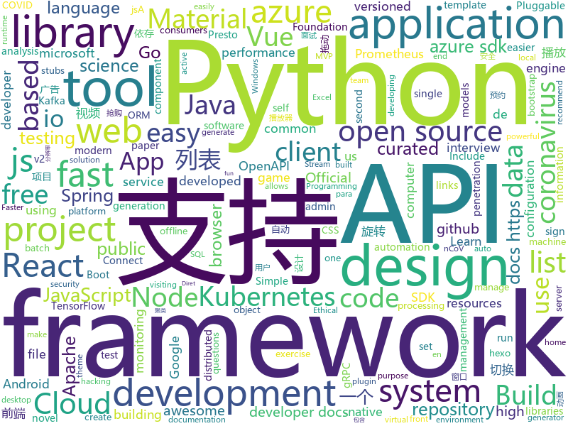

# 2020-03-06
See what the GitHub community is most excited about.

## python
+ [system-design-primer](https://github.com/donnemartin/system-design-primer)(**109 stars today**): Learn how to design large-scale systems. Prep for the system design interview. Includes Anki flashcards.
+ [ncov](https://github.com/nextstrain/ncov)(**32 stars today**): Nextstrain build for novel coronavirus (nCoV)
+ [stylegan2](https://github.com/NVlabs/stylegan2)(**50 stars today**): StyleGAN2 - Official TensorFlow Implementation
+ [transformers](https://github.com/huggingface/transformers)(**98 stars today**): 🤗Transformers: State-of-the-art Natural Language Processing for TensorFlow 2.0 and PyTorch.
+ [matplotlib](https://github.com/matplotlib/matplotlib)(**10 stars today**): matplotlib: plotting with Python
+ [jd_mask](https://github.com/zhou-xiaojun/jd_mask)(**17 stars today**): 京东定时自动预约,抢购.(只针对性支持要先预约,到点抢购.然后直接下单的商品!)
+ [fastapi](https://github.com/tiangolo/fastapi)(**95 stars today**): FastAPI framework, high performance, easy to learn, fast to code, ready for production
+ [localstack](https://github.com/localstack/localstack)(**39 stars today**): 💻A fully functional local AWS cloud stack. Develop and test your cloud & Serverless apps offline!
+ [metaflow](https://github.com/Netflix/metaflow)(**14 stars today**): Build and manage real-life data science projects with ease.
+ [tlroadmap](https://github.com/tlbootcamp/tlroadmap)(**13 stars today**): 👩🏼‍💻👨🏻‍💻Карта навыков и модель развития тимлидов
+ [PySyft](https://github.com/OpenMined/PySyft)(**10 stars today**): A library for encrypted, privacy preserving machine learning
+ [cython](https://github.com/cython/cython)(**8 stars today**): The most widely used Python to C compiler
+ [airflow](https://github.com/apache/airflow)(**39 stars today**): Apache Airflow - A platform to programmatically author, schedule, and monitor workflows
+ [public-apis](https://github.com/public-apis/public-apis)(**56 stars today**): A collective list of free APIs for use in software and web development.
+ [HanLP](https://github.com/hankcs/HanLP)(**34 stars today**): 中文分词 词性标注 命名实体识别 依存句法分析 语义依存分析 新词发现 关键词短语提取 自动摘要 文本分类聚类 拼音简繁转换 自然语言处理
+ [katana](https://github.com/JohnHammond/katana)(**30 stars today**): Katana - Automatic CTF Challenge Solver in Python3
+ [pytorch-CycleGAN-and-pix2pix](https://github.com/junyanz/pytorch-CycleGAN-and-pix2pix)(**15 stars today**): Image-to-Image Translation in PyTorch
+ [elasticsearch-dsl-py](https://github.com/elastic/elasticsearch-dsl-py)(**5 stars today**): High level Python client for Elasticsearch
+ [django](https://github.com/django/django)(**42 stars today**): The Web framework for perfectionists with deadlines.
+ [caldera](https://github.com/mitre/caldera)(**5 stars today**): Automated Adversary Emulation
+ [second.pytorch](https://github.com/traveller59/second.pytorch)(**7 stars today**): SECOND for KITTI/NuScenes object detection
+ [pandas](https://github.com/pandas-dev/pandas)(**18 stars today**): Flexible and powerful data analysis / manipulation library for Python, providing labeled data structures similar to R data.frame objects, statistical functions, and much more
+ [azure-sdk-for-python](https://github.com/Azure/azure-sdk-for-python)(**0 stars today**): This repository is for active development of the Azure SDK for Python. For consumers of the SDK we recommend visiting our public developer docs at https://docs.microsoft.com/en-us/python/azure/ or our versioned developer docs at https://azure.github.io/azure-sdk-for-python.
+ [coronavirus-tracker-api](https://github.com/ExpDev07/coronavirus-tracker-api)(**10 stars today**): 🦠 A simple and fast (< 200ms) API for tracking the global coronavirus (2019-nCoV) outbreak. It's written in python using the🍼Flask framework.
+ [azure-cli](https://github.com/Azure/azure-cli)(**3 stars today**): Command-line tools for Azure.

## java
+ [DataX](https://github.com/alibaba/DataX)(**17 stars today**): 
+ [pix-dict-quickstart](https://github.com/bacen/pix-dict-quickstart)(**28 stars today**): Quickstart da API do DICT
+ [spring-boot](https://github.com/spring-projects/spring-boot)(**48 stars today**): Spring Boot
+ [BigData-Notes](https://github.com/heibaiying/BigData-Notes)(**19 stars today**): 大数据入门指南⭐️
+ [litemall](https://github.com/linlinjava/litemall)(**34 stars today**): 又一个小商城。litemall = Spring Boot后端 + Vue管理员前端 + 微信小程序用户前端 + Vue用户移动端
+ [skywalking](https://github.com/apache/skywalking)(**48 stars today**): APM, Application Performance Monitoring System
+ [ballerina-lang](https://github.com/ballerina-platform/ballerina-lang)(**3 stars today**): The Ballerina Programming Language
+ [configuration-as-code-plugin](https://github.com/jenkinsci/configuration-as-code-plugin)(**7 stars today**): Jenkins Configuration as Code Plugin
+ [hbase](https://github.com/apache/hbase)(**2 stars today**): Mirror of Apache HBase
+ [azure-sdk-for-java](https://github.com/Azure/azure-sdk-for-java)(**0 stars today**): This repository is for active development of the Azure SDK for Java. For consumers of the SDK we recommend visiting our public developer docs at https://docs.microsoft.com/en-us/java/azure/ or our versioned developer docs at https://azure.github.io/azure-sdk-for-java.
+ [openapi-generator](https://github.com/OpenAPITools/openapi-generator)(**17 stars today**): OpenAPI Generator allows generation of API client libraries (SDK generation), server stubs, documentation and configuration automatically given an OpenAPI Spec (v2, v3)
+ [GSYVideoPlayer](https://github.com/CarGuo/GSYVideoPlayer)(**16 stars today**): 视频播放器（IJKplayer、ExoPlayer、MediaPlayer），HTTPS，支持弹幕，外挂字幕，支持滤镜、水印、gif截图，片头广告、中间广告，多个同时播放，支持基本的拖动，声音、亮度调节，支持边播边缓存，支持视频自带rotation的旋转（90,270之类），重力旋转与手动旋转的同步支持，支持列表播放 ，列表全屏动画，视频加载速度，列表小窗口支持拖动，动画效果，调整比例，多分辨率切换，支持切换播放器，进度条小窗口预览，列表切换详情页面无缝播放，rtsp、concat、mpeg。
+ [spring-security](https://github.com/spring-projects/spring-security)(**9 stars today**): Spring Security
+ [leaky-leaky](https://github.com/nerdsinspace/leaky-leaky)(**17 stars today**): [PATCHED] Exploit that allows one to authenticate as any user in Minecraft
+ [kafka-streams-examples](https://github.com/confluentinc/kafka-streams-examples)(**4 stars today**): Demo applications and code examples for Apache Kafka's Streams API.
+ [kubernetes-plugin](https://github.com/jenkinsci/kubernetes-plugin)(**5 stars today**): Jenkins plugin to run dynamic agents in a Kubernetes/Docker environment
+ [MVPArms](https://github.com/JessYanCoding/MVPArms)(**8 stars today**): ⚔️A common architecture for Android applications developing based on MVP, integrates many open source projects, to make your developing quicker and easier (一个整合了大量主流开源项目高度可配置化的 Android MVP 快速集成框架).
+ [seata](https://github.com/seata/seata)(**20 stars today**): 🔥Seata is an easy-to-use, high-performance, open source distributed transaction solution.
+ [ksql](https://github.com/confluentinc/ksql)(**8 stars today**): The event streaming database purpose-built for stream processing applications
+ [graal](https://github.com/oracle/graal)(**12 stars today**): GraalVM: Run Programs Faster Anywhere🚀
+ [spring-batch](https://github.com/spring-projects/spring-batch)(**2 stars today**): Spring Batch is a framework for writing offline and batch applications using Spring and Java
+ [camel](https://github.com/apache/camel)(**3 stars today**): Apache Camel
+ [presto](https://github.com/prestosql/presto)(**1 stars today**): Official home of the community managed version of Presto, the distributed SQL query engine for big data, under the auspices of the Presto Software Foundation.
+ [hutool](https://github.com/looly/hutool)(**24 stars today**): A set of tools that keep Java sweet.
+ [nifi](https://github.com/apache/nifi)(**4 stars today**): Mirror of Apache NiFi

## unknown
+ [data-science-interviews](https://github.com/alexeygrigorev/data-science-interviews)(**240 stars today**): Data science interview questions and answers
+ [COVID-19](https://github.com/CSSEGISandData/COVID-19)(**307 stars today**): Novel Coronavirus (COVID-19) Cases, provided by JHU CSSE
+ [design-patterns-for-humans](https://github.com/kamranahmedse/design-patterns-for-humans)(**48 stars today**): An ultra-simplified explanation to design patterns
+ [Coronavirus-Dataset](https://github.com/jihoo-kim/Coronavirus-Dataset)(**27 stars today**): [CSV] Official information of Coronavirus disease 2019 (COVID-19) in South Korea (from KCDC)
+ [kubernetes-the-hard-way](https://github.com/kelseyhightower/kubernetes-the-hard-way)(**55 stars today**): Bootstrap Kubernetes the hard way on Google Cloud Platform. No scripts.
+ [pix-dict-api](https://github.com/bacen/pix-dict-api)(**15 stars today**): API do DICT - Diretório de Identificadores de Contas Transacionais
+ [APT_Digital_Weapon](https://github.com/RedDrip7/APT_Digital_Weapon)(**21 stars today**): Indicators of compromise (IOCs) collected from public resources and categorized by Qi-AnXin.
+ [computer-science](https://github.com/ossu/computer-science)(**57 stars today**): 🎓Path to a free self-taught education in Computer Science!
+ [RSPapers](https://github.com/hongleizhang/RSPapers)(**12 stars today**): Must-read papers on Recommender System.
+ [Awesome-CVPR-Paper](https://github.com/Sophia-11/Awesome-CVPR-Paper)(**21 stars today**): CVPR 论文收集，包含但不限于2020、2019、2018、2017文章
+ [vagas](https://github.com/frontendbr/vagas)(**9 stars today**): 🔬Espaço para divulgação de vagas para front-enders.
+ [Front-End-Interview-Notebook](https://github.com/CavsZhouyou/Front-End-Interview-Notebook)(**19 stars today**): 🐜前端面试复习笔记
+ [nlp_paper_summaries](https://github.com/dair-ai/nlp_paper_summaries)(**38 stars today**): ✍️A carefully curated list of NLP paper summaries
+ [PENTESTING-BIBLE](https://github.com/blaCCkHatHacEEkr/PENTESTING-BIBLE)(**9 stars today**): This repository was created and developed by Ammar Amer @cry__pto Only. Updates to this repository will continue to arrive until the number of links reaches 10000 links & 10000 pdf files .Learn Ethical Hacking and penetration testing .hundreds of ethical hacking & penetration testing & red team & cyber security & computer science resources.
+ [PoC-in-GitHub](https://github.com/nomi-sec/PoC-in-GitHub)(**5 stars today**): PoC auto collect from GitHub.
+ [xiaozhi](https://github.com/qq449245884/xiaozhi)(**22 stars today**): 
+ [awesome-osint](https://github.com/jivoi/awesome-osint)(**3 stars today**): 😱A curated list of amazingly awesome OSINT
+ [tidb-in-action](https://github.com/pingcap-incubator/tidb-in-action)(**34 stars today**): TiDB In Action: based on 4.0
+ [toc](https://github.com/cncf/toc)(**3 stars today**): ⚖️Technical Oversight Committee (TOC)
+ [awesome-quant](https://github.com/wilsonfreitas/awesome-quant)(**9 stars today**): A curated list of insanely awesome libraries, packages and resources for Quants (Quantitative Finance)
+ [COVID-19](https://github.com/midas-network/COVID-19)(**24 stars today**): 2019 novel coronavirus repository
+ [VirtualDesktop](https://github.com/guygodin/VirtualDesktop)(**1 stars today**): Connect to your computer to watch movies, browse the web or play games on a giant virtual screen or in various theater environments. Virtual Desktop is a highly optimized, native VR application developed for low latency, high quality streaming
+ [CKAD-exercises](https://github.com/dgkanatsios/CKAD-exercises)(**5 stars today**): A set of exercises to prepare for Certified Kubernetes Application Developer exam by Cloud Native Computing Foundation
+ [awesome-semantic-segmentation](https://github.com/mrgloom/awesome-semantic-segmentation)(**13 stars today**): 🤘awesome-semantic-segmentation
+ [awesome_Threat-Hunting](https://github.com/threat-hunting/awesome_Threat-Hunting)(**11 stars today**): 

## javascript
+ [node](https://github.com/nodejs/node)(**34 stars today**): Node.js JavaScript runtime✨🐢🚀✨
+ [material-ui](https://github.com/mui-org/material-ui)(**38 stars today**): React components for faster and easier web development. Build your own design system, or start with Material Design.
+ [react-select](https://github.com/JedWatson/react-select)(**20 stars today**): The Select Component for React.js
+ [lando](https://github.com/lando/lando)(**20 stars today**): A local development and DevOps tool for all your projects that is fast, easy, powerful and liberating
+ [use-cannon](https://github.com/react-spring/use-cannon)(**105 stars today**): 👋💣physics based hooks for react-three-fiber
+ [strapi](https://github.com/strapi/strapi)(**102 stars today**): 🚀Open source Node.js Headless CMS to easily build customisable APIs
+ [kasaya](https://github.com/syscolabs/kasaya)(**26 stars today**): A "WYSIWYG" (kind of) scripting language and runtime for browser automation
+ [awesome-cheatsheets](https://github.com/LeCoupa/awesome-cheatsheets)(**15 stars today**): 👩‍💻👨‍💻Awesome cheatsheets for popular programming languages, frameworks and development tools. They include everything you should know in one single file.
+ [gatsby](https://github.com/gatsbyjs/gatsby)(**37 stars today**): Build blazing fast, modern apps and websites with React
+ [vue-router](https://github.com/vuejs/vue-router)(**11 stars today**): 🚦The official router for Vue.js.
+ [backbone](https://github.com/jashkenas/backbone)(**5 stars today**): Give your JS App some Backbone with Models, Views, Collections, and Events
+ [microsoft-authentication-library-for-js](https://github.com/AzureAD/microsoft-authentication-library-for-js)(**4 stars today**): Microsoft Authentication Library (MSAL) for JS
+ [playwright](https://github.com/microsoft/playwright)(**73 stars today**): Node library to automate Chromium, Firefox and WebKit with a single API
+ [nodebestpractices](https://github.com/goldbergyoni/nodebestpractices)(**237 stars today**): ✅The Node.js best practices list (March 2020)
+ [social-network](https://github.com/misa-j/social-network)(**30 stars today**): My first project:
+ [appium](https://github.com/appium/appium)(**14 stars today**): 📱Automation for iOS, Android, and Windows Apps.
+ [react-saas-template](https://github.com/dunky11/react-saas-template)(**45 stars today**): 🌊Template for building an SaaS application or admin dashboard using React + Material-UI
+ [sequelize](https://github.com/sequelize/sequelize)(**13 stars today**): An easy-to-use multi SQL dialect ORM for Node.js
+ [cypress-example-recipes](https://github.com/cypress-io/cypress-example-recipes)(**7 stars today**): Various recipes for testing common scenarios with Cypress
+ [phaser](https://github.com/photonstorm/phaser)(**12 stars today**): Phaser is a fun, free and fast 2D game framework for making HTML5 games for desktop and mobile web browsers, supporting Canvas and WebGL rendering.
+ [jasmine](https://github.com/jasmine/jasmine)(**3 stars today**): Simple JavaScript testing framework for browsers and node.js
+ [alpine](https://github.com/alpinejs/alpine)(**191 stars today**): A rugged, minimal framework for composing JavaScript behavior in your markup.
+ [carbon](https://github.com/carbon-design-system/carbon)(**23 stars today**): A design system built by IBM
+ [axios](https://github.com/axios/axios)(**58 stars today**): Promise based HTTP client for the browser and node.js
+ [hs-airdrop](https://github.com/handshake-org/hs-airdrop)(**8 stars today**): Decentralized airdrop to open source developers

## html
+ [tailwindcss](https://github.com/laravel-frontend-presets/tailwindcss)(**7 stars today**): A Tailwind CSS frontend preset for the Laravel Framework
+ [Malware-Analysis-Training](https://github.com/OpenRCE/Malware-Analysis-Training)(**24 stars today**): Retired beginner/intermediate malware analysis training materials from @pedramamini and @erocarrera.
+ [webdevbootcamp](https://github.com/nax3t/webdevbootcamp)(**5 stars today**): All source code for back-end projects from the Web Developer Bootcamp
+ [istio.io](https://github.com/istio/istio.io)(**1 stars today**): Source for the istio.io site
+ [mkdocs-material](https://github.com/squidfunk/mkdocs-material)(**10 stars today**): A Material Design theme for MkDocs
+ [snakemake](https://github.com/snakemake/snakemake)(**6 stars today**): This is the development home of the workflow management system Snakemake. For general information, see
+ [docs](https://github.com/aws-amplify/docs)(**0 stars today**): Amplify Framework Documentation
+ [swagger-codegen](https://github.com/swagger-api/swagger-codegen)(**15 stars today**): swagger-codegen contains a template-driven engine to generate documentation, API clients and server stubs in different languages by parsing your OpenAPI / Swagger definition.
+ [Voyager](https://github.com/ody5sey/Voyager)(**93 stars today**): 一个安全工具集合平台，用来提高乙方安全人员的工作效率，请勿用于非法项目
+ [Front-end-Developer-Interview-Questions](https://github.com/h5bp/Front-end-Developer-Interview-Questions)(**17 stars today**): A list of helpful front-end related questions you can use to interview potential candidates, test yourself or completely ignore.
+ [hexo-theme-matery](https://github.com/blinkfox/hexo-theme-matery)(**10 stars today**): A beautiful hexo blog theme with material design and responsive design.一个基于材料设计和响应式设计而成的全面、美观的Hexo主题。
+ [flutter-in-action](https://github.com/flutterchina/flutter-in-action)(**8 stars today**): 《Flutter实战》电子书
+ [patchwork](https://github.com/jlord/patchwork)(**0 stars today**): All the Git-it Workshop completers!
+ [va.gov-team](https://github.com/department-of-veterans-affairs/va.gov-team)(**0 stars today**): 
+ [stickyfill](https://github.com/wilddeer/stickyfill)(**3 stars today**): Polyfill for CSS `position: sticky`
+ [keycloak-documentation](https://github.com/keycloak/keycloak-documentation)(**1 stars today**): 
+ [coreui-free-bootstrap-admin-template](https://github.com/coreui/coreui-free-bootstrap-admin-template)(**9 stars today**): CoreUI is free bootstrap admin template
+ [fastText](https://github.com/facebookresearch/fastText)(**11 stars today**): Library for fast text representation and classification.
+ [dragon-book-exercise-answers](https://github.com/fool2fish/dragon-book-exercise-answers)(**5 stars today**): Compilers Principles, Techniques, & Tools (purple dragon book) second edition exercise answers. 编译原理（紫龙书）第2版习题答案。
+ [Java-Interview-Advanced](https://github.com/shishan100/Java-Interview-Advanced)(**7 stars today**): 中华石杉--互联网Java进阶面试训练营
+ [professional-services](https://github.com/GoogleCloudPlatform/professional-services)(**3 stars today**): Common solutions and tools developed by Google Cloud's Professional Services team
+ [v-calendar](https://github.com/nathanreyes/v-calendar)(**4 stars today**): A lightweight, dependency-free plugin for building attributed calendars in Vue.js
+ [skill-map](https://github.com/TeamStuQ/skill-map)(**10 stars today**): 程序员技能图谱
+ [xlwings](https://github.com/xlwings/xlwings)(**4 stars today**): xlwings is a BSD-licensed Python library that makes it easy to call Python from Excel and vice versa. It works with Microsoft Excel on Windows and Mac. Sign up for the newsletter or follow us on twitter via
+ [tiny-slider](https://github.com/ganlanyuan/tiny-slider)(**2 stars today**): Vanilla javascript slider for all purposes.

## go
+ [monitoror](https://github.com/monitoror/monitoror)(**377 stars today**): Unified monitoring wallboard — Light, ergonomic and reliable monitoring for anything.
+ [cli](https://github.com/cli/cli)(**64 stars today**): The GitHub CLI
+ [redis](https://github.com/go-redis/redis)(**15 stars today**): Type-safe Redis client for Golang
+ [kubernetes](https://github.com/kubernetes/kubernetes)(**52 stars today**): Production-Grade Container Scheduling and Management
+ [gorm](https://github.com/jinzhu/gorm)(**17 stars today**): The fantastic ORM library for Golang, aims to be developer friendly (v2 is under development, PR based on master branch won't be accepted)
+ [vault](https://github.com/hashicorp/vault)(**13 stars today**): A tool for secrets management, encryption as a service, and privileged access management
+ [terraform](https://github.com/hashicorp/terraform)(**49 stars today**): Terraform enables you to safely and predictably create, change, and improve infrastructure. It is an open source tool that codifies APIs into declarative configuration files that can be shared amongst team members, treated as code, edited, reviewed, and versioned.
+ [istio](https://github.com/istio/istio)(**29 stars today**): Connect, secure, control, and observe services.
+ [charts](https://github.com/helm/charts)(**20 stars today**): Curated applications for Kubernetes
+ [govmomi](https://github.com/vmware/govmomi)(**0 stars today**): Go library for the VMware vSphere API
+ [protobuf](https://github.com/golang/protobuf)(**5 stars today**): Go support for Google's protocol buffers
+ [aks-engine](https://github.com/Azure/aks-engine)(**2 stars today**): AKS Engine: Units of Kubernetes on Azure!
+ [goxygen](https://github.com/Shpota/goxygen)(**166 stars today**): Generate a modern Web project with Go, Angular/React/Vue, and MongoDB in seconds🚀
+ [sarama](https://github.com/Shopify/sarama)(**5 stars today**): Sarama is a Go library for Apache Kafka 0.8, and up.
+ [cosmos-sdk](https://github.com/cosmos/cosmos-sdk)(**6 stars today**): ⛓A Framework for Building High Value Public Blockchains✨
+ [prometheus-operator](https://github.com/coreos/prometheus-operator)(**10 stars today**): Prometheus Operator creates/configures/manages Prometheus clusters atop Kubernetes
+ [logrus](https://github.com/sirupsen/logrus)(**11 stars today**): Structured, pluggable logging for Go.
+ [origin](https://github.com/openshift/origin)(**4 stars today**): The self-managing, auto-upgrading, Kubernetes distribution for everyone
+ [eksctl](https://github.com/weaveworks/eksctl)(**4 stars today**): The official CLI for Amazon EKS
+ [goreleaser](https://github.com/goreleaser/goreleaser)(**12 stars today**): Deliver Go binaries as fast and easily as possible
+ [cortex](https://github.com/cortexlabs/cortex)(**32 stars today**): Deploy machine learning models in production
+ [dex](https://github.com/dexidp/dex)(**13 stars today**): OpenID Connect Identity (OIDC) and OAuth 2.0 Provider with Pluggable Connectors
+ [loki](https://github.com/grafana/loki)(**14 stars today**): Like Prometheus, but for logs.
+ [grpc-gateway](https://github.com/grpc-ecosystem/grpc-gateway)(**10 stars today**): gRPC to JSON proxy generator following the gRPC HTTP spec
+ [harbor](https://github.com/goharbor/harbor)(**22 stars today**): An open source trusted cloud native registry project that stores, signs, and scans content.

## WordCloud

