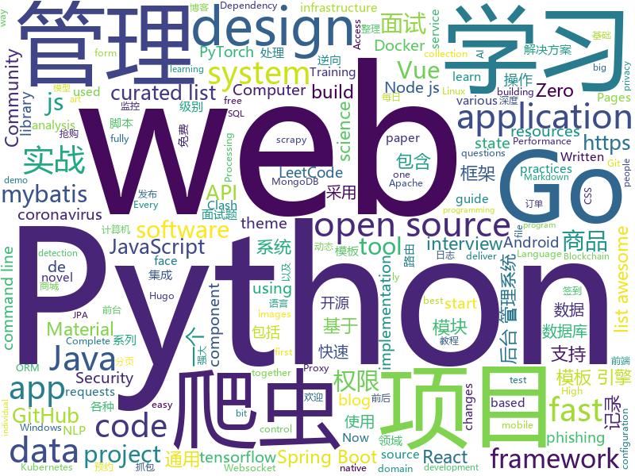

# 2020-03-08
See what the GitHub community is most excited about.

## python
+ [PayloadsAllTheThings](https://github.com/swisskyrepo/PayloadsAllTheThings)(**48 stars today**): A list of useful payloads and bypass for Web Application Security and Pentest/CTF
+ [system-design-primer](https://github.com/donnemartin/system-design-primer)(**143 stars today**): Learn how to design large-scale systems. Prep for the system design interview. Includes Anki flashcards.
+ [transformers](https://github.com/huggingface/transformers)(**156 stars today**): 🤗Transformers: State-of-the-art Natural Language Processing for TensorFlow 2.0 and PyTorch.
+ [ncov](https://github.com/nextstrain/ncov)(**46 stars today**): Nextstrain build for novel coronavirus (nCoV)
+ [awesome-python](https://github.com/vinta/awesome-python)(**94 stars today**): A curated list of awesome Python frameworks, libraries, software and resources
+ [coronavirus-tracker-api](https://github.com/ExpDev07/coronavirus-tracker-api)(**19 stars today**): 🦠 A simple and fast (< 200ms) API for tracking the global coronavirus (2019-nCoV) outbreak. It's written in python using the🍼Flask framework.
+ [Awesome-Linux-Software](https://github.com/luong-komorebi/Awesome-Linux-Software)(**33 stars today**): A list of awesome applications, software, tools and other materials for Linux distros.
+ [HelloGitHub](https://github.com/521xueweihan/HelloGitHub)(**158 stars today**): Find pearls on open-source seashore 分享 GitHub 上有趣、入门级的开源项目
+ [2020nCov_individual_archives](https://github.com/jiayiliujiayi/2020nCov_individual_archives)(**28 stars today**): Every individual matters. Every individual has a role to play. 备份普通人在疫情期间的记录。（持续翻译 & 更新中）
+ [XX-Net](https://github.com/XX-net/XX-Net)(**28 stars today**): a web proxy tool
+ [yt-interval](https://github.com/DinRigtigeFar/yt-interval)(**22 stars today**): Flask app to download YT videos in intervals. Eg. from start to 30 seconds: start-30
+ [CNNDetection](https://github.com/PeterWang512/CNNDetection)(**80 stars today**): Code for the paper: CNN-generated images are surprisingly easy to spot... for now https://peterwang512.github.io/CNNDetection/
+ [pyxelate](https://github.com/sedthh/pyxelate)(**18 stars today**): Python function that turns images into pixel art.
+ [jd_mask](https://github.com/zhou-xiaojun/jd_mask)(**63 stars today**): 京东定时自动预约,抢购.(只针对性支持要先预约,到点抢购.然后直接下单的商品!)
+ [FaceMaskDetection](https://github.com/AIZOOTech/FaceMaskDetection)(**39 stars today**): 开源人脸口罩检测模型和数据 Detect faces and determine whether people are wearing mask.
+ [libfacedetection.train](https://github.com/ShiqiYu/libfacedetection.train)(**135 stars today**): The training program for libfacedetection for face detection and 5-landmark detection.
+ [python_blockchain_app](https://github.com/satwikkansal/python_blockchain_app)(**3 stars today**): A fully functional blockchain application implemented in Python from scratch (with tutorial).
+ [core](https://github.com/home-assistant/core)(**34 stars today**): 🏡Open source home automation that puts local control and privacy first
+ [kornia](https://github.com/kornia/kornia)(**58 stars today**): Open Source Differentiable Computer Vision Library for PyTorch
+ [markdown](https://github.com/Python-Markdown/markdown)(**5 stars today**): A Python implementation of John Gruber’s Markdown with Extension support.
+ [free-hls](https://github.com/sxyazi/free-hls)(**18 stars today**): 一个免费的 HLS 解决方案
+ [scrapy](https://github.com/scrapy/scrapy)(**71 stars today**): Scrapy, a fast high-level web crawling & scraping framework for Python.
+ [Douyin-Bot](https://github.com/wangshub/Douyin-Bot)(**9 stars today**): 😍Python 抖音机器人，论如何在抖音上找到漂亮小姐姐？
+ [GUI_maker](https://github.com/max-dotpy/GUI_maker)(**29 stars today**): App to introduce beginners to Tkinter
+ [learn_python3_spider](https://github.com/wistbean/learn_python3_spider)(**26 stars today**): python爬虫教程系列、从0到1学习python爬虫，包括浏览器抓包，手机APP抓包，如 fiddler、mitmproxy，各种爬虫涉及的模块的使用，如：requests、beautifulSoup、selenium、appium、scrapy等，以及IP代理，验证码识别，Mysql，MongoDB数据库的python使用，多线程多进程爬虫的使用，css 爬虫加密逆向破解，JS爬虫逆向，分布式爬虫，爬虫项目实战实例等

## java
+ [CS-Notes](https://github.com/CyC2018/CS-Notes)(**327 stars today**): 📚技术面试必备基础知识、Leetcode、计算机操作系统、计算机网络、系统设计、Java、Python、C++
+ [ghidra](https://github.com/NationalSecurityAgency/ghidra)(**33 stars today**): Ghidra is a software reverse engineering (SRE) framework
+ [mall](https://github.com/macrozheng/mall)(**114 stars today**): mall项目是一套电商系统，包括前台商城系统及后台管理系统，基于SpringBoot+MyBatis实现，采用Docker容器化部署。 前台商城系统包含首页门户、商品推荐、商品搜索、商品展示、购物车、订单流程、会员中心、客户服务、帮助中心等模块。 后台管理系统包含商品管理、订单管理、会员管理、促销管理、运营管理、内容管理、统计报表、财务管理、权限管理、设置等模块。
+ [JavaGuide](https://github.com/Snailclimb/JavaGuide)(**268 stars today**): 【Java学习+面试指南】 一份涵盖大部分Java程序员所需要掌握的核心知识。
+ [LeetCodeAnimation](https://github.com/MisterBooo/LeetCodeAnimation)(**107 stars today**): Demonstrate all the questions on LeetCode in the form of animation.（用动画的形式呈现解LeetCode题目的思路）
+ [DataX](https://github.com/alibaba/DataX)(**117 stars today**): 
+ [CtCI-6th-Edition](https://github.com/careercup/CtCI-6th-Edition)(**11 stars today**): Cracking the Coding Interview 6th Ed. Solutions
+ [eladmin](https://github.com/elunez/eladmin)(**21 stars today**): 项目基于 Spring Boot 2.1.0 、 Jpa、 Spring Security、redis、Vue的前后端分离的后台管理系统，项目采用分模块开发方式， 权限控制采用 RBAC，支持数据字典与数据权限管理，支持一键生成前后端代码，支持动态路由
+ [spring-boot-demo](https://github.com/xkcoding/spring-boot-demo)(**38 stars today**): spring boot demo 是一个用来深度学习并实战 spring boot 的项目，目前总共包含 65 个集成demo，已经完成 53 个。 该项目已成功集成 actuator(监控)、admin(可视化监控)、logback(日志)、aopLog(通过AOP记录web请求日志)、统一异常处理(json级别和页面级别)、freemarker(模板引擎)、thymeleaf(模板引擎)、Beetl(模板引擎)、Enjoy(模板引擎)、JdbcTemplate(通用JDBC操作数据库)、JPA(强大的ORM框架)、mybatis(强大的ORM框架)、通用Mapper(快速操作Mybatis)、PageHelper(通用的Mybatis分页插件)、mybatis-plus(快速操作M…
+ [spring-cloud-repo](https://github.com/benwang6/spring-cloud-repo)(**31 stars today**): 
+ [wahh_extras](https://github.com/six2dez/wahh_extras)(**134 stars today**): The Web Application Hacker's Handbook - Extra Content
+ [AndroidTutorialForBeginners](https://github.com/hussien89aa/AndroidTutorialForBeginners)(**11 stars today**): Step by step to build Android apps using Android Studio
+ [SAI](https://github.com/Aefyr/SAI)(**41 stars today**): Android split APKs installer
+ [ELinkageScroll](https://github.com/baiduapp-tec/ELinkageScroll)(**16 stars today**): 多子view嵌套滚动通用解决方案
+ [vert.x](https://github.com/eclipse-vertx/vert.x)(**8 stars today**): Vert.x is a tool-kit for building reactive applications on the JVM
+ [StateProgressBar](https://github.com/kofigyan/StateProgressBar)(**21 stars today**): Android library to realize the various states and transitions in a ProgressBar.
+ [CoreNLP](https://github.com/stanfordnlp/CoreNLP)(**6 stars today**): Stanford CoreNLP: A Java suite of core NLP tools.
+ [ZXBlog](https://github.com/ZXZxin/ZXBlog)(**5 stars today**): 记录各种学习笔记(算法、Java、数据库、并发......)
+ [flink](https://github.com/apache/flink)(**17 stars today**): Apache Flink
+ [incubator-hudi](https://github.com/apache/incubator-hudi)(**3 stars today**): Upserts And Incremental Processing on Big Data
+ [thinking-in-spring-boot-samples](https://github.com/mercyblitz/thinking-in-spring-boot-samples)(**9 stars today**): 小马哥书籍《Spring Boot 编程思想》示例工程
+ [halo](https://github.com/halo-dev/halo)(**46 stars today**): ✍ An excellent open source blog publishing application. | 一个优秀的开源博客发布应用。
+ [kafka](https://github.com/apache/kafka)(**22 stars today**): Mirror of Apache Kafka
+ [CISC191](https://github.com/ahuang-cs/CISC191)(**2 stars today**): CISC191: Intermediate Java Programming
+ [Spring-Boot-In-Action](https://github.com/hansonwang99/Spring-Boot-In-Action)(**42 stars today**): Spring Boot 系列实战合集

## unknown
+ [COVID-19](https://github.com/CSSEGISandData/COVID-19)(**590 stars today**): Novel Coronavirus (COVID-19) Cases, provided by JHU CSSE
+ [ultimate-coding-resources](https://github.com/PizzaPokerGuy/ultimate-coding-resources)(**235 stars today**): A collection of the best resources for programming, web development, computer science and more.
+ [awesome-reversing](https://github.com/tylerha97/awesome-reversing)(**54 stars today**): A curated list of awesome reversing resources
+ [learn-regex](https://github.com/ziishaned/learn-regex)(**58 stars today**): Learn regex the easy way
+ [personal-security-checklist](https://github.com/Lissy93/personal-security-checklist)(**140 stars today**): 🔒A curated checklist of 100+ tips for protecting digital security and privacy in 2020
+ [fetool](https://github.com/nieweidong/fetool)(**12 stars today**): 大前端的瑞士军刀，只记录有用的。
+ [awesome-react](https://github.com/enaqx/awesome-react)(**23 stars today**): A collection of awesome things regarding React ecosystem
+ [the-art-of-command-line](https://github.com/jlevy/the-art-of-command-line)(**94 stars today**): Master the command line, in one page
+ [QuantumultX](https://github.com/nzw9314/QuantumultX)(**27 stars today**): QuantumultX
+ [tidb-in-action](https://github.com/pingcap-incubator/tidb-in-action)(**55 stars today**): TiDB In Action: based on 4.0
+ [interview](https://github.com/hadyang/interview)(**7 stars today**): Java 笔试、面试 知识整理
+ [data-science-interviews](https://github.com/alexeygrigorev/data-science-interviews)(**144 stars today**): Data science interview questions and answers
+ [mindspore](https://github.com/mindspore-ai/mindspore)(**15 stars today**): MindSpore是一个高度智能化的AI计算框架，可将硬件算力发挥到极致。
+ [acwa_book_ru](https://github.com/adelf/acwa_book_ru)(**11 stars today**): Книга "Архитектура сложных веб-приложений. С примерами на Laravel"
+ [PRESC](https://github.com/mozilla/PRESC)(**3 stars today**): Performance Robustness Evaluation for Statistical Classifiers
+ [Ai-Learn](https://github.com/tangyudi/Ai-Learn)(**20 stars today**): 人工智能学习路线图，整理近200个实战案例与项目，免费提供配套教材，零基础入门，就业实战！包括：Python，数学，机器学习，数据分析，深度学习，计算机视觉，自然语言处理，PyTorch tensorflow machine-learning,deep-learning data-analysis data-mining mathematics data-science artificial-intelligence python tensorflow tensorflow2 caffe keras pytorch algorithm numpy pandas matplotlib seaborn nlp cv等热门领域
+ [openwrt-actions](https://github.com/Lienol/openwrt-actions)(**7 stars today**): 
+ [tracker-radar](https://github.com/duckduckgo/tracker-radar)(**223 stars today**): 
+ [system-design-interview](https://github.com/checkcheckzz/system-design-interview)(**24 stars today**): System design interview for IT companies
+ [intellij-community](https://github.com/JetBrains/intellij-community)(**18 stars today**): IntelliJ IDEA Community Edition
+ [SoftwareArchitect](https://github.com/justinamiller/SoftwareArchitect)(**26 stars today**): Path to a Software Architect
+ [awesome-distributed-systems](https://github.com/theanalyst/awesome-distributed-systems)(**22 stars today**): A curated list to learn about distributed systems
+ [awesome-cli-apps](https://github.com/agarrharr/awesome-cli-apps)(**16 stars today**): 🖥📊🕹🛠A curated list of command line apps
+ [Java-Interview](https://github.com/gzc426/Java-Interview)(**23 stars today**): Java 面试必会 直通BAT
+ [strategies](https://github.com/fmzquant/strategies)(**3 stars today**): quantitative trading with Javascript, Python, C++, Blockly, MyLanguage(麦语言)

## javascript
+ [myDrive](https://github.com/subnub/myDrive)(**109 stars today**): Node.js and mongoDB Google Drive Clone
+ [vue-formulate](https://github.com/wearebraid/vue-formulate)(**48 stars today**): The easiest way to build forms using Vue.
+ [material-ui](https://github.com/mui-org/material-ui)(**84 stars today**): React components for faster and easier web development. Build your own design system, or start with Material Design.
+ [bootstrap](https://github.com/twbs/bootstrap)(**74 stars today**): The most popular HTML, CSS, and JavaScript framework for developing responsive, mobile first projects on the web.
+ [fe-interview](https://github.com/haizlin/fe-interview)(**31 stars today**): 前端面试每日 3+1，以面试题来驱动学习，提倡每日学习与思考，每天进步一点！每天早上5点纯手工发布面试题（死磕自己，愉悦大家）
+ [odoo](https://github.com/odoo/odoo)(**29 stars today**): Odoo. Open Source Apps To Grow Your Business.
+ [social-network](https://github.com/misa-j/social-network)(**20 stars today**): My first project
+ [webpack-2020](https://github.com/vladilenm/webpack-2020)(**4 stars today**): 
+ [node](https://github.com/nodejs/node)(**76 stars today**): Node.js JavaScript runtime✨🐢🚀✨
+ [nodebestpractices](https://github.com/goldbergyoni/nodebestpractices)(**410 stars today**): ✅The Node.js best practices list (March 2020)
+ [awesome-mac](https://github.com/jaywcjlove/awesome-mac)(**67 stars today**):  Now we have become very big, Different from the original idea. Collect premium software in various categories.
+ [immer](https://github.com/immerjs/immer)(**55 stars today**): Create the next immutable state by mutating the current one
+ [bypass-paywalls-chrome](https://github.com/iamadamdev/bypass-paywalls-chrome)(**48 stars today**): Bypass Paywalls for Chrome
+ [esercizi-di-programmazione-javascript](https://github.com/AlbertoOlla/esercizi-di-programmazione-javascript)(**3 stars today**): Esercizi di informatica! Impara a programmare, metti alla prova!
+ [opensource.guide](https://github.com/github/opensource.guide)(**10 stars today**): 📚Community guides for open source creators
+ [vue-h5-template](https://github.com/push-over/vue-h5-template)(**79 stars today**): 
+ [Ghost](https://github.com/TryGhost/Ghost)(**36 stars today**): 👻The #1 headless Node.js CMS for professional publishing
+ [complete-javascript-course](https://github.com/jonasschmedtmann/complete-javascript-course)(**12 stars today**): Starter files, final projects and FAQ for my Complete JavaScript course
+ [vue-todos](https://github.com/liangxiaojuan/vue-todos)(**4 stars today**): vue最新实战项目教程，从零开始，一步一个脚印,循序渐进。跟着我一起学习vue吧！
+ [vue-quill-editor](https://github.com/surmon-china/vue-quill-editor)(**10 stars today**): 🍡@quilljs editor component for @vuejs
+ [reactotron](https://github.com/infinitered/reactotron)(**7 stars today**): A desktop app for inspecting your React JS and React Native projects. macOS, Linux, and Windows.
+ [parcel](https://github.com/parcel-bundler/parcel)(**34 stars today**): 📦🚀Blazing fast, zero configuration web application bundler
+ [protobuf.js](https://github.com/protobufjs/protobuf.js)(**8 stars today**): Protocol Buffers for JavaScript (& TypeScript).
+ [TaskConfig](https://github.com/sazs34/TaskConfig)(**13 stars today**): all_in_one合并脚本，饿了么签到加翻牌，自定义天气，贴吧签到，以及smartjs
+ [freeCodeCamp](https://github.com/freeCodeCamp/freeCodeCamp)(**79 stars today**): freeCodeCamp.org's open source codebase and curriculum. Learn to code for free together with millions of people.

## html
+ [OpenClash](https://github.com/vernesong/OpenClash)(**75 stars today**): A Clash Client For OpenWrt
+ [hyperblog](https://github.com/freddier/hyperblog)(**12 stars today**): Un blog increíble para el curso de Git y Github de Platzi
+ [WebFundamentals](https://github.com/google/WebFundamentals)(**9 stars today**): Best practices for modern web development
+ [iptv-m3u-maker](https://github.com/EvilCult/iptv-m3u-maker)(**10 stars today**): IPTV 国内+国外 电视台直播源m3u文件, 收集&汇总&本地源脚本
+ [java](https://github.com/bjmashibing/java)(**6 stars today**): 
+ [fluxion](https://github.com/FluxionNetwork/fluxion)(**7 stars today**): Fluxion is a remake of linset by vk496 with less bugs and enhanced functionality.
+ [JavaScript30](https://github.com/wesbos/JavaScript30)(**14 stars today**): 30 Day Vanilla JS Challenge
+ [training-kit](https://github.com/github/training-kit)(**4 stars today**): Open source cheat sheets for Git and GitHub
+ [lockphish](https://github.com/thelinuxchoice/lockphish)(**6 stars today**): Lockphish is a tool for phishing attacks on the lock screen, designed to grab Windows credentials, Android PIN and iPhone Passcode
+ [gohugo-theme-ananke](https://github.com/budparr/gohugo-theme-ananke)(**2 stars today**): Ananke: A theme for Hugo Sites
+ [noc-book-2](https://github.com/nature-of-code/noc-book-2)(**19 stars today**): Repository for The Nature of Code book with p5.js
+ [country-list](https://github.com/umpirsky/country-list)(**3 stars today**): 🌐List of all countries with names and ISO 3166-1 codes in all languages and data formats.
+ [v-calendar](https://github.com/nathanreyes/v-calendar)(**2 stars today**): A lightweight, dependency-free plugin for building attributed calendars in Vue.js
+ [AR.js](https://github.com/jeromeetienne/AR.js)(**15 stars today**): Efficient Augmented Reality for the Web - 60fps on mobile!
+ [shellphish](https://github.com/thelinuxchoice/shellphish)(**3 stars today**): 19 Social Media Phishing Pages #phishing #shellphish #phish
+ [awesome-piracy](https://github.com/Igglybuff/awesome-piracy)(**12 stars today**): A curated list of awesome warez and piracy links
+ [REKCARC-TSC-UHT](https://github.com/PKUanonym/REKCARC-TSC-UHT)(**8 stars today**): 清华大学计算机系课程攻略 Guidance for courses in Department of Computer Science and Technology, Tsinghua University
+ [Markdown-Resume](https://github.com/CyC2018/Markdown-Resume)(**8 stars today**): ⭐️Markdown 简历模版
+ [complete-web-developer-manual](https://github.com/zero-to-mastery/complete-web-developer-manual)(**3 stars today**): All resources and notes from the Complete Web Developer in 2018: Zero to Mastery course
+ [youmightnotneedjquery](https://github.com/HubSpot/youmightnotneedjquery)(**9 stars today**): 
+ [he4rtlabs-challenges-01](https://github.com/he4rtlabs/he4rtlabs-challenges-01)(**2 stars today**): Calculadora de freelance
+ [mzlogin.github.io](https://github.com/mzlogin/mzlogin.github.io)(**3 stars today**): 🙊My Blog / Jekyll Themes / GitHub Pages 博客模板
+ [MatBlazor](https://github.com/SamProf/MatBlazor)(**14 stars today**): Material Design components for Blazor and Razor Components
+ [luci-app-clash](https://github.com/frainzy1477/luci-app-clash)(**34 stars today**): Luci interface for Clash Openwrt
+ [hugo-theme-noteworthy](https://github.com/kimcc/hugo-theme-noteworthy)(**4 stars today**): A minimalist Hugo theme for writers and bloggers

## go
+ [minter-go-node](https://github.com/MinterTeam/minter-go-node)(**57 stars today**): 🚀Official Minter Blockchain Implementation in Go
+ [BaiduPCS-Go](https://github.com/iikira/BaiduPCS-Go)(**104 stars today**): 百度网盘客户端 - Go语言编写
+ [cli](https://github.com/cli/cli)(**176 stars today**): The GitHub CLI
+ [proposal](https://github.com/golang/proposal)(**21 stars today**): Go Project Design Documents
+ [clash](https://github.com/Dreamacro/clash)(**92 stars today**): A rule-based tunnel in Go.
+ [soar](https://github.com/XiaoMi/soar)(**8 stars today**): SQL Optimizer And Rewriter
+ [gin-vue-admin](https://github.com/piexlmax/gin-vue-admin)(**9 stars today**): 基于gin+gorm+vue搭建的快速后台管理系统模板，包含jwt鉴权，权限管理，动态路由，分页封装，多点登录拦截，资源权限，上传下载等基础功能，更多功能正在开发中，欢迎iss，欢迎pr
+ [ultimate-go](https://github.com/hoanhan101/ultimate-go)(**16 stars today**): Ultimate Go study guide, with heavily documented code and programs analysis, all in 1 place
+ [scope](https://github.com/weaveworks/scope)(**11 stars today**): Monitoring, visualisation & management for Docker & Kubernetes
+ [test-infra](https://github.com/kubernetes/test-infra)(**6 stars today**): Test infrastructure for the Kubernetes project.
+ [linkerd2](https://github.com/linkerd/linkerd2)(**12 stars today**): A service mesh for Kubernetes and beyond. Main repo for Linkerd 2.x.
+ [goreleaser](https://github.com/goreleaser/goreleaser)(**17 stars today**): Deliver Go binaries as fast and easily as possible
+ [sqlflow](https://github.com/sql-machine-learning/sqlflow)(**16 stars today**): Brings SQL and AI together.
+ [atreugo](https://github.com/savsgio/atreugo)(**7 stars today**): High performance and extensible micro web framework. Zero memory allocations in hot paths.
+ [distribution](https://github.com/docker/distribution)(**7 stars today**): The Docker toolset to pack, ship, store, and deliver content
+ [transfer.sh](https://github.com/dutchcoders/transfer.sh)(**7 stars today**): Easy and fast file sharing from the command-line.
+ [domain-list-community](https://github.com/v2ray/domain-list-community)(**2 stars today**): Community managed domain list
+ [go](https://github.com/golang/go)(**85 stars today**): The Go programming language
+ [freedom](https://github.com/8treenet/freedom)(**207 stars today**): freedom是一个基于六边形架构的框架，可以支撑充血的领域模型范式。
+ [service](https://github.com/ardanlabs/service)(**3 stars today**): Starter code for writing web services in Go
+ [goreplay](https://github.com/buger/goreplay)(**11 stars today**): GoReplay is an open-source tool for capturing and replaying live HTTP traffic into a test environment in order to continuously test your system with real data. It can be used to increase confidence in code deployments, configuration changes and infrastructure changes.
+ [websocket](https://github.com/gorilla/websocket)(**26 stars today**): A fast, well-tested and widely used WebSocket implementation for Go.
+ [iris](https://github.com/kataras/iris)(**20 stars today**): 感谢中国开发者 - https://bit.ly/謝謝 | The fastest community-driven web framework for Go. Webassembly, Automatic HTTPS with Public Domain, MVC, Sessions, Caching, Versioning API, Problem API, Websocket, Dependency Injection and more. Fully compatible with the standard library and 3rd-party middleware packages. | https://bit.ly/iriscandothat1 | https://bi…
+ [gotraining](https://github.com/ardanlabs/gotraining)(**28 stars today**): Go Training Class Material :
+ [oathkeeper](https://github.com/ory/oathkeeper)(**2 stars today**): A cloud native Identity & Access Proxy / API (IAP) and Access Control Decision API that authenticates, authorizes, and mutates incoming HTTP(s) requests. Inspired by the BeyondCorp / Zero Trust white paper. Written in Go.

## WordCloud

