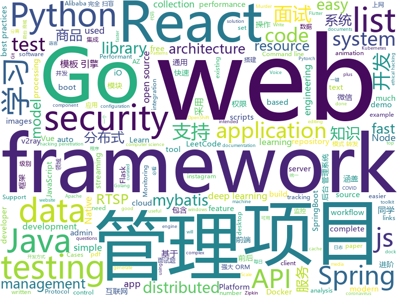

# 2020-03-10
See what the GitHub community is most excited about.

## python
+ [dangerzone](https://github.com/firstlookmedia/dangerzone)(**135 stars today**): Take potentially dangerous PDFs, office documents, or images and convert them to a safe PDF
+ [CVE-2020-8597](https://github.com/marcinguy/CVE-2020-8597)(**8 stars today**): CVE-2020-8597
+ [dispatch](https://github.com/Netflix/dispatch)(**62 stars today**): All of the ad-hoc things you're doing to manage incidents today, done for you, and much more!
+ [manim](https://github.com/3b1b/manim)(**70 stars today**): Animation engine for explanatory math videos
+ [PayloadsAllTheThings](https://github.com/swisskyrepo/PayloadsAllTheThings)(**64 stars today**): A list of useful payloads and bypass for Web Application Security and Pentest/CTF
+ [instabot](https://github.com/instagrambot/instabot)(**11 stars today**): 🐙Free Instagram scripts, bots and Python API wrapper. Get free instagram followers with our auto like, auto follow and other scripts!
+ [sentence-transformers](https://github.com/UKPLab/sentence-transformers)(**9 stars today**): Sentence Embeddings with BERT & XLNet
+ [Cirq](https://github.com/quantumlib/Cirq)(**36 stars today**): A python framework for creating, editing, and invoking Noisy Intermediate Scale Quantum (NISQ) circuits.
+ [nni](https://github.com/microsoft/nni)(**4 stars today**): An open source AutoML toolkit for automate machine learning lifecycle, including feature engineering, neural architecture search, model compression and hyper-parameter tuning.
+ [chineseocr](https://github.com/chineseocr/chineseocr)(**32 stars today**): yolo3+ocr
+ [ludwig](https://github.com/uber/ludwig)(**7 stars today**): Ludwig is a toolbox built on top of TensorFlow that allows to train and test deep learning models without the need to write code.
+ [maltrail](https://github.com/stamparm/maltrail)(**5 stars today**): Malicious traffic detection system
+ [apex](https://github.com/NVIDIA/apex)(**8 stars today**): A PyTorch Extension: Tools for easy mixed precision and distributed training in Pytorch
+ [coronavirus-tracker-api](https://github.com/ExpDev07/coronavirus-tracker-api)(**16 stars today**): 🦠 A simple and fast (< 200ms) API for tracking the global coronavirus (2019-nCoV) outbreak. It's written in python using the🍼Flask framework.
+ [openshift-ansible](https://github.com/openshift/openshift-ansible)(**1 stars today**): OpenShift Installation and Configuration Management
+ [public-apis](https://github.com/public-apis/public-apis)(**76 stars today**): A collective list of free APIs for use in software and web development.
+ [dgl](https://github.com/dmlc/dgl)(**18 stars today**): Python package built to ease deep learning on graph, on top of existing DL frameworks.
+ [flask-restx](https://github.com/python-restx/flask-restx)(**8 stars today**): Fork of Flask-RESTPlus: Fully featured framework for fast, easy and documented API development with Flask
+ [diagrams](https://github.com/mingrammer/diagrams)(**39 stars today**): 🎨Diagram as Code for prototyping cloud system architectures
+ [dvc](https://github.com/iterative/dvc)(**16 stars today**): 🦉Data Version Control | Git for Data & Models
+ [autosub](https://github.com/agermanidis/autosub)(**3 stars today**): [NO LONGER MAINTAINED] Command-line utility for auto-generating subtitles for any video file
+ [ML-From-Scratch](https://github.com/eriklindernoren/ML-From-Scratch)(**8 stars today**): Machine Learning From Scratch. Bare bones NumPy implementations of machine learning models and algorithms with a focus on accessibility. Aims to cover everything from linear regression to deep learning.
+ [httpx](https://github.com/encode/httpx)(**14 stars today**): A next generation HTTP client for Python.🦋
+ [Tautulli](https://github.com/Tautulli/Tautulli)(**6 stars today**): A Python based monitoring and tracking tool for Plex Media Server.
+ [hydra](https://github.com/facebookresearch/hydra)(**11 stars today**): Hydra is a framework for elegantly configuring complex applications

## java
+ [cloud2020](https://github.com/leelovejava/cloud2020)(**12 stars today**): SpringCloud
+ [JavaGuide](https://github.com/Snailclimb/JavaGuide)(**223 stars today**): 【Java学习+面试指南】 一份涵盖大部分Java程序员所需要掌握的核心知识。
+ [wahh_extras](https://github.com/six2dez/wahh_extras)(**54 stars today**): The Web Application Hacker's Handbook - Extra Content
+ [incubator-shardingsphere](https://github.com/apache/incubator-shardingsphere)(**43 stars today**): Distributed database middleware
+ [CS-Notes](https://github.com/CyC2018/CS-Notes)(**204 stars today**): 📚技术面试必备基础知识、Leetcode、计算机操作系统、计算机网络、系统设计、Java、Python、C++
+ [bigbluebutton](https://github.com/bigbluebutton/bigbluebutton)(**9 stars today**): Complete open source web conferencing system.
+ [eladmin](https://github.com/elunez/eladmin)(**33 stars today**): 项目基于 Spring Boot 2.1.0 、 Jpa、 Spring Security、redis、Vue的前后端分离的后台管理系统，项目采用分模块开发方式， 权限控制采用 RBAC，支持数据字典与数据权限管理，支持一键生成前后端代码，支持动态路由
+ [tutorials](https://github.com/eugenp/tutorials)(**20 stars today**): Just Announced - "Learn Spring Security OAuth":
+ [flink](https://github.com/apache/flink)(**9 stars today**): Apache Flink
+ [vhr](https://github.com/lenve/vhr)(**41 stars today**): 微人事是一个前后端分离的人力资源管理系统，项目采用SpringBoot+Vue开发。
+ [ghidra](https://github.com/NationalSecurityAgency/ghidra)(**43 stars today**): Ghidra is a software reverse engineering (SRE) framework
+ [hutool](https://github.com/looly/hutool)(**54 stars today**): A set of tools that keep Java sweet.
+ [hadoop](https://github.com/apache/hadoop)(**6 stars today**): Apache Hadoop
+ [spring-boot-demo](https://github.com/xkcoding/spring-boot-demo)(**35 stars today**): spring boot demo 是一个用来深度学习并实战 spring boot 的项目，目前总共包含 65 个集成demo，已经完成 53 个。 该项目已成功集成 actuator(监控)、admin(可视化监控)、logback(日志)、aopLog(通过AOP记录web请求日志)、统一异常处理(json级别和页面级别)、freemarker(模板引擎)、thymeleaf(模板引擎)、Beetl(模板引擎)、Enjoy(模板引擎)、JdbcTemplate(通用JDBC操作数据库)、JPA(强大的ORM框架)、mybatis(强大的ORM框架)、通用Mapper(快速操作Mybatis)、PageHelper(通用的Mybatis分页插件)、mybatis-plus(快速操作M…
+ [mall](https://github.com/macrozheng/mall)(**85 stars today**): mall项目是一套电商系统，包括前台商城系统及后台管理系统，基于SpringBoot+MyBatis实现，采用Docker容器化部署。 前台商城系统包含首页门户、商品推荐、商品搜索、商品展示、购物车、订单流程、会员中心、客户服务、帮助中心等模块。 后台管理系统包含商品管理、订单管理、会员管理、促销管理、运营管理、内容管理、统计报表、财务管理、权限管理、设置等模块。
+ [spring-cloud-alibaba](https://github.com/alibaba/spring-cloud-alibaba)(**20 stars today**): Spring Cloud Alibaba provides a one-stop solution for application development for the distributed solutions of Alibaba middleware.
+ [SpringCloud](https://github.com/zhoutaoo/SpringCloud)(**21 stars today**): 基于SpringCloud2.1的微服务开发脚手架，整合了spring-security-oauth2、nacos、feign、sentinel、springcloud-gateway等。服务治理方面引入elasticsearch、skywalking、springboot-admin、zipkin等，让项目开发快速进入业务开发，而不需过多时间花费在架构搭建上。持续更新中
+ [zipkin](https://github.com/openzipkin/zipkin)(**2 stars today**): Zipkin is a distributed tracing system
+ [incubator-dolphinscheduler](https://github.com/apache/incubator-dolphinscheduler)(**6 stars today**): Dolphin Scheduler is a distributed and easy-to-expand visual DAG workflow scheduling system, dedicated to solving the complex dependencies in data processing, making the scheduling system out of the box for data processing.(分布式易扩展的可视化工作流任务调度)
+ [LeetCodeAnimation](https://github.com/MisterBooo/LeetCodeAnimation)(**86 stars today**): Demonstrate all the questions on LeetCode in the form of animation.（用动画的形式呈现解LeetCode题目的思路）
+ [advanced-java](https://github.com/doocs/advanced-java)(**128 stars today**): 😮互联网 Java 工程师进阶知识完全扫盲：涵盖高并发、分布式、高可用、微服务、海量数据处理等领域知识，后端同学必看，前端同学也可学习
+ [quarkus](https://github.com/quarkusio/quarkus)(**9 stars today**): Quarkus: Supersonic Subatomic Java.
+ [thingsboard](https://github.com/thingsboard/thingsboard)(**9 stars today**): Open-source IoT Platform - Device management, data collection, processing and visualization.
+ [azkaban](https://github.com/azkaban/azkaban)(**4 stars today**): Azkaban workflow manager.
+ [flutter_boost](https://github.com/alibaba/flutter_boost)(**6 stars today**): FlutterBoost is a Flutter plugin which enables hybrid integration of Flutter for your existing native apps with minimum efforts

## unknown
+ [COVID-19](https://github.com/pcm-dpc/COVID-19)(**274 stars today**): COVID-19 Italia - Monitoraggio situazione
+ [JavaFamily](https://github.com/AobingJava/JavaFamily)(**142 stars today**): 【互联网一线大厂面试+学习指南】进阶知识完全扫盲：涵盖高并发、分布式、高可用、微服务等领域知识，作者风格幽默，看起来津津有味，把学习当做一种乐趣，何乐而不为，后端同学必看，前端同学我保证你也看得懂，看不懂你加我微信骂我渣男就好了。
+ [ultimate-coding-resources](https://github.com/PizzaPokerGuy/ultimate-coding-resources)(**476 stars today**): A collection of the best resources for programming, web development, computer science and more.
+ [COVID-19](https://github.com/CSSEGISandData/COVID-19)(**775 stars today**): Novel Coronavirus (COVID-19) Cases, provided by JHU CSSE
+ [CVPR2020-Code](https://github.com/amusi/CVPR2020-Code)(**130 stars today**): CVPR 2020 论文开源项目合集
+ [learn-regex](https://github.com/ziishaned/learn-regex)(**201 stars today**): Learn regex the easy way
+ [Cookbook](https://github.com/andkret/Cookbook)(**14 stars today**): The Data Engineering Cookbook
+ [deep_learning_object_detection](https://github.com/hoya012/deep_learning_object_detection)(**20 stars today**): A paper list of object detection using deep learning.
+ [developer-roadmap](https://github.com/kamranahmedse/developer-roadmap)(**74 stars today**): Roadmap to becoming a web developer in 2020
+ [awesome-scalability](https://github.com/binhnguyennus/awesome-scalability)(**20 stars today**): The Patterns of Scalable, Reliable, and Performant Large-Scale Systems
+ [stayinghomeclub](https://github.com/phildini/stayinghomeclub)(**16 stars today**): A list of all the companies WFH or events changed because of covid-19
+ [personal-security-checklist](https://github.com/Lissy93/personal-security-checklist)(**63 stars today**): 🔒A curated checklist of 100+ tips for protecting digital security and privacy in 2020
+ [Wall-Street-Bets-Master-Doc](https://github.com/joesocktwo/Wall-Street-Bets-Master-Doc)(**12 stars today**): This repository is intended for research pertaining to the repo market and the international banking system. It is to be used for analysis by the autists of WSB.
+ [PENTESTING-BIBLE](https://github.com/blaCCkHatHacEEkr/PENTESTING-BIBLE)(**7 stars today**): This repository was created and developed by Ammar Amer @cry__pto Only. Updates to this repository will continue to arrive until the number of links reaches 10000 links & 10000 pdf files .Learn Ethical Hacking and penetration testing .hundreds of ethical hacking & penetration testing & red team & cyber security & computer science resources.
+ [awesome-reversing](https://github.com/tylerha97/awesome-reversing)(**101 stars today**): A curated list of awesome reversing resources
+ [app-ideas](https://github.com/florinpop17/app-ideas)(**59 stars today**): A Collection of application ideas which can be used to improve your coding skills.
+ [hacker-laws](https://github.com/dwmkerr/hacker-laws)(**56 stars today**): 💻📖Laws, Theories, Principles and Patterns that developers will find useful. #hackerlaws
+ [new-pac](https://github.com/Alvin9999/new-pac)(**38 stars today**): 科学上网/自由上网/翻墙/软件/方法，免费shadowsocks/ss/ssr/v2ray/goflyway账号，vps一键搭建脚本/教程
+ [javascript-questions](https://github.com/lydiahallie/javascript-questions)(**48 stars today**): A long list of (advanced) JavaScript questions, and their explanations✨
+ [cvpr2020](https://github.com/extreme-assistant/cvpr2020)(**16 stars today**): cvpr2020/cvpr2019／cvpr2018/cvpr2017 papers，极市团队整理
+ [tidb-in-action](https://github.com/pingcap-incubator/tidb-in-action)(**55 stars today**): TiDB In Action: based on 4.0
+ [kubernetes-network-policy-recipes](https://github.com/ahmetb/kubernetes-network-policy-recipes)(**4 stars today**): Example recipes for Kubernetes Network Policies that you can just copy paste
+ [AZ-900T0x-MicrosoftAzureFundamentals](https://github.com/MicrosoftLearning/AZ-900T0x-MicrosoftAzureFundamentals)(**4 stars today**): Microsoft Azure Fundamentals - AZ-900T00 and AZ-900T01
+ [clmystery](https://github.com/veltman/clmystery)(**8 stars today**): A command-line murder mystery
+ [gitstery](https://github.com/nivbend/gitstery)(**33 stars today**): A Git Murder Mystery

## javascript
+ [myDrive](https://github.com/subnub/myDrive)(**279 stars today**): Node.js and mongoDB Google Drive Clone
+ [universal-data-tool](https://github.com/UniversalDataTool/universal-data-tool)(**41 stars today**): Collaborate & label any type of data, images, text, or documents, in an easy web interface or desktop app.
+ [joplin](https://github.com/laurent22/joplin)(**52 stars today**): Joplin - an open source note taking and to-do application with synchronization capabilities for Windows, macOS, Linux, Android and iOS. Forum: https://discourse.joplinapp.org/
+ [gatsby](https://github.com/gatsbyjs/gatsby)(**34 stars today**): Build blazing fast, modern apps and websites with React
+ [taro](https://github.com/NervJS/taro)(**21 stars today**): 多端统一开发框架，支持用 React 的开发方式编写一次代码，生成能运行在微信/百度/支付宝/字节跳动/ QQ 小程序/快应用/H5/React Native 等的应用。 https://taro.jd.com/
+ [fe-interview](https://github.com/haizlin/fe-interview)(**70 stars today**): 前端面试每日 3+1，以面试题来驱动学习，提倡每日学习与思考，每天进步一点！每天早上5点纯手工发布面试题（死磕自己，愉悦大家）
+ [hacker-scripts](https://github.com/NARKOZ/hacker-scripts)(**15 stars today**): Based on a true story
+ [firefox-voice](https://github.com/mozilla/firefox-voice)(**5 stars today**): Firefox Voice is an experiment in a voice-controlled web user agent
+ [bypass-paywalls-chrome](https://github.com/iamadamdev/bypass-paywalls-chrome)(**29 stars today**): Bypass Paywalls for Chrome
+ [webdriverio](https://github.com/webdriverio/webdriverio)(**4 stars today**): Next-gen WebDriver test automation framework for Node.js
+ [BullshitGenerator](https://github.com/menzi11/BullshitGenerator)(**51 stars today**): Needs to generate some texts to test if my GUI rendering codes good or not. so I made this.
+ [the-super-tiny-compiler](https://github.com/jamiebuilds/the-super-tiny-compiler)(**117 stars today**): ⛄️Possibly the smallest compiler ever
+ [nodebestpractices](https://github.com/goldbergyoni/nodebestpractices)(**169 stars today**): ✅The Node.js best practices list (March 2020)
+ [wangEditor](https://github.com/wangfupeng1988/wangEditor)(**11 stars today**): wangEditor —— 轻量级web富文本框
+ [dash-to-dock](https://github.com/micheleg/dash-to-dock)(**12 stars today**): A dock for the Gnome Shell. This extension moves the dash out of the overview transforming it in a dock for an easier launching of applications and a faster switching between windows and desktops.
+ [reactjs.org](https://github.com/reactjs/reactjs.org)(**3 stars today**): The React documentation website
+ [downshift](https://github.com/downshift-js/downshift)(**10 stars today**): 🏎Primitive to build simple, flexible, WAI-ARIA compliant enhanced input React components
+ [wx_calendar](https://github.com/treadpit/wx_calendar)(**11 stars today**): 微信小程序－日历📅
+ [samples](https://github.com/webrtc/samples)(**3 stars today**): WebRTC Web demos and samples
+ [mapbox-gl-js](https://github.com/mapbox/mapbox-gl-js)(**7 stars today**): Interactive, thoroughly customizable maps in the browser, powered by vector tiles and WebGL
+ [ScrollMagic](https://github.com/janpaepke/ScrollMagic)(**7 stars today**): The javascript library for magical scroll interactions.
+ [react-native-snap-carousel](https://github.com/archriss/react-native-snap-carousel)(**10 stars today**): Swiper/carousel component for React Native featuring previews, multiple layouts, parallax images, performant handling of huge numbers of items, and more. Compatible with Android & iOS.
+ [protobuf.js](https://github.com/protobufjs/protobuf.js)(**15 stars today**): Protocol Buffers for JavaScript (& TypeScript).
+ [vuex](https://github.com/vuejs/vuex)(**16 stars today**): 🗃️Centralized State Management for Vue.js.
+ [react-testing-library](https://github.com/testing-library/react-testing-library)(**16 stars today**): 🐐Simple and complete React DOM testing utilities that encourage good testing practices.

## html
+ [DetectionLab](https://github.com/clong/DetectionLab)(**11 stars today**): Vagrant & Packer scripts to build a lab environment complete with security tooling and logging best practices
+ [Java-Interview-Advanced](https://github.com/shishan100/Java-Interview-Advanced)(**17 stars today**): 中华石杉--互联网Java进阶面试训练营
+ [JavaScript30](https://github.com/wesbos/JavaScript30)(**9 stars today**): 30 Day Vanilla JS Challenge
+ [ru.javascript.info](https://github.com/javascript-tutorial/ru.javascript.info)(**5 stars today**): Современный учебник JavaScript
+ [webdevbootcamp](https://github.com/nax3t/webdevbootcamp)(**4 stars today**): All source code for back-end projects from the Web Developer Bootcamp
+ [ckeditor5](https://github.com/ckeditor/ckeditor5)(**6 stars today**): Powerful rich text editor framework with a modular architecture, modern integrations and features like collaborative editing.
+ [beginner-javascript](https://github.com/wesbos/beginner-javascript)(**10 stars today**): Slam Dunk JavaScript
+ [gentelella](https://github.com/ColorlibHQ/gentelella)(**11 stars today**): Free Bootstrap 4 Admin Dashboard Template
+ [learnyounode](https://github.com/workshopper/learnyounode)(**7 stars today**): Learn You The Node.js For Much Win! An intro to Node.js via a set of self-guided workshops.
+ [WebFundamentals](https://github.com/google/WebFundamentals)(**5 stars today**): Best practices for modern web development
+ [keycloak-documentation](https://github.com/keycloak/keycloak-documentation)(**0 stars today**): 
+ [glTF](https://github.com/KhronosGroup/glTF)(**3 stars today**): glTF – Runtime 3D Asset Delivery
+ [kryo](https://github.com/EsotericSoftware/kryo)(**4 stars today**): Java binary serialization and cloning: fast, efficient, automatic
+ [ASVS](https://github.com/OWASP/ASVS)(**3 stars today**): Application Security Verification Standard
+ [www-project-top-ten](https://github.com/OWASP/www-project-top-ten)(**1 stars today**): OWASP Foundation Web Respository
+ [bootcamp-launchbase-desafios-02](https://github.com/Rocketseat/bootcamp-launchbase-desafios-02)(**1 stars today**): Desafios do segundo módulo do Bootcamp Launchbase🚀👨🏻‍🚀
+ [docs](https://github.com/aws-amplify/docs)(**0 stars today**): Amplify Framework Documentation
+ [swagger-codegen](https://github.com/swagger-api/swagger-codegen)(**8 stars today**): swagger-codegen contains a template-driven engine to generate documentation, API clients and server stubs in different languages by parsing your OpenAPI / Swagger definition.
+ [flag-icon-css](https://github.com/lipis/flag-icon-css)(**5 stars today**): 🎏A collection of all country flags in SVG — plus the CSS for easier integration
+ [learning-area](https://github.com/mdn/learning-area)(**2 stars today**): Github repo for the MDN Learning Area.
+ [OpenDS4All](https://github.com/odpi/OpenDS4All)(**10 stars today**): OpenDS4All project, hosted by ODPi
+ [web-moderno](https://github.com/cod3rcursos/web-moderno)(**3 stars today**): 
+ [v2-ui](https://github.com/sprov065/v2-ui)(**8 stars today**): 支持多协议多用户的 v2ray 面板，Support multi-protocol multi-user v2ray panel
+ [cypress-example-kitchensink](https://github.com/cypress-io/cypress-example-kitchensink)(**4 stars today**): This is an example app used to showcase Cypress.io testing.
+ [gohugo-theme-ananke](https://github.com/budparr/gohugo-theme-ananke)(**3 stars today**): Ananke: A theme for Hugo Sites

## go
+ [BaiduPCS-Go](https://github.com/iikira/BaiduPCS-Go)(**157 stars today**): 百度网盘客户端 - Go语言编写
+ [mongo-go-driver](https://github.com/mongodb/mongo-go-driver)(**5 stars today**): The Go driver for MongoDB
+ [gin](https://github.com/gin-gonic/gin)(**29 stars today**): Gin is a HTTP web framework written in Go (Golang). It features a Martini-like API with much better performance -- up to 40 times faster. If you need smashing performance, get yourself some Gin.
+ [viper](https://github.com/spf13/viper)(**19 stars today**): Go configuration with fangs
+ [argo](https://github.com/argoproj/argo)(**12 stars today**): Argo Workflows: Get stuff done with Kubernetes.
+ [golang-web-dev](https://github.com/GoesToEleven/golang-web-dev)(**4 stars today**): 
+ [Burrow](https://github.com/linkedin/Burrow)(**3 stars today**): Kafka Consumer Lag Checking
+ [client_golang](https://github.com/prometheus/client_golang)(**4 stars today**): Prometheus instrumentation library for Go applications
+ [testify](https://github.com/stretchr/testify)(**9 stars today**): A toolkit with common assertions and mocks that plays nicely with the standard library
+ [ultimate-go](https://github.com/hoanhan101/ultimate-go)(**14 stars today**): Ultimate Go study guide, with heavily documented code and programs analysis, all in 1 place
+ [pipeline](https://github.com/tektoncd/pipeline)(**11 stars today**): A K8s-native Pipeline resource.
+ [scope](https://github.com/weaveworks/scope)(**9 stars today**): Monitoring, visualisation & management for Docker & Kubernetes
+ [istio](https://github.com/istio/istio)(**15 stars today**): Connect, secure, control, and observe services.
+ [distribution](https://github.com/docker/distribution)(**5 stars today**): The Docker toolset to pack, ship, store, and deliver content
+ [terraform-provider-azurerm](https://github.com/terraform-providers/terraform-provider-azurerm)(**3 stars today**): Terraform provider for Azure Resource Manager
+ [libpod](https://github.com/containers/libpod)(**6 stars today**): libpod is a library used to create container pods. Home of Podman.
+ [groupcache](https://github.com/golang/groupcache)(**8 stars today**): groupcache is a caching and cache-filling library, intended as a replacement for memcached in many cases.
+ [chaos-mesh](https://github.com/pingcap/chaos-mesh)(**6 stars today**): A Chaos Engineering Platform for Kubernetes
+ [go-github](https://github.com/google/go-github)(**10 stars today**): Go library for accessing the GitHub API
+ [mattermost-server](https://github.com/mattermost/mattermost-server)(**13 stars today**): Open source Slack-alternative in Golang and React - Mattermost
+ [ginkgo](https://github.com/onsi/ginkgo)(**2 stars today**): BDD Testing Framework for Go
+ [goconvey](https://github.com/smartystreets/goconvey)(**2 stars today**): Go testing in the browser. Integrates with `go test`. Write behavioral tests in Go.
+ [installer](https://github.com/openshift/installer)(**1 stars today**): Install an OpenShift cluster
+ [sample-controller](https://github.com/kubernetes/sample-controller)(**3 stars today**): Repository for sample controller. Complements sample-apiserver
+ [EasyDarwin](https://github.com/EasyDarwin/EasyDarwin)(**6 stars today**): open source、high performance、industrial rtsp streaming server,a lot of optimization on streaming relay,KeyFrame cache,RESTful,and web management,also EasyDarwin support distributed load balancing,a simple streaming media cloud platform architecture.高性能开源RTSP流媒体服务器，基于go语言研发，维护和优化：RTSP推模式转发、RTSP拉模式转发、录像、检索、回放、关键帧缓存、秒开画面、RESTful接口、WEB后台管理、分布式负载均衡，基…

## WordCloud

