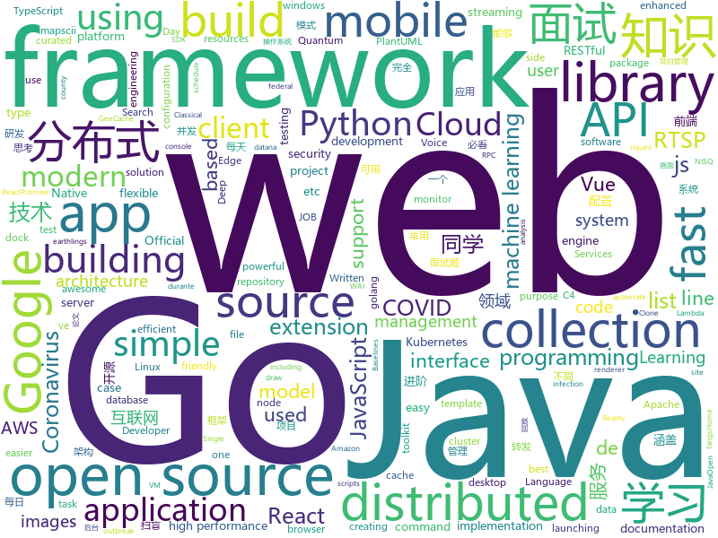

# 2020-03-11
See what the GitHub community is most excited about.

## python
+ [quantum](https://github.com/tensorflow/quantum)(**155 stars today**): Hybrid Quantum-Classical Machine Learning in TensorFlow
+ [riskquant](https://github.com/Netflix-Skunkworks/riskquant)(**71 stars today**): 
+ [manim](https://github.com/3b1b/manim)(**87 stars today**): Animation engine for explanatory math videos
+ [unilm](https://github.com/microsoft/unilm)(**42 stars today**): UniLM - Unified Language Model Pre-training
+ [covid-19](https://github.com/datasets/covid-19)(**7 stars today**): Novel Coronavirus 2019
+ [diagrams](https://github.com/mingrammer/diagrams)(**40 stars today**): 🎨Diagram as Code for prototyping cloud system architectures
+ [baselines](https://github.com/openai/baselines)(**10 stars today**): OpenAI Baselines: high-quality implementations of reinforcement learning algorithms
+ [pydantic](https://github.com/samuelcolvin/pydantic)(**11 stars today**): Data parsing and validation using Python type hints
+ [impacket](https://github.com/SecureAuthCorp/impacket)(**10 stars today**): Impacket is a collection of Python classes for working with network protocols.
+ [aws-cloudformation-templates](https://github.com/awslabs/aws-cloudformation-templates)(**5 stars today**): A collection of useful CloudFormation templates
+ [airflow](https://github.com/apache/airflow)(**17 stars today**): Apache Airflow - A platform to programmatically author, schedule, and monitor workflows
+ [pyxelate](https://github.com/sedthh/pyxelate)(**128 stars today**): Python class that downsamples images to pixel art.
+ [Cirq](https://github.com/quantumlib/Cirq)(**45 stars today**): A python framework for creating, editing, and invoking Noisy Intermediate Scale Quantum (NISQ) circuits.
+ [coronavirus-tracker-api](https://github.com/ExpDev07/coronavirus-tracker-api)(**14 stars today**): 🦠 A simple and fast (< 200ms) API for tracking the global coronavirus (COVID-19, SARS-CoV-2) outbreak. It's written in python using the🍼Flask framework.
+ [jinja](https://github.com/pallets/jinja)(**10 stars today**): A very fast and expressive template engine.
+ [mindsdb](https://github.com/mindsdb/mindsdb)(**10 stars today**): Machine Learning in one line of code
+ [ambassador](https://github.com/datawire/ambassador)(**6 stars today**): open source Kubernetes-native API gateway for microservices built on the Envoy Proxy
+ [pytorch_geometric](https://github.com/rusty1s/pytorch_geometric)(**14 stars today**): Geometric Deep Learning Extension Library for PyTorch
+ [spack](https://github.com/spack/spack)(**4 stars today**): A flexible package manager that supports multiple versions, configurations, platforms, and compilers.
+ [nni](https://github.com/microsoft/nni)(**13 stars today**): An open source AutoML toolkit for automate machine learning lifecycle, including feature engineering, neural architecture search, model compression and hyper-parameter tuning.
+ [public-apis](https://github.com/public-apis/public-apis)(**78 stars today**): A collective list of free APIs for use in software and web development.
+ [keras](https://github.com/keras-team/keras)(**28 stars today**): Deep Learning for humans
+ [dask](https://github.com/dask/dask)(**6 stars today**): Parallel computing with task scheduling
+ [CVE-2020-8597](https://github.com/marcinguy/CVE-2020-8597)(**10 stars today**): CVE-2020-8597
+ [click](https://github.com/pallets/click)(**16 stars today**): Python composable command line interface toolkit

## java
+ [advanced-java](https://github.com/doocs/advanced-java)(**151 stars today**): 😮互联网 Java 工程师进阶知识完全扫盲：涵盖高并发、分布式、高可用、微服务、海量数据处理等领域知识，后端同学必看，前端同学也可学习
+ [java-design-patterns](https://github.com/iluwatar/java-design-patterns)(**60 stars today**): Design patterns implemented in Java
+ [JavaGuide](https://github.com/Snailclimb/JavaGuide)(**276 stars today**): 【Java学习+面试指南】 一份涵盖大部分Java程序员所需要掌握的核心知识。
+ [wahh_extras](https://github.com/six2dez/wahh_extras)(**82 stars today**): The Web Application Hacker's Handbook - Extra Content
+ [bigbluebutton](https://github.com/bigbluebutton/bigbluebutton)(**5 stars today**): Complete open source web conferencing system.
+ [CS-Notes](https://github.com/CyC2018/CS-Notes)(**204 stars today**): 📚技术面试必备基础知识、Leetcode、计算机操作系统、计算机网络、系统设计、Java、Python、C++
+ [incubator-shardingsphere](https://github.com/apache/incubator-shardingsphere)(**19 stars today**): Distributed database middleware
+ [calcite](https://github.com/apache/calcite)(**6 stars today**): Mirror of Apache Calcite
+ [cloud2020](https://github.com/leelovejava/cloud2020)(**33 stars today**): SpringCloud
+ [apollo](https://github.com/ctripcorp/apollo)(**23 stars today**): Apollo（阿波罗）是携程框架部门研发的分布式配置中心，能够集中化管理应用不同环境、不同集群的配置，配置修改后能够实时推送到应用端，并且具备规范的权限、流程治理等特性，适用于微服务配置管理场景。
+ [RxJava](https://github.com/ReactiveX/RxJava)(**23 stars today**): RxJava – Reactive Extensions for the JVM – a library for composing asynchronous and event-based programs using observable sequences for the Java VM.
+ [pentaho-kettle](https://github.com/pentaho/pentaho-kettle)(**3 stars today**): Pentaho Data Integration ( ETL ) a.k.a Kettle
+ [interviews](https://github.com/kdn251/interviews)(**47 stars today**): Everything you need to know to get the job.
+ [dubbo](https://github.com/apache/dubbo)(**25 stars today**): Apache Dubbo is a high-performance, java based, open source RPC framework.
+ [guava](https://github.com/google/guava)(**38 stars today**): Google core libraries for Java
+ [elasticsearch](https://github.com/elastic/elasticsearch)(**33 stars today**): Open Source, Distributed, RESTful Search Engine
+ [seata](https://github.com/seata/seata)(**19 stars today**): 🔥Seata is an easy-to-use, high-performance, open source distributed transaction solution.
+ [java](https://github.com/kubernetes-client/java)(**4 stars today**): Official Java client library for kubernetes
+ [xxl-job](https://github.com/xuxueli/xxl-job)(**27 stars today**): A distributed task scheduling framework.（分布式任务调度平台XXL-JOB）
+ [Arduino](https://github.com/arduino/Arduino)(**11 stars today**): open-source electronics platform
+ [picocli](https://github.com/remkop/picocli)(**16 stars today**): Picocli is a modern framework for building powerful, user-friendly, GraalVM-enabled command line apps with ease. It supports colors, autocompletion, subcommands, and more. In 1 source file so apps can include as source & avoid adding a dependency. Written in Java, usable from Groovy, Kotlin, Scala, etc.
+ [vhr](https://github.com/lenve/vhr)(**38 stars today**): 微人事是一个前后端分离的人力资源管理系统，项目采用SpringBoot+Vue开发。
+ [spring-framework](https://github.com/spring-projects/spring-framework)(**35 stars today**): Spring Framework
+ [ballerina-lang](https://github.com/ballerina-platform/ballerina-lang)(**4 stars today**): The Ballerina Programming Language
+ [cas](https://github.com/apereo/cas)(**9 stars today**): Apereo CAS - Enterprise Single Sign On for all earthlings and beyond.

## unknown
+ [COVID-19](https://github.com/pcm-dpc/COVID-19)(**299 stars today**): COVID-19 Italia - Monitoraggio situazione
+ [CVPR2020-Code](https://github.com/amusi/CVPR2020-Code)(**140 stars today**): CVPR 2020 论文开源项目合集
+ [COVID-19](https://github.com/CSSEGISandData/COVID-19)(**724 stars today**): Novel Coronavirus (COVID-19) Cases, provided by JHU CSSE
+ [ultimate-coding-resources](https://github.com/PizzaPokerGuy/ultimate-coding-resources)(**269 stars today**): A collection of the best resources for programming, web development, computer science and more.
+ [CVPR2020-Paper-Code-Interpretation](https://github.com/extreme-assistant/CVPR2020-Paper-Code-Interpretation)(**27 stars today**): cvpr2020/cvpr2019／cvpr2018/cvpr2017 papers，极市团队整理
+ [JavaFamily](https://github.com/AobingJava/JavaFamily)(**242 stars today**): 【互联网一线大厂面试+学习指南】进阶知识完全扫盲：涵盖高并发、分布式、高可用、微服务等领域知识，作者风格幽默，看起来津津有味，把学习当做一种乐趣，何乐而不为，后端同学必看，前端同学我保证你也看得懂，看不懂你加我微信骂我渣男就好了。
+ [data-science-learning-resources](https://github.com/bradleyboehmke/data-science-learning-resources)(**19 stars today**): A collection of machine learning resources that I've found helpful (I only post what I've read!)
+ [awesome-vue](https://github.com/vuejs/awesome-vue)(**39 stars today**): 🎉A curated list of awesome things related to Vue.js
+ [A64FX](https://github.com/fujitsu/A64FX)(**21 stars today**): 
+ [ShadowsocksBio](https://github.com/JadaGates/ShadowsocksBio)(**18 stars today**): 记录一下SS的前世今生，以及一个简单的教程总结
+ [reverse-interview](https://github.com/viraptor/reverse-interview)(**75 stars today**): Questions to ask the company during your interview
+ [learn-regex](https://github.com/ziishaned/learn-regex)(**158 stars today**): Learn regex the easy way
+ [COVID-19-Germany](https://github.com/iceweasel1/COVID-19-Germany)(**11 stars today**): All officially confirmed cases of infection in Germany. Listed by federal state, case number, date, county and source.
+ [technology-talk](https://github.com/aalansehaiyang/technology-talk)(**91 stars today**): 汇总java生态圈常用技术框架、开源中间件，系统架构、数据库、大公司架构案例、常用三方类库、项目管理、线上问题排查、个人成长、思考等知识
+ [OpenAPI-Specification](https://github.com/OAI/OpenAPI-Specification)(**17 stars today**): The OpenAPI Specification Repository
+ [koronavirus-avoindata](https://github.com/HS-Datadesk/koronavirus-avoindata)(**9 stars today**): HS julkaisee Suomen koronavirustartunnat avoimena datana.
+ [react-typescript-cheatsheet](https://github.com/typescript-cheatsheets/react-typescript-cheatsheet)(**62 stars today**): Cheatsheets for experienced React developers getting started with TypeScript
+ [awesome-cve-poc](https://github.com/qazbnm456/awesome-cve-poc)(**9 stars today**): ✍️A curated list of CVE PoCs.
+ [Wall-Street-Bets-Master-Doc](https://github.com/joesocktwo/Wall-Street-Bets-Master-Doc)(**9 stars today**): This repository is intended for research pertaining to the repo market and the international banking system. It is to be used for analysis by the autists of WSB.
+ [C4-PlantUML](https://github.com/RicardoNiepel/C4-PlantUML)(**5 stars today**): C4-PlantUML combines the benefits of PlantUML and the C4 model for providing a simple way of describing and communicate software architectures
+ [app-ideas](https://github.com/florinpop17/app-ideas)(**74 stars today**): A Collection of application ideas which can be used to improve your coding skills.
+ [Coronavirus-Dataset](https://github.com/jihoo-kim/Coronavirus-Dataset)(**14 stars today**): [CSV] Official information of Coronavirus disease 2019 (COVID-19) in South Korea (from KCDC)
+ [Specs](https://github.com/CocoaPods/Specs)(**7 stars today**): The CocoaPods Master Repo
+ [established-remote](https://github.com/yanirs/established-remote)(**6 stars today**): A list of established remote companies

## javascript
+ [dash-to-dock](https://github.com/micheleg/dash-to-dock)(**12 stars today**): A dock for the Gnome Shell. This extension moves the dash out of the overview transforming it in a dock for an easier launching of applications and a faster switching between windows and desktops.
+ [svelte](https://github.com/sveltejs/svelte)(**89 stars today**): Cybernetically enhanced web apps
+ [universal-data-tool](https://github.com/UniversalDataTool/universal-data-tool)(**99 stars today**): Collaborate & label any type of data, images, text, or documents, in an easy web interface or desktop app.
+ [myDrive](https://github.com/subnub/myDrive)(**170 stars today**): Node.js and mongoDB Google Drive Clone
+ [fe-interview](https://github.com/haizlin/fe-interview)(**72 stars today**): 前端面试每日 3+1，以面试题来驱动学习，提倡每日学习与思考，每天进步一点！每天早上5点纯手工发布面试题（死磕自己，愉悦大家）
+ [react](https://github.com/facebook/react)(**90 stars today**): A declarative, efficient, and flexible JavaScript library for building user interfaces.
+ [firefox-voice](https://github.com/mozilla/firefox-voice)(**7 stars today**): Firefox Voice is an experiment in a voice-controlled web user agent
+ [joplin](https://github.com/laurent22/joplin)(**56 stars today**): Joplin - an open source note taking and to-do application with synchronization capabilities for Windows, macOS, Linux, Android and iOS. Forum: https://discourse.joplinapp.org/
+ [reactjs.org](https://github.com/reactjs/reactjs.org)(**4 stars today**): The React documentation website
+ [next.js](https://github.com/zeit/next.js)(**75 stars today**): The React Framework
+ [serverless](https://github.com/serverless/serverless)(**29 stars today**): Serverless Framework – Build web, mobile and IoT applications with serverless architectures using AWS Lambda, Azure Functions, Google CloudFunctions & more! –
+ [vue](https://github.com/vuejs/vue)(**117 stars today**): 🖖Vue.js is a progressive, incrementally-adoptable JavaScript framework for building UI on the web.
+ [react-table](https://github.com/tannerlinsley/react-table)(**243 stars today**): ⚛️Hooks for building fast and extendable tables and datagrids for React
+ [axios](https://github.com/axios/axios)(**65 stars today**): Promise based HTTP client for the browser and node.js
+ [drawio](https://github.com/jgraph/drawio)(**115 stars today**): Source to www.draw.io
+ [react-native-calendars](https://github.com/wix/react-native-calendars)(**7 stars today**): React Native Calendar Components🗓️📆
+ [gatsby](https://github.com/gatsbyjs/gatsby)(**37 stars today**): Build blazing fast, modern apps and websites with React
+ [create-react-app](https://github.com/facebook/create-react-app)(**34 stars today**): Set up a modern web app by running one command.
+ [downshift](https://github.com/downshift-js/downshift)(**13 stars today**): 🏎Primitive to build simple, flexible, WAI-ARIA compliant enhanced input React components
+ [hacker-scripts](https://github.com/NARKOZ/hacker-scripts)(**13 stars today**): Based on a true story
+ [Rocket.Chat.ReactNative](https://github.com/RocketChat/Rocket.Chat.ReactNative)(**3 stars today**): Rocket.Chat mobile clients
+ [particles.js](https://github.com/VincentGarreau/particles.js)(**27 stars today**): A lightweight JavaScript library for creating particles
+ [api-platform](https://github.com/api-platform/api-platform)(**3 stars today**): REST and GraphQL framework to build modern API-driven projects (server-side and client-side)
+ [semana-omnistack-10](https://github.com/Rocketseat/semana-omnistack-10)(**4 stars today**): Código da aplicação desenvolvida durante a Semana OmniStack 10.0🚀
+ [mapscii](https://github.com/rastapasta/mapscii)(**19 stars today**): 🗺MapSCII is a Braille & ASCII world map renderer for your console - enter => telnet mapscii.me <= on Mac and Linux, connect with PuTTY on Windows

## html
+ [OpenDS4All](https://github.com/odpi/OpenDS4All)(**10 stars today**): OpenDS4All project, hosted by ODPi
+ [DetectionLab](https://github.com/clong/DetectionLab)(**19 stars today**): Vagrant & Packer scripts to build a lab environment complete with security tooling and logging best practices
+ [AttackVectors](https://github.com/MassMove/AttackVectors)(**14 stars today**): A repository to monitor attack vectors
+ [docs](https://github.com/knative/docs)(**3 stars today**): User documentation for Knative components
+ [docsy](https://github.com/google/docsy)(**5 stars today**): A set of Hugo doc templates for launching open source content.
+ [AR.js](https://github.com/jeromeetienne/AR.js)(**10 stars today**): Efficient Augmented Reality for the Web - 60fps on mobile!
+ [professional-services](https://github.com/GoogleCloudPlatform/professional-services)(**3 stars today**): Common solutions and tools developed by Google Cloud's Professional Services team
+ [tiny-slider](https://github.com/ganlanyuan/tiny-slider)(**8 stars today**): Vanilla javascript slider for all purposes.
+ [Java-Interview-Advanced](https://github.com/shishan100/Java-Interview-Advanced)(**16 stars today**): 中华石杉--互联网Java进阶面试训练营
+ [owasp-mstg](https://github.com/OWASP/owasp-mstg)(**9 stars today**): The Mobile Security Testing Guide (MSTG) is a comprehensive manual for mobile app security development, testing and reverse engineering.
+ [Iosevka](https://github.com/be5invis/Iosevka)(**17 stars today**): Slender typeface for code, from code.
+ [flag-icon-css](https://github.com/lipis/flag-icon-css)(**8 stars today**): 🎏A collection of all country flags in SVG — plus the CSS for easier integration
+ [fonts](https://github.com/google/fonts)(**6 stars today**): Font files available from Google Fonts
+ [Awesome-CS-Books](https://github.com/wx-chevalier/Awesome-CS-Books)(**10 stars today**): 📚Awesome CS Books/Series(.pdf by git lfs) Warehouse for Geeks, ProgrammingLanguage, SoftwareEngineering, Web, AI, ServerSideApplication, Infrastructure, FE etc.💫优秀计算机科学与技术领域相关的书籍归档。
+ [vs-covid19](https://github.com/codeforjapan/vs-covid19)(**4 stars today**): 
+ [books](https://github.com/Thinkgamer/books)(**4 stars today**): 技术资料分享
+ [chosen](https://github.com/harvesthq/chosen)(**2 stars today**): Deprecated - Chosen is a library for making long, unwieldy select boxes more friendly.
+ [edge-developer](https://github.com/MicrosoftDocs/edge-developer)(**1 stars today**): Developer documentation for Edge.
+ [beginner-javascript](https://github.com/wesbos/beginner-javascript)(**10 stars today**): Slam Dunk JavaScript
+ [JavaScript30](https://github.com/wesbos/JavaScript30)(**8 stars today**): 30 Day Vanilla JS Challenge
+ [beta.gouv.fr](https://github.com/betagouv/beta.gouv.fr)(**0 stars today**): Le site public de l'Incubateur de Services Numériques de l'État
+ [build-your-own-mint](https://github.com/yyx990803/build-your-own-mint)(**10 stars today**): Build your own personal finance analytics using Plaid, Google Sheets and CircleCI.
+ [OneList](https://github.com/MoeClub/OneList)(**5 stars today**): Simple index for onedrive
+ [typedoc](https://github.com/TypeStrong/typedoc)(**7 stars today**): Documentation generator for TypeScript projects.
+ [web-moderno](https://github.com/cod3rcursos/web-moderno)(**2 stars today**): 

## go
+ [7days-golang](https://github.com/geektutu/7days-golang)(**175 stars today**): 7 days golang apps from scratch (web framework Gee, distributed cache GeeCache, object relational mapping ORM framework GeeORM etc) 7天用Go动手写/从零实现系列
+ [eksctl](https://github.com/weaveworks/eksctl)(**8 stars today**): The official CLI for Amazon EKS
+ [argo](https://github.com/argoproj/argo)(**13 stars today**): Argo Workflows: Get stuff done with Kubernetes.
+ [redis](https://github.com/go-redis/redis)(**11 stars today**): Type-safe Redis client for Golang
+ [mux](https://github.com/gorilla/mux)(**10 stars today**): A powerful HTTP router and URL matcher for building Go web servers with🦍
+ [sqlx](https://github.com/jmoiron/sqlx)(**6 stars today**): general purpose extensions to golang's database/sql
+ [websocket](https://github.com/gorilla/websocket)(**15 stars today**): A fast, well-tested and widely used WebSocket implementation for Go.
+ [aws-sdk-go](https://github.com/aws/aws-sdk-go)(**1 stars today**): AWS SDK for the Go programming language.
+ [EasyDarwin](https://github.com/EasyDarwin/EasyDarwin)(**13 stars today**): open source、high performance、industrial rtsp streaming server,a lot of optimization on streaming relay,KeyFrame cache,RESTful,and web management,also EasyDarwin support distributed load balancing,a simple streaming media cloud platform architecture.高性能开源RTSP流媒体服务器，基于go语言研发，维护和优化：RTSP推模式转发、RTSP拉模式转发、录像、检索、回放、关键帧缓存、秒开画面、RESTful接口、WEB后台管理、分布式负载均衡，基…
+ [go](https://github.com/golang/go)(**49 stars today**): The Go programming language
+ [kaniko](https://github.com/GoogleContainerTools/kaniko)(**17 stars today**): Build Container Images In Kubernetes
+ [viper](https://github.com/spf13/viper)(**23 stars today**): Go configuration with fangs
+ [cluster-api](https://github.com/kubernetes-sigs/cluster-api)(**5 stars today**): Home for the Cluster Management API work, a subproject of sig-cluster-lifecycle
+ [goconvey](https://github.com/smartystreets/goconvey)(**3 stars today**): Go testing in the browser. Integrates with `go test`. Write behavioral tests in Go.
+ [scope](https://github.com/weaveworks/scope)(**18 stars today**): Monitoring, visualisation & management for Docker & Kubernetes
+ [webrtc](https://github.com/pion/webrtc)(**8 stars today**): Pure Go implementation of the WebRTC API
+ [aws-alb-ingress-controller](https://github.com/kubernetes-sigs/aws-alb-ingress-controller)(**3 stars today**): AWS ALB Ingress Controller for Kubernetes
+ [rook](https://github.com/rook/rook)(**11 stars today**): Storage Orchestration for Kubernetes
+ [client_golang](https://github.com/prometheus/client_golang)(**7 stars today**): Prometheus instrumentation library for Go applications
+ [mongo-go-driver](https://github.com/mongodb/mongo-go-driver)(**7 stars today**): The Go driver for MongoDB
+ [helm](https://github.com/helm/helm)(**19 stars today**): The Kubernetes Package Manager
+ [cloud-on-k8s](https://github.com/elastic/cloud-on-k8s)(**3 stars today**): Elastic Cloud on Kubernetes
+ [traefik](https://github.com/containous/traefik)(**20 stars today**): The Cloud Native Edge Router
+ [cert-manager](https://github.com/jetstack/cert-manager)(**12 stars today**): Automatically provision and manage TLS certificates in Kubernetes
+ [terraform-provider-aws](https://github.com/terraform-providers/terraform-provider-aws)(**4 stars today**): Terraform AWS provider

## WordCloud

