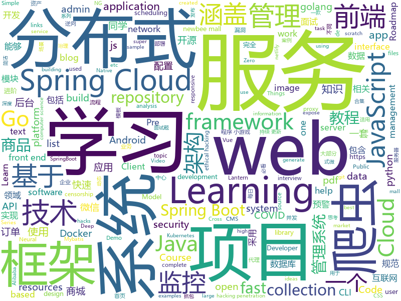

# 2020-03-12
See what the GitHub community is most excited about.

## python
+ [electra](https://github.com/google-research/electra)(**134 stars today**): ELECTRA: Pre-training Text Encoders as Discriminators Rather Than Generators
+ [Middleware-Vulnerability-detection](https://github.com/mai-lang-chai/Middleware-Vulnerability-detection)(**47 stars today**): CVE、CMS、中间件漏洞检测利用合集 Since 2019-9-15
+ [system-design-primer](https://github.com/donnemartin/system-design-primer)(**148 stars today**): Learn how to design large-scale systems. Prep for the system design interview. Includes Anki flashcards.
+ [bayonet](https://github.com/CTF-MissFeng/bayonet)(**45 stars today**): bayonet是一款src资产管理系统，从子域名、端口服务、漏洞、爬虫等一体化的资产管理系统
+ [DVQA](https://github.com/Tencent/DVQA)(**22 stars today**): Deep learning-based Video Quality Assessment
+ [mindsdb](https://github.com/mindsdb/mindsdb)(**16 stars today**): Machine Learning in one line of code
+ [quantum](https://github.com/tensorflow/quantum)(**141 stars today**): Hybrid Quantum-Classical Machine Learning in TensorFlow
+ [transferlearning](https://github.com/jindongwang/transferlearning)(**9 stars today**): Everything about Transfer Learning and Domain Adaptation--迁移学习
+ [DeepFaceLab](https://github.com/iperov/DeepFaceLab)(**32 stars today**): DeepFaceLab is the leading software for creating deepfakes.
+ [learn_python3_spider](https://github.com/wistbean/learn_python3_spider)(**22 stars today**): python爬虫教程系列、从0到1学习python爬虫，包括浏览器抓包，手机APP抓包，如 fiddler、mitmproxy，各种爬虫涉及的模块的使用，如：requests、beautifulSoup、selenium、appium、scrapy等，以及IP代理，验证码识别，Mysql，MongoDB数据库的python使用，多线程多进程爬虫的使用，css 爬虫加密逆向破解，JS爬虫逆向，分布式爬虫，爬虫项目实战实例等
+ [fuzzDicts](https://github.com/TheKingOfDuck/fuzzDicts)(**79 stars today**): Web Pentesting Fuzz 字典,一个就够了。
+ [unilm](https://github.com/microsoft/unilm)(**42 stars today**): UniLM - Unified Language Model Pre-training
+ [bert](https://github.com/google-research/bert)(**36 stars today**): TensorFlow code and pre-trained models for BERT
+ [simclr](https://github.com/google-research/simclr)(**77 stars today**): SimCLR - A Simple Framework for Contrastive Learning of Visual Representations
+ [pyxelate](https://github.com/sedthh/pyxelate)(**143 stars today**): Python class that downsamples images to pixel art.
+ [manim](https://github.com/3b1b/manim)(**115 stars today**): Animation engine for explanatory math videos
+ [CS224n-winter-together](https://github.com/xixiaoyao/CS224n-winter-together)(**4 stars today**): an Open Course Platform for Stanford CS224n (2020 Winter)
+ [evolutionary-neural-network-autonomous-car](https://github.com/xgnit/evolutionary-neural-network-autonomous-car)(**27 stars today**): A self learning autonomous vehicle based on NEAT(evolutioniary neural network)
+ [Redcloud](https://github.com/khast3x/Redcloud)(**31 stars today**): Automated Red Team Infrastructure deployement using Docker
+ [SinGAN](https://github.com/tamarott/SinGAN)(**8 stars today**): Official pytorch implementation of the paper: "SinGAN: Learning a Generative Model from a Single Natural Image"
+ [lihang_book_algorithm](https://github.com/WenDesi/lihang_book_algorithm)(**10 stars today**): 致力于将李航博士《统计学习方法》一书中所有算法实现一遍
+ [covid-19](https://github.com/datasets/covid-19)(**4 stars today**): Novel Coronavirus 2019
+ [diagrams](https://github.com/mingrammer/diagrams)(**21 stars today**): 🎨Diagram as Code for prototyping cloud system architectures
+ [cloudflare-vpn-for-desktop](https://github.com/cyberman219/cloudflare-vpn-for-desktop)(**6 stars today**): This repository is to help you to get Cloudflare VPN WARP+ 1.1.1.1 on your Desktop
+ [CheatSheetSeries](https://github.com/OWASP/CheatSheetSeries)(**12 stars today**): The OWASP Cheat Sheet Series was created to provide a concise collection of high value information on specific application security topics.

## java
+ [advanced-java](https://github.com/doocs/advanced-java)(**131 stars today**): 😮互联网 Java 工程师进阶知识完全扫盲：涵盖高并发、分布式、高可用、微服务、海量数据处理等领域知识，后端同学必看，前端同学也可学习
+ [java-design-patterns](https://github.com/iluwatar/java-design-patterns)(**62 stars today**): Design patterns implemented in Java
+ [cim](https://github.com/crossoverJie/cim)(**6 stars today**): 📲cim(cross IM) 适用于开发者的分布式即时通讯系统
+ [newbee-mall](https://github.com/newbee-ltd/newbee-mall)(**15 stars today**): newbee-mall 项目（新蜂商城）是一套电商系统，包括 newbee-mall 商城系统及 newbee-mall-admin 商城后台管理系统，基于 Spring Boot 2.X 及相关技术栈开发。 前台商城系统包含首页门户、商品分类、新品上线、首页轮播、商品推荐、商品搜索、商品展示、购物车、订单结算、订单流程、个人订单管理、会员中心、帮助中心等模块。 后台管理系统包含数据面板、轮播图管理、商品管理、订单管理、会员管理、分类管理、设置等模块。
+ [spring-boot-api-project-seed](https://github.com/lihengming/spring-boot-api-project-seed)(**82 stars today**): 🌱🚀一个基于Spring Boot & MyBatis的种子项目，用于快速构建中小型API、RESTful API项目~
+ [Algorithms](https://github.com/williamfiset/Algorithms)(**25 stars today**): A collection of algorithms and data structures
+ [hutool](https://github.com/looly/hutool)(**102 stars today**): A set of tools that keep Java sweet.
+ [halo](https://github.com/halo-dev/halo)(**94 stars today**): ✍ An excellent open source blog publishing application. | 一个优秀的开源博客发布应用。
+ [spring-cloud-examples](https://github.com/ityouknow/spring-cloud-examples)(**5 stars today**): Spring Cloud 学习案例，服务发现、服务治理、链路追踪、服务监控等
+ [tech-interview-for-developer](https://github.com/gyoogle/tech-interview-for-developer)(**19 stars today**): 👶🏻 신입 개발자 전공 지식 & 기술 면접 백과사전📖
+ [FEBS-Cloud](https://github.com/wuyouzhuguli/FEBS-Cloud)(**3 stars today**): 基于Spring Cloud Hoxton.RELEASE、Spring Cloud OAuth2 & Spring Cloud Alibaba & Element 构建的微服务权限管理系统。系统特点：前后端分离、认证/资源服务器分离、RBAC模型、第三方账号登录、多维度监控（Prometheus APM：Docker容器监控，MySQL监控、微服务JVM监控、Redis监控）、服务预警（邮件预警，企业微信预警）、Skywalking服务追踪、ELK日志系统、Nacos集中管理配置和服务、Sentinel流控、动态Client管理、支持多种格式令牌、K8S部署、分布式事务、注解驱动、代码生成、Excel导入导出等。预览地址：https://cloud.mrbird.cn
+ [android-developer-roadmap](https://github.com/MindorksOpenSource/android-developer-roadmap)(**5 stars today**): Android Developer Roadmap - A complete roadmap to learn Android App Development
+ [spring-boot-examples](https://github.com/ityouknow/spring-boot-examples)(**27 stars today**): about learning Spring Boot via examples. Spring Boot 教程、技术栈示例代码，快速简单上手教程。
+ [user-interface-samples](https://github.com/android/user-interface-samples)(**7 stars today**): Multiple samples showing the best practices in the user interface on Android.
+ [mall-learning](https://github.com/macrozheng/mall-learning)(**20 stars today**): mall学习教程，架构、业务、技术要点全方位解析。mall项目（25k+star）是一套电商系统，使用现阶段主流技术实现。 涵盖了SpringBoot2.1.3、MyBatis3.4.6、Elasticsearch6.2.2、RabbitMQ3.7.15、Redis3.2、Mongodb3.2、Mysql5.7等技术，采用Docker容器化部署。
+ [xxl-job](https://github.com/xuxueli/xxl-job)(**30 stars today**): A distributed task scheduling framework.（分布式任务调度平台XXL-JOB）
+ [tutorials](https://github.com/eugenp/tutorials)(**21 stars today**): Just Announced - "Learn Spring Security OAuth":
+ [apollo](https://github.com/ctripcorp/apollo)(**19 stars today**): Apollo（阿波罗）是携程框架部门研发的分布式配置中心，能够集中化管理应用不同环境、不同集群的配置，配置修改后能够实时推送到应用端，并且具备规范的权限、流程治理等特性，适用于微服务配置管理场景。
+ [JiaoZiVideoPlayer](https://github.com/Jzvd/JiaoZiVideoPlayer)(**11 stars today**): 高度自定义的安卓视频框架
+ [red5-server](https://github.com/Red5/red5-server)(**2 stars today**): Red5 Server core
+ [SpringBlade](https://github.com/chillzhuang/SpringBlade)(**23 stars today**): SpringBlade 是一个由商业级项目升级优化而来的SpringCloud分布式微服务架构、SpringBoot单体式微服务架构并存的综合型项目，采用Java8 API重构了业务代码，完全遵循阿里巴巴编码规范。采用Spring Boot 2 、Spring Cloud Hoxton 、Mybatis 等核心技术，同时提供基于React和Vue的两个前端框架用于快速搭建企业级的SaaS多租户微服务平台。 官网：https://bladex.vip
+ [AndroidTutorialForBeginners](https://github.com/hussien89aa/AndroidTutorialForBeginners)(**5 stars today**): Step by step to build Android apps using Android Studio
+ [springcloud-learning](https://github.com/macrozheng/springcloud-learning)(**13 stars today**): 一套涵盖大部分核心组件使用的Spring Cloud教程，包括Spring Cloud Alibaba及分布式事务Seata，基于Spring Cloud Greenwich及SpringBoot 2.1.7。20篇文章，篇篇精华，30个Demo，涵盖大部分应用场景。
+ [h2database](https://github.com/h2database/h2database)(**4 stars today**): H2 is an embeddable RDBMS written in Java.
+ [DataSphereStudio](https://github.com/WeBankFinTech/DataSphereStudio)(**6 stars today**): DataSphereStudio is a one stop data application development& management portal, covering scenarios including data exchange, desensitization/cleansing, analysis/mining, quality measurement, visualization, and task scheduling.

## unknown
+ [COVID-19](https://github.com/pcm-dpc/COVID-19)(**340 stars today**): COVID-19 Italia - Monitoraggio situazione
+ [COVID-19](https://github.com/CSSEGISandData/COVID-19)(**658 stars today**): Novel Coronavirus (COVID-19) Cases, provided by JHU CSSE
+ [stylegan2-distillation](https://github.com/EvgenyKashin/stylegan2-distillation)(**88 stars today**): 
+ [ultimate-coding-resources](https://github.com/PizzaPokerGuy/ultimate-coding-resources)(**235 stars today**): A collection of the best resources for programming, web development, computer science and more.
+ [PENTESTING-BIBLE](https://github.com/blaCCkHatHacEEkr/PENTESTING-BIBLE)(**23 stars today**): This repository was created and developed by Ammar Amer @cry__pto Only. Updates to this repository will continue to arrive until the number of links reaches 10000 links & 10000 pdf files .Learn Ethical Hacking and penetration testing .hundreds of ethical hacking & penetration testing & red team & cyber security & computer science resources.
+ [CVPR2020-Code](https://github.com/amusi/CVPR2020-Code)(**129 stars today**): CVPR 2020 论文开源项目合集
+ [wuhan2020-timeline](https://github.com/Pratitya/wuhan2020-timeline)(**32 stars today**): 以 社会学年鉴模式体例规范地统编自2019年12月起武汉新冠肺炎疫情进展的时间线。
+ [stayinghomeclub](https://github.com/phildini/stayinghomeclub)(**53 stars today**): A list of all the companies WFH or events changed because of covid-19
+ [Wall-Street-Bets-Master-Doc](https://github.com/joesocktwo/Wall-Street-Bets-Master-Doc)(**15 stars today**): This repository is intended for research pertaining to the repo market and the international banking system. It is to be used for analysis by the autists of WSB.
+ [acwa_book_ru](https://github.com/adelf/acwa_book_ru)(**8 stars today**): Книга "Архитектура сложных веб-приложений. С примерами на Laravel"
+ [app-ideas](https://github.com/florinpop17/app-ideas)(**83 stars today**): A Collection of application ideas which can be used to improve your coding skills.
+ [awesome-public-datasets](https://github.com/awesomedata/awesome-public-datasets)(**27 stars today**): A topic-centric list of HQ open datasets.
+ [JavaFamily](https://github.com/AobingJava/JavaFamily)(**257 stars today**): 【互联网一线大厂面试+学习指南】进阶知识完全扫盲：涵盖高并发、分布式、高可用、微服务等领域知识，作者风格幽默，看起来津津有味，把学习当做一种乐趣，何乐而不为，后端同学必看，前端同学我保证你也看得懂，看不懂你加我微信骂我渣男就好了。
+ [awesome-macos-command-line](https://github.com/herrbischoff/awesome-macos-command-line)(**101 stars today**): Use your macOS terminal shell to do awesome things.
+ [technology-talk](https://github.com/aalansehaiyang/technology-talk)(**102 stars today**): 汇总java生态圈常用技术框架、开源中间件，系统架构、数据库、大公司架构案例、常用三方类库、项目管理、线上问题排查、个人成长、思考等知识
+ [covid-19-messaging](https://github.com/marialma/covid-19-messaging)(**25 stars today**): Translation of basic messaging around COVID-19 for diverse groups
+ [reverse-interview](https://github.com/viraptor/reverse-interview)(**115 stars today**): Questions to ask the company during your interview
+ [roadmap](https://github.com/docker/roadmap)(**41 stars today**): Welcome to the Public Roadmap for All Things Docker! We welcome your ideas.
+ [why-svelte](https://github.com/feltcoop/why-svelte)(**149 stars today**): Why Svelte is our choice for a large web project in 2020
+ [CVE-2020-1947](https://github.com/Imanfeng/CVE-2020-1947)(**23 stars today**): CVE-2020-1947 poc
+ [architecture_decision_record](https://github.com/joelparkerhenderson/architecture_decision_record)(**27 stars today**): Architecture decision record (ADR) examples for software planning, IT leadership, and template documenation
+ [the-book-of-secret-knowledge](https://github.com/trimstray/the-book-of-secret-knowledge)(**34 stars today**): A collection of inspiring lists, manuals, cheatsheets, blogs, hacks, one-liners, cli/web tools and more.
+ [AZ-103-MicrosoftAzureAdministrator](https://github.com/MicrosoftLearning/AZ-103-MicrosoftAzureAdministrator)(**4 stars today**): AZ-103: Microsoft Azure Administrator
+ [statrethinking_winter2019](https://github.com/rmcelreath/statrethinking_winter2019)(**14 stars today**): Statistical Rethinking course at MPI-EVA from Dec 2018 through Feb 2019
+ [Qure](https://github.com/Koolson/Qure)(**9 stars today**): Quantumult X Policy Icon Set

## javascript
+ [redwood](https://github.com/redwoodjs/redwood)(**530 stars today**): Bringing full-stack to the JAMstack.
+ [covid19italia](https://github.com/emergenzeHack/covid19italia)(**8 stars today**): Condividiamo informazioni e segnalazioni sul COVID19
+ [universal-data-tool](https://github.com/UniversalDataTool/universal-data-tool)(**122 stars today**): Collaborate & label any type of data, images, text, or documents, in an easy web interface or desktop app.
+ [vuex](https://github.com/vuejs/vuex)(**16 stars today**): 🗃️Centralized State Management for Vue.js.
+ [layuimini](https://github.com/zhongshaofa/layuimini)(**12 stars today**): 后台admin前端模板，基于 layui 编写的最简洁、易用的后台框架模板。只需提供一个接口就直接初始化整个框架，无需复杂操作。
+ [cube.js](https://github.com/cube-js/cube.js)(**11 stars today**): 📊Cube.js - Open Source Analytics Framework
+ [o2oa](https://github.com/o2oa/o2oa)(**15 stars today**): O2OA - Java企业信息化系统
+ [react](https://github.com/facebook/react)(**80 stars today**): A declarative, efficient, and flexible JavaScript library for building user interfaces.
+ [WeApp_Demos](https://github.com/Data-Camp/WeApp_Demos)(**5 stars today**): 持续更新中的微信小程序和小游戏的源码案例库。目前涵盖了120多个微信小程序或小游戏。
+ [fe-interview](https://github.com/haizlin/fe-interview)(**83 stars today**): 前端面试每日 3+1，以面试题来驱动学习，提倡每日学习与思考，每天进步一点！每天早上5点纯手工发布面试题（死磕自己，愉悦大家）
+ [tiktok-scraper](https://github.com/drawrowfly/tiktok-scraper)(**3 stars today**): TikTok Scraper & Downloader. Scrape information from User, Trending and HashTag pages and download video posts
+ [server](https://github.com/localtunnel/server)(**7 stars today**): server for localtunnel.me
+ [sulla](https://github.com/smashah/sulla)(**3 stars today**): 💬🤖Javascript whatsapp library for chatbots with advanced features. Be sure to🌟this repository for updates!
+ [openlayers](https://github.com/openlayers/openlayers)(**7 stars today**): OpenLayers
+ [x-spreadsheet](https://github.com/myliang/x-spreadsheet)(**109 stars today**): A web-based JavaScript（canvas） spreadsheet
+ [30-seconds-of-code](https://github.com/30-seconds/30-seconds-of-code)(**21 stars today**): Short JavaScript code snippets for all your development needs
+ [ife](https://github.com/baidu-ife/ife)(**5 stars today**): Baidu Institute of Front－End Technology
+ [DOMPurify](https://github.com/cure53/DOMPurify)(**13 stars today**): DOMPurify - a DOM-only, super-fast, uber-tolerant XSS sanitizer for HTML, MathML and SVG. DOMPurify works with a secure default, but offers a lot of configurability and hooks. Demo:
+ [react-table](https://github.com/tannerlinsley/react-table)(**245 stars today**): ⚛️Hooks for building fast and extendable tables and datagrids for React
+ [Historical-ranking-data-visualization-based-on-d3.js](https://github.com/Jannchie/Historical-ranking-data-visualization-based-on-d3.js)(**5 stars today**): 这是一个数据可视化项目，能够将历史数据排名转化为动态柱状图图表
+ [jsPDF](https://github.com/MrRio/jsPDF)(**14 stars today**): Client-side JavaScript PDF generation for everyone.
+ [keystone](https://github.com/keystonejs/keystone)(**14 stars today**): A scalable platform and CMS to build Node.js applications
+ [sweetalert2](https://github.com/sweetalert2/sweetalert2)(**10 stars today**): A beautiful, responsive, highly customizable and accessible (WAI-ARIA) replacement for JavaScript's popup boxes. Zero dependencies.
+ [nCovMemory](https://github.com/2019ncovmemory/nCovMemory)(**55 stars today**): 2020新冠肺炎记忆：报道、非虚构与个人叙述（持续更新） Memory of 2020 nCoV: Media Coverage, Non-fiction Writings, and Individual Narratives (Continuously updating)
+ [insomnia](https://github.com/Kong/insomnia)(**12 stars today**): Cross-platform HTTP and GraphQL Client

## html
+ [photo-stream](https://github.com/maxvoltar/photo-stream)(**503 stars today**): Self-hosted, super simple photo stream
+ [nndl.github.io](https://github.com/nndl/nndl.github.io)(**56 stars today**): 《神经网络与深度学习》 邱锡鹏著 Neural Network and Deep Learning
+ [224-animated-css-grid](https://github.com/fireship-io/224-animated-css-grid)(**12 stars today**): Episode 224 - Build Three CSS Grid Layouts from Scratch
+ [webKnowledge](https://github.com/huyaocode/webKnowledge)(**16 stars today**): 前端面试知识点总结
+ [calico](https://github.com/projectcalico/calico)(**4 stars today**): Cloud native networking and network security
+ [CloudComparer](https://github.com/ilyas-it83/CloudComparer)(**2 stars today**): Compare the various managed cloud services offered by the major public cloud providers in the market.
+ [url-shortener](https://github.com/WebDevSimplified/url-shortener)(**3 stars today**): 
+ [pcc_2e](https://github.com/ehmatthes/pcc_2e)(**3 stars today**): Online resources for Python Crash Course (Second Edition), from No Starch Press
+ [Awesome-CS-Books](https://github.com/wx-chevalier/Awesome-CS-Books)(**17 stars today**): 📚Awesome CS Books/Series(.pdf by git lfs) Warehouse for Geeks, ProgrammingLanguage, SoftwareEngineering, Web, AI, ServerSideApplication, Infrastructure, FE etc.💫优秀计算机科学与技术领域相关的书籍归档。
+ [web-engineering-tuwien.github.io](https://github.com/web-engineering-tuwien/web-engineering-tuwien.github.io)(**0 stars today**): Course website
+ [hyperblog](https://github.com/freddier/hyperblog)(**6 stars today**): Un blog increíble para el curso de Git y Github de Platzi
+ [technical-books](https://github.com/doocs/technical-books)(**11 stars today**): 😆国内外互联网技术大牛们都写了哪些书籍：计算机基础、网络、前端、后端、数据库、架构、大数据、深度学习...
+ [ng-alain](https://github.com/ng-alain/ng-alain)(**2 stars today**): NG-ZORRO admin panel front-end framework (netlify mirror https://netlify.ng-alain.com/)
+ [vs-covid19](https://github.com/codeforjapan/vs-covid19)(**6 stars today**): 
+ [java](https://github.com/bjmashibing/java)(**2 stars today**): 
+ [foundation-emails](https://github.com/foundation/foundation-emails)(**1 stars today**): Quickly create responsive HTML emails that work on any device and client. Even Outlook.
+ [fastText](https://github.com/facebookresearch/fastText)(**2 stars today**): Library for fast text representation and classification.
+ [personal-website](https://github.com/github/personal-website)(**4 stars today**): Code that'll help you kickstart a personal website that showcases your work as a software developer.
+ [chart-doctor](https://github.com/ft-interactive/chart-doctor)(**3 stars today**): Sample files to accompany the FT's Chart Doctor column
+ [Front-end-Developer-Interview-Questions](https://github.com/h5bp/Front-end-Developer-Interview-Questions)(**11 stars today**): A list of helpful front-end related questions you can use to interview potential candidates, test yourself or completely ignore.
+ [complete-web-developer-manual](https://github.com/zero-to-mastery/complete-web-developer-manual)(**2 stars today**): All resources and notes from the Complete Web Developer in 2018: Zero to Mastery course
+ [sveltestrap](https://github.com/bestguy/sveltestrap)(**1 stars today**): Bootstrap 4 components for Svelte
+ [covid_pt](https://github.com/aperaltasantos/covid_pt)(**3 stars today**): COVID-19 em Portugal
+ [hermit](https://github.com/Track3/hermit)(**1 stars today**): A minimal & fast Hugo theme for bloggers
+ [ASVS](https://github.com/OWASP/ASVS)(**2 stars today**): Application Security Verification Standard

## go
+ [7days-golang](https://github.com/geektutu/7days-golang)(**186 stars today**): 7 days golang apps from scratch (web framework Gee, distributed cache GeeCache, object relational mapping ORM framework GeeORM etc) 7天用Go动手写/从零实现系列
+ [build-web-application-with-golang](https://github.com/astaxie/build-web-application-with-golang)(**17 stars today**): A golang ebook intro how to build a web with golang
+ [kubernetes](https://github.com/kubernetes/kubernetes)(**45 stars today**): Production-Grade Container Scheduling and Management
+ [terraform-provider-aws](https://github.com/terraform-providers/terraform-provider-aws)(**13 stars today**): Terraform AWS provider
+ [minio](https://github.com/minio/minio)(**31 stars today**): MinIO is a high performance object storage server compatible with Amazon S3 APIs
+ [crawlab](https://github.com/crawlab-team/crawlab)(**40 stars today**): Distributed web crawler admin platform for spiders management regardless of languages and frameworks.
+ [community](https://github.com/kubernetes/community)(**10 stars today**): Kubernetes community content
+ [cameradar](https://github.com/Ullaakut/cameradar)(**5 stars today**): Cameradar hacks its way into RTSP videosurveillance cameras
+ [learning_tools](https://github.com/hwholiday/learning_tools)(**6 stars today**): Go 学习、Go 进阶、Go 实用工具类、Go-kit 微服务实践
+ [beats](https://github.com/elastic/beats)(**9 stars today**): 🐠Beats - Lightweight shippers for Elasticsearch & Logstash
+ [frp](https://github.com/fatedier/frp)(**65 stars today**): A fast reverse proxy to help you expose a local server behind a NAT or firewall to the internet.
+ [cobra](https://github.com/spf13/cobra)(**22 stars today**): A Commander for modern Go CLI interactions
+ [mqant](https://github.com/liangdas/mqant)(**5 stars today**): mqant是一款基于Golang语言的简洁,高效,高性能的分布式游戏服务器框架
+ [lantern](https://github.com/getlantern/lantern)(**44 stars today**): Lantern官方版本下载 蓝灯 翻墙 代理 科学上网 外网 加速器 梯子 路由 lantern proxy vpn censorship-circumvention censorship gfw accelerator
+ [gopacket](https://github.com/google/gopacket)(**3 stars today**): Provides packet processing capabilities for Go
+ [kratos](https://github.com/bilibili/kratos)(**14 stars today**): Kratos是bilibili开源的一套Go微服务框架，包含大量微服务相关框架及工具。
+ [kube-state-metrics](https://github.com/kubernetes/kube-state-metrics)(**6 stars today**): Add-on agent to generate and expose cluster-level metrics.
+ [soar](https://github.com/XiaoMi/soar)(**16 stars today**): SQL Optimizer And Rewriter
+ [charts](https://github.com/helm/charts)(**19 stars today**): Curated applications for Kubernetes
+ [singo](https://github.com/Gourouting/singo)(**3 stars today**): Gin+Gorm开发Golang API快速开发脚手架
+ [traefik](https://github.com/containous/traefik)(**13 stars today**): The Cloud Native Edge Router
+ [os](https://github.com/rancher/os)(**4 stars today**): Tiny Linux distro that runs the entire OS as Docker containers
+ [tg-keyword-reply-bot](https://github.com/zu1k/tg-keyword-reply-bot)(**3 stars today**): telegram 关键词回复机器人，群主助手
+ [k9s](https://github.com/derailed/k9s)(**29 stars today**): 🐶Kubernetes CLI To Manage Your Clusters In Style!
+ [reporter](https://github.com/IzakMarais/reporter)(**3 stars today**): Service that generates a PDF report from a Grafana dashboard

## WordCloud

