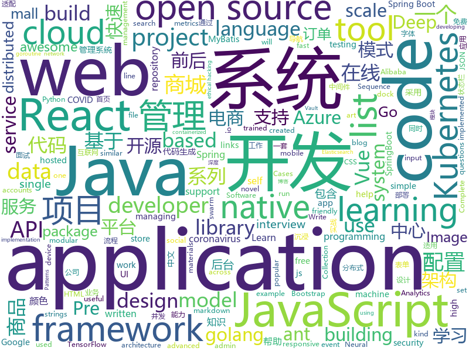

# 2020-03-13
See what the GitHub community is most excited about.

## python
+ [SMBGhost](https://github.com/ollypwn/SMBGhost)(**139 stars today**): Scanner for CVE-2020-0796 - SMBv3 RCE
+ [big-list-of-naughty-strings](https://github.com/minimaxir/big-list-of-naughty-strings)(**83 stars today**): The Big List of Naughty Strings is a list of strings which have a high probability of causing issues when used as user-input data.
+ [electra](https://github.com/google-research/electra)(**89 stars today**): ELECTRA: Pre-training Text Encoders as Discriminators Rather Than Generators
+ [coronavirus-tracker-api](https://github.com/ExpDev07/coronavirus-tracker-api)(**41 stars today**): 🦠 A simple and fast (< 200ms) API for tracking the global coronavirus (COVID-19, SARS-CoV-2) outbreak. It's written in python using the🍼Flask framework.
+ [sherlock](https://github.com/sherlock-project/sherlock)(**20 stars today**): 🔎Hunt down social media accounts by username across social networks
+ [pyxelate](https://github.com/sedthh/pyxelate)(**26 stars today**): Python class that downsamples images to pixel art.
+ [system-design-primer](https://github.com/donnemartin/system-design-primer)(**135 stars today**): Learn how to design large-scale systems. Prep for the system design interview. Includes Anki flashcards.
+ [compose](https://github.com/docker/compose)(**20 stars today**): Define and run multi-container applications with Docker
+ [models](https://github.com/tensorflow/models)(**44 stars today**): Models and examples built with TensorFlow
+ [DeepCTR](https://github.com/shenweichen/DeepCTR)(**8 stars today**): Easy-to-use,Modular and Extendible package of deep-learning based CTR models.
+ [coronavirus](https://github.com/FoldingAtHome/coronavirus)(**21 stars today**): Folding@home COVID-19 efforts
+ [cve-2020-0796](https://github.com/cve-2020-0796/cve-2020-0796)(**50 stars today**): CVE-2020-0796 - a wormable SMBv3 vulnerability. How to work.
+ [bert](https://github.com/google-research/bert)(**44 stars today**): TensorFlow code and pre-trained models for BERT
+ [pandasvault](https://github.com/firmai/pandasvault)(**45 stars today**): Advanced Pandas Vault — Utilities, Functions and Snippets.
+ [DVQA](https://github.com/Tencent/DVQA)(**44 stars today**): Deep learning-based Video Quality Assessment
+ [Middleware-Vulnerability-detection](https://github.com/mai-lang-chai/Middleware-Vulnerability-detection)(**35 stars today**): CVE、CMS、中间件漏洞检测利用合集 Since 2019-9-15
+ [fairseq](https://github.com/pytorch/fairseq)(**13 stars today**): Facebook AI Research Sequence-to-Sequence Toolkit written in Python.
+ [pytorch-lightning](https://github.com/PyTorchLightning/pytorch-lightning)(**17 stars today**): The lightweight PyTorch wrapper for ML researchers. Scale your models. Write less boilerplate
+ [mindsdb](https://github.com/mindsdb/mindsdb)(**26 stars today**): Machine Learning in one line of code
+ [nni](https://github.com/microsoft/nni)(**16 stars today**): An open source AutoML toolkit for automate machine learning lifecycle, including feature engineering, neural architecture search, model compression and hyper-parameter tuning.
+ [pre-commit](https://github.com/pre-commit/pre-commit)(**17 stars today**): A framework for managing and maintaining multi-language pre-commit hooks.
+ [pytorch-CycleGAN-and-pix2pix](https://github.com/junyanz/pytorch-CycleGAN-and-pix2pix)(**16 stars today**): Image-to-Image Translation in PyTorch
+ [KubeOperator](https://github.com/KubeOperator/KubeOperator)(**13 stars today**): KubeOperator 是一个开源项目，通过 Web UI 在 VMware、OpenStack 和物理机上规划、部署和运营生产级别的 Kubernetes 集群。支持内网离线环境、支持 GPU、应用商店，已通过 CNCF 的 Kubernetes 软件一致性认证。
+ [models](https://github.com/PaddlePaddle/models)(**13 stars today**): Pre-trained and Reproduced Deep Learning Models （『飞桨』官方模型库，包含多种学术前沿和工业场景验证的深度学习模型）
+ [transformers](https://github.com/huggingface/transformers)(**60 stars today**): 🤗Transformers: State-of-the-art Natural Language Processing for TensorFlow 2.0 and PyTorch.

## java
+ [advanced-java](https://github.com/doocs/advanced-java)(**196 stars today**): 😮互联网 Java 工程师进阶知识完全扫盲：涵盖高并发、分布式、高可用、微服务、海量数据处理等领域知识，后端同学必看，前端同学也可学习
+ [halo](https://github.com/halo-dev/halo)(**106 stars today**): ✍ An excellent open source blog publishing application. | 一个优秀的开源博客发布应用。
+ [tutorials](https://github.com/eugenp/tutorials)(**24 stars today**): Just Announced - "Learn Spring Security OAuth":
+ [spring-boot-api-project-seed](https://github.com/lihengming/spring-boot-api-project-seed)(**24 stars today**): 🌱🚀一个基于Spring Boot & MyBatis的种子项目，用于快速构建中小型API、RESTful API项目~
+ [java-design-patterns](https://github.com/iluwatar/java-design-patterns)(**110 stars today**): Design patterns implemented in Java
+ [hutool](https://github.com/looly/hutool)(**82 stars today**): A set of tools that keep Java sweet.
+ [cim](https://github.com/crossoverJie/cim)(**10 stars today**): 📲cim(cross IM) 适用于开发者的分布式即时通讯系统
+ [react-native-camera](https://github.com/react-native-community/react-native-camera)(**4 stars today**): A Camera component for React Native. Also supports barcode scanning!
+ [canal](https://github.com/alibaba/canal)(**33 stars today**): 阿里巴巴 MySQL binlog 增量订阅&消费组件
+ [bigbluebutton](https://github.com/bigbluebutton/bigbluebutton)(**10 stars today**): Complete open source web conferencing system.
+ [Algorithms](https://github.com/williamfiset/Algorithms)(**28 stars today**): A collection of algorithms and data structures
+ [ImmersionBar](https://github.com/gyf-dev/ImmersionBar)(**19 stars today**): android 4.4以上沉浸式状态栏和沉浸式导航栏管理，适配横竖屏切换、刘海屏、软键盘弹出等问题，可以修改状态栏字体颜色和导航栏图标颜色，以及不可修改字体颜色手机的适配，适用于Activity、Fragment、DialogFragment、Dialog，PopupWindow，一句代码轻松实现，以及对bar的其他设置，详见README。简书请参考：http://www.jianshu.com/p/2a884e211a62
+ [mall-swarm](https://github.com/macrozheng/mall-swarm)(**29 stars today**): mall-swarm是一套微服务商城系统，采用了 Spring Cloud Greenwich、Spring Boot 2、MyBatis、Docker、Elasticsearch等核心技术，同时提供了基于Vue的管理后台方便快速搭建系统。mall-swarm在电商业务的基础集成了注册中心、配置中心、监控中心、网关等系统功能。文档齐全，附带全套Spring Cloud教程。
+ [arthas](https://github.com/alibaba/arthas)(**22 stars today**): Alibaba Java Diagnostic Tool Arthas/Alibaba Java诊断利器Arthas
+ [newbee-mall](https://github.com/newbee-ltd/newbee-mall)(**17 stars today**): newbee-mall 项目（新蜂商城）是一套电商系统，包括 newbee-mall 商城系统及 newbee-mall-admin 商城后台管理系统，基于 Spring Boot 2.X 及相关技术栈开发。 前台商城系统包含首页门户、商品分类、新品上线、首页轮播、商品推荐、商品搜索、商品展示、购物车、订单结算、订单流程、个人订单管理、会员中心、帮助中心等模块。 后台管理系统包含数据面板、轮播图管理、商品管理、订单管理、会员管理、分类管理、设置等模块。
+ [micronaut-core](https://github.com/micronaut-projects/micronaut-core)(**4 stars today**): Micronaut Application Framework
+ [jackson-databind](https://github.com/FasterXML/jackson-databind)(**4 stars today**): General data-binding package for Jackson (2.x): works on streaming API (core) implementation(s)
+ [Android-PickerView](https://github.com/Bigkoo/Android-PickerView)(**10 stars today**): This is a picker view for android , support linkage effect, timepicker and optionspicker.（时间选择器、省市区三级联动）
+ [vhr](https://github.com/lenve/vhr)(**45 stars today**): 微人事是一个前后端分离的人力资源管理系统，项目采用SpringBoot+Vue开发。
+ [flink](https://github.com/apache/flink)(**11 stars today**): Apache Flink
+ [micrometer](https://github.com/micrometer-metrics/micrometer)(**2 stars today**): An application metrics facade for the most popular monitoring tools. Think SLF4J, but for metrics.
+ [react-native-image-picker](https://github.com/react-native-community/react-native-image-picker)(**13 stars today**): 🌄A React Native module that allows you to use native UI to select media from the device library or directly from the camera.
+ [gpmall](https://github.com/2227324689/gpmall)(**6 stars today**): 【咕泡学院实战项目】-基于SpringBoot+Dubbo构建的电商平台-微服务架构、商城、电商、微服务、高并发、kafka、Elasticsearch
+ [jeecg-boot](https://github.com/zhangdaiscott/jeecg-boot)(**24 stars today**): 一款基于代码生成器的JAVA快速开发平台，开源界“小普元”超越传统商业企业级开发平台！采用前后端分离架构：SpringBoot 2.x，Ant Design&Vue，Mybatis-plus，Shiro，JWT。强大的代码生成器让前后端代码一键生成，无需写任何代码! 引领新的开发模式(OnlineCoding模式-> 代码生成器模式-> 手工MERGE智能开发)，帮助Java项目解决70%的重复工作，让开发更多关注业务逻辑。既能快速提高开发效率，帮助公司节省成本，同时又不失灵活性。JeecgBoot还独创在线开发模式（No代码）：在线表单配置（表单设计器）、移动配置能力、在线工作流配置（流程设计器）、在线报表配置、在线图表配置、插件能力（可插拔）等等
+ [checkstyle](https://github.com/checkstyle/checkstyle)(**6 stars today**): Checkstyle is a development tool to help programmers write Java code that adheres to a coding standard. By default it supports the Google Java Style Guide and Sun Code Conventions, but is highly configurable. It can be invoked with an ANT task and a command line program.

## unknown
+ [COVID-19](https://github.com/CSSEGISandData/COVID-19)(**689 stars today**): Novel Coronavirus (COVID-19) Cases, provided by JHU CSSE
+ [technology-talk](https://github.com/aalansehaiyang/technology-talk)(**270 stars today**): 汇总java生态圈常用技术框架、开源中间件，系统架构、数据库、大公司架构案例、常用三方类库、项目管理、线上问题排查、个人成长、思考等知识
+ [awesome-macos-command-line](https://github.com/herrbischoff/awesome-macos-command-line)(**137 stars today**): Use your macOS terminal shell to do awesome things.
+ [awesome](https://github.com/sindresorhus/awesome)(**383 stars today**): 😎Awesome lists about all kinds of interesting topics
+ [stylegan2-distillation](https://github.com/EvgenyKashin/stylegan2-distillation)(**127 stars today**): 
+ [COVID-19](https://github.com/pcm-dpc/COVID-19)(**359 stars today**): COVID-19 Italia - Monitoraggio situazione
+ [javascript-questions](https://github.com/lydiahallie/javascript-questions)(**187 stars today**): A long list of (advanced) JavaScript questions, and their explanations✨
+ [awesome-azure-learning](https://github.com/ddneves/awesome-azure-learning)(**28 stars today**): This repo includes plenty of references for Azure learning, especially for the Azure certs and Azure architecture, and any other learning materials e.g. security and automation topics.
+ [awesome-for-beginners](https://github.com/MunGell/awesome-for-beginners)(**109 stars today**): A list of awesome beginners-friendly projects.
+ [free-programming-books](https://github.com/EbookFoundation/free-programming-books)(**187 stars today**): 📚Freely available programming books
+ [developer-roadmap](https://github.com/kamranahmedse/developer-roadmap)(**82 stars today**): Roadmap to becoming a web developer in 2020
+ [reverse-interview](https://github.com/viraptor/reverse-interview)(**94 stars today**): Questions to ask the company during your interview
+ [PENTESTING-BIBLE](https://github.com/blaCCkHatHacEEkr/PENTESTING-BIBLE)(**26 stars today**): This repository was created and developed by Ammar Amer @cry__pto Only. Updates to this repository will continue to arrive until the number of links reaches 10000 links & 10000 pdf files .Learn Ethical Hacking and penetration testing .hundreds of ethical hacking & penetration testing & red team & cyber security & computer science resources.
+ [open-letter](https://github.com/COVID-universities/open-letter)(**7 stars today**): Open Letter to University Leaders
+ [react-typescript-cheatsheet](https://github.com/typescript-cheatsheets/react-typescript-cheatsheet)(**76 stars today**): Cheatsheets for experienced React developers getting started with TypeScript
+ [atguigu_spirngcloud2020](https://github.com/zzyybs/atguigu_spirngcloud2020)(**6 stars today**): 第2季当堂代码2020.3
+ [free-programming-books-zh_CN](https://github.com/justjavac/free-programming-books-zh_CN)(**78 stars today**): 📚免费的计算机编程类中文书籍，欢迎投稿
+ [Blog](https://github.com/mqyqingfeng/Blog)(**43 stars today**): 冴羽写博客的地方，预计写四个系列：JavaScript深入系列、JavaScript专题系列、ES6系列、React系列。
+ [awesome-nodejs](https://github.com/sindresorhus/awesome-nodejs)(**61 stars today**): ⚡️Delightful Node.js packages and resources
+ [postman-salesforce-apis](https://github.com/scolladon/postman-salesforce-apis)(**24 stars today**): Salesforce API Postman Collection
+ [hacker-laws](https://github.com/dwmkerr/hacker-laws)(**74 stars today**): 💻📖Laws, Theories, Principles and Patterns that developers will find useful. #hackerlaws
+ [Awesome-Android-Interview](https://github.com/JsonChao/Awesome-Android-Interview)(**29 stars today**): 🔥A awesome android expert interview questions and answers（continuous updating ...）
+ [CKAD-exercises](https://github.com/dgkanatsios/CKAD-exercises)(**6 stars today**): A set of exercises to prepare for Certified Kubernetes Application Developer exam by Cloud Native Computing Foundation
+ [benchmark_results](https://github.com/foolwood/benchmark_results)(**5 stars today**): Visual Tracking Paper List
+ [COVID-19](https://github.com/midas-network/COVID-19)(**21 stars today**): 2019 novel coronavirus repository

## javascript
+ [javascript-algorithms](https://github.com/trekhleb/javascript-algorithms)(**423 stars today**): 📝Algorithms and data structures implemented in JavaScript with explanations and links to further readings
+ [tech-interview-handbook](https://github.com/yangshun/tech-interview-handbook)(**172 stars today**): 💯Materials to help you rock your next coding interview
+ [clean-code-javascript](https://github.com/ryanmcdermott/clean-code-javascript)(**137 stars today**): 🛁Clean Code concepts adapted for JavaScript
+ [redwood](https://github.com/redwoodjs/redwood)(**299 stars today**): Bringing full-stack to the JAMstack.
+ [next.js](https://github.com/zeit/next.js)(**58 stars today**): The React Framework
+ [awesome-selfhosted](https://github.com/awesome-selfhosted/awesome-selfhosted)(**37 stars today**): A list of Free Software network services and web applications which can be hosted locally. Selfhosting is the process of hosting and managing applications instead of renting from Software-as-a-Service providers
+ [fraidycat](https://github.com/kickscondor/fraidycat)(**95 stars today**): Follow blogs, wikis, YouTube channels, as well as accounts on Twitter, Instagram, etc. from a single page.
+ [fullcalendar](https://github.com/fullcalendar/fullcalendar)(**13 stars today**): Full-sized drag & drop event calendar
+ [x-spreadsheet](https://github.com/myliang/x-spreadsheet)(**113 stars today**): A web-based JavaScript（canvas） spreadsheet
+ [docusaurus](https://github.com/facebook/docusaurus)(**11 stars today**): Easy to maintain open source documentation websites.
+ [covid19italia](https://github.com/emergenzeHack/covid19italia)(**6 stars today**): Condividiamo informazioni e segnalazioni sul COVID19
+ [react-calendar](https://github.com/wojtekmaj/react-calendar)(**14 stars today**): Ultimate calendar for your React app.
+ [bootstrap](https://github.com/twbs/bootstrap)(**49 stars today**): The most popular HTML, CSS, and JavaScript framework for developing responsive, mobile first projects on the web.
+ [vue](https://github.com/vuejs/vue)(**100 stars today**): 🖖Vue.js is a progressive, incrementally-adoptable JavaScript framework for building UI on the web.
+ [yapi](https://github.com/YMFE/yapi)(**37 stars today**): YApi 是一个可本地部署的、打通前后端及QA的、可视化的接口管理平台
+ [joi](https://github.com/hapijs/joi)(**10 stars today**): The most powerful data validation library for JS
+ [mermaid](https://github.com/mermaid-js/mermaid)(**45 stars today**): Generation of diagram and flowchart from text in a similar manner as markdown
+ [cube.js](https://github.com/cube-js/cube.js)(**11 stars today**): 📊Cube.js - Open Source Analytics Framework
+ [vxe-table](https://github.com/xuliangzhan/vxe-table)(**18 stars today**): 🐬vxe-table vue 表格解决方案
+ [swiper](https://github.com/nolimits4web/swiper)(**15 stars today**): Most modern mobile touch slider with hardware accelerated transitions
+ [react](https://github.com/facebook/react)(**61 stars today**): A declarative, efficient, and flexible JavaScript library for building user interfaces.
+ [react-chartjs-2](https://github.com/jerairrest/react-chartjs-2)(**8 stars today**): React wrapper for Chart.js
+ [react-redux](https://github.com/reduxjs/react-redux)(**11 stars today**): Official React bindings for Redux
+ [Script](https://github.com/NobyDa/Script)(**14 stars today**): This project is based on the scripting capabilities of two excellent iOS proxy tools, Quantumult X or Surge.
+ [dash-to-dock](https://github.com/micheleg/dash-to-dock)(**11 stars today**): A dock for the Gnome Shell. This extension moves the dash out of the overview transforming it in a dock for an easier launching of applications and a faster switching between windows and desktops.

## html
+ [photo-stream](https://github.com/maxvoltar/photo-stream)(**359 stars today**): Self-hosted, super simple photo stream
+ [free-for-dev](https://github.com/ripienaar/free-for-dev)(**198 stars today**): A list of SaaS, PaaS and IaaS offerings that have free tiers of interest to devops and infradev
+ [nndl.github.io](https://github.com/nndl/nndl.github.io)(**41 stars today**): 《神经网络与深度学习》 邱锡鹏著 Neural Network and Deep Learning
+ [224-animated-css-grid](https://github.com/fireship-io/224-animated-css-grid)(**10 stars today**): Episode 224 - Build Three CSS Grid Layouts from Scratch
+ [mxgraph](https://github.com/jgraph/mxgraph)(**7 stars today**): mxGraph is a fully client side JavaScript diagramming library
+ [foundation-sites](https://github.com/foundation/foundation-sites)(**4 stars today**): The most advanced responsive front-end framework in the world. Quickly create prototypes and production code for sites that work on any kind of device.
+ [styleguide](https://github.com/google/styleguide)(**19 stars today**): Style guides for Google-originated open-source projects
+ [turndown](https://github.com/domchristie/turndown)(**22 stars today**): 🛏An HTML to Markdown converter written in JavaScript
+ [d3js_doc](https://github.com/xswei/d3js_doc)(**3 stars today**): D3js中文文档 D3中文📊📈🎉
+ [startbootstrap-sb-admin-2](https://github.com/BlackrockDigital/startbootstrap-sb-admin-2)(**7 stars today**): A free, open source, Bootstrap admin theme created by Start Bootstrap
+ [webKnowledge](https://github.com/huyaocode/webKnowledge)(**11 stars today**): 前端面试知识点总结
+ [web-moderno](https://github.com/cod3rcursos/web-moderno)(**3 stars today**): 
+ [wechat_web_devtools](https://github.com/cytle/wechat_web_devtools)(**4 stars today**): 微信开发者工具(微信小程序)linux完美支持
+ [cypress-example-kitchensink](https://github.com/cypress-io/cypress-example-kitchensink)(**0 stars today**): This is an example app used to showcase Cypress.io testing.
+ [zfaka](https://github.com/zlkbdotnet/zfaka)(**8 stars today**): 免费、安全、稳定、高效的发卡系统，值得拥有!
+ [Java-Interview-Advanced](https://github.com/shishan100/Java-Interview-Advanced)(**10 stars today**): 中华石杉--互联网Java进阶面试训练营
+ [Iosevka](https://github.com/be5invis/Iosevka)(**14 stars today**): Slender typeface for code, from code.
+ [laravel-option-framework](https://github.com/haruncpi/laravel-option-framework)(**9 stars today**): Manage your laravel application's dynamic settings in one place with various supported input types.
+ [polyfill-service](https://github.com/Financial-Times/polyfill-service)(**6 stars today**): Automatic polyfill service.
+ [country-list](https://github.com/umpirsky/country-list)(**7 stars today**): 🌐List of all countries with names and ISO 3166-1 codes in all languages and data formats.
+ [Machine-Learning-in-Action-Python3](https://github.com/wzy6642/Machine-Learning-in-Action-Python3)(**3 stars today**): 《机器学习实战》python3源码
+ [build-your-own-mint](https://github.com/yyx990803/build-your-own-mint)(**11 stars today**): Build your own personal finance analytics using Plaid, Google Sheets and CircleCI.
+ [ScriptableRenderPipeline](https://github.com/Unity-Technologies/ScriptableRenderPipeline)(**5 stars today**): Scriptable Render Pipeline
+ [devdocs](https://github.com/magento/devdocs)(**0 stars today**): Magento Developer Documentation
+ [subspace](https://github.com/subspacecloud/subspace)(**3 stars today**): A simple WireGuard VPN server GUI

## go
+ [nomad](https://github.com/hashicorp/nomad)(**6 stars today**): Nomad is an easy-to-use, flexible, and performant workload orchestrator that can deploy a mix of microservice, batch, containerized, and non-containerized applications. Nomad is easy to operate and scale and has native Consul and Vault integrations.
+ [fabric](https://github.com/hyperledger/fabric)(**7 stars today**): Hyperledger Fabric is an enterprise-grade permissioned distributed ledger framework for developing solutions and applications. Its modular and versatile design satisfies a broad range of industry use cases. It offers a unique approach to consensus that enables performance at scale while preserving privacy.
+ [harbor](https://github.com/goharbor/harbor)(**17 stars today**): An open source trusted cloud native registry project that stores, signs, and scans content.
+ [istio](https://github.com/istio/istio)(**23 stars today**): Connect, secure, control, and observe services.
+ [go-app](https://github.com/maxence-charriere/go-app)(**69 stars today**): A package to build progressive web apps with Go programming language and WebAssembly.
+ [aws-sdk-go](https://github.com/aws/aws-sdk-go)(**4 stars today**): AWS SDK for the Go programming language.
+ [rancher](https://github.com/rancher/rancher)(**6 stars today**): Complete container management platform
+ [chubaofs](https://github.com/chubaofs/chubaofs)(**60 stars today**): A distributed file system and object store for cloud native applications towards disaggregated compute and storage.
+ [sourcegraph](https://github.com/sourcegraph/sourcegraph)(**17 stars today**): Universal code search and navigation tool (self-hosted)
+ [dgraph](https://github.com/dgraph-io/dgraph)(**18 stars today**): Fast, Distributed Graph DB
+ [go-cache](https://github.com/patrickmn/go-cache)(**9 stars today**): An in-memory key:value store/cache (similar to Memcached) library for Go, suitable for single-machine applications.
+ [Cloudreve](https://github.com/cloudreve/Cloudreve)(**14 stars today**): 🌈支持多家云存储的云盘系统 (A project helps you build your own cloud in minutes)
+ [ants](https://github.com/panjf2000/ants)(**17 stars today**): 🐜🐜🐜ants is a high-performance and low-cost goroutine pool in Go, inspired by fasthttp./ ants 是一个高性能且低损耗的 goroutine 池。
+ [terraform-provider-azurerm](https://github.com/terraform-providers/terraform-provider-azurerm)(**7 stars today**): Terraform provider for Azure Resource Manager
+ [easyjson](https://github.com/mailru/easyjson)(**10 stars today**): Fast JSON serializer for golang.
+ [jwt-go](https://github.com/dgrijalva/jwt-go)(**7 stars today**): Golang implementation of JSON Web Tokens (JWT)
+ [act](https://github.com/nektos/act)(**58 stars today**): Run your GitHub Actions locally🚀
+ [origin](https://github.com/openshift/origin)(**3 stars today**): The self-managing, auto-upgrading, Kubernetes distribution for everyone
+ [packer](https://github.com/hashicorp/packer)(**2 stars today**): Packer is a tool for creating identical machine images for multiple platforms from a single source configuration.
+ [build-web-application-with-golang](https://github.com/astaxie/build-web-application-with-golang)(**22 stars today**): A golang ebook intro how to build a web with golang
+ [gorm](https://github.com/jinzhu/gorm)(**22 stars today**): The fantastic ORM library for Golang, aims to be developer friendly (v2 is under development, PR based on master branch won't be accepted)
+ [dapr](https://github.com/dapr/dapr)(**12 stars today**): Dapr is a portable, event-driven, runtime for building distributed applications across cloud and edge.
+ [argo](https://github.com/argoproj/argo)(**11 stars today**): Argo Workflows: Get stuff done with Kubernetes.
+ [operator-lifecycle-manager](https://github.com/operator-framework/operator-lifecycle-manager)(**3 stars today**): A management framework for extending Kubernetes with Operators
+ [operator-sdk](https://github.com/operator-framework/operator-sdk)(**6 stars today**): SDK for building Kubernetes applications. Provides high level APIs, useful abstractions, and project scaffolding.

## WordCloud

