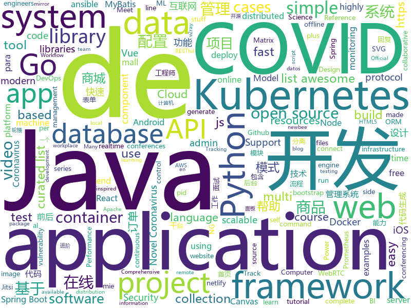

# 2020-03-18
See what the GitHub community is most excited about.

## python
+ [chime](https://github.com/pennsignals/chime)(**24 stars today**): COVID-19 Hospital Impact Model for Epidemics
+ [synapse](https://github.com/matrix-org/synapse)(**16 stars today**): Synapse: Matrix reference homeserver
+ [AdderNet](https://github.com/huawei-noah/AdderNet)(**32 stars today**): Code for paper " AdderNet: Do We Really Need Multiplications in Deep Learning?"
+ [machine_learning_examples](https://github.com/lazyprogrammer/machine_learning_examples)(**7 stars today**): A collection of machine learning examples and tutorials.
+ [modeldb](https://github.com/VertaAI/modeldb)(**33 stars today**): Open Source ML Model Versioning, Metadata, and Experiment Management
+ [stanza](https://github.com/stanfordnlp/stanza)(**92 stars today**): Official Stanford NLP Python Library for Many Human Languages
+ [ansible-for-devops](https://github.com/geerlingguy/ansible-for-devops)(**23 stars today**): Ansible examples from Ansible for DevOps.
+ [gluon-cv](https://github.com/dmlc/gluon-cv)(**19 stars today**): Gluon CV Toolkit
+ [ansible](https://github.com/ansible/ansible)(**17 stars today**): Ansible is a radically simple IT automation platform that makes your applications and systems easier to deploy. Avoid writing scripts or custom code to deploy and update your applications — automate in a language that approaches plain English, using SSH, with no agents to install on remote systems. https://docs.ansible.com/ansible/
+ [coronavirus-tracker-api](https://github.com/ExpDev07/coronavirus-tracker-api)(**63 stars today**): 🦠 A simple and fast (< 200ms) API for tracking the global coronavirus (COVID-19, SARS-CoV-2) outbreak. It's written in python using the🍼Flask framework.
+ [python-cheatsheet](https://github.com/gto76/python-cheatsheet)(**121 stars today**): Comprehensive Python Cheatsheet
+ [YouCompleteMe](https://github.com/ycm-core/YouCompleteMe)(**8 stars today**): A code-completion engine for Vim
+ [localstack](https://github.com/localstack/localstack)(**17 stars today**): 💻A fully functional local AWS cloud stack. Develop and test your cloud & Serverless apps offline!
+ [wait-for-it](https://github.com/vishnubob/wait-for-it)(**9 stars today**): Pure bash script to test and wait on the availability of a TCP host and port
+ [PySyft](https://github.com/OpenMined/PySyft)(**8 stars today**): A library for encrypted, privacy preserving machine learning
+ [lark](https://github.com/lark-parser/lark)(**3 stars today**): A modern parsing library for Python, implementing Earley & LALR(1) and an easy interface
+ [awesome-python](https://github.com/vinta/awesome-python)(**49 stars today**): A curated list of awesome Python frameworks, libraries, software and resources
+ [transformers](https://github.com/huggingface/transformers)(**49 stars today**): 🤗Transformers: State-of-the-art Natural Language Processing for TensorFlow 2.0 and PyTorch.
+ [python-telegram-bot](https://github.com/python-telegram-bot/python-telegram-bot)(**18 stars today**): We have made you a wrapper you can't refuse
+ [tfx](https://github.com/tensorflow/tfx)(**2 stars today**): TFX is an end-to-end platform for deploying production ML pipelines
+ [bips](https://github.com/bitcoin/bips)(**1 stars today**): Bitcoin Improvement Proposals
+ [dbt](https://github.com/fishtown-analytics/dbt)(**2 stars today**): dbt (data build tool) enables data analysts and engineers to transform their data using the same practices that software engineers use to build applications.
+ [django](https://github.com/django/django)(**41 stars today**): The Web framework for perfectionists with deadlines.
+ [mypy](https://github.com/python/mypy)(**8 stars today**): Optional static typing for Python 3 and 2 (PEP 484)
+ [pip](https://github.com/pypa/pip)(**6 stars today**): The Python package installer

## java
+ [newbee-mall](https://github.com/newbee-ltd/newbee-mall)(**168 stars today**): newbee-mall 项目（新蜂商城）是一套电商系统，包括 newbee-mall 商城系统及 newbee-mall-admin 商城后台管理系统，基于 Spring Boot 2.X 及相关技术栈开发。 前台商城系统包含首页门户、商品分类、新品上线、首页轮播、商品推荐、商品搜索、商品展示、购物车、订单结算、订单流程、个人订单管理、会员中心、帮助中心等模块。 后台管理系统包含数据面板、轮播图管理、商品管理、订单管理、会员管理、分类管理、设置等模块。
+ [Java-Tutorial](https://github.com/h2pl/Java-Tutorial)(**122 stars today**): 【Java工程师面试复习指南】本仓库涵盖大部分Java程序员所需要掌握的核心知识，整合了互联网上的很多优质Java技术文章，力求打造为最完整最实用的Java开发者学习指南，如果对你有帮助，给个star告诉我吧，谢谢！
+ [LeetCode](https://github.com/yuanguangxin/LeetCode)(**19 stars today**): LeetCode刷题记录
+ [Sentinel](https://github.com/alibaba/Sentinel)(**41 stars today**): A powerful flow control component enabling reliability, resilience and monitoring for microservices. (面向云原生微服务的高可用流控防护组件)
+ [testcontainers-java](https://github.com/testcontainers/testcontainers-java)(**10 stars today**): Testcontainers is a Java library that supports JUnit tests, providing lightweight, throwaway instances of common databases, Selenium web browsers, or anything else that can run in a Docker container.
+ [bigbluebutton](https://github.com/bigbluebutton/bigbluebutton)(**90 stars today**): Complete open source web conferencing system.
+ [react-native-video](https://github.com/react-native-community/react-native-video)(**7 stars today**): A <Video /> component for react-native
+ [jitsi-videobridge](https://github.com/jitsi/jitsi-videobridge)(**15 stars today**): Jitsi Videobridge is a WebRTC compatible video router or SFU that lets build highly scalable video conferencing infrastructure (i.e., up to hundreds of conferences per server).
+ [druid](https://github.com/apache/druid)(**8 stars today**): Apache Druid: a high performance real-time analytics database.
+ [Algorithms](https://github.com/williamfiset/Algorithms)(**32 stars today**): A collection of algorithms and data structures
+ [spring-framework](https://github.com/spring-projects/spring-framework)(**32 stars today**): Spring Framework
+ [VirtualXposed](https://github.com/android-hacker/VirtualXposed)(**15 stars today**): A simple app to use Xposed without root, unlock the bootloader or modify system image, etc.
+ [spring-boot-api-project-seed](https://github.com/lihengming/spring-boot-api-project-seed)(**60 stars today**): 🌱🚀一个基于Spring Boot & MyBatis的种子项目，用于快速构建中小型API、RESTful API项目~
+ [openvidu](https://github.com/OpenVidu/openvidu)(**75 stars today**): OpenVidu Platform main repository
+ [spring-security](https://github.com/spring-projects/spring-security)(**9 stars today**): Spring Security
+ [skywalking](https://github.com/apache/skywalking)(**30 stars today**): APM, Application Performance Monitoring System
+ [miaosha](https://github.com/qiurunze123/miaosha)(**98 stars today**): ⭐⭐⭐⭐秒杀系统设计与实现.互联网工程师进阶与分析🙋🐓
+ [tutorials](https://github.com/eugenp/tutorials)(**24 stars today**): Just Announced - "Learn Spring Security OAuth":
+ [jeecg-boot](https://github.com/zhangdaiscott/jeecg-boot)(**30 stars today**): 一款基于代码生成器的JAVA快速开发平台，开源界“小普元”超越传统商业企业级开发平台！采用前后端分离架构：SpringBoot 2.x，Ant Design&Vue，Mybatis-plus，Shiro，JWT。强大的代码生成器让前后端代码一键生成，无需写任何代码! 引领新的开发模式(OnlineCoding模式-> 代码生成器模式-> 手工MERGE智能开发)，帮助Java项目解决70%的重复工作，让开发更多关注业务逻辑。既能快速提高开发效率，帮助公司节省成本，同时又不失灵活性。JeecgBoot还独创在线开发模式（No代码）：在线表单配置（表单设计器）、移动配置能力、在线工作流配置（流程设计器）、在线报表配置、在线图表配置、插件能力（可插拔）等等
+ [YCSB](https://github.com/brianfrankcooper/YCSB)(**3 stars today**): Yahoo! Cloud Serving Benchmark
+ [libgdx](https://github.com/libgdx/libgdx)(**8 stars today**): Desktop/Android/HTML5/iOS Java game development framework
+ [aws-sdk-java](https://github.com/aws/aws-sdk-java)(**5 stars today**): The official AWS SDK for Java.
+ [zookeeper](https://github.com/apache/zookeeper)(**8 stars today**): Mirror of Apache Hadoop ZooKeeper
+ [community](https://github.com/codedrinker/community)(**3 stars today**): 开源论坛、问答系统，现有功能提问、回复、通知、最新、最热、消除零回复功能。功能持续更新中…… 技术栈 Spring、Spring Boot、MyBatis、MySQL/H2、Bootstrap
+ [jacoco](https://github.com/jacoco/jacoco)(**4 stars today**): 🔬JaCoCo - Java Code Coverage Library

## unknown
+ [covid-chestxray-dataset](https://github.com/ieee8023/covid-chestxray-dataset)(**188 stars today**): We are building an open database of COVID-19 cases with chest X-ray or CT images.
+ [remote4corona](https://github.com/canerbasaran/remote4corona)(**43 stars today**): Türkiye'de korona nedeniyle çalışanlarına uzaktan çalışmaya izin veren şirketler
+ [computer-science](https://github.com/ossu/computer-science)(**159 stars today**): 🎓Path to a free self-taught education in Computer Science!
+ [COVID-19](https://github.com/CSSEGISandData/COVID-19)(**882 stars today**): Novel Coronavirus (COVID-19) Cases, provided by JHU CSSE
+ [TeachYourselfCS-CN](https://github.com/keithnull/TeachYourselfCS-CN)(**113 stars today**): TeachYourselfCS 的中文翻译 | A Chinese translation of TeachYourselfCS
+ [CS-Xmind-Note](https://github.com/SSHeRun/CS-Xmind-Note)(**90 stars today**): 计算机专业课（408）思维导图和笔记：计算机组成原理（第五版 王爱英），数据结构（王道），计算机网络（第七版 谢希仁），操作系统（第四版 汤小丹）
+ [resources](https://github.com/Helpful-Engineers/resources)(**19 stars today**): Helpful Engineering project proposals
+ [awesome-remote-job](https://github.com/lukasz-madon/awesome-remote-job)(**25 stars today**): A curated list of awesome remote jobs and resources. Inspired by https://github.com/vinta/awesome-python
+ [app-ideas](https://github.com/florinpop17/app-ideas)(**96 stars today**): A Collection of application ideas which can be used to improve your coding skills.
+ [Specs](https://github.com/CocoaPods/Specs)(**6 stars today**): The CocoaPods Master Repo
+ [QuantumultX](https://github.com/nzw9314/QuantumultX)(**35 stars today**): QuantumultX
+ [books](https://github.com/programthink/books)(**28 stars today**): 【编程随想】收藏的电子书清单（多个学科，含下载链接）
+ [hjemmekontor](https://github.com/bekk/hjemmekontor)(**6 stars today**): En samling resurser for hvordan ha det best mulig på hjemmekontor.
+ [Awesome-Android-Notebook](https://github.com/JsonChao/Awesome-Android-Notebook)(**68 stars today**): 💻A complete plan for better android developers.（continuous updating ...）
+ [awesome-production-machine-learning](https://github.com/EthicalML/awesome-production-machine-learning)(**6 stars today**): A curated list of awesome open source libraries to deploy, monitor, version and scale your machine learning
+ [COVID-19](https://github.com/pcm-dpc/COVID-19)(**109 stars today**): COVID-19 Italia - Monitoraggio situazione
+ [the-book-of-secret-knowledge](https://github.com/trimstray/the-book-of-secret-knowledge)(**36 stars today**): A collection of inspiring lists, manuals, cheatsheets, blogs, hacks, one-liners, cli/web tools and more.
+ [ztm-python-cheat-sheet](https://github.com/aneagoie/ztm-python-cheat-sheet)(**5 stars today**): 
+ [git-flight-rules](https://github.com/k88hudson/git-flight-rules)(**9 stars today**): Flight rules for git
+ [p1xt-guides](https://github.com/P1xt/p1xt-guides)(**3 stars today**): Programming curricula
+ [vagas](https://github.com/backend-br/vagas)(**4 stars today**): ✌️Espaço para divulgação de vagas para backenders
+ [Infosec_Reference](https://github.com/rmusser01/Infosec_Reference)(**6 stars today**): An Information Security Reference That Doesn't Suck
+ [awesome-java](https://github.com/akullpp/awesome-java)(**12 stars today**): A curated list of awesome frameworks, libraries and software for the Java programming language.
+ [flutter-firebase](https://github.com/iamshaunjp/flutter-firebase)(**0 stars today**): All course files for the Flutter & Firebase tutorial playlist on The Net Ninja YouTube channel
+ [Analyzing-Visualizing-Data-PowerBI](https://github.com/MicrosoftLearning/Analyzing-Visualizing-Data-PowerBI)(**2 stars today**): This repository contains the lab files and other resources for the free Microsoft course DAT207x: Analyzing and Visualizing Data with Power BI. To learn how to connect, explore, and visualize data with Power BI, sign up for this course on edX.

## javascript
+ [coronavirus-tracker-cli](https://github.com/sagarkarira/coronavirus-tracker-cli)(**85 stars today**): Track conronavirus cases from command line. curl https://corona-stats.online/
+ [API](https://github.com/NovelCOVID/API)(**70 stars today**): API for Current cases and more stuff about COVID-19 or the Novel Coronavirus Strain
+ [Script](https://github.com/NobyDa/Script)(**61 stars today**): This project is based on the scripting capabilities of two excellent iOS proxy tools, Quantumult X or Surge.
+ [nuxt.js](https://github.com/nuxt/nuxt.js)(**23 stars today**): The Vue.js Framework
+ [graphql-engine](https://github.com/hasura/graphql-engine)(**41 stars today**): Blazing fast, instant realtime GraphQL APIs on Postgres with fine grained access control, also trigger webhooks on database events.
+ [jitsi-meet](https://github.com/jitsi/jitsi-meet)(**166 stars today**): Jitsi Meet - Secure, Simple and Scalable Video Conferences that you use as a standalone app or embed in your web application.
+ [list](https://github.com/homeferences/list)(**89 stars today**): List of Homeferences
+ [awesome-coronavirus](https://github.com/soroushchehresa/awesome-coronavirus)(**21 stars today**): 🦠Useful projects and resources for COVID-19 (2019 novel Coronavirus)
+ [apprtc](https://github.com/webrtc/apprtc)(**6 stars today**): The video chat demo app based on WebRTC. This project is currently on HOLD with minimal maintenance.
+ [puppeteer](https://github.com/puppeteer/puppeteer)(**53 stars today**): Headless Chrome Node.js API
+ [gatsby](https://github.com/gatsbyjs/gatsby)(**33 stars today**): Build blazing fast, modern apps and websites with React
+ [todomvc](https://github.com/tastejs/todomvc)(**19 stars today**): Helping you select an MV* framework - Todo apps for React.js, Ember.js, Angular, and many more
+ [UnblockNeteaseMusic](https://github.com/nondanee/UnblockNeteaseMusic)(**39 stars today**): Revive unavailable songs for Netease Cloud Music
+ [gun](https://github.com/amark/gun)(**13 stars today**): A realtime, decentralized, offline-first, graph protocol to sync the web.
+ [docker-jitsi-meet](https://github.com/jitsi/docker-jitsi-meet)(**46 stars today**): Jitsi Meet on Docker
+ [data](https://github.com/opencovid19-fr/data)(**31 stars today**): Consolidation des données de sources officielles concernant l'épidémie de COVID19
+ [covid19](https://github.com/pomber/covid19)(**34 stars today**): JSON time-series of coronavirus cases (confirmed, deaths and recovered) per country - updated daily
+ [fabric.js](https://github.com/fabricjs/fabric.js)(**10 stars today**): Javascript Canvas Library, SVG-to-Canvas (& canvas-to-SVG) Parser
+ [core-js](https://github.com/zloirock/core-js)(**21 stars today**): Standard Library
+ [Viewers](https://github.com/OHIF/Viewers)(**46 stars today**): OHIF zero-footprint DICOM viewer and oncology specific Lesion Tracker, plus shared extension packages
+ [matrix](https://github.com/ResultadosDigitais/matrix)(**52 stars today**): #matrix is the online open-source workplace inspired in sococo.com for distributed teams to have the experience of work together each day, side-by-side. No matter where team members might be. Working in an online workplace is even more productive when people feeling in the same space.
+ [three.js](https://github.com/mrdoob/three.js)(**40 stars today**): JavaScript 3D library.
+ [sequelize](https://github.com/sequelize/sequelize)(**19 stars today**): An easy-to-use multi SQL dialect ORM for Node.js
+ [deck.gl](https://github.com/uber/deck.gl)(**6 stars today**): WebGL2 powered geospatial visualization layers
+ [lx-music-desktop](https://github.com/lyswhut/lx-music-desktop)(**39 stars today**): 一个基于 electron 的音乐软件

## html
+ [REKCARC-TSC-UHT](https://github.com/PKUanonym/REKCARC-TSC-UHT)(**111 stars today**): 清华大学计算机系课程攻略 Guidance for courses in Department of Computer Science and Technology, Tsinghua University
+ [website](https://github.com/COVID19Tracking/website)(**42 stars today**): COVID 19 Tracking Website
+ [staythefuckhome](https://github.com/flore2003/staythefuckhome)(**132 stars today**): The #StayTheFuckHome Website
+ [speedtest](https://github.com/librespeed/speedtest)(**7 stars today**): Self-hosted Speedtest for HTML5 and more. Easy setup, examples, configurable, mobile friendly. Supports PHP, Node, Multiple servers, and more
+ [ckeditor5](https://github.com/ckeditor/ckeditor5)(**3 stars today**): Powerful rich text editor framework with a modular architecture, modern integrations and features like collaborative editing.
+ [v2-ui](https://github.com/sprov065/v2-ui)(**16 stars today**): 支持多协议多用户的 v2ray 面板，Support multi-protocol multi-user v2ray panel
+ [datasets](https://github.com/datadista/datasets)(**9 stars today**): Fuente de datos de los reportajes y proyectos de periodismo de investigación y datos de DATADISTA
+ [portainer](https://github.com/portainer/portainer)(**8 stars today**): Making Docker management easy.
+ [snakemake](https://github.com/snakemake/snakemake)(**6 stars today**): This is the development home of the workflow management system Snakemake. For general information, see
+ [Java-Interview-Advanced](https://github.com/shishan100/Java-Interview-Advanced)(**16 stars today**): 中华石杉--互联网Java进阶面试训练营
+ [ng-alain](https://github.com/ng-alain/ng-alain)(**5 stars today**): NG-ZORRO admin panel front-end framework (netlify mirror https://netlify.ng-alain.com/)
+ [frida-all-in-one](https://github.com/hookmaster/frida-all-in-one)(**5 stars today**): 《FRIDA操作手册》by @hluwa @r0ysue
+ [hyperblog](https://github.com/freddier/hyperblog)(**4 stars today**): Un blog increíble para el curso de Git y Github de Platzi
+ [java](https://github.com/bjmashibing/java)(**2 stars today**): 
+ [keep-a-changelog](https://github.com/olivierlacan/keep-a-changelog)(**2 stars today**): If you build software, keep a changelog.
+ [DevOps-Guide](https://github.com/Tikam02/DevOps-Guide)(**8 stars today**): DevOps Guide from basic to advanced with Interview Questions and Notes🔥
+ [tidytuesday](https://github.com/rfordatascience/tidytuesday)(**5 stars today**): Official repo for the #tidytuesday project
+ [material-design-lite](https://github.com/google/material-design-lite)(**3 stars today**): Material Design Components in HTML/CSS/JS
+ [Coronavirus-Dashboard](https://github.com/avischiffmann/Coronavirus-Dashboard)(**4 stars today**): This is a website I made to track the ongoing Coronavirus (nCov2019)
+ [coreui-free-bootstrap-admin-template](https://github.com/coreui/coreui-free-bootstrap-admin-template)(**8 stars today**): CoreUI is free bootstrap admin template
+ [django-DefectDojo](https://github.com/DefectDojo/django-DefectDojo)(**0 stars today**): DefectDojo is an open-source application vulnerability correlation and security orchestration tool.
+ [SEIR_COVID19](https://github.com/alsnhll/SEIR_COVID19)(**7 stars today**): SEIR model for COVID-19 infection, including different clinical trajectories of infection
+ [enpremiereligne.fr](https://github.com/tgalopin/enpremiereligne.fr)(**3 stars today**): Face à l’épidémie de Covid-19, certains d'entre nous sont en première ligne de la lutte contre le virus. Soyons présents pour eux et leurs familles.
+ [boost](https://github.com/boostorg/boost)(**4 stars today**): Super-project for modularized Boost
+ [keycloak-documentation](https://github.com/keycloak/keycloak-documentation)(**0 stars today**): 

## go
+ [go-admin](https://github.com/wenjianzhang/go-admin)(**30 stars today**): 基于Gin + Vue + Element UI的前后端分离权限管理系统
+ [consul](https://github.com/hashicorp/consul)(**16 stars today**): Consul is a distributed, highly available, and data center aware solution to connect and configure applications across dynamic, distributed infrastructure.
+ [kind](https://github.com/kubernetes-sigs/kind)(**71 stars today**): Kubernetes IN Docker - local clusters for testing Kubernetes
+ [grpc-go](https://github.com/grpc/grpc-go)(**11 stars today**): The Go language implementation of gRPC. HTTP/2 based RPC
+ [chat](https://github.com/tinode/chat)(**13 stars today**): Instant messaging server; backend in Go; iOS, Android, web, command line clients; chatbots
+ [prometheus](https://github.com/prometheus/prometheus)(**29 stars today**): The Prometheus monitoring system and time series database.
+ [moby](https://github.com/moby/moby)(**21 stars today**): Moby Project - a collaborative project for the container ecosystem to assemble container-based systems
+ [skaffold](https://github.com/GoogleContainerTools/skaffold)(**7 stars today**): Easy and Repeatable Kubernetes Development
+ [rke](https://github.com/rancher/rke)(**2 stars today**): Rancher Kubernetes Engine (RKE), an extremely simple, lightning fast Kubernetes distribution that runs entirely within containers.
+ [protobuf](https://github.com/gogo/protobuf)(**5 stars today**): Protocol Buffers for Go with Gadgets
+ [cortex](https://github.com/cortexproject/cortex)(**3 stars today**): A horizontally scalable, highly available, multi-tenant, long term Prometheus.
+ [trivy](https://github.com/aquasecurity/trivy)(**23 stars today**): A Simple and Comprehensive Vulnerability Scanner for Containers, Suitable for CI
+ [ginkgo](https://github.com/onsi/ginkgo)(**8 stars today**): BDD Testing Framework for Go
+ [argo-cd](https://github.com/argoproj/argo-cd)(**6 stars today**): Declarative continuous deployment for Kubernetes.
+ [sqlboiler](https://github.com/volatiletech/sqlboiler)(**5 stars today**): Generate a Go ORM tailored to your database schema.
+ [argo](https://github.com/argoproj/argo)(**13 stars today**): Argo Workflows: Get stuff done with Kubernetes.
+ [origin](https://github.com/openshift/origin)(**6 stars today**): The self-managing, auto-upgrading, Kubernetes distribution for everyone
+ [charts](https://github.com/helm/charts)(**20 stars today**): Curated applications for Kubernetes
+ [logrus](https://github.com/sirupsen/logrus)(**19 stars today**): Structured, pluggable logging for Go.
+ [pgx](https://github.com/jackc/pgx)(**3 stars today**): PostgreSQL driver and toolkit for Go
+ [velero](https://github.com/vmware-tanzu/velero)(**6 stars today**): Backup and migrate Kubernetes applications and their persistent volumes
+ [viper](https://github.com/spf13/viper)(**21 stars today**): Go configuration with fangs
+ [learn-go-with-tests](https://github.com/quii/learn-go-with-tests)(**24 stars today**): Learn Go with test-driven development
+ [mattermost-server](https://github.com/mattermost/mattermost-server)(**15 stars today**): Open source Slack-alternative in Golang and React - Mattermost
+ [swag](https://github.com/swaggo/swag)(**7 stars today**): Automatically generate RESTful API documentation with Swagger 2.0 for Go.

## WordCloud

