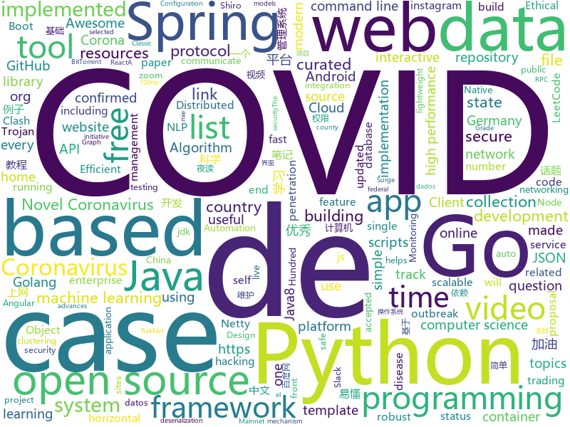

# 2020-03-22
See what the GitHub community is most excited about.

## python
+ [GitHub-Chinese-Top-Charts](https://github.com/kon9chunkit/GitHub-Chinese-Top-Charts)(**240 stars today**): 🇨🇳GitHub中文排行榜，帮助你发现高分优秀中文项目、更高效地吸收国人的优秀经验成果；榜单每周更新一次，敬请关注！（武汉加油！中国加油！世界加油！）
+ [BookOmatic](https://github.com/KalleHallden/BookOmatic)(**63 stars today**): 
+ [automl](https://github.com/google/automl)(**230 stars today**): Google Brain AutoML
+ [theMLbook](https://github.com/aburkov/theMLbook)(**20 stars today**): The Python code to reproduce the illustrations from The Hundred-Page Machine Learning Book.
+ [zipline](https://github.com/quantopian/zipline)(**11 stars today**): Zipline, a Pythonic Algorithmic Trading Library
+ [Python](https://github.com/TheAlgorithms/Python)(**170 stars today**): All Algorithms implemented in Python
+ [care](https://github.com/coronasafe/care)(**17 stars today**): Care is a single point to link Hospitals,Corona Care Centers and Volunteers to the unified Corona Safe Network so that the Kerala Chief Ministers Office has direct access to live reports of health data v/s our total. healthcare capacity
+ [python-small-examples](https://github.com/jackzhenguo/python-small-examples)(**29 stars today**): Python有趣的小例子一网打尽。Python基础、Python坑点、Python字符串和正则、Python绘图、Python日期和文件、Web开发、数据科学、机器学习、深度学习、TensorFlow、Pytorch，一切都是简单易懂的小例子。
+ [covid19_scenarios_data](https://github.com/neherlab/covid19_scenarios_data)(**6 stars today**): Data preprocessing scripts and preprocessed data storage for COVID-19 Scenarios project
+ [instabot](https://github.com/instagrambot/instabot)(**8 stars today**): 🐙Free Instagram scripts, bots and Python API wrapper. Get free instagram followers with our auto like, auto follow and other scripts!
+ [covid-tracking-data](https://github.com/COVID19Tracking/covid-tracking-data)(**3 stars today**): 
+ [gan-compression](https://github.com/mit-han-lab/gan-compression)(**57 stars today**): [CVPR 2020] GAN Compression: Efficient Architectures for Interactive Conditional GANs
+ [DecryptLogin](https://github.com/CharlesPikachu/DecryptLogin)(**43 stars today**): Login some website using requests
+ [tensortrade](https://github.com/tensortrade-org/tensortrade)(**17 stars today**): An open source reinforcement learning framework for training, evaluating, and deploying robust trading agents.
+ [r00kie-kr00kie](https://github.com/hexway/r00kie-kr00kie)(**19 stars today**): PoC exploit for the CVE-2019-15126 kr00k vulnerability
+ [hosts](https://github.com/StevenBlack/hosts)(**11 stars today**): Extending and consolidating hosts files from several well-curated sources like adaway.org, mvps.org, malwaredomainlist.com, someonewhocares.org, and potentially others. You can optionally invoke extensions to block additional sites by category.
+ [node-gyp](https://github.com/nodejs/node-gyp)(**9 stars today**): Node.js native addon build tool
+ [faceswap](https://github.com/deepfakes/faceswap)(**20 stars today**): Deepfakes Software For All
+ [ungoogled-chromium](https://github.com/Eloston/ungoogled-chromium)(**12 stars today**): Google Chromium, sans integration with Google
+ [machine_learning_examples](https://github.com/lazyprogrammer/machine_learning_examples)(**12 stars today**): A collection of machine learning examples and tutorials.
+ [ProxyPool](https://github.com/Python3WebSpider/ProxyPool)(**31 stars today**): An Efficient ProxyPool with Getter, Tester and Server
+ [python-prompt-toolkit](https://github.com/prompt-toolkit/python-prompt-toolkit)(**10 stars today**): Library for building powerful interactive command line applications in Python
+ [gliding_vertex](https://github.com/MingtaoFu/gliding_vertex)(**16 stars today**): The implementation of paper "Gliding vertex on the horizontal bounding box for multi-oriented object detection".
+ [impacket](https://github.com/SecureAuthCorp/impacket)(**12 stars today**): Impacket is a collection of Python classes for working with network protocols.
+ [keras](https://github.com/keras-team/keras)(**29 stars today**): Deep Learning for humans

## java
+ [xdm](https://github.com/subhra74/xdm)(**34 stars today**): Powerfull download accelerator and video downloader
+ [LoupGarou](https://github.com/leomelki/LoupGarou)(**22 stars today**): LoupGarou dans Minecraft par leomelki
+ [Mindustry](https://github.com/Anuken/Mindustry)(**12 stars today**): A sandbox tower defense game
+ [Java](https://github.com/TheAlgorithms/Java)(**40 stars today**): All Algorithms implemented in Java
+ [ZXBlog](https://github.com/ZXZxin/ZXBlog)(**10 stars today**): 记录各种学习笔记(算法、Java、数据库、并发......)
+ [piranha](https://github.com/uber/piranha)(**64 stars today**): A tool for refactoring code related to feature flag APIs
+ [jetlinks-community](https://github.com/jetlinks/jetlinks-community)(**3 stars today**): JetLinks Community 基于Java8,Spring Boot 2.x ,WebFlux,Netty,Vert.x,Reactor等开发, 是一个全响应式的物联网基础平台。
+ [dubbo](https://github.com/apache/dubbo)(**35 stars today**): Apache Dubbo is a high-performance, java based, open source RPC framework.
+ [json4java8](https://github.com/kenta-shimizu/json4java8)(**2 stars today**): This library is JSON (RFC8259) parser implementation on Java8.
+ [secs4java8](https://github.com/kenta-shimizu/secs4java8)(**2 stars today**): This library is SEMI-SECS-communicate implementation on Java8.
+ [jitsi](https://github.com/jitsi/jitsi)(**17 stars today**): Jitsi is an audio/video and chat communicator that supports protocols such as SIP, XMPP/Jabber, AIM/ICQ, IRC and many other useful features.
+ [java-design-patterns](https://github.com/iluwatar/java-design-patterns)(**47 stars today**): Design patterns implemented in Java
+ [jdk](https://github.com/openjdk/jdk)(**10 stars today**): Read-only mirror of https://hg.openjdk.java.net/jdk/jdk
+ [SpringCloudLearning](https://github.com/forezp/SpringCloudLearning)(**31 stars today**): 《史上最简单的Spring Cloud教程源码》
+ [NewPipe](https://github.com/TeamNewPipe/NewPipe)(**14 stars today**): A libre lightweight streaming front-end for Android.
+ [LeetCodeAnimation](https://github.com/MisterBooo/LeetCodeAnimation)(**77 stars today**): Demonstrate all the questions on LeetCode in the form of animation.（用动画的形式呈现解LeetCode题目的思路）
+ [smile](https://github.com/haifengl/smile)(**3 stars today**): Statistical Machine Intelligence & Learning Engine
+ [AndroidTutorialForBeginners](https://github.com/hussien89aa/AndroidTutorialForBeginners)(**4 stars today**): Step by step to build Android apps using Android Studio
+ [karate](https://github.com/intuit/karate)(**6 stars today**): Test Automation Made Simple
+ [gson](https://github.com/google/gson)(**9 stars today**): A Java serialization/deserialization library to convert Java Objects into JSON and back
+ [Mifare-Desfire](https://github.com/CRTM-NFC/Mifare-Desfire)(**10 stars today**): A research on how Metro de Madrid NFC cards works.
+ [spring-boot](https://github.com/spring-projects/spring-boot)(**47 stars today**): Spring Boot
+ [spring-cloud-kubernetes](https://github.com/spring-cloud/spring-cloud-kubernetes)(**3 stars today**): Kubernetes integration with Spring Cloud Discovery Client, Configuration, etc...
+ [sofa-bolt](https://github.com/sofastack/sofa-bolt)(**3 stars today**): SOFABolt is a lightweight, easy to use and high performance remoting framework based on Netty.
+ [FEBS-Shiro](https://github.com/wuyouzhuguli/FEBS-Shiro)(**9 stars today**): Spring Boot 2.2.1，Shiro1.4.2 & Layui 2.5.5 权限管理系统。预览地址：https://shiro.mrbird.cn:8080

## unknown
+ [browser-2020](https://github.com/luruke/browser-2020)(**896 stars today**): Things you can do with a browser in 2020☕️
+ [coronasafe.in](https://github.com/coronasafe/coronasafe.in)(**12 stars today**): A crowd-sourced guide to staying safe in Coronavirus disease (COVID-19) outbreak.
+ [CS-Xmind-Note](https://github.com/SSHeRun/CS-Xmind-Note)(**185 stars today**): 计算机专业课（408）思维导图和笔记：计算机组成原理（第五版 王爱英），数据结构（王道），计算机网络（第七版 谢希仁），操作系统（第四版 汤小丹）
+ [PENTESTING-BIBLE](https://github.com/blaCCkHatHacEEkr/PENTESTING-BIBLE)(**14 stars today**): This repository was created and developed by Ammar Amer @cry__pto Only. Updates to this repository will continue to arrive until the number of links reaches 10000 links & 10000 pdf files .Learn Ethical Hacking and penetration testing .hundreds of ethical hacking & penetration testing & red team & cyber security & computer science resources.
+ [LCO-sports-web-challenge](https://github.com/hiteshchoudhary/LCO-sports-web-challenge)(**7 stars today**): 
+ [ultimate-coding-resources](https://github.com/PizzaPokerGuy/ultimate-coding-resources)(**89 stars today**): A collection of the best resources for programming, web development, computer science and more.
+ [computer-science](https://github.com/ossu/computer-science)(**240 stars today**): 🎓Path to a free self-taught education in Computer Science!
+ [trackerslist](https://github.com/ngosang/trackerslist)(**66 stars today**): Updated list of public BitTorrent trackers
+ [awesome](https://github.com/sindresorhus/awesome)(**122 stars today**): 😎Awesome lists about all kinds of interesting topics
+ [nlp_paper_summaries](https://github.com/dair-ai/nlp_paper_summaries)(**7 stars today**): ✍️A carefully curated list of NLP paper summaries
+ [awesome-spider](https://github.com/facert/awesome-spider)(**42 stars today**): 爬虫集合
+ [ru-test-assignments](https://github.com/Hexlet/ru-test-assignments)(**10 stars today**): Тестовые задания для самостоятельного выполнения от разных it компаний
+ [oscp_checklist](https://github.com/peanuthacker92/oscp_checklist)(**25 stars today**): 
+ [covid19br](https://github.com/wcota/covid19br)(**14 stars today**): Confirmed cases of COVID-19 in Brazil
+ [cert-covid19](https://github.com/cwoomi/cert-covid19)(**60 stars today**): Informationssammlung zum Thema CoVid-19
+ [go](https://github.com/datasciencemasters/go)(**12 stars today**): The Open Source Data Science Masters
+ [CyberSecurityRSS](https://github.com/zer0yu/CyberSecurityRSS)(**99 stars today**): RSS: 优秀的网络安全知识来源
+ [pdown](https://github.com/pdown2020/pdown)(**102 stars today**): 百度网盘下载器，2020百度网盘高速下载
+ [covid-chestxray-dataset](https://github.com/ieee8023/covid-chestxray-dataset)(**94 stars today**): We are building an open database of COVID-19 cases with chest X-ray or CT images.
+ [COVID-19](https://github.com/CSSEGISandData/COVID-19)(**605 stars today**): Novel Coronavirus (COVID-19) Cases, provided by JHU CSSE
+ [faceshield](https://github.com/GliaX/faceshield)(**15 stars today**): Face shield personal protective equipment (PPE)
+ [DevYouTubeList](https://github.com/ErikCH/DevYouTubeList)(**6 stars today**): List of Development YouTube Channels
+ [accepted-gsoc-proposals](https://github.com/prondubuisi/accepted-gsoc-proposals)(**13 stars today**): A repository containing links to accepted proposals for GSoC, Hopefully this helps someone write a better proposal and get accepted into the program
+ [SS-Rule-Snippet](https://github.com/Hackl0us/SS-Rule-Snippet)(**44 stars today**): 搜集、整理、维护 Surge / Quantumult / Shadowrocket / Surfboard / clash(X) 实用规则。
+ [COVID-19-Germany](https://github.com/iceweasel1/COVID-19-Germany)(**3 stars today**): All officially confirmed cases of infection in Germany. Listed by federal state, case number, date, county and source.

## javascript
+ [baseline](https://github.com/ethereum-oasis/baseline)(**50 stars today**): The Baseline Protocol is an open source initiative that combines advances in cryptography, messaging, and blockchain to execute secure and private business processes at low cost via the public Ethereum Mainnet. The protocol will enable confidential and complex collaboration between enterprises without leaving any sensitive data on-chain
+ [COVID-QA](https://github.com/deepset-ai/COVID-QA)(**21 stars today**): API & Webapp to answer questions about COVID-19. Using NLP (Question Answering) and trusted, curated data sources.
+ [covid19](https://github.com/stevenliuyi/covid19)(**19 stars today**): an interactive, animated COVID-19 coronavirus map to track the outbreak over time by country and by region for selected countries (including China, Italy, Korea, Japan, France, Germany, United States)
+ [core](https://github.com/JAVClub/core)(**74 stars today**): 🔞JAVClub - 让你的大姐姐不再走丢
+ [dashboard](https://github.com/opencovid19-fr/dashboard)(**8 stars today**): Tableau de bord de suivi de l'épidémie de nouveau coronavirus
+ [html5-boilerplate](https://github.com/h5bp/html5-boilerplate)(**19 stars today**): A professional front-end template for building fast, robust, and adaptable web apps or sites.
+ [covid19](https://github.com/pomber/covid19)(**42 stars today**): JSON time-series of coronavirus cases (confirmed, deaths and recovered) per country - updated daily
+ [API](https://github.com/NovelCOVID/API)(**102 stars today**): API for Current cases and more stuff about COVID-19 or the Novel Coronavirus Strain
+ [covid-19-au.github.io](https://github.com/covid-19-au/covid-19-au.github.io)(**25 stars today**): The Real-time COVID-19 Status in Australia
+ [javascript](https://github.com/airbnb/javascript)(**47 stars today**): JavaScript Style Guide
+ [jitsi-meet](https://github.com/jitsi/jitsi-meet)(**155 stars today**): Jitsi Meet - Secure, Simple and Scalable Video Conferences that you use as a standalone app or embed in your web application.
+ [awesome-coronavirus](https://github.com/soroushchehresa/awesome-coronavirus)(**61 stars today**): 🦠Useful projects and resources for COVID-19 (2019 novel Coronavirus)
+ [covid19india-network](https://github.com/someshkar/covid19india-network)(**15 stars today**): 🔬COVID 19 India network cluster
+ [covid19-brazil-api](https://github.com/devarthurribeiro/covid19-brazil-api)(**11 stars today**): API com dados atualizados sobre o status do COVID-19 🦠
+ [electron-quick-start](https://github.com/electron/electron-quick-start)(**8 stars today**): Clone to try a simple Electron app
+ [coronavirus-tracker-cli](https://github.com/sagarkarira/coronavirus-tracker-cli)(**127 stars today**): Track conronavirus cases from command line. curl https://corona-stats.online/
+ [awesome-cheatsheets](https://github.com/LeCoupa/awesome-cheatsheets)(**11 stars today**): 👩‍💻👨‍💻Awesome cheatsheets for popular programming languages, frameworks and development tools. They include everything you should know in one single file.
+ [create-react-app](https://github.com/facebook/create-react-app)(**42 stars today**): Set up a modern web app by running one command.
+ [gabgoh.github.io](https://github.com/gabgoh/gabgoh.github.io)(**14 stars today**): Homepage
+ [puppeteer](https://github.com/puppeteer/puppeteer)(**29 stars today**): Headless Chrome Node.js API
+ [grocy](https://github.com/grocy/grocy)(**346 stars today**): ERP beyond your fridge - grocy is a web-based self-hosted groceries & household management solution for your home
+ [corona-cli](https://github.com/ahmadawais/corona-cli)(**101 stars today**): 🦠 Track the Coronavirus disease (COVID-19) or the Novel Coronavirus Strain in the command line. Both worldwide for every country or for one country. Fast response time (< 100ms).
+ [pandoa](https://github.com/wirewirewirewire/pandoa)(**19 stars today**): The app informs you, if you had contact with an infected patient.
+ [COVID-19-API](https://github.com/Laeyoung/COVID-19-API)(**13 stars today**): API Service for tracking the COVID-19
+ [ivideo](https://github.com/phobal/ivideo)(**7 stars today**): 一个可以观看国内主流视频平台所有视频的客户端（Mac、Windows、Linux） A client that can watch video of domestic(China) mainstream video platform

## html
+ [covid19-cases-switzerland](https://github.com/daenuprobst/covid19-cases-switzerland)(**17 stars today**): Data from BAG Tweets made useful.
+ [covid19br.github.io](https://github.com/covid19br/covid19br.github.io)(**13 stars today**): 
+ [wpt](https://github.com/web-platform-tests/wpt)(**13 stars today**): Test suites for Web platform specs — including WHATWG, W3C, and others
+ [machine-learning-systems-design](https://github.com/chiphuyen/machine-learning-systems-design)(**20 stars today**): A booklet on machine learning systems design with exercises
+ [Coronavirus-Dashboard](https://github.com/avischiffmann/Coronavirus-Dashboard)(**37 stars today**): This is a website I made to track the ongoing Coronavirus (nCov2019)
+ [hent-AI](https://github.com/natethegreate/hent-AI)(**34 stars today**): Automation of censor bar detection
+ [blackeye](https://github.com/thelinuxchoice/blackeye)(**8 stars today**): The most complete Phishing Tool, with 32 templates +1 customizable
+ [flutter-in-action](https://github.com/flutterchina/flutter-in-action)(**8 stars today**): 《Flutter实战》电子书
+ [datasets](https://github.com/datadista/datasets)(**7 stars today**): Fuente de datos de los reportajes y proyectos de periodismo de investigación y datos de DATADISTA
+ [awesome-modern-cpp](https://github.com/rigtorp/awesome-modern-cpp)(**9 stars today**): A collection of resources on modern C++
+ [covid-19-germany-gae](https://github.com/jgehrcke/covid-19-germany-gae)(**7 stars today**): COVID-19 case count in Germany state-by-state, over time (HTTP API and CSV file)
+ [covid19](https://github.com/bgautijonsson/covid19)(**6 stars today**): 
+ [awesome-competitive-programming](https://github.com/lnishan/awesome-competitive-programming)(**7 stars today**): 💎A curated list of awesome Competitive Programming, Algorithm and Data Structure resources
+ [snakemake](https://github.com/snakemake/snakemake)(**5 stars today**): This is the development home of the workflow management system Snakemake. For general information, see
+ [OpenClash](https://github.com/vernesong/OpenClash)(**16 stars today**): A Clash Client For OpenWrt
+ [RuoYi](https://github.com/yangzongzhuan/RuoYi)(**5 stars today**): 基于SpringBoot2.0的权限管理系统 易读易懂、界面简洁美观。 核心技术采用Spring、MyBatis、Shiro没有任何其它重度依赖。直接运行即可用
+ [RakNet](https://github.com/facebookarchive/RakNet)(**2 stars today**): RakNet is a cross platform, open source, C++ networking engine for game programmers.
+ [home-assistant.io](https://github.com/home-assistant/home-assistant.io)(**6 stars today**): 📘Home Assistant User documentation
+ [hyperblog](https://github.com/freddier/hyperblog)(**13 stars today**): Un blog increíble para el curso de Git y Github de Platzi
+ [coreui-free-angular-admin-template](https://github.com/coreui/coreui-free-angular-admin-template)(**3 stars today**): CoreUI Angular is free Angular 2+ admin template based on Bootstrap 4
+ [geektime-ELK](https://github.com/onebirdrocks/geektime-ELK)(**2 stars today**): ELK Training
+ [hugo-theme-jane](https://github.com/xianmin/hugo-theme-jane)(**2 stars today**): A readable & concise theme for Hugo
+ [skill-map](https://github.com/TeamStuQ/skill-map)(**9 stars today**): 程序员技能图谱
+ [responsive-html-email-template](https://github.com/leemunroe/responsive-html-email-template)(**3 stars today**): A free simple responsive HTML email template
+ [tidytuesday](https://github.com/rfordatascience/tidytuesday)(**4 stars today**): Official repo for the #tidytuesday project

## go
+ [nightingale](https://github.com/didi/nightingale)(**98 stars today**): A Distributed and High-Performance Monitoring System
+ [night-reading-go](https://github.com/developer-learning/night-reading-go)(**30 stars today**): Night-Reading-Go《Go 夜读》 > Share the related technical topics of Go every week through zoom online live broadcast, every day on the WeChat/Slack to communicate programming technology topics. 由 Go 夜读 SIG 成员维护，并通过 zoom 在线直播的方式分享 Go 相关的技术话题，每天大家在微信/Slack 上及时沟通交流编程技术话题。
+ [hugo](https://github.com/gohugoio/hugo)(**39 stars today**): The world’s fastest framework for building websites.
+ [gh-ost](https://github.com/github/gh-ost)(**3 stars today**): GitHub's Online Schema Migrations for MySQL
+ [dgraph](https://github.com/dgraph-io/dgraph)(**9 stars today**): Fast, Distributed Graph DB
+ [Go](https://github.com/TheAlgorithms/Go)(**8 stars today**): Algorithms Implemented in GoLang
+ [trojan-go](https://github.com/p4gefau1t/trojan-go)(**13 stars today**): A Trojan proxy written in golang. An unidentifiable mechanism that helps you bypass GFW. Golang实现的Trojan代理，支持多个平台，无依赖
+ [vitess](https://github.com/vitessio/vitess)(**10 stars today**): Vitess is a database clustering system for horizontal scaling of MySQL.
+ [falcon-plus](https://github.com/open-falcon/falcon-plus)(**8 stars today**): An open-source and enterprise-level monitoring system.
+ [nebula](https://github.com/slackhq/nebula)(**23 stars today**): A scalable overlay networking tool with a focus on performance, simplicity and security
+ [tailscale](https://github.com/tailscale/tailscale)(**57 stars today**): The easiest, most secure way to use WireGuard and 2FA.
+ [clash](https://github.com/Dreamacro/clash)(**63 stars today**): A rule-based tunnel in Go.
+ [alertmanager](https://github.com/prometheus/alertmanager)(**7 stars today**): Prometheus Alertmanager
+ [rudder-server](https://github.com/rudderlabs/rudder-server)(**81 stars today**): Privacy and Security focused Segment-alternative, in Golang and React
+ [micro](https://github.com/zyedidia/micro)(**21 stars today**): A modern and intuitive terminal-based text editor
+ [dex](https://github.com/dexidp/dex)(**8 stars today**): OpenID Connect Identity (OIDC) and OAuth 2.0 Provider with Pluggable Connectors
+ [istio](https://github.com/istio/istio)(**13 stars today**): Connect, secure, control, and observe services.
+ [go](https://github.com/golang/go)(**74 stars today**): The Go programming language
+ [traefik](https://github.com/containous/traefik)(**17 stars today**): The Cloud Native Edge Router
+ [kubernetes](https://github.com/kubernetes/kubernetes)(**47 stars today**): Production-Grade Container Scheduling and Management
+ [runc](https://github.com/opencontainers/runc)(**4 stars today**): CLI tool for spawning and running containers according to the OCI specification
+ [FreePAC](https://github.com/xiaoming2028/FreePAC)(**11 stars today**): 科学上网/梯子/自由上网/翻墙 SS/SSR/V2Ray/Brook 搭建教程
+ [swarm](https://github.com/docker/swarm)(**2 stars today**): Swarm Classic: a container clustering system
+ [fyne](https://github.com/fyne-io/fyne)(**16 stars today**): Cross platform GUI in Go based on Material Design
+ [cortex](https://github.com/cortexlabs/cortex)(**21 stars today**): Deploy machine learning models in production

## WordCloud

