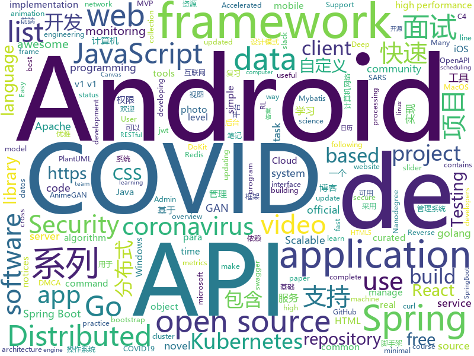

# 2020-03-27
See what the GitHub community is most excited about.

## python
+ [AnimeGAN](https://github.com/TachibanaYoshino/AnimeGAN)(**113 stars today**): A Tensorflow implementation of AnimeGAN for fast photo animation ! This is the Open source of the paper <AnimeGAN: a novel lightweight GAN for photo animation>, which uses the GAN framwork to transform real-world photos into anime images.
+ [stanza](https://github.com/stanfordnlp/stanza)(**94 stars today**): Official Stanford NLP Python Library for Many Human Languages
+ [seed_rl](https://github.com/google-research/seed_rl)(**28 stars today**): SEED RL: Scalable and Efficient Deep-RL with Accelerated Central Inference. Implements IMPALA and R2D2 algorithms in TF2 with SEED's architecture.
+ [corona](https://github.com/geohot/corona)(**91 stars today**): Reverse engineering SARS-CoV-2
+ [diagrams](https://github.com/mingrammer/diagrams)(**84 stars today**): 🎨Diagram as Code for prototyping cloud system architectures
+ [DAIN](https://github.com/baowenbo/DAIN)(**31 stars today**): Depth-Aware Video Frame Interpolation (CVPR 2019)
+ [AdelaiDet](https://github.com/aim-uofa/AdelaiDet)(**18 stars today**): AdelaiDet is an open source toolbox for multiple instance-level detection and recognition tasks.
+ [mnssp3](https://github.com/mpplab/mnssp3)(**70 stars today**): 
+ [COVID-19-TweetIDs](https://github.com/echen102/COVID-19-TweetIDs)(**56 stars today**): The repository contains an ongoing collection of tweets IDs associated with the novel coronavirus COVID-19 (SARS-CoV-2), which commenced on January 28, 2020.
+ [content](https://github.com/demisto/content)(**1 stars today**): Demisto's ever-growing Content Repository
+ [moco](https://github.com/facebookresearch/moco)(**115 stars today**): PyTorch implementation of MoCo: https://arxiv.org/abs/1911.05722
+ [walle-web](https://github.com/meolu/walle-web)(**21 stars today**): walle - 瓦力 Devops开源项目代码部署平台
+ [chime](https://github.com/CodeForPhilly/chime)(**10 stars today**): COVID-19 Hospital Impact Model for Epidemics
+ [zipline](https://github.com/quantopian/zipline)(**22 stars today**): Zipline, a Pythonic Algorithmic Trading Library
+ [minimal-hand](https://github.com/CalciferZh/minimal-hand)(**17 stars today**): A minimal solution to hand motion capture from a single color camera at over 100fps. Easy to use, plug to run.
+ [youtube-dl](https://github.com/ytdl-org/youtube-dl)(**66 stars today**): Command-line program to download videos from YouTube.com and other video sites
+ [seldon-core](https://github.com/SeldonIO/seldon-core)(**4 stars today**): A framework to deploy, manage and scale your production machine learning to thousands of models
+ [progressive_growing_of_gans](https://github.com/tkarras/progressive_growing_of_gans)(**4 stars today**): Progressive Growing of GANs for Improved Quality, Stability, and Variation
+ [iOS-DeviceSupport](https://github.com/iGhibli/iOS-DeviceSupport)(**7 stars today**): This repository holds the device support files for the iOS, and I will update it regularly.
+ [ESRGAN](https://github.com/xinntao/ESRGAN)(**5 stars today**): ECCV18 Workshops - Enhanced SRGAN. Champion PIRM Challenge on Perceptual Super-Resolution (Third Region)
+ [deap](https://github.com/DEAP/deap)(**6 stars today**): Distributed Evolutionary Algorithms in Python
+ [Docs](https://github.com/MegEngine/Docs)(**3 stars today**): MegEngine Documentations
+ [reid-strong-baseline](https://github.com/michuanhaohao/reid-strong-baseline)(**3 stars today**): Bag of Tricks and A Strong Baseline for Deep Person Re-identification
+ [celery](https://github.com/celery/celery)(**13 stars today**): Distributed Task Queue (development branch)
+ [django-rest-framework](https://github.com/encode/django-rest-framework)(**11 stars today**): Web APIs for Django.🎸

## java
+ [DoraemonKit](https://github.com/didi/DoraemonKit)(**90 stars today**): 简称 "DoKit" 。一款功能齐全的客户端（ iOS 、Android、微信小程序 ）研发助手，你值得拥有。https://www.dokit.cn/
+ [spring-boot-api-project-seed](https://github.com/lihengming/spring-boot-api-project-seed)(**27 stars today**): 🌱🚀一个基于Spring Boot & MyBatis的种子项目，用于快速构建中小型API、RESTful API项目~
+ [hbase](https://github.com/apache/hbase)(**4 stars today**): Mirror of Apache HBase
+ [runelite](https://github.com/runelite/runelite)(**3 stars today**): Open source Old School RuneScape client
+ [advanced-java](https://github.com/doocs/advanced-java)(**87 stars today**): 😮互联网 Java 工程师进阶知识完全扫盲：涵盖高并发、分布式、高可用、微服务、海量数据处理等领域知识，后端同学必看，前端同学也可学习
+ [bazel](https://github.com/bazelbuild/bazel)(**14 stars today**): a fast, scalable, multi-language and extensible build system
+ [ud851-Exercises](https://github.com/udacity/ud851-Exercises)(**3 stars today**): 
+ [user-interface-samples](https://github.com/android/user-interface-samples)(**79 stars today**): Multiple samples showing the best practices in the user interface on Android.
+ [AndroidUtilCode](https://github.com/Blankj/AndroidUtilCode)(**17 stars today**): 🔥Android developers should collect the following utils(updating).
+ [xxl-job](https://github.com/xuxueli/xxl-job)(**29 stars today**): A distributed task scheduling framework.（分布式任务调度平台XXL-JOB）
+ [tutorials](https://github.com/eugenp/tutorials)(**21 stars today**): Just Announced - "Learn Spring Security OAuth":
+ [easyexcel](https://github.com/alibaba/easyexcel)(**39 stars today**): 快速、简单避免OOM的java处理Excel工具
+ [CalendarView](https://github.com/huanghaibin-dev/CalendarView)(**7 stars today**): Android上一个优雅、万能自定义UI、支持周视图、自定义周起始、性能高效的日历控件，支持热插拔实现的UI定制！支持标记、自定义颜色、农历、自定义月视图各种显示模式等。Canvas绘制，速度快、占用内存低，你真的想不到日历居然还可以如此优雅！An elegant, highly customized and high-performance Calendar Widget on Android.
+ [resilience4j](https://github.com/resilience4j/resilience4j)(**7 stars today**): Resilience4j is a fault tolerance library designed for Java8 and functional programming
+ [MVPArms](https://github.com/JessYanCoding/MVPArms)(**15 stars today**): ⚔️A common architecture for Android applications developing based on MVP, integrates many open source projects, to make your developing quicker and easier (一个整合了大量主流开源项目高度可配置化的 Android MVP 快速集成框架).
+ [elasticsearch](https://github.com/elastic/elasticsearch)(**24 stars today**): Open Source, Distributed, RESTful Search Engine
+ [zuihou-admin-cloud](https://github.com/zuihou/zuihou-admin-cloud)(**16 stars today**): 基于SpringCloud(Hoxton.SR1) + SpringBoot(2.2.5.RELEASE) 的SaaS 微服务脚手架，具有统一授权、认证后台管理系统，其中包含具备用户管理、资源权限管理、网关API、分布式事务、大文件断点分片续传等多个模块，支持多业务系统并行开发，可以作为后端服务的开发脚手架。代码简洁，架构清晰，适合学习和直接项目中使用。核心技术采用Nacos、Fegin、Ribbon、Zuul、Hystrix、JWT Token、Mybatis、SpringBoot、Redis、RibbitMQ等主要框架和中间件。
+ [grpc-java](https://github.com/grpc/grpc-java)(**8 stars today**): The Java gRPC implementation. HTTP/2 based RPC
+ [calcite](https://github.com/apache/calcite)(**5 stars today**): Mirror of Apache Calcite
+ [CameraView](https://github.com/natario1/CameraView)(**7 stars today**): 📸A well documented, high-level Android interface that makes capturing pictures and videos easy, addressing all of the common issues and needs. Real-time filters, gestures, watermarks, frame processing, RAW, output of any size.
+ [micrometer](https://github.com/micrometer-metrics/micrometer)(**7 stars today**): An application metrics facade for the most popular monitoring tools. Think SLF4J, but for metrics.
+ [SpringAll](https://github.com/wuyouzhuguli/SpringAll)(**49 stars today**): 循序渐进，学习Spring Boot、Spring Boot & Shiro、Spring Batch、Spring Cloud、Spring Cloud Alibaba、Spring Security & Spring Security OAuth2，博客Spring系列源码：https://mrbird.cc
+ [cim](https://github.com/crossoverJie/cim)(**54 stars today**): 📲cim(cross IM) 适用于开发者的分布式即时通讯系统
+ [AndroidPdfViewer](https://github.com/barteksc/AndroidPdfViewer)(**7 stars today**): Android view for displaying PDFs rendered with PdfiumAndroid
+ [incubator-hudi](https://github.com/apache/incubator-hudi)(**4 stars today**): Upserts And Incremental Processing on Big Data

## unknown
+ [gustavoguanabara.github.io](https://github.com/gustavoguanabara/gustavoguanabara.github.io)(**70 stars today**): GitHub Gustavo Guanabara
+ [coding-interview-university](https://github.com/jwasham/coding-interview-university)(**549 stars today**): A complete computer science study plan to become a software engineer.
+ [Projects](https://github.com/karan/Projects)(**136 stars today**): 📃A list of practical projects that anyone can solve in any programming language.
+ [Blog](https://github.com/mqyqingfeng/Blog)(**94 stars today**): 冴羽写博客的地方，预计写四个系列：JavaScript深入系列、JavaScript专题系列、ES6系列、React系列。
+ [papers-we-love](https://github.com/papers-we-love/papers-we-love)(**180 stars today**): Papers from the computer science community to read and discuss.
+ [CS-Xmind-Note](https://github.com/SSHeRun/CS-Xmind-Note)(**182 stars today**): 计算机专业课（408）思维导图和笔记：计算机组成原理（第五版 王爱英），数据结构（王道），计算机网络（第七版 谢希仁），操作系统（第四版 汤小丹）
+ [semana-omnistack-faq](https://github.com/Rocketseat/semana-omnistack-faq)(**21 stars today**): FAQ referente à Semana Omnistack
+ [udacity-nanodegrees](https://github.com/mikesprague/udacity-nanodegrees)(**11 stars today**): 🎓List of Udacity Nanodegree programs with links to the free courses in their curricula
+ [react-typescript-cheatsheet](https://github.com/typescript-cheatsheets/react-typescript-cheatsheet)(**44 stars today**): Cheatsheets for experienced React developers getting started with TypeScript
+ [hiring2020](https://github.com/gcreddy42/hiring2020)(**78 stars today**): Internship status of companies - COVID-19
+ [awesome-blazor](https://github.com/AdrienTorris/awesome-blazor)(**9 stars today**): Resources for Blazor, a .NET web framework using C#/Razor and HTML that runs in the browser with WebAssembly.
+ [dmca](https://github.com/github/dmca)(**2 stars today**): Repository with text of DMCA takedown notices as received. GitHub does not endorse or adopt any assertion contained in the following notices. Users identified in the notices are presumed innocent until proven guilty. Additional information about our DMCA policy can be found at
+ [awesome-database-learning](https://github.com/pingcap/awesome-database-learning)(**22 stars today**): A list of learning materials to understand databases internals
+ [build-your-own-x](https://github.com/danistefanovic/build-your-own-x)(**52 stars today**): 🤓Build your own (insert technology here)
+ [Awesome](https://github.com/Awesome-Windows/Awesome)(**59 stars today**): 💻🎉An awesome & curated list of best applications and tools for Windows.
+ [awesome-semantic-segmentation](https://github.com/mrgloom/awesome-semantic-segmentation)(**10 stars today**): 🤘awesome-semantic-segmentation
+ [vagas](https://github.com/frontendbr/vagas)(**7 stars today**): 🔬Espaço para divulgação de vagas para front-enders.
+ [awesome-actions](https://github.com/sdras/awesome-actions)(**21 stars today**): A curated list of awesome actions to use on GitHub
+ [pwc](https://github.com/zziz/pwc)(**4 stars today**): Papers with code. Sorted by stars. Updated weekly.
+ [Front-End-Interview-Notebook](https://github.com/CavsZhouyou/Front-End-Interview-Notebook)(**31 stars today**): 🐜前端面试复习笔记
+ [Waking-Up](https://github.com/wolverinn/Waking-Up)(**17 stars today**): 计算机基础（计算机网络/操作系统/数据库/Git...）面试问题全面总结，包含详细的follow-up question以及答案；全部采用【问题+追问+答案】的形式，即拿即用，直击互联网大厂面试🚀；可用于模拟面试、面试前复习、短期内快速备战面试...
+ [C4-PlantUML](https://github.com/RicardoNiepel/C4-PlantUML)(**6 stars today**): C4-PlantUML combines the benefits of PlantUML and the C4 model for providing a simple way of describing and communicate software architectures
+ [design-patterns-for-humans](https://github.com/kamranahmedse/design-patterns-for-humans)(**10 stars today**): An ultra-simplified explanation to design patterns
+ [OpenAPI-Specification](https://github.com/OAI/OpenAPI-Specification)(**20 stars today**): The OpenAPI Specification Repository
+ [Red-Teaming-Toolkit](https://github.com/infosecn1nja/Red-Teaming-Toolkit)(**5 stars today**): A collection of open source and commercial tools that aid in red team operations.

## javascript
+ [covid19india-react](https://github.com/covid19india/covid19india-react)(**78 stars today**): Source code of main website
+ [covid19india-cluster](https://github.com/someshkar/covid19india-cluster)(**187 stars today**): 🔬COVID19 India Cluster Network
+ [chinese-independent-blogs](https://github.com/timqian/chinese-independent-blogs)(**107 stars today**): 中文独立博客列表
+ [react-query](https://github.com/tannerlinsley/react-query)(**117 stars today**): ⚛️Hooks for fetching, caching and updating asynchronous data in React
+ [awesome-selfhosted](https://github.com/awesome-selfhosted/awesome-selfhosted)(**85 stars today**): A list of Free Software network services and web applications which can be hosted locally. Selfhosting is the process of hosting and managing applications instead of renting from Software-as-a-Service providers
+ [api](https://github.com/covid19india/api)(**11 stars today**): 
+ [covid19-tracker-cli](https://github.com/WarenGonzaga/covid19-tracker-cli)(**26 stars today**): A curl-based command line tracker for Novel Coronavirus or COVID-19 pandemic. It Supports terminal for linux and macos, command prompt for windows, and termux for android with real-time updates. curl https://covid19tracker.xyz
+ [moment](https://github.com/moment/moment)(**17 stars today**): Parse, validate, manipulate, and display dates in javascript.
+ [swiper](https://github.com/nolimits4web/swiper)(**11 stars today**): Most modern mobile touch slider with hardware accelerated transitions
+ [three.js](https://github.com/mrdoob/three.js)(**33 stars today**): JavaScript 3D library.
+ [jitsi-meet](https://github.com/jitsi/jitsi-meet)(**143 stars today**): Jitsi Meet - Secure, Simple and Scalable Video Conferences that you use as a standalone app or embed in your web application.
+ [carbon](https://github.com/carbon-design-system/carbon)(**2 stars today**): A design system built by IBM
+ [d3](https://github.com/d3/d3)(**40 stars today**): Bring data to life with SVG, Canvas and HTML.📊📈🎉
+ [web-skills](https://github.com/andreasbm/web-skills)(**149 stars today**): A visual overview of useful skills to learn as a web developer
+ [vanillawebprojects](https://github.com/bradtraversy/vanillawebprojects)(**66 stars today**): Mini projects built with HTML5, CSS & JavaScript. No frameworks or libraries
+ [coronadatascraper](https://github.com/lazd/coronadatascraper)(**17 stars today**): COVID-19 Coronavirus data scraped from government and curated data sources.
+ [covidtesting](https://github.com/lachlanjc/covidtesting)(**41 stars today**): The COVID-19 Testing Gap: an interactive data visualization
+ [socket.io](https://github.com/socketio/socket.io)(**16 stars today**): Realtime application framework (Node.JS server)
+ [covid19](https://github.com/pomber/covid19)(**49 stars today**): JSON time-series of coronavirus cases (confirmed, deaths and recovered) per country - updated daily
+ [udacimak](https://github.com/udacimak/udacimak)(**16 stars today**): Udacity Nanodegree and Course Downloader
+ [mdx-deck](https://github.com/jxnblk/mdx-deck)(**27 stars today**): ♠️React MDX-based presentation decks
+ [odoo](https://github.com/odoo/odoo)(**16 stars today**): Odoo. Open Source Apps To Grow Your Business.
+ [yup](https://github.com/jquense/yup)(**20 stars today**): Dead simple Object schema validation
+ [gutenberg](https://github.com/WordPress/gutenberg)(**8 stars today**): The Block Editor project for WordPress and beyond. Plugin is available from the official repository.
+ [react-native](https://github.com/facebook/react-native)(**35 stars today**): A framework for building native apps with React.

## html
+ [awesome-compose](https://github.com/docker/awesome-compose)(**146 stars today**): Awesome Docker Compose samples
+ [javascript](https://github.com/gustavoguanabara/javascript)(**31 stars today**): Curso de JavaScript
+ [covid19](https://github.com/kaz-ogiwara/covid19)(**11 stars today**): 新型コロナウイルス（COVID19）の国内における感染の状況を厚生労働省の報道発表資料からビジュアルにまとめた。
+ [coronastatus](https://github.com/BustByte/coronastatus)(**28 stars today**): 🇳🇴🇳🇱🇸🇰🇲🇽🇮🇹🇮🇳🇵🇭🇸🇪🇩🇰🇹🇷🇧🇪🇫🇷🇨🇦🇨🇴🇧🇷🇺🇸🇺🇦🇸🇬🇨🇭🇮🇸🇩🇪Join the fight! Open source webapp that let people report their health status to get overview of COVID-19
+ [covid-19-uk-data](https://github.com/tomwhite/covid-19-uk-data)(**7 stars today**): Coronavirus (COVID-19) UK Historical Data
+ [mvp](https://github.com/andybrewer/mvp)(**311 stars today**): MVP.css — Minimalist stylesheet for HTML elements
+ [html-css](https://github.com/gustavoguanabara/html-css)(**32 stars today**): Curso de HTML5 e CSS3
+ [datasets](https://github.com/datadista/datasets)(**9 stars today**): Fuente de datos de los reportajes y proyectos de periodismo de investigación y datos de DATADISTA
+ [web-moderno](https://github.com/cod3rcursos/web-moderno)(**7 stars today**): 
+ [zphisher](https://github.com/htr-tech/zphisher)(**8 stars today**): Automated Phishing Tool
+ [coronavirus.davidb.dev](https://github.com/bumbeishvili/coronavirus.davidb.dev)(**8 stars today**): https://coronavirus.davidb.dev - The most complete covid-19 live dashboard
+ [keep-a-changelog](https://github.com/olivierlacan/keep-a-changelog)(**4 stars today**): If you build software, keep a changelog.
+ [github-markdown-css](https://github.com/sindresorhus/github-markdown-css)(**5 stars today**): The minimal amount of CSS to replicate the GitHub Markdown style
+ [coreui-free-laravel-admin-template](https://github.com/coreui/coreui-free-laravel-admin-template)(**3 stars today**): CoreUI Free Laravel Bootstrap Admin Template
+ [226-css-theme-toggler](https://github.com/fireship-io/226-css-theme-toggler)(**16 stars today**): Episode 226 - Build a CSS Theme Toggler from Scratch
+ [ugly-email-trackers](https://github.com/OneClickLab/ugly-email-trackers)(**7 stars today**): List of Ugly Email trackers
+ [nbnhhsh](https://github.com/itorr/nbnhhsh)(**62 stars today**): 😩「能不能好好说话？」 拼音首字母缩写翻译工具
+ [expressjs.com](https://github.com/expressjs/expressjs.com)(**3 stars today**): 
+ [tiny-slider](https://github.com/ganlanyuan/tiny-slider)(**3 stars today**): Vanilla javascript slider for all purposes.
+ [computer-science-flash-cards](https://github.com/jwasham/computer-science-flash-cards)(**12 stars today**): Mini website for testing both general CS knowledge and enforce coding practice and common algorithm/data structure memorization.
+ [swagger-codegen](https://github.com/swagger-api/swagger-codegen)(**8 stars today**): swagger-codegen contains a template-driven engine to generate documentation, API clients and server stubs in different languages by parsing your OpenAPI / Swagger definition.
+ [coreui-free-bootstrap-admin-template](https://github.com/coreui/coreui-free-bootstrap-admin-template)(**9 stars today**): CoreUI is free bootstrap admin template
+ [PowerBI-DataScience](https://github.com/dsacademybr/PowerBI-DataScience)(**0 stars today**): Repositório do Curso Microsoft Power BI Para Data Science
+ [owasp-mstg](https://github.com/OWASP/owasp-mstg)(**5 stars today**): The Mobile Security Testing Guide (MSTG) is a comprehensive manual for mobile app security development, testing and reverse engineering.
+ [pyecharts-gallery](https://github.com/pyecharts/pyecharts-gallery)(**1 stars today**): Just use pyecharts to imitate Echarts official example.

## go
+ [ion](https://github.com/pion/ion)(**496 stars today**): Distributed RTC System by pure Go and Flutter
+ [golang-design-pattern](https://github.com/senghoo/golang-design-pattern)(**34 stars today**): 设计模式 Golang实现－《研磨设计模式》读书笔记
+ [gin-vue-admin](https://github.com/piexlmax/gin-vue-admin)(**47 stars today**): 基于gin+gorm+vue搭建的快速后台管理系统模板，包含jwt鉴权，权限管理，动态路由，分页封装，多点登录拦截，资源权限，上传下载等基础功能，更多功能正在开发中，欢迎iss，欢迎pr
+ [kubernetes](https://github.com/kubernetes/kubernetes)(**50 stars today**): Production-Grade Container Scheduling and Management
+ [argo](https://github.com/argoproj/argo)(**10 stars today**): Argo Workflows: Get stuff done with Kubernetes.
+ [aws-sdk-go](https://github.com/aws/aws-sdk-go)(**3 stars today**): AWS SDK for the Go programming language.
+ [7days-golang](https://github.com/geektutu/7days-golang)(**53 stars today**): 7 days golang apps from scratch (web framework Gee, distributed cache GeeCache, object relational mapping ORM framework GeeORM etc) 7天用Go动手写/从零实现系列
+ [sealos](https://github.com/fanux/sealos)(**18 stars today**): kubernetes高可用安装（kubernetes install）工具，一条命令，离线安装，包含所有依赖，内核负载不依赖haproxy keepalived,纯golang开发,99年证书,支持v1.16.8 v1.15.11 v1.17.4 v1.18.0!
+ [go-whatsapp](https://github.com/Rhymen/go-whatsapp)(**8 stars today**): WhatsApp Web API
+ [monitoror](https://github.com/monitoror/monitoror)(**38 stars today**): Unified monitoring wallboard — Light, ergonomic and reliable monitoring for anything.
+ [slack](https://github.com/slack-go/slack)(**3 stars today**): Slack API in Go - community-maintained fork created by the original author, @nlopes
+ [lazydocker](https://github.com/jesseduffield/lazydocker)(**54 stars today**): The lazier way to manage everything docker
+ [community](https://github.com/kubernetes/community)(**14 stars today**): Kubernetes community content
+ [prometheus-operator](https://github.com/coreos/prometheus-operator)(**7 stars today**): Prometheus Operator creates/configures/manages Prometheus clusters atop Kubernetes
+ [redis](https://github.com/go-redis/redis)(**12 stars today**): Type-safe Redis client for Golang
+ [minio](https://github.com/minio/minio)(**30 stars today**): MinIO is a high performance object storage server compatible with Amazon S3 APIs
+ [istio](https://github.com/istio/istio)(**20 stars today**): Connect, secure, control, and observe services.
+ [gopsutil](https://github.com/shirou/gopsutil)(**8 stars today**): psutil for golang
+ [sarama](https://github.com/Shopify/sarama)(**9 stars today**): Sarama is a Go library for Apache Kafka 0.8, and up.
+ [client-go](https://github.com/kubernetes/client-go)(**8 stars today**): Go client for Kubernetes.
+ [nightingale](https://github.com/didi/nightingale)(**205 stars today**): A Distributed and High-Performance Monitoring System
+ [node_exporter](https://github.com/prometheus/node_exporter)(**3 stars today**): Exporter for machine metrics
+ [brook](https://github.com/txthinking/brook)(**19 stars today**): Brook is a cross-platform(Linux/MacOS/Windows/Android/iOS) proxy/vpn software
+ [operator-sdk](https://github.com/operator-framework/operator-sdk)(**4 stars today**): SDK for building Kubernetes applications. Provides high level APIs, useful abstractions, and project scaffolding.
+ [matterbridge](https://github.com/42wim/matterbridge)(**15 stars today**): bridge between mattermost, IRC, gitter, xmpp, slack, discord, telegram, rocketchat, steam, twitch, ssh-chat, zulip, whatsapp, keybase, matrix, microsoft teams and more with REST API (mattermost not required!)

## WordCloud

