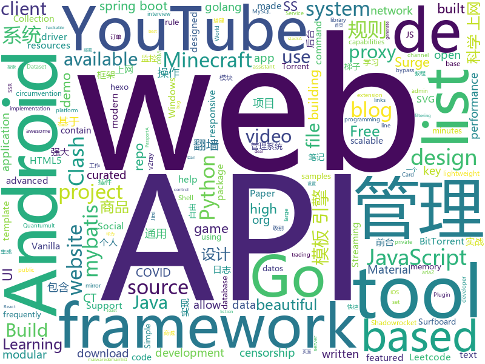

# 2020-04-05
See what the GitHub community is most excited about.

## python
+ [backend](https://github.com/ProteGO-app/backend)(**17 stars today**): Backend do uruchomienia na GCP
+ [Whole-Foods-Delivery-Slot](https://github.com/pcomputo/Whole-Foods-Delivery-Slot)(**6 stars today**): Automated script for Whole Foods and Amazon Fresh delivery slot
+ [keras](https://github.com/keras-team/keras)(**34 stars today**): Deep Learning for humans
+ [eat_tensorflow2_in_30_days](https://github.com/lyhue1991/eat_tensorflow2_in_30_days)(**518 stars today**): Tensorflow2.0🍎🍊is delicious, just eat it!😋😋
+ [Background-Matting](https://github.com/senguptaumd/Background-Matting)(**167 stars today**): Background Matting: The World is Your Green Screen
+ [system-design-primer](https://github.com/donnemartin/system-design-primer)(**605 stars today**): Learn how to design large-scale systems. Prep for the system design interview. Includes Anki flashcards.
+ [XX-Net](https://github.com/XX-net/XX-Net)(**20 stars today**): a web proxy tool
+ [COVID-CT](https://github.com/UCSD-AI4H/COVID-CT)(**67 stars today**): COVID-CT-Dataset: A CT Scan Dataset about COVID-19
+ [python-telegram-bot](https://github.com/python-telegram-bot/python-telegram-bot)(**20 stars today**): We have made you a wrapper you can't refuse
+ [covid-sanity](https://github.com/karpathy/covid-sanity)(**77 stars today**): Aspires to help the influx of bioRxiv / medRxiv papers on COVID-19
+ [kivy](https://github.com/kivy/kivy)(**8 stars today**): Open source UI framework written in Python, running on Windows, Linux, macOS, Android and iOS
+ [Real-Time-Voice-Cloning](https://github.com/CorentinJ/Real-Time-Voice-Cloning)(**36 stars today**): Clone a voice in 5 seconds to generate arbitrary speech in real-time
+ [youtube-dl](https://github.com/ytdl-org/youtube-dl)(**87 stars today**): Command-line program to download videos from YouTube.com and other video sites
+ [CenterTrack](https://github.com/xingyizhou/CenterTrack)(**94 stars today**): Simultaneous object detection and tracking using center points.
+ [PayloadsAllTheThings](https://github.com/swisskyrepo/PayloadsAllTheThings)(**26 stars today**): A list of useful payloads and bypass for Web Application Security and Pentest/CTF
+ [fortnitepy-bot](https://github.com/xMistt/fortnitepy-bot)(**4 stars today**): A Fortnite HTTP/XMPP bot coded in Python with party capabilities.
+ [saleor](https://github.com/mirumee/saleor)(**17 stars today**): A modular, high performance, headless e-commerce storefront built with Python, GraphQL, Django, and ReactJS.
+ [freqtrade](https://github.com/freqtrade/freqtrade)(**9 stars today**): Free, open source crypto trading bot
+ [hosts](https://github.com/StevenBlack/hosts)(**17 stars today**): Extending and consolidating hosts files from several well-curated sources like adaway.org, mvps.org, malwaredomainlist.com, someonewhocares.org, and potentially others. You can optionally invoke extensions to block additional sites by category.
+ [12306](https://github.com/testerSunshine/12306)(**9 stars today**): 12306智能刷票，订票
+ [RsaCtfTool](https://github.com/Ganapati/RsaCtfTool)(**4 stars today**): RSA attack tool (mainly for ctf) - retreive private key from weak public key and/or uncipher data
+ [deepchem](https://github.com/deepchem/deepchem)(**20 stars today**): Democratizing Deep-Learning for Drug Discovery, Quantum Chemistry, Materials Science and Biology
+ [volatility](https://github.com/volatilityfoundation/volatility)(**2 stars today**): An advanced memory forensics framework
+ [public-apis](https://github.com/public-apis/public-apis)(**622 stars today**): A collective list of free APIs for use in software and web development.
+ [matplotlib-cheatsheet](https://github.com/rougier/matplotlib-cheatsheet)(**55 stars today**): Matplotlib 3.1 cheat sheet.

## java
+ [spring-boot-demo](https://github.com/xkcoding/spring-boot-demo)(**100 stars today**): spring boot demo 是一个用来深度学习并实战 spring boot 的项目，目前总共包含 65 个集成demo，已经完成 53 个。 该项目已成功集成 actuator(监控)、admin(可视化监控)、logback(日志)、aopLog(通过AOP记录web请求日志)、统一异常处理(json级别和页面级别)、freemarker(模板引擎)、thymeleaf(模板引擎)、Beetl(模板引擎)、Enjoy(模板引擎)、JdbcTemplate(通用JDBC操作数据库)、JPA(强大的ORM框架)、mybatis(强大的ORM框架)、通用Mapper(快速操作Mybatis)、PageHelper(通用的Mybatis分页插件)、mybatis-plus(快速操作M…
+ [libgdx](https://github.com/libgdx/libgdx)(**45 stars today**): Desktop/Android/HTML5/iOS Java game development framework
+ [miaosha](https://github.com/qiurunze123/miaosha)(**98 stars today**): ⭐⭐⭐⭐秒杀系统设计与实现.互联网工程师进阶与分析🙋🐓
+ [spring-analysis](https://github.com/seaswalker/spring-analysis)(**48 stars today**): Spring源码阅读
+ [magento2-phpstorm-plugin](https://github.com/magento/magento2-phpstorm-plugin)(**5 stars today**): PHPStorm Plugin for Magento 2
+ [HWcode2020-TestData](https://github.com/byl0561/HWcode2020-TestData)(**18 stars today**): 华为codecraft2020模拟测试数据
+ [PretendYoureXyzzy](https://github.com/ajanata/PretendYoureXyzzy)(**6 stars today**): A web clone of the card game Cards Against Humanity.
+ [Mindustry](https://github.com/Anuken/Mindustry)(**11 stars today**): A sandbox tower defense game
+ [mall](https://github.com/macrozheng/mall)(**71 stars today**): mall项目是一套电商系统，包括前台商城系统及后台管理系统，基于SpringBoot+MyBatis实现，采用Docker容器化部署。 前台商城系统包含首页门户、商品推荐、商品搜索、商品展示、购物车、订单流程、会员中心、客户服务、帮助中心等模块。 后台管理系统包含商品管理、订单管理、会员管理、促销管理、运营管理、内容管理、统计报表、财务管理、权限管理、设置等模块。
+ [Algorithms](https://github.com/williamfiset/Algorithms)(**20 stars today**): A collection of algorithms and data structures
+ [Leetcode](https://github.com/fishercoder1534/Leetcode)(**18 stars today**): Complete solutions to Leetcode problems; updated daily. Subscribe to my YouTube channel for more.
+ [CS-Notes](https://github.com/CyC2018/CS-Notes)(**124 stars today**): 📚技术面试必备基础知识、Leetcode、计算机操作系统、计算机网络、系统设计、Java、Python、C++
+ [eureka](https://github.com/Netflix/eureka)(**7 stars today**): AWS Service registry for resilient mid-tier load balancing and failover.
+ [NewPipe](https://github.com/TeamNewPipe/NewPipe)(**17 stars today**): A libre lightweight streaming front-end for Android.
+ [Signal-Android](https://github.com/signalapp/Signal-Android)(**12 stars today**): A private messenger for Android.
+ [DragonProxy](https://github.com/DragonetMC/DragonProxy)(**5 stars today**): A proxy to allow Minecraft: Bedrock clients to connect to Minecraft: Java Edition servers.
+ [hutool](https://github.com/looly/hutool)(**159 stars today**): A set of tools that keep Java sweet.
+ [Mohist](https://github.com/Mohist-Community/Mohist)(**3 stars today**): Minecraft Forge Hybrid server implementing the Paper/Spigot/Bukkit API(1.12.2/1.15.2), formerly known as Thermos/Cauldron/MCPC+
+ [Spring-Boot-In-Action](https://github.com/hansonwang99/Spring-Boot-In-Action)(**18 stars today**): Spring Boot 系列实战合集
+ [igniter](https://github.com/trojan-gfw/igniter)(**18 stars today**): A trojan client for Android (UNDER CONSTRUCTION).
+ [MinecraftForge](https://github.com/MinecraftForge/MinecraftForge)(**3 stars today**): Modifications to the Minecraft base files to assist in compatibility between mods.
+ [Apktool](https://github.com/iBotPeaches/Apktool)(**15 stars today**): A tool for reverse engineering Android apk files
+ [TagMo](https://github.com/HiddenRamblings/TagMo)(**8 stars today**): 
+ [material-components-android](https://github.com/material-components/material-components-android)(**8 stars today**): Modular and customizable Material Design UI components for Android
+ [api-samples](https://github.com/youtube/api-samples)(**5 stars today**): Code samples for YouTube APIs, including the YouTube Data API, YouTube Analytics API, and YouTube Live Streaming API. The repo contains language-specific directories that contain the samples.

## unknown
+ [specs](https://github.com/ProteGO-app/specs)(**16 stars today**): Opis, specyfikacja i zadania. Zacznij tutaj.
+ [coronavirus-data](https://github.com/nychealth/coronavirus-data)(**93 stars today**): 
+ [awesome-android-ui](https://github.com/wasabeef/awesome-android-ui)(**23 stars today**): A curated list of awesome Android UI/UX libraries
+ [trackerslist](https://github.com/ngosang/trackerslist)(**47 stars today**): Updated list of public BitTorrent trackers
+ [clash_for_windows_pkg](https://github.com/Fndroid/clash_for_windows_pkg)(**74 stars today**): A Windows GUI based on Clash
+ [955.WLB](https://github.com/formulahendry/955.WLB)(**21 stars today**): 955 不加班的公司名单 - 工作 955，work–life balance (工作与生活的平衡)
+ [EffectivePyTorch](https://github.com/vahidk/EffectivePyTorch)(**152 stars today**): PyTorch tutorials and best practices.
+ [system_design](https://github.com/shashank88/system_design)(**13 stars today**): Preparation links and resources for system design questions
+ [build-your-own-x](https://github.com/danistefanovic/build-your-own-x)(**692 stars today**): 🤓Build your own (insert technology here)
+ [developer-roadmap](https://github.com/kamranahmedse/developer-roadmap)(**1,034 stars today**): Roadmap to becoming a web developer in 2020
+ [binance-official-api-docs](https://github.com/binance-exchange/binance-official-api-docs)(**3 stars today**): Official Documentation for the Binance APIs and Streams
+ [documents](https://github.com/DP-3T/documents)(**81 stars today**): Decentralized Privacy-Preserving Proximity Tracing -- Documents
+ [reverse-interview](https://github.com/viraptor/reverse-interview)(**70 stars today**): Questions to ask the company during your interview
+ [free-programming-books](https://github.com/EbookFoundation/free-programming-books)(**280 stars today**): 📚Freely available programming books
+ [SS-Rule-Snippet](https://github.com/Hackl0us/SS-Rule-Snippet)(**18 stars today**): 搜集、整理、维护 Surge / Quantumult / Shadowrocket / Surfboard / clash(X) 实用规则。
+ [fancyss_history_package](https://github.com/hq450/fancyss_history_package)(**35 stars today**): 科学上网插件的离线安装包储存在这里
+ [OSCP-Human-Guide](https://github.com/six2dez/OSCP-Human-Guide)(**18 stars today**): My own OSCP guide
+ [X-SwiftFormat](https://github.com/ruiaureliano/X-SwiftFormat)(**50 stars today**): X-SwiftFormat plugin for Xcode
+ [covid-chestxray-dataset](https://github.com/ieee8023/covid-chestxray-dataset)(**37 stars today**): We are building an open database of COVID-19 cases with chest X-ray or CT images.
+ [Rules](https://github.com/lhie1/Rules)(**25 stars today**): Rules / 规则：Surge / Shadowrocket / Surfboard / Clash
+ [SSR](https://github.com/DuyaoSS/SSR)(**15 stars today**): 毒药笔记
+ [new-pac](https://github.com/Alvin9999/new-pac)(**45 stars today**): 科学上网/自由上网/翻墙/软件/方法，免费shadowsocks/ss/ssr/v2ray/goflyway账号，vps一键搭建脚本/教程
+ [Resources-for-Beginner-Bug-Bounty-Hunters](https://github.com/nahamsec/Resources-for-Beginner-Bug-Bounty-Hunters)(**48 stars today**): A list of resources for those interested in getting started in bug bounties
+ [books](https://github.com/ppatil9096/books)(**5 stars today**): 
+ [app-ideas](https://github.com/florinpop17/app-ideas)(**86 stars today**): A Collection of application ideas which can be used to improve your coding skills.

## javascript
+ [covid19india-react](https://github.com/covid19india/covid19india-react)(**220 stars today**): 📊Source code of the main website
+ [nCovMemory](https://github.com/2019ncovmemory/nCovMemory)(**31 stars today**): 2020新冠肺炎记忆：报道、非虚构与个人叙述（持续更新） Memory of 2020 nCoV: Media Coverage, Non-fiction Writings, and Individual Narratives (Continuously updating)
+ [jitsi-meet](https://github.com/jitsi/jitsi-meet)(**146 stars today**): Jitsi Meet - Secure, Simple and Scalable Video Conferences that you use as a standalone app or embed in your web application.
+ [shields](https://github.com/badges/shields)(**12 stars today**): Concise, consistent, and legible badges in SVG and raster format
+ [complete-javascript-course](https://github.com/jonasschmedtmann/complete-javascript-course)(**8 stars today**): Starter files, final projects and FAQ for my Complete JavaScript course
+ [overreacted.io](https://github.com/gaearon/overreacted.io)(**6 stars today**): Personal blog by Dan Abramov.
+ [BaiduExporter](https://github.com/acgotaku/BaiduExporter)(**12 stars today**): Assistant for Baidu to export download links to aria2/aria2-rpc
+ [vanillawebprojects](https://github.com/bradtraversy/vanillawebprojects)(**23 stars today**): Mini projects built with HTML5, CSS & JavaScript. No frameworks or libraries
+ [secret-hitler](https://github.com/cozuya/secret-hitler)(**18 stars today**): A web adaptation of the social deduction board game Secret Hitler. https://secrethitler.io
+ [iptv](https://github.com/iptv-org/iptv)(**25 stars today**): Collection of 8000+ publicly available IPTV channels from all over the world
+ [gatsby](https://github.com/gatsbyjs/gatsby)(**41 stars today**): Build blazing fast, modern apps and websites with React
+ [webpack-starter](https://github.com/wbkd/webpack-starter)(**3 stars today**): ✨A lightweight foundation for your next webpack based frontend project.
+ [JavaScript-21-Days-Challenge](https://github.com/lvarayut/JavaScript-21-Days-Challenge)(**25 stars today**): 🔥คอร์สฟรี! สร้าง 21 โปรเจค ใน 21 วัน ไม่ใช้เฟรมเวิร์ค ไม่ใช้ไลบรารี
+ [semana-omnistack-11](https://github.com/Rocketseat/semana-omnistack-11)(**23 stars today**): Código produzido durante a Semana OmniStack 11.0
+ [Motrix](https://github.com/agalwood/Motrix)(**72 stars today**): A full-featured download manager.
+ [AdminLTE](https://github.com/ColorlibHQ/AdminLTE)(**23 stars today**): AdminLTE - Free admin dashboard template based on Bootstrap 4 & 3
+ [atom](https://github.com/atom/atom)(**13 stars today**): The hackable text editor
+ [MagicMirror](https://github.com/MichMich/MagicMirror)(**11 stars today**): MagicMirror² is an open source modular smart mirror platform. With a growing list of installable modules, the MagicMirror² allows you to convert your hallway or bathroom mirror into your personal assistant.
+ [Script](https://github.com/NobyDa/Script)(**13 stars today**): This project is based on the scripting capabilities of two excellent iOS proxy tools, Quantumult X or Surge.
+ [30-seconds-of-code](https://github.com/30-seconds/30-seconds-of-code)(**41 stars today**): Short JavaScript code snippets for all your development needs
+ [node_passport_login](https://github.com/bradtraversy/node_passport_login)(**6 stars today**): Node.js login, registration and access control using Express and Passport
+ [EdgeTranslate](https://github.com/EdgeTranslate/EdgeTranslate)(**9 stars today**): A translator extension.
+ [notyf](https://github.com/caroso1222/notyf)(**111 stars today**): 👻A minimalistic, responsive, vanilla JavaScript library to show toast notifications.
+ [devconnector_2.0](https://github.com/bradtraversy/devconnector_2.0)(**5 stars today**): Social network for developers, built on the MERN stack
+ [ccxt](https://github.com/ccxt/ccxt)(**9 stars today**): A JavaScript / Python / PHP cryptocurrency trading API with support for more than 120 bitcoin/altcoin exchanges

## html
+ [lozya](https://github.com/capnmidnight/lozya)(**63 stars today**): Virtual Meetups through Jitsi
+ [web-dev-starter](https://github.com/pluralsight/web-dev-starter)(**1 stars today**): 
+ [ruMount-BladeBannerlord](https://github.com/DOG729/ruMount-BladeBannerlord)(**15 stars today**): Русификатор Mount&Blade Bannerlord
+ [HiddenEye](https://github.com/DarkSecDevelopers/HiddenEye)(**8 stars today**): Modern Phishing Tool With Advanced Functionality And Multiple Tunnelling Services [ Android-Support-Available ]
+ [Minecraft](https://github.com/Calada2/Minecraft)(**8 stars today**): Minecraft made in CSS3D
+ [ACL4SSR](https://github.com/ACL4SSR/ACL4SSR)(**26 stars today**): SSR 去广告ACL规则/SS完整GFWList规则/Clash规则碎片，Telegram频道订阅地址
+ [luci-app-clash](https://github.com/frainzy1477/luci-app-clash)(**7 stars today**): Luci interface for Clash Openwrt
+ [learning-area](https://github.com/mdn/learning-area)(**6 stars today**): Github repo for the MDN Learning Area.
+ [Spoon-Knife](https://github.com/octocat/Spoon-Knife)(**2 stars today**): This repo is for demonstration purposes only.
+ [node-ytdl-core](https://github.com/fent/node-ytdl-core)(**3 stars today**): YouTube video downloader in javascript.
+ [MIXBOX](https://github.com/monlor/MIXBOX)(**7 stars today**): 一款基于Shell的小米路由器工具箱，原为Monlor-Tools，A tool box for XiaoMi Router base on Shell.
+ [hexo-theme-matery](https://github.com/blinkfox/hexo-theme-matery)(**15 stars today**): A beautiful hexo blog theme with material design and responsive design.一个基于材料设计和响应式设计而成的全面、美观的Hexo主题。
+ [JavaScript30](https://github.com/wesbos/JavaScript30)(**9 stars today**): 30 Day Vanilla JS Challenge
+ [OpenClash](https://github.com/vernesong/OpenClash)(**11 stars today**): A Clash Client For OpenWrt
+ [tabler-icons](https://github.com/tabler/tabler-icons)(**85 stars today**): A set of over 400 free MIT-licensed high-quality SVG icons for you to use in your web projects.
+ [hugo-academic](https://github.com/gcushen/hugo-academic)(**4 stars today**): 📝The website builder for Hugo. Build and deploy a beautiful website in minutes!
+ [hyperblog](https://github.com/freddier/hyperblog)(**9 stars today**): Un blog increíble para el curso de Git y Github de Platzi
+ [realworld](https://github.com/sveltejs/realworld)(**1 stars today**): Svelte/Sapper implementation of the RealWorld app
+ [beautiful-jekyll](https://github.com/daattali/beautiful-jekyll)(**4 stars today**): ✨Build a beautiful and simple website in literally minutes. Demo at http://deanattali.com/beautiful-jekyll
+ [qiubaiying.github.io](https://github.com/qiubaiying/qiubaiying.github.io)(**5 stars today**): BY Blog ->
+ [datasets](https://github.com/datadista/datasets)(**5 stars today**): Fuente de datos de los reportajes y proyectos de periodismo de investigación y datos de DATADISTA
+ [ecma262](https://github.com/tc39/ecma262)(**32 stars today**): Status, process, and documents for ECMA-262
+ [northendlab-hugo](https://github.com/themefisher/northendlab-hugo)(**0 stars today**): Hugo blog template.
+ [Coursera-ML-AndrewNg-Notes](https://github.com/fengdu78/Coursera-ML-AndrewNg-Notes)(**46 stars today**): 吴恩达老师的机器学习课程个人笔记
+ [huxblog-boilerplate](https://github.com/Huxpro/huxblog-boilerplate)(**1 stars today**): Boilerplate of Hux Blog

## go
+ [hugo](https://github.com/gohugoio/hugo)(**41 stars today**): The world’s fastest framework for building websites.
+ [v2ray-core](https://github.com/v2ray/v2ray-core)(**74 stars today**): A platform for building proxies to bypass network restrictions.
+ [goro](https://github.com/aunum/goro)(**35 stars today**): A High-level Machine Learning Library for Go
+ [clash](https://github.com/Dreamacro/clash)(**57 stars today**): A rule-based tunnel in Go.
+ [FreePAC](https://github.com/xiaoming2028/FreePAC)(**16 stars today**): 科学上网/梯子/自由上网/翻墙 SS/SSR/V2Ray/Brook 搭建教程
+ [go](https://github.com/golang/go)(**56 stars today**): The Go programming language
+ [awesome-go](https://github.com/avelino/awesome-go)(**43 stars today**): A curated list of awesome Go frameworks, libraries and software
+ [colly](https://github.com/gocolly/colly)(**17 stars today**): Elegant Scraper and Crawler Framework for Golang
+ [go-ipfs](https://github.com/ipfs/go-ipfs)(**4 stars today**): IPFS implementation in Go
+ [geph2](https://github.com/geph-official/geph2)(**5 stars today**): Geph (迷霧通) is a modular Internet censorship circumvention system designed specifically to deal with national filtering.
+ [slack](https://github.com/slack-go/slack)(**10 stars today**): Slack API in Go - community-maintained fork created by the original author, @nlopes
+ [torrent](https://github.com/anacrolix/torrent)(**2 stars today**): Full-featured BitTorrent client package and utilities
+ [cloud-torrent](https://github.com/jpillora/cloud-torrent)(**4 stars today**): ☁️Cloud Torrent: a self-hosted remote torrent client
+ [learn-go-with-tests](https://github.com/quii/learn-go-with-tests)(**17 stars today**): Learn Go with test-driven development
+ [lantern](https://github.com/getlantern/lantern)(**30 stars today**): Lantern官方版本下载 蓝灯 翻墙 代理 科学上网 外网 加速器 梯子 路由 lantern proxy vpn censorship-circumvention censorship gfw accelerator
+ [gin](https://github.com/gin-gonic/gin)(**73 stars today**): Gin is a HTTP web framework written in Go (Golang). It features a Martini-like API with much better performance -- up to 40 times faster. If you need smashing performance, get yourself some Gin.
+ [lnd](https://github.com/lightningnetwork/lnd)(**4 stars today**): Lightning Network Daemon⚡️
+ [fleet](https://github.com/rancher/fleet)(**94 stars today**): Manage large fleets of Kubernetes clusters
+ [build-web-application-with-golang](https://github.com/astaxie/build-web-application-with-golang)(**24 stars today**): A golang ebook intro how to build a web with golang
+ [etcd](https://github.com/etcd-io/etcd)(**37 stars today**): Distributed reliable key-value store for the most critical data of a distributed system
+ [cortex](https://github.com/cortexproject/cortex)(**59 stars today**): A horizontally scalable, highly available, multi-tenant, long term Prometheus.
+ [micro](https://github.com/zyedidia/micro)(**23 stars today**): A modern and intuitive terminal-based text editor
+ [cheat](https://github.com/cheat/cheat)(**9 stars today**): cheat allows you to create and view interactive cheatsheets on the command-line. It was designed to help remind *nix system administrators of options for commands that they use frequently, but not frequently enough to remember.
+ [gobuster](https://github.com/OJ/gobuster)(**7 stars today**): Directory/File, DNS and VHost busting tool written in Go
+ [mysql](https://github.com/go-sql-driver/mysql)(**7 stars today**): Go MySQL Driver is a MySQL driver for Go's (golang) database/sql package

## WordCloud

