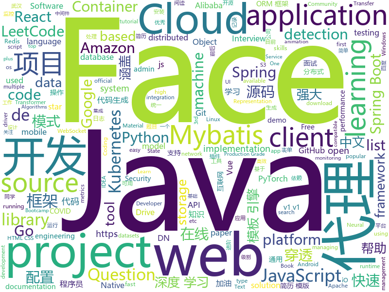

# 2020-04-08
See what the GitHub community is most excited about.

## python
+ [pluradl.py](https://github.com/rojter-tech/pluradl.py)(**28 stars today**): Automated download of Pluralsight courses
+ [text-to-text-transfer-transformer](https://github.com/google-research/text-to-text-transfer-transformer)(**54 stars today**): Code for the paper "Exploring the Limits of Transfer Learning with a Unified Text-to-Text Transformer"
+ [skillbox-async-chat](https://github.com/manchenkoff/skillbox-async-chat)(**15 stars today**): Пример клиент-серверного чата на Python для Skillbox
+ [Background-Matting](https://github.com/senguptaumd/Background-Matting)(**231 stars today**): Background Matting: The World is Your Green Screen
+ [Whole-Foods-Delivery-Slot](https://github.com/pcomputo/Whole-Foods-Delivery-Slot)(**35 stars today**): Automated script for Whole Foods and Amazon Fresh delivery slot
+ [nerf-pytorch](https://github.com/yenchenlin/nerf-pytorch)(**44 stars today**): A PyTorch implementation of NeRF (Neural Radiance Fields) that reproduces the results.
+ [interview_internal_reference](https://github.com/0voice/interview_internal_reference)(**40 stars today**): 2019年最新总结，阿里，腾讯，百度，美团，头条等技术面试题目，以及答案，专家出题人分析汇总。
+ [GitHub-Chinese-Top-Charts](https://github.com/kon9chunkit/GitHub-Chinese-Top-Charts)(**107 stars today**): 🇨🇳GitHub中文排行榜，帮助你发现高分优秀中文项目、更高效地吸收国人的优秀经验成果；榜单每周更新一次，敬请关注！（武汉加油！中国加油！世界加油！）
+ [qiling](https://github.com/qilingframework/qiling)(**14 stars today**): Qiling Advanced Binary Emulation Framework
+ [Games](https://github.com/CharlesPikachu/Games)(**21 stars today**): Some games created by python code.
+ [d2l-zh](https://github.com/d2l-ai/d2l-zh)(**35 stars today**): 《动手学深度学习》：面向中文读者、能运行、可讨论。英文版即伯克利“深度学习导论”教材。
+ [zipline](https://github.com/quantopian/zipline)(**27 stars today**): Zipline, a Pythonic Algorithmic Trading Library
+ [sagemaker-python-sdk](https://github.com/aws/sagemaker-python-sdk)(**4 stars today**): A library for training and deploying machine learning models on Amazon SageMaker
+ [maskrcnn-benchmark](https://github.com/facebookresearch/maskrcnn-benchmark)(**8 stars today**): Fast, modular reference implementation of Instance Segmentation and Object Detection algorithms in PyTorch.
+ [Python](https://github.com/TheAlgorithms/Python)(**72 stars today**): All Algorithms implemented in Python
+ [DeepMatch](https://github.com/shenweichen/DeepMatch)(**68 stars today**): A deep matching model library for recommendations & advertising. It's easy to train models and to export representation vectors for user and item which can be used for ANN search.
+ [ObstructionRemoval](https://github.com/alex04072000/ObstructionRemoval)(**57 stars today**): [CVPR 2020] Learning to See Through Obstructions
+ [mkdocs](https://github.com/mkdocs/mkdocs)(**84 stars today**): Project documentation with Markdown.
+ [transformers](https://github.com/huggingface/transformers)(**77 stars today**): 🤗Transformers: State-of-the-art Natural Language Processing for TensorFlow 2.0 and PyTorch.
+ [Question-Answering-Albert-Electra](https://github.com/renatoviolin/Question-Answering-Albert-Electra)(**22 stars today**): Question Answering using Albert and Electra
+ [glances](https://github.com/nicolargo/glances)(**29 stars today**): Glances an Eye on your system. A top/htop alternative for GNU/Linux, BSD, Mac OS and Windows operating systems.
+ [kedro](https://github.com/quantumblacklabs/kedro)(**8 stars today**): A Python library that implements software engineering best-practice for data and ML pipelines.
+ [CenterNet](https://github.com/xingyizhou/CenterNet)(**22 stars today**): Object detection, 3D detection, and pose estimation using center point detection:
+ [kivy](https://github.com/kivy/kivy)(**23 stars today**): Open source UI framework written in Python, running on Windows, Linux, macOS, Android and iOS
+ [pyqtgraph](https://github.com/pyqtgraph/pyqtgraph)(**3 stars today**): Fast data visualization and GUI tools for scientific / engineering applications

## java
+ [spring-analysis](https://github.com/seaswalker/spring-analysis)(**82 stars today**): Spring源码阅读
+ [spring-boot-demo](https://github.com/xkcoding/spring-boot-demo)(**249 stars today**): spring boot demo 是一个用来深度学习并实战 spring boot 的项目，目前总共包含 65 个集成demo，已经完成 53 个。 该项目已成功集成 actuator(监控)、admin(可视化监控)、logback(日志)、aopLog(通过AOP记录web请求日志)、统一异常处理(json级别和页面级别)、freemarker(模板引擎)、thymeleaf(模板引擎)、Beetl(模板引擎)、Enjoy(模板引擎)、JdbcTemplate(通用JDBC操作数据库)、JPA(强大的ORM框架)、mybatis(强大的ORM框架)、通用Mapper(快速操作Mybatis)、PageHelper(通用的Mybatis分页插件)、mybatis-plus(快速操作M…
+ [SpringBoot-Labs](https://github.com/YunaiV/SpringBoot-Labs)(**36 stars today**): 一个涵盖六个专栏：Spring Boot 2.X、Spring Cloud、Spring Cloud Alibaba、Dubbo、分布式消息队列、分布式事务的仓库。希望胖友小手一抖，右上角来个 Star，感恩 1024
+ [spring-cloud-alibaba](https://github.com/alibaba/spring-cloud-alibaba)(**36 stars today**): Spring Cloud Alibaba provides a one-stop solution for application development for the distributed solutions of Alibaba middleware.
+ [skywalking](https://github.com/apache/skywalking)(**25 stars today**): APM, Application Performance Monitoring System
+ [jeecg-boot](https://github.com/zhangdaiscott/jeecg-boot)(**33 stars today**): 一款基于代码生成器的JAVA快速开发平台，开源界“小普元”超越传统商业企业级开发平台！采用前后端分离架构：SpringBoot 2.x，Ant Design&Vue，Mybatis-plus，Shiro，JWT。强大的代码生成器让前后端代码一键生成，无需写任何代码! 引领新的开发模式(OnlineCoding模式-> 代码生成器模式-> 手工MERGE智能开发)，帮助Java项目解决70%的重复工作，让开发更多关注业务逻辑。既能快速提高开发效率，帮助公司节省成本，同时又不失灵活性。JeecgBoot还独创在线开发模式（No代码）：在线表单配置（表单设计器）、移动配置能力、在线工作流配置（流程设计器）、在线报表配置、在线图表配置、插件能力（可插拔）等等
+ [advanced-java](https://github.com/doocs/advanced-java)(**76 stars today**): 😮互联网 Java 工程师进阶知识完全扫盲：涵盖高并发、分布式、高可用、微服务、海量数据处理等领域知识，后端同学必看，前端同学也可学习
+ [spring-cloud-netflix](https://github.com/spring-cloud/spring-cloud-netflix)(**2 stars today**): Integration with Netflix OSS components
+ [flink](https://github.com/apache/flink)(**12 stars today**): Apache Flink
+ [spring-boot](https://github.com/spring-projects/spring-boot)(**32 stars today**): Spring Boot
+ [strimzi-kafka-operator](https://github.com/strimzi/strimzi-kafka-operator)(**1 stars today**): Apache Kafka running on Kubernetes
+ [LeetCodeAnimation](https://github.com/MisterBooo/LeetCodeAnimation)(**75 stars today**): Demonstrate all the questions on LeetCode in the form of animation.（用动画的形式呈现解LeetCode题目的思路）
+ [capacitor](https://github.com/ionic-team/capacitor)(**7 stars today**): Build cross-platform Native Progressive Web Apps for iOS, Android, and the web⚡️
+ [easyexcel](https://github.com/alibaba/easyexcel)(**32 stars today**): 快速、简单避免OOM的java处理Excel工具
+ [camel](https://github.com/apache/camel)(**3 stars today**): Apache Camel
+ [okhttp](https://github.com/square/okhttp)(**21 stars today**): Square’s meticulous HTTP client for Java and Kotlin.
+ [JavaGuide](https://github.com/Snailclimb/JavaGuide)(**155 stars today**): 【Java学习+面试指南】 一份涵盖大部分Java程序员所需要掌握的核心知识。
+ [tutorials](https://github.com/eugenp/tutorials)(**19 stars today**): Just Announced - "Learn Spring Security OAuth":
+ [micrometer](https://github.com/micrometer-metrics/micrometer)(**6 stars today**): An application metrics facade for the most popular monitoring tools. Think SLF4J, but for metrics.
+ [sagacity-sqltoy](https://github.com/chenrenfei/sagacity-sqltoy)(**23 stars today**): 基于java语言比mybatis更实用的orm框架，支持mysql、oracle、postgresql、sqlserver、db2、mongodb、elasticsearch
+ [guava](https://github.com/google/guava)(**22 stars today**): Google core libraries for Java
+ [rest-assured](https://github.com/rest-assured/rest-assured)(**5 stars today**): Java DSL for easy testing of REST services
+ [spring-cloud-kubernetes](https://github.com/spring-cloud/spring-cloud-kubernetes)(**2 stars today**): Kubernetes integration with Spring Cloud Discovery Client, Configuration, etc...
+ [dubbo-spring-boot-project](https://github.com/apache/dubbo-spring-boot-project)(**7 stars today**): Spring Boot Project for Apache Dubbo
+ [usb-serial-for-android](https://github.com/mik3y/usb-serial-for-android)(**6 stars today**): Android USB host serial driver library for CDC, FTDI, Arduino and other devices.

## unknown
+ [wuhan2020-timeline](https://github.com/Pratitya/wuhan2020-timeline)(**183 stars today**): 以 社会学年鉴模式体例规范地统编自2019年12月起武汉新冠肺炎疫情进展的时间线。
+ [flutter_roadmap](https://github.com/olexale/flutter_roadmap)(**29 stars today**): 
+ [reverse-interview](https://github.com/viraptor/reverse-interview)(**193 stars today**): Questions to ask the company during your interview
+ [what-happens-when-k8s](https://github.com/jamiehannaford/what-happens-when-k8s)(**106 stars today**): 🤔What happens when I type kubectl run?
+ [bootcamp-gostack-desafios](https://github.com/Rocketseat/bootcamp-gostack-desafios)(**33 stars today**): Repositório contendo todos os desafios dos módulos do Bootcamp Gostack
+ [effective-java-3rd-chinese](https://github.com/sjsdfg/effective-java-3rd-chinese)(**72 stars today**): effective-java-3rd 中文版 https://sjsdfg.github.io/effective-java-3rd-chinese
+ [kubernetes-the-hard-way](https://github.com/kelseyhightower/kubernetes-the-hard-way)(**19 stars today**): Bootstrap Kubernetes the hard way on Google Cloud Platform. No scripts.
+ [git-github](https://github.com/gustavoguanabara/git-github)(**10 stars today**): Material do Curso de Git e GitHub
+ [app-ideas](https://github.com/florinpop17/app-ideas)(**132 stars today**): A Collection of application ideas which can be used to improve your coding skills.
+ [documents](https://github.com/DP-3T/documents)(**33 stars today**): Decentralized Privacy-Preserving Proximity Tracing -- Documents
+ [awesome-public-datasets](https://github.com/awesomedata/awesome-public-datasets)(**30 stars today**): A topic-centric list of HQ open datasets.
+ [everyone-can-use-english](https://github.com/xiaolai/everyone-can-use-english)(**7 stars today**): 人人都能用英语
+ [3y](https://github.com/ZhongFuCheng3y/3y)(**48 stars today**): 📓从Java基础、JavaWeb基础到常用的框架再到面试题都有完整的教程，几乎涵盖了Java后端必备的知识点
+ [awesome-Face_Recognition](https://github.com/ChanChiChoi/awesome-Face_Recognition)(**7 stars today**): papers about Face Detection; Face Alignment; Face Recognition && Face Identification && Face Verification && Face Representation; Face Reconstruction; Face Tracking; Face Super-Resolution && Face Deblurring; Face Generation && Face Synthesis; Face Transfer; Face Anti-Spoofing; Face Retrieval;
+ [intellij-community](https://github.com/JetBrains/intellij-community)(**11 stars today**): IntelliJ IDEA Community Edition
+ [COVID-19](https://github.com/pcm-dpc/COVID-19)(**22 stars today**): COVID-19 Italia - Monitoraggio situazione
+ [reactjs-interview-questions](https://github.com/sudheerj/reactjs-interview-questions)(**10 stars today**): List of top 500 ReactJS Interview Questions & Answers....Coding exercise questions are coming soon!!
+ [Deep-learning-books](https://github.com/loveunk/Deep-learning-books)(**13 stars today**): Books for machine learning, deep learning, math, NLP, CV, RL, etc. 一些机器学习、深度学习等相关话题的书籍。
+ [Lab-Demo-Recordings](https://github.com/MicrosoftLearning/Lab-Demo-Recordings)(**3 stars today**): Recordings and Demos of Labs
+ [awesome-database-learning](https://github.com/pingcap/awesome-database-learning)(**22 stars today**): A list of learning materials to understand databases internals
+ [project-based-learning](https://github.com/tuvtran/project-based-learning)(**89 stars today**): Curated list of project-based tutorials
+ [landscape](https://github.com/cncf/landscape)(**6 stars today**): 🌄The Cloud Native Interactive Landscape filters and sorts hundreds of projects and products, and shows details including GitHub stars, funding or market cap, first and last commits, contributor counts, headquarters location, and recent tweets.
+ [GNNPapers](https://github.com/thunlp/GNNPapers)(**14 stars today**): Must-read papers on graph neural networks (GNN)
+ [git-recipes](https://github.com/geeeeeeeeek/git-recipes)(**9 stars today**): 🥡 Git recipes in Chinese by Zhongyi Tong. 高质量的Git中文教程.
+ [open-data](https://github.com/statsbomb/open-data)(**4 stars today**): Free football data from StatsBomb

## javascript
+ [ac-nh-turnip-prices](https://github.com/mikebryant/ac-nh-turnip-prices)(**57 stars today**): Price calculator/predictor for Turnip prices
+ [awesome-selfhosted](https://github.com/awesome-selfhosted/awesome-selfhosted)(**132 stars today**): A list of Free Software network services and web applications which can be hosted locally. Selfhosting is the process of hosting and managing applications instead of renting from Software-as-a-Service providers
+ [anime](https://github.com/juliangarnier/anime)(**62 stars today**): JavaScript animation engine
+ [brim](https://github.com/brimsec/brim)(**40 stars today**): Desktop application to efficiently search large packet captures and Zeek logs.
+ [bootstrap](https://github.com/twbs/bootstrap)(**50 stars today**): The most popular HTML, CSS, and JavaScript framework for developing responsive, mobile first projects on the web.
+ [Glasscord](https://github.com/AryToNeX/Glasscord)(**36 stars today**): Providing composition effects to the Discord client.
+ [Motrix](https://github.com/agalwood/Motrix)(**89 stars today**): A full-featured download manager.
+ [leetcode](https://github.com/azl397985856/leetcode)(**109 stars today**): LeetCode Solutions: A Record of My Problem Solving Journey.( leetcode题解，记录自己的leetcode解题之路。)
+ [taro](https://github.com/NervJS/taro)(**27 stars today**): 多端统一开发框架，支持用 React 的开发方式编写一次代码，生成能运行在微信/百度/支付宝/字节跳动/ QQ 小程序/快应用/H5/React Native 等的应用。 https://taro.jd.com/
+ [clean-code-javascript](https://github.com/ryanmcdermott/clean-code-javascript)(**44 stars today**): 🛁Clean Code concepts adapted for JavaScript
+ [graphql-engine](https://github.com/hasura/graphql-engine)(**62 stars today**): Blazing fast, instant realtime GraphQL APIs on Postgres with fine grained access control, also trigger webhooks on database events.
+ [vue](https://github.com/vuejs/vue)(**105 stars today**): 🖖Vue.js is a progressive, incrementally-adoptable JavaScript framework for building UI on the web.
+ [vue-router](https://github.com/vuejs/vue-router)(**14 stars today**): 🚦The official router for Vue.js.
+ [axios](https://github.com/axios/axios)(**70 stars today**): Promise based HTTP client for the browser and node.js
+ [web-skills](https://github.com/andreasbm/web-skills)(**210 stars today**): A visual overview of useful skills to learn as a web developer
+ [plotly.js](https://github.com/plotly/plotly.js)(**24 stars today**): Open-source JavaScript charting library behind Plotly and Dash
+ [kubernetes-tutorial](https://github.com/redhat-developer-demos/kubernetes-tutorial)(**10 stars today**): Kubernetes Tutorial for https://dn.dev/master
+ [sheetjs](https://github.com/SheetJS/sheetjs)(**17 stars today**): 📗SheetJS Community Edition -- Spreadsheet Data Toolkit
+ [next.js](https://github.com/zeit/next.js)(**45 stars today**): The React Framework
+ [node](https://github.com/nodejs/node)(**35 stars today**): Node.js JavaScript runtime✨🐢🚀✨
+ [lerna](https://github.com/lerna/lerna)(**25 stars today**): 🐉A tool for managing JavaScript projects with multiple packages.
+ [fullstack-course4](https://github.com/jhu-ep-coursera/fullstack-course4)(**9 stars today**): Example code for HTML, CSS, and Javascript for Web Developers Coursera Course
+ [generator-jhipster](https://github.com/jhipster/generator-jhipster)(**10 stars today**): Open Source application platform for creating Spring Boot + Angular/React projects in seconds!
+ [cockpit](https://github.com/cockpit-project/cockpit)(**10 stars today**): There's code a goin' on
+ [slate](https://github.com/slatedocs/slate)(**33 stars today**): Beautiful static documentation for your API

## html
+ [awesome-compose](https://github.com/docker/awesome-compose)(**78 stars today**): Awesome Docker Compose samples
+ [deplacement-covid-19](https://github.com/LAB-MI/deplacement-covid-19)(**32 stars today**): Service de génération de l'attestation de déplacement dérogatoire à présenter dans le cadre du confinement lié au virus covid-19
+ [free-for-dev](https://github.com/ripienaar/free-for-dev)(**90 stars today**): A list of SaaS, PaaS and IaaS offerings that have free tiers of interest to devops and infradev
+ [html-css](https://github.com/gustavoguanabara/html-css)(**16 stars today**): Curso de HTML5 e CSS3
+ [AceleraDev-React-Online](https://github.com/codenation-dev/AceleraDev-React-Online)(**23 stars today**): AceleraDev React Online
+ [machine-learning-systems-design](https://github.com/chiphuyen/machine-learning-systems-design)(**44 stars today**): A booklet on machine learning systems design with exercises
+ [javascript](https://github.com/gustavoguanabara/javascript)(**11 stars today**): Curso de JavaScript
+ [AttackVectors](https://github.com/MassMove/AttackVectors)(**43 stars today**): A repository to monitor attack vectors from state-backed information operations
+ [swagger-codegen](https://github.com/swagger-api/swagger-codegen)(**9 stars today**): swagger-codegen contains a template-driven engine to generate documentation, API clients and server stubs in different languages by parsing your OpenAPI / Swagger definition.
+ [covid19](https://github.com/datameet/covid19)(**4 stars today**): Novel Corona Virus - COVID-19 India Datasets by DataMeet
+ [mxgraph](https://github.com/jgraph/mxgraph)(**8 stars today**): mxGraph is a fully client side JavaScript diagramming library
+ [webdevbootcamp](https://github.com/nax3t/webdevbootcamp)(**7 stars today**): All source code for back-end projects from the Web Developer Bootcamp
+ [source-code-hunter](https://github.com/doocs/source-code-hunter)(**10 stars today**): 🤓有被“读过哪些知名的开源项目源码？”这种问题所困扰过吗？加入我们，一起通读互联网公司主流框架及中间件源码，成为强大的“源码猎人”，目前开放的有 Spring 系列框架、Mybatis 框架、Netty 框架，及 Redis、Tomcat 中间件等。本项目致力于使源码阅读这件事变得更简单有趣，且有价值。如果本项目对您有帮助，请watch、star、fork 素质三连一波，鼓励一下作者，谢谢。
+ [zfaka](https://github.com/zlkbdotnet/zfaka)(**9 stars today**): 免费、安全、稳定、高效的发卡系统，值得拥有!
+ [ML-notes](https://github.com/Sakura-gh/ML-notes)(**12 stars today**): notes about machine learning
+ [google-covid19-mobility-reports](https://github.com/vitorbaptista/google-covid19-mobility-reports)(**9 stars today**): Data extraction of Google's COVID-19 Mobility Reports
+ [gentelella](https://github.com/ColorlibHQ/gentelella)(**11 stars today**): Free Bootstrap 4 Admin Dashboard Template
+ [craftinginterpreters](https://github.com/munificent/craftinginterpreters)(**54 stars today**): Repository for the book "Crafting Interpreters"
+ [varharrie.github.io](https://github.com/varHarrie/varharrie.github.io)(**2 stars today**): 📘Personal blog.
+ [fonts](https://github.com/google/fonts)(**8 stars today**): Font files available from Google Fonts
+ [owasp-mstg](https://github.com/OWASP/owasp-mstg)(**8 stars today**): The Mobile Security Testing Guide (MSTG) is a comprehensive manual for mobile app security development, testing and reverse engineering.
+ [awesome-resume](https://github.com/resumejob/awesome-resume)(**11 stars today**): 程序员简历例句，程序员简历范例，Java简历模版，Python简历模版，C++简历模版
+ [docsy](https://github.com/google/docsy)(**3 stars today**): A set of Hugo doc templates for launching open source content.
+ [Graphics](https://github.com/Unity-Technologies/Graphics)(**7 stars today**): 
+ [Java-Interview-Advanced](https://github.com/shishan100/Java-Interview-Advanced)(**13 stars today**): 中华石杉--互联网Java进阶面试训练营

## go
+ [crawlab](https://github.com/crawlab-team/crawlab)(**224 stars today**): Distributed web crawler admin platform for spiders management regardless of languages and frameworks.
+ [logrus](https://github.com/sirupsen/logrus)(**18 stars today**): Structured, pluggable logging for Go.
+ [kubernetes](https://github.com/kubernetes/kubernetes)(**36 stars today**): Production-Grade Container Scheduling and Management
+ [rclone](https://github.com/rclone/rclone)(**355 stars today**): "rsync for cloud storage" - Google Drive, Amazon Drive, S3, Dropbox, Backblaze B2, One Drive, Swift, Hubic, Cloudfiles, Google Cloud Storage, Yandex Files
+ [eksctl](https://github.com/weaveworks/eksctl)(**5 stars today**): The official CLI for Amazon EKS
+ [mongo-go-driver](https://github.com/mongodb/mongo-go-driver)(**7 stars today**): The Go driver for MongoDB
+ [thanos](https://github.com/thanos-io/thanos)(**13 stars today**): Highly available Prometheus setup with long term storage capabilities. CNCF Sandbox project.
+ [sealos](https://github.com/fanux/sealos)(**34 stars today**): kubernetes高可用安装（kubernetes install）工具，一条命令，离线安装，包含所有依赖，内核负载不依赖haproxy keepalived,纯golang开发,99年证书,支持v1.16.8 v1.15.11 v1.17.4 v1.18.0!
+ [redis](https://github.com/go-redis/redis)(**19 stars today**): Type-safe Redis client for Golang
+ [moby](https://github.com/moby/moby)(**11 stars today**): Moby Project - a collaborative project for the container ecosystem to assemble container-based systems
+ [yq](https://github.com/mikefarah/yq)(**9 stars today**): yq is a portable command-line YAML processor
+ [goproxy](https://github.com/snail007/goproxy)(**39 stars today**): Proxy是高性能全功能的http代理、https代理、socks5代理、内网穿透、内网穿透p2p、内网穿透代理、内网穿透反向代理、内网穿透服务器、Websocket代理、TCP代理、UDP代理、DNS代理、DNS加密代理，代理API认证，全能跨平台代理服务器。
+ [cron](https://github.com/robfig/cron)(**9 stars today**): a cron library for go
+ [flux](https://github.com/fluxcd/flux)(**13 stars today**): The GitOps Kubernetes operator
+ [tidb](https://github.com/pingcap/tidb)(**13 stars today**): TiDB is an open source distributed HTAP database compatible with the MySQL protocol
+ [go](https://github.com/golang/go)(**63 stars today**): The Go programming language
+ [packer](https://github.com/hashicorp/packer)(**3 stars today**): Packer is a tool for creating identical machine images for multiple platforms from a single source configuration.
+ [minio](https://github.com/minio/minio)(**19 stars today**): MinIO is a high performance object storage server compatible with Amazon S3 APIs
+ [kops](https://github.com/kubernetes/kops)(**7 stars today**): Kubernetes Operations (kops) - Production Grade K8s Installation, Upgrades, and Management
+ [go-interview](https://github.com/shomali11/go-interview)(**36 stars today**): Collection of Technical Interview Questions solved with Go
+ [argo](https://github.com/argoproj/argo)(**46 stars today**): Argo Workflows: Get stuff done with Kubernetes.
+ [blackbox_exporter](https://github.com/prometheus/blackbox_exporter)(**3 stars today**): Blackbox prober exporter
+ [websocket](https://github.com/gorilla/websocket)(**12 stars today**): A fast, well-tested and widely used WebSocket implementation for Go.
+ [echo](https://github.com/labstack/echo)(**16 stars today**): High performance, minimalist Go web framework
+ [cri-o](https://github.com/cri-o/cri-o)(**2 stars today**): Open Container Initiative-based implementation of Kubernetes Container Runtime Interface

## WordCloud

