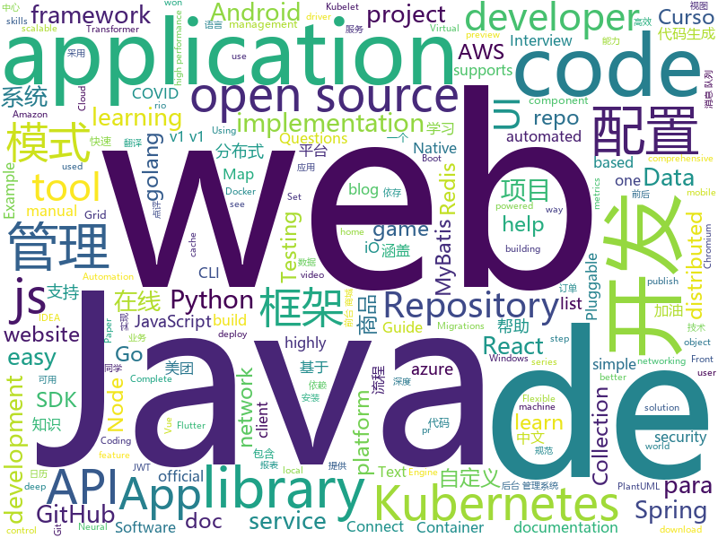

# 2020-04-10
See what the GitHub community is most excited about.

## python
+ [pluradl.py](https://github.com/rojter-tech/pluradl.py)(**63 stars today**): Automated download of Pluralsight courses
+ [SReC](https://github.com/caoscott/SReC)(**120 stars today**): PyTorch Implementation of "Lossless Image Compression through Super-Resolution"
+ [interview_internal_reference](https://github.com/0voice/interview_internal_reference)(**105 stars today**): 2019年最新总结，阿里，腾讯，百度，美团，头条等技术面试题目，以及答案，专家出题人分析汇总。
+ [face_recognition](https://github.com/ageitgey/face_recognition)(**58 stars today**): The world's simplest facial recognition api for Python and the command line
+ [skillbox-async-chat](https://github.com/manchenkoff/skillbox-async-chat)(**13 stars today**): Пример клиент-серверного чата на Python для Skillbox
+ [deocclusion](https://github.com/XiaohangZhan/deocclusion)(**39 stars today**): Code for our CVPR 2020 work.
+ [text-to-text-transfer-transformer](https://github.com/google-research/text-to-text-transfer-transformer)(**34 stars today**): Code for the paper "Exploring the Limits of Transfer Learning with a Unified Text-to-Text Transformer"
+ [GitHub-Chinese-Top-Charts](https://github.com/kon9chunkit/GitHub-Chinese-Top-Charts)(**122 stars today**): 🇨🇳GitHub中文排行榜，帮助你发现高分优秀中文项目、更高效地吸收国人的优秀经验成果；榜单每周更新一次，敬请关注！（武汉加油！中国加油！世界加油！）
+ [fastapi](https://github.com/tiangolo/fastapi)(**55 stars today**): FastAPI framework, high performance, easy to learn, fast to code, ready for production
+ [Real-Time-Voice-Cloning](https://github.com/CorentinJ/Real-Time-Voice-Cloning)(**30 stars today**): Clone a voice in 5 seconds to generate arbitrary speech in real-time
+ [core](https://github.com/home-assistant/core)(**25 stars today**): 🏡Open source home automation that puts local control and privacy first
+ [ObstructionRemoval](https://github.com/alex04072000/ObstructionRemoval)(**65 stars today**): [CVPR 2020] Learning to See Through Obstructions
+ [Whole-Foods-Delivery-Slot](https://github.com/pcomputo/Whole-Foods-Delivery-Slot)(**55 stars today**): Automated script for Whole Foods and Amazon Fresh delivery slot
+ [Games](https://github.com/CharlesPikachu/Games)(**21 stars today**): Some games created by python code.
+ [doccano](https://github.com/doccano/doccano)(**12 stars today**): Open source text annotation tool for machine learning practitioner.
+ [jax](https://github.com/google/jax)(**46 stars today**): Composable transformations of Python+NumPy programs: differentiate, vectorize, JIT to GPU/TPU, and more
+ [HanLP](https://github.com/hankcs/HanLP)(**26 stars today**): 中文分词 词性标注 命名实体识别 依存句法分析 语义依存分析 新词发现 关键词短语提取 自动摘要 文本分类聚类 拼音简繁转换 自然语言处理
+ [pygta5](https://github.com/Sentdex/pygta5)(**22 stars today**): Explorations of Using Python to play Grand Theft Auto 5.
+ [ray](https://github.com/ray-project/ray)(**19 stars today**): A fast and simple framework for building and running distributed applications. Ray is packaged with RLlib, a scalable reinforcement learning library, and Tune, a scalable hyperparameter tuning library.
+ [elastalert](https://github.com/Yelp/elastalert)(**3 stars today**): Easy & Flexible Alerting With ElasticSearch
+ [InstaPy](https://github.com/timgrossmann/InstaPy)(**10 stars today**): 📷Instagram Bot - Tool for automated Instagram interactions
+ [transformers](https://github.com/huggingface/transformers)(**68 stars today**): 🤗Transformers: State-of-the-art Natural Language Processing for TensorFlow 2.0 and PyTorch.
+ [Self-Driving-Car-in-Video-Games](https://github.com/ikergarcia1996/Self-Driving-Car-in-Video-Games)(**9 stars today**): A deep neural network that learns to drive in video games
+ [keras-retinanet](https://github.com/fizyr/keras-retinanet)(**2 stars today**): Keras implementation of RetinaNet object detection.
+ [airflow](https://github.com/apache/airflow)(**20 stars today**): Apache Airflow - A platform to programmatically author, schedule, and monitor workflows

## java
+ [spring-analysis](https://github.com/seaswalker/spring-analysis)(**126 stars today**): Spring源码阅读
+ [SpringBoot-Labs](https://github.com/YunaiV/SpringBoot-Labs)(**81 stars today**): 一个涵盖六个专栏：Spring Boot 2.X、Spring Cloud、Spring Cloud Alibaba、Dubbo、分布式消息队列、分布式事务的仓库。希望胖友小手一抖，右上角来个 Star，感恩 1024
+ [mall](https://github.com/macrozheng/mall)(**81 stars today**): mall项目是一套电商系统，包括前台商城系统及后台管理系统，基于SpringBoot+MyBatis实现，采用Docker容器化部署。 前台商城系统包含首页门户、商品推荐、商品搜索、商品展示、购物车、订单流程、会员中心、客户服务、帮助中心等模块。 后台管理系统包含商品管理、订单管理、会员管理、促销管理、运营管理、内容管理、统计报表、财务管理、权限管理、设置等模块。
+ [jeecg-boot](https://github.com/zhangdaiscott/jeecg-boot)(**41 stars today**): 一款基于代码生成器的JAVA快速开发平台，开源界“小普元”超越传统商业企业级开发平台！采用前后端分离架构：SpringBoot 2.x，Ant Design&Vue，Mybatis-plus，Shiro，JWT。强大的代码生成器让前后端代码一键生成，无需写任何代码! 引领新的开发模式(OnlineCoding模式-> 代码生成器模式-> 手工MERGE智能开发)，帮助Java项目解决70%的重复工作，让开发更多关注业务逻辑。既能快速提高开发效率，帮助公司节省成本，同时又不失灵活性。JeecgBoot还独创在线开发模式（No代码）：在线表单配置（表单设计器）、移动配置能力、在线工作流配置（流程设计器）、在线报表配置、在线图表配置、插件能力（可插拔）等等
+ [micrometer](https://github.com/micrometer-metrics/micrometer)(**4 stars today**): An application metrics facade for the most popular monitoring tools. Think SLF4J, but for metrics.
+ [spring-boot-api-project-seed](https://github.com/lihengming/spring-boot-api-project-seed)(**31 stars today**): 🌱🚀一个基于Spring Boot & MyBatis的种子项目，用于快速构建中小型API、RESTful API项目~
+ [redisson](https://github.com/redisson/redisson)(**13 stars today**): Redisson - Redis Java client with features of In-Memory Data Grid. Over 50 Redis based Java objects and services: Set, Multimap, SortedSet, Map, List, Queue, Deque, Semaphore, Lock, AtomicLong, Map Reduce, Publish / Subscribe, Bloom filter, Spring Cache, Tomcat, Scheduler, JCache API, Hibernate, MyBatis, RPC, local cache ...
+ [rocketmq](https://github.com/apache/rocketmq)(**12 stars today**): Mirror of Apache RocketMQ
+ [jetty.project](https://github.com/eclipse/jetty.project)(**0 stars today**): Eclipse Jetty® - Web Container & Clients - supports HTTP/2, HTTP/1.1, HTTP/1.0, websocket, servlets, and more
+ [advanced-java](https://github.com/doocs/advanced-java)(**89 stars today**): 😮互联网 Java 工程师进阶知识完全扫盲：涵盖高并发、分布式、高可用、微服务、海量数据处理等领域知识，后端同学必看，前端同学也可学习
+ [apollo](https://github.com/ctripcorp/apollo)(**27 stars today**): Apollo（阿波罗）是携程框架部门研发的分布式配置中心，能够集中化管理应用不同环境、不同集群的配置，配置修改后能够实时推送到应用端，并且具备规范的权限、流程治理等特性，适用于微服务配置管理场景。
+ [react-native-camera](https://github.com/react-native-community/react-native-camera)(**4 stars today**): A Camera component for React Native. Also supports barcode scanning!
+ [ExoPlayer](https://github.com/google/ExoPlayer)(**7 stars today**): An extensible media player for Android
+ [cat](https://github.com/dianping/cat)(**13 stars today**): CAT 作为服务端项目基础组件，提供了 Java, C/C++, Node.js, Python, Go 等多语言客户端，已经在美团点评的基础架构中间件框架（MVC框架，RPC框架，数据库框架，缓存框架等，消息队列，配置系统等）深度集成，为美团点评各业务线提供系统丰富的性能指标、健康状况、实时告警等。
+ [azure-sdk-for-java](https://github.com/Azure/azure-sdk-for-java)(**0 stars today**): This repository is for active development of the Azure SDK for Java. For consumers of the SDK we recommend visiting our public developer docs at https://docs.microsoft.com/en-us/java/azure/ or our versioned developer docs at https://azure.github.io/azure-sdk-for-java.
+ [interviews](https://github.com/kdn251/interviews)(**15 stars today**): Everything you need to know to get the job.
+ [capacitor](https://github.com/ionic-team/capacitor)(**5 stars today**): Build cross-platform Native Progressive Web Apps for iOS, Android, and the web⚡️
+ [quarkus](https://github.com/quarkusio/quarkus)(**11 stars today**): Quarkus: Supersonic Subatomic Java.
+ [JavaGuide](https://github.com/Snailclimb/JavaGuide)(**159 stars today**): 【Java学习+面试指南】 一份涵盖大部分Java程序员所需要掌握的核心知识。
+ [aws-doc-sdk-examples](https://github.com/awsdocs/aws-doc-sdk-examples)(**6 stars today**): Welcome to the AWS Code Examples Repository. This repo contains code examples used in the AWS documentation, AWS SDK Developer Guides, and more. For more information, see the Readme.rst file below.
+ [graylog2-server](https://github.com/Graylog2/graylog2-server)(**3 stars today**): Free and open source log management
+ [CalendarView](https://github.com/huanghaibin-dev/CalendarView)(**6 stars today**): Android上一个优雅、万能自定义UI、支持周视图、自定义周起始、性能高效的日历控件，支持热插拔实现的UI定制！支持标记、自定义颜色、农历、自定义月视图各种显示模式等。Canvas绘制，速度快、占用内存低，你真的想不到日历居然还可以如此优雅！An elegant, highly customized and high-performance Calendar Widget on Android.
+ [usb-serial-for-android](https://github.com/mik3y/usb-serial-for-android)(**5 stars today**): Android USB host serial driver library for CDC, FTDI, Arduino and other devices.
+ [QMUI_Android](https://github.com/Tencent/QMUI_Android)(**24 stars today**): 提高 Android UI 开发效率的 UI 库
+ [guava](https://github.com/google/guava)(**15 stars today**): Google core libraries for Java

## unknown
+ [reverse-interview](https://github.com/viraptor/reverse-interview)(**143 stars today**): Questions to ask the company during your interview
+ [wuhan2020-timeline](https://github.com/Pratitya/wuhan2020-timeline)(**66 stars today**): 以 社会学年鉴模式体例规范地统编自2019年12月起武汉新冠肺炎疫情进展的时间线。
+ [documents](https://github.com/DP-3T/documents)(**53 stars today**): Decentralized Privacy-Preserving Proximity Tracing -- Documents
+ [bootcamp-gostack-desafios](https://github.com/Rocketseat/bootcamp-gostack-desafios)(**24 stars today**): Repositório contendo todos os desafios dos módulos do Bootcamp Gostack
+ [IoT-PT](https://github.com/IoT-PTv/IoT-PT)(**4 stars today**): A Virtual environment for pentest IoT Devices
+ [You-Dont-Know-JS](https://github.com/getify/You-Dont-Know-JS)(**51 stars today**): A book series on JavaScript. @YDKJS on twitter.
+ [reactjs-interview-questions](https://github.com/sudheerj/reactjs-interview-questions)(**12 stars today**): List of top 500 ReactJS Interview Questions & Answers....Coding exercise questions are coming soon!!
+ [Flutter-Course-Resources](https://github.com/londonappbrewery/Flutter-Course-Resources)(**68 stars today**): Learn to Code While Building Apps - The Complete Flutter Development Bootcamp
+ [flutter_roadmap](https://github.com/olexale/flutter_roadmap)(**32 stars today**): Highly Subjective Roadmap to Flutter Development
+ [chromium](https://github.com/chromium/chromium)(**5 stars today**): The official GitHub mirror of the Chromium source
+ [Python-Core-50-Courses](https://github.com/jackfrued/Python-Core-50-Courses)(**8 stars today**): Python语言基础50课
+ [git-github](https://github.com/gustavoguanabara/git-github)(**19 stars today**): Material do Curso de Git e GitHub
+ [9Sinif-2Odev](https://github.com/ofenerci/9Sinif-2Odev)(**2 stars today**): Bu repo 9Siniflarin 2.ödevi için hazırlanmıştır.
+ [Specs](https://github.com/CocoaPods/Specs)(**3 stars today**): The CocoaPods Master Repo
+ [intellij-community](https://github.com/JetBrains/intellij-community)(**10 stars today**): IntelliJ IDEA Community Edition
+ [C4-PlantUML](https://github.com/RicardoNiepel/C4-PlantUML)(**4 stars today**): C4-PlantUML combines the benefits of PlantUML and the C4 model for providing a simple way of describing and communicate software architectures
+ [API-Security-Checklist](https://github.com/shieldfy/API-Security-Checklist)(**5 stars today**): Checklist of the most important security countermeasures when designing, testing, and releasing your API
+ [vagas](https://github.com/frontendbr/vagas)(**9 stars today**): 🔬Espaço para divulgação de vagas para front-enders.
+ [ue4-style-guide](https://github.com/Allar/ue4-style-guide)(**3 stars today**): An attempt to make Unreal Engine 4 projects more consistent
+ [the-book-of-secret-knowledge](https://github.com/trimstray/the-book-of-secret-knowledge)(**23 stars today**): A collection of inspiring lists, manuals, cheatsheets, blogs, hacks, one-liners, cli/web tools and more.
+ [app-ideas](https://github.com/florinpop17/app-ideas)(**61 stars today**): A Collection of application ideas which can be used to improve your coding skills.
+ [OpenAPI-Specification](https://github.com/OAI/OpenAPI-Specification)(**12 stars today**): The OpenAPI Specification Repository
+ [awesome-spider](https://github.com/facert/awesome-spider)(**15 stars today**): 爬虫集合
+ [gold-miner](https://github.com/xitu/gold-miner)(**25 stars today**): 🥇掘金翻译计划，可能是世界最大最好的英译中技术社区，最懂读者和译者的翻译平台：
+ [God-Of-BigData](https://github.com/wangzhiwubigdata/God-Of-BigData)(**11 stars today**): 大数据面试题，大数据成神之路开启...Flink/Spark/Hadoop/Hbase/Hive...

## javascript
+ [rakning-c19-app](https://github.com/aranja/rakning-c19-app)(**37 stars today**): App that helps to analyse individuals’ travel and trace their movements when cases of infection arise.
+ [web-skills](https://github.com/andreasbm/web-skills)(**208 stars today**): A visual overview of useful skills to learn as a web developer
+ [Front-End-Checklist](https://github.com/thedaviddias/Front-End-Checklist)(**38 stars today**): 🗂The perfect Front-End Checklist for modern websites and meticulous developers
+ [gostack-template-conceitos-nodejs](https://github.com/Rocketseat/gostack-template-conceitos-nodejs)(**4 stars today**): Template para iniciar o desafio de Node.js do nível de "Conceitos importantes"
+ [awesome-selfhosted](https://github.com/awesome-selfhosted/awesome-selfhosted)(**88 stars today**): A list of Free Software network services and web applications which can be hosted locally. Selfhosting is the process of hosting and managing applications instead of renting from Software-as-a-Service providers
+ [javascript](https://github.com/airbnb/javascript)(**40 stars today**): JavaScript Style Guide
+ [Motrix](https://github.com/agalwood/Motrix)(**71 stars today**): A full-featured download manager.
+ [fullstack-course4](https://github.com/jhu-ep-coursera/fullstack-course4)(**6 stars today**): Example code for HTML, CSS, and Javascript for Web Developers Coursera Course
+ [reveal.js](https://github.com/hakimel/reveal.js)(**24 stars today**): The HTML Presentation Framework
+ [playwright](https://github.com/microsoft/playwright)(**44 stars today**): Node library to automate Chromium, Firefox and WebKit with a single API
+ [AnotherRedisDesktopManager](https://github.com/qishibo/AnotherRedisDesktopManager)(**52 stars today**): 🚀🚀🚀A faster, better and more stable redis desktop manager, compatible with Linux, windows, mac. What's more, it won't crash when loading a large number of keys.
+ [ac-nh-turnip-prices](https://github.com/mikebryant/ac-nh-turnip-prices)(**61 stars today**): Price calculator/predictor for Turnip prices
+ [realworld](https://github.com/gothinkster/realworld)(**63 stars today**): "The mother of all demo apps" — Exemplary fullstack Medium.com clone powered by React, Angular, Node, Django, and many more🏅
+ [bootstrap-vue](https://github.com/bootstrap-vue/bootstrap-vue)(**4 stars today**): BootstrapVue, with over 45 plugins, more than 85 custom components and over 500 icons, provides one of the most comprehensive implementations of Bootstrap v4 components and grid system for Vue.js. With extensive and automated WAI-ARIA accessibility markup.
+ [project_corona_tracker](https://github.com/adrianhajdin/project_corona_tracker)(**12 stars today**): This is a code repository for the corresponding YouTube video. In this tutorial we are going to build and deploy a corona tracker application. Covered topics: React.js, Chart.js, Material UI and much more.
+ [jitsi-meet-electron](https://github.com/jitsi/jitsi-meet-electron)(**14 stars today**): Jitsi Meet desktop application powered by
+ [ag-grid](https://github.com/ag-grid/ag-grid)(**4 stars today**): Advanced Data Grid / Data Table supporting Javascript / React / AngularJS / Web Components
+ [Solution-Starter-Kit-Communication-2020](https://github.com/Call-for-Code/Solution-Starter-Kit-Communication-2020)(**1 stars today**): Materials for the Call for Code 2020 solution starter kit for crisis communication in the context of COVID-19.
+ [appium](https://github.com/appium/appium)(**10 stars today**): 📱Automation for iOS, Android, and Windows Apps.
+ [engine](https://github.com/cocos-creator/engine)(**7 stars today**): Cocos Creator is a complete package of game development tools and workflow, including a game engine, resource management, scene editing, game preview, debug and publish one project to multiple platforms.
+ [react-router](https://github.com/ReactTraining/react-router)(**13 stars today**): Declarative routing for React
+ [cesium](https://github.com/CesiumGS/cesium)(**7 stars today**): An open-source JavaScript library for world-class 3D globes and maps🌎
+ [umi](https://github.com/umijs/umi)(**11 stars today**): 🌋Pluggable enterprise-level react application framework.
+ [dropzone](https://github.com/enyo/dropzone)(**3 stars today**): Dropzone is an easy to use drag'n'drop library. It supports image previews and shows nice progress bars.
+ [strapi](https://github.com/strapi/strapi)(**31 stars today**): 🚀Open source Node.js Headless CMS to easily build customisable APIs

## html
+ [awesome-compose](https://github.com/docker/awesome-compose)(**258 stars today**): Awesome Docker Compose samples
+ [deplacement-covid-19](https://github.com/LAB-MI/deplacement-covid-19)(**44 stars today**): Service de génération de l'attestation de déplacement dérogatoire à présenter dans le cadre du confinement lié au virus covid-19
+ [forecasting](https://github.com/microsoft/forecasting)(**115 stars today**): Time Series Forecasting Best Practices & Examples
+ [docsy](https://github.com/google/docsy)(**1 stars today**): A set of Hugo doc templates for launching open source content.
+ [hyperblog](https://github.com/freddier/hyperblog)(**13 stars today**): Un blog increíble para el curso de Git y Github de Platzi
+ [nndl.github.io](https://github.com/nndl/nndl.github.io)(**13 stars today**): 《神经网络与深度学习》 邱锡鹏著 Neural Network and Deep Learning
+ [PowerBI-DataScience](https://github.com/dsacademybr/PowerBI-DataScience)(**1 stars today**): Repositório do Curso Microsoft Power BI Para Data Science
+ [subspace](https://github.com/subspacecloud/subspace)(**7 stars today**): A simple WireGuard VPN server GUI
+ [owasp-mstg](https://github.com/OWASP/owasp-mstg)(**10 stars today**): The Mobile Security Testing Guide (MSTG) is a comprehensive manual for mobile app security development, testing and reverse engineering.
+ [JavaScript30](https://github.com/wesbos/JavaScript30)(**15 stars today**): 30 Day Vanilla JS Challenge
+ [zphisher](https://github.com/htr-tech/zphisher)(**4 stars today**): Automated Phishing Tool
+ [ayudapy](https://github.com/melizeche/ayudapy)(**11 stars today**): Platform to help people help people
+ [intro.js](https://github.com/usablica/intro.js)(**39 stars today**): A better way for new feature introduction and step-by-step users guide for your website and project.
+ [machine-learning-systems-design](https://github.com/chiphuyen/machine-learning-systems-design)(**11 stars today**): A booklet on machine learning systems design with exercises
+ [typedoc](https://github.com/TypeStrong/typedoc)(**2 stars today**): Documentation generator for TypeScript projects.
+ [html-css](https://github.com/gustavoguanabara/html-css)(**9 stars today**): Curso de HTML5 e CSS3
+ [pdfs](https://github.com/tpn/pdfs)(**2 stars today**): Technically-oriented PDF Collection (Papers, Specs, Decks, Manuals, etc)
+ [covid19](https://github.com/datameet/covid19)(**4 stars today**): Novel Corona Virus - COVID-19 India Datasets by DataMeet
+ [edge-developer](https://github.com/MicrosoftDocs/edge-developer)(**3 stars today**): Developer documentation for Edge.
+ [WebGL](https://github.com/KhronosGroup/WebGL)(**0 stars today**): The Official Khronos WebGL Repository
+ [home-assistant.io](https://github.com/home-assistant/home-assistant.io)(**1 stars today**): 📘Home Assistant User documentation
+ [raytracing.github.io](https://github.com/RayTracing/raytracing.github.io)(**6 stars today**): Main Repo / Main Web Site
+ [website](https://github.com/kubernetes/website)(**1 stars today**): Kubernetes website and documentation repo:
+ [hylia](https://github.com/hankchizljaw/hylia)(**2 stars today**): Hylia is a lightweight Eleventy starter kit to help you to create your own blog or personal website.
+ [aws-nodejs-eb](https://github.com/backspace-academy/aws-nodejs-eb)(**0 stars today**): AWS Elastic Beanstalk NodeJS sample application

## go
+ [logrus](https://github.com/sirupsen/logrus)(**34 stars today**): Structured, pluggable logging for Go.
+ [crawlab](https://github.com/crawlab-team/crawlab)(**126 stars today**): Distributed web crawler admin platform for spiders management regardless of languages and frameworks.
+ [cri-o](https://github.com/cri-o/cri-o)(**4 stars today**): Open Container Initiative-based implementation of Kubernetes Container Runtime Interface
+ [eksctl](https://github.com/weaveworks/eksctl)(**1 stars today**): The official CLI for Amazon EKS
+ [gh-ost](https://github.com/github/gh-ost)(**25 stars today**): GitHub's Online Schema Migrations for MySQL
+ [dashboard](https://github.com/kubernetes/dashboard)(**14 stars today**): General-purpose web UI for Kubernetes clusters
+ [jwt-go](https://github.com/dgrijalva/jwt-go)(**15 stars today**): Golang implementation of JSON Web Tokens (JWT)
+ [go-interview](https://github.com/shomali11/go-interview)(**27 stars today**): Collection of Technical Interview Questions solved with Go
+ [vault](https://github.com/hashicorp/vault)(**14 stars today**): A tool for secrets management, encryption as a service, and privileged access management
+ [consul](https://github.com/hashicorp/consul)(**12 stars today**): Consul is a distributed, highly available, and data center aware solution to connect and configure applications across dynamic, distributed infrastructure.
+ [istio](https://github.com/istio/istio)(**22 stars today**): Connect, secure, control, and observe services.
+ [thanos](https://github.com/thanos-io/thanos)(**6 stars today**): Highly available Prometheus setup with long term storage capabilities. CNCF Sandbox project.
+ [go-github](https://github.com/google/go-github)(**3 stars today**): Go library for accessing the GitHub API
+ [sealos](https://github.com/fanux/sealos)(**18 stars today**): 只能用丝滑一词形容的kubernetes高可用安装（kubernetes install）工具，一条命令，离线安装，包含所有依赖，内核负载不依赖haproxy keepalived,纯golang开发,99年证书,支持v1.16.8 v1.15.11 v1.17.4 v1.18.0!
+ [amazon-vpc-cni-k8s](https://github.com/aws/amazon-vpc-cni-k8s)(**2 stars today**): Networking plugin repository for pod networking in Kubernetes using Elastic Network Interfaces on AWS
+ [migrate](https://github.com/golang-migrate/migrate)(**6 stars today**): Database migrations. CLI and Golang library.
+ [dex](https://github.com/dexidp/dex)(**2 stars today**): OpenID Connect Identity (OIDC) and OAuth 2.0 Provider with Pluggable Connectors
+ [ffuf](https://github.com/ffuf/ffuf)(**20 stars today**): Fast web fuzzer written in Go
+ [flux](https://github.com/fluxcd/flux)(**8 stars today**): The GitOps Kubernetes operator
+ [nomad](https://github.com/hashicorp/nomad)(**7 stars today**): Nomad is an easy-to-use, flexible, and performant workload orchestrator that can deploy a mix of microservice, batch, containerized, and non-containerized applications. Nomad is easy to operate and scale and has native Consul and Vault integrations.
+ [gorm](https://github.com/jinzhu/gorm)(**18 stars today**): The fantastic ORM library for Golang, aims to be developer friendly (v2 is under development, PR based on master branch won't be accepted)
+ [virtual-kubelet](https://github.com/virtual-kubelet/virtual-kubelet)(**5 stars today**): Virtual Kubelet is an open source Kubernetes kubelet implementation.
+ [redis](https://github.com/go-redis/redis)(**12 stars today**): Type-safe Redis client for Golang
+ [go-sqlmock](https://github.com/DATA-DOG/go-sqlmock)(**6 stars today**): Sql mock driver for golang to test database interactions
+ [ginkgo](https://github.com/onsi/ginkgo)(**5 stars today**): BDD Testing Framework for Go

## WordCloud

