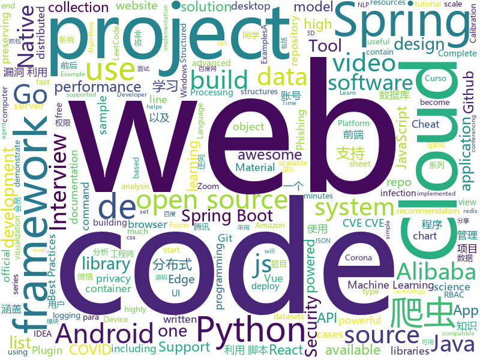

# 2020-04-11
See what the GitHub community is most excited about.

## python
+ [FairMOT](https://github.com/ifzhang/FairMOT)(**152 stars today**): A simple baseline for one-shot multi-object tracking
+ [avatarify](https://github.com/alievk/avatarify)(**94 stars today**): Avatars for Zoom and Skype
+ [interview_internal_reference](https://github.com/0voice/interview_internal_reference)(**177 stars today**): 2019年最新总结，阿里，腾讯，百度，美团，头条等技术面试题目，以及答案，专家出题人分析汇总。
+ [exphub](https://github.com/zhzyker/exphub)(**147 stars today**): Exphub[漏洞利用脚本库] 包括Webloigc、Struts2、Tomcat的漏洞利用脚本，均为亲测可用的脚本文件，优先更新高危且易利用的漏洞利用脚本，最近添加CVE-2020-1938、CVE-2020-2551、CVE-2019-2618、CVE-2019-6340
+ [Datos-COVID19](https://github.com/MinCiencia/Datos-COVID19)(**27 stars today**): En formato estándar
+ [nlp-recipes](https://github.com/microsoft/nlp-recipes)(**90 stars today**): Natural Language Processing Best Practices & Examples
+ [public-apis](https://github.com/public-apis/public-apis)(**601 stars today**): A collective list of free APIs for use in software and web development.
+ [pandas](https://github.com/pandas-dev/pandas)(**25 stars today**): Flexible and powerful data analysis / manipulation library for Python, providing labeled data structures similar to R data.frame objects, statistical functions, and much more
+ [HRNet-Semantic-Segmentation](https://github.com/HRNet/HRNet-Semantic-Segmentation)(**7 stars today**): High-resolution representation learning (HRNets) for Semantic Segmentation
+ [scrapy](https://github.com/scrapy/scrapy)(**22 stars today**): Scrapy, a fast high-level web crawling & scraping framework for Python.
+ [3d-photo-inpainting](https://github.com/vt-vl-lab/3d-photo-inpainting)(**378 stars today**): [CVPR 2020] 3D Photography using Context-aware Layered Depth Inpainting
+ [PySimpleGUI](https://github.com/PySimpleGUI/PySimpleGUI)(**13 stars today**): Launched in 2018 Actively developed and supported. Supports tkinter, Qt, WxPython, Remi (in browser). Create custom layout GUI's simply. Python 2.7 & 3 Support. 200+ Demo programs & Cookbook for rapid start. Extensive documentation. Examples using Machine Learning(GUI, OpenCV Integration, Chatterbot), Floating Desktop Widgets, Matplotlib + Pyplo…
+ [face_recognition](https://github.com/ageitgey/face_recognition)(**76 stars today**): The world's simplest facial recognition api for Python and the command line
+ [DP4-AI](https://github.com/KristapsE/DP4-AI)(**9 stars today**): Python workflow for DP4 analysis of organic molecules
+ [system-design-primer](https://github.com/donnemartin/system-design-primer)(**474 stars today**): Learn how to design large-scale systems. Prep for the system design interview. Includes Anki flashcards.
+ [samsung-firmware-magic](https://github.com/chrivers/samsung-firmware-magic)(**46 stars today**): Tool for decrypting the firmware files for Samsung SSDs
+ [tensortrade](https://github.com/tensortrade-org/tensortrade)(**4 stars today**): An open source reinforcement learning framework for training, evaluating, and deploying robust trading agents.
+ [learn_python3_spider](https://github.com/wistbean/learn_python3_spider)(**24 stars today**): python爬虫教程系列、从0到1学习python爬虫，包括浏览器抓包，手机APP抓包，如 fiddler、mitmproxy，各种爬虫涉及的模块的使用，如：requests、beautifulSoup、selenium、appium、scrapy等，以及IP代理，验证码识别，Mysql，MongoDB数据库的python使用，多线程多进程爬虫的使用，css 爬虫加密逆向破解，JS爬虫逆向，分布式爬虫，爬虫项目实战实例等
+ [dlrm](https://github.com/facebookresearch/dlrm)(**11 stars today**): An implementation of a deep learning recommendation model (DLRM)
+ [NLP-progress](https://github.com/sebastianruder/NLP-progress)(**24 stars today**): Repository to track the progress in Natural Language Processing (NLP), including the datasets and the current state-of-the-art for the most common NLP tasks.
+ [TecoGAN](https://github.com/thunil/TecoGAN)(**9 stars today**): This repo will contain source code and materials for the TecoGAN project, i.e. code for a TEmporally COherent GAN
+ [nni](https://github.com/microsoft/nni)(**8 stars today**): An open source AutoML toolkit for automate machine learning lifecycle, including feature engineering, neural architecture search, model compression and hyper-parameter tuning.
+ [Whole-Foods-Delivery-Slot](https://github.com/pcomputo/Whole-Foods-Delivery-Slot)(**41 stars today**): Automated script for Whole Foods and Amazon Fresh delivery slot
+ [kivy](https://github.com/kivy/kivy)(**15 stars today**): Open source UI framework written in Python, running on Windows, Linux, macOS, Android and iOS
+ [Source-Code-from-Tutorials](https://github.com/buckyroberts/Source-Code-from-Tutorials)(**4 stars today**): Here is the source code from all of my tutorials.

## java
+ [SpringBoot-Labs](https://github.com/YunaiV/SpringBoot-Labs)(**81 stars today**): 一个涵盖六个专栏：Spring Boot 2.X、Spring Cloud、Spring Cloud Alibaba、Dubbo、分布式消息队列、分布式事务的仓库。希望胖友小手一抖，右上角来个 Star，感恩 1024
+ [miaosha](https://github.com/qiurunze123/miaosha)(**177 stars today**): ⭐⭐⭐⭐秒杀系统设计与实现.互联网工程师进阶与分析🙋🐓
+ [android-interview-questions](https://github.com/MindorksOpenSource/android-interview-questions)(**11 stars today**): Your Cheat Sheet For Android Interview - Android Interview Questions
+ [user-interface-samples](https://github.com/android/user-interface-samples)(**22 stars today**): Multiple samples showing the best practices in the user interface on Android.
+ [SpringAll](https://github.com/wuyouzhuguli/SpringAll)(**40 stars today**): 循序渐进，学习Spring Boot、Spring Boot & Shiro、Spring Batch、Spring Cloud、Spring Cloud Alibaba、Spring Security & Spring Security OAuth2，博客Spring系列源码：https://mrbird.cc
+ [arthas](https://github.com/alibaba/arthas)(**35 stars today**): Alibaba Java Diagnostic Tool Arthas/Alibaba Java诊断利器Arthas
+ [questdb](https://github.com/questdb/questdb)(**29 stars today**): An open source SQL database designed to process time-series data, faster
+ [spring-cloud-alibaba](https://github.com/alibaba/spring-cloud-alibaba)(**42 stars today**): Spring Cloud Alibaba provides a one-stop solution for application development for the distributed solutions of Alibaba middleware.
+ [MusicBot](https://github.com/jagrosh/MusicBot)(**3 stars today**): 🎶A Discord music bot that's easy to set up and run yourself!
+ [JavaGuide](https://github.com/Snailclimb/JavaGuide)(**172 stars today**): 【Java学习+面试指南】 一份涵盖大部分Java程序员所需要掌握的核心知识。
+ [litemall](https://github.com/linlinjava/litemall)(**25 stars today**): 又一个小商城。litemall = Spring Boot后端 + Vue管理员前端 + 微信小程序用户前端 + Vue用户移动端
+ [advanced-java](https://github.com/doocs/advanced-java)(**87 stars today**): 😮互联网 Java 工程师进阶知识完全扫盲：涵盖高并发、分布式、高可用、微服务、海量数据处理等领域知识，后端同学必看，前端同学也可学习
+ [openvidu](https://github.com/OpenVidu/openvidu)(**9 stars today**): OpenVidu Platform main repository
+ [bigbluebutton](https://github.com/bigbluebutton/bigbluebutton)(**21 stars today**): Complete open source web conferencing system.
+ [lombok-intellij-plugin](https://github.com/mplushnikov/lombok-intellij-plugin)(**19 stars today**): Lombok Plugin for IntelliJ IDEA
+ [DataX](https://github.com/alibaba/DataX)(**15 stars today**): 
+ [spring-analysis](https://github.com/seaswalker/spring-analysis)(**109 stars today**): Spring源码阅读
+ [Telegram](https://github.com/DrKLO/Telegram)(**5 stars today**): Telegram for Android source
+ [MPAndroidChart](https://github.com/PhilJay/MPAndroidChart)(**17 stars today**): A powerful🚀Android chart view / graph view library, supporting line- bar- pie- radar- bubble- and candlestick charts as well as scaling, dragging and animations.
+ [eladmin](https://github.com/elunez/eladmin)(**32 stars today**): 项目基于 Spring Boot 2.1.0 、 Jpa、 Spring Security、redis、Vue的前后端分离的后台管理系统，项目采用分模块开发方式， 权限控制采用 RBAC，支持数据字典与数据权限管理，支持一键生成前后端代码，支持动态路由
+ [seata](https://github.com/seata/seata)(**26 stars today**): 🔥Seata is an easy-to-use, high-performance, open source distributed transaction solution.
+ [druid](https://github.com/alibaba/druid)(**28 stars today**): 阿里巴巴数据库事业部出品，为监控而生的数据库连接池
+ [Java](https://github.com/TheAlgorithms/Java)(**21 stars today**): All Algorithms implemented in Java
+ [jitsi-videobridge](https://github.com/jitsi/jitsi-videobridge)(**22 stars today**): Jitsi Videobridge is a WebRTC compatible video router or SFU that lets build highly scalable video conferencing infrastructure (i.e., up to hundreds of conferences per server).
+ [portfolio](https://github.com/buchen/portfolio)(**6 stars today**): A simple tool to calculate the overall performance of an investment portfolio.

## unknown
+ [fucking-algorithm](https://github.com/labuladong/fucking-algorithm)(**1,781 stars today**): 手把手撕LeetCode题目，扒各种算法套路的裤子。English version supported! Crack LeetCode, not only how, but also why.
+ [Flutter-Course-Resources](https://github.com/londonappbrewery/Flutter-Course-Resources)(**53 stars today**): Learn to Code While Building Apps - The Complete Flutter Development Bootcamp
+ [free-programming-books](https://github.com/EbookFoundation/free-programming-books)(**564 stars today**): 📚Freely available programming books
+ [the-art-of-command-line](https://github.com/jlevy/the-art-of-command-line)(**376 stars today**): Master the command line, in one page
+ [google-cloud-4-words](https://github.com/gregsramblings/google-cloud-4-words)(**92 stars today**): The Google Cloud Developer's Cheat Sheet
+ [opentrace-calibration](https://github.com/opentrace-community/opentrace-calibration)(**16 stars today**): OpenTrace Calibration. Device calibration data and Trial Methodologies for testing implementations of the BlueTrace protocol.
+ [build-your-own-x](https://github.com/danistefanovic/build-your-own-x)(**728 stars today**): 🤓Build your own (insert technology here)
+ [documents](https://github.com/DP-3T/documents)(**76 stars today**): Decentralized Privacy-Preserving Proximity Tracing -- Documents
+ [data-science-interviews](https://github.com/alexeygrigorev/data-science-interviews)(**23 stars today**): Data science interview questions and answers
+ [BaiduYunVIP](https://github.com/lpg-it/BaiduYunVIP)(**29 stars today**): 百度云百度网盘超级会员账号SVIP账号免费分享, 另分享多款百度网盘不限速下载工具以及各大平台会员账号（迅雷 优酷 爱奇艺 腾讯视频等）.
+ [releasing-research-code](https://github.com/paperswithcode/releasing-research-code)(**80 stars today**): Tips for releasing research code in Machine Learning (with official NeurIPS 2020 recommendations)
+ [gitignore](https://github.com/github/gitignore)(**292 stars today**): A collection of useful .gitignore templates
+ [git-github](https://github.com/gustavoguanabara/git-github)(**22 stars today**): Material do Curso de Git e GitHub
+ [coding-interview-university](https://github.com/jwasham/coding-interview-university)(**482 stars today**): A complete computer science study plan to become a software engineer.
+ [Interview_Question_for_Beginner](https://github.com/JaeYeopHan/Interview_Question_for_Beginner)(**21 stars today**): 👦👧Technical-Interview guidelines written for those who started studying programming. I wish you all the best.👾
+ [sample-data](https://github.com/metrica-sports/sample-data)(**19 stars today**): Metrica Sports sample tracking and event data
+ [awesome-security](https://github.com/sbilly/awesome-security)(**7 stars today**): A collection of awesome software, libraries, documents, books, resources and cools stuffs about security.
+ [awesome-for-beginners](https://github.com/MunGell/awesome-for-beginners)(**39 stars today**): A list of awesome beginners-friendly projects.
+ [awesome-javascript](https://github.com/sorrycc/awesome-javascript)(**22 stars today**): 🐢A collection of awesome browser-side JavaScript libraries, resources and shiny things.
+ [gfwlist](https://github.com/gfwlist/gfwlist)(**24 stars today**): The one and only one gfwlist here
+ [covid19br](https://github.com/wcota/covid19br)(**7 stars today**): Confirmed cases and deaths of COVID-19 in Brazil, at municipal (city) level.
+ [awesome](https://github.com/sindresorhus/awesome)(**103 stars today**): 😎Awesome lists about all kinds of interesting topics
+ [Voron-2](https://github.com/VoronDesign/Voron-2)(**5 stars today**): Voron 2 CoreXY 3D Printer design
+ [intellij-community](https://github.com/JetBrains/intellij-community)(**7 stars today**): IntelliJ IDEA Community Edition
+ [Windows-classic-samples](https://github.com/microsoft/Windows-classic-samples)(**2 stars today**): This repo contains samples that demonstrate the API used in Windows classic desktop applications.

## javascript
+ [jitsi-meet-electron](https://github.com/jitsi/jitsi-meet-electron)(**179 stars today**): Jitsi Meet desktop application powered by
+ [javascript-algorithms](https://github.com/trekhleb/javascript-algorithms)(**273 stars today**): 📝Algorithms and data structures implemented in JavaScript with explanations and links to further readings
+ [Front-End-Checklist](https://github.com/thedaviddias/Front-End-Checklist)(**37 stars today**): 🗂The perfect Front-End Checklist for modern websites and meticulous developers
+ [web-skills](https://github.com/andreasbm/web-skills)(**227 stars today**): A visual overview of useful skills to learn as a web developer
+ [covid-safe-paths](https://github.com/tripleblindmarket/covid-safe-paths)(**14 stars today**): COVID Safe Paths (based on Private Kit) is an open and privacy preserving system to use personal information to battle COVID
+ [web.dev](https://github.com/GoogleChrome/web.dev)(**7 stars today**): The frontend, backend, and content source code for web.dev
+ [deck.gl](https://github.com/uber/deck.gl)(**5 stars today**): WebGL2 powered geospatial visualization layers
+ [kbone](https://github.com/Tencent/kbone)(**74 stars today**): 一个致力于微信小程序和 Web 端同构的解决方案
+ [rakning-c19-app](https://github.com/aranja/rakning-c19-app)(**45 stars today**): App that helps to analyse individuals’ travel and trace their movements when cases of infection arise.
+ [react-native](https://github.com/facebook/react-native)(**42 stars today**): A framework for building native apps with React.
+ [video.js](https://github.com/videojs/video.js)(**28 stars today**): Video.js - open source HTML5 & Flash video player
+ [lossless-cut](https://github.com/mifi/lossless-cut)(**109 stars today**): The swiss army knife of lossless video/audio editing
+ [awesome-mac](https://github.com/jaywcjlove/awesome-mac)(**25 stars today**):  Now we have become very big, Different from the original idea. Collect premium software in various categories.
+ [iptv](https://github.com/iptv-org/iptv)(**22 stars today**): Collection of 8000+ publicly available IPTV channels from all over the world
+ [project_corona_tracker](https://github.com/adrianhajdin/project_corona_tracker)(**21 stars today**): This is a code repository for the corresponding YouTube video. In this tutorial we are going to build and deploy a corona tracker application. Covered topics: React.js, Chart.js, Material UI and much more.
+ [mostly-adequate-guide](https://github.com/MostlyAdequate/mostly-adequate-guide)(**41 stars today**): Mostly adequate guide to FP (in javascript)
+ [gutenberg](https://github.com/WordPress/gutenberg)(**5 stars today**): The Block Editor project for WordPress and beyond. Plugin is available from the official repository.
+ [covid-19-estimator-js](https://github.com/BuildforSDG-Cohort1-Assessment/covid-19-estimator-js)(**3 stars today**): An overly simplified COVID-19 infections impact estimator
+ [gostack-template-conceitos-react-native](https://github.com/Rocketseat/gostack-template-conceitos-react-native)(**3 stars today**): Template para iniciar o desafio de React Native do nível de "Conceitos importantes"
+ [material-ui](https://github.com/mui-org/material-ui)(**48 stars today**): React components for faster and easier web development. Build your own design system, or start with Material Design.
+ [puppeteer](https://github.com/puppeteer/puppeteer)(**44 stars today**): Headless Chrome Node.js API
+ [incubator-echarts](https://github.com/apache/incubator-echarts)(**22 stars today**): A powerful, interactive charting and visualization library for browser
+ [30-seconds-of-code](https://github.com/30-seconds/30-seconds-of-code)(**47 stars today**): Short JavaScript code snippets for all your development needs
+ [mapbox-gl-js](https://github.com/mapbox/mapbox-gl-js)(**4 stars today**): Interactive, thoroughly customizable maps in the browser, powered by vector tiles and WebGL
+ [formio.js](https://github.com/formio/formio.js)(**3 stars today**): JavaScript powered Forms with JSON Form Builder

## html
+ [deplacement-covid-19](https://github.com/LAB-MI/deplacement-covid-19)(**52 stars today**): Service de génération de l'attestation de déplacement dérogatoire à présenter dans le cadre du confinement lié au virus covid-19
+ [tabler-icons](https://github.com/tabler/tabler-icons)(**122 stars today**): A set of over 450 free MIT-licensed high-quality SVG icons for you to use in your web projects.
+ [forecasting](https://github.com/microsoft/forecasting)(**91 stars today**): Time Series Forecasting Best Practices & Examples
+ [zoombot](https://github.com/mcreed/zoombot)(**44 stars today**): A highly advanced AI to handle Zoom calls
+ [DocumentosUniversitarios](https://github.com/sgermosen/DocumentosUniversitarios)(**11 stars today**): 
+ [edge-developer](https://github.com/MicrosoftDocs/edge-developer)(**0 stars today**): Developer documentation for Edge.
+ [docs](https://github.com/aws-amplify/docs)(**0 stars today**): Amplify Framework Documentation
+ [hyperblog](https://github.com/freddier/hyperblog)(**14 stars today**): Un blog increíble para el curso de Git y Github de Platzi
+ [awesome-compose](https://github.com/docker/awesome-compose)(**153 stars today**): Awesome Docker Compose samples
+ [wpt](https://github.com/web-platform-tests/wpt)(**2 stars today**): Test suites for Web platform specs — including WHATWG, W3C, and others
+ [training-kit](https://github.com/github/training-kit)(**3 stars today**): Open source cheat sheets for Git and GitHub
+ [REKCARC-TSC-UHT](https://github.com/PKUanonym/REKCARC-TSC-UHT)(**46 stars today**): 清华大学计算机系课程攻略 Guidance for courses in Department of Computer Science and Technology, Tsinghua University
+ [mvp](https://github.com/andybrewer/mvp)(**69 stars today**): MVP.css — Minimalist stylesheet for HTML elements
+ [hugo-academic](https://github.com/gcushen/hugo-academic)(**11 stars today**): 📝The website builder for Hugo. Build and deploy a beautiful website in minutes!
+ [learning-area](https://github.com/mdn/learning-area)(**5 stars today**): Github repo for the MDN Learning Area.
+ [covid19](https://github.com/datameet/covid19)(**3 stars today**): Novel Corona Virus - COVID-19 India Datasets by DataMeet
+ [shellphish](https://github.com/thelinuxchoice/shellphish)(**8 stars today**): 19 Social Media Phishing Pages #phishing #shellphish #phish
+ [GTFOBins.github.io](https://github.com/GTFOBins/GTFOBins.github.io)(**8 stars today**): Curated list of Unix binaries that can be exploited to bypass system security restrictions
+ [webdevbootcamp](https://github.com/nax3t/webdevbootcamp)(**4 stars today**): All source code for back-end projects from the Web Developer Bootcamp
+ [pyecharts-gallery](https://github.com/pyecharts/pyecharts-gallery)(**3 stars today**): Just use pyecharts to imitate Echarts official example.
+ [proposal-record-tuple](https://github.com/tc39/proposal-record-tuple)(**11 stars today**): ECMAScript proposal for the Record and Tuple value types. | Stage 1: it will change!
+ [electron-api-demos](https://github.com/electron/electron-api-demos)(**11 stars today**): Explore the Electron APIs
+ [JavaScript30](https://github.com/wesbos/JavaScript30)(**15 stars today**): 30 Day Vanilla JS Challenge
+ [webxr-samples](https://github.com/immersive-web/webxr-samples)(**2 stars today**): Samples to demonstrate use of the WebXR Device API
+ [HiddenEye](https://github.com/DarkSecDevelopers/HiddenEye)(**5 stars today**): Modern Phishing Tool With Advanced Functionality And Multiple Tunnelling Services [ Android-Support-Available ]

## go
+ [logrus](https://github.com/sirupsen/logrus)(**91 stars today**): Structured, pluggable logging for Go.
+ [cortex](https://github.com/cortexlabs/cortex)(**62 stars today**): Cloud native model serving infrastructure
+ [traefik](https://github.com/containous/traefik)(**35 stars today**): The Cloud Native Edge Router
+ [swag](https://github.com/swaggo/swag)(**6 stars today**): Automatically generate RESTful API documentation with Swagger 2.0 for Go.
+ [redis](https://github.com/go-redis/redis)(**20 stars today**): Type-safe Redis client for Golang
+ [trojan](https://github.com/Jrohy/trojan)(**73 stars today**): trojan多用户管理部署程序, 支持web页面管理
+ [fabric](https://github.com/hyperledger/fabric)(**11 stars today**): Hyperledger Fabric is an enterprise-grade permissioned distributed ledger framework for developing solutions and applications. Its modular and versatile design satisfies a broad range of industry use cases. It offers a unique approach to consensus that enables performance at scale while preserving privacy.
+ [nebula](https://github.com/slackhq/nebula)(**220 stars today**): A scalable overlay networking tool with a focus on performance, simplicity and security
+ [containerd](https://github.com/containerd/containerd)(**9 stars today**): An open and reliable container runtime
+ [casbin](https://github.com/casbin/casbin)(**11 stars today**): An authorization library that supports access control models like ACL, RBAC, ABAC in Golang
+ [livego](https://github.com/gwuhaolin/livego)(**21 stars today**): 纯 Go 写的直播服务器
+ [fzf](https://github.com/junegunn/fzf)(**48 stars today**): 🌸A command-line fuzzy finder
+ [kubeedge](https://github.com/kubeedge/kubeedge)(**7 stars today**): Kubernetes Native Edge Computing Framework (project under CNCF)
+ [go-github](https://github.com/google/go-github)(**5 stars today**): Go library for accessing the GitHub API
+ [opa](https://github.com/open-policy-agent/opa)(**7 stars today**): An open source, general-purpose policy engine.
+ [go](https://github.com/golang/go)(**58 stars today**): The Go programming language
+ [moby](https://github.com/moby/moby)(**19 stars today**): Moby Project - a collaborative project for the container ecosystem to assemble container-based systems
+ [ffuf](https://github.com/ffuf/ffuf)(**17 stars today**): Fast web fuzzer written in Go
+ [dep](https://github.com/golang/dep)(**5 stars today**): Go dependency management tool
+ [grpc-gateway](https://github.com/grpc-ecosystem/grpc-gateway)(**11 stars today**): gRPC to JSON proxy generator following the gRPC HTTP spec
+ [telegraf](https://github.com/influxdata/telegraf)(**13 stars today**): The plugin-driven server agent for collecting & reporting metrics.
+ [minio](https://github.com/minio/minio)(**26 stars today**): MinIO is a high performance object storage server compatible with Amazon S3 APIs
+ [awesome-go](https://github.com/avelino/awesome-go)(**51 stars today**): A curated list of awesome Go frameworks, libraries and software
+ [Cloudreve](https://github.com/cloudreve/Cloudreve)(**25 stars today**): 🌈支持多家云存储的云盘系统 (A project helps you build your own cloud in minutes)
+ [zap](https://github.com/uber-go/zap)(**10 stars today**): Blazing fast, structured, leveled logging in Go.

## WordCloud

