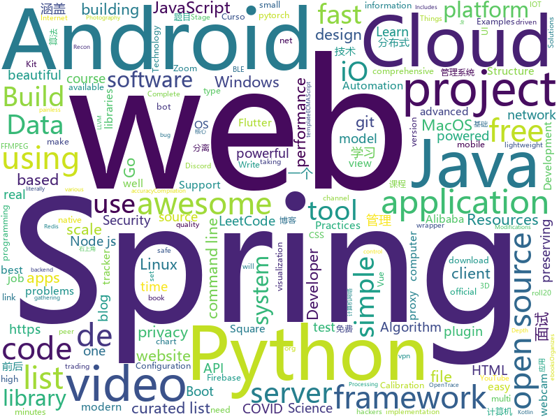

# 2020-04-12
See what the GitHub community is most excited about.

## python
+ [3d-photo-inpainting](https://github.com/vt-vl-lab/3d-photo-inpainting)(**468 stars today**): [CVPR 2020] 3D Photography using Context-aware Layered Depth Inpainting
+ [public-apis](https://github.com/public-apis/public-apis)(**815 stars today**): A collective list of free APIs for use in software and web development.
+ [system-design-primer](https://github.com/donnemartin/system-design-primer)(**664 stars today**): Learn how to design large-scale systems. Prep for the system design interview. Includes Anki flashcards.
+ [DBFace](https://github.com/dlunion/DBFace)(**148 stars today**): DBFace is a real-time, single-stage detector for face detection, with faster speed and higher accuracy
+ [Practical-Ethical-Hacking-Resources](https://github.com/Gr1mmie/Practical-Ethical-Hacking-Resources)(**27 stars today**): Compilation of Resources from TCM's Udemy Course
+ [manim](https://github.com/3b1b/manim)(**168 stars today**): Animation engine for explanatory math videos
+ [FairMOT](https://github.com/ifzhang/FairMOT)(**189 stars today**): A simple baseline for one-shot multi-object tracking
+ [pytorch-lightning](https://github.com/PyTorchLightning/pytorch-lightning)(**23 stars today**): The lightweight PyTorch wrapper for ML researchers. Scale your models. Write less boilerplate
+ [pytube](https://github.com/nficano/pytube)(**12 stars today**): 🎞A lightweight, dependency-free Python library (and command-line utility) for downloading YouTube Videos.
+ [core](https://github.com/home-assistant/core)(**49 stars today**): 🏡Open source home automation that puts local control and privacy first
+ [avatarify](https://github.com/alievk/avatarify)(**197 stars today**): Avatars for Zoom and Skype
+ [pytest](https://github.com/pytest-dev/pytest)(**24 stars today**): The pytest framework makes it easy to write small tests, yet scales to support complex functional testing
+ [gibMacOS](https://github.com/corpnewt/gibMacOS)(**14 stars today**): Py2/py3 script that can download macOS components direct from Apple
+ [awesome-python](https://github.com/vinta/awesome-python)(**94 stars today**): A curated list of awesome Python frameworks, libraries, software and resources
+ [Yet-Another-EfficientDet-Pytorch](https://github.com/zylo117/Yet-Another-EfficientDet-Pytorch)(**472 stars today**): The pytorch re-implement of the official efficientdet with SOTA performance in real time and pretrained weights.
+ [nlp-recipes](https://github.com/microsoft/nlp-recipes)(**121 stars today**): Natural Language Processing Best Practices & Examples
+ [sound-separation](https://github.com/google-research/sound-separation)(**74 stars today**): 
+ [examples-of-web-crawlers](https://github.com/shengqiangzhang/examples-of-web-crawlers)(**58 stars today**): 一些非常有趣的python爬虫例子,对新手比较友好,主要爬取淘宝、天猫、微信、豆瓣、QQ等网站。(Some interesting examples of python crawlers that are friendly to beginners. )
+ [DeDRM_tools](https://github.com/apprenticeharper/DeDRM_tools)(**23 stars today**): DeDRM tools for ebooks
+ [directory_organizer](https://github.com/Vincent-Gustafsson/directory_organizer)(**34 stars today**): Organizes a directory (I'm using it for my Downloads folder).
+ [EchoPwn](https://github.com/hackerspider1/EchoPwn)(**35 stars today**): Recon Automation for hackers by hackers
+ [interview_internal_reference](https://github.com/0voice/interview_internal_reference)(**313 stars today**): 2019年最新总结，阿里，腾讯，百度，美团，头条等技术面试题目，以及答案，专家出题人分析汇总。
+ [backtrader](https://github.com/mementum/backtrader)(**22 stars today**): Python Backtesting library for trading strategies
+ [discord.py](https://github.com/Rapptz/discord.py)(**20 stars today**): An API wrapper for Discord written in Python.
+ [Datos-COVID19](https://github.com/MinCiencia/Datos-COVID19)(**30 stars today**): En formato estándar

## java
+ [SpringBoot-Labs](https://github.com/YunaiV/SpringBoot-Labs)(**121 stars today**): 一个涵盖六个专栏：Spring Boot 2.X、Spring Cloud、Spring Cloud Alibaba、Dubbo、分布式消息队列、分布式事务的仓库。希望胖友小手一抖，右上角来个 Star，感恩 1024
+ [ghidra](https://github.com/NationalSecurityAgency/ghidra)(**65 stars today**): Ghidra is a software reverse engineering (SRE) framework
+ [vhr](https://github.com/lenve/vhr)(**83 stars today**): 微人事是一个前后端分离的人力资源管理系统，项目采用SpringBoot+Vue开发。
+ [interviews](https://github.com/kdn251/interviews)(**35 stars today**): Everything you need to know to get the job.
+ [CS-Notes](https://github.com/CyC2018/CS-Notes)(**240 stars today**): 📚技术面试必备基础知识、Leetcode、计算机操作系统、计算机网络、系统设计、Java、Python、C++
+ [retrofit](https://github.com/square/retrofit)(**24 stars today**): Type-safe HTTP client for Android and Java by Square, Inc.
+ [SpringAll](https://github.com/wuyouzhuguli/SpringAll)(**65 stars today**): 循序渐进，学习Spring Boot、Spring Boot & Shiro、Spring Batch、Spring Cloud、Spring Cloud Alibaba、Spring Security & Spring Security OAuth2，博客Spring系列源码：https://mrbird.cc
+ [halo](https://github.com/halo-dev/halo)(**68 stars today**): ✍An excellent open source blog publishing application. | 一个优秀的开源博客发布应用。
+ [TagMo](https://github.com/HiddenRamblings/TagMo)(**11 stars today**): 
+ [okhttp](https://github.com/square/okhttp)(**27 stars today**): Square’s meticulous HTTP client for Java and Kotlin.
+ [LuckPerms](https://github.com/lucko/LuckPerms)(**4 stars today**): An advanced permissions plugin for Bukkit/Spigot, BungeeCord, Sponge, Nukkit and Velocity.
+ [webcam-capture](https://github.com/sarxos/webcam-capture)(**8 stars today**): The goal of this project is to allow integrated or USB-connected webcams to be accessed directly from Java. Using provided libraries users are able to read camera images and detect motion. Main project consist of several sub projects - the root one, which contains required classes, build-in webcam driver compatible with Windows, Linux and Mac OS…
+ [MusicBot](https://github.com/jagrosh/MusicBot)(**4 stars today**): 🎶A Discord music bot that's easy to set up and run yourself!
+ [lombok-intellij-plugin](https://github.com/mplushnikov/lombok-intellij-plugin)(**29 stars today**): Lombok Plugin for IntelliJ IDEA
+ [bigbluebutton](https://github.com/bigbluebutton/bigbluebutton)(**64 stars today**): Complete open source web conferencing system.
+ [JavaGuide](https://github.com/Snailclimb/JavaGuide)(**122 stars today**): 【Java学习+面试指南】 一份涵盖大部分Java程序员所需要掌握的核心知识。
+ [netty](https://github.com/netty/netty)(**27 stars today**): Netty project - an event-driven asynchronous network application framework
+ [AndroidTutorialForBeginners](https://github.com/hussien89aa/AndroidTutorialForBeginners)(**6 stars today**): Step by step to build Android apps using Android Studio
+ [Project-Euler-solutions](https://github.com/nayuki/Project-Euler-solutions)(**3 stars today**): Runnable code for solving Project Euler problems in Java, Python, Mathematica, Haskell.
+ [igniter](https://github.com/trojan-gfw/igniter)(**31 stars today**): A trojan client for Android (UNDER CONSTRUCTION).
+ [MPAndroidChart](https://github.com/PhilJay/MPAndroidChart)(**23 stars today**): A powerful🚀Android chart view / graph view library, supporting line- bar- pie- radar- bubble- and candlestick charts as well as scaling, dragging and animations.
+ [MinecraftForge](https://github.com/MinecraftForge/MinecraftForge)(**8 stars today**): Modifications to the Minecraft base files to assist in compatibility between mods.
+ [ud851-Exercises](https://github.com/udacity/ud851-Exercises)(**0 stars today**): 
+ [blynk-server](https://github.com/blynkkk/blynk-server)(**6 stars today**): Blynk is an Internet of Things Platform aimed to simplify building mobile and web applications for the Internet of Things. Easily connect 400+ hardware models like Arduino, ESP8266, ESP32, Raspberry Pi and similar MCUs and drag-n-drop IOT mobile apps for iOS and Android in 5 minutes
+ [AntennaPod](https://github.com/AntennaPod/AntennaPod)(**5 stars today**): A podcast manager for Android

## unknown
+ [fucking-algorithm](https://github.com/labuladong/fucking-algorithm)(**3,245 stars today**): 手把手撕LeetCode题目，扒各种算法套路的裤子。English version supported! Crack LeetCode, not only how, but also why.
+ [Flutter-Course-Resources](https://github.com/londonappbrewery/Flutter-Course-Resources)(**167 stars today**): Learn to Code While Building Apps - The Complete Flutter Development Bootcamp
+ [free-programming-books](https://github.com/EbookFoundation/free-programming-books)(**785 stars today**): 📚Freely available programming books
+ [build-your-own-x](https://github.com/danistefanovic/build-your-own-x)(**1,032 stars today**): 🤓Build your own (insert technology here)
+ [coding-interview-university](https://github.com/jwasham/coding-interview-university)(**734 stars today**): A complete computer science study plan to become a software engineer.
+ [the-art-of-command-line](https://github.com/jlevy/the-art-of-command-line)(**580 stars today**): Master the command line, in one page
+ [google-cloud-4-words](https://github.com/gregsramblings/google-cloud-4-words)(**117 stars today**): The Google Cloud Developer's Cheat Sheet
+ [Awesome-Hacking](https://github.com/Hack-with-Github/Awesome-Hacking)(**44 stars today**): A collection of various awesome lists for hackers, pentesters and security researchers
+ [ztm-python-cheat-sheet](https://github.com/aneagoie/ztm-python-cheat-sheet)(**9 stars today**): 
+ [git-github](https://github.com/gustavoguanabara/git-github)(**28 stars today**): Material do Curso de Git e GitHub
+ [releasing-research-code](https://github.com/paperswithcode/releasing-research-code)(**196 stars today**): Tips for releasing research code in Machine Learning (with official NeurIPS 2020 recommendations)
+ [documents](https://github.com/DP-3T/documents)(**224 stars today**): Decentralized Privacy-Preserving Proximity Tracing -- Documents
+ [developer-roadmap](https://github.com/kamranahmedse/developer-roadmap)(**710 stars today**): Roadmap to becoming a web developer in 2020
+ [awesome-osint](https://github.com/jivoi/awesome-osint)(**17 stars today**): 😱A curated list of amazingly awesome OSINT
+ [flutter-firebase](https://github.com/iamshaunjp/flutter-firebase)(**5 stars today**): All course files for the Flutter & Firebase tutorial playlist on The Net Ninja YouTube channel
+ [free-programming-books-zh_CN](https://github.com/justjavac/free-programming-books-zh_CN)(**104 stars today**): 📚免费的计算机编程类中文书籍，欢迎投稿
+ [awesome-vpn](https://github.com/hugetiny/awesome-vpn)(**15 stars today**): Free VPN/proxy,server,account,link list.,实时更新免费的代理,科学上网,翻墙,梯子,服务器,客户端,账号
+ [frontend-challenges](https://github.com/felipefialho/frontend-challenges)(**38 stars today**): 💥Listing some playful open-source's challenges of jobs to test your knowledge
+ [awesome-datascience](https://github.com/academic/awesome-datascience)(**13 stars today**): 📝An awesome Data Science repository to learn and apply for real world problems.
+ [IoT-PT](https://github.com/IoT-PTv/IoT-PT)(**18 stars today**): A Virtual environment for pentest IoT Devices
+ [JavaInterview](https://github.com/gsjqwyl/JavaInterview)(**27 stars today**): Java面试整理，涵盖基础、JVM、线程并发、框架、MySQL、微服务、Redis、中间件、数据结构与算法等。陆续完善中
+ [You-Dont-Know-JS](https://github.com/getify/You-Dont-Know-JS)(**84 stars today**): A book series on JavaScript. @YDKJS on twitter.
+ [Cracked-for-NoAds-IPAs](https://github.com/Netskao/Cracked-for-NoAds-IPAs)(**7 stars today**): iOS破解和去广告应用
+ [opentrace-calibration](https://github.com/opentrace-community/opentrace-calibration)(**20 stars today**): OpenTrace Calibration. Device calibration data and Trial Methodologies for testing implementations of the BlueTrace protocol.
+ [Kubernetes-Certified-Administrator](https://github.com/walidshaari/Kubernetes-Certified-Administrator)(**7 stars today**): Online resources that will help you prepare for taking the CNCF CKA "Kubernetes Certified Administrator" Certification exam. with time, This is not likely the comprehensive up to date list - please make a pull request if there something that should be added here.

## javascript
+ [javascript-algorithms](https://github.com/trekhleb/javascript-algorithms)(**325 stars today**): 📝Algorithms and data structures implemented in JavaScript with explanations and links to further readings
+ [covid-safe-paths](https://github.com/tripleblindmarket/covid-safe-paths)(**18 stars today**): COVID Safe Paths (based on Private Kit) is an open and privacy preserving system to use personal information to battle COVID
+ [decentralized-video-chat](https://github.com/ianramzy/decentralized-video-chat)(**226 stars today**): 🚀Zipcall.io - Peer to peer browser video calling platform with unmatched video quality and latency.
+ [next.js](https://github.com/zeit/next.js)(**82 stars today**): The React Framework
+ [fullstack-course4](https://github.com/jhu-ep-coursera/fullstack-course4)(**17 stars today**): Example code for HTML, CSS, and Javascript for Web Developers Coursera Course
+ [iptv](https://github.com/iptv-org/iptv)(**35 stars today**): Collection of 8000+ publicly available IPTV channels from all over the world
+ [jitsi-meet-electron](https://github.com/jitsi/jitsi-meet-electron)(**204 stars today**): Jitsi Meet desktop application powered by
+ [redux-code](https://github.com/StephenGrider/redux-code)(**9 stars today**): Companion Repo for a course on Udemy
+ [covid-19-estimator-js](https://github.com/BuildforSDG-Cohort1-Assessment/covid-19-estimator-js)(**6 stars today**): An overly simplified COVID-19 infections impact estimator
+ [gatsby](https://github.com/gatsbyjs/gatsby)(**58 stars today**): Build blazing fast, modern apps and websites with React
+ [AwesomeXSS](https://github.com/s0md3v/AwesomeXSS)(**25 stars today**): Awesome XSS stuff
+ [modern_js_udemy_projects](https://github.com/bradtraversy/modern_js_udemy_projects)(**8 stars today**): Project files for Modern JS From The Beginning course
+ [hexo](https://github.com/hexojs/hexo)(**24 stars today**): A fast, simple & powerful blog framework, powered by Node.js.
+ [spicetify-cli](https://github.com/khanhas/spicetify-cli)(**28 stars today**): Commandline tool to customize Spotify client. Supports Windows, MacOS and Linux.
+ [luci](https://github.com/openwrt/luci)(**9 stars today**): LuCI - OpenWrt Configuration Interface
+ [deck.gl](https://github.com/uber/deck.gl)(**12 stars today**): WebGL2 powered geospatial visualization layers
+ [chinese-poetry](https://github.com/chinese-poetry/chinese-poetry)(**115 stars today**): The most comprehensive database of Chinese poetry🧶最全中华古诗词数据库, 唐宋两朝近一万四千古诗人, 接近5.5万首唐诗加26万宋诗. 两宋时期1564位词人，21050首词。
+ [joplin](https://github.com/laurent22/joplin)(**55 stars today**): Joplin - an open source note taking and to-do application with synchronization capabilities for Windows, macOS, Linux, Android and iOS. Forum: https://discourse.joplinapp.org/
+ [web.dev](https://github.com/GoogleChrome/web.dev)(**25 stars today**): The frontend, backend, and content source code for web.dev
+ [nodebestpractices](https://github.com/goldbergyoni/nodebestpractices)(**98 stars today**): ✅The Node.js best practices list (April 2020)
+ [DPlayer](https://github.com/MoePlayer/DPlayer)(**32 stars today**): 🍭Wow, such a lovely HTML5 danmaku video player
+ [bigcanvasdemo](https://github.com/techleadhd/bigcanvasdemo)(**30 stars today**): Big Canvas Demo
+ [UnblockNeteaseMusic](https://github.com/nondanee/UnblockNeteaseMusic)(**49 stars today**): Revive unavailable songs for Netease Cloud Music
+ [FirebaseRTC](https://github.com/webrtc/FirebaseRTC)(**3 stars today**): Codelab for building a WebRTC Video chat application using Firebase Cloudstore.
+ [three.js](https://github.com/mrdoob/three.js)(**61 stars today**): JavaScript 3D library.

## html
+ [deplacement-covid-19](https://github.com/LAB-MI/deplacement-covid-19)(**83 stars today**): Service de génération de l'attestation de déplacement dérogatoire à présenter dans le cadre du confinement lié au virus covid-19
+ [hugo-academic](https://github.com/gcushen/hugo-academic)(**17 stars today**): 📝The website builder for Hugo. Build and deploy a beautiful website in minutes!
+ [zoombot](https://github.com/mcreed/zoombot)(**65 stars today**): A highly advanced AI to handle Zoom calls
+ [tabler](https://github.com/tabler/tabler)(**32 stars today**): Tabler is free and open-source HTML Dashboard UI Kit built on Bootstrap
+ [mvp](https://github.com/andybrewer/mvp)(**114 stars today**): MVP.css — Minimalist stylesheet for HTML elements
+ [awesome-piracy](https://github.com/Igglybuff/awesome-piracy)(**33 stars today**): A curated list of awesome warez and piracy links
+ [roll20-character-sheets](https://github.com/Roll20/roll20-character-sheets)(**4 stars today**): Character sheet templates created by the community for use in Roll20 VTT. Contact team@roll20.net if critical hotfixes need to be requested.
+ [awesome-creative-coding](https://github.com/terkelg/awesome-creative-coding)(**13 stars today**): Creative Coding: Generative Art, Data visualization, Interaction Design, Resources.
+ [Coursera-ML-AndrewNg-Notes](https://github.com/fengdu78/Coursera-ML-AndrewNg-Notes)(**53 stars today**): 吴恩达老师的机器学习课程个人笔记
+ [blog_os](https://github.com/phil-opp/blog_os)(**14 stars today**): Writing an OS in Rust
+ [30-Days-of-Python](https://github.com/codingforentrepreneurs/30-Days-of-Python)(**8 stars today**): A New Version of 30 Days of Python is nearly here. Get started today.
+ [tabler-icons](https://github.com/tabler/tabler-icons)(**147 stars today**): A set of over 450 free MIT-licensed high-quality SVG icons for you to use in your web projects.
+ [beautiful-jekyll](https://github.com/daattali/beautiful-jekyll)(**8 stars today**): ✨Build a beautiful and simple website in literally minutes. Demo at http://deanattali.com/beautiful-jekyll
+ [hyperblog](https://github.com/freddier/hyperblog)(**30 stars today**): Un blog increíble para el curso de Git y Github de Platzi
+ [zenbot](https://github.com/DeviaVir/zenbot)(**8 stars today**): Zenbot is a command-line cryptocurrency trading bot using Node.js and MongoDB.
+ [awesome-competitive-programming](https://github.com/lnishan/awesome-competitive-programming)(**22 stars today**): 💎A curated list of awesome Competitive Programming, Algorithm and Data Structure resources
+ [REKCARC-TSC-UHT](https://github.com/PKUanonym/REKCARC-TSC-UHT)(**54 stars today**): 清华大学计算机系课程攻略 Guidance for courses in Department of Computer Science and Technology, Tsinghua University
+ [node-fluent-ffmpeg](https://github.com/fluent-ffmpeg/node-fluent-ffmpeg)(**8 stars today**): A fluent API to FFMPEG (http://www.ffmpeg.org)
+ [wpt](https://github.com/web-platform-tests/wpt)(**4 stars today**): Test suites for Web platform specs — including WHATWG, W3C, and others
+ [webdevbootcamp](https://github.com/nax3t/webdevbootcamp)(**7 stars today**): All source code for back-end projects from the Web Developer Bootcamp
+ [coreui-free-bootstrap-admin-template](https://github.com/coreui/coreui-free-bootstrap-admin-template)(**9 stars today**): CoreUI is free bootstrap admin template
+ [proposal-record-tuple](https://github.com/tc39/proposal-record-tuple)(**25 stars today**): ECMAScript proposal for the Record and Tuple value types. | Stage 1: it will change!
+ [zphisher](https://github.com/htr-tech/zphisher)(**7 stars today**): Automated Phishing Tool
+ [node-ytdl-core](https://github.com/fent/node-ytdl-core)(**6 stars today**): YouTube video downloader in javascript.
+ [CLRS](https://github.com/walkccc/CLRS)(**9 stars today**): 📚Solutions to Introduction to Algorithms Third Edition

## go
+ [nebula](https://github.com/slackhq/nebula)(**298 stars today**): A scalable overlay networking tool with a focus on performance, simplicity and security
+ [git-bug](https://github.com/MichaelMure/git-bug)(**333 stars today**): Distributed, offline-first bug tracker embedded in git, with bridges
+ [PhoneInfoga](https://github.com/sundowndev/PhoneInfoga)(**9 stars today**): Advanced information gathering & OSINT framework for phone numbers
+ [trojan](https://github.com/Jrohy/trojan)(**99 stars today**): trojan多用户管理部署程序, 支持web页面管理
+ [cortex](https://github.com/cortexlabs/cortex)(**89 stars today**): Cloud native model serving infrastructure
+ [httprobe](https://github.com/tomnomnom/httprobe)(**11 stars today**): Take a list of domains and probe for working HTTP and HTTPS servers
+ [fabric](https://github.com/hyperledger/fabric)(**15 stars today**): Hyperledger Fabric is an enterprise-grade permissioned distributed ledger framework for developing solutions and applications. Its modular and versatile design satisfies a broad range of industry use cases. It offers a unique approach to consensus that enables performance at scale while preserving privacy.
+ [nats-server](https://github.com/nats-io/nats-server)(**19 stars today**): High-Performance server for NATS, the cloud native messaging system.
+ [dive](https://github.com/wagoodman/dive)(**34 stars today**): A tool for exploring each layer in a docker image
+ [cue](https://github.com/cuelang/cue)(**42 stars today**): Validate and define text-based and dynamic configuration
+ [syncthing](https://github.com/syncthing/syncthing)(**32 stars today**): Open Source Continuous File Synchronization
+ [apizza](https://github.com/harrybrwn/apizza)(**188 stars today**): Order Dominos pizza from the command line
+ [gitea](https://github.com/go-gitea/gitea)(**41 stars today**): Git with a cup of tea, painless self-hosted git service
+ [telegraf](https://github.com/influxdata/telegraf)(**18 stars today**): The plugin-driven server agent for collecting & reporting metrics.
+ [go-admin](https://github.com/wenjianzhang/go-admin)(**14 stars today**): 基于Gin + Vue + Element UI的前后端分离权限管理系统脚手架（包含了：基础用户管理功能，jwt鉴权，代码生成器，RABC资源控制，表单构建等）
+ [ebiten](https://github.com/hajimehoshi/ebiten)(**7 stars today**): A dead simple 2D game library in Go
+ [brook](https://github.com/txthinking/brook)(**7 stars today**): Brook is a cross-platform(Linux/BSD/MacOS/Windows/Android/iOS) proxy/vpn software. Zero-Configuration.
+ [caddy](https://github.com/caddyserver/caddy)(**47 stars today**): Fast, multi-platform web server with automatic HTTPS
+ [bettercap](https://github.com/bettercap/bettercap)(**9 stars today**): The Swiss Army knife for 802.11, BLE and Ethernet networks reconnaissance and MITM attacks.
+ [tinygo](https://github.com/tinygo-org/tinygo)(**19 stars today**): Go compiler for small places. Microcontrollers, WebAssembly, and command-line tools. Based on LLVM.
+ [mux](https://github.com/gorilla/mux)(**18 stars today**): A powerful HTTP router and URL matcher for building Go web servers with🦍
+ [clash](https://github.com/Dreamacro/clash)(**74 stars today**): A rule-based tunnel in Go.
+ [annie](https://github.com/iawia002/annie)(**28 stars today**): 👾Fast, simple and clean video downloader
+ [websocket](https://github.com/gorilla/websocket)(**25 stars today**): A fast, well-tested and widely used WebSocket implementation for Go.
+ [AdGuardHome](https://github.com/AdguardTeam/AdGuardHome)(**35 stars today**): Network-wide ads & trackers blocking DNS server

## WordCloud

