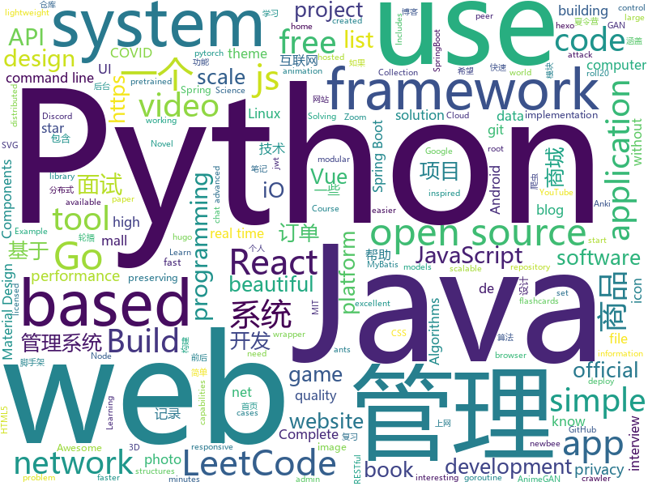

# 2020-04-14
See what the GitHub community is most excited about.

## python
+ [3d-photo-inpainting](https://github.com/vt-vl-lab/3d-photo-inpainting)(**440 stars today**): [CVPR 2020] 3D Photography using Context-aware Layered Depth Inpainting
+ [avatarify](https://github.com/alievk/avatarify)(**186 stars today**): Avatars for Zoom and Skype
+ [DBFace](https://github.com/dlunion/DBFace)(**147 stars today**): DBFace is a real-time, single-stage detector for face detection, with faster speed and higher accuracy
+ [Yet-Another-EfficientDet-Pytorch](https://github.com/zylo117/Yet-Another-EfficientDet-Pytorch)(**292 stars today**): The pytorch re-implement of the official efficientdet with SOTA performance in real time and pretrained weights.
+ [wtfpython](https://github.com/satwikkansal/wtfpython)(**149 stars today**): Do you think you know Python?
+ [examples-of-web-crawlers](https://github.com/shengqiangzhang/examples-of-web-crawlers)(**69 stars today**): 一些非常有趣的python爬虫例子,对新手比较友好,主要爬取淘宝、天猫、微信、豆瓣、QQ等网站。(Some interesting examples of python crawlers that are friendly to beginners. )
+ [AnimeGAN](https://github.com/TachibanaYoshino/AnimeGAN)(**47 stars today**): A Tensorflow implementation of AnimeGAN for fast photo animation ! This is the Open source of the paper <AnimeGAN: a novel lightweight GAN for photo animation>, which uses the GAN framwork to transform real-world photos into anime images.
+ [reference_implementation](https://github.com/DP-3T/reference_implementation)(**10 stars today**): 
+ [system-design-primer](https://github.com/donnemartin/system-design-primer)(**250 stars today**): Learn how to design large-scale systems. Prep for the system design interview. Includes Anki flashcards.
+ [core](https://github.com/home-assistant/core)(**20 stars today**): 🏡Open source home automation that puts local control and privacy first
+ [public-apis](https://github.com/public-apis/public-apis)(**252 stars today**): A collective list of free APIs for use in software and web development.
+ [awesome-python-login-model](https://github.com/Kr1s77/awesome-python-login-model)(**20 stars today**): 😮python模拟登陆一些大型网站，还有一些简单的爬虫，希望对你们有所帮助❤️，如果喜欢记得给个star哦🌟
+ [fsociety](https://github.com/Manisso/fsociety)(**6 stars today**): fsociety Hacking Tools Pack – A Penetration Testing Framework
+ [devops-exercises](https://github.com/bregman-arie/devops-exercises)(**15 stars today**): Linux, Jenkins, AWS, SRE, Prometheus, Docker, Python, Ansible, Git, Kubernetes, Terraform, OpenStack, SQL, NoSQL, Azure, GCP, DNS, Elastic, Network, Virtualization
+ [cpython](https://github.com/python/cpython)(**28 stars today**): The Python programming language
+ [impacket](https://github.com/SecureAuthCorp/impacket)(**16 stars today**): Impacket is a collection of Python classes for working with network protocols.
+ [DeepFaceLab](https://github.com/iperov/DeepFaceLab)(**28 stars today**): DeepFaceLab is the leading software for creating deepfakes.
+ [PayloadsAllTheThings](https://github.com/swisskyrepo/PayloadsAllTheThings)(**31 stars today**): A list of useful payloads and bypass for Web Application Security and Pentest/CTF
+ [manim](https://github.com/3b1b/manim)(**91 stars today**): Animation engine for explanatory math videos
+ [spleeter](https://github.com/deezer/spleeter)(**12 stars today**): Deezer source separation library including pretrained models.
+ [interactive-coding-challenges](https://github.com/donnemartin/interactive-coding-challenges)(**9 stars today**): 120+ interactive Python coding interview challenges (algorithms and data structures). Includes Anki flashcards.
+ [qiling](https://github.com/qilingframework/qiling)(**4 stars today**): Qiling Advanced Binary Emulation Framework
+ [sound-separation](https://github.com/google-research/sound-separation)(**32 stars today**): 
+ [pytorch-lightning](https://github.com/PyTorchLightning/pytorch-lightning)(**23 stars today**): The lightweight PyTorch wrapper for ML researchers. Scale your models. Write less boilerplate
+ [Instagram](https://github.com/Pure-L0G1C/Instagram)(**6 stars today**): Bruteforce attack for Instagram

## java
+ [halo](https://github.com/halo-dev/halo)(**56 stars today**): ✍An excellent open source blog publishing application. | 一个优秀的开源博客发布应用。
+ [SpringBoot-Labs](https://github.com/YunaiV/SpringBoot-Labs)(**61 stars today**): 一个涵盖六个专栏：Spring Boot 2.X、Spring Cloud、Spring Cloud Alibaba、Dubbo、分布式消息队列、分布式事务的仓库。希望胖友小手一抖，右上角来个 Star，感恩 1024
+ [LeetCode](https://github.com/yuanguangxin/LeetCode)(**48 stars today**): LeetCode刷题记录
+ [Jetpack-MVVM-Best-Practice](https://github.com/KunMinX/Jetpack-MVVM-Best-Practice)(**23 stars today**): 是 难得一见 的 Jetpack MVVM 最佳实践！在 蕴繁于简 的代码中，对 视图控制器 乃至 标准化开发模式 形成正确、深入的理解！
+ [Java-Tutorial](https://github.com/h2pl/Java-Tutorial)(**20 stars today**): 【Java工程师面试复习指南】本仓库涵盖大部分Java程序员所需要掌握的核心知识，整合了互联网上的很多优质Java技术文章，力求打造为最完整最实用的Java开发者学习指南，如果对你有帮助，给个star告诉我吧，谢谢！
+ [CS-Notes](https://github.com/CyC2018/CS-Notes)(**121 stars today**): 📚技术面试必备基础知识、Leetcode、计算机操作系统、计算机网络、系统设计、Java、Python、C++
+ [spring-boot-api-project-seed](https://github.com/lihengming/spring-boot-api-project-seed)(**139 stars today**): 🌱🚀一个基于Spring Boot & MyBatis的种子项目，用于快速构建中小型API、RESTful API项目~
+ [liugh-parent](https://github.com/qq53182347/liugh-parent)(**11 stars today**): SpringBoot+JWT+Shiro+MybatisPlus实现Restful快速开发后端脚手架
+ [interviews](https://github.com/kdn251/interviews)(**20 stars today**): Everything you need to know to get the job.
+ [lombok-intellij-plugin](https://github.com/mplushnikov/lombok-intellij-plugin)(**21 stars today**): Lombok Plugin for IntelliJ IDEA
+ [newbee-mall](https://github.com/newbee-ltd/newbee-mall)(**23 stars today**): newbee-mall 项目（新蜂商城）是一套电商系统，包括 newbee-mall 商城系统及 newbee-mall-admin 商城后台管理系统，基于 Spring Boot 2.X 及相关技术栈开发。 前台商城系统包含首页门户、商品分类、新品上线、首页轮播、商品推荐、商品搜索、商品展示、购物车、订单结算、订单流程、个人订单管理、会员中心、帮助中心等模块。 后台管理系统包含数据面板、轮播图管理、商品管理、订单管理、会员管理、分类管理、设置等模块。
+ [termux-app](https://github.com/termux/termux-app)(**11 stars today**): Android terminal and Linux environment - app repository.
+ [dddsample-core](https://github.com/citerus/dddsample-core)(**3 stars today**): This is the new home of the original DDD Sample app (previously hosted at sf.net)..
+ [k-9](https://github.com/k9mail/k-9)(**2 stars today**): K-9 Mail – Open Source Email App for Android
+ [baritone](https://github.com/cabaletta/baritone)(**4 stars today**): google maps for block game
+ [Mindustry](https://github.com/Anuken/Mindustry)(**9 stars today**): A sandbox tower defense game
+ [vhr](https://github.com/lenve/vhr)(**34 stars today**): 微人事是一个前后端分离的人力资源管理系统，项目采用SpringBoot+Vue开发。
+ [JDA](https://github.com/DV8FromTheWorld/JDA)(**2 stars today**): Java wrapper for the popular chat & VOIP service: Discord https://discordapp.com
+ [QNotified](https://github.com/cinit/QNotified)(**5 stars today**): QQ辅助性功能增强
+ [ForestBlog](https://github.com/saysky/ForestBlog)(**14 stars today**): 一个简单漂亮的SSM(Spring+SpringMVC+Mybatis)博客系统
+ [JCSprout](https://github.com/crossoverJie/JCSprout)(**10 stars today**): 👨‍🎓Java Core Sprout : basic, concurrent, algorithm
+ [Project-Euler-solutions](https://github.com/nayuki/Project-Euler-solutions)(**4 stars today**): Runnable code for solving Project Euler problems in Java, Python, Mathematica, Haskell.
+ [dubbo-admin](https://github.com/apache/dubbo-admin)(**2 stars today**): The ops and reference implementation for Apache Dubbo
+ [VirtualXposed](https://github.com/android-hacker/VirtualXposed)(**14 stars today**): A simple app to use Xposed without root, unlock the bootloader or modify system image, etc.

## unknown
+ [fucking-algorithm](https://github.com/labuladong/fucking-algorithm)(**1,404 stars today**): 手把手撕LeetCode题目，扒各种算法套路的裤子。English version supported! Crack LeetCode, not only how, but also why.
+ [Flutter-Course-Resources](https://github.com/londonappbrewery/Flutter-Course-Resources)(**176 stars today**): Learn to Code While Building Apps - The Complete Flutter Development Bootcamp
+ [build-your-own-x](https://github.com/danistefanovic/build-your-own-x)(**476 stars today**): 🤓Build your own (insert technology here)
+ [coding-interview-university](https://github.com/jwasham/coding-interview-university)(**273 stars today**): A complete computer science study plan to become a software engineer.
+ [2020-MSA-content](https://github.com/AUMSA/2020-MSA-content)(**38 stars today**): MSA Australia 2020 Official GitHub Repository
+ [documents](https://github.com/DP-3T/documents)(**88 stars today**): Decentralized Privacy-Preserving Proximity Tracing -- Documents
+ [free-programming-books](https://github.com/EbookFoundation/free-programming-books)(**291 stars today**): 📚Freely available programming books
+ [cobol-programming-course](https://github.com/openmainframeproject/cobol-programming-course)(**122 stars today**): COBOL Programming Course
+ [Front-End-Interview-Notebook](https://github.com/CavsZhouyou/Front-End-Interview-Notebook)(**14 stars today**): 🐜前端面试复习笔记
+ [the-art-of-command-line](https://github.com/jlevy/the-art-of-command-line)(**210 stars today**): Master the command line, in one page
+ [android](https://github.com/LineageOS/android)(**4 stars today**): 
+ [releasing-research-code](https://github.com/paperswithcode/releasing-research-code)(**90 stars today**): Tips for releasing research code in Machine Learning (with official NeurIPS 2020 recommendations)
+ [awesome](https://github.com/sindresorhus/awesome)(**82 stars today**): 😎Awesome lists about all kinds of interesting topics
+ [GNNPapers](https://github.com/thunlp/GNNPapers)(**17 stars today**): Must-read papers on graph neural networks (GNN)
+ [awesome-computer-history](https://github.com/watson/awesome-computer-history)(**33 stars today**): An Awesome List of computer history videos, documentaries and related folklore
+ [heroicons](https://github.com/refactoringui/heroicons)(**12 stars today**): A set of free MIT-licensed high-quality SVG icons for UI development.
+ [Voron-2](https://github.com/VoronDesign/Voron-2)(**1 stars today**): Voron 2 CoreXY 3D Printer design
+ [You-Dont-Know-JS](https://github.com/getify/You-Dont-Know-JS)(**50 stars today**): A book series on JavaScript. @YDKJS on twitter.
+ [Interview_Question_for_Beginner](https://github.com/JaeYeopHan/Interview_Question_for_Beginner)(**9 stars today**): 👦👧Technical-Interview guidelines written for those who started studying programming. I wish you all the best.👾
+ [control-and-system-book](https://github.com/lugh56/control-and-system-book)(**4 stars today**): textbook about control, robotics, system
+ [Python-programming-exercises](https://github.com/zhiwehu/Python-programming-exercises)(**20 stars today**): 100+ Python challenging programming exercises
+ [CSSummerCamp2020](https://github.com/hcy226/CSSummerCamp2020)(**8 stars today**): 关于2020年CS保研夏令营的汇总。欢迎大家分享夏令营信息，资瓷一下互联网精神吼不吼啊？
+ [you-dont-know-js-ru](https://github.com/azat-io/you-dont-know-js-ru)(**2 stars today**): 📚Russian translation of "You Don't Know JS" book series
+ [awesome-scalability](https://github.com/binhnguyennus/awesome-scalability)(**11 stars today**): The Patterns of Scalable, Reliable, and Performant Large-Scale Systems
+ [CS-Books](https://github.com/huihut/CS-Books)(**13 stars today**): 📚Computer Science Books 计算机技术类书籍 PDF

## javascript
+ [javascript-algorithms](https://github.com/trekhleb/javascript-algorithms)(**225 stars today**): 📝Algorithms and data structures implemented in JavaScript with explanations and links to further readings
+ [decentralized-video-chat](https://github.com/ianramzy/decentralized-video-chat)(**228 stars today**): 🚀Zipcall.io🚀Peer to peer browser video calling platform with unmatched video quality and latency.
+ [react-native](https://github.com/facebook/react-native)(**39 stars today**): A framework for building native apps with React.
+ [nuxt.js](https://github.com/nuxt/nuxt.js)(**33 stars today**): The Vue.js Framework
+ [chakra-ui](https://github.com/chakra-ui/chakra-ui)(**28 stars today**): ⚡️Simple, Modular & Accessible UI Components for your React Applications
+ [grocy](https://github.com/grocy/grocy)(**8 stars today**): ERP beyond your fridge - grocy is a web-based self-hosted groceries & household management solution for your home
+ [covid-safe-paths](https://github.com/tripleblindmarket/covid-safe-paths)(**20 stars today**): COVID Safe Paths (based on Private Kit) is an open and privacy preserving system to use personal information to battle COVID
+ [grokking_algorithms](https://github.com/egonSchiele/grokking_algorithms)(**7 stars today**): Code for the book Grokking Algorithms (https://amzn.to/29rVyHf)
+ [discord.js](https://github.com/discordjs/discord.js)(**7 stars today**): A powerful JavaScript library for interacting with the Discord API
+ [joplin](https://github.com/laurent22/joplin)(**34 stars today**): Joplin - an open source note taking and to-do application with synchronization capabilities for Windows, macOS, Linux, Android and iOS. Forum: https://discourse.joplinapp.org/
+ [leetcode](https://github.com/azl397985856/leetcode)(**92 stars today**): LeetCode Solutions: A Record of My Problem Solving Journey.( leetcode题解，记录自己的leetcode解题之路。)
+ [material-ui](https://github.com/mui-org/material-ui)(**36 stars today**): React components for faster and easier web development. Build your own design system, or start with Material Design.
+ [fullstack-course4](https://github.com/jhu-ep-coursera/fullstack-course4)(**11 stars today**): Example code for HTML, CSS, and Javascript for Web Developers Coursera Course
+ [StadiaPlus](https://github.com/Mafrans/StadiaPlus)(**4 stars today**): Extends Google's Stadia gaming platform with additional features, such as custom filters and in game network monitoring.
+ [Script](https://github.com/NobyDa/Script)(**7 stars today**): This project is based on the scripting capabilities of two excellent iOS proxy tools, Quantumult X or Surge.
+ [phaser](https://github.com/photonstorm/phaser)(**15 stars today**): Phaser is a fun, free and fast 2D game framework for making HTML5 games for desktop and mobile web browsers, supporting Canvas and WebGL rendering.
+ [preact](https://github.com/preactjs/preact)(**13 stars today**): ⚛️Fast 3kB React alternative with the same modern API. Components & Virtual DOM.
+ [plyr](https://github.com/sampotts/plyr)(**14 stars today**): A simple HTML5, YouTube and Vimeo player
+ [API](https://github.com/NovelCOVID/API)(**16 stars today**): API for Current cases and more stuff about COVID-19 or the Novel Coronavirus Strain
+ [covid-19-estimator-js](https://github.com/BuildforSDG-Cohort1-Assessment/covid-19-estimator-js)(**2 stars today**): An overly simplified COVID-19 infections impact estimator
+ [project_chat_application](https://github.com/adrianhajdin/project_chat_application)(**9 stars today**): This is a code repository for the corresponding YouTube video. In this tutorial we are going to build and deploy a real time chat application. Covered topics: React.js, Node.js, Express.js, and Socket.io.
+ [iptv](https://github.com/iptv-org/iptv)(**31 stars today**): Collection of 8000+ publicly available IPTV channels from all over the world
+ [next.js](https://github.com/zeit/next.js)(**41 stars today**): The React Framework
+ [complete-node-bootcamp](https://github.com/jonasschmedtmann/complete-node-bootcamp)(**2 stars today**): Starter files, final projects and FAQ for my Complete Node.js Bootcamp
+ [deck.gl](https://github.com/uber/deck.gl)(**8 stars today**): WebGL2 powered geospatial visualization layers

## html
+ [deplacement-covid-19](https://github.com/LAB-MI/deplacement-covid-19)(**25 stars today**): Service de génération de l'attestation de déplacement dérogatoire à présenter dans le cadre du confinement lié au virus covid-19
+ [zoombot](https://github.com/mcreed/zoombot)(**49 stars today**): A highly advanced AI to handle Zoom calls
+ [learning-area](https://github.com/mdn/learning-area)(**1 stars today**): Github repo for the MDN Learning Area.
+ [Coursera-ML-AndrewNg-Notes](https://github.com/fengdu78/Coursera-ML-AndrewNg-Notes)(**14 stars today**): 吴恩达老师的机器学习课程个人笔记
+ [Blog](https://github.com/yangkun19921001/Blog)(**181 stars today**): Android 面试宝典、数据结构和算法、音视频 (FFmpeg、AAC、x264、MediaCodec)、 C/C++ 、OpenCV、跨平台等学习记录
+ [hugo-academic](https://github.com/gcushen/hugo-academic)(**8 stars today**): 📝The website builder for Hugo. Build and deploy a beautiful website in minutes!
+ [hugo-coder](https://github.com/luizdepra/hugo-coder)(**1 stars today**): A minimalist blog theme for hugo.
+ [hugo-theme-meme](https://github.com/reuixiy/hugo-theme-meme)(**0 stars today**): You can’t spell aWEsoME without MEME!😝
+ [pcc_2e](https://github.com/ehmatthes/pcc_2e)(**3 stars today**): Online resources for Python Crash Course (Second Edition), from No Starch Press
+ [GDIndex](https://github.com/maple3142/GDIndex)(**4 stars today**): A Google Drive Index built with Vue Running on CloudFlare Workers
+ [node-ytdl-core](https://github.com/fent/node-ytdl-core)(**1 stars today**): YouTube video downloader in javascript.
+ [Net_Diff](https://github.com/YizeZhang/Net_Diff)(**0 stars today**): Net_Diff is a software for GNSS Download, Positioning and Analysis.
+ [beautiful-jekyll](https://github.com/daattali/beautiful-jekyll)(**2 stars today**): ✨Build a beautiful and simple website in literally minutes. Demo at http://deanattali.com/beautiful-jekyll
+ [hexo-theme-matery](https://github.com/blinkfox/hexo-theme-matery)(**13 stars today**): A beautiful hexo blog theme with material design and responsive design.一个基于材料设计和响应式设计而成的全面、美观的Hexo主题。国内访问：http://blinkfox.com
+ [roll20-character-sheets](https://github.com/Roll20/roll20-character-sheets)(**0 stars today**): Character sheet templates created by the community for use in Roll20 VTT. Contact team@roll20.net if critical hotfixes need to be requested.
+ [Java-Interview-Advanced](https://github.com/shishan100/Java-Interview-Advanced)(**9 stars today**): 中华石杉--互联网Java进阶面试训练营
+ [coronaSafety](https://github.com/Coders-Of-XDA-OT/coronaSafety)(**0 stars today**): Let's fight this pandemic by Spreading Awareness.
+ [web-moderno](https://github.com/cod3rcursos/web-moderno)(**8 stars today**): 
+ [tabler-icons](https://github.com/tabler/tabler-icons)(**27 stars today**): A set of over 450 free MIT-licensed high-quality SVG icons for you to use in your web projects.
+ [startbootstrap-sb-admin-2](https://github.com/BlackrockDigital/startbootstrap-sb-admin-2)(**6 stars today**): A free, open source, Bootstrap admin theme created by Start Bootstrap
+ [huxblog-boilerplate](https://github.com/Huxpro/huxblog-boilerplate)(**0 stars today**): Boilerplate of Hux Blog
+ [Introduction-to-Web-Development](https://github.com/WebDevSimplified/Introduction-to-Web-Development)(**2 stars today**): 
+ [222-responsive-icon-nav-css](https://github.com/fireship-io/222-responsive-icon-nav-css)(**4 stars today**): A Simple Responsive Animated CSS Icon Navbar
+ [Intro-to-Data-APIs-JS](https://github.com/CodingTrain/Intro-to-Data-APIs-JS)(**0 stars today**): Working with Data and APIs in JavaScript
+ [andikasujanadi.github.io](https://github.com/andikasujanadi/andikasujanadi.github.io)(**1 stars today**): tugas kuliah

## go
+ [trojan](https://github.com/Jrohy/trojan)(**27 stars today**): trojan多用户管理部署程序, 支持web页面管理
+ [go-ethereum](https://github.com/ethereum/go-ethereum)(**11 stars today**): Official Go implementation of the Ethereum protocol
+ [PhoneInfoga](https://github.com/sundowndev/PhoneInfoga)(**7 stars today**): Advanced information gathering & OSINT framework for phone numbers
+ [git-bug](https://github.com/MichaelMure/git-bug)(**115 stars today**): Distributed, offline-first bug tracker embedded in git, with bridges
+ [learn-go-with-tests](https://github.com/quii/learn-go-with-tests)(**9 stars today**): Learn Go with test-driven development
+ [caddy](https://github.com/caddyserver/caddy)(**18 stars today**): Fast, multi-platform web server with automatic HTTPS
+ [3mux](https://github.com/aaronjanse/3mux)(**113 stars today**): Terminal multiplexer inspired by i3
+ [bettercap](https://github.com/bettercap/bettercap)(**6 stars today**): The Swiss Army knife for 802.11, BLE and Ethernet networks reconnaissance and MITM attacks.
+ [tinygo](https://github.com/tinygo-org/tinygo)(**14 stars today**): Go compiler for small places. Microcontrollers, WebAssembly, and command-line tools. Based on LLVM.
+ [nebula](https://github.com/slackhq/nebula)(**38 stars today**): A scalable overlay networking tool with a focus on performance, simplicity and security
+ [pspy](https://github.com/DominicBreuker/pspy)(**13 stars today**): Monitor linux processes without root permissions
+ [httprobe](https://github.com/tomnomnom/httprobe)(**8 stars today**): Take a list of domains and probe for working HTTP and HTTPS servers
+ [fabric](https://github.com/hyperledger/fabric)(**8 stars today**): Hyperledger Fabric is an enterprise-grade permissioned distributed ledger framework for developing solutions and applications. Its modular and versatile design satisfies a broad range of industry use cases. It offers a unique approach to consensus that enables performance at scale while preserving privacy.
+ [go-admin](https://github.com/wenjianzhang/go-admin)(**25 stars today**): 基于Gin + Vue + Element UI的前后端分离权限管理系统脚手架（包含了：基础用户管理功能，jwt鉴权，代码生成器，RABC资源控制，表单构建等）
+ [FreePAC](https://github.com/xiaoming2028/FreePAC)(**13 stars today**): 科学上网/梯子/自由上网/翻墙 SS/SSR/V2Ray/Brook 搭建教程
+ [colly](https://github.com/gocolly/colly)(**14 stars today**): Elegant Scraper and Crawler Framework for Golang
+ [hub](https://github.com/github/hub)(**15 stars today**): A command-line tool that makes git easier to use with GitHub.
+ [hugo](https://github.com/gohugoio/hugo)(**32 stars today**): The world’s fastest framework for building websites.
+ [ants](https://github.com/panjf2000/ants)(**20 stars today**): 🐜🐜🐜ants is a high-performance and low-cost goroutine pool in Go, inspired by fasthttp./ ants 是一个高性能且低损耗的 goroutine 池。
+ [sqlboiler](https://github.com/volatiletech/sqlboiler)(**12 stars today**): Generate a Go ORM tailored to your database schema.
+ [syncthing](https://github.com/syncthing/syncthing)(**17 stars today**): Open Source Continuous File Synchronization
+ [micro](https://github.com/micro/micro)(**4 stars today**): Micro is a distributed systems runtime for the Cloud
+ [clash](https://github.com/Dreamacro/clash)(**25 stars today**): A rule-based tunnel in Go.
+ [Dragonfly](https://github.com/dragonflyoss/Dragonfly)(**25 stars today**): Dragonfly is an intelligent P2P based image and file distribution system.
+ [fyne](https://github.com/fyne-io/fyne)(**17 stars today**): Cross platform GUI in Go based on Material Design

## WordCloud

