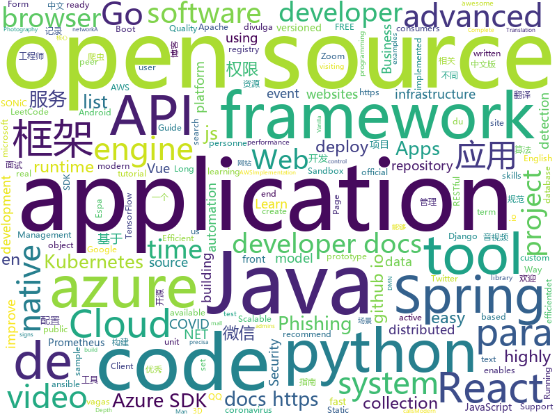

# 2020-04-15
See what the GitHub community is most excited about.

## python
+ [Yet-Another-EfficientDet-Pytorch](https://github.com/zylo117/Yet-Another-EfficientDet-Pytorch)(**688 stars today**): The pytorch re-implement of the official efficientdet with SOTA performance in real time and pretrained weights.
+ [examples-of-web-crawlers](https://github.com/shengqiangzhang/examples-of-web-crawlers)(**126 stars today**): 一些非常有趣的python爬虫例子,对新手比较友好,主要爬取淘宝、天猫、微信、豆瓣、QQ等网站。(Some interesting examples of python crawlers that are friendly to beginners. )
+ [pandemic-ventilator-2.0](https://github.com/Mascobot/pandemic-ventilator-2.0)(**64 stars today**): Open Source Pandemic Ventilator with Raspberry Pi and Arduino
+ [twint](https://github.com/twintproject/twint)(**242 stars today**): An advanced Twitter scraping & OSINT tool written in Python that doesn't use Twitter's API, allowing you to scrape a user's followers, following, Tweets and more while evading most API limitations.
+ [wtfpython](https://github.com/satwikkansal/wtfpython)(**176 stars today**): Do you think you know Python?
+ [fastapi](https://github.com/tiangolo/fastapi)(**62 stars today**): FastAPI framework, high performance, easy to learn, fast to code, ready for production
+ [bbb-v2](https://github.com/diofeher/bbb-v2)(**7 stars today**): Bot pra votar no Big Brother que não precisa de interação com a página
+ [Mask_RCNN](https://github.com/matterport/Mask_RCNN)(**24 stars today**): Mask R-CNN for object detection and instance segmentation on Keras and TensorFlow
+ [avatarify](https://github.com/alievk/avatarify)(**280 stars today**): Avatars for Zoom and Skype
+ [3d-photo-inpainting](https://github.com/vt-vl-lab/3d-photo-inpainting)(**229 stars today**): [CVPR 2020] 3D Photography using Context-aware Layered Depth Inpainting
+ [wtfpython-cn](https://github.com/leisurelicht/wtfpython-cn)(**34 stars today**): wtfpython的中文翻译/施工结束/ 能力有限，欢迎帮我改进翻译
+ [COVID-Net](https://github.com/lindawangg/COVID-Net)(**14 stars today**): COVID-Net Open Source Initiative
+ [cookiecutter-django-vue-graphql-aws](https://github.com/grantmcconnaughey/cookiecutter-django-vue-graphql-aws)(**22 stars today**): A highly opinionated Cookiecutter template that fuses together Django, Vue.js, GraphQL, and AWS into one full-stack web application.
+ [aws-data-wrangler](https://github.com/awslabs/aws-data-wrangler)(**14 stars today**): Pandas on AWS
+ [EfficientDet.Pytorch](https://github.com/toandaominh1997/EfficientDet.Pytorch)(**18 stars today**): Implementation EfficientDet: Scalable and Efficient Object Detection in PyTorch
+ [reference_implementation](https://github.com/DP-3T/reference_implementation)(**7 stars today**): 
+ [django-rest-framework](https://github.com/encode/django-rest-framework)(**16 stars today**): Web APIs for Django.🎸
+ [machine_learning_examples](https://github.com/lazyprogrammer/machine_learning_examples)(**24 stars today**): A collection of machine learning examples and tutorials.
+ [longformer](https://github.com/allenai/longformer)(**72 stars today**): Longformer: The Long-Document Transformer
+ [text-detection-ctpn](https://github.com/eragonruan/text-detection-ctpn)(**8 stars today**): text detection mainly based on ctpn model in tensorflow, id card detect, connectionist text proposal network
+ [hub](https://github.com/tensorflow/hub)(**5 stars today**): A library for transfer learning by reusing parts of TensorFlow models.
+ [chromepass](https://github.com/darkarp/chromepass)(**5 stars today**): Chromepass - Hacking Chrome Saved Passwords
+ [pytorch-CycleGAN-and-pix2pix](https://github.com/junyanz/pytorch-CycleGAN-and-pix2pix)(**18 stars today**): Image-to-Image Translation in PyTorch
+ [ansible](https://github.com/ansible/ansible)(**21 stars today**): Ansible is a radically simple IT automation platform that makes your applications and systems easier to deploy. Avoid writing scripts or custom code to deploy and update your applications — automate in a language that approaches plain English, using SSH, with no agents to install on remote systems. https://docs.ansible.com/ansible/
+ [azure-sdk-for-python](https://github.com/Azure/azure-sdk-for-python)(**2 stars today**): This repository is for active development of the Azure SDK for Python. For consumers of the SDK we recommend visiting our public developer docs at https://docs.microsoft.com/en-us/python/azure/ or our versioned developer docs at https://azure.github.io/azure-sdk-for-python.

## java
+ [spring-boot-api-project-seed](https://github.com/lihengming/spring-boot-api-project-seed)(**150 stars today**): 🌱🚀一个基于Spring Boot & MyBatis的种子项目，用于快速构建中小型API、RESTful API项目~
+ [toBeTopJavaer](https://github.com/hollischuang/toBeTopJavaer)(**75 stars today**): To Be Top Javaer - Java工程师成神之路
+ [keycloak](https://github.com/keycloak/keycloak)(**59 stars today**): Open Source Identity and Access Management For Modern Applications and Services
+ [LeetCode](https://github.com/yuanguangxin/LeetCode)(**33 stars today**): LeetCode刷题记录
+ [mockito](https://github.com/mockito/mockito)(**13 stars today**): Most popular Mocking framework for unit tests written in Java
+ [flowable-engine](https://github.com/flowable/flowable-engine)(**6 stars today**): A compact and highly efficient workflow and Business Process Management (BPM) platform for developers, system admins and business users.
+ [Android-IMSI-Catcher-Detector](https://github.com/CellularPrivacy/Android-IMSI-Catcher-Detector)(**7 stars today**): AIMSICD • Fight IMSI-Catcher, StingRay and silent SMS!
+ [GuideToCustomViews](https://github.com/ZieIony/GuideToCustomViews)(**55 stars today**): The ultimate guide to Android custom views
+ [azure-sdk-for-java](https://github.com/Azure/azure-sdk-for-java)(**1 stars today**): This repository is for active development of the Azure SDK for Java. For consumers of the SDK we recommend visiting our public developer docs at https://docs.microsoft.com/en-us/java/azure/ or our versioned developer docs at https://azure.github.io/azure-sdk-for-java.
+ [Java](https://github.com/TheAlgorithms/Java)(**25 stars today**): All Algorithms implemented in Java
+ [Java-Tutorial](https://github.com/h2pl/Java-Tutorial)(**23 stars today**): 【Java工程师面试复习指南】本仓库涵盖大部分Java程序员所需要掌握的核心知识，整合了互联网上的很多优质Java技术文章，力求打造为最完整最实用的Java开发者学习指南，如果对你有帮助，给个star告诉我吧，谢谢！
+ [lucene-solr](https://github.com/apache/lucene-solr)(**6 stars today**): Apache Lucene and Solr open-source search software
+ [halo](https://github.com/halo-dev/halo)(**85 stars today**): ✍An excellent open source blog publishing application. | 一个优秀的开源博客发布应用。
+ [selenium](https://github.com/SeleniumHQ/selenium)(**17 stars today**): A browser automation framework and ecosystem.
+ [elasticsearch](https://github.com/elastic/elasticsearch)(**21 stars today**): Open Source, Distributed, RESTful Search Engine
+ [schema-registry](https://github.com/confluentinc/schema-registry)(**3 stars today**): Confluent Schema Registry for Kafka
+ [jetty.project](https://github.com/eclipse/jetty.project)(**2 stars today**): Eclipse Jetty® - Web Container & Clients - supports HTTP/2, HTTP/1.1, HTTP/1.0, websocket, servlets, and more
+ [hbase](https://github.com/apache/hbase)(**6 stars today**): Apache HBase
+ [tutorials](https://github.com/eugenp/tutorials)(**23 stars today**): Just Announced - "Learn Spring Security OAuth":
+ [onemall](https://github.com/YunaiV/onemall)(**16 stars today**): mall 商城，基于微服务的思想，构建在 B2C 电商场景下的项目实战。核心技术栈，是 Spring Boot + Dubbo 。未来，会重构成 Spring Cloud Alibaba 。
+ [zeppelin](https://github.com/apache/zeppelin)(**3 stars today**): Mirror of Apache Zeppelin
+ [apollo](https://github.com/ctripcorp/apollo)(**15 stars today**): Apollo（阿波罗）是携程框架部门研发的分布式配置中心，能够集中化管理应用不同环境、不同集群的配置，配置修改后能够实时推送到应用端，并且具备规范的权限、流程治理等特性，适用于微服务配置管理场景。
+ [spring-microservices](https://github.com/in28minutes/spring-microservices)(**3 stars today**): Spring Microservices using Spring Cloud
+ [drools](https://github.com/kiegroup/drools)(**6 stars today**): Drools is a rule engine, DMN engine and complex event processing (CEP) engine for Java.
+ [karate](https://github.com/intuit/karate)(**6 stars today**): Test Automation Made Simple

## unknown
+ [cobol-programming-course](https://github.com/openmainframeproject/cobol-programming-course)(**124 stars today**): COBOL Programming Course
+ [CyberProfDevelopmentCovidResources](https://github.com/gerryguy311/CyberProfDevelopmentCovidResources)(**41 stars today**): An awesome list of FREE resources for training, conferences, speaking, labs, reading, etc that are free all the time or during COVID-19 that cybersecurity professionals with downtime can take advantage of to improve their skills and marketability to come out on the other side ready to rock.
+ [app-ideas](https://github.com/florinpop17/app-ideas)(**113 stars today**): A Collection of application ideas which can be used to improve your coding skills.
+ [Best-websites-a-programmer-should-visit](https://github.com/sdmg15/Best-websites-a-programmer-should-visit)(**66 stars today**): 🔗Some useful websites for programmers.
+ [evil-man](https://github.com/CNwoman-bot/evil-man)(**28 stars today**): Evil Man - 中国男性之恶
+ [Flutter-Course-Resources](https://github.com/londonappbrewery/Flutter-Course-Resources)(**215 stars today**): Learn to Code While Building Apps - The Complete Flutter Development Bootcamp
+ [Cookbook](https://github.com/andkret/Cookbook)(**19 stars today**): The Data Engineering Cookbook
+ [developer-roadmap](https://github.com/kamranahmedse/developer-roadmap)(**311 stars today**): Roadmap to becoming a web developer in 2020
+ [Best-App](https://github.com/hzlzh/Best-App)(**12 stars today**): 收集&推荐优秀的 Apps/硬件/技巧/周边等
+ [StopCovid](https://github.com/betagouv/StopCovid)(**37 stars today**): Application mobile qui doit permettre à une personne d’être informée du risque qu’elle a encouru en étant au contact de personnes diagnostiquées porteuses du coronavirus 19.
+ [awesome-dotnet](https://github.com/quozd/awesome-dotnet)(**15 stars today**): A collection of awesome .NET libraries, tools, frameworks and software
+ [js-20-years-cn](https://github.com/doodlewind/js-20-years-cn)(**69 stars today**): 🇨🇳《JavaScript 20 年》中文版
+ [IoTSecurity101](https://github.com/V33RU/IoTSecurity101)(**64 stars today**): A Curated list of IoT Security Resources
+ [policies](https://github.com/basecamp/policies)(**12 stars today**): Basecamp policies, terms, and legal. Share them; reuse them; contribute to them.
+ [COVID-19-timeline](https://github.com/Pratitya/COVID-19-timeline)(**82 stars today**): 以 社会学年鉴模式体例规范地统编自2019年末起新冠肺炎疫情进展的时间线。
+ [vagas](https://github.com/qa-brasil/vagas)(**7 stars today**): 🚀Espaço para divulgação de vagas para Quality Assurance
+ [awesome-spider](https://github.com/facert/awesome-spider)(**24 stars today**): 爬虫集合
+ [azure-cosmos-dotnet-v2](https://github.com/Azure/azure-cosmos-dotnet-v2)(**0 stars today**): Contains samples and utilities relating to the Azure Cosmos DB .NET SDK
+ [CKAD-exercises](https://github.com/dgkanatsios/CKAD-exercises)(**14 stars today**): A set of exercises to prepare for Certified Kubernetes Application Developer exam by Cloud Native Computing Foundation
+ [cs-video-courses](https://github.com/Developer-Y/cs-video-courses)(**11 stars today**): List of Computer Science courses with video lectures.
+ [vagas](https://github.com/frontendbr/vagas)(**7 stars today**): 🔬Espaço para divulgação de vagas para front-enders.
+ [fucking-algorithm](https://github.com/labuladong/fucking-algorithm)(**1,305 stars today**): 手把手撕LeetCode题目，扒各种算法套路的裤子。English version supported! Crack LeetCode, not only how, but also why.
+ [2020-MSA-content](https://github.com/AUMSA/2020-MSA-content)(**16 stars today**): MSA Australia 2020 Official GitHub Repository
+ [awesome-java-cn](https://github.com/jobbole/awesome-java-cn)(**9 stars today**): Java资源大全中文版，包括开发库、开发工具、网站、博客、微信、微博等，由伯乐在线持续更新。
+ [Win32-OpenSSH](https://github.com/PowerShell/Win32-OpenSSH)(**3 stars today**): Win32 port of OpenSSH

## javascript
+ [decentralized-video-chat](https://github.com/ianramzy/decentralized-video-chat)(**357 stars today**): 🚀Zipcall.io🚀Peer to peer browser video calling platform with unmatched video quality and latency.
+ [chinese-poetry](https://github.com/chinese-poetry/chinese-poetry)(**118 stars today**): The most comprehensive database of Chinese poetry🧶最全中华古诗词数据库, 唐宋两朝近一万四千古诗人, 接近5.5万首唐诗加26万宋诗. 两宋时期1564位词人，21050首词。
+ [react-query](https://github.com/tannerlinsley/react-query)(**41 stars today**): ⚛️Hooks for fetching, caching and updating asynchronous data in React
+ [hegel](https://github.com/JSMonk/hegel)(**71 stars today**): An advanced static type checker
+ [pdf.js](https://github.com/mozilla/pdf.js)(**33 stars today**): PDF Reader in JavaScript
+ [javascript](https://github.com/airbnb/javascript)(**50 stars today**): JavaScript Style Guide
+ [taro](https://github.com/NervJS/taro)(**29 stars today**): 多端统一开发框架，支持用 React 的开发方式编写一次代码，生成能运行在微信/百度/支付宝/字节跳动/ QQ 小程序/快应用/H5/React Native 等的应用。 https://taro.jd.com/
+ [next.js](https://github.com/zeit/next.js)(**54 stars today**): The React Framework
+ [react-beautiful-dnd](https://github.com/atlassian/react-beautiful-dnd)(**17 stars today**): Beautiful and accessible drag and drop for lists with React
+ [react-native](https://github.com/facebook/react-native)(**42 stars today**): A framework for building native apps with React.
+ [covid19-market-waiting-times](https://github.com/TheJoin95/covid19-market-waiting-times)(**9 stars today**): A project to help people stand in line at the market as little as possible
+ [internship-application-fullstack](https://github.com/cloudflare-internship-2020/internship-application-fullstack)(**42 stars today**): 
+ [formio.js](https://github.com/formio/formio.js)(**5 stars today**): JavaScript powered Forms with JSON Form Builder
+ [jquery](https://github.com/jquery/jquery)(**12 stars today**): jQuery JavaScript Library
+ [pixelbox](https://github.com/cstoquer/pixelbox)(**39 stars today**): A sandbox framework to fast-prototype tile-based games in HTML5 and JavaScript
+ [google-meet-grid-view](https://github.com/Fugiman/google-meet-grid-view)(**9 stars today**): Userscript to offer a grid-view layout in Google Meets
+ [bbbot](https://github.com/DanielHe4rt/bbbot)(**4 stars today**): Bot feito para estudos de leitura de imagem
+ [project-guidelines](https://github.com/elsewhencode/project-guidelines)(**46 stars today**): A set of best practices for JavaScript projects
+ [odoo](https://github.com/odoo/odoo)(**13 stars today**): Odoo. Open Source Apps To Grow Your Business.
+ [Mock](https://github.com/nuysoft/Mock)(**17 stars today**): A simulation data generator
+ [project_corona_tracker](https://github.com/adrianhajdin/project_corona_tracker)(**18 stars today**): This is a code repository for the corresponding YouTube video. In this tutorial we are going to build and deploy a corona tracker application. Covered topics: React.js, Chart.js, Material UI and much more.
+ [docusaurus](https://github.com/facebook/docusaurus)(**18 stars today**): Easy to maintain open source documentation websites.
+ [cypress](https://github.com/cypress-io/cypress)(**36 stars today**): Fast, easy and reliable testing for anything that runs in a browser.
+ [slick](https://github.com/kenwheeler/slick)(**9 stars today**): the last carousel you'll ever need
+ [metamask-extension](https://github.com/MetaMask/metamask-extension)(**0 stars today**): 🌐🔌The MetaMask browser extension enables browsing Ethereum blockchain enabled websites

## html
+ [nbnhhsh](https://github.com/itorr/nbnhhsh)(**156 stars today**): 😩「能不能好好说话？」 拼音首字母缩写翻译工具
+ [shellphish](https://github.com/thelinuxchoice/shellphish)(**34 stars today**): 19 Social Media Phishing Pages #phishing #shellphish #phish
+ [Blog](https://github.com/yangkun19921001/Blog)(**119 stars today**): Android 面试宝典、数据结构和算法、音视频 (FFmpeg、AAC、x264、MediaCodec)、 C/C++ 、OpenCV、跨平台等学习记录
+ [zoombot](https://github.com/mcreed/zoombot)(**37 stars today**): A highly advanced AI to handle Zoom calls
+ [HiddenEye](https://github.com/DarkSecDevelopers/HiddenEye)(**7 stars today**): Modern Phishing Tool With Advanced Functionality And Multiple Tunnelling Services [ Android-Support-Available ]
+ [CamPhish](https://github.com/techchipnet/CamPhish)(**7 stars today**): Grab cam shots from target's phone front camera or PC webcam just sending a link.
+ [covid-19-uk-data](https://github.com/tomwhite/covid-19-uk-data)(**3 stars today**): Coronavirus (COVID-19) UK Historical Data
+ [JavaScript30](https://github.com/wesbos/JavaScript30)(**9 stars today**): 30 Day Vanilla JS Challenge
+ [training-kit](https://github.com/github/training-kit)(**4 stars today**): Open source cheat sheets for Git and GitHub
+ [mvp](https://github.com/andybrewer/mvp)(**56 stars today**): MVP.css — Minimalist stylesheet for HTML elements
+ [tidytuesday](https://github.com/rfordatascience/tidytuesday)(**9 stars today**): Official repo for the #tidytuesday project
+ [webdevbootcamp](https://github.com/nax3t/webdevbootcamp)(**7 stars today**): All source code for back-end projects from the Web Developer Bootcamp
+ [CTList](https://github.com/MoeClub/CTList)(**38 stars today**): Sample list for CTCloud.
+ [foundation-sites](https://github.com/foundation/foundation-sites)(**11 stars today**): The most advanced responsive front-end framework in the world. Quickly create prototypes and production code for sites that work on any kind of device.
+ [ckeditor5](https://github.com/ckeditor/ckeditor5)(**4 stars today**): Powerful rich text editor framework with a modular architecture, modern integrations and features like collaborative editing.
+ [SONiC](https://github.com/Azure/SONiC)(**1 stars today**): Landing page for Software for Open Networking in the Cloud (SONiC) - http://azure.github.io/SONiC/
+ [glTF](https://github.com/KhronosGroup/glTF)(**6 stars today**): glTF – Runtime 3D Asset Delivery
+ [phpstan](https://github.com/phpstan/phpstan)(**10 stars today**): PHP Static Analysis Tool - discover bugs in your code without running it!
+ [electron-api-demos](https://github.com/electron/electron-api-demos)(**8 stars today**): Explore the Electron APIs
+ [istio.io](https://github.com/istio/istio.io)(**1 stars today**): Source for the istio.io site
+ [AvStackDocs](https://github.com/ty6815/AvStackDocs)(**4 stars today**): 音视频基础知识整理和相关协议文档说明
+ [embeddedsw](https://github.com/Xilinx/embeddedsw)(**1 stars today**): Xilinx Embedded Software (embeddedsw) Development
+ [GDIndex](https://github.com/maple3142/GDIndex)(**7 stars today**): A Google Drive Index built with Vue Running on CloudFlare Workers
+ [django-DefectDojo](https://github.com/DefectDojo/django-DefectDojo)(**3 stars today**): DefectDojo is an open-source application vulnerability correlation and security orchestration tool.
+ [bank-of-anthos](https://github.com/GoogleCloudPlatform/bank-of-anthos)(**7 stars today**): Anthos sample application for retail banking

## go
+ [cortex](https://github.com/cortexlabs/cortex)(**129 stars today**): Cloud native model serving infrastructure
+ [the-way-to-go_ZH_CN](https://github.com/unknwon/the-way-to-go_ZH_CN)(**27 stars today**): 《The Way to Go》中文译本，中文正式名《Go 入门指南》
+ [influxdb](https://github.com/influxdata/influxdb)(**12 stars today**): Scalable datastore for metrics, events, and real-time analytics
+ [terraform-provider-aws](https://github.com/terraform-providers/terraform-provider-aws)(**9 stars today**): Terraform AWS provider
+ [go-plugins](https://github.com/micro/go-plugins)(**7 stars today**): Community maintained plugins for Go Micro
+ [Go](https://github.com/TheAlgorithms/Go)(**32 stars today**): Algorithms Implemented in GoLang
+ [thanos](https://github.com/thanos-io/thanos)(**14 stars today**): Highly available Prometheus setup with long term storage capabilities. CNCF Sandbox project.
+ [crossplane](https://github.com/crossplane/crossplane)(**18 stars today**): The open source control plane to manage your infrastructure and applications the Kubernetes way.
+ [opa](https://github.com/open-policy-agent/opa)(**5 stars today**): An open source, general-purpose policy engine.
+ [kratos](https://github.com/go-kratos/kratos)(**11 stars today**): Kratos是bilibili开源的一套Go微服务框架，包含大量微服务相关框架及工具。
+ [go](https://github.com/golang/go)(**84 stars today**): The Go programming language
+ [migrate](https://github.com/golang-migrate/migrate)(**17 stars today**): Database migrations. CLI and Golang library.
+ [aks-engine](https://github.com/Azure/aks-engine)(**4 stars today**): AKS Engine: Units of Kubernetes on Azure!
+ [micro](https://github.com/micro/micro)(**12 stars today**): Micro is a distributed systems runtime for the Cloud
+ [prometheus](https://github.com/prometheus/prometheus)(**26 stars today**): The Prometheus monitoring system and time series database.
+ [harbor](https://github.com/goharbor/harbor)(**15 stars today**): An open source trusted cloud native registry project that stores, signs, and scans content.
+ [autoscaler](https://github.com/kubernetes/autoscaler)(**5 stars today**): Autoscaling components for Kubernetes
+ [client-go](https://github.com/kubernetes/client-go)(**11 stars today**): Go client for Kubernetes.
+ [terraform](https://github.com/hashicorp/terraform)(**30 stars today**): Terraform enables you to safely and predictably create, change, and improve infrastructure. It is an open source tool that codifies APIs into declarative configuration files that can be shared amongst team members, treated as code, edited, reviewed, and versioned.
+ [go-swagger](https://github.com/go-swagger/go-swagger)(**6 stars today**): Swagger 2.0 implementation for go
+ [dapr](https://github.com/dapr/dapr)(**20 stars today**): Dapr is a portable, event-driven, runtime for building distributed applications across cloud and edge.
+ [alertmanager](https://github.com/prometheus/alertmanager)(**5 stars today**): Prometheus Alertmanager
+ [gophish](https://github.com/gophish/gophish)(**5 stars today**): Open-Source Phishing Toolkit
+ [decrypo](https://github.com/ajdnik/decrypo)(**6 stars today**): Decrypt Pluralsight videos
+ [gin-vue-admin](https://github.com/flipped-aurora/gin-vue-admin)(**18 stars today**): 基于gin+vue搭建的后台管理系统框架，集成jwt鉴权，权限管理，动态路由，分页封装，多点登录拦截，资源权限，上传下载，代码生成器，表单生成器等基础功能，更多功能正在开发中，欢迎issue和pr~

## WordCloud

