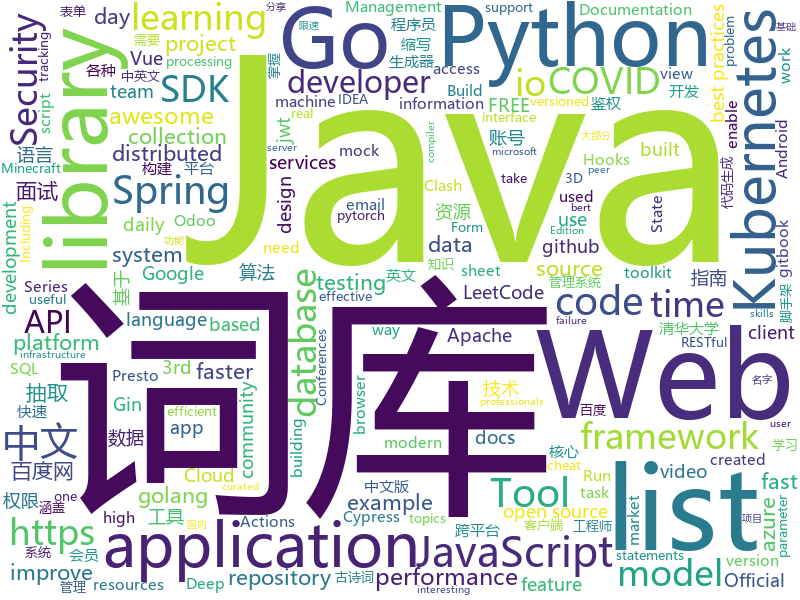

# 2020-04-16
See what the GitHub community is most excited about.

## python
+ [examples-of-web-crawlers](https://github.com/shengqiangzhang/examples-of-web-crawlers)(**190 stars today**): 一些非常有趣的python爬虫例子,对新手比较友好,主要爬取淘宝、天猫、微信、豆瓣、QQ等网站。(Some interesting examples of python crawlers that are friendly to beginners. )
+ [SubtitleBOX](https://github.com/sameera-madushan/SubtitleBOX)(**21 stars today**): Python script to download subtitles for your movies.
+ [PayloadsAllTheThings](https://github.com/swisskyrepo/PayloadsAllTheThings)(**32 stars today**): A list of useful payloads and bypass for Web Application Security and Pentest/CTF
+ [pandemic-ventilator-2.0](https://github.com/Mascobot/pandemic-ventilator-2.0)(**57 stars today**): Open Source Pandemic Ventilator with Raspberry Pi and Arduino
+ [gym](https://github.com/openai/gym)(**13 stars today**): A toolkit for developing and comparing reinforcement learning algorithms.
+ [cvat](https://github.com/opencv/cvat)(**11 stars today**): Powerful and efficient Computer Vision Annotation Tool (CVAT)
+ [Yet-Another-EfficientDet-Pytorch](https://github.com/zylo117/Yet-Another-EfficientDet-Pytorch)(**264 stars today**): The pytorch re-implement of the official efficientdet with SOTA performance in real time and pretrained weights.
+ [nni](https://github.com/microsoft/nni)(**11 stars today**): An open source AutoML toolkit for automate machine learning lifecycle, including feature engineering, neural architecture search, model compression and hyper-parameter tuning.
+ [models](https://github.com/tensorflow/models)(**24 stars today**): Models and examples built with TensorFlow
+ [ParamSpider](https://github.com/devanshbatham/ParamSpider)(**105 stars today**): Mining parameters from dark corners of Web Archives
+ [cassandra-workshop-online](https://github.com/DataStax-Academy/cassandra-workshop-online)(**6 stars today**): As attendee you will find everything you need for Cassandra Developer Workshop online
+ [confluent-kafka-python](https://github.com/confluentinc/confluent-kafka-python)(**3 stars today**): Confluent's Kafka Python Client
+ [bert](https://github.com/google-research/bert)(**26 stars today**): TensorFlow code and pre-trained models for BERT
+ [funNLP](https://github.com/fighting41love/funNLP)(**74 stars today**): 中英文敏感词、语言检测、中外手机/电话归属地/运营商查询、名字推断性别、手机号抽取、身份证抽取、邮箱抽取、中日文人名库、中文缩写库、拆字词典、词汇情感值、停用词、反动词表、暴恐词表、繁简体转换、英文模拟中文发音、汪峰歌词生成器、职业名称词库、同义词库、反义词库、否定词库、汽车品牌词库、汽车零件词库、连续英文切割、各种中文词向量、公司名字大全、古诗词库、IT词库、财经词库、成语词库、地名词库、历史名人词库、诗词词库、医学词库、饮食词库、法律词库、汽车词库、动物词库、中文聊天语料、中文谣言数据、百度中文问答数据集、句子相似度匹配算法集合、bert资源、文本生成&摘要相关工具、cocoNLP信息抽取工具、国内电话号码正则匹配、清华大学XLORE:中英文跨语言百科知识图谱、清华大学人工智能技术…
+ [machine_learning_examples](https://github.com/lazyprogrammer/machine_learning_examples)(**25 stars today**): A collection of machine learning examples and tutorials.
+ [ParlAI](https://github.com/facebookresearch/ParlAI)(**4 stars today**): A framework for training and evaluating AI models on a variety of openly available dialogue datasets.
+ [CheatSheetSeries](https://github.com/OWASP/CheatSheetSeries)(**4 stars today**): The OWASP Cheat Sheet Series was created to provide a concise collection of high value information on specific application security topics.
+ [dash](https://github.com/plotly/dash)(**51 stars today**): Analytical Web Apps for Python, R, and Julia. No JavaScript Required.
+ [sentry](https://github.com/getsentry/sentry)(**12 stars today**): Sentry is cross-platform application monitoring, with a focus on error reporting.
+ [numba](https://github.com/numba/numba)(**5 stars today**): NumPy aware dynamic Python compiler using LLVM
+ [pytorch_geometric](https://github.com/rusty1s/pytorch_geometric)(**16 stars today**): Geometric Deep Learning Extension Library for PyTorch
+ [spaCy](https://github.com/explosion/spaCy)(**9 stars today**): 💫Industrial-strength Natural Language Processing (NLP) with Python and Cython
+ [aws-cli](https://github.com/aws/aws-cli)(**6 stars today**): Universal Command Line Interface for Amazon Web Services
+ [moto](https://github.com/spulec/moto)(**4 stars today**): A library that allows you to easily mock out tests based on AWS infrastructure.
+ [keras](https://github.com/keras-team/keras)(**17 stars today**): Deep Learning for humans

## java
+ [toBeTopJavaer](https://github.com/hollischuang/toBeTopJavaer)(**206 stars today**): To Be Top Javaer - Java工程师成神之路
+ [keycloak](https://github.com/keycloak/keycloak)(**117 stars today**): Open Source Identity and Access Management For Modern Applications and Services
+ [spring-boot-api-project-seed](https://github.com/lihengming/spring-boot-api-project-seed)(**154 stars today**): 🌱🚀一个基于Spring Boot & MyBatis的种子项目，用于快速构建中小型API、RESTful API项目~
+ [druid](https://github.com/apache/druid)(**10 stars today**): Apache Druid: a high performance real-time analytics database.
+ [spring-framework](https://github.com/spring-projects/spring-framework)(**27 stars today**): Spring Framework
+ [Hystrix](https://github.com/Netflix/Hystrix)(**13 stars today**): Hystrix is a latency and fault tolerance library designed to isolate points of access to remote systems, services and 3rd party libraries, stop cascading failure and enable resilience in complex distributed systems where failure is inevitable.
+ [spring-boot](https://github.com/spring-projects/spring-boot)(**34 stars today**): Spring Boot
+ [xxl-job](https://github.com/xuxueli/xxl-job)(**25 stars today**): A distributed task scheduling framework.（分布式任务调度平台XXL-JOB）
+ [BigData-Notes](https://github.com/heibaiying/BigData-Notes)(**15 stars today**): 大数据入门指南⭐
+ [hbase](https://github.com/apache/hbase)(**5 stars today**): Apache HBase
+ [graal](https://github.com/oracle/graal)(**10 stars today**): GraalVM: Run Programs Faster Anywhere🚀
+ [ksql](https://github.com/confluentinc/ksql)(**6 stars today**): The event streaming database purpose-built for stream processing applications
+ [dp3t-sdk-android](https://github.com/DP-3T/dp3t-sdk-android)(**3 stars today**): The DP3T-SDK for Android
+ [Java-Tutorial](https://github.com/h2pl/Java-Tutorial)(**27 stars today**): 【Java工程师面试复习指南】本仓库涵盖大部分Java程序员所需要掌握的核心知识，整合了互联网上的很多优质Java技术文章，力求打造为最完整最实用的Java开发者学习指南，如果对你有帮助，给个star告诉我吧，谢谢！
+ [Android-PickerView](https://github.com/Bigkoo/Android-PickerView)(**13 stars today**): This is a picker view for android , support linkage effect, timepicker and optionspicker.（时间选择器、省市区三级联动）
+ [JavaGuide](https://github.com/Snailclimb/JavaGuide)(**137 stars today**): 【Java学习+面试指南】 一份涵盖大部分Java程序员所需要掌握的核心知识。
+ [liugh-parent](https://github.com/qq53182347/liugh-parent)(**13 stars today**): SpringBoot+JWT+Shiro+MybatisPlus实现Restful快速开发后端脚手架
+ [presto](https://github.com/prestosql/presto)(**3 stars today**): Official home of the community managed version of Presto, the distributed SQL query engine for big data, under the auspices of the Presto Software Foundation.
+ [configuration-as-code-plugin](https://github.com/jenkinsci/configuration-as-code-plugin)(**3 stars today**): Jenkins Configuration as Code Plugin
+ [CS-Notes](https://github.com/CyC2018/CS-Notes)(**117 stars today**): 📚技术面试必备基础知识、Leetcode、计算机操作系统、计算机网络、系统设计、Java、Python、C++
+ [azure-sdk-for-java](https://github.com/Azure/azure-sdk-for-java)(**0 stars today**): This repository is for active development of the Azure SDK for Java. For consumers of the SDK we recommend visiting our public developer docs at https://docs.microsoft.com/en-us/java/azure/ or our versioned developer docs at https://azure.github.io/azure-sdk-for-java.
+ [keycloak-quickstarts](https://github.com/keycloak/keycloak-quickstarts)(**3 stars today**): 
+ [Geyser](https://github.com/GeyserMC/Geyser)(**7 stars today**): A bridge/proxy allowing you to connect to Minecraft: Java Edition servers with Minecraft: Bedrock edition.
+ [tutorials](https://github.com/eugenp/tutorials)(**24 stars today**): Just Announced - "Learn Spring Security OAuth":
+ [incubator-shardingsphere](https://github.com/apache/incubator-shardingsphere)(**21 stars today**): Distributed database middleware

## unknown
+ [cobol-programming-course](https://github.com/openmainframeproject/cobol-programming-course)(**229 stars today**): COBOL Programming Course
+ [Best-websites-a-programmer-should-visit](https://github.com/sdmg15/Best-websites-a-programmer-should-visit)(**91 stars today**): 🔗Some useful websites for programmers.
+ [javascript-questions](https://github.com/lydiahallie/javascript-questions)(**65 stars today**): A long list of (advanced) JavaScript questions, and their explanations✨
+ [CyberProfDevelopmentCovidResources](https://github.com/gerryguy311/CyberProfDevelopmentCovidResources)(**33 stars today**): An awesome list of FREE resources for training, conferences, speaking, labs, reading, etc that are free all the time or during COVID-19 that cybersecurity professionals with downtime can take advantage of to improve their skills and marketability to come out on the other side ready to rock.
+ [app-ideas](https://github.com/florinpop17/app-ideas)(**214 stars today**): A Collection of application ideas which can be used to improve your coding skills.
+ [fucking-algorithm](https://github.com/labuladong/fucking-algorithm)(**1,703 stars today**): 手把手撕LeetCode题目，扒各种算法套路的裤子。English version supported! Crack LeetCode, not only how, but also why.
+ [OnJava8](https://github.com/LingCoder/OnJava8)(**77 stars today**): 《On Java 8》中文版，又名《Java编程思想》 第5版
+ [IntelliJ-IDEA-Tutorial](https://github.com/judasn/IntelliJ-IDEA-Tutorial)(**23 stars today**): IntelliJ IDEA 简体中文专题教程
+ [BaiduYunVIP](https://github.com/lpg-it/BaiduYunVIP)(**40 stars today**): 百度云百度网盘超级会员账号SVIP账号免费分享, 另分享多款百度网盘不限速下载工具以及各大平台会员账号（迅雷 优酷 爱奇艺 腾讯视频等）.
+ [kubernetes-the-hard-way](https://github.com/kelseyhightower/kubernetes-the-hard-way)(**21 stars today**): Bootstrap Kubernetes the hard way on Google Cloud Platform. No scripts.
+ [the-book-of-secret-knowledge](https://github.com/trimstray/the-book-of-secret-knowledge)(**21 stars today**): A collection of inspiring lists, manuals, cheatsheets, blogs, hacks, one-liners, cli/web tools and more.
+ [internship-application-product-management](https://github.com/cloudflare-internship-2020/internship-application-product-management)(**9 stars today**): 
+ [effective-java-3rd-chinese](https://github.com/sjsdfg/effective-java-3rd-chinese)(**106 stars today**): effective-java-3rd 中文版 https://sjsdfg.github.io/effective-java-3rd-chinese
+ [Rules](https://github.com/lhie1/Rules)(**24 stars today**): Rules / 规则：Surge / Shadowrocket / Surfboard / Clash
+ [awesome](https://github.com/sindresorhus/awesome)(**103 stars today**): 😎Awesome lists about all kinds of interesting topics
+ [SurviveSJTUManual](https://github.com/SurviveSJTU/SurviveSJTUManual)(**64 stars today**): 旨在更新2008年版本的《上海交通大学生存手册》并制作成gitbook发布于https://liankeqin.gitbook.io/survivesjtumanual/
+ [awesome-learning-resources](https://github.com/lauragift21/awesome-learning-resources)(**89 stars today**): 🔥Awesome list of resources on Web Development.
+ [google-mobility-reports-data](https://github.com/datasciencecampus/google-mobility-reports-data)(**3 stars today**): Archive of data extracted from the google community mobility reports
+ [spring-authorization-server](https://github.com/spring-projects-experimental/spring-authorization-server)(**94 stars today**): A community-driven project led by the Spring Security team and is focused on delivering Authorization Server support to the Spring community
+ [awesome-actions](https://github.com/sdras/awesome-actions)(**20 stars today**): A curated list of awesome actions to use on GitHub
+ [evil-man](https://github.com/CNwoman-bot/evil-man)(**8 stars today**): Evil Man - 中国男性之恶
+ [binance-official-api-docs](https://github.com/binance-exchange/binance-official-api-docs)(**4 stars today**): Official Documentation for the Binance APIs and Streams
+ [awesome-threat-detection](https://github.com/0x4D31/awesome-threat-detection)(**3 stars today**): A curated list of awesome threat detection and hunting resources
+ [Belajar-Dengan-Jenius-Golang](https://github.com/gungunfebrianza/Belajar-Dengan-Jenius-Golang)(**18 stars today**): Buku Belajar Dengan Jenius Golang
+ [can-i-take-over-xyz](https://github.com/EdOverflow/can-i-take-over-xyz)(**5 stars today**): "Can I take over XYZ?" — a list of services and how to claim (sub)domains with dangling DNS records.

## javascript
+ [project-guidelines](https://github.com/elsewhencode/project-guidelines)(**71 stars today**): A set of best practices for JavaScript projects
+ [google-meet-grid-view](https://github.com/Fugiman/google-meet-grid-view)(**20 stars today**): Userscript to offer a grid-view layout in Google Meets
+ [chinese-poetry](https://github.com/chinese-poetry/chinese-poetry)(**93 stars today**): The most comprehensive database of Chinese poetry🧶最全中华古诗词数据库, 唐宋两朝近一万四千古诗人, 接近5.5万首唐诗加26万宋诗. 两宋时期1564位词人，21050首词。
+ [decentralized-video-chat](https://github.com/ianramzy/decentralized-video-chat)(**596 stars today**): 🚀Zipcall.io🚀Peer to peer browser video calling platform with unmatched video quality and latency.
+ [carbon](https://github.com/carbon-design-system/carbon)(**6 stars today**): A design system built by IBM
+ [material-ui](https://github.com/mui-org/material-ui)(**43 stars today**): React components for faster and easier web development. Build your own design system, or start with Material Design.
+ [Corona-tracker](https://github.com/COVID-19-electronic-health-system/Corona-tracker)(**8 stars today**): A web application promoting accurate COVID-19 guidelines and tracking user symptoms
+ [react](https://github.com/facebook/react)(**88 stars today**): A declarative, efficient, and flexible JavaScript library for building user interfaces.
+ [pdf.js](https://github.com/mozilla/pdf.js)(**39 stars today**): PDF Reader in JavaScript
+ [next.js](https://github.com/zeit/next.js)(**54 stars today**): The React Framework
+ [cypress-example-recipes](https://github.com/cypress-io/cypress-example-recipes)(**6 stars today**): Various recipes for testing common scenarios with Cypress
+ [covid19-full-stack-application](https://github.com/anshumanpattnaik/covid19-full-stack-application)(**7 stars today**): (COVID-19) Full Stack Application
+ [core-js](https://github.com/zloirock/core-js)(**12 stars today**): Standard Library
+ [vuex](https://github.com/vuejs/vuex)(**17 stars today**): 🗃️Centralized State Management for Vue.js.
+ [react-query](https://github.com/tannerlinsley/react-query)(**43 stars today**): ⚛️Hooks for fetching, caching and updating asynchronous data in React
+ [three.js](https://github.com/mrdoob/three.js)(**35 stars today**): JavaScript 3D library.
+ [covid19-market-waiting-times](https://github.com/TheJoin95/covid19-market-waiting-times)(**13 stars today**): A project to help people stand in line at the market as little as possible
+ [formio.js](https://github.com/formio/formio.js)(**14 stars today**): JavaScript powered Forms with JSON Form Builder
+ [react-table](https://github.com/tannerlinsley/react-table)(**22 stars today**): ⚛️Hooks for building fast and extendable tables and datagrids for React
+ [watch-us-build-trello](https://github.com/Code-Pop/watch-us-build-trello)(**6 stars today**): 
+ [react-beautiful-dnd](https://github.com/atlassian/react-beautiful-dnd)(**17 stars today**): Beautiful and accessible drag and drop for lists with React
+ [jitsi-meet](https://github.com/jitsi/jitsi-meet)(**87 stars today**): Jitsi Meet - Secure, Simple and Scalable Video Conferences that you use as a standalone app or embed in your web application.
+ [babel](https://github.com/babel/babel)(**16 stars today**): 🐠Babel is a compiler for writing next generation JavaScript.
+ [clean-code-javascript](https://github.com/ryanmcdermott/clean-code-javascript)(**34 stars today**): 🛁Clean Code concepts adapted for JavaScript
+ [pixelbox](https://github.com/cstoquer/pixelbox)(**22 stars today**): A sandbox framework to fast-prototype tile-based games in HTML5 and JavaScript

## html
+ [Graphics](https://github.com/Unity-Technologies/Graphics)(**6 stars today**): Unity Graphics - Including Scriptable Render Pipeline
+ [tech-talks](https://github.com/databricks/tech-talks)(**6 stars today**): This repository contains the notebooks and presentations we use for our Databricks Tech Talks
+ [covid-19-uk-data](https://github.com/tomwhite/covid-19-uk-data)(**4 stars today**): Coronavirus (COVID-19) UK Historical Data
+ [nbnhhsh](https://github.com/itorr/nbnhhsh)(**100 stars today**): 😩「能不能好好说话？」 拼音首字母缩写翻译工具
+ [email-templates](https://github.com/ColorlibHQ/email-templates)(**3 stars today**): Free HTML email templates for Mailchimp and other emails services
+ [CamPhish](https://github.com/techchipnet/CamPhish)(**2 stars today**): Grab cam shots from target's phone front camera or PC webcam just sending a link.
+ [server-tools](https://github.com/OCA/server-tools)(**0 stars today**): Tools for Odoo Administrators to improve some technical features on Odoo.
+ [webdevbootcamp](https://github.com/nax3t/webdevbootcamp)(**9 stars today**): All source code for back-end projects from the Web Developer Bootcamp
+ [covid19](https://github.com/kaz-ogiwara/covid19)(**7 stars today**): 新型コロナウイルス感染症（COVID-19）の国内における状況を厚生労働省の報道発表資料からビジュアルにまとめた。
+ [stickyfill](https://github.com/wilddeer/stickyfill)(**1 stars today**): Polyfill for CSS `position: sticky`
+ [forecasting](https://github.com/microsoft/forecasting)(**54 stars today**): Time Series Forecasting Best Practices & Examples
+ [training-kit](https://github.com/github/training-kit)(**6 stars today**): Open source cheat sheets for Git and GitHub
+ [fastText](https://github.com/facebookresearch/fastText)(**11 stars today**): Library for fast text representation and classification.
+ [bullish](https://github.com/eduardosasso/bullish)(**46 stars today**): Stock market performance stats in your inbox
+ [docs](https://github.com/aws-amplify/docs)(**1 stars today**): Amplify Framework Documentation
+ [glTF](https://github.com/KhronosGroup/glTF)(**4 stars today**): glTF – Runtime 3D Asset Delivery
+ [OneList](https://github.com/MoeClub/OneList)(**5 stars today**): Simple index for onedrive
+ [AttackVectors](https://github.com/MassMove/AttackVectors)(**9 stars today**): A repository to monitor attack vectors from state-backed information operations
+ [phpstan](https://github.com/phpstan/phpstan)(**7 stars today**): PHP Static Analysis Tool - discover bugs in your code without running it!
+ [msteams-docs](https://github.com/MicrosoftDocs/msteams-docs)(**0 stars today**): Source for the Microsoft Teams developer platform documentation.
+ [Web-Development](https://github.com/Internshala-Online-Trainings/Web-Development)(**0 stars today**): 
+ [OpenClash](https://github.com/vernesong/OpenClash)(**15 stars today**): A Clash Client For OpenWrt
+ [Blog](https://github.com/yangkun19921001/Blog)(**28 stars today**): Android 面试宝典、数据结构和算法、音视频 (FFmpeg、AAC、x264、MediaCodec)、 C/C++ 、OpenCV、跨平台等学习记录
+ [Information-Security-Tasks](https://github.com/bb1nfosec/Information-Security-Tasks)(**4 stars today**): This repository is created only for infosec professionals whom work day to day basis to equip ourself with uptodate skillset, We can daily contribute daily one hour for day to day tasks and work on problem statements daily, Please contribute by providing problem statements and solutions
+ [cypress-example-kitchensink](https://github.com/cypress-io/cypress-example-kitchensink)(**0 stars today**): This is an example app used to showcase Cypress.io testing.

## go
+ [esbuild](https://github.com/evanw/esbuild)(**273 stars today**): An extremely fast JavaScript bundler and minifier
+ [go-admin](https://github.com/wenjianzhang/go-admin)(**54 stars today**): 基于Gin + Vue + Element UI的前后端分离权限管理系统脚手架（包含了：基础用户管理功能，jwt鉴权，代码生成器，RABC资源控制，表单构建等）
+ [sarama](https://github.com/Shopify/sarama)(**9 stars today**): Sarama is a Go library for Apache Kafka 0.8, and up.
+ [BaiduPCS-Go](https://github.com/iikira/BaiduPCS-Go)(**239 stars today**): 百度网盘客户端 - Go语言编写
+ [kube-bench](https://github.com/aquasecurity/kube-bench)(**8 stars today**): Checks whether Kubernetes is deployed according to security best practices as defined in the CIS Kubernetes Benchmark
+ [client-go](https://github.com/kubernetes/client-go)(**10 stars today**): Go client for Kubernetes.
+ [gin-vue-admin](https://github.com/flipped-aurora/gin-vue-admin)(**31 stars today**): 基于gin+vue搭建的后台管理系统框架，集成jwt鉴权，权限管理，动态路由，分页封装，多点登录拦截，资源权限，上传下载，代码生成器，表单生成器等基础功能，更多功能正在开发中，欢迎issue和pr~
+ [gopsutil](https://github.com/shirou/gopsutil)(**18 stars today**): psutil for golang
+ [enhancements](https://github.com/kubernetes/enhancements)(**3 stars today**): Features tracking repo for Kubernetes releases
+ [Cloudreve](https://github.com/cloudreve/Cloudreve)(**53 stars today**): 🌈支持多家云存储的云盘系统 (A project helps you build your own cloud in minutes)
+ [cortex](https://github.com/cortexlabs/cortex)(**108 stars today**): Cloud native model serving infrastructure
+ [flagger](https://github.com/weaveworks/flagger)(**6 stars today**): Progressive delivery Kubernetes operator (Canary, A/B Testing and Blue/Green deployments)
+ [grpc-go](https://github.com/grpc/grpc-go)(**8 stars today**): The Go language implementation of gRPC. HTTP/2 based RPC
+ [client_golang](https://github.com/prometheus/client_golang)(**1 stars today**): Prometheus instrumentation library for Go applications
+ [pan-light](https://github.com/peterq/pan-light)(**23 stars today**): 百度网盘不限速客户端, golang + qt5, 跨平台图形界面
+ [terraform](https://github.com/hashicorp/terraform)(**24 stars today**): Terraform enables you to safely and predictably create, change, and improve infrastructure. It is an open source tool that codifies APIs into declarative configuration files that can be shared amongst team members, treated as code, edited, reviewed, and versioned.
+ [alertmanager](https://github.com/prometheus/alertmanager)(**4 stars today**): Prometheus Alertmanager
+ [gin](https://github.com/gin-gonic/gin)(**46 stars today**): Gin is a HTTP web framework written in Go (Golang). It features a Martini-like API with much better performance -- up to 40 times faster. If you need smashing performance, get yourself some Gin.
+ [act](https://github.com/nektos/act)(**38 stars today**): Run your GitHub Actions locally🚀
+ [k6](https://github.com/loadimpact/k6)(**13 stars today**): A modern load testing tool, using Go and JavaScript - https://k6.io
+ [helm](https://github.com/helm/helm)(**10 stars today**): The Kubernetes Package Manager
+ [aws-sdk-go](https://github.com/aws/aws-sdk-go)(**0 stars today**): AWS SDK for the Go programming language.
+ [go-sqlmock](https://github.com/DATA-DOG/go-sqlmock)(**8 stars today**): Sql mock driver for golang to test database interactions
+ [chromedp](https://github.com/chromedp/chromedp)(**8 stars today**): A faster, simpler way to drive browsers supporting the Chrome DevTools Protocol.
+ [elastic](https://github.com/olivere/elastic)(**3 stars today**): Elasticsearch client for Go.

## WordCloud

