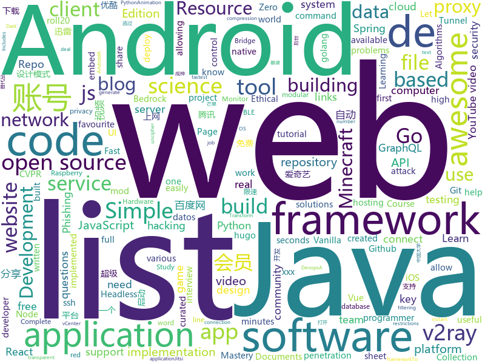

# 2020-04-19
See what the GitHub community is most excited about.

## python
+ [avatarify](https://github.com/alievk/avatarify)(**602 stars today**): Avatars for Zoom and Skype
+ [bird-bot](https://github.com/natewong1313/bird-bot)(**28 stars today**): A Nintendo Switch checkout bot. Currently supports Walmart and Bestbuy
+ [youtube-dl](https://github.com/ytdl-org/youtube-dl)(**82 stars today**): Command-line program to download videos from YouTube.com and other video sites
+ [Real-Time-Voice-Cloning](https://github.com/CorentinJ/Real-Time-Voice-Cloning)(**67 stars today**): Clone a voice in 5 seconds to generate arbitrary speech in real-time
+ [system-design-primer](https://github.com/donnemartin/system-design-primer)(**305 stars today**): Learn how to design large-scale systems. Prep for the system design interview. Includes Anki flashcards.
+ [ResNeSt](https://github.com/zhanghang1989/ResNeSt)(**184 stars today**): ResNeSt: Split-Attention Network
+ [public-apis](https://github.com/public-apis/public-apis)(**316 stars today**): A collective list of free APIs for use in software and web development.
+ [Learning-to-See-in-the-Dark](https://github.com/cchen156/Learning-to-See-in-the-Dark)(**184 stars today**): Learning to See in the Dark. CVPR 2018
+ [cupp](https://github.com/Mebus/cupp)(**46 stars today**): Common User Passwords Profiler (CUPP)
+ [vmware_vcenter_cve_2020_3952](https://github.com/guardicore/vmware_vcenter_cve_2020_3952)(**25 stars today**): Exploit for CVE-2020-3952 in vCenter 6.7
+ [XX-Net](https://github.com/XX-net/XX-Net)(**12 stars today**): a web proxy tool
+ [RsaCtfTool](https://github.com/Ganapati/RsaCtfTool)(**4 stars today**): RSA attack tool (mainly for ctf) - retreive private key from weak public key and/or uncipher data
+ [eviloffice](https://github.com/thelinuxchoice/eviloffice)(**12 stars today**): Inject Macro and DDE code into Excel and Word documents (reverse shell)
+ [game-programmer](https://github.com/miloyip/game-programmer)(**7 stars today**): A Study Path for Game Programmer
+ [core](https://github.com/home-assistant/core)(**22 stars today**): 🏡Open source home automation that puts local control and privacy first
+ [AutoDeleteFileOnPCWechat](https://github.com/blackboxo/AutoDeleteFileOnPCWechat)(**51 stars today**): 自动删除 PC 端微信缓存数据，包括从所有聊天中自动下载的大量文件、视频、图片等数据内容，解放你的空间。
+ [dash](https://github.com/plotly/dash)(**93 stars today**): Analytical Web Apps for Python, R, and Julia. No JavaScript Required.
+ [pentest-tools](https://github.com/gwen001/pentest-tools)(**26 stars today**): Custom pentesting tools
+ [saleor](https://github.com/mirumee/saleor)(**23 stars today**): A modular, high performance, headless e-commerce storefront built with Python, GraphQL, Django, and ReactJS.
+ [hexapod-robot-simulator](https://github.com/mithi/hexapod-robot-simulator)(**29 stars today**): 🕷️A simple browser-based hexapod robot simulator built from first principles🕷️
+ [django](https://github.com/django/django)(**38 stars today**): The Web framework for perfectionists with deadlines.
+ [numpy-100](https://github.com/rougier/numpy-100)(**5 stars today**): 100 numpy exercises (with solutions)
+ [awesome-python](https://github.com/vinta/awesome-python)(**37 stars today**): A curated list of awesome Python frameworks, libraries, software and resources
+ [Python](https://github.com/TheAlgorithms/Python)(**66 stars today**): All Algorithms implemented in Python
+ [manim](https://github.com/3b1b/manim)(**80 stars today**): Animation engine for explanatory math videos

## java
+ [Geyser](https://github.com/GeyserMC/Geyser)(**5 stars today**): A bridge/proxy allowing you to connect to Minecraft: Java Edition servers with Minecraft: Bedrock edition.
+ [Mindustry](https://github.com/Anuken/Mindustry)(**11 stars today**): A sandbox tower defense game
+ [libgdx](https://github.com/libgdx/libgdx)(**8 stars today**): Desktop/Android/HTML5/iOS Java game development framework
+ [toBeTopJavaer](https://github.com/hollischuang/toBeTopJavaer)(**107 stars today**): To Be Top Javaer - Java工程师成神之路
+ [spring-authorization-server](https://github.com/spring-projects-experimental/spring-authorization-server)(**42 stars today**): A community-driven project led by the Spring Security team and is focused on delivering Authorization Server support to the Spring community
+ [devops-master-class](https://github.com/in28minutes/devops-master-class)(**3 stars today**): Learn Devops with Docker, Kubernetes, Terraform, Ansible, Jenkins and Azure Devops
+ [DragonProxy](https://github.com/DragonetMC/DragonProxy)(**9 stars today**): A proxy to allow Minecraft: Bedrock clients to connect to Minecraft: Java Edition servers.
+ [interviews](https://github.com/kdn251/interviews)(**24 stars today**): Everything you need to know to get the job.
+ [Arduino](https://github.com/arduino/Arduino)(**7 stars today**): open-source electronics platform
+ [cryptomator](https://github.com/cryptomator/cryptomator)(**16 stars today**): Multi-platform transparent client-side encryption of your files in the cloud
+ [algs4](https://github.com/kevin-wayne/algs4)(**6 stars today**): Algorithms, 4th edition textbook code and libraries
+ [tx-lcn](https://github.com/codingapi/tx-lcn)(**3 stars today**): LCN distributed transaction framework, compatible with dubbo, spring cloud and Motan framework, supports various relational databases
+ [CameraView](https://github.com/natario1/CameraView)(**4 stars today**): 📸A well documented, high-level Android interface that makes capturing pictures and videos easy, addressing all of the common issues and needs. Real-time filters, gestures, watermarks, frame processing, RAW, output of any size.
+ [android](https://github.com/nextcloud/android)(**7 stars today**): 📱Nextcloud Android app
+ [storm](https://github.com/apache/storm)(**1 stars today**): Mirror of Apache Storm
+ [PlusTiC](https://github.com/Landmaster/PlusTiC)(**0 stars today**): Minecraft mod for adding new tools to and integrating various mods with Tinkers Construct
+ [PCHWRM_Server](https://github.com/dubbadhar/PCHWRM_Server)(**49 stars today**): PC Hardware Resource Monitor for Raspberry Pi
+ [PCHWRM_Client](https://github.com/dubbadhar/PCHWRM_Client)(**38 stars today**): PC Hardware Resource Monitor For Raspberry Pi
+ [interview](https://github.com/mission-peace/interview)(**12 stars today**): Interview questions
+ [apollo-android](https://github.com/apollographql/apollo-android)(**7 stars today**): 📟A strongly-typed, caching GraphQL client for Android and the JVM
+ [ShizuruNotes](https://github.com/MalitsPlus/ShizuruNotes)(**14 stars today**): An unofficial Android tool application of the game "Princess Connect Re:Dive"
+ [HackerRank_solutions](https://github.com/RodneyShag/HackerRank_solutions)(**2 stars today**): 317 efficient solutions to HackerRank problems
+ [fullstack-tutorial](https://github.com/frank-lam/fullstack-tutorial)(**12 stars today**): 🚀fullstack tutorial 2020，后台技术栈/架构师之路/全栈开发社区，春招/秋招/校招/面试
+ [libsvm](https://github.com/cjlin1/libsvm)(**5 stars today**): 
+ [dex2jar](https://github.com/pxb1988/dex2jar)(**7 stars today**): Tools to work with android .dex and java .class files

## unknown
+ [dp3t-app-android](https://github.com/DP-3T/dp3t-app-android)(**20 stars today**): The DP3T-App for Android
+ [coding-interview-university](https://github.com/jwasham/coding-interview-university)(**255 stars today**): A complete computer science study plan to become a software engineer.
+ [Best-websites-a-programmer-should-visit](https://github.com/sdmg15/Best-websites-a-programmer-should-visit)(**208 stars today**): 🔗Some useful websites for programmers.
+ [developer-roadmap](https://github.com/kamranahmedse/developer-roadmap)(**296 stars today**): Roadmap to becoming a web developer in 2020
+ [QuantumultX](https://github.com/nzw9314/QuantumultX)(**18 stars today**): QuantumultX
+ [awesome-datascience](https://github.com/academic/awesome-datascience)(**38 stars today**): 📝An awesome Data Science repository to learn and apply for real world problems.
+ [Baidu-XunleiVIP](https://github.com/VIP-Share/Baidu-XunleiVIP)(**126 stars today**): 百度网盘超级会员，迅雷会员、爱奇艺会员账号每日分享,，还有优酷，腾讯，芒果等VIP。
+ [BaiduYunVIP](https://github.com/lpg-it/BaiduYunVIP)(**69 stars today**): 百度云百度网盘超级会员账号SVIP账号免费分享, 另分享多款百度网盘不限速下载工具以及各大平台会员账号（迅雷 优酷 爱奇艺 腾讯视频等）.
+ [PENTESTING-BIBLE](https://github.com/blaCCkHatHacEEkr/PENTESTING-BIBLE)(**20 stars today**): This repository was created and developed by Ammar Amer @cry__pto Only. Updates to this repository will continue to arrive until the number of links reaches 10000 links & 10000 pdf files .Learn Ethical Hacking and penetration testing .hundreds of ethical hacking & penetration testing & red team & cyber security & computer science resources.
+ [the-art-of-command-line](https://github.com/jlevy/the-art-of-command-line)(**225 stars today**): Master the command line, in one page
+ [free-programming-books](https://github.com/EbookFoundation/free-programming-books)(**342 stars today**): 📚Freely available programming books
+ [1](https://github.com/8jie88/1)(**18 stars today**): 这里是直播平台永久回家页，有最新app下载地址。
+ [build-your-own-x](https://github.com/danistefanovic/build-your-own-x)(**335 stars today**): 🤓Build your own (insert technology here)
+ [awesome-learning-resources](https://github.com/lauragift21/awesome-learning-resources)(**237 stars today**): 🔥Awesome list of resources on Web Development.
+ [new-pac](https://github.com/Alvin9999/new-pac)(**32 stars today**): 科学上网/自由上网/翻墙/软件/方法，免费shadowsocks/ss/ssr/v2ray/goflyway账号，vps一键搭建脚本/教程
+ [Xiaomi_Kernel_OpenSource](https://github.com/MiCode/Xiaomi_Kernel_OpenSource)(**15 stars today**): Xiaomi Mobile Phone Kernel OpenSource
+ [Flutter-Course-Resources](https://github.com/londonappbrewery/Flutter-Course-Resources)(**54 stars today**): Learn to Code While Building Apps - The Complete Flutter Development Bootcamp
+ [gitignore](https://github.com/github/gitignore)(**170 stars today**): A collection of useful .gitignore templates
+ [documents](https://github.com/DP-3T/documents)(**82 stars today**): Decentralized Privacy-Preserving Proximity Tracing -- Documents
+ [OnJava8](https://github.com/LingCoder/OnJava8)(**98 stars today**): 《On Java 8》中文版，又名《Java编程思想》 第5版
+ [CVPR2020-Code](https://github.com/amusi/CVPR2020-Code)(**10 stars today**): CVPR 2020 论文开源项目合集
+ [ShengDownload](https://github.com/WaterFishJ/ShengDownload)(**96 stars today**): 2020-4-15 panDownload终究倒下，还是没能逃过xxx的xxx。他的替代品ShengDownload即日起正式启动。基于ShengLang开发，跨平台
+ [awesome-web-hacking](https://github.com/infoslack/awesome-web-hacking)(**13 stars today**): A list of web application security
+ [awesome](https://github.com/sindresorhus/awesome)(**86 stars today**): 😎Awesome lists about all kinds of interesting topics
+ [awesome-baremetal](https://github.com/alexellis/awesome-baremetal)(**106 stars today**): Bare-metal is awesome. Let's share our favourite tools.

## javascript
+ [vanilla-parcel-boilerplate](https://github.com/bradtraversy/vanilla-parcel-boilerplate)(**72 stars today**): Simple starter workflow for building vanilla js apps with Parcel
+ [watch-us-build-trello](https://github.com/Code-Pop/watch-us-build-trello)(**9 stars today**): 
+ [covid19india-react](https://github.com/covid19india/covid19india-react)(**67 stars today**): 📊Source code of the main website
+ [project_corona_tracker](https://github.com/adrianhajdin/project_corona_tracker)(**35 stars today**): This is a code repository for the corresponding YouTube video. In this tutorial we are going to build and deploy a corona tracker application. Covered topics: React.js, Chart.js, Material UI and much more.
+ [openSleep](https://github.com/tomasero/openSleep)(**12 stars today**): platform for sleep hacking and research
+ [pwndrop](https://github.com/kgretzky/pwndrop)(**52 stars today**): Self-deployable file hosting service for red teamers, allowing to easily upload and share payloads over HTTP and WebDAV.
+ [graphql-engine](https://github.com/hasura/graphql-engine)(**33 stars today**): Blazing fast, instant realtime GraphQL APIs on Postgres with fine grained access control, also trigger webhooks on database events.
+ [gridstudio](https://github.com/ricklamers/gridstudio)(**145 stars today**): Grid studio is a web-based application for data science with full integration of open source data science frameworks and languages.
+ [authentication_course](https://github.com/Code-Pop/authentication_course)(**7 stars today**): Repo for Vue Mastery's Token-Based Authentication course
+ [javascript-algorithms](https://github.com/trekhleb/javascript-algorithms)(**228 stars today**): 📝Algorithms and data structures implemented in JavaScript with explanations and links to further readings
+ [ferdi](https://github.com/getferdi/ferdi)(**30 stars today**): 🧔🏽 Community fork of @meetfranz. Ferdi allows you to combine your favourite messaging services into one application
+ [jitsi-meet](https://github.com/jitsi/jitsi-meet)(**120 stars today**): Jitsi Meet - Secure, Simple and Scalable Video Conferences that you use as a standalone app or embed in your web application.
+ [strapi](https://github.com/strapi/strapi)(**38 stars today**): 🚀Open source Node.js Headless CMS to easily build customisable APIs
+ [awesome-selfhosted](https://github.com/awesome-selfhosted/awesome-selfhosted)(**47 stars today**): A list of Free Software network services and web applications which can be hosted locally. Selfhosting is the process of hosting and managing applications instead of renting from Software-as-a-Service providers
+ [Unit-Testing](https://github.com/Code-Pop/Unit-Testing)(**7 stars today**): Repo for Vue Mastery's Unit Testing course
+ [website](https://github.com/CodingTrain/website)(**5 stars today**): Coding Train website
+ [discord.js](https://github.com/discordjs/discord.js)(**7 stars today**): A powerful JavaScript library for interacting with the Discord API
+ [cxmooc-tools](https://github.com/CodFrm/cxmooc-tools)(**35 stars today**): 一个 超星(学习通)/智慧树(知到)/中国大学慕课 刷课工具,火狐,谷歌,油猴支持.全自动任务,视频倍速秒过,作业考试题库,验证码自动打码(੧ᐛ੭挂科模式,启动)
+ [dribbble2react](https://github.com/react-ui-kit/dribbble2react)(**3 stars today**): Transform Dribbble designs to React-Native code | Shop UI Kit >>
+ [freeCodeCamp](https://github.com/freeCodeCamp/freeCodeCamp)(**56 stars today**): freeCodeCamp.org's open source codebase and curriculum. Learn to code for free together with millions of people.
+ [iptv](https://github.com/iptv-org/iptv)(**25 stars today**): Collection of 8000+ publicly available IPTV channels from all over the world
+ [vue-next-webpack-preview](https://github.com/vuejs/vue-next-webpack-preview)(**4 stars today**): 
+ [scripts](https://github.com/chavyleung/scripts)(**5 stars today**): 
+ [next.js](https://github.com/zeit/next.js)(**37 stars today**): The React Framework
+ [json-server](https://github.com/typicode/json-server)(**47 stars today**): Get a full fake REST API with zero coding in less than 30 seconds (seriously)

## html
+ [pandownload-fake-server](https://github.com/TkzcM/pandownload-fake-server)(**347 stars today**): 重定向服务器打开 Pandownload
+ [OpenClash](https://github.com/vernesong/OpenClash)(**19 stars today**): A Clash Client For OpenWrt
+ [pandownload.com_Pages_Backup](https://github.com/Womsxd/pandownload.com_Pages_Backup)(**42 stars today**): pandownload页面的备份，应该是比较完全的一份
+ [zphisher](https://github.com/htr-tech/zphisher)(**6 stars today**): Automated Phishing Tool
+ [java](https://github.com/bjmashibing/java)(**2 stars today**): 
+ [hyperblog](https://github.com/freddier/hyperblog)(**10 stars today**): Un blog increíble para el curso de Git y Github de Platzi
+ [datasciencecoursera](https://github.com/mGalarnyk/datasciencecoursera)(**7 stars today**): Data Science Repo and blog for John Hopkins Coursera Courses. Please let me know if you have any questions.
+ [awesome-piracy](https://github.com/Igglybuff/awesome-piracy)(**16 stars today**): A curated list of awesome warez and piracy links
+ [isbgpsafeyet.com](https://github.com/cloudflare/isbgpsafeyet.com)(**20 stars today**): Is BGP safe yet?
+ [ephtracy.github.io](https://github.com/ephtracy/ephtracy.github.io)(**4 stars today**): 
+ [learning-area](https://github.com/mdn/learning-area)(**3 stars today**): Github repo for the MDN Learning Area.
+ [training-kit](https://github.com/github/training-kit)(**6 stars today**): Open source cheat sheets for Git and GitHub
+ [datasets](https://github.com/datadista/datasets)(**3 stars today**): Fuente de datos de los reportajes y proyectos de periodismo de investigación y datos de DATADISTA
+ [hugo-coder](https://github.com/luizdepra/hugo-coder)(**5 stars today**): A minimalist blog theme for hugo.
+ [qiubaiying.github.io](https://github.com/qiubaiying/qiubaiying.github.io)(**5 stars today**): BY Blog ->
+ [shellphish](https://github.com/thelinuxchoice/shellphish)(**5 stars today**): 19 Social Media Phishing Pages #phishing #shellphish #phish
+ [personal-website](https://github.com/github/personal-website)(**6 stars today**): Code that'll help you kickstart a personal website that showcases your work as a software developer.
+ [hugo-academic](https://github.com/gcushen/hugo-academic)(**4 stars today**): 📝The website builder for Hugo. Build and deploy a beautiful website in minutes!
+ [node-ytdl-core](https://github.com/fent/node-ytdl-core)(**6 stars today**): YouTube video downloader in javascript.
+ [Front-end-Developer-Interview-Questions](https://github.com/h5bp/Front-end-Developer-Interview-Questions)(**15 stars today**): A list of helpful front-end related questions you can use to interview potential candidates, test yourself or completely ignore.
+ [docs](https://github.com/aws-amplify/docs)(**0 stars today**): Amplify Framework Documentation
+ [JavaScript30](https://github.com/wesbos/JavaScript30)(**6 stars today**): 30 Day Vanilla JS Challenge
+ [openwrt-packages](https://github.com/kenzok8/openwrt-packages)(**5 stars today**): openwet常用软件包
+ [roll20-character-sheets](https://github.com/Roll20/roll20-character-sheets)(**3 stars today**): Character sheet templates created by the community for use in Roll20 VTT. Contact team@roll20.net if critical hotfixes need to be requested.
+ [blog_os](https://github.com/phil-opp/blog_os)(**11 stars today**): Writing an OS in Rust

## go
+ [webrtc](https://github.com/pion/webrtc)(**23 stars today**): Pure Go implementation of the WebRTC API
+ [hugo](https://github.com/gohugoio/hugo)(**38 stars today**): The world’s fastest framework for building websites.
+ [Cloudreve](https://github.com/cloudreve/Cloudreve)(**24 stars today**): 🌈支持多家云存储的云盘系统 (A project helps you build your own cloud in minutes)
+ [codenames](https://github.com/jbowens/codenames)(**10 stars today**): Play codenames using a TV or computer for the board
+ [broccoli](https://github.com/aletheia-icu/broccoli)(**59 stars today**): Using brotli compression to embed static files in Go.
+ [goph](https://github.com/melbahja/goph)(**62 stars today**): 🤘The native golang ssh client to execute your commands over ssh connection.🚀🚀
+ [v2ray-web-manager](https://github.com/master-coder-ll/v2ray-web-manager)(**11 stars today**): v2ray-web-manager 是一个tls+ws+v2ray 一端口多用户的解决方案；同时增加了流量控制/账号管理/限速等功能。key word: v2ray admin , v2ray pannel ,v2ray web
+ [node_exporter](https://github.com/prometheus/node_exporter)(**6 stars today**): Exporter for machine metrics
+ [annie](https://github.com/iawia002/annie)(**19 stars today**): 👾Fast, simple and clean video downloader
+ [gocorona](https://github.com/ayoisaiah/gocorona)(**6 stars today**): Track the latest Coronavirus (COVID-19) statistics from your terminal
+ [prysm](https://github.com/prysmaticlabs/prysm)(**5 stars today**): Go implementation of the Ethereum Serenity protocol
+ [gobuster](https://github.com/OJ/gobuster)(**5 stars today**): Directory/File, DNS and VHost busting tool written in Go
+ [fem-intro-to-go](https://github.com/martensonbj/fem-intro-to-go)(**3 stars today**): 
+ [cloud-game](https://github.com/giongto35/cloud-game)(**17 stars today**): Web-based Cloud Gaming service for Retro Game
+ [proton-bridge](https://github.com/ProtonMail/proton-bridge)(**52 stars today**): ProtonMail Bridge application
+ [v2ray-core](https://github.com/v2ray/v2ray-core)(**40 stars today**): A platform for building proxies to bypass network restrictions.
+ [geph2](https://github.com/geph-official/geph2)(**8 stars today**): Geph (迷霧通) is a modular Internet censorship circumvention system designed specifically to deal with national filtering.
+ [golang-design-pattern](https://github.com/senghoo/golang-design-pattern)(**4 stars today**): 设计模式 Golang实现－《研磨设计模式》读书笔记
+ [gost](https://github.com/ginuerzh/gost)(**11 stars today**): GO Simple Tunnel - a simple tunnel written in golang
+ [brook](https://github.com/txthinking/brook)(**4 stars today**): Brook is a cross-platform(Linux/BSD/MacOS/Windows/Android/iOS) proxy/vpn software. Zero-Configuration.
+ [gecko](https://github.com/ava-labs/gecko)(**9 stars today**): Official Go implementation of an AVA node.
+ [bettercap](https://github.com/bettercap/bettercap)(**5 stars today**): The Swiss Army knife for 802.11, BLE and Ethernet networks reconnaissance and MITM attacks.
+ [micro](https://github.com/zyedidia/micro)(**11 stars today**): A modern and intuitive terminal-based text editor
+ [chainlink](https://github.com/smartcontractkit/chainlink)(**2 stars today**): node of the decentralized oracle network, bridging on and off-chain computation
+ [quic-go](https://github.com/lucas-clemente/quic-go)(**4 stars today**): A QUIC implementation in pure go

## WordCloud

