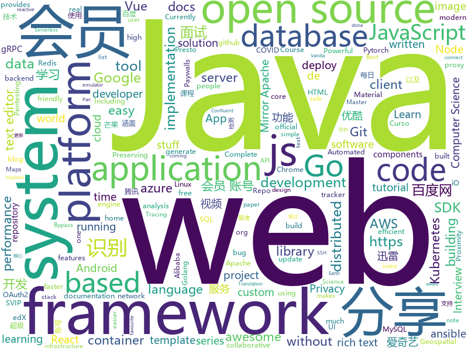

# 2020-04-22
See what the GitHub community is most excited about.

## python
+ [bird-bot](https://github.com/natewong1313/bird-bot)(**63 stars today**): A Nintendo Switch checkout bot. Currently supports Walmart and Best buy
+ [PyBoy](https://github.com/Baekalfen/PyBoy)(**460 stars today**): Game Boy emulator written in Python
+ [avatarify](https://github.com/alievk/avatarify)(**608 stars today**): Avatars for Zoom and Skype
+ [CrackMapExec](https://github.com/byt3bl33d3r/CrackMapExec)(**48 stars today**): A swiss army knife for pentesting networks
+ [data-scientist-roadmap](https://github.com/MrMimic/data-scientist-roadmap)(**71 stars today**): Toturial coming with "data science roadmap" graphe.
+ [awesome-graph-classification](https://github.com/benedekrozemberczki/awesome-graph-classification)(**29 stars today**): A collection of important graph embedding, classification and representation learning papers with implementations.
+ [ansible](https://github.com/ansible/ansible)(**27 stars today**): Ansible is a radically simple IT automation platform that makes your applications and systems easier to deploy. Avoid writing scripts or custom code to deploy and update your applications — automate in a language that approaches plain English, using SSH, with no agents to install on remote systems. https://docs.ansible.com/ansible/
+ [XX-Net](https://github.com/XX-net/XX-Net)(**19 stars today**): a web proxy tool
+ [covid-19-data](https://github.com/owid/covid-19-data)(**26 stars today**): Data on COVID-19 confirmed cases, deaths, and tests • All countries • Updated daily by Our World in Data
+ [deocclusion](https://github.com/XiaohangZhan/deocclusion)(**6 stars today**): Code for our CVPR 2020 work.
+ [Real-Time-Voice-Cloning](https://github.com/CorentinJ/Real-Time-Voice-Cloning)(**118 stars today**): Clone a voice in 5 seconds to generate arbitrary speech in real-time
+ [DeepSpeed](https://github.com/microsoft/DeepSpeed)(**9 stars today**): DeepSpeed is a deep learning optimization library that makes distributed training easy, efficient, and effective.
+ [edx-platform](https://github.com/edx/edx-platform)(**5 stars today**): The Open edX platform, the software that powers edX!
+ [tensorboard](https://github.com/tensorflow/tensorboard)(**5 stars today**): TensorFlow's Visualization Toolkit
+ [nhyai](https://github.com/wangshujingscan/nhyai)(**23 stars today**): AI智能审查，支持色情识别、暴恐识别、语言识别、敏感文字检测和视频检测等功能，以及各种OCR识别能力，如身份证、驾照、行驶证、营业执照、银行卡、手写体、车牌和名片识别等功能，可以访问网站体验功能。
+ [caldera](https://github.com/mitre/caldera)(**3 stars today**): Automated Adversary Emulation
+ [incubator-superset](https://github.com/apache/incubator-superset)(**20 stars today**): Apache Superset (incubating) is a modern, enterprise-ready business intelligence web application
+ [ResNeSt](https://github.com/zhanghang1989/ResNeSt)(**85 stars today**): ResNeSt: Split-Attention Network
+ [pytorch-CycleGAN-and-pix2pix](https://github.com/junyanz/pytorch-CycleGAN-and-pix2pix)(**8 stars today**): Image-to-Image Translation in PyTorch
+ [localstack](https://github.com/localstack/localstack)(**26 stars today**): 💻A fully functional local AWS cloud stack. Develop and test your cloud & Serverless apps offline!
+ [Bitcoin-Volume-Validator](https://github.com/Whalepool/Bitcoin-Volume-Validator)(**5 stars today**): 
+ [trape](https://github.com/jofpin/trape)(**6 stars today**): People tracker on the Internet: OSINT analysis and research tool by Jose Pino
+ [aiohttp](https://github.com/aio-libs/aiohttp)(**14 stars today**): Asynchronous HTTP client/server framework for asyncio and Python
+ [cp-docker-images](https://github.com/confluentinc/cp-docker-images)(**1 stars today**): Docker images for Confluent Platform.
+ [facenet-pytorch](https://github.com/timesler/facenet-pytorch)(**10 stars today**): Pretrained Pytorch face detection (MTCNN) and recognition (InceptionResnet) models

## java
+ [shardingsphere](https://github.com/apache/shardingsphere)(**90 stars today**): Distributed database middleware
+ [android-interview-questions](https://github.com/MindorksOpenSource/android-interview-questions)(**15 stars today**): Your Cheat Sheet For Android Interview - Android Interview Questions
+ [noiapp](https://github.com/noiapp/noiapp)(**21 stars today**): App per il contact tracking italiano. Open Source, Privacy Respectful
+ [dp3t-sdk-backend](https://github.com/DP-3T/dp3t-sdk-backend)(**10 stars today**): The backend implementation for DP3T
+ [aws-sdk-java](https://github.com/aws/aws-sdk-java)(**3 stars today**): The official AWS SDK for Java.
+ [calcite](https://github.com/apache/calcite)(**6 stars today**): Mirror of Apache Calcite
+ [JavaGuide](https://github.com/Snailclimb/JavaGuide)(**120 stars today**): 【Java学习+面试指南】 一份涵盖大部分Java程序员所需要掌握的核心知识。
+ [fullstack-tutorial](https://github.com/frank-lam/fullstack-tutorial)(**13 stars today**): 🚀fullstack tutorial 2020，后台技术栈/架构师之路/全栈开发社区，春招/秋招/校招/面试
+ [bigbluebutton](https://github.com/bigbluebutton/bigbluebutton)(**26 stars today**): Complete open source web conferencing system.
+ [hadoop](https://github.com/apache/hadoop)(**6 stars today**): Apache Hadoop
+ [dubbo](https://github.com/apache/dubbo)(**20 stars today**): Apache Dubbo is a high-performance, java based, open source RPC framework.
+ [storm](https://github.com/apache/storm)(**2 stars today**): Mirror of Apache Storm
+ [oshi](https://github.com/oshi/oshi)(**3 stars today**): Native Operating System and Hardware Information
+ [aws-cf-templates](https://github.com/widdix/aws-cf-templates)(**3 stars today**): Free Templates for AWS CloudFormation
+ [dbeaver](https://github.com/dbeaver/dbeaver)(**28 stars today**): Free universal database tool and SQL client
+ [azure-sdk-for-java](https://github.com/Azure/azure-sdk-for-java)(**2 stars today**): This repository is for active development of the Azure SDK for Java. For consumers of the SDK we recommend visiting our public developer docs at https://docs.microsoft.com/en-us/java/azure/ or our versioned developer docs at https://azure.github.io/azure-sdk-for-java.
+ [JDA](https://github.com/DV8FromTheWorld/JDA)(**4 stars today**): Java wrapper for the popular chat & VOIP service: Discord https://discordapp.com
+ [cloud2020](https://github.com/EiletXie/cloud2020)(**11 stars today**): SpringCloud2020最新技术学习
+ [guice](https://github.com/google/guice)(**4 stars today**): Guice (pronounced 'juice') is a lightweight dependency injection framework for Java 6 and above, brought to you by Google.
+ [presto](https://github.com/prestosql/presto)(**2 stars today**): Official home of the community managed version of Presto, the distributed SQL query engine for big data, under the auspices of the Presto Software Foundation.
+ [strimzi-kafka-operator](https://github.com/strimzi/strimzi-kafka-operator)(**4 stars today**): Apache Kafka running on Kubernetes
+ [SpringCloud](https://github.com/zhoutaoo/SpringCloud)(**17 stars today**): 基于SpringCloud2.1的微服务开发脚手架，整合了spring-security-oauth2、nacos、feign、sentinel、springcloud-gateway等。服务治理方面引入elasticsearch、skywalking、springboot-admin、zipkin等，让项目开发快速进入业务开发，而不需过多时间花费在架构搭建上。持续更新中
+ [activemq-artemis](https://github.com/apache/activemq-artemis)(**0 stars today**): Mirror of Apache ActiveMQ Artemis
+ [zaproxy](https://github.com/zaproxy/zaproxy)(**6 stars today**): The OWASP ZAP core project
+ [spring-cloud-alibaba](https://github.com/alibaba/spring-cloud-alibaba)(**42 stars today**): Spring Cloud Alibaba provides a one-stop solution for application development for the distributed solutions of Alibaba middleware.

## unknown
+ [Baidu-XunleiVIP](https://github.com/VIP-Share/Baidu-XunleiVIP)(**274 stars today**): 百度网盘超级会员，迅雷会员、爱奇艺会员账号每日分享，还有优酷，腾讯，芒果等VIP。AND。百度网盘(百度云)不限速工具分享。
+ [BaiduYunVIP](https://github.com/lpg-it/BaiduYunVIP)(**198 stars today**): 百度云百度网盘超级会员账号SVIP账号免费分享, 另分享多款百度网盘不限速下载工具以及各大平台会员账号（迅雷 优酷 爱奇艺 腾讯视频等）.
+ [awesome-datascience](https://github.com/academic/awesome-datascience)(**135 stars today**): 📝An awesome Data Science repository to learn and apply for real world problems.
+ [dp3t-app-android](https://github.com/DP-3T/dp3t-app-android)(**33 stars today**): The DP3T-App for Android
+ [pepp-pt-documentation](https://github.com/pepp-pt/pepp-pt-documentation)(**20 stars today**): Documentation for Pan-European Privacy-Preserving Proximity Tracing (PEPP-PT)
+ [vip_share](https://github.com/goyoka/vip_share)(**137 stars today**): 每日分享 百度网盘SVIP账号、爱奇艺会员、芒果会员、搜狐会员、喜马拉雅会员、优酷会员、迅雷会员会员账号分享 (低调使用)
+ [coding-interview-university](https://github.com/jwasham/coding-interview-university)(**299 stars today**): A complete computer science study plan to become a software engineer.
+ [documents](https://github.com/ROBERT-proximity-tracing/documents)(**21 stars today**): Protocol specification, white paper, high level documents, etc.
+ [OnJava8](https://github.com/LingCoder/OnJava8)(**88 stars today**): 《On Java 8》中文版，又名《Java编程思想》 第5版
+ [awesome-learning-resources](https://github.com/lauragift21/awesome-learning-resources)(**68 stars today**): 🔥Awesome list of resources on Web Development.
+ [hiring2020](https://github.com/gcreddy42/hiring2020)(**14 stars today**): Internship status of companies - COVID-19
+ [Specs](https://github.com/CocoaPods/Specs)(**4 stars today**): The CocoaPods Master Repo
+ [computer-science](https://github.com/ossu/computer-science)(**45 stars today**): 🎓Path to a free self-taught education in Computer Science!
+ [Java-Interview](https://github.com/gzc426/Java-Interview)(**8 stars today**): Java 面试必会 直通BAT
+ [awesome-baremetal](https://github.com/alexellis/awesome-baremetal)(**14 stars today**): Bare-metal is awesome. Let's share our favourite tools.
+ [learn-regex](https://github.com/ziishaned/learn-regex)(**22 stars today**): Learn regex the easy way
+ [xamarin-forms-goodlooking-UI](https://github.com/jsuarezruiz/xamarin-forms-goodlooking-UI)(**4 stars today**): Xamarin.Forms goodlooking UI samples
+ [documents](https://github.com/DP-3T/documents)(**72 stars today**): Decentralized Privacy-Preserving Proximity Tracing -- Documents
+ [docker-traefik](https://github.com/htpcBeginner/docker-traefik)(**12 stars today**): Docker media and home server stack with Docker Compose, Traefik, Swarm Mode, Google OAuth2, and LetsEncrypt
+ [You-Dont-Know-JS](https://github.com/getify/You-Dont-Know-JS)(**39 stars today**): A book series on JavaScript. @YDKJS on twitter.
+ [JavaInterview](https://github.com/gsjqwyl/JavaInterview)(**10 stars today**): Java面试整理，涵盖基础、JVM、线程并发、框架、MySQL、微服务、Redis、中间件、数据结构与算法等。陆续完善中
+ [Beginner-Network-Pentesting](https://github.com/hmaverickadams/Beginner-Network-Pentesting)(**4 stars today**): Notes for Beginner Network Pentesting Course
+ [tips_for_interview](https://github.com/conanhujinming/tips_for_interview)(**13 stars today**): 我的一些面试心得；自学CS历程分享；找工作经验分享
+ [til](https://github.com/thoughtbot/til)(**4 stars today**): Today I Learned
+ [awesome-scalability](https://github.com/binhnguyennus/awesome-scalability)(**15 stars today**): The Patterns of Scalable, Reliable, and Performant Large-Scale Systems

## javascript
+ [orbit-db](https://github.com/orbitdb/orbit-db)(**127 stars today**): Peer-to-Peer Databases for the Decentralized Web
+ [puppeteer](https://github.com/puppeteer/puppeteer)(**48 stars today**): Headless Chrome Node.js API
+ [joplin](https://github.com/laurent22/joplin)(**47 stars today**): Joplin - an open source note taking and to-do application with synchronization capabilities for Windows, macOS, Linux, Android and iOS. Forum: https://discourse.joplinapp.org/
+ [next.js](https://github.com/zeit/next.js)(**68 stars today**): The React Framework
+ [lazysizes](https://github.com/aFarkas/lazysizes)(**16 stars today**): High performance and SEO friendly lazy loader for images (responsive and normal), iframes and more, that detects any visibility changes triggered through user interaction, CSS or JavaScript without configuration.
+ [docusaurus](https://github.com/facebook/docusaurus)(**26 stars today**): Easy to maintain open source documentation websites.
+ [bypass-paywalls-chrome](https://github.com/iamadamdev/bypass-paywalls-chrome)(**32 stars today**): Bypass Paywalls for Chrome
+ [project_corona_tracker](https://github.com/adrianhajdin/project_corona_tracker)(**37 stars today**): This is a code repository for the corresponding YouTube video. In this tutorial we are going to build and deploy a corona tracker application. Covered topics: React.js, Chart.js, Material UI and much more.
+ [react](https://github.com/facebook/react)(**68 stars today**): A declarative, efficient, and flexible JavaScript library for building user interfaces.
+ [openSleep](https://github.com/tomasero/openSleep)(**8 stars today**): platform for sleep hacking and research
+ [bypass-paywalls-chrome-clean](https://github.com/magnolia1234-new/bypass-paywalls-chrome-clean)(**34 stars today**): Bypass Paywalls Clean for Chrome (no Google Analytics, lot of updates/bug-fixes and custom sites)
+ [nuxt.js](https://github.com/nuxt/nuxt.js)(**33 stars today**): The Vue.js Framework
+ [cesium](https://github.com/CesiumGS/cesium)(**9 stars today**): An open-source JavaScript library for world-class 3D globes and maps🌎
+ [svelte](https://github.com/sveltejs/svelte)(**28 stars today**): Cybernetically enhanced web apps
+ [stimulus_reflex](https://github.com/hopsoft/stimulus_reflex)(**20 stars today**): Build reactive applications with the Rails tooling you already know and love.
+ [bootstrap-vue](https://github.com/bootstrap-vue/bootstrap-vue)(**6 stars today**): BootstrapVue, with over 45 plugins, more than 85 custom components and over 500 icons, provides one of the most comprehensive implementations of Bootstrap v4 components and grid system for Vue.js. With extensive and automated WAI-ARIA accessibility markup.
+ [freeCodeCamp](https://github.com/freeCodeCamp/freeCodeCamp)(**55 stars today**): freeCodeCamp.org's open source codebase and curriculum. Learn to code for free together with millions of people.
+ [chaoxing-xuexitong-autoflush](https://github.com/ZhyMC/chaoxing-xuexitong-autoflush)(**27 stars today**): 超星学习通全自动无人值守刷课程序，使用协议发包来实现，无需浏览器，支持自动过测验、过视频。
+ [hexo](https://github.com/hexojs/hexo)(**14 stars today**): A fast, simple & powerful blog framework, powered by Node.js.
+ [tiptap](https://github.com/scrumpy/tiptap)(**15 stars today**): A rich-text editor for Vue.js
+ [material-ui](https://github.com/mui-org/material-ui)(**39 stars today**): React components for faster and easier web development. Build your own design system, or start with Material Design.
+ [axios](https://github.com/axios/axios)(**69 stars today**): Promise based HTTP client for the browser and node.js
+ [draft-js](https://github.com/facebook/draft-js)(**9 stars today**): A React framework for building text editors.
+ [cypress-example-recipes](https://github.com/cypress-io/cypress-example-recipes)(**1 stars today**): Various recipes for testing common scenarios with Cypress
+ [slate](https://github.com/ianstormtaylor/slate)(**18 stars today**): A completely customizable framework for building rich text editors. (Currently in beta.)

## html
+ [isbgpsafeyet.com](https://github.com/cloudflare/isbgpsafeyet.com)(**9 stars today**): Is BGP safe yet?
+ [csgo_bugs](https://github.com/kkthxbye-code/csgo_bugs)(**2 stars today**): Random CSGO stuff
+ [box-line-text](https://github.com/jncraton/box-line-text)(**27 stars today**): Simple virtual whiteboarding
+ [awesome-earthobservation-code](https://github.com/acgeospatial/awesome-earthobservation-code)(**16 stars today**): curated list of awesome tools, tutorials, code, helpful projects, links, stuff about Earth Observation and Geospatial stuff!
+ [ckeditor5](https://github.com/ckeditor/ckeditor5)(**3 stars today**): Powerful rich text editor framework with a modular architecture, modern integrations and features like collaborative editing.
+ [git-it-electron](https://github.com/jlord/git-it-electron)(**2 stars today**): 💻🎓Git-it is a (Mac, Win, Linux) Desktop App for Learning Git and GitHub
+ [wpt](https://github.com/web-platform-tests/wpt)(**3 stars today**): Test suites for Web platform specs — including WHATWG, W3C, and others
+ [swagger-codegen](https://github.com/swagger-api/swagger-codegen)(**15 stars today**): swagger-codegen contains a template-driven engine to generate documentation, API clients and server stubs in different languages by parsing your OpenAPI / Swagger definition.
+ [Coursera-ML-AndrewNg-Notes](https://github.com/fengdu78/Coursera-ML-AndrewNg-Notes)(**21 stars today**): 吴恩达老师的机器学习课程个人笔记
+ [phpstan](https://github.com/phpstan/phpstan)(**4 stars today**): PHP Static Analysis Tool - discover bugs in your code without running it!
+ [forecasting](https://github.com/microsoft/forecasting)(**76 stars today**): Time Series Forecasting Best Practices & Examples
+ [JavaScript30](https://github.com/wesbos/JavaScript30)(**14 stars today**): 30 Day Vanilla JS Challenge
+ [GDIndex](https://github.com/maple3142/GDIndex)(**7 stars today**): A Google Drive Index built with Vue Running on CloudFlare Workers
+ [chrome-webrtc-pocs](https://github.com/james0x40/chrome-webrtc-pocs)(**0 stars today**): 
+ [patchwork](https://github.com/jlord/patchwork)(**0 stars today**): All the Git-it Workshop completers!
+ [html](https://github.com/javascriptteacher/html)(**9 stars today**): Commonplace HTML templates for everything you can think of
+ [web-api-auth-examples](https://github.com/spotify/web-api-auth-examples)(**4 stars today**): Basic examples to authenticate and fetch data using the Spotify Web API
+ [Graphics](https://github.com/Unity-Technologies/Graphics)(**4 stars today**): Unity Graphics - Including Scriptable Render Pipeline
+ [raytracing.github.io](https://github.com/RayTracing/raytracing.github.io)(**5 stars today**): Main Repo / Main Web Site
+ [leontrolski.github.io](https://github.com/leontrolski/leontrolski.github.io)(**8 stars today**): My homepage
+ [pdf2htmlEX](https://github.com/coolwanglu/pdf2htmlEX)(**2 stars today**): Convert PDF to HTML without losing text or format.
+ [javascript](https://github.com/gustavoguanabara/javascript)(**1 stars today**): Curso de JavaScript
+ [REKCARC-TSC-UHT](https://github.com/PKUanonym/REKCARC-TSC-UHT)(**16 stars today**): 清华大学计算机系课程攻略 Guidance for courses in Department of Computer Science and Technology, Tsinghua University
+ [hyperblog](https://github.com/freddier/hyperblog)(**11 stars today**): Un blog increíble para el curso de Git y Github de Platzi
+ [SVG-Loaders](https://github.com/SamHerbert/SVG-Loaders)(**1 stars today**): Loading icons and small animations built with pure SVG.

## go
+ [qrcp](https://github.com/claudiodangelis/qrcp)(**384 stars today**): ⚡Transfer files over wifi from your computer to your mobile device by scanning a QR code without leaving the terminal.
+ [oneinfra](https://github.com/oneinfra/oneinfra)(**73 stars today**): Kubernetes as a Service
+ [gin](https://github.com/gin-gonic/gin)(**56 stars today**): Gin is a HTTP web framework written in Go (Golang). It features a Martini-like API with much better performance -- up to 40 times faster. If you need smashing performance, get yourself some Gin.
+ [grpc-gateway](https://github.com/grpc-ecosystem/grpc-gateway)(**32 stars today**): gRPC to JSON proxy generator following the gRPC HTTP spec
+ [passwall-server](https://github.com/pass-wall/passwall-server)(**23 stars today**): PassWall Server is the core backend infrastructure for PassWall platform
+ [consul](https://github.com/hashicorp/consul)(**15 stars today**): Consul is a distributed, highly available, and data center aware solution to connect and configure applications across dynamic, distributed infrastructure.
+ [prometheus](https://github.com/prometheus/prometheus)(**34 stars today**): The Prometheus monitoring system and time series database.
+ [v2ray-core](https://github.com/v2ray/v2ray-core)(**42 stars today**): A platform for building proxies to bypass network restrictions.
+ [skaffold](https://github.com/GoogleContainerTools/skaffold)(**17 stars today**): Easy and Repeatable Kubernetes Development
+ [gorm](https://github.com/jinzhu/gorm)(**16 stars today**): The fantastic ORM library for Golang, aims to be developer friendly (v2 is under development, PR based on master branch won't be accepted)
+ [argo](https://github.com/argoproj/argo)(**25 stars today**): Argo Workflows: Get stuff done with Kubernetes.
+ [terraform-provider-aws](https://github.com/terraform-providers/terraform-provider-aws)(**6 stars today**): Terraform AWS provider
+ [redis](https://github.com/go-redis/redis)(**6 stars today**): Type-safe Redis client for Golang
+ [aws-sdk-go](https://github.com/aws/aws-sdk-go)(**4 stars today**): AWS SDK for the Go programming language.
+ [grpc-go](https://github.com/grpc/grpc-go)(**11 stars today**): The Go language implementation of gRPC. HTTP/2 based RPC
+ [moby](https://github.com/moby/moby)(**9 stars today**): Moby Project - a collaborative project for the container ecosystem to assemble container-based systems
+ [fiber](https://github.com/gofiber/fiber)(**32 stars today**): 🚀Fiber is an Express inspired web framework written in Go with💖
+ [kubernetes](https://github.com/kubernetes/kubernetes)(**41 stars today**): Production-Grade Container Scheduling and Management
+ [go-interview](https://github.com/shomali11/go-interview)(**26 stars today**): Collection of Technical Interview Questions solved with Go
+ [vitess](https://github.com/vitessio/vitess)(**21 stars today**): Vitess is a database clustering system for horizontal scaling of MySQL.
+ [tutorials](https://github.com/micro-in-cn/tutorials)(**4 stars today**): Micro 中文示例、教程、资料，源码解读
+ [golangci-lint](https://github.com/golangci/golangci-lint)(**8 stars today**): Linters Runner for Go. Nice colored output. Can report only new issues. Fewer false-positives. Yaml/toml config.
+ [prysm](https://github.com/prysmaticlabs/prysm)(**9 stars today**): Go implementation of the Ethereum Serenity protocol
+ [geodb](https://github.com/autom8ter/geodb)(**9 stars today**): A Persistent Geospatial Database with Geofencing & Google Maps Support
+ [rancher](https://github.com/rancher/rancher)(**16 stars today**): Complete container management platform

## WordCloud

