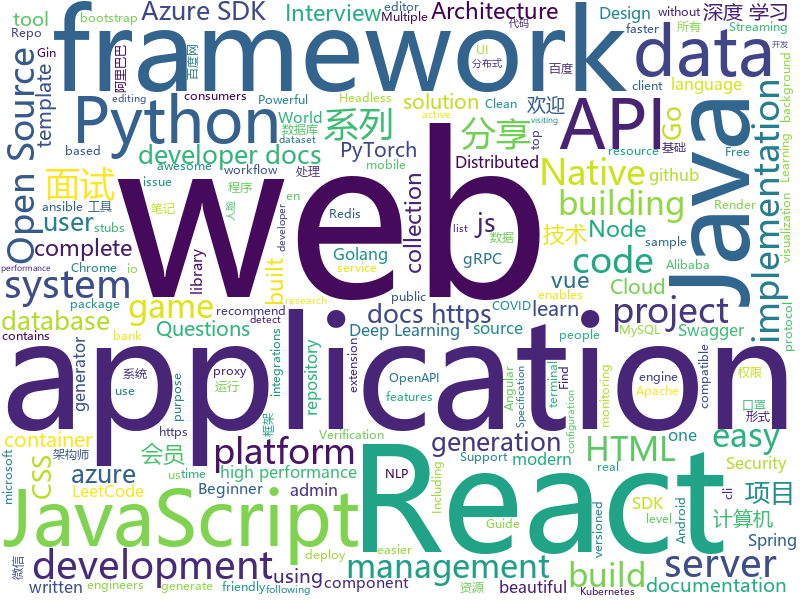

# 2020-04-23
See what the GitHub community is most excited about.

## python
+ [PyBoy](https://github.com/Baekalfen/PyBoy)(**279 stars today**): Game Boy emulator written in Python
+ [MONAI](https://github.com/Project-MONAI/MONAI)(**176 stars today**): AI Toolkit for Healthcare Imaging
+ [Background-Matting](https://github.com/senguptaumd/Background-Matting)(**159 stars today**): Background Matting: The World is Your Green Screen
+ [c9-python-getting-started](https://github.com/microsoft/c9-python-getting-started)(**24 stars today**): Sample code for Channel 9 Python for Beginners course
+ [ansible](https://github.com/ansible/ansible)(**29 stars today**): Ansible is a radically simple IT automation platform that makes your applications and systems easier to deploy. Avoid writing scripts or custom code to deploy and update your applications — automate in a language that approaches plain English, using SSH, with no agents to install on remote systems. https://docs.ansible.com/ansible/
+ [keras](https://github.com/keras-team/keras)(**26 stars today**): Deep Learning for humans
+ [terminator](https://github.com/gnome-terminator/terminator)(**10 stars today**): multiple GNOME terminals in one window
+ [dbt](https://github.com/fishtown-analytics/dbt)(**15 stars today**): dbt (data build tool) enables data analysts and engineers to transform their data using the same practices that software engineers use to build applications.
+ [compose](https://github.com/docker/compose)(**13 stars today**): Define and run multi-container applications with Docker
+ [fastapi](https://github.com/tiangolo/fastapi)(**50 stars today**): FastAPI framework, high performance, easy to learn, fast to code, ready for production
+ [azure-sdk-for-python](https://github.com/Azure/azure-sdk-for-python)(**1 stars today**): This repository is for active development of the Azure SDK for Python. For consumers of the SDK we recommend visiting our public developer docs at https://docs.microsoft.com/en-us/python/azure/ or our versioned developer docs at https://azure.github.io/azure-sdk-for-python.
+ [python-cheatsheet](https://github.com/gto76/python-cheatsheet)(**24 stars today**): Comprehensive Python Cheatsheet
+ [CrackMapExec](https://github.com/byt3bl33d3r/CrackMapExec)(**60 stars today**): A swiss army knife for pentesting networks
+ [awesome-decision-tree-papers](https://github.com/benedekrozemberczki/awesome-decision-tree-papers)(**12 stars today**): A collection of research papers on decision, classification and regression trees with implementations.
+ [Cura](https://github.com/Ultimaker/Cura)(**9 stars today**): 3D printer / slicing GUI built on top of the Uranium framework
+ [FaceMaskDetection](https://github.com/AIZOOTech/FaceMaskDetection)(**8 stars today**): 开源人脸口罩检测模型和数据 Detect faces and determine whether people are wearing mask.
+ [DeepLearningExamples](https://github.com/NVIDIA/DeepLearningExamples)(**12 stars today**): Deep Learning Examples
+ [Real-World-Masked-Face-Dataset](https://github.com/X-zhangyang/Real-World-Masked-Face-Dataset)(**8 stars today**): Real-World Masked Face Dataset，口罩人脸数据集
+ [sigma](https://github.com/Neo23x0/sigma)(**7 stars today**): Generic Signature Format for SIEM Systems
+ [nlp-beginner-finish](https://github.com/Alic-yuan/nlp-beginner-finish)(**6 stars today**): 此项目完成了关于 NLP-Beginner：自然语言处理入门练习 的所有任务，所有代码都经过测试,可以正常运行。
+ [django-rest-framework](https://github.com/encode/django-rest-framework)(**20 stars today**): Web APIs for Django.🎸
+ [pytorch-cnn-visualizations](https://github.com/utkuozbulak/pytorch-cnn-visualizations)(**18 stars today**): Pytorch implementation of convolutional neural network visualization techniques
+ [allennlp](https://github.com/allenai/allennlp)(**8 stars today**): An open-source NLP research library, built on PyTorch.
+ [Impulse](https://github.com/LimerBoy/Impulse)(**10 stars today**): 💣Impulse Denial-of-service ToolKit

## java
+ [serve](https://github.com/pytorch/serve)(**183 stars today**): Model Serving on PyTorch
+ [canal](https://github.com/alibaba/canal)(**17 stars today**): 阿里巴巴 MySQL binlog 增量订阅&消费组件
+ [shardingsphere](https://github.com/apache/shardingsphere)(**132 stars today**): Distributed database middleware
+ [react-native-navigation](https://github.com/wix/react-native-navigation)(**6 stars today**): A complete native navigation solution for React Native
+ [easyexcel](https://github.com/alibaba/easyexcel)(**36 stars today**): 快速、简单避免OOM的java处理Excel工具
+ [LeetCodeAnimation](https://github.com/MisterBooo/LeetCodeAnimation)(**79 stars today**): Demonstrate all the questions on LeetCode in the form of animation.（用动画的形式呈现解LeetCode题目的思路）
+ [dp3t-sdk-backend](https://github.com/DP-3T/dp3t-sdk-backend)(**9 stars today**): The backend implementation for DP3T
+ [bigbluebutton](https://github.com/bigbluebutton/bigbluebutton)(**26 stars today**): Complete open source web conferencing system.
+ [WebGoat](https://github.com/WebGoat/WebGoat)(**3 stars today**): WebGoat 8.0
+ [kafka-rest](https://github.com/confluentinc/kafka-rest)(**0 stars today**): Confluent REST Proxy for Kafka
+ [azure-sdk-for-java](https://github.com/Azure/azure-sdk-for-java)(**2 stars today**): This repository is for active development of the Azure SDK for Java. For consumers of the SDK we recommend visiting our public developer docs at https://docs.microsoft.com/en-us/java/azure/ or our versioned developer docs at https://azure.github.io/azure-sdk-for-java.
+ [AndroidUtilCode](https://github.com/Blankj/AndroidUtilCode)(**14 stars today**): 🔥Android developers should collect the following utils(updating).
+ [tutorials](https://github.com/eugenp/tutorials)(**23 stars today**): Just Announced - "Learn Spring Security OAuth":
+ [camel](https://github.com/apache/camel)(**3 stars today**): Apache Camel
+ [swagger-core](https://github.com/swagger-api/swagger-core)(**4 stars today**): Examples and server integrations for generating the Swagger API Specification, which enables easy access to your REST API
+ [avro](https://github.com/apache/avro)(**5 stars today**): Apache Avro
+ [ksql](https://github.com/confluentinc/ksql)(**4 stars today**): The event streaming database purpose-built for stream processing applications
+ [initializr](https://github.com/spring-io/initializr)(**8 stars today**): A quickstart generator for Spring projects
+ [dubbo-admin](https://github.com/apache/dubbo-admin)(**7 stars today**): The ops and reference implementation for Apache Dubbo
+ [grpc-java](https://github.com/grpc/grpc-java)(**7 stars today**): The Java gRPC implementation. HTTP/2 based RPC
+ [spring-cloud-alibaba](https://github.com/alibaba/spring-cloud-alibaba)(**31 stars today**): Spring Cloud Alibaba provides a one-stop solution for application development for the distributed solutions of Alibaba middleware.
+ [otter](https://github.com/alibaba/otter)(**8 stars today**): 阿里巴巴分布式数据库同步系统(解决中美异地机房)
+ [react-native-video](https://github.com/react-native-community/react-native-video)(**2 stars today**): A <Video /> component for react-native
+ [kafka-connect-jdbc](https://github.com/confluentinc/kafka-connect-jdbc)(**0 stars today**): Kafka Connect connector for JDBC-compatible databases
+ [openapi-generator](https://github.com/OpenAPITools/openapi-generator)(**13 stars today**): OpenAPI Generator allows generation of API client libraries (SDK generation), server stubs, documentation and configuration automatically given an OpenAPI Spec (v2, v3)

## unknown
+ [Baidu-XunleiVIP](https://github.com/VIP-Share/Baidu-XunleiVIP)(**229 stars today**): 百度网盘超级会员，迅雷会员、爱奇艺会员账号每日分享，还有优酷，腾讯，芒果等VIP。AND。百度网盘(百度云)不限速工具分享。
+ [awesome-architecture](https://github.com/toutiaoio/awesome-architecture)(**43 stars today**): 架构师技术图谱，助你早日成为架构师
+ [Python-Core-50-Courses](https://github.com/jackfrued/Python-Core-50-Courses)(**18 stars today**): Python语言基础50课
+ [JavaInterview](https://github.com/OUYANGSIHAI/JavaInterview)(**38 stars today**): 【Java 面试+Java 后端技术学习指南】：一份通向理想互联网公司的面试指南，包括 Java，技术面试必备基础知识、Leetcode、计算机操作系统、计算机网络、系统设计、分布式、数据库（MySQL、Redis）、Java 项目实战等
+ [android_guides](https://github.com/codepath/android_guides)(**17 stars today**): Extensive Open-Source Guides for Android Developers
+ [AI_Curriculum](https://github.com/Machine-Learning-Tokyo/AI_Curriculum)(**34 stars today**): Open Deep Learning and Reinforcement Learning lectures from top Universities like Stanford, MIT, UC Berkeley.
+ [You-Dont-Know-JS](https://github.com/getify/You-Dont-Know-JS)(**86 stars today**): A book series on JavaScript. @YDKJS on twitter.
+ [GitHubDaily](https://github.com/GitHubDaily/GitHubDaily)(**35 stars today**): GitHubDaily 分享内容定期整理与分类。欢迎推荐、自荐项目，让更多人知道你的项目。
+ [angular-interview-questions](https://github.com/sudheerj/angular-interview-questions)(**6 stars today**): List of 300 Angular Interview Questions and answers[WIP]
+ [awesome-datascience](https://github.com/academic/awesome-datascience)(**107 stars today**): 📝An awesome Data Science repository to learn and apply for real world problems.
+ [vue3-News](https://github.com/vue3/vue3-News)(**10 stars today**): 🎯Find the latest breaking √vue3 & vue-cli 3+ News.
+ [breadbee](https://github.com/breadbee/breadbee)(**22 stars today**): Breadboard-able Cortex A7 dev board
+ [kkndme_tianya](https://github.com/shenzhengfang/kkndme_tianya)(**38 stars today**): 天涯 kkndme 神贴聊房价
+ [website](https://github.com/noiapp/website)(**7 stars today**): 
+ [curriculum](https://github.com/TheOdinProject/curriculum)(**7 stars today**): The open curriculum for learning web development
+ [bank_interview](https://github.com/sty945/bank_interview)(**20 stars today**): 🏦银行笔试面试经验分享及资料分享（help you pass the bank interview, and get a amazing bank offer!）
+ [Frontend-01-Template](https://github.com/GeekUniversity/Frontend-01-Template)(**4 stars today**): 
+ [Front-End-Interview-Notebook](https://github.com/CavsZhouyou/Front-End-Interview-Notebook)(**36 stars today**): 🐜前端面试复习笔记
+ [DeepLearning-500-questions](https://github.com/scutan90/DeepLearning-500-questions)(**19 stars today**): 深度学习500问，以问答形式对常用的概率知识、线性代数、机器学习、深度学习、计算机视觉等热点问题进行阐述，以帮助自己及有需要的读者。 全书分为18个章节，50余万字。由于水平有限，书中不妥之处恳请广大读者批评指正。 未完待续............ 如有意合作，联系scutjy2015@163.com 版权所有，违权必究 Tan 2018.06
+ [documents](https://github.com/ROBERT-proximity-tracing/documents)(**13 stars today**): Protocol specification, white paper, high level documents, etc.
+ [Awesome-Hacking](https://github.com/Hack-with-Github/Awesome-Hacking)(**31 stars today**): A collection of various awesome lists for hackers, pentesters and security researchers
+ [Specs](https://github.com/CocoaPods/Specs)(**1 stars today**): The CocoaPods Master Repo
+ [Blog](https://github.com/mqyqingfeng/Blog)(**28 stars today**): 冴羽写博客的地方，预计写四个系列：JavaScript深入系列、JavaScript专题系列、ES6系列、React系列。
+ [free-programming-books-zh_CN](https://github.com/justjavac/free-programming-books-zh_CN)(**56 stars today**): 📚免费的计算机编程类中文书籍，欢迎投稿
+ [covid-policy-tracker](https://github.com/OxCGRT/covid-policy-tracker)(**3 stars today**): Systematic dataset of Covid-19 policy, from Oxford University

## javascript
+ [learnGitBranching](https://github.com/pcottle/learnGitBranching)(**107 stars today**): An interactive git visualization to challenge and educate!
+ [material-ui](https://github.com/mui-org/material-ui)(**46 stars today**): React components for faster and easier web development. Build your own design system, or start with Material Design.
+ [next.js](https://github.com/zeit/next.js)(**64 stars today**): The React Framework
+ [markdown-here](https://github.com/adam-p/markdown-here)(**41 stars today**): Google Chrome, Firefox, and Thunderbird extension that lets you write email in Markdown and render it before sending.
+ [puppeteer](https://github.com/puppeteer/puppeteer)(**55 stars today**): Headless Chrome Node.js API
+ [medis](https://github.com/luin/medis)(**76 stars today**): 💻Medis is a beautiful, easy-to-use Mac database management application for Redis.
+ [Real-Time-Person-Removal](https://github.com/jasonmayes/Real-Time-Person-Removal)(**39 stars today**): Removing people from complex backgrounds in real time using TensorFlow.js in the web browser
+ [vue](https://github.com/vuejs/vue)(**123 stars today**): 🖖Vue.js is a progressive, incrementally-adoptable JavaScript framework for building UI on the web.
+ [engine](https://github.com/cocos-creator/engine)(**4 stars today**): Cocos Creator is a complete package of game development tools and workflow, including a game engine, resource management, scene editing, game preview, debug and publish one project to multiple platforms.
+ [kbone](https://github.com/Tencent/kbone)(**20 stars today**): 一个致力于微信小程序和 Web 端同构的解决方案
+ [strapi](https://github.com/strapi/strapi)(**33 stars today**): 🚀Open source Node.js Headless CMS to easily build customisable APIs
+ [studio](https://github.com/marian-m12l/studio)(**7 stars today**): STUdio - Story Teller Unleashed
+ [umi](https://github.com/umijs/umi)(**19 stars today**): 🌋Pluggable enterprise-level react application framework.
+ [slick](https://github.com/kenwheeler/slick)(**11 stars today**): the last carousel you'll ever need
+ [aws-serverless-workshops](https://github.com/aws-samples/aws-serverless-workshops)(**6 stars today**): Code and walkthrough labs to set up serverless applications for Wild Rydes workshops
+ [swagger-ui](https://github.com/swagger-api/swagger-ui)(**10 stars today**): Swagger UI is a collection of HTML, Javascript, and CSS assets that dynamically generate beautiful documentation from a Swagger-compliant API.
+ [react](https://github.com/facebook/react)(**89 stars today**): A declarative, efficient, and flexible JavaScript library for building user interfaces.
+ [taro](https://github.com/NervJS/taro)(**18 stars today**): 多端统一开发框架，支持用 React 的开发方式编写一次代码，生成能运行在微信/京东/百度/支付宝/字节跳动/ QQ 小程序/快应用/H5/React Native 等的应用。 https://taro.jd.com/
+ [javascript](https://github.com/airbnb/javascript)(**35 stars today**): JavaScript Style Guide
+ [react-native](https://github.com/facebook/react-native)(**44 stars today**): A framework for building native apps with React.
+ [d3](https://github.com/d3/d3)(**42 stars today**): Bring data to life with SVG, Canvas and HTML.📊📈🎉
+ [cloud-cap-samples](https://github.com/SAP-samples/cloud-cap-samples)(**3 stars today**): This project contains sample applications for SAP Cloud Application Programming Model.
+ [covid19-forecast-hub](https://github.com/reichlab/covid19-forecast-hub)(**8 stars today**): Projections of COVID-19, in standardized format
+ [generator-jhipster](https://github.com/jhipster/generator-jhipster)(**5 stars today**): Open Source application platform for creating Spring Boot + Angular/React projects in seconds!
+ [lazysizes](https://github.com/aFarkas/lazysizes)(**36 stars today**): High performance and SEO friendly lazy loader for images (responsive and normal), iframes and more, that detects any visibility changes triggered through user interaction, CSS or JavaScript without configuration.

## html
+ [pattern.css](https://github.com/bansal-io/pattern.css)(**378 stars today**): CSS only library to fill empty background with beautiful patterns.
+ [wysiwyg-editor](https://github.com/froala/wysiwyg-editor)(**3 stars today**): The next generation Javascript WYSIWYG HTML Editor.
+ [deeplearning_ai_books](https://github.com/fengdu78/deeplearning_ai_books)(**17 stars today**): deeplearning.ai（吴恩达老师的深度学习课程笔记及资源）
+ [webdevbootcamp](https://github.com/nax3t/webdevbootcamp)(**12 stars today**): All source code for back-end projects from the Web Developer Bootcamp
+ [speedtest](https://github.com/librespeed/speedtest)(**20 stars today**): Self-hosted Speedtest for HTML5 and more. Easy setup, examples, configurable, mobile friendly. Supports PHP, Node, Multiple servers, and more
+ [coronadatascraper](https://github.com/covidatlas/coronadatascraper)(**4 stars today**): COVID-19 Coronavirus data scraped from government and curated data sources.
+ [stisla](https://github.com/stisla/stisla)(**7 stars today**): Free Bootstrap Admin Template
+ [coreui-free-bootstrap-admin-template](https://github.com/coreui/coreui-free-bootstrap-admin-template)(**6 stars today**): CoreUI is free bootstrap admin template
+ [va.gov-team](https://github.com/department-of-veterans-affairs/va.gov-team)(**0 stars today**): 
+ [home-assistant.io](https://github.com/home-assistant/home-assistant.io)(**9 stars today**): 📘Home Assistant User documentation
+ [ASVS](https://github.com/OWASP/ASVS)(**5 stars today**): Application Security Verification Standard
+ [javascript](https://github.com/gustavoguanabara/javascript)(**5 stars today**): Curso de JavaScript
+ [tidytuesday](https://github.com/rfordatascience/tidytuesday)(**6 stars today**): Official repo for the #tidytuesday project
+ [swagger-codegen](https://github.com/swagger-api/swagger-codegen)(**9 stars today**): swagger-codegen contains a template-driven engine to generate documentation, API clients and server stubs in different languages by parsing your OpenAPI / Swagger definition.
+ [modern-resume-theme](https://github.com/sproogen/modern-resume-theme)(**3 stars today**): A modern static resume template and theme. Powered by Jekyll and GitHub pages.
+ [community](https://github.com/sveltejs/community)(**5 stars today**): Svelte community meetups, packages, resources, recipes, showcase websites, and more
+ [keycloak-documentation](https://github.com/keycloak/keycloak-documentation)(**1 stars today**): 
+ [material-design-lite](https://github.com/google/material-design-lite)(**4 stars today**): Material Design Components in HTML/CSS/JS
+ [gkc_explorer](https://github.com/gkcproject/gkc_explorer)(**2 stars today**): 
+ [beginners-guide-to-react](https://github.com/kentcdodds/beginners-guide-to-react)(**3 stars today**): The Beginner's Guide To ReactJS
+ [samples](https://github.com/azure-ad-b2c/samples)(**2 stars today**): Azure AD B2C Identity Experience Framework sample User Journeys.
+ [ckeditor5](https://github.com/ckeditor/ckeditor5)(**4 stars today**): Powerful rich text editor framework with a modular architecture, modern integrations and features like collaborative editing.
+ [Graphics](https://github.com/Unity-Technologies/Graphics)(**3 stars today**): Unity Graphics - Including Scriptable Render Pipeline
+ [COVID-19_US_County-level_Summaries](https://github.com/JieYingWu/COVID-19_US_County-level_Summaries)(**1 stars today**): Attempt to find correlation between a region's demographic/economic factors with its ability to manage disease spread
+ [fluxion](https://github.com/FluxionNetwork/fluxion)(**4 stars today**): Fluxion is a remake of linset by vk496 with less bugs and enhanced functionality.

## go
+ [qrcp](https://github.com/claudiodangelis/qrcp)(**758 stars today**): ⚡Transfer files over wifi from your computer to your mobile device by scanning a QR code without leaving the terminal.
+ [monitoror](https://github.com/monitoror/monitoror)(**23 stars today**): Unified monitoring wallboard — Light, ergonomic and reliable monitoring for anything.
+ [crawlab](https://github.com/crawlab-team/crawlab)(**18 stars today**): Distributed web crawler admin platform for spiders management regardless of languages and frameworks.
+ [loki](https://github.com/grafana/loki)(**22 stars today**): Like Prometheus, but for logs.
+ [kubernetes](https://github.com/kubernetes/kubernetes)(**54 stars today**): Production-Grade Container Scheduling and Management
+ [go-clean-arch](https://github.com/bxcodec/go-clean-arch)(**10 stars today**): Go (Golang) Clean Architecture based on Reading Uncle Bob's Clean Architecture
+ [gin-vue-admin](https://github.com/flipped-aurora/gin-vue-admin)(**51 stars today**): 基于gin+vue搭建的后台管理系统框架，集成jwt鉴权，权限管理，动态路由，分页封装，多点登录拦截，资源权限，上传下载，代码生成器，表单生成器等基础功能，更多功能正在开发中，欢迎issue和pr~
+ [golangci-lint](https://github.com/golangci/golangci-lint)(**11 stars today**): Linters Runner for Go. Nice colored output. Can report only new issues. Fewer false-positives. Yaml/toml config.
+ [cloud-on-k8s](https://github.com/elastic/cloud-on-k8s)(**5 stars today**): Elastic Cloud on Kubernetes
+ [argo](https://github.com/argoproj/argo)(**29 stars today**): Argo Workflows: Get stuff done with Kubernetes.
+ [grpc-gateway](https://github.com/grpc-ecosystem/grpc-gateway)(**43 stars today**): gRPC to JSON proxy generator following the gRPC HTTP spec
+ [istio](https://github.com/istio/istio)(**28 stars today**): Connect, secure, control, and observe services.
+ [sqlx](https://github.com/jmoiron/sqlx)(**11 stars today**): general purpose extensions to golang's database/sql
+ [gin](https://github.com/gin-gonic/gin)(**53 stars today**): Gin is a HTTP web framework written in Go (Golang). It features a Martini-like API with much better performance -- up to 40 times faster. If you need smashing performance, get yourself some Gin.
+ [f-license](https://github.com/furkansenharputlu/f-license)(**13 stars today**): Open Source License Key Generation and Verification Tool written in Go
+ [Yearning](https://github.com/cookieY/Yearning)(**25 stars today**): A most popular sql audit platform for mysql
+ [nats-streaming-server](https://github.com/nats-io/nats-streaming-server)(**4 stars today**): NATS Streaming System Server
+ [go-interview](https://github.com/shomali11/go-interview)(**55 stars today**): Collection of Technical Interview Questions solved with Go
+ [helmfile](https://github.com/roboll/helmfile)(**4 stars today**): Deploy Kubernetes Helm Charts
+ [cobra](https://github.com/spf13/cobra)(**14 stars today**): A Commander for modern Go CLI interactions
+ [protobuf](https://github.com/golang/protobuf)(**12 stars today**): Go support for Google's protocol buffers
+ [mux](https://github.com/gorilla/mux)(**18 stars today**): A powerful HTTP router and URL matcher for building Go web servers with🦍
+ [rancher](https://github.com/rancher/rancher)(**15 stars today**): Complete container management platform
+ [minio](https://github.com/minio/minio)(**16 stars today**): MinIO is a high performance object storage server compatible with Amazon S3 APIs
+ [kubeedge](https://github.com/kubeedge/kubeedge)(**7 stars today**): Kubernetes Native Edge Computing Framework (project under CNCF)

## WordCloud

