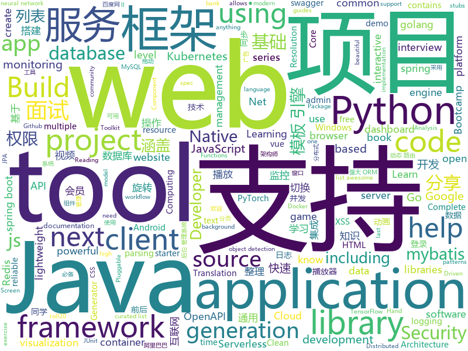

# 2020-04-24
See what the GitHub community is most excited about.

## python
+ [MONAI](https://github.com/Project-MONAI/MONAI)(**229 stars today**): AI Toolkit for Healthcare Imaging
+ [ALAE](https://github.com/podgorskiy/ALAE)(**119 stars today**): [CVPR2020] Adversarial Latent Autoencoders
+ [Background-Matting](https://github.com/senguptaumd/Background-Matting)(**230 stars today**): Background Matting: The World is Your Green Screen
+ [zhao](https://github.com/programthink/zhao)(**13 stars today**): 【编程随想】整理的《太子党关系网络》，专门揭露赵国的权贵
+ [covid19_dashboard](https://github.com/Unicorndy/covid19_dashboard)(**49 stars today**): Create your own dashboard web app with free resources
+ [PySyft](https://github.com/OpenMined/PySyft)(**14 stars today**): A library for encrypted, privacy preserving machine learning
+ [models](https://github.com/tensorflow/models)(**59 stars today**): Models and examples built with TensorFlow
+ [pytorch-lightning](https://github.com/PyTorchLightning/pytorch-lightning)(**51 stars today**): The lightweight PyTorch wrapper for ML researchers. Scale your models. Write less boilerplate
+ [TongDaOA-Fake-User](https://github.com/NS-Sp4ce/TongDaOA-Fake-User)(**56 stars today**): 通达OA 任意用户登录漏洞
+ [httpx](https://github.com/encode/httpx)(**16 stars today**): A next generation HTTP client for Python.🦋
+ [TensorFlow-Object-Detection-API-Tutorial-Train-Multiple-Objects-Windows-10](https://github.com/EdjeElectronics/TensorFlow-Object-Detection-API-Tutorial-Train-Multiple-Objects-Windows-10)(**7 stars today**): How to train a TensorFlow Object Detection Classifier for multiple object detection on Windows
+ [jax](https://github.com/google/jax)(**17 stars today**): Composable transformations of Python+NumPy programs: differentiate, vectorize, JIT to GPU/TPU, and more
+ [ignite](https://github.com/pytorch/ignite)(**5 stars today**): High-level library to help with training neural networks in PyTorch
+ [ObstructionRemoval](https://github.com/alex04072000/ObstructionRemoval)(**46 stars today**): [CVPR 2020] Learning to See Through Obstructions
+ [cp-ansible](https://github.com/confluentinc/cp-ansible)(**1 stars today**): Ansible playbooks for the Confluent Platform
+ [pydantic](https://github.com/samuelcolvin/pydantic)(**23 stars today**): Data parsing and validation using Python type hints
+ [c9-python-getting-started](https://github.com/microsoft/c9-python-getting-started)(**26 stars today**): Sample code for Channel 9 Python for Beginners course
+ [HRNet-Semantic-Segmentation](https://github.com/HRNet/HRNet-Semantic-Segmentation)(**12 stars today**): High-resolution representation learning (HRNets) for Semantic Segmentation
+ [awesome-python](https://github.com/vinta/awesome-python)(**80 stars today**): A curated list of awesome Python frameworks, libraries, software and resources
+ [PyBoy](https://github.com/Baekalfen/PyBoy)(**197 stars today**): Game Boy emulator written in Python
+ [pytorch-cnn-visualizations](https://github.com/utkuozbulak/pytorch-cnn-visualizations)(**23 stars today**): Pytorch implementation of convolutional neural network visualization techniques
+ [django](https://github.com/django/django)(**52 stars today**): The Web framework for perfectionists with deadlines.
+ [uvicorn](https://github.com/encode/uvicorn)(**9 stars today**): The lightning-fast ASGI server.🦄
+ [nltk](https://github.com/nltk/nltk)(**10 stars today**): NLTK Source
+ [airflow](https://github.com/apache/airflow)(**19 stars today**): Apache Airflow - A platform to programmatically author, schedule, and monitor workflows

## java
+ [CS-Notes](https://github.com/CyC2018/CS-Notes)(**274 stars today**): 📚技术面试必备基础知识、Leetcode、计算机操作系统、计算机网络、系统设计、Java、Python、C++
+ [advanced-java](https://github.com/doocs/advanced-java)(**124 stars today**): 😮互联网 Java 工程师进阶知识完全扫盲：涵盖高并发、分布式、高可用、微服务、海量数据处理等领域知识，后端同学必看，前端同学也可学习
+ [JavaGuide](https://github.com/Snailclimb/JavaGuide)(**313 stars today**): 【Java学习+面试指南】 一份涵盖大部分Java程序员所需要掌握的核心知识。
+ [Sentinel](https://github.com/alibaba/Sentinel)(**35 stars today**): A powerful flow control component enabling reliability, resilience and monitoring for microservices. (面向云原生微服务的高可用流控防护组件)
+ [serve](https://github.com/pytorch/serve)(**192 stars today**): Model Serving on PyTorch
+ [java-design-patterns](https://github.com/iluwatar/java-design-patterns)(**109 stars today**): Design patterns implemented in Java
+ [elasticsearch](https://github.com/elastic/elasticsearch)(**92 stars today**): Open Source, Distributed, RESTful Search Engine
+ [canal](https://github.com/alibaba/canal)(**36 stars today**): 阿里巴巴 MySQL binlog 增量订阅&消费组件
+ [interviews](https://github.com/kdn251/interviews)(**116 stars today**): Everything you need to know to get the job.
+ [eladmin](https://github.com/elunez/eladmin)(**42 stars today**): 项目基于 Spring Boot 2.1.0 、 Jpa、 Spring Security、redis、Vue的前后端分离的后台管理系统，项目采用分模块开发方式， 权限控制采用 RBAC，支持数据字典与数据权限管理，支持一键生成前后端代码，支持动态路由
+ [WebGoat](https://github.com/WebGoat/WebGoat)(**5 stars today**): WebGoat 8.0
+ [openapi-generator](https://github.com/OpenAPITools/openapi-generator)(**16 stars today**): OpenAPI Generator allows generation of API client libraries (SDK generation), server stubs, documentation and configuration automatically given an OpenAPI Spec (v2, v3)
+ [GSYVideoPlayer](https://github.com/CarGuo/GSYVideoPlayer)(**21 stars today**): 视频播放器（IJKplayer、ExoPlayer、MediaPlayer），HTTPS，支持弹幕，外挂字幕，支持滤镜、水印、gif截图，片头广告、中间广告，多个同时播放，支持基本的拖动，声音、亮度调节，支持边播边缓存，支持视频自带rotation的旋转（90,270之类），重力旋转与手动旋转的同步支持，支持列表播放 ，列表全屏动画，视频加载速度，列表小窗口支持拖动，动画效果，调整比例，多分辨率切换，支持切换播放器，进度条小窗口预览，列表切换详情页面无缝播放，rtsp、concat、mpeg。
+ [SpringCloud](https://github.com/zhoutaoo/SpringCloud)(**17 stars today**): 基于SpringCloud2.1的微服务开发脚手架，整合了spring-security-oauth2、nacos、feign、sentinel、springcloud-gateway等。服务治理方面引入elasticsearch、skywalking、springboot-admin、zipkin等，让项目开发快速进入业务开发，而不需过多时间花费在架构搭建上。持续更新中
+ [otter](https://github.com/alibaba/otter)(**8 stars today**): 阿里巴巴分布式数据库同步系统(解决中美异地机房)
+ [junit5](https://github.com/junit-team/junit5)(**6 stars today**): The next generation of JUnit.
+ [shardingsphere](https://github.com/apache/shardingsphere)(**86 stars today**): Distributed database middleware
+ [antlr4](https://github.com/antlr/antlr4)(**12 stars today**): ANTLR (ANother Tool for Language Recognition) is a powerful parser generator for reading, processing, executing, or translating structured text or binary files.
+ [dubbo-admin](https://github.com/apache/dubbo-admin)(**7 stars today**): The ops and reference implementation for Apache Dubbo
+ [neo4j](https://github.com/neo4j/neo4j)(**8 stars today**): Graphs for Everyone
+ [jenkins](https://github.com/jenkinsci/jenkins)(**17 stars today**): Jenkins automation server
+ [okhttp](https://github.com/square/okhttp)(**44 stars today**): Square’s meticulous HTTP client for Java and Kotlin.
+ [spring-boot-demo](https://github.com/xkcoding/spring-boot-demo)(**67 stars today**): spring boot demo 是一个用来深度学习并实战 spring boot 的项目，目前总共包含 65 个集成demo，已经完成 53 个。 该项目已成功集成 actuator(监控)、admin(可视化监控)、logback(日志)、aopLog(通过AOP记录web请求日志)、统一异常处理(json级别和页面级别)、freemarker(模板引擎)、thymeleaf(模板引擎)、Beetl(模板引擎)、Enjoy(模板引擎)、JdbcTemplate(通用JDBC操作数据库)、JPA(强大的ORM框架)、mybatis(强大的ORM框架)、通用Mapper(快速操作Mybatis)、PageHelper(通用的Mybatis分页插件)、mybatis-plus(快速操作M…
+ [tutorials](https://github.com/eugenp/tutorials)(**24 stars today**): Just Announced - "Learn Spring Security OAuth":
+ [testcontainers-java](https://github.com/testcontainers/testcontainers-java)(**8 stars today**): Testcontainers is a Java library that supports JUnit tests, providing lightweight, throwaway instances of common databases, Selenium web browsers, or anything else that can run in a Docker container.

## unknown
+ [awesome-architecture](https://github.com/toutiaoio/awesome-architecture)(**91 stars today**): 架构师技术图谱，助你早日成为架构师
+ [Baidu-XunleiVIP](https://github.com/VIP-Share/Baidu-XunleiVIP)(**260 stars today**): 百度网盘超级会员，迅雷会员、爱奇艺会员账号每日分享，还有优酷，腾讯，芒果等VIP。AND。百度网盘(百度云)不限速工具分享。
+ [GitHubDaily](https://github.com/GitHubDaily/GitHubDaily)(**49 stars today**): GitHubDaily 分享内容定期整理与分类。欢迎推荐、自荐项目，让更多人知道你的项目。
+ [Python-Core-50-Courses](https://github.com/jackfrued/Python-Core-50-Courses)(**29 stars today**): Python语言基础50课
+ [Specs](https://github.com/CocoaPods/Specs)(**5 stars today**): The CocoaPods Master Repo
+ [Flutter-Course-Resources](https://github.com/londonappbrewery/Flutter-Course-Resources)(**82 stars today**): Learn to Code While Building Apps - The Complete Flutter Development Bootcamp
+ [free-books](https://github.com/ruanyf/free-books)(**59 stars today**): 互联网上的免费书籍
+ [1](https://github.com/8-jie/1)(**55 stars today**): 这里是直播平台永久回家页，有最新app下载地址。
+ [JavaInterview](https://github.com/gsjqwyl/JavaInterview)(**55 stars today**): Java面试整理，涵盖基础、JVM、线程并发、框架、MySQL、微服务、Redis、中间件、数据结构与算法等。陆续完善中
+ [bank_interview](https://github.com/sty945/bank_interview)(**33 stars today**): 🏦银行笔试面试经验分享及资料分享（help you pass the bank interview, and get a amazing bank offer!）
+ [HiDT](https://github.com/saic-mdal/HiDT)(**113 stars today**): High-Resolution Daytime Translation Without Domain Labels
+ [google-cloud-4-words](https://github.com/gregsramblings/google-cloud-4-words)(**50 stars today**): The Google Cloud Developer's Cheat Sheet
+ [You-Dont-Know-JS](https://github.com/getify/You-Dont-Know-JS)(**112 stars today**): A book series on JavaScript. @YDKJS on twitter.
+ [bootcamp-gostack-desafios](https://github.com/Rocketseat/bootcamp-gostack-desafios)(**12 stars today**): Repositório contendo todos os desafios dos módulos do Bootcamp Gostack
+ [AZ-300-MicrosoftAzureArchitectTechnologies](https://github.com/MicrosoftLearning/AZ-300-MicrosoftAzureArchitectTechnologies)(**5 stars today**): 
+ [simplyRetro-D8](https://github.com/geaz/simplyRetro-D8)(**17 stars today**): A 3D printed, eight inch retro gaming bartop.
+ [landscape](https://github.com/cncf/landscape)(**11 stars today**): 🌄The Cloud Native Interactive Landscape filters and sorts hundreds of projects and products, and shows details including GitHub stars, funding or market cap, first and last commits, contributor counts, headquarters location, and recent tweets.
+ [you-dont-know-js-ru](https://github.com/azat-io/you-dont-know-js-ru)(**6 stars today**): 📚Russian translation of "You Don't Know JS" book series
+ [3y](https://github.com/ZhongFuCheng3y/3y)(**77 stars today**): 📓从Java基础、JavaWeb基础到常用的框架再到面试题都有完整的教程，几乎涵盖了Java后端必备的知识点
+ [intellij-community](https://github.com/JetBrains/intellij-community)(**17 stars today**): IntelliJ IDEA Community Edition
+ [awesome-readme](https://github.com/matiassingers/awesome-readme)(**64 stars today**): A curated list of awesome READMEs
+ [CKAD-exercises](https://github.com/dgkanatsios/CKAD-exercises)(**11 stars today**): A set of exercises to prepare for Certified Kubernetes Application Developer exam by Cloud Native Computing Foundation
+ [interview](https://github.com/aforarup/interview)(**8 stars today**): Resources to crack the next coding interview
+ [JavaFamily](https://github.com/AobingJava/JavaFamily)(**102 stars today**): 【互联网一线大厂面试+学习指南】
+ [coronavirus-data](https://github.com/nychealth/coronavirus-data)(**8 stars today**): 

## javascript
+ [learnGitBranching](https://github.com/pcottle/learnGitBranching)(**151 stars today**): An interactive git visualization to challenge and educate!
+ [brave-browser](https://github.com/brave/brave-browser)(**32 stars today**): Next generation Brave browser for macOS, Windows, Linux, Android.
+ [serverless](https://github.com/serverless/serverless)(**42 stars today**): Serverless Framework – Build web, mobile and IoT applications with serverless architectures using AWS Lambda, Azure Functions, Google CloudFunctions & more! –
+ [stimulus_reflex](https://github.com/hopsoft/stimulus_reflex)(**54 stars today**): Build reactive applications with the Rails tooling you already know and love.
+ [umi](https://github.com/umijs/umi)(**16 stars today**): 🌋Pluggable enterprise-level react application framework.
+ [Script](https://github.com/NobyDa/Script)(**18 stars today**): This project is based on the scripting capabilities of two excellent iOS proxy tools, Quantumult X or Surge.
+ [underscore](https://github.com/jashkenas/underscore)(**4 stars today**): JavaScript's utility _ belt
+ [Real-Time-Person-Removal](https://github.com/jasonmayes/Real-Time-Person-Removal)(**47 stars today**): Removing people from complex backgrounds in real time using TensorFlow.js in the web browser
+ [lib-jitsi-meet](https://github.com/jitsi/lib-jitsi-meet)(**26 stars today**): A low-level JS video API that allows adding a completely custom video experience to web apps.
+ [jupyterlab](https://github.com/jupyterlab/jupyterlab)(**15 stars today**): JupyterLab computational environment.
+ [engine](https://github.com/cocos-creator/engine)(**7 stars today**): Cocos Creator is a complete package of game development tools and workflow, including a game engine, resource management, scene editing, game preview, debug and publish one project to multiple platforms.
+ [request](https://github.com/request/request)(**11 stars today**): 🏊🏾 Simplified HTTP request client.
+ [redash](https://github.com/getredash/redash)(**27 stars today**): Make Your Company Data Driven. Connect to any data source, easily visualize, dashboard and share your data.
+ [next-learn-starter](https://github.com/zeit/next-learn-starter)(**5 stars today**): Learn Next.js Starter Code
+ [Motrix](https://github.com/agalwood/Motrix)(**107 stars today**): A full-featured download manager.
+ [HttpReports](https://github.com/SpringLeee/HttpReports)(**84 stars today**): 使用HttpReports可以快速搭建.Net Core环境下统计,分析,图表,监控一体化的站点，并且支持多种数据库存储，适应.Net Core WebAPI,MVC，Web项目, 通过引用Nuget构建Dashboard面板，非常适合中小项目使用。
+ [gatsby](https://github.com/gatsbyjs/gatsby)(**42 stars today**): Build blazing fast, modern apps and websites with React
+ [open-wc](https://github.com/open-wc/open-wc)(**16 stars today**): Open Web Components: guides, tools and libraries for modern web development and web components
+ [memory-game](https://github.com/kubowania/memory-game)(**4 stars today**): JavaScript, HTML and CSS grid-based game
+ [slick](https://github.com/kenwheeler/slick)(**13 stars today**): the last carousel you'll ever need
+ [node](https://github.com/nodejs/node)(**82 stars today**): Node.js JavaScript runtime✨🐢🚀✨
+ [cypress-example-recipes](https://github.com/cypress-io/cypress-example-recipes)(**11 stars today**): Various recipes for testing common scenarios with Cypress
+ [esercizi-di-programmazione-javascript](https://github.com/AlbertoOlla/esercizi-di-programmazione-javascript)(**6 stars today**): Esercizi di informatica! Impara a programmare, metti alla prova!
+ [incubator-echarts](https://github.com/apache/incubator-echarts)(**45 stars today**): A powerful, interactive charting and visualization library for browser
+ [medis](https://github.com/luin/medis)(**58 stars today**): 💻Medis is a beautiful, easy-to-use Mac database management application for Redis.

## html
+ [Graphics](https://github.com/Unity-Technologies/Graphics)(**14 stars today**): Unity Graphics - Including Scriptable Render Pipeline
+ [awesome-compose](https://github.com/docker/awesome-compose)(**25 stars today**): Awesome Docker Compose samples
+ [shasnap](https://github.com/SharqanAhamed/shasnap)(**15 stars today**): Webcam Hacking for any devices in one link
+ [webdevbootcamp](https://github.com/nax3t/webdevbootcamp)(**11 stars today**): All source code for back-end projects from the Web Developer Bootcamp
+ [REKCARC-TSC-UHT](https://github.com/PKUanonym/REKCARC-TSC-UHT)(**51 stars today**): 清华大学计算机系课程攻略 Guidance for courses in Department of Computer Science and Technology, Tsinghua University
+ [MyHandWriting](https://github.com/bannyvishwas2020/MyHandWriting)(**14 stars today**): Convert text to your own hand writing
+ [phpstan](https://github.com/phpstan/phpstan)(**11 stars today**): PHP Static Analysis Tool - discover bugs in your code without running it!
+ [wpt](https://github.com/web-platform-tests/wpt)(**8 stars today**): Test suites for Web platform specs — including WHATWG, W3C, and others
+ [tech-talks](https://github.com/databricks/tech-talks)(**5 stars today**): This repository contains the notebooks and presentations we use for our Databricks Tech Talks
+ [keep-a-changelog](https://github.com/olivierlacan/keep-a-changelog)(**11 stars today**): If you build software, keep a changelog.
+ [learning-area](https://github.com/mdn/learning-area)(**10 stars today**): Github repo for the MDN Learning Area.
+ [personal-website](https://github.com/github/personal-website)(**10 stars today**): Code that'll help you kickstart a personal website that showcases your work as a software developer.
+ [django-DefectDojo](https://github.com/DefectDojo/django-DefectDojo)(**1 stars today**): DefectDojo is an open-source application vulnerability correlation and security orchestration tool.
+ [mxgraph](https://github.com/jgraph/mxgraph)(**14 stars today**): mxGraph is a fully client side JavaScript diagramming library
+ [dragon-book-exercise-answers](https://github.com/fool2fish/dragon-book-exercise-answers)(**8 stars today**): Compilers Principles, Techniques, & Tools (purple dragon book) second edition exercise answers. 编译原理（紫龙书）第2版习题答案。
+ [pattern.css](https://github.com/bansal-io/pattern.css)(**544 stars today**): CSS only library to fill empty background with beautiful patterns.
+ [lockphish](https://github.com/thelinuxchoice/lockphish)(**5 stars today**): Lockphish is a tool for phishing attacks on the lock screen, designed to grab Windows credentials, Android PIN and iPhone Passcode
+ [hylia](https://github.com/hankchizljaw/hylia)(**6 stars today**): Hylia is a lightweight Eleventy starter kit to help you to create your own blog or personal website.
+ [covid19br.github.io](https://github.com/covid19br/covid19br.github.io)(**7 stars today**): 
+ [aws-well-architected-labs](https://github.com/awslabs/aws-well-architected-labs)(**12 stars today**): Hands on labs and code to help you learn, measure, and build using architectural best practices.
+ [roll20-character-sheets](https://github.com/Roll20/roll20-character-sheets)(**6 stars today**): Character sheet templates created by the community for use in Roll20 VTT. Contact team@roll20.net if critical hotfixes need to be requested.
+ [swagger-codegen](https://github.com/swagger-api/swagger-codegen)(**10 stars today**): swagger-codegen contains a template-driven engine to generate documentation, API clients and server stubs in different languages by parsing your OpenAPI / Swagger definition.
+ [styleguide](https://github.com/google/styleguide)(**28 stars today**): Style guides for Google-originated open-source projects
+ [Markdown-Resume](https://github.com/CyC2018/Markdown-Resume)(**3 stars today**): ⭐️Markdown 简历模版
+ [responsive-html-email-template](https://github.com/leemunroe/responsive-html-email-template)(**6 stars today**): A free simple responsive HTML email template

## go
+ [go-interview](https://github.com/shomali11/go-interview)(**60 stars today**): Collection of Technical Interview Questions solved with Go
+ [cli](https://github.com/cli/cli)(**75 stars today**): GitHub’s official command line tool
+ [cilium](https://github.com/cilium/cilium)(**29 stars today**): API-aware Networking and Security using eBPF and XDP
+ [client_golang](https://github.com/prometheus/client_golang)(**6 stars today**): Prometheus instrumentation library for Go applications
+ [logrus](https://github.com/sirupsen/logrus)(**23 stars today**): Structured, pluggable logging for Go.
+ [protobuf](https://github.com/golang/protobuf)(**13 stars today**): Go support for Google's protocol buffers
+ [argo-cd](https://github.com/argoproj/argo-cd)(**13 stars today**): Declarative continuous deployment for Kubernetes.
+ [kratos](https://github.com/go-kratos/kratos)(**24 stars today**): Kratos是bilibili开源的一套Go微服务框架，包含大量微服务相关框架及工具。
+ [vault](https://github.com/hashicorp/vault)(**20 stars today**): A tool for secrets management, encryption as a service, and privileged access management
+ [helm](https://github.com/helm/helm)(**21 stars today**): The Kubernetes Package Manager
+ [go-clean-arch](https://github.com/bxcodec/go-clean-arch)(**46 stars today**): Go (Golang) Clean Architecture based on Reading Uncle Bob's Clean Architecture
+ [prometheus](https://github.com/prometheus/prometheus)(**51 stars today**): The Prometheus monitoring system and time series database.
+ [dalfox](https://github.com/hahwul/dalfox)(**28 stars today**): DalFox(Finder Of XSS) / Parameter Analysis and XSS Scanning tool based on golang
+ [gf](https://github.com/gogf/gf)(**14 stars today**): GoFrame is a modular, high-performance and production-ready application development framework of golang.
+ [monitoror](https://github.com/monitoror/monitoror)(**58 stars today**): Unified monitoring wallboard — Light, ergonomic and reliable monitoring for anything.
+ [sqlx](https://github.com/jmoiron/sqlx)(**17 stars today**): general purpose extensions to golang's database/sql
+ [containerd](https://github.com/containerd/containerd)(**6 stars today**): An open and reliable container runtime
+ [testify](https://github.com/stretchr/testify)(**25 stars today**): A toolkit with common assertions and mocks that plays nicely with the standard library
+ [charts](https://github.com/helm/charts)(**24 stars today**): Curated applications for Kubernetes
+ [go-grpc-middleware](https://github.com/grpc-ecosystem/go-grpc-middleware)(**6 stars today**): Golang gRPC Middlewares: interceptor chaining, auth, logging, retries and more.
+ [kubeedge](https://github.com/kubeedge/kubeedge)(**10 stars today**): Kubernetes Native Edge Computing Framework (project under CNCF)
+ [faas](https://github.com/openfaas/faas)(**23 stars today**): OpenFaaS - Serverless Functions Made Simple
+ [pipeline](https://github.com/tektoncd/pipeline)(**13 stars today**): A K8s-native Pipeline resource.
+ [gin-vue-admin](https://github.com/flipped-aurora/gin-vue-admin)(**50 stars today**): 基于gin+vue搭建的后台管理系统框架，集成jwt鉴权，权限管理，动态路由，分页封装，多点登录拦截，资源权限，上传下载，代码生成器，表单生成器等基础功能，更多功能正在开发中，欢迎issue和pr~
+ [libpod](https://github.com/containers/libpod)(**17 stars today**): libpod is a library used to create container pods. Home of Podman.

## WordCloud

