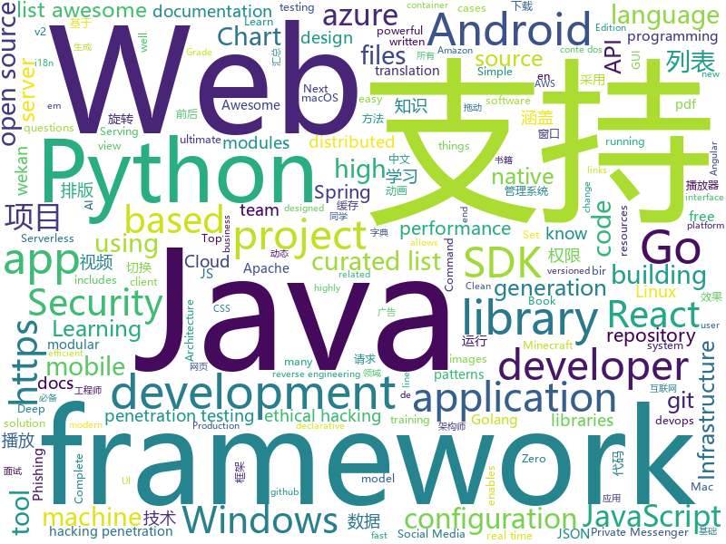

# 2020-04-25
See what the GitHub community is most excited about.

## python
+ [ALAE](https://github.com/podgorskiy/ALAE)(**69 stars today**): [CVPR2020] Adversarial Latent Autoencoders
+ [MONAI](https://github.com/Project-MONAI/MONAI)(**149 stars today**): AI Toolkit for Healthcare Imaging
+ [Background-Matting](https://github.com/senguptaumd/Background-Matting)(**98 stars today**): Background Matting: The World is Your Green Screen
+ [espnet](https://github.com/espnet/espnet)(**15 stars today**): End-to-End Speech Processing Toolkit
+ [kivy](https://github.com/kivy/kivy)(**6 stars today**): Open source UI framework written in Python, running on Windows, Linux, macOS, Android and iOS
+ [jax](https://github.com/google/jax)(**9 stars today**): Composable transformations of Python+NumPy programs: differentiate, vectorize, JIT to GPU/TPU, and more
+ [ObstructionRemoval](https://github.com/alex04072000/ObstructionRemoval)(**30 stars today**): [CVPR 2020] Learning to See Through Obstructions
+ [confluent-kafka-python](https://github.com/confluentinc/confluent-kafka-python)(**2 stars today**): Confluent's Kafka Python Client
+ [simpletransformers](https://github.com/ThilinaRajapakse/simpletransformers)(**8 stars today**): Transformers for Classification, NER, QA, Language Modelling, Language Generation, Multi-Modal, and Conversational AI
+ [comma10k](https://github.com/commaai/comma10k)(**35 stars today**): 10k crowdsourced images for training segnets
+ [nlp-beginner-finish](https://github.com/Alic-yuan/nlp-beginner-finish)(**101 stars today**): 此项目完成了关于 NLP-Beginner：自然语言处理入门练习 的所有任务，所有代码都经过测试,可以正常运行。
+ [ppscore](https://github.com/8080labs/ppscore)(**64 stars today**): Predictive Power Score (PPS) in Python
+ [pydantic](https://github.com/samuelcolvin/pydantic)(**22 stars today**): Data parsing and validation using Python type hints
+ [h4cker](https://github.com/The-Art-of-Hacking/h4cker)(**8 stars today**): This repository is primarily maintained by Omar Santos and includes thousands of resources related to ethical hacking / penetration testing, digital forensics and incident response (DFIR), vulnerability research, exploit development, reverse engineering, and more.
+ [deep-person-reid](https://github.com/KaiyangZhou/deep-person-reid)(**4 stars today**): Torchreid: Deep learning person re-identification in PyTorch.
+ [bbb-v2](https://github.com/diofeher/bbb-v2)(**2 stars today**): Bot pra votar no Big Brother que não precisa de interação com a página
+ [plugin.video.stream-cinema](https://github.com/bbaronSVK/plugin.video.stream-cinema)(**4 stars today**): kodi plugin pre stream-cinema.online
+ [aws-cli](https://github.com/aws/aws-cli)(**6 stars today**): Universal Command Line Interface for Amazon Web Services
+ [hosts](https://github.com/StevenBlack/hosts)(**18 stars today**): Consolidating and Extending hosts files from several well-curated sources. You can optionally pick extensions to block Porn, Social Media, and other categories..
+ [cascadia-code](https://github.com/microsoft/cascadia-code)(**24 stars today**): This is a fun, new monospaced font that includes programming ligatures and is designed to enhance the modern look and feel of the Windows Terminal.
+ [azure-sdk-for-python](https://github.com/Azure/azure-sdk-for-python)(**4 stars today**): This repository is for active development of the Azure SDK for Python. For consumers of the SDK we recommend visiting our public developer docs at https://docs.microsoft.com/en-us/python/azure/ or our versioned developer docs at https://azure.github.io/azure-sdk-for-python.
+ [fuzzDicts](https://github.com/TheKingOfDuck/fuzzDicts)(**43 stars today**): Web Pentesting Fuzz 字典,一个就够了。
+ [airflow](https://github.com/apache/airflow)(**12 stars today**): Apache Airflow - A platform to programmatically author, schedule, and monitor workflows
+ [django](https://github.com/django/django)(**31 stars today**): The Web framework for perfectionists with deadlines.
+ [sagemaker-python-sdk](https://github.com/aws/sagemaker-python-sdk)(**3 stars today**): A library for training and deploying machine learning models on Amazon SageMaker

## java
+ [proton-mail-android](https://github.com/ProtonMail/proton-mail-android)(**149 stars today**): ProtonMail Android app
+ [elasticsearch](https://github.com/elastic/elasticsearch)(**55 stars today**): Open Source, Distributed, RESTful Search Engine
+ [advanced-java](https://github.com/doocs/advanced-java)(**153 stars today**): 😮互联网 Java 工程师进阶知识完全扫盲：涵盖高并发、分布式、高可用、微服务、海量数据处理等领域知识，后端同学必看，前端同学也可学习
+ [CS-Notes](https://github.com/CyC2018/CS-Notes)(**277 stars today**): 📚技术面试必备基础知识、Leetcode、计算机操作系统、计算机网络、系统设计、Java、Python、C++
+ [spring-boot](https://github.com/spring-projects/spring-boot)(**61 stars today**): Spring Boot
+ [java-design-patterns](https://github.com/iluwatar/java-design-patterns)(**86 stars today**): Design patterns implemented in Java
+ [eladmin](https://github.com/elunez/eladmin)(**15 stars today**): 项目基于 Spring Boot 2.1.0 、 Jpa、 Spring Security、redis、Vue的前后端分离的后台管理系统，项目采用分模块开发方式， 权限控制采用 RBAC，支持数据字典与数据权限管理，支持一键生成前后端代码，支持动态路由
+ [JavaGuide](https://github.com/Snailclimb/JavaGuide)(**210 stars today**): 【Java学习+面试指南】 一份涵盖大部分Java程序员所需要掌握的核心知识。
+ [MPAndroidChart](https://github.com/PhilJay/MPAndroidChart)(**19 stars today**): A powerful🚀Android chart view / graph view library, supporting line- bar- pie- radar- bubble- and candlestick charts as well as scaling, dragging and animations.
+ [toBeTopJavaer](https://github.com/hollischuang/toBeTopJavaer)(**191 stars today**): To Be Top Javaer - Java工程师成神之路
+ [pulsar](https://github.com/apache/pulsar)(**11 stars today**): Apache Pulsar - distributed pub-sub messaging system
+ [Signal-Android](https://github.com/signalapp/Signal-Android)(**8 stars today**): A private messenger for Android.
+ [druid](https://github.com/apache/druid)(**10 stars today**): Apache Druid: a high performance real-time analytics database.
+ [interviews](https://github.com/kdn251/interviews)(**91 stars today**): Everything you need to know to get the job.
+ [Geyser](https://github.com/GeyserMC/Geyser)(**10 stars today**): A bridge/proxy allowing you to connect to Minecraft: Java Edition servers with Minecraft: Bedrock edition.
+ [YCSB](https://github.com/brianfrankcooper/YCSB)(**5 stars today**): Yahoo! Cloud Serving Benchmark
+ [flink](https://github.com/apache/flink)(**16 stars today**): Apache Flink
+ [openapi-generator](https://github.com/OpenAPITools/openapi-generator)(**15 stars today**): OpenAPI Generator allows generation of API client libraries (SDK generation), server stubs, documentation and configuration automatically given an OpenAPI Spec (v2, v3)
+ [Telegram](https://github.com/DrKLO/Telegram)(**12 stars today**): Telegram for Android source
+ [jjwt](https://github.com/jwtk/jjwt)(**10 stars today**): Java JWT: JSON Web Token for Java and Android
+ [flowable-engine](https://github.com/flowable/flowable-engine)(**8 stars today**): A compact and highly efficient workflow and Business Process Management (BPM) platform for developers, system admins and business users.
+ [GSYVideoPlayer](https://github.com/CarGuo/GSYVideoPlayer)(**20 stars today**): 视频播放器（IJKplayer、ExoPlayer、MediaPlayer），HTTPS，支持弹幕，外挂字幕，支持滤镜、水印、gif截图，片头广告、中间广告，多个同时播放，支持基本的拖动，声音、亮度调节，支持边播边缓存，支持视频自带rotation的旋转（90,270之类），重力旋转与手动旋转的同步支持，支持列表播放 ，列表全屏动画，视频加载速度，列表小窗口支持拖动，动画效果，调整比例，多分辨率切换，支持切换播放器，进度条小窗口预览，列表切换详情页面无缝播放，rtsp、concat、mpeg。
+ [FastHub](https://github.com/k0shk0sh/FastHub)(**4 stars today**): FastHub the ultimate GitHub client for Android.
+ [okhttp-RxHttp](https://github.com/liujingxing/okhttp-RxHttp)(**26 stars today**): 30秒上手，支持协程、RxJava2、RxJava3，史上最优雅的实现文件上传/下载/进度监听、动态/多域名、缓存；支持第三方数据解析工具、自定义请求、自动关闭请求等等
+ [opentelemetry-java](https://github.com/open-telemetry/opentelemetry-java)(**16 stars today**): OpenTelemetry Java SDK

## unknown
+ [421pdf](https://github.com/yuanguangxin/421pdf)(**33 stars today**): 421页PDF 八卦汇总
+ [heroicons](https://github.com/refactoringui/heroicons)(**106 stars today**): A set of free MIT-licensed high-quality SVG icons for UI development.
+ [GitHubDaily](https://github.com/GitHubDaily/GitHubDaily)(**92 stars today**): GitHubDaily 分享内容定期整理与分类。欢迎推荐、自荐项目，让更多人知道你的项目。
+ [1](https://github.com/8-jie/1)(**35 stars today**): 这里是直播平台永久回家页，有最新app下载地址。
+ [awesome-architecture](https://github.com/toutiaoio/awesome-architecture)(**250 stars today**): 架构师技术图谱，助你早日成为架构师
+ [free-books](https://github.com/ruanyf/free-books)(**50 stars today**): 互联网上的免费书籍
+ [Specs](https://github.com/CocoaPods/Specs)(**6 stars today**): The CocoaPods Master Repo
+ [awesome-java](https://github.com/akullpp/awesome-java)(**22 stars today**): A curated list of awesome frameworks, libraries and software for the Java programming language.
+ [awesome-techleads](https://github.com/gabiduarte/awesome-techleads)(**67 stars today**): Uma lista selecionada de conteúdos sobre liderança técnica, com preferência em conteúdos em português
+ [awesome-django](https://github.com/wsvincent/awesome-django)(**8 stars today**): A curated list of awesome things related to Django
+ [binance-official-api-docs](https://github.com/binance-exchange/binance-official-api-docs)(**3 stars today**): Official Documentation for the Binance APIs and Streams
+ [ml-system-design-pattern](https://github.com/mercari/ml-system-design-pattern)(**102 stars today**): System design patterns for machine learning
+ [every-programmer-should-know](https://github.com/mtdvio/every-programmer-should-know)(**23 stars today**): A collection of (mostly) technical things every software developer should know
+ [you-dont-know-js-ru](https://github.com/azat-io/you-dont-know-js-ru)(**5 stars today**): 📚Russian translation of "You Don't Know JS" book series
+ [clash_for_windows_pkg](https://github.com/Fndroid/clash_for_windows_pkg)(**67 stars today**): A Windows GUI based on Clash
+ [designs](https://github.com/dotnet/designs)(**4 stars today**): This repo is used for reviewing new .NET designs.
+ [awesome](https://github.com/sindresorhus/awesome)(**87 stars today**): 😎Awesome lists about all kinds of interesting topics
+ [reactjs-interview-questions](https://github.com/sudheerj/reactjs-interview-questions)(**20 stars today**): List of top 500 ReactJS Interview Questions & Answers....Coding exercise questions are coming soon!!
+ [Flutter-Course-Resources](https://github.com/londonappbrewery/Flutter-Course-Resources)(**50 stars today**): Learn to Code While Building Apps - The Complete Flutter Development Bootcamp
+ [awesome-go-perf](https://github.com/cristaloleg/awesome-go-perf)(**39 stars today**): A curated list of Awesome Go performance libraries and tools
+ [covid-19-data](https://github.com/nytimes/covid-19-data)(**34 stars today**): An ongoing repository of data on coronavirus cases and deaths in the U.S.
+ [3y](https://github.com/ZhongFuCheng3y/3y)(**60 stars today**): 📓从Java基础、JavaWeb基础到常用的框架再到面试题都有完整的教程，几乎涵盖了Java后端必备的知识点
+ [WSL](https://github.com/microsoft/WSL)(**9 stars today**): Issues found on WSL
+ [PENTESTING-BIBLE](https://github.com/blaCCkHatHacEEkr/PENTESTING-BIBLE)(**29 stars today**): Updates to this repository will continue to arrive until the number of links reaches 10000 links & 10000 pdf files .Learn Ethical Hacking and penetration testing .hundreds of ethical hacking & penetration testing & red team & cyber security & computer science resources.
+ [idea-license-collector](https://github.com/baibisen/idea-license-collector)(**15 stars today**): idea激活码获取方法汇总 (非强行破解的方法)

## javascript
+ [learnGitBranching](https://github.com/pcottle/learnGitBranching)(**436 stars today**): An interactive git visualization to challenge and educate!
+ [webpack](https://github.com/webpack/webpack)(**34 stars today**): A bundler for javascript and friends. Packs many modules into a few bundled assets. Code Splitting allows for loading parts of the application on demand. Through "loaders", modules can be CommonJs, AMD, ES6 modules, CSS, Images, JSON, Coffeescript, LESS, ... and your custom stuff.
+ [create-react-app](https://github.com/facebook/create-react-app)(**53 stars today**): Set up a modern web app by running one command.
+ [Motrix](https://github.com/agalwood/Motrix)(**69 stars today**): A full-featured download manager.
+ [serverless](https://github.com/serverless/serverless)(**83 stars today**): Serverless Framework – Build web, mobile and IoT applications with serverless architectures using AWS Lambda, Azure Functions, Google CloudFunctions & more! –
+ [docusaurus](https://github.com/facebook/docusaurus)(**28 stars today**): Easy to maintain open source documentation websites.
+ [highlight.js](https://github.com/highlightjs/highlight.js)(**42 stars today**): Javascript syntax highlighter
+ [parcel](https://github.com/parcel-bundler/parcel)(**27 stars today**): 📦🚀Blazing fast, zero configuration web application bundler
+ [wekan](https://github.com/wekan/wekan)(**40 stars today**): The open-source kanban (built with Meteor). Keep variable/table/field names camelCase. For translations, only add Pull Request changes to wekan/i18n/en.i18n.json , other translations are done at https://transifex.com/wekan/wekan only.
+ [eruda](https://github.com/liriliri/eruda)(**299 stars today**): Console for mobile browsers
+ [three.js](https://github.com/mrdoob/three.js)(**37 stars today**): JavaScript 3D library.
+ [react](https://github.com/facebook/react)(**94 stars today**): A declarative, efficient, and flexible JavaScript library for building user interfaces.
+ [brave-browser](https://github.com/brave/brave-browser)(**91 stars today**): Next generation Brave browser for macOS, Windows, Linux, Android.
+ [Chart.js](https://github.com/chartjs/Chart.js)(**33 stars today**): Simple HTML5 Charts using the <canvas> tag
+ [next.js](https://github.com/zeit/next.js)(**81 stars today**): The React Framework
+ [AlgoCasts-JS](https://github.com/yogain123/AlgoCasts-JS)(**22 stars today**): DSA in JavaScript✅
+ [Signal-Desktop](https://github.com/signalapp/Signal-Desktop)(**9 stars today**): Signal — Private Messenger for Windows, Mac, and Linux
+ [next-learn-starter](https://github.com/zeit/next-learn-starter)(**6 stars today**): Learn Next.js Starter Code
+ [microsoft-authentication-library-for-js](https://github.com/AzureAD/microsoft-authentication-library-for-js)(**5 stars today**): Microsoft Authentication Library (MSAL) for JS
+ [taro](https://github.com/NervJS/taro)(**27 stars today**): 多端统一开发框架，支持用 React 的开发方式编写一次代码，生成能运行在微信/京东/百度/支付宝/字节跳动/ QQ 小程序/快应用/H5/React Native 等的应用。 https://taro.jd.com/
+ [Rocket.Chat](https://github.com/RocketChat/Rocket.Chat)(**30 stars today**): The ultimate Free Open Source Solution for team communications.
+ [lerna](https://github.com/lerna/lerna)(**27 stars today**): 🐉A tool for managing JavaScript projects with multiple packages.
+ [realworld](https://github.com/gothinkster/realworld)(**51 stars today**): "The mother of all demo apps" — Exemplary fullstack Medium.com clone powered by React, Angular, Node, Django, and many more🏅
+ [lando](https://github.com/lando/lando)(**11 stars today**): A local development and DevOps tool for all your projects that is fast, easy, powerful and liberating
+ [react-native](https://github.com/facebook/react-native)(**42 stars today**): A framework for building native apps with React.

## html
+ [tasarim-desenleri-turkce-kaynak](https://github.com/yusufyilmazfr/tasarim-desenleri-turkce-kaynak)(**94 stars today**): Türkçe kaynağa destek olması amacıyla oluşturulmuş bir kaynaktır. Konu anlatımın yanı sıra C# ve Java gibi birçok dilde tasarım desenlerinin uygulamasını içermektedir.
+ [nndl.github.io](https://github.com/nndl/nndl.github.io)(**73 stars today**): 《神经网络与深度学习》 邱锡鹏著 Neural Network and Deep Learning
+ [Graphics](https://github.com/Unity-Technologies/Graphics)(**26 stars today**): Unity Graphics - Including Scriptable Render Pipeline
+ [pattern.css](https://github.com/bansal-io/pattern.css)(**351 stars today**): CSS only library to fill empty background with beautiful patterns.
+ [zoombot](https://github.com/mcreed/zoombot)(**25 stars today**): A highly advanced AI to handle Zoom calls
+ [Awesome-CS-Books](https://github.com/wx-chevalier/Awesome-CS-Books)(**8 stars today**): 📚Awesome CS Books/Series(.pdf by git lfs) Warehouse for Geeks, ProgrammingLanguage, SoftwareEngineering, Web, AI, ServerSideApplication, Infrastructure, FE etc.💫优秀计算机科学与技术领域相关的书籍归档。
+ [ML-notes](https://github.com/Sakura-gh/ML-notes)(**14 stars today**): notes about machine learning
+ [webdevbootcamp](https://github.com/nax3t/webdevbootcamp)(**6 stars today**): All source code for back-end projects from the Web Developer Bootcamp
+ [stickyfill](https://github.com/wilddeer/stickyfill)(**4 stars today**): Polyfill for CSS `position: sticky`
+ [blog_os](https://github.com/phil-opp/blog_os)(**12 stars today**): Writing an OS in Rust
+ [owasp-mstg](https://github.com/OWASP/owasp-mstg)(**8 stars today**): The Mobile Security Testing Guide (MSTG) is a comprehensive manual for mobile app security development, testing and reverse engineering.
+ [awesome-compose](https://github.com/docker/awesome-compose)(**12 stars today**): Awesome Docker Compose samples
+ [git-it-electron](https://github.com/jlord/git-it-electron)(**10 stars today**): 💻🎓Git-it is a (Mac, Win, Linux) Desktop App for Learning Git and GitHub
+ [xiaolai.github.io](https://github.com/xiaolai/xiaolai.github.io)(**2 stars today**): an ever-growing brain
+ [shellphish](https://github.com/thelinuxchoice/shellphish)(**5 stars today**): 19 Social Media Phishing Pages #phishing #shellphish #phish
+ [MyHandWriting](https://github.com/bannyvishwas2020/MyHandWriting)(**8 stars today**): Convert text to your own hand writing
+ [subspace](https://github.com/subspacecloud/subspace)(**5 stars today**): A simple WireGuard VPN server GUI
+ [awesome-angular](https://github.com/PatrickJS/awesome-angular)(**5 stars today**): 📄A curated list of awesome Angular resources
+ [chart-doctor](https://github.com/ft-interactive/chart-doctor)(**4 stars today**): Sample files to accompany the FT's Chart Doctor column
+ [typo.css](https://github.com/sofish/typo.css)(**3 stars today**): 中文网页重设与排版：一致化浏览器排版效果，构建最适合中文阅读的网页排版
+ [free-for-dev](https://github.com/ripienaar/free-for-dev)(**22 stars today**): A list of SaaS, PaaS and IaaS offerings that have free tiers of interest to devops and infradev
+ [blackeye](https://github.com/thelinuxchoice/blackeye)(**4 stars today**): The most complete Phishing Tool, with 32 templates +1 customizable
+ [js-xss](https://github.com/leizongmin/js-xss)(**13 stars today**): Sanitize untrusted HTML (to prevent XSS) with a configuration specified by a Whitelist
+ [RuoYi](https://github.com/yangzongzhuan/RuoYi)(**6 stars today**): 基于SpringBoot2.0的权限管理系统 易读易懂、界面简洁美观。 核心技术采用Spring、MyBatis、Shiro没有任何其它重度依赖。直接运行即可用
+ [beginner-javascript](https://github.com/wesbos/beginner-javascript)(**13 stars today**): Slam Dunk JavaScript

## go
+ [cortex](https://github.com/cortexlabs/cortex)(**19 stars today**): Cloud native model serving infrastructure
+ [fiber](https://github.com/gofiber/fiber)(**152 stars today**): ⚡️Fiber is an Express inspired web framework written in Go with☕️
+ [traefik](https://github.com/containous/traefik)(**32 stars today**): The Cloud Native Edge Router
+ [cilium](https://github.com/cilium/cilium)(**13 stars today**): API-aware Networking and Security using eBPF and XDP
+ [gau](https://github.com/lc/gau)(**25 stars today**): Fetch known URLs from AlienVault's Open Threat Exchange, the Wayback Machine, and Common Crawl.
+ [cloud-on-k8s](https://github.com/elastic/cloud-on-k8s)(**4 stars today**): Elastic Cloud on Kubernetes
+ [client_golang](https://github.com/prometheus/client_golang)(**6 stars today**): Prometheus instrumentation library for Go applications
+ [viper](https://github.com/spf13/viper)(**18 stars today**): Go configuration with fangs
+ [mongo-go-driver](https://github.com/mongodb/mongo-go-driver)(**7 stars today**): The Go driver for MongoDB
+ [influxdb](https://github.com/influxdata/influxdb)(**8 stars today**): Scalable datastore for metrics, events, and real-time analytics
+ [gf](https://github.com/gogf/gf)(**14 stars today**): GoFrame is a modular, high-performance and production-ready application development framework of golang.
+ [gorm](https://github.com/jinzhu/gorm)(**19 stars today**): The fantastic ORM library for Golang, aims to be developer friendly (v2 is under development, PR based on master branch won't be accepted)
+ [teleport](https://github.com/gravitational/teleport)(**7 stars today**): Zero Trust Access to Infrastructure and Applications
+ [kops](https://github.com/kubernetes/kops)(**14 stars today**): Kubernetes Operations (kops) - Production Grade K8s Installation, Upgrades, and Management
+ [go-clean-arch](https://github.com/bxcodec/go-clean-arch)(**62 stars today**): Go (Golang) Clean Architecture based on Reading Uncle Bob's Clean Architecture
+ [moby](https://github.com/moby/moby)(**15 stars today**): Moby Project - a collaborative project for the container ecosystem to assemble container-based systems
+ [go-swagger](https://github.com/go-swagger/go-swagger)(**3 stars today**): Swagger 2.0 implementation for go
+ [terraform](https://github.com/hashicorp/terraform)(**22 stars today**): Terraform enables you to safely and predictably create, change, and improve infrastructure. It is an open source tool that codifies APIs into declarative configuration files that can be shared amongst team members, treated as code, edited, reviewed, and versioned.
+ [aws-sdk-go](https://github.com/aws/aws-sdk-go)(**2 stars today**): AWS SDK for the Go programming language.
+ [protobuf](https://github.com/gogo/protobuf)(**7 stars today**): Protocol Buffers for Go with Gadgets
+ [geph2](https://github.com/geph-official/geph2)(**9 stars today**): Geph (迷霧通) is a modular Internet censorship circumvention system designed specifically to deal with national filtering.
+ [gqlgen](https://github.com/99designs/gqlgen)(**9 stars today**): go generate based graphql server library
+ [fabric](https://github.com/hyperledger/fabric)(**10 stars today**): Hyperledger Fabric is an enterprise-grade permissioned distributed ledger framework for developing solutions and applications. Its modular and versatile design satisfies a broad range of industry use cases. It offers a unique approach to consensus that enables performance at scale while preserving privacy.
+ [operator-sdk](https://github.com/operator-framework/operator-sdk)(**6 stars today**): SDK for building Kubernetes applications. Provides high level APIs, useful abstractions, and project scaffolding.
+ [logrus](https://github.com/sirupsen/logrus)(**12 stars today**): Structured, pluggable logging for Go.

## WordCloud

